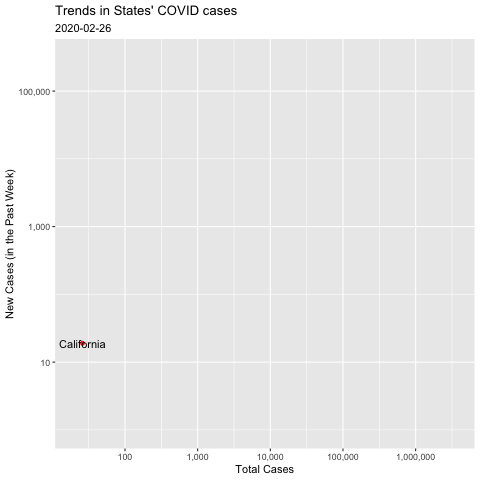

```r
library(tidyverse)     # for data cleaning and plotting
```

```
## ── Attaching packages ─────────────────────────────────────── tidyverse 1.3.0 ──
```

```
## ✓ ggplot2 3.3.3     ✓ purrr   0.3.4
## ✓ tibble  3.0.5     ✓ dplyr   1.0.3
## ✓ tidyr   1.1.2     ✓ stringr 1.4.0
## ✓ readr   1.4.0     ✓ forcats 0.5.0
```

```
## ── Conflicts ────────────────────────────────────────── tidyverse_conflicts() ──
## x dplyr::filter() masks stats::filter()
## x dplyr::lag()    masks stats::lag()
```

```r
library(gardenR)       # for Lisa's garden data
library(lubridate)     # for date manipulation
```

```
## 
## Attaching package: 'lubridate'
```

```
## The following objects are masked from 'package:base':
## 
##     date, intersect, setdiff, union
```

```r
library(openintro)     # for the abbr2state() function
```

```
## Loading required package: airports
```

```
## Loading required package: cherryblossom
```

```
## Loading required package: usdata
```

```r
library(palmerpenguins)# for Palmer penguin data
library(maps)          # for map data
```

```
## 
## Attaching package: 'maps'
```

```
## The following object is masked from 'package:purrr':
## 
##     map
```

```r
library(ggmap)         # for mapping points on maps
```

```
## Google's Terms of Service: https://cloud.google.com/maps-platform/terms/.
```

```
## Please cite ggmap if you use it! See citation("ggmap") for details.
```

```r
library(gplots)        # for col2hex() function
```

```
## 
## Attaching package: 'gplots'
```

```
## The following object is masked from 'package:stats':
## 
##     lowess
```

```r
library(RColorBrewer)  # for color palettes
library(sf)            # for working with spatial data
```

```
## Linking to GEOS 3.8.1, GDAL 3.1.4, PROJ 6.3.1
```

```r
library(leaflet)       # for highly customizable mapping
library(ggthemes)      # for more themes (including theme_map())
library(plotly)        # for the ggplotly() - basic interactivity
```

```
## 
## Attaching package: 'plotly'
```

```
## The following object is masked from 'package:ggmap':
## 
##     wind
```

```
## The following object is masked from 'package:ggplot2':
## 
##     last_plot
```

```
## The following object is masked from 'package:stats':
## 
##     filter
```

```
## The following object is masked from 'package:graphics':
## 
##     layout
```

```r
library(gganimate)     # for adding animation layers to ggplots
library(transformr)    # for "tweening" (gganimate)
```

```
## 
## Attaching package: 'transformr'
```

```
## The following object is masked from 'package:sf':
## 
##     st_normalize
```

```r
library(gifski)        # need the library for creating gifs but don't need to load each time
library(shiny)         # for creating interactive apps
theme_set(theme_minimal())
```


```r
# SNCF Train data
small_trains <- read_csv("https://raw.githubusercontent.com/rfordatascience/tidytuesday/master/data/2019/2019-02-26/small_trains.csv") 
```

```
## 
## ── Column specification ────────────────────────────────────────────────────────
## cols(
##   year = col_double(),
##   month = col_double(),
##   service = col_character(),
##   departure_station = col_character(),
##   arrival_station = col_character(),
##   journey_time_avg = col_double(),
##   total_num_trips = col_double(),
##   avg_delay_all_departing = col_double(),
##   avg_delay_all_arriving = col_double(),
##   num_late_at_departure = col_double(),
##   num_arriving_late = col_double(),
##   delay_cause = col_character(),
##   delayed_number = col_double()
## )
```

```r
# Lisa's garden data
data("garden_harvest")

# Lisa's Mallorca cycling data
mallorca_bike_day7 <- read_csv("https://www.dropbox.com/s/zc6jan4ltmjtvy0/mallorca_bike_day7.csv?dl=1") %>% 
  select(1:4, speed)
```

```
## 
## ── Column specification ────────────────────────────────────────────────────────
## cols(
##   lon = col_double(),
##   lat = col_double(),
##   ele = col_double(),
##   time = col_datetime(format = ""),
##   extensions = col_double(),
##   ele.num = col_double(),
##   date = col_date(format = ""),
##   hrminsec = col_datetime(format = ""),
##   time_hr = col_double(),
##   dist_km = col_double(),
##   speed = col_double()
## )
```

```r
# Heather Lendway's Ironman 70.3 Pan Am championships Panama data
panama_swim <- read_csv("https://raw.githubusercontent.com/llendway/gps-data/master/data/panama_swim_20160131.csv")
```

```
## 
## ── Column specification ────────────────────────────────────────────────────────
## cols(
##   lon = col_double(),
##   lat = col_double(),
##   time = col_datetime(format = ""),
##   extensions = col_double(),
##   ele = col_logical(),
##   event = col_character(),
##   date = col_date(format = ""),
##   hrminsec = col_datetime(format = "")
## )
```

```r
panama_bike <- read_csv("https://raw.githubusercontent.com/llendway/gps-data/master/data/panama_bike_20160131.csv")
```

```
## 
## ── Column specification ────────────────────────────────────────────────────────
## cols(
##   lon = col_double(),
##   lat = col_double(),
##   ele = col_double(),
##   time = col_datetime(format = ""),
##   extensions = col_double(),
##   event = col_character(),
##   date = col_date(format = ""),
##   hrminsec = col_datetime(format = "")
## )
```

```r
panama_run <- read_csv("https://raw.githubusercontent.com/llendway/gps-data/master/data/panama_run_20160131.csv")
```

```
## 
## ── Column specification ────────────────────────────────────────────────────────
## cols(
##   lon = col_double(),
##   lat = col_double(),
##   ele = col_double(),
##   time = col_datetime(format = ""),
##   extensions = col_double(),
##   event = col_character(),
##   date = col_date(format = ""),
##   hrminsec = col_datetime(format = "")
## )
```

```r
#COVID-19 data from the New York Times
covid19 <- read_csv("https://raw.githubusercontent.com/nytimes/covid-19-data/master/us-states.csv")
```

```
## 
## ── Column specification ────────────────────────────────────────────────────────
## cols(
##   date = col_date(format = ""),
##   state = col_character(),
##   fips = col_character(),
##   cases = col_double(),
##   deaths = col_double()
## )
```

```r
data_site <- 
  "https://www.macalester.edu/~dshuman1/data/112/2014-Q4-Trips-History-Data.rds" 
Trips <- readRDS(gzcon(url(data_site)))
Stations<-read_csv("http://www.macalester.edu/~dshuman1/data/112/DC-Stations.csv")
```

```
## 
## ── Column specification ────────────────────────────────────────────────────────
## cols(
##   name = col_character(),
##   lat = col_double(),
##   long = col_double(),
##   nbBikes = col_double(),
##   nbEmptyDocks = col_double()
## )
```

## Put your homework on GitHub!

Go [here](https://github.com/llendway/github_for_collaboration/blob/master/github_for_collaboration.md) or to previous homework to remind yourself how to get set up. 

Once your repository is created, you should always open your **project** rather than just opening an .Rmd file. You can do that by either clicking on the .Rproj file in your repository folder on your computer. Or, by going to the upper right hand corner in R Studio and clicking the arrow next to where it says Project: (None). You should see your project come up in that list if you've used it recently. You could also go to File --> Open Project and navigate to your .Rproj file. 

## Instructions

* Put your name at the top of the document. 

* **For ALL graphs, you should include appropriate labels.** 

* Feel free to change the default theme, which I currently have set to `theme_minimal()`. 

* Use good coding practice. Read the short sections on good code with [pipes](https://style.tidyverse.org/pipes.html) and [ggplot2](https://style.tidyverse.org/ggplot2.html). **This is part of your grade!**

* **NEW!!** With animated graphs, add `eval=FALSE` to the code chunk that creates the animation and saves it using `anim_save()`. Add another code chunk to reread the gif back into the file. See the [tutorial](https://animation-and-interactivity-in-r.netlify.app/) for help. 

* When you are finished with ALL the exercises, uncomment the options at the top so your document looks nicer. Don't do it before then, or else you might miss some important warnings and messages.

## Warm-up exercises from tutorial

  1. Choose 2 graphs you have created for ANY assignment in this class and add interactivity using the `ggplotly()` function.
  

```r
penguin_scatter <- penguins %>%
  ggplot(mapping = aes(x = bill_length_mm, y = bill_depth_mm, color = species)) +
  geom_point() +
  labs(title = "Relationship Between Bill Length and Bill Depth", x = "Bill Length (mm)",
       y = "Bill Depth (mm)") +
  theme_minimal()

ggplotly(penguin_scatter)
```

```{=html}
<div id="htmlwidget-e3133ec97401da9aa89a" style="width:672px;height:480px;" class="plotly html-widget"></div>
<script type="application/json" data-for="htmlwidget-e3133ec97401da9aa89a">{"x":{"data":[{"x":[39.1,39.5,40.3,null,36.7,39.3,38.9,39.2,34.1,42,37.8,37.8,41.1,38.6,34.6,36.6,38.7,42.5,34.4,46,37.8,37.7,35.9,38.2,38.8,35.3,40.6,40.5,37.9,40.5,39.5,37.2,39.5,40.9,36.4,39.2,38.8,42.2,37.6,39.8,36.5,40.8,36,44.1,37,39.6,41.1,37.5,36,42.3,39.6,40.1,35,42,34.5,41.4,39,40.6,36.5,37.6,35.7,41.3,37.6,41.1,36.4,41.6,35.5,41.1,35.9,41.8,33.5,39.7,39.6,45.8,35.5,42.8,40.9,37.2,36.2,42.1,34.6,42.9,36.7,35.1,37.3,41.3,36.3,36.9,38.3,38.9,35.7,41.1,34,39.6,36.2,40.8,38.1,40.3,33.1,43.2,35,41,37.7,37.8,37.9,39.7,38.6,38.2,38.1,43.2,38.1,45.6,39.7,42.2,39.6,42.7,38.6,37.3,35.7,41.1,36.2,37.7,40.2,41.4,35.2,40.6,38.8,41.5,39,44.1,38.5,43.1,36.8,37.5,38.1,41.1,35.6,40.2,37,39.7,40.2,40.6,32.1,40.7,37.3,39,39.2,36.6,36,37.8,36,41.5],"y":[18.7,17.4,18,null,19.3,20.6,17.8,19.6,18.1,20.2,17.1,17.3,17.6,21.2,21.1,17.8,19,20.7,18.4,21.5,18.3,18.7,19.2,18.1,17.2,18.9,18.6,17.9,18.6,18.9,16.7,18.1,17.8,18.9,17,21.1,20,18.5,19.3,19.1,18,18.4,18.5,19.7,16.9,18.8,19,18.9,17.9,21.2,17.7,18.9,17.9,19.5,18.1,18.6,17.5,18.8,16.6,19.1,16.9,21.1,17,18.2,17.1,18,16.2,19.1,16.6,19.4,19,18.4,17.2,18.9,17.5,18.5,16.8,19.4,16.1,19.1,17.2,17.6,18.8,19.4,17.8,20.3,19.5,18.6,19.2,18.8,18,18.1,17.1,18.1,17.3,18.9,18.6,18.5,16.1,18.5,17.9,20,16,20,18.6,18.9,17.2,20,17,19,16.5,20.3,17.7,19.5,20.7,18.3,17,20.5,17,18.6,17.2,19.8,17,18.5,15.9,19,17.6,18.3,17.1,18,17.9,19.2,18.5,18.5,17.6,17.5,17.5,20.1,16.5,17.9,17.1,17.2,15.5,17,16.8,18.7,18.6,18.4,17.8,18.1,17.1,18.5],"text":["bill_length_mm: 39.1<br />bill_depth_mm: 18.7<br />species: Adelie","bill_length_mm: 39.5<br />bill_depth_mm: 17.4<br />species: Adelie","bill_length_mm: 40.3<br />bill_depth_mm: 18.0<br />species: Adelie","bill_length_mm:   NA<br />bill_depth_mm:   NA<br />species: Adelie","bill_length_mm: 36.7<br />bill_depth_mm: 19.3<br />species: Adelie","bill_length_mm: 39.3<br />bill_depth_mm: 20.6<br />species: Adelie","bill_length_mm: 38.9<br />bill_depth_mm: 17.8<br />species: Adelie","bill_length_mm: 39.2<br />bill_depth_mm: 19.6<br />species: Adelie","bill_length_mm: 34.1<br />bill_depth_mm: 18.1<br />species: Adelie","bill_length_mm: 42.0<br />bill_depth_mm: 20.2<br />species: Adelie","bill_length_mm: 37.8<br />bill_depth_mm: 17.1<br />species: Adelie","bill_length_mm: 37.8<br />bill_depth_mm: 17.3<br />species: Adelie","bill_length_mm: 41.1<br />bill_depth_mm: 17.6<br />species: Adelie","bill_length_mm: 38.6<br />bill_depth_mm: 21.2<br />species: Adelie","bill_length_mm: 34.6<br />bill_depth_mm: 21.1<br />species: Adelie","bill_length_mm: 36.6<br />bill_depth_mm: 17.8<br />species: Adelie","bill_length_mm: 38.7<br />bill_depth_mm: 19.0<br />species: Adelie","bill_length_mm: 42.5<br />bill_depth_mm: 20.7<br />species: Adelie","bill_length_mm: 34.4<br />bill_depth_mm: 18.4<br />species: Adelie","bill_length_mm: 46.0<br />bill_depth_mm: 21.5<br />species: Adelie","bill_length_mm: 37.8<br />bill_depth_mm: 18.3<br />species: Adelie","bill_length_mm: 37.7<br />bill_depth_mm: 18.7<br />species: Adelie","bill_length_mm: 35.9<br />bill_depth_mm: 19.2<br />species: Adelie","bill_length_mm: 38.2<br />bill_depth_mm: 18.1<br />species: Adelie","bill_length_mm: 38.8<br />bill_depth_mm: 17.2<br />species: Adelie","bill_length_mm: 35.3<br />bill_depth_mm: 18.9<br />species: Adelie","bill_length_mm: 40.6<br />bill_depth_mm: 18.6<br />species: Adelie","bill_length_mm: 40.5<br />bill_depth_mm: 17.9<br />species: Adelie","bill_length_mm: 37.9<br />bill_depth_mm: 18.6<br />species: Adelie","bill_length_mm: 40.5<br />bill_depth_mm: 18.9<br />species: Adelie","bill_length_mm: 39.5<br />bill_depth_mm: 16.7<br />species: Adelie","bill_length_mm: 37.2<br />bill_depth_mm: 18.1<br />species: Adelie","bill_length_mm: 39.5<br />bill_depth_mm: 17.8<br />species: Adelie","bill_length_mm: 40.9<br />bill_depth_mm: 18.9<br />species: Adelie","bill_length_mm: 36.4<br />bill_depth_mm: 17.0<br />species: Adelie","bill_length_mm: 39.2<br />bill_depth_mm: 21.1<br />species: Adelie","bill_length_mm: 38.8<br />bill_depth_mm: 20.0<br />species: Adelie","bill_length_mm: 42.2<br />bill_depth_mm: 18.5<br />species: Adelie","bill_length_mm: 37.6<br />bill_depth_mm: 19.3<br />species: Adelie","bill_length_mm: 39.8<br />bill_depth_mm: 19.1<br />species: Adelie","bill_length_mm: 36.5<br />bill_depth_mm: 18.0<br />species: Adelie","bill_length_mm: 40.8<br />bill_depth_mm: 18.4<br />species: Adelie","bill_length_mm: 36.0<br />bill_depth_mm: 18.5<br />species: Adelie","bill_length_mm: 44.1<br />bill_depth_mm: 19.7<br />species: Adelie","bill_length_mm: 37.0<br />bill_depth_mm: 16.9<br />species: Adelie","bill_length_mm: 39.6<br />bill_depth_mm: 18.8<br />species: Adelie","bill_length_mm: 41.1<br />bill_depth_mm: 19.0<br />species: Adelie","bill_length_mm: 37.5<br />bill_depth_mm: 18.9<br />species: Adelie","bill_length_mm: 36.0<br />bill_depth_mm: 17.9<br />species: Adelie","bill_length_mm: 42.3<br />bill_depth_mm: 21.2<br />species: Adelie","bill_length_mm: 39.6<br />bill_depth_mm: 17.7<br />species: Adelie","bill_length_mm: 40.1<br />bill_depth_mm: 18.9<br />species: Adelie","bill_length_mm: 35.0<br />bill_depth_mm: 17.9<br />species: Adelie","bill_length_mm: 42.0<br />bill_depth_mm: 19.5<br />species: Adelie","bill_length_mm: 34.5<br />bill_depth_mm: 18.1<br />species: Adelie","bill_length_mm: 41.4<br />bill_depth_mm: 18.6<br />species: Adelie","bill_length_mm: 39.0<br />bill_depth_mm: 17.5<br />species: Adelie","bill_length_mm: 40.6<br />bill_depth_mm: 18.8<br />species: Adelie","bill_length_mm: 36.5<br />bill_depth_mm: 16.6<br />species: Adelie","bill_length_mm: 37.6<br />bill_depth_mm: 19.1<br />species: Adelie","bill_length_mm: 35.7<br />bill_depth_mm: 16.9<br />species: Adelie","bill_length_mm: 41.3<br />bill_depth_mm: 21.1<br />species: Adelie","bill_length_mm: 37.6<br />bill_depth_mm: 17.0<br />species: Adelie","bill_length_mm: 41.1<br />bill_depth_mm: 18.2<br />species: Adelie","bill_length_mm: 36.4<br />bill_depth_mm: 17.1<br />species: Adelie","bill_length_mm: 41.6<br />bill_depth_mm: 18.0<br />species: Adelie","bill_length_mm: 35.5<br />bill_depth_mm: 16.2<br />species: Adelie","bill_length_mm: 41.1<br />bill_depth_mm: 19.1<br />species: Adelie","bill_length_mm: 35.9<br />bill_depth_mm: 16.6<br />species: Adelie","bill_length_mm: 41.8<br />bill_depth_mm: 19.4<br />species: Adelie","bill_length_mm: 33.5<br />bill_depth_mm: 19.0<br />species: Adelie","bill_length_mm: 39.7<br />bill_depth_mm: 18.4<br />species: Adelie","bill_length_mm: 39.6<br />bill_depth_mm: 17.2<br />species: Adelie","bill_length_mm: 45.8<br />bill_depth_mm: 18.9<br />species: Adelie","bill_length_mm: 35.5<br />bill_depth_mm: 17.5<br />species: Adelie","bill_length_mm: 42.8<br />bill_depth_mm: 18.5<br />species: Adelie","bill_length_mm: 40.9<br />bill_depth_mm: 16.8<br />species: Adelie","bill_length_mm: 37.2<br />bill_depth_mm: 19.4<br />species: Adelie","bill_length_mm: 36.2<br />bill_depth_mm: 16.1<br />species: Adelie","bill_length_mm: 42.1<br />bill_depth_mm: 19.1<br />species: Adelie","bill_length_mm: 34.6<br />bill_depth_mm: 17.2<br />species: Adelie","bill_length_mm: 42.9<br />bill_depth_mm: 17.6<br />species: Adelie","bill_length_mm: 36.7<br />bill_depth_mm: 18.8<br />species: Adelie","bill_length_mm: 35.1<br />bill_depth_mm: 19.4<br />species: Adelie","bill_length_mm: 37.3<br />bill_depth_mm: 17.8<br />species: Adelie","bill_length_mm: 41.3<br />bill_depth_mm: 20.3<br />species: Adelie","bill_length_mm: 36.3<br />bill_depth_mm: 19.5<br />species: Adelie","bill_length_mm: 36.9<br />bill_depth_mm: 18.6<br />species: Adelie","bill_length_mm: 38.3<br />bill_depth_mm: 19.2<br />species: Adelie","bill_length_mm: 38.9<br />bill_depth_mm: 18.8<br />species: Adelie","bill_length_mm: 35.7<br />bill_depth_mm: 18.0<br />species: Adelie","bill_length_mm: 41.1<br />bill_depth_mm: 18.1<br />species: Adelie","bill_length_mm: 34.0<br />bill_depth_mm: 17.1<br />species: Adelie","bill_length_mm: 39.6<br />bill_depth_mm: 18.1<br />species: Adelie","bill_length_mm: 36.2<br />bill_depth_mm: 17.3<br />species: Adelie","bill_length_mm: 40.8<br />bill_depth_mm: 18.9<br />species: Adelie","bill_length_mm: 38.1<br />bill_depth_mm: 18.6<br />species: Adelie","bill_length_mm: 40.3<br />bill_depth_mm: 18.5<br />species: Adelie","bill_length_mm: 33.1<br />bill_depth_mm: 16.1<br />species: Adelie","bill_length_mm: 43.2<br />bill_depth_mm: 18.5<br />species: Adelie","bill_length_mm: 35.0<br />bill_depth_mm: 17.9<br />species: Adelie","bill_length_mm: 41.0<br />bill_depth_mm: 20.0<br />species: Adelie","bill_length_mm: 37.7<br />bill_depth_mm: 16.0<br />species: Adelie","bill_length_mm: 37.8<br />bill_depth_mm: 20.0<br />species: Adelie","bill_length_mm: 37.9<br />bill_depth_mm: 18.6<br />species: Adelie","bill_length_mm: 39.7<br />bill_depth_mm: 18.9<br />species: Adelie","bill_length_mm: 38.6<br />bill_depth_mm: 17.2<br />species: Adelie","bill_length_mm: 38.2<br />bill_depth_mm: 20.0<br />species: Adelie","bill_length_mm: 38.1<br />bill_depth_mm: 17.0<br />species: Adelie","bill_length_mm: 43.2<br />bill_depth_mm: 19.0<br />species: Adelie","bill_length_mm: 38.1<br />bill_depth_mm: 16.5<br />species: Adelie","bill_length_mm: 45.6<br />bill_depth_mm: 20.3<br />species: Adelie","bill_length_mm: 39.7<br />bill_depth_mm: 17.7<br />species: Adelie","bill_length_mm: 42.2<br />bill_depth_mm: 19.5<br />species: Adelie","bill_length_mm: 39.6<br />bill_depth_mm: 20.7<br />species: Adelie","bill_length_mm: 42.7<br />bill_depth_mm: 18.3<br />species: Adelie","bill_length_mm: 38.6<br />bill_depth_mm: 17.0<br />species: Adelie","bill_length_mm: 37.3<br />bill_depth_mm: 20.5<br />species: Adelie","bill_length_mm: 35.7<br />bill_depth_mm: 17.0<br />species: Adelie","bill_length_mm: 41.1<br />bill_depth_mm: 18.6<br />species: Adelie","bill_length_mm: 36.2<br />bill_depth_mm: 17.2<br />species: Adelie","bill_length_mm: 37.7<br />bill_depth_mm: 19.8<br />species: Adelie","bill_length_mm: 40.2<br />bill_depth_mm: 17.0<br />species: Adelie","bill_length_mm: 41.4<br />bill_depth_mm: 18.5<br />species: Adelie","bill_length_mm: 35.2<br />bill_depth_mm: 15.9<br />species: Adelie","bill_length_mm: 40.6<br />bill_depth_mm: 19.0<br />species: Adelie","bill_length_mm: 38.8<br />bill_depth_mm: 17.6<br />species: Adelie","bill_length_mm: 41.5<br />bill_depth_mm: 18.3<br />species: Adelie","bill_length_mm: 39.0<br />bill_depth_mm: 17.1<br />species: Adelie","bill_length_mm: 44.1<br />bill_depth_mm: 18.0<br />species: Adelie","bill_length_mm: 38.5<br />bill_depth_mm: 17.9<br />species: Adelie","bill_length_mm: 43.1<br />bill_depth_mm: 19.2<br />species: Adelie","bill_length_mm: 36.8<br />bill_depth_mm: 18.5<br />species: Adelie","bill_length_mm: 37.5<br />bill_depth_mm: 18.5<br />species: Adelie","bill_length_mm: 38.1<br />bill_depth_mm: 17.6<br />species: Adelie","bill_length_mm: 41.1<br />bill_depth_mm: 17.5<br />species: Adelie","bill_length_mm: 35.6<br />bill_depth_mm: 17.5<br />species: Adelie","bill_length_mm: 40.2<br />bill_depth_mm: 20.1<br />species: Adelie","bill_length_mm: 37.0<br />bill_depth_mm: 16.5<br />species: Adelie","bill_length_mm: 39.7<br />bill_depth_mm: 17.9<br />species: Adelie","bill_length_mm: 40.2<br />bill_depth_mm: 17.1<br />species: Adelie","bill_length_mm: 40.6<br />bill_depth_mm: 17.2<br />species: Adelie","bill_length_mm: 32.1<br />bill_depth_mm: 15.5<br />species: Adelie","bill_length_mm: 40.7<br />bill_depth_mm: 17.0<br />species: Adelie","bill_length_mm: 37.3<br />bill_depth_mm: 16.8<br />species: Adelie","bill_length_mm: 39.0<br />bill_depth_mm: 18.7<br />species: Adelie","bill_length_mm: 39.2<br />bill_depth_mm: 18.6<br />species: Adelie","bill_length_mm: 36.6<br />bill_depth_mm: 18.4<br />species: Adelie","bill_length_mm: 36.0<br />bill_depth_mm: 17.8<br />species: Adelie","bill_length_mm: 37.8<br />bill_depth_mm: 18.1<br />species: Adelie","bill_length_mm: 36.0<br />bill_depth_mm: 17.1<br />species: Adelie","bill_length_mm: 41.5<br />bill_depth_mm: 18.5<br />species: Adelie"],"type":"scatter","mode":"markers","marker":{"autocolorscale":false,"color":"rgba(248,118,109,1)","opacity":1,"size":5.66929133858268,"symbol":"circle","line":{"width":1.88976377952756,"color":"rgba(248,118,109,1)"}},"hoveron":"points","name":"Adelie","legendgroup":"Adelie","showlegend":true,"xaxis":"x","yaxis":"y","hoverinfo":"text","frame":null},{"x":[46.5,50,51.3,45.4,52.7,45.2,46.1,51.3,46,51.3,46.6,51.7,47,52,45.9,50.5,50.3,58,46.4,49.2,42.4,48.5,43.2,50.6,46.7,52,50.5,49.5,46.4,52.8,40.9,54.2,42.5,51,49.7,47.5,47.6,52,46.9,53.5,49,46.2,50.9,45.5,50.9,50.8,50.1,49,51.5,49.8,48.1,51.4,45.7,50.7,42.5,52.2,45.2,49.3,50.2,45.6,51.9,46.8,45.7,55.8,43.5,49.6,50.8,50.2],"y":[17.9,19.5,19.2,18.7,19.8,17.8,18.2,18.2,18.9,19.9,17.8,20.3,17.3,18.1,17.1,19.6,20,17.8,18.6,18.2,17.3,17.5,16.6,19.4,17.9,19,18.4,19,17.8,20,16.6,20.8,16.7,18.8,18.6,16.8,18.3,20.7,16.6,19.9,19.5,17.5,19.1,17,17.9,18.5,17.9,19.6,18.7,17.3,16.4,19,17.3,19.7,17.3,18.8,16.6,19.9,18.8,19.4,19.5,16.5,17,19.8,18.1,18.2,19,18.7],"text":["bill_length_mm: 46.5<br />bill_depth_mm: 17.9<br />species: Chinstrap","bill_length_mm: 50.0<br />bill_depth_mm: 19.5<br />species: Chinstrap","bill_length_mm: 51.3<br />bill_depth_mm: 19.2<br />species: Chinstrap","bill_length_mm: 45.4<br />bill_depth_mm: 18.7<br />species: Chinstrap","bill_length_mm: 52.7<br />bill_depth_mm: 19.8<br />species: Chinstrap","bill_length_mm: 45.2<br />bill_depth_mm: 17.8<br />species: Chinstrap","bill_length_mm: 46.1<br />bill_depth_mm: 18.2<br />species: Chinstrap","bill_length_mm: 51.3<br />bill_depth_mm: 18.2<br />species: Chinstrap","bill_length_mm: 46.0<br />bill_depth_mm: 18.9<br />species: Chinstrap","bill_length_mm: 51.3<br />bill_depth_mm: 19.9<br />species: Chinstrap","bill_length_mm: 46.6<br />bill_depth_mm: 17.8<br />species: Chinstrap","bill_length_mm: 51.7<br />bill_depth_mm: 20.3<br />species: Chinstrap","bill_length_mm: 47.0<br />bill_depth_mm: 17.3<br />species: Chinstrap","bill_length_mm: 52.0<br />bill_depth_mm: 18.1<br />species: Chinstrap","bill_length_mm: 45.9<br />bill_depth_mm: 17.1<br />species: Chinstrap","bill_length_mm: 50.5<br />bill_depth_mm: 19.6<br />species: Chinstrap","bill_length_mm: 50.3<br />bill_depth_mm: 20.0<br />species: Chinstrap","bill_length_mm: 58.0<br />bill_depth_mm: 17.8<br />species: Chinstrap","bill_length_mm: 46.4<br />bill_depth_mm: 18.6<br />species: Chinstrap","bill_length_mm: 49.2<br />bill_depth_mm: 18.2<br />species: Chinstrap","bill_length_mm: 42.4<br />bill_depth_mm: 17.3<br />species: Chinstrap","bill_length_mm: 48.5<br />bill_depth_mm: 17.5<br />species: Chinstrap","bill_length_mm: 43.2<br />bill_depth_mm: 16.6<br />species: Chinstrap","bill_length_mm: 50.6<br />bill_depth_mm: 19.4<br />species: Chinstrap","bill_length_mm: 46.7<br />bill_depth_mm: 17.9<br />species: Chinstrap","bill_length_mm: 52.0<br />bill_depth_mm: 19.0<br />species: Chinstrap","bill_length_mm: 50.5<br />bill_depth_mm: 18.4<br />species: Chinstrap","bill_length_mm: 49.5<br />bill_depth_mm: 19.0<br />species: Chinstrap","bill_length_mm: 46.4<br />bill_depth_mm: 17.8<br />species: Chinstrap","bill_length_mm: 52.8<br />bill_depth_mm: 20.0<br />species: Chinstrap","bill_length_mm: 40.9<br />bill_depth_mm: 16.6<br />species: Chinstrap","bill_length_mm: 54.2<br />bill_depth_mm: 20.8<br />species: Chinstrap","bill_length_mm: 42.5<br />bill_depth_mm: 16.7<br />species: Chinstrap","bill_length_mm: 51.0<br />bill_depth_mm: 18.8<br />species: Chinstrap","bill_length_mm: 49.7<br />bill_depth_mm: 18.6<br />species: Chinstrap","bill_length_mm: 47.5<br />bill_depth_mm: 16.8<br />species: Chinstrap","bill_length_mm: 47.6<br />bill_depth_mm: 18.3<br />species: Chinstrap","bill_length_mm: 52.0<br />bill_depth_mm: 20.7<br />species: Chinstrap","bill_length_mm: 46.9<br />bill_depth_mm: 16.6<br />species: Chinstrap","bill_length_mm: 53.5<br />bill_depth_mm: 19.9<br />species: Chinstrap","bill_length_mm: 49.0<br />bill_depth_mm: 19.5<br />species: Chinstrap","bill_length_mm: 46.2<br />bill_depth_mm: 17.5<br />species: Chinstrap","bill_length_mm: 50.9<br />bill_depth_mm: 19.1<br />species: Chinstrap","bill_length_mm: 45.5<br />bill_depth_mm: 17.0<br />species: Chinstrap","bill_length_mm: 50.9<br />bill_depth_mm: 17.9<br />species: Chinstrap","bill_length_mm: 50.8<br />bill_depth_mm: 18.5<br />species: Chinstrap","bill_length_mm: 50.1<br />bill_depth_mm: 17.9<br />species: Chinstrap","bill_length_mm: 49.0<br />bill_depth_mm: 19.6<br />species: Chinstrap","bill_length_mm: 51.5<br />bill_depth_mm: 18.7<br />species: Chinstrap","bill_length_mm: 49.8<br />bill_depth_mm: 17.3<br />species: Chinstrap","bill_length_mm: 48.1<br />bill_depth_mm: 16.4<br />species: Chinstrap","bill_length_mm: 51.4<br />bill_depth_mm: 19.0<br />species: Chinstrap","bill_length_mm: 45.7<br />bill_depth_mm: 17.3<br />species: Chinstrap","bill_length_mm: 50.7<br />bill_depth_mm: 19.7<br />species: Chinstrap","bill_length_mm: 42.5<br />bill_depth_mm: 17.3<br />species: Chinstrap","bill_length_mm: 52.2<br />bill_depth_mm: 18.8<br />species: Chinstrap","bill_length_mm: 45.2<br />bill_depth_mm: 16.6<br />species: Chinstrap","bill_length_mm: 49.3<br />bill_depth_mm: 19.9<br />species: Chinstrap","bill_length_mm: 50.2<br />bill_depth_mm: 18.8<br />species: Chinstrap","bill_length_mm: 45.6<br />bill_depth_mm: 19.4<br />species: Chinstrap","bill_length_mm: 51.9<br />bill_depth_mm: 19.5<br />species: Chinstrap","bill_length_mm: 46.8<br />bill_depth_mm: 16.5<br />species: Chinstrap","bill_length_mm: 45.7<br />bill_depth_mm: 17.0<br />species: Chinstrap","bill_length_mm: 55.8<br />bill_depth_mm: 19.8<br />species: Chinstrap","bill_length_mm: 43.5<br />bill_depth_mm: 18.1<br />species: Chinstrap","bill_length_mm: 49.6<br />bill_depth_mm: 18.2<br />species: Chinstrap","bill_length_mm: 50.8<br />bill_depth_mm: 19.0<br />species: Chinstrap","bill_length_mm: 50.2<br />bill_depth_mm: 18.7<br />species: Chinstrap"],"type":"scatter","mode":"markers","marker":{"autocolorscale":false,"color":"rgba(0,186,56,1)","opacity":1,"size":5.66929133858268,"symbol":"circle","line":{"width":1.88976377952756,"color":"rgba(0,186,56,1)"}},"hoveron":"points","name":"Chinstrap","legendgroup":"Chinstrap","showlegend":true,"xaxis":"x","yaxis":"y","hoverinfo":"text","frame":null},{"x":[46.1,50,48.7,50,47.6,46.5,45.4,46.7,43.3,46.8,40.9,49,45.5,48.4,45.8,49.3,42,49.2,46.2,48.7,50.2,45.1,46.5,46.3,42.9,46.1,44.5,47.8,48.2,50,47.3,42.8,45.1,59.6,49.1,48.4,42.6,44.4,44,48.7,42.7,49.6,45.3,49.6,50.5,43.6,45.5,50.5,44.9,45.2,46.6,48.5,45.1,50.1,46.5,45,43.8,45.5,43.2,50.4,45.3,46.2,45.7,54.3,45.8,49.8,46.2,49.5,43.5,50.7,47.7,46.4,48.2,46.5,46.4,48.6,47.5,51.1,45.2,45.2,49.1,52.5,47.4,50,44.9,50.8,43.4,51.3,47.5,52.1,47.5,52.2,45.5,49.5,44.5,50.8,49.4,46.9,48.4,51.1,48.5,55.9,47.2,49.1,47.3,46.8,41.7,53.4,43.3,48.1,50.5,49.8,43.5,51.5,46.2,55.1,44.5,48.8,47.2,null,46.8,50.4,45.2,49.9],"y":[13.2,16.3,14.1,15.2,14.5,13.5,14.6,15.3,13.4,15.4,13.7,16.1,13.7,14.6,14.6,15.7,13.5,15.2,14.5,15.1,14.3,14.5,14.5,15.8,13.1,15.1,14.3,15,14.3,15.3,15.3,14.2,14.5,17,14.8,16.3,13.7,17.3,13.6,15.7,13.7,16,13.7,15,15.9,13.9,13.9,15.9,13.3,15.8,14.2,14.1,14.4,15,14.4,15.4,13.9,15,14.5,15.3,13.8,14.9,13.9,15.7,14.2,16.8,14.4,16.2,14.2,15,15,15.6,15.6,14.8,15,16,14.2,16.3,13.8,16.4,14.5,15.6,14.6,15.9,13.8,17.3,14.4,14.2,14,17,15,17.1,14.5,16.1,14.7,15.7,15.8,14.6,14.4,16.5,15,17,15.5,15,13.8,16.1,14.7,15.8,14,15.1,15.2,15.9,15.2,16.3,14.1,16,15.7,16.2,13.7,null,14.3,15.7,14.8,16.1],"text":["bill_length_mm: 46.1<br />bill_depth_mm: 13.2<br />species: Gentoo","bill_length_mm: 50.0<br />bill_depth_mm: 16.3<br />species: Gentoo","bill_length_mm: 48.7<br />bill_depth_mm: 14.1<br />species: Gentoo","bill_length_mm: 50.0<br />bill_depth_mm: 15.2<br />species: Gentoo","bill_length_mm: 47.6<br />bill_depth_mm: 14.5<br />species: Gentoo","bill_length_mm: 46.5<br />bill_depth_mm: 13.5<br />species: Gentoo","bill_length_mm: 45.4<br />bill_depth_mm: 14.6<br />species: Gentoo","bill_length_mm: 46.7<br />bill_depth_mm: 15.3<br />species: Gentoo","bill_length_mm: 43.3<br />bill_depth_mm: 13.4<br />species: Gentoo","bill_length_mm: 46.8<br />bill_depth_mm: 15.4<br />species: Gentoo","bill_length_mm: 40.9<br />bill_depth_mm: 13.7<br />species: Gentoo","bill_length_mm: 49.0<br />bill_depth_mm: 16.1<br />species: Gentoo","bill_length_mm: 45.5<br />bill_depth_mm: 13.7<br />species: Gentoo","bill_length_mm: 48.4<br />bill_depth_mm: 14.6<br />species: Gentoo","bill_length_mm: 45.8<br />bill_depth_mm: 14.6<br />species: Gentoo","bill_length_mm: 49.3<br />bill_depth_mm: 15.7<br />species: Gentoo","bill_length_mm: 42.0<br />bill_depth_mm: 13.5<br />species: Gentoo","bill_length_mm: 49.2<br />bill_depth_mm: 15.2<br />species: Gentoo","bill_length_mm: 46.2<br />bill_depth_mm: 14.5<br />species: Gentoo","bill_length_mm: 48.7<br />bill_depth_mm: 15.1<br />species: Gentoo","bill_length_mm: 50.2<br />bill_depth_mm: 14.3<br />species: Gentoo","bill_length_mm: 45.1<br />bill_depth_mm: 14.5<br />species: Gentoo","bill_length_mm: 46.5<br />bill_depth_mm: 14.5<br />species: Gentoo","bill_length_mm: 46.3<br />bill_depth_mm: 15.8<br />species: Gentoo","bill_length_mm: 42.9<br />bill_depth_mm: 13.1<br />species: Gentoo","bill_length_mm: 46.1<br />bill_depth_mm: 15.1<br />species: Gentoo","bill_length_mm: 44.5<br />bill_depth_mm: 14.3<br />species: Gentoo","bill_length_mm: 47.8<br />bill_depth_mm: 15.0<br />species: Gentoo","bill_length_mm: 48.2<br />bill_depth_mm: 14.3<br />species: Gentoo","bill_length_mm: 50.0<br />bill_depth_mm: 15.3<br />species: Gentoo","bill_length_mm: 47.3<br />bill_depth_mm: 15.3<br />species: Gentoo","bill_length_mm: 42.8<br />bill_depth_mm: 14.2<br />species: Gentoo","bill_length_mm: 45.1<br />bill_depth_mm: 14.5<br />species: Gentoo","bill_length_mm: 59.6<br />bill_depth_mm: 17.0<br />species: Gentoo","bill_length_mm: 49.1<br />bill_depth_mm: 14.8<br />species: Gentoo","bill_length_mm: 48.4<br />bill_depth_mm: 16.3<br />species: Gentoo","bill_length_mm: 42.6<br />bill_depth_mm: 13.7<br />species: Gentoo","bill_length_mm: 44.4<br />bill_depth_mm: 17.3<br />species: Gentoo","bill_length_mm: 44.0<br />bill_depth_mm: 13.6<br />species: Gentoo","bill_length_mm: 48.7<br />bill_depth_mm: 15.7<br />species: Gentoo","bill_length_mm: 42.7<br />bill_depth_mm: 13.7<br />species: Gentoo","bill_length_mm: 49.6<br />bill_depth_mm: 16.0<br />species: Gentoo","bill_length_mm: 45.3<br />bill_depth_mm: 13.7<br />species: Gentoo","bill_length_mm: 49.6<br />bill_depth_mm: 15.0<br />species: Gentoo","bill_length_mm: 50.5<br />bill_depth_mm: 15.9<br />species: Gentoo","bill_length_mm: 43.6<br />bill_depth_mm: 13.9<br />species: Gentoo","bill_length_mm: 45.5<br />bill_depth_mm: 13.9<br />species: Gentoo","bill_length_mm: 50.5<br />bill_depth_mm: 15.9<br />species: Gentoo","bill_length_mm: 44.9<br />bill_depth_mm: 13.3<br />species: Gentoo","bill_length_mm: 45.2<br />bill_depth_mm: 15.8<br />species: Gentoo","bill_length_mm: 46.6<br />bill_depth_mm: 14.2<br />species: Gentoo","bill_length_mm: 48.5<br />bill_depth_mm: 14.1<br />species: Gentoo","bill_length_mm: 45.1<br />bill_depth_mm: 14.4<br />species: Gentoo","bill_length_mm: 50.1<br />bill_depth_mm: 15.0<br />species: Gentoo","bill_length_mm: 46.5<br />bill_depth_mm: 14.4<br />species: Gentoo","bill_length_mm: 45.0<br />bill_depth_mm: 15.4<br />species: Gentoo","bill_length_mm: 43.8<br />bill_depth_mm: 13.9<br />species: Gentoo","bill_length_mm: 45.5<br />bill_depth_mm: 15.0<br />species: Gentoo","bill_length_mm: 43.2<br />bill_depth_mm: 14.5<br />species: Gentoo","bill_length_mm: 50.4<br />bill_depth_mm: 15.3<br />species: Gentoo","bill_length_mm: 45.3<br />bill_depth_mm: 13.8<br />species: Gentoo","bill_length_mm: 46.2<br />bill_depth_mm: 14.9<br />species: Gentoo","bill_length_mm: 45.7<br />bill_depth_mm: 13.9<br />species: Gentoo","bill_length_mm: 54.3<br />bill_depth_mm: 15.7<br />species: Gentoo","bill_length_mm: 45.8<br />bill_depth_mm: 14.2<br />species: Gentoo","bill_length_mm: 49.8<br />bill_depth_mm: 16.8<br />species: Gentoo","bill_length_mm: 46.2<br />bill_depth_mm: 14.4<br />species: Gentoo","bill_length_mm: 49.5<br />bill_depth_mm: 16.2<br />species: Gentoo","bill_length_mm: 43.5<br />bill_depth_mm: 14.2<br />species: Gentoo","bill_length_mm: 50.7<br />bill_depth_mm: 15.0<br />species: Gentoo","bill_length_mm: 47.7<br />bill_depth_mm: 15.0<br />species: Gentoo","bill_length_mm: 46.4<br />bill_depth_mm: 15.6<br />species: Gentoo","bill_length_mm: 48.2<br />bill_depth_mm: 15.6<br />species: Gentoo","bill_length_mm: 46.5<br />bill_depth_mm: 14.8<br />species: Gentoo","bill_length_mm: 46.4<br />bill_depth_mm: 15.0<br />species: Gentoo","bill_length_mm: 48.6<br />bill_depth_mm: 16.0<br />species: Gentoo","bill_length_mm: 47.5<br />bill_depth_mm: 14.2<br />species: Gentoo","bill_length_mm: 51.1<br />bill_depth_mm: 16.3<br />species: Gentoo","bill_length_mm: 45.2<br />bill_depth_mm: 13.8<br />species: Gentoo","bill_length_mm: 45.2<br />bill_depth_mm: 16.4<br />species: Gentoo","bill_length_mm: 49.1<br />bill_depth_mm: 14.5<br />species: Gentoo","bill_length_mm: 52.5<br />bill_depth_mm: 15.6<br />species: Gentoo","bill_length_mm: 47.4<br />bill_depth_mm: 14.6<br />species: Gentoo","bill_length_mm: 50.0<br />bill_depth_mm: 15.9<br />species: Gentoo","bill_length_mm: 44.9<br />bill_depth_mm: 13.8<br />species: Gentoo","bill_length_mm: 50.8<br />bill_depth_mm: 17.3<br />species: Gentoo","bill_length_mm: 43.4<br />bill_depth_mm: 14.4<br />species: Gentoo","bill_length_mm: 51.3<br />bill_depth_mm: 14.2<br />species: Gentoo","bill_length_mm: 47.5<br />bill_depth_mm: 14.0<br />species: Gentoo","bill_length_mm: 52.1<br />bill_depth_mm: 17.0<br />species: Gentoo","bill_length_mm: 47.5<br />bill_depth_mm: 15.0<br />species: Gentoo","bill_length_mm: 52.2<br />bill_depth_mm: 17.1<br />species: Gentoo","bill_length_mm: 45.5<br />bill_depth_mm: 14.5<br />species: Gentoo","bill_length_mm: 49.5<br />bill_depth_mm: 16.1<br />species: Gentoo","bill_length_mm: 44.5<br />bill_depth_mm: 14.7<br />species: Gentoo","bill_length_mm: 50.8<br />bill_depth_mm: 15.7<br />species: Gentoo","bill_length_mm: 49.4<br />bill_depth_mm: 15.8<br />species: Gentoo","bill_length_mm: 46.9<br />bill_depth_mm: 14.6<br />species: Gentoo","bill_length_mm: 48.4<br />bill_depth_mm: 14.4<br />species: Gentoo","bill_length_mm: 51.1<br />bill_depth_mm: 16.5<br />species: Gentoo","bill_length_mm: 48.5<br />bill_depth_mm: 15.0<br />species: Gentoo","bill_length_mm: 55.9<br />bill_depth_mm: 17.0<br />species: Gentoo","bill_length_mm: 47.2<br />bill_depth_mm: 15.5<br />species: Gentoo","bill_length_mm: 49.1<br />bill_depth_mm: 15.0<br />species: Gentoo","bill_length_mm: 47.3<br />bill_depth_mm: 13.8<br />species: Gentoo","bill_length_mm: 46.8<br />bill_depth_mm: 16.1<br />species: Gentoo","bill_length_mm: 41.7<br />bill_depth_mm: 14.7<br />species: Gentoo","bill_length_mm: 53.4<br />bill_depth_mm: 15.8<br />species: Gentoo","bill_length_mm: 43.3<br />bill_depth_mm: 14.0<br />species: Gentoo","bill_length_mm: 48.1<br />bill_depth_mm: 15.1<br />species: Gentoo","bill_length_mm: 50.5<br />bill_depth_mm: 15.2<br />species: Gentoo","bill_length_mm: 49.8<br />bill_depth_mm: 15.9<br />species: Gentoo","bill_length_mm: 43.5<br />bill_depth_mm: 15.2<br />species: Gentoo","bill_length_mm: 51.5<br />bill_depth_mm: 16.3<br />species: Gentoo","bill_length_mm: 46.2<br />bill_depth_mm: 14.1<br />species: Gentoo","bill_length_mm: 55.1<br />bill_depth_mm: 16.0<br />species: Gentoo","bill_length_mm: 44.5<br />bill_depth_mm: 15.7<br />species: Gentoo","bill_length_mm: 48.8<br />bill_depth_mm: 16.2<br />species: Gentoo","bill_length_mm: 47.2<br />bill_depth_mm: 13.7<br />species: Gentoo","bill_length_mm:   NA<br />bill_depth_mm:   NA<br />species: Gentoo","bill_length_mm: 46.8<br />bill_depth_mm: 14.3<br />species: Gentoo","bill_length_mm: 50.4<br />bill_depth_mm: 15.7<br />species: Gentoo","bill_length_mm: 45.2<br />bill_depth_mm: 14.8<br />species: Gentoo","bill_length_mm: 49.9<br />bill_depth_mm: 16.1<br />species: Gentoo"],"type":"scatter","mode":"markers","marker":{"autocolorscale":false,"color":"rgba(97,156,255,1)","opacity":1,"size":5.66929133858268,"symbol":"circle","line":{"width":1.88976377952756,"color":"rgba(97,156,255,1)"}},"hoveron":"points","name":"Gentoo","legendgroup":"Gentoo","showlegend":true,"xaxis":"x","yaxis":"y","hoverinfo":"text","frame":null}],"layout":{"margin":{"t":43.7625570776256,"r":7.30593607305936,"b":40.1826484018265,"l":48.9497716894977},"font":{"color":"rgba(0,0,0,1)","family":"","size":14.6118721461187},"title":{"text":"Relationship Between Bill Length and Bill Depth","font":{"color":"rgba(0,0,0,1)","family":"","size":17.5342465753425},"x":0,"xref":"paper"},"xaxis":{"domain":[0,1],"automargin":true,"type":"linear","autorange":false,"range":[30.725,60.975],"tickmode":"array","ticktext":["40","50","60"],"tickvals":[40,50,60],"categoryorder":"array","categoryarray":["40","50","60"],"nticks":null,"ticks":"","tickcolor":null,"ticklen":3.65296803652968,"tickwidth":0,"showticklabels":true,"tickfont":{"color":"rgba(77,77,77,1)","family":"","size":11.689497716895},"tickangle":-0,"showline":false,"linecolor":null,"linewidth":0,"showgrid":true,"gridcolor":"rgba(235,235,235,1)","gridwidth":0.66417600664176,"zeroline":false,"anchor":"y","title":{"text":"Bill Length (mm)","font":{"color":"rgba(0,0,0,1)","family":"","size":14.6118721461187}},"hoverformat":".2f"},"yaxis":{"domain":[0,1],"automargin":true,"type":"linear","autorange":false,"range":[12.68,21.92],"tickmode":"array","ticktext":["15.0","17.5","20.0"],"tickvals":[15,17.5,20],"categoryorder":"array","categoryarray":["15.0","17.5","20.0"],"nticks":null,"ticks":"","tickcolor":null,"ticklen":3.65296803652968,"tickwidth":0,"showticklabels":true,"tickfont":{"color":"rgba(77,77,77,1)","family":"","size":11.689497716895},"tickangle":-0,"showline":false,"linecolor":null,"linewidth":0,"showgrid":true,"gridcolor":"rgba(235,235,235,1)","gridwidth":0.66417600664176,"zeroline":false,"anchor":"x","title":{"text":"Bill Depth (mm)","font":{"color":"rgba(0,0,0,1)","family":"","size":14.6118721461187}},"hoverformat":".2f"},"shapes":[{"type":"rect","fillcolor":null,"line":{"color":null,"width":0,"linetype":[]},"yref":"paper","xref":"paper","x0":0,"x1":1,"y0":0,"y1":1}],"showlegend":true,"legend":{"bgcolor":null,"bordercolor":null,"borderwidth":0,"font":{"color":"rgba(0,0,0,1)","family":"","size":11.689497716895},"y":0.913385826771654},"annotations":[{"text":"species","x":1.02,"y":1,"showarrow":false,"ax":0,"ay":0,"font":{"color":"rgba(0,0,0,1)","family":"","size":14.6118721461187},"xref":"paper","yref":"paper","textangle":-0,"xanchor":"left","yanchor":"bottom","legendTitle":true}],"hovermode":"closest","barmode":"relative"},"config":{"doubleClick":"reset","showSendToCloud":false},"source":"A","attrs":{"16fa0255e3a94":{"x":{},"y":{},"colour":{},"type":"scatter"}},"cur_data":"16fa0255e3a94","visdat":{"16fa0255e3a94":["function (y) ","x"]},"highlight":{"on":"plotly_click","persistent":false,"dynamic":false,"selectize":false,"opacityDim":0.2,"selected":{"opacity":1},"debounce":0},"shinyEvents":["plotly_hover","plotly_click","plotly_selected","plotly_relayout","plotly_brushed","plotly_brushing","plotly_clickannotation","plotly_doubleclick","plotly_deselect","plotly_afterplot","plotly_sunburstclick"],"base_url":"https://plot.ly"},"evals":[],"jsHooks":[]}</script>
```
  

```r
options(scipen = 10)
bike_density <- Trips %>% 
  mutate(hour = hour(sdate),
         minute = minute(sdate),
         time_day = hour + minute/60,
         day = wday(sdate, label = TRUE)) %>% 
  ggplot(mapping = aes(x = time_day, fill = client)) +
  geom_density(color = NA, alpha = .5) +
  xlim(0, 24)+
  labs(title = "Number of bike rentals by time of day, separated by day of the week",
       x = "Time of Day",
       y = "Density",
       fill = "Client Type") +
  facet_wrap(vars(day))

ggplotly(bike_density)
```

```{=html}
<div id="htmlwidget-968f6dd3851b907a9d8e" style="width:672px;height:480px;" class="plotly html-widget"></div>
<script type="application/json" data-for="htmlwidget-968f6dd3851b907a9d8e">{"x":{"data":[{"x":[0,0.0469667318982387,0.0939334637964775,0.140900195694716,0.187866927592955,0.234833659491194,0.281800391389432,0.328767123287671,0.37573385518591,0.422700587084149,0.469667318982387,0.516634050880626,0.563600782778865,0.610567514677104,0.657534246575342,0.704500978473581,0.75146771037182,0.798434442270059,0.845401174168297,0.892367906066536,0.939334637964775,0.986301369863014,1.03326810176125,1.08023483365949,1.12720156555773,1.17416829745597,1.22113502935421,1.26810176125245,1.31506849315068,1.36203522504892,1.40900195694716,1.4559686888454,1.50293542074364,1.54990215264188,1.59686888454012,1.64383561643836,1.69080234833659,1.73776908023483,1.78473581213307,1.83170254403131,1.87866927592955,1.92563600782779,1.97260273972603,2.01956947162427,2.0665362035225,2.11350293542074,2.16046966731898,2.20743639921722,2.25440313111546,2.3013698630137,2.34833659491194,2.39530332681018,2.44227005870841,2.48923679060665,2.53620352250489,2.58317025440313,2.63013698630137,2.67710371819961,2.72407045009785,2.77103718199609,2.81800391389432,2.86497064579256,2.9119373776908,2.95890410958904,3.00587084148728,3.05283757338552,3.09980430528376,3.146771037182,3.19373776908023,3.24070450097847,3.28767123287671,3.33463796477495,3.38160469667319,3.42857142857143,3.47553816046967,3.52250489236791,3.56947162426614,3.61643835616438,3.66340508806262,3.71037181996086,3.7573385518591,3.80430528375734,3.85127201565558,3.89823874755382,3.94520547945205,3.99217221135029,4.03913894324853,4.08610567514677,4.13307240704501,4.18003913894325,4.22700587084149,4.27397260273973,4.32093933463796,4.3679060665362,4.41487279843444,4.46183953033268,4.50880626223092,4.55577299412916,4.6027397260274,4.64970645792564,4.69667318982387,4.74363992172211,4.79060665362035,4.83757338551859,4.88454011741683,4.93150684931507,4.97847358121331,5.02544031311155,5.07240704500978,5.11937377690802,5.16634050880626,5.2133072407045,5.26027397260274,5.30724070450098,5.35420743639922,5.40117416829746,5.44814090019569,5.49510763209393,5.54207436399217,5.58904109589041,5.63600782778865,5.68297455968689,5.72994129158513,5.77690802348337,5.8238747553816,5.87084148727984,5.91780821917808,5.96477495107632,6.01174168297456,6.0587084148728,6.10567514677104,6.15264187866928,6.19960861056751,6.24657534246575,6.29354207436399,6.34050880626223,6.38747553816047,6.43444227005871,6.48140900195695,6.52837573385519,6.57534246575342,6.62230919765166,6.6692759295499,6.71624266144814,6.76320939334638,6.81017612524462,6.85714285714286,6.9041095890411,6.95107632093933,6.99804305283757,7.04500978473581,7.09197651663405,7.13894324853229,7.18590998043053,7.23287671232877,7.27984344422701,7.32681017612524,7.37377690802348,7.42074363992172,7.46771037181996,7.5146771037182,7.56164383561644,7.60861056751468,7.65557729941291,7.70254403131115,7.74951076320939,7.79647749510763,7.84344422700587,7.89041095890411,7.93737769080235,7.98434442270059,8.03131115459882,8.07827788649706,8.1252446183953,8.17221135029354,8.21917808219178,8.26614481409002,8.31311154598826,8.3600782778865,8.40704500978473,8.45401174168297,8.50097847358121,8.54794520547945,8.59491193737769,8.64187866927593,8.68884540117417,8.73581213307241,8.78277886497064,8.82974559686888,8.87671232876712,8.92367906066536,8.9706457925636,9.01761252446184,9.06457925636008,9.11154598825832,9.15851272015655,9.20547945205479,9.25244618395303,9.29941291585127,9.34637964774951,9.39334637964775,9.44031311154599,9.48727984344423,9.53424657534246,9.5812133072407,9.62818003913894,9.67514677103718,9.72211350293542,9.76908023483366,9.8160469667319,9.86301369863014,9.90998043052837,9.95694716242661,10.0039138943249,10.0508806262231,10.0978473581213,10.1448140900196,10.1917808219178,10.238747553816,10.2857142857143,10.3326810176125,10.3796477495108,10.426614481409,10.4735812133072,10.5205479452055,10.5675146771037,10.614481409002,10.6614481409002,10.7084148727984,10.7553816046967,10.8023483365949,10.8493150684931,10.8962818003914,10.9432485322896,10.9902152641879,11.0371819960861,11.0841487279843,11.1311154598826,11.1780821917808,11.2250489236791,11.2720156555773,11.3189823874755,11.3659491193738,11.412915851272,11.4598825831703,11.5068493150685,11.5538160469667,11.600782778865,11.6477495107632,11.6947162426614,11.7416829745597,11.7886497064579,11.8356164383562,11.8825831702544,11.9295499021526,11.9765166340509,12.0234833659491,12.0704500978474,12.1174168297456,12.1643835616438,12.2113502935421,12.2583170254403,12.3052837573386,12.3522504892368,12.399217221135,12.4461839530333,12.4931506849315,12.5401174168297,12.587084148728,12.6340508806262,12.6810176125245,12.7279843444227,12.7749510763209,12.8219178082192,12.8688845401174,12.9158512720157,12.9628180039139,13.0097847358121,13.0567514677104,13.1037181996086,13.1506849315068,13.1976516634051,13.2446183953033,13.2915851272016,13.3385518590998,13.385518590998,13.4324853228963,13.4794520547945,13.5264187866928,13.573385518591,13.6203522504892,13.6673189823875,13.7142857142857,13.761252446184,13.8082191780822,13.8551859099804,13.9021526418787,13.9491193737769,13.9960861056751,14.0430528375734,14.0900195694716,14.1369863013699,14.1839530332681,14.2309197651663,14.2778864970646,14.3248532289628,14.3718199608611,14.4187866927593,14.4657534246575,14.5127201565558,14.559686888454,14.6066536203522,14.6536203522505,14.7005870841487,14.747553816047,14.7945205479452,14.8414872798434,14.8884540117417,14.9354207436399,14.9823874755382,15.0293542074364,15.0763209393346,15.1232876712329,15.1702544031311,15.2172211350294,15.2641878669276,15.3111545988258,15.3581213307241,15.4050880626223,15.4520547945205,15.4990215264188,15.545988258317,15.5929549902153,15.6399217221135,15.6868884540117,15.73385518591,15.7808219178082,15.8277886497065,15.8747553816047,15.9217221135029,15.9686888454012,16.0156555772994,16.0626223091976,16.1095890410959,16.1565557729941,16.2035225048924,16.2504892367906,16.2974559686888,16.3444227005871,16.3913894324853,16.4383561643836,16.4853228962818,16.53228962818,16.5792563600783,16.6262230919765,16.6731898238748,16.720156555773,16.7671232876712,16.8140900195695,16.8610567514677,16.9080234833659,16.9549902152642,17.0019569471624,17.0489236790607,17.0958904109589,17.1428571428571,17.1898238747554,17.2367906066536,17.2837573385519,17.3307240704501,17.3776908023483,17.4246575342466,17.4716242661448,17.5185909980431,17.5655577299413,17.6125244618395,17.6594911937378,17.706457925636,17.7534246575342,17.8003913894325,17.8473581213307,17.894324853229,17.9412915851272,17.9882583170254,18.0352250489237,18.0821917808219,18.1291585127202,18.1761252446184,18.2230919765166,18.2700587084149,18.3170254403131,18.3639921722114,18.4109589041096,18.4579256360078,18.5048923679061,18.5518590998043,18.5988258317025,18.6457925636008,18.692759295499,18.7397260273973,18.7866927592955,18.8336594911937,18.880626223092,18.9275929549902,18.9745596868885,19.0215264187867,19.0684931506849,19.1154598825832,19.1624266144814,19.2093933463796,19.2563600782779,19.3033268101761,19.3502935420744,19.3972602739726,19.4442270058708,19.4911937377691,19.5381604696673,19.5851272015656,19.6320939334638,19.679060665362,19.7260273972603,19.7729941291585,19.8199608610567,19.866927592955,19.9138943248532,19.9608610567515,20.0078277886497,20.0547945205479,20.1017612524462,20.1487279843444,20.1956947162427,20.2426614481409,20.2896281800391,20.3365949119374,20.3835616438356,20.4305283757339,20.4774951076321,20.5244618395303,20.5714285714286,20.6183953033268,20.665362035225,20.7123287671233,20.7592954990215,20.8062622309198,20.853228962818,20.9001956947162,20.9471624266145,20.9941291585127,21.041095890411,21.0880626223092,21.1350293542074,21.1819960861057,21.2289628180039,21.2759295499022,21.3228962818004,21.3698630136986,21.4168297455969,21.4637964774951,21.5107632093933,21.5577299412916,21.6046966731898,21.6516634050881,21.6986301369863,21.7455968688845,21.7925636007828,21.839530332681,21.8864970645793,21.9334637964775,21.9804305283757,22.027397260274,22.0743639921722,22.1213307240705,22.1682974559687,22.2152641878669,22.2622309197652,22.3091976516634,22.3561643835616,22.4031311154599,22.4500978473581,22.4970645792564,22.5440313111546,22.5909980430528,22.6379647749511,22.6849315068493,22.7318982387476,22.7788649706458,22.825831702544,22.8727984344423,22.9197651663405,22.9667318982387,23.013698630137,23.0606653620352,23.1076320939335,23.1545988258317,23.2015655577299,23.2485322896282,23.2954990215264,23.3424657534247,23.3894324853229,23.4363992172211,23.4833659491194,23.5303326810176,23.5772994129158,23.6242661448141,23.6712328767123,23.7181996086106,23.7651663405088,23.812133072407,23.8590998043053,23.9060665362035,23.9530332681018,24,24,23.9530332681018,23.9060665362035,23.8590998043053,23.812133072407,23.7651663405088,23.7181996086106,23.6712328767123,23.6242661448141,23.5772994129158,23.5303326810176,23.4833659491194,23.4363992172211,23.3894324853229,23.3424657534247,23.2954990215264,23.2485322896282,23.2015655577299,23.1545988258317,23.1076320939335,23.0606653620352,23.013698630137,22.9667318982387,22.9197651663405,22.8727984344423,22.825831702544,22.7788649706458,22.7318982387476,22.6849315068493,22.6379647749511,22.5909980430528,22.5440313111546,22.4970645792564,22.4500978473581,22.4031311154599,22.3561643835616,22.3091976516634,22.2622309197652,22.2152641878669,22.1682974559687,22.1213307240705,22.0743639921722,22.027397260274,21.9804305283757,21.9334637964775,21.8864970645793,21.839530332681,21.7925636007828,21.7455968688845,21.6986301369863,21.6516634050881,21.6046966731898,21.5577299412916,21.5107632093933,21.4637964774951,21.4168297455969,21.3698630136986,21.3228962818004,21.2759295499022,21.2289628180039,21.1819960861057,21.1350293542074,21.0880626223092,21.041095890411,20.9941291585127,20.9471624266145,20.9001956947162,20.853228962818,20.8062622309198,20.7592954990215,20.7123287671233,20.665362035225,20.6183953033268,20.5714285714286,20.5244618395303,20.4774951076321,20.4305283757339,20.3835616438356,20.3365949119374,20.2896281800391,20.2426614481409,20.1956947162427,20.1487279843444,20.1017612524462,20.0547945205479,20.0078277886497,19.9608610567515,19.9138943248532,19.866927592955,19.8199608610567,19.7729941291585,19.7260273972603,19.679060665362,19.6320939334638,19.5851272015656,19.5381604696673,19.4911937377691,19.4442270058708,19.3972602739726,19.3502935420744,19.3033268101761,19.2563600782779,19.2093933463796,19.1624266144814,19.1154598825832,19.0684931506849,19.0215264187867,18.9745596868885,18.9275929549902,18.880626223092,18.8336594911937,18.7866927592955,18.7397260273973,18.692759295499,18.6457925636008,18.5988258317025,18.5518590998043,18.5048923679061,18.4579256360078,18.4109589041096,18.3639921722114,18.3170254403131,18.2700587084149,18.2230919765166,18.1761252446184,18.1291585127202,18.0821917808219,18.0352250489237,17.9882583170254,17.9412915851272,17.894324853229,17.8473581213307,17.8003913894325,17.7534246575342,17.706457925636,17.6594911937378,17.6125244618395,17.5655577299413,17.5185909980431,17.4716242661448,17.4246575342466,17.3776908023483,17.3307240704501,17.2837573385519,17.2367906066536,17.1898238747554,17.1428571428571,17.0958904109589,17.0489236790607,17.0019569471624,16.9549902152642,16.9080234833659,16.8610567514677,16.8140900195695,16.7671232876712,16.720156555773,16.6731898238748,16.6262230919765,16.5792563600783,16.53228962818,16.4853228962818,16.4383561643836,16.3913894324853,16.3444227005871,16.2974559686888,16.2504892367906,16.2035225048924,16.1565557729941,16.1095890410959,16.0626223091976,16.0156555772994,15.9686888454012,15.9217221135029,15.8747553816047,15.8277886497065,15.7808219178082,15.73385518591,15.6868884540117,15.6399217221135,15.5929549902153,15.545988258317,15.4990215264188,15.4520547945205,15.4050880626223,15.3581213307241,15.3111545988258,15.2641878669276,15.2172211350294,15.1702544031311,15.1232876712329,15.0763209393346,15.0293542074364,14.9823874755382,14.9354207436399,14.8884540117417,14.8414872798434,14.7945205479452,14.747553816047,14.7005870841487,14.6536203522505,14.6066536203522,14.559686888454,14.5127201565558,14.4657534246575,14.4187866927593,14.3718199608611,14.3248532289628,14.2778864970646,14.2309197651663,14.1839530332681,14.1369863013699,14.0900195694716,14.0430528375734,13.9960861056751,13.9491193737769,13.9021526418787,13.8551859099804,13.8082191780822,13.761252446184,13.7142857142857,13.6673189823875,13.6203522504892,13.573385518591,13.5264187866928,13.4794520547945,13.4324853228963,13.385518590998,13.3385518590998,13.2915851272016,13.2446183953033,13.1976516634051,13.1506849315068,13.1037181996086,13.0567514677104,13.0097847358121,12.9628180039139,12.9158512720157,12.8688845401174,12.8219178082192,12.7749510763209,12.7279843444227,12.6810176125245,12.6340508806262,12.587084148728,12.5401174168297,12.4931506849315,12.4461839530333,12.399217221135,12.3522504892368,12.3052837573386,12.2583170254403,12.2113502935421,12.1643835616438,12.1174168297456,12.0704500978474,12.0234833659491,11.9765166340509,11.9295499021526,11.8825831702544,11.8356164383562,11.7886497064579,11.7416829745597,11.6947162426614,11.6477495107632,11.600782778865,11.5538160469667,11.5068493150685,11.4598825831703,11.412915851272,11.3659491193738,11.3189823874755,11.2720156555773,11.2250489236791,11.1780821917808,11.1311154598826,11.0841487279843,11.0371819960861,10.9902152641879,10.9432485322896,10.8962818003914,10.8493150684931,10.8023483365949,10.7553816046967,10.7084148727984,10.6614481409002,10.614481409002,10.5675146771037,10.5205479452055,10.4735812133072,10.426614481409,10.3796477495108,10.3326810176125,10.2857142857143,10.238747553816,10.1917808219178,10.1448140900196,10.0978473581213,10.0508806262231,10.0039138943249,9.95694716242661,9.90998043052837,9.86301369863014,9.8160469667319,9.76908023483366,9.72211350293542,9.67514677103718,9.62818003913894,9.5812133072407,9.53424657534246,9.48727984344423,9.44031311154599,9.39334637964775,9.34637964774951,9.29941291585127,9.25244618395303,9.20547945205479,9.15851272015655,9.11154598825832,9.06457925636008,9.01761252446184,8.9706457925636,8.92367906066536,8.87671232876712,8.82974559686888,8.78277886497064,8.73581213307241,8.68884540117417,8.64187866927593,8.59491193737769,8.54794520547945,8.50097847358121,8.45401174168297,8.40704500978473,8.3600782778865,8.31311154598826,8.26614481409002,8.21917808219178,8.17221135029354,8.1252446183953,8.07827788649706,8.03131115459882,7.98434442270059,7.93737769080235,7.89041095890411,7.84344422700587,7.79647749510763,7.74951076320939,7.70254403131115,7.65557729941291,7.60861056751468,7.56164383561644,7.5146771037182,7.46771037181996,7.42074363992172,7.37377690802348,7.32681017612524,7.27984344422701,7.23287671232877,7.18590998043053,7.13894324853229,7.09197651663405,7.04500978473581,6.99804305283757,6.95107632093933,6.9041095890411,6.85714285714286,6.81017612524462,6.76320939334638,6.71624266144814,6.6692759295499,6.62230919765166,6.57534246575342,6.52837573385519,6.48140900195695,6.43444227005871,6.38747553816047,6.34050880626223,6.29354207436399,6.24657534246575,6.19960861056751,6.15264187866928,6.10567514677104,6.0587084148728,6.01174168297456,5.96477495107632,5.91780821917808,5.87084148727984,5.8238747553816,5.77690802348337,5.72994129158513,5.68297455968689,5.63600782778865,5.58904109589041,5.54207436399217,5.49510763209393,5.44814090019569,5.40117416829746,5.35420743639922,5.30724070450098,5.26027397260274,5.2133072407045,5.16634050880626,5.11937377690802,5.07240704500978,5.02544031311155,4.97847358121331,4.93150684931507,4.88454011741683,4.83757338551859,4.79060665362035,4.74363992172211,4.69667318982387,4.64970645792564,4.6027397260274,4.55577299412916,4.50880626223092,4.46183953033268,4.41487279843444,4.3679060665362,4.32093933463796,4.27397260273973,4.22700587084149,4.18003913894325,4.13307240704501,4.08610567514677,4.03913894324853,3.99217221135029,3.94520547945205,3.89823874755382,3.85127201565558,3.80430528375734,3.7573385518591,3.71037181996086,3.66340508806262,3.61643835616438,3.56947162426614,3.52250489236791,3.47553816046967,3.42857142857143,3.38160469667319,3.33463796477495,3.28767123287671,3.24070450097847,3.19373776908023,3.146771037182,3.09980430528376,3.05283757338552,3.00587084148728,2.95890410958904,2.9119373776908,2.86497064579256,2.81800391389432,2.77103718199609,2.72407045009785,2.67710371819961,2.63013698630137,2.58317025440313,2.53620352250489,2.48923679060665,2.44227005870841,2.39530332681018,2.34833659491194,2.3013698630137,2.25440313111546,2.20743639921722,2.16046966731898,2.11350293542074,2.0665362035225,2.01956947162427,1.97260273972603,1.92563600782779,1.87866927592955,1.83170254403131,1.78473581213307,1.73776908023483,1.69080234833659,1.64383561643836,1.59686888454012,1.54990215264188,1.50293542074364,1.4559686888454,1.40900195694716,1.36203522504892,1.31506849315068,1.26810176125245,1.22113502935421,1.17416829745597,1.12720156555773,1.08023483365949,1.03326810176125,0.986301369863014,0.939334637964775,0.892367906066536,0.845401174168297,0.798434442270059,0.75146771037182,0.704500978473581,0.657534246575342,0.610567514677104,0.563600782778865,0.516634050880626,0.469667318982387,0.422700587084149,0.37573385518591,0.328767123287671,0.281800391389432,0.234833659491194,0.187866927592955,0.140900195694716,0.0939334637964775,0.0469667318982387,0,0],"y":[0,0,0,0,0,0,0,0,0,0,0,0,0,0,0,0,0,0,0,0,0,0,0,0,0,0,0,0,0,0,0,0,0,0,0,0,0,0,0,0,0,0,0,0,0,0,0,0,0,0,0,0,0,0,0,0,0,0,0,0,0,0,0,0,0,0,0,0,0,0,0,0,0,0,0,0,0,0,0,0,0,0,0,0,0,0,0,0,0,0,0,0,0,0,0,0,0,0,0,0,0,0,0,0,0,0,0,0,0,0,0,0,0,0,0,0,0,0,0,0,0,0,0,0,0,0,0,0,0,0,0,0,0,0,0,0,0,0,0,0,0,0,0,0,0,0,0,0,0,0,0,0,0,0,0,0,0,0,0,0,0,0,0,0,0,0,0,0,0,0,0,0,0,0,0,0,0,0,0,0,0,0,0,0,0,0,0,0,0,0,0,0,0,0,0,0,0,0,0,0,0,0,0,0,0,0,0,0,0,0,0,0,0,0,0,0,0,0,0,0,0,0,0,0,0,0,0,0,0,0,0,0,0,0,0,0,0,0,0,0,0,0,0,0,0,0,0,0,0,0,0,0,0,0,0,0,0,0,0,0,0,0,0,0,0,0,0,0,0,0,0,0,0,0,0,0,0,0,0,0,0,0,0,0,0,0,0,0,0,0,0,0,0,0,0,0,0,0,0,0,0,0,0,0,0,0,0,0,0,0,0,0,0,0,0,0,0,0,0,0,0,0,0,0,0,0,0,0,0,0,0,0,0,0,0,0,0,0,0,0,0,0,0,0,0,0,0,0,0,0,0,0,0,0,0,0,0,0,0,0,0,0,0,0,0,0,0,0,0,0,0,0,0,0,0,0,0,0,0,0,0,0,0,0,0,0,0,0,0,0,0,0,0,0,0,0,0,0,0,0,0,0,0,0,0,0,0,0,0,0,0,0,0,0,0,0,0,0,0,0,0,0,0,0,0,0,0,0,0,0,0,0,0,0,0,0,0,0,0,0,0,0,0,0,0,0,0,0,0,0,0,0,0,0,0,0,0,0,0,0,0,0,0,0,0,0,0,0,0,0,0,0,0,0,0,0,0,0,0,0,0,0,0,0,0,0,0,0,0,0,0,0,0,0,0,0,0,0,0,0,0,0,0,0,0,0,0,0,0,0,0,0,0.00300009336697668,0.00330814659770747,0.00362194588067306,0.00393871227052166,0.00425566227411334,0.00457009035581194,0.00487831864309548,0.00517839708729605,0.0054688024857032,0.00574834089573258,0.0060163038303349,0.0062724894995129,0.00651720958879017,0.00675128109723351,0.00697511903027448,0.00719190724891533,0.00740423813159541,0.00761457651386239,0.00782547632689348,0.00803947749540858,0.00825900087242845,0.00848624332065577,0.00872438880840447,0.00897427706025832,0.00923592863495674,0.00950920842095405,0.009793349801273,0.0100869635156971,0.0103880689236695,0.0106941478744295,0.0110019618463941,0.0113071462532642,0.0116060736666003,0.011895313795709,0.0121716909754499,0.0124324280858395,0.0126752783859559,0.0128986410876071,0.0130998140985012,0.0132795273982336,0.0134406049748306,0.0135851300591008,0.0137158163406944,0.0138358820321646,0.0139489046710107,0.0140586611984612,0.0141693621692169,0.0142855762980168,0.0144101841144314,0.0145455638853711,0.0146934522576626,0.0148549116725137,0.0150303295443582,0.0152194485272225,0.0154221657794721,0.0156369926997206,0.0158608771581692,0.0160919483064393,0.0163284092292476,0.0165686624016079,0.016811420426403,0.0170557987810996,0.0173014720279592,0.0175488739837463,0.0177988517798891,0.0180528118701345,0.0183124912149294,0.0185798463571049,0.0188569291472622,0.0191457530935971,0.01944879386888,0.0197689863419919,0.020105292487361,0.0204577193781779,0.0208256218666124,0.0212077157455978,0.0216021264976589,0.0220064729874738,0.0224180876123447,0.0228336646531152,0.0232493877671616,0.0236627949671247,0.0240720067737181,0.0244758824363931,0.0248741431997997,0.0252674575024147,0.0256574862423891,0.0260477341356549,0.0264427231049992,0.0268470357455576,0.027265563284585,0.0277032630166636,0.0281649121030254,0.028654866168086,0.0291769785604055,0.0297398377668153,0.0303393086998415,0.0309752339582643,0.0316463393380878,0.0323503222324553,0.0330839816556627,0.0338433848321533,0.0346240651961693,0.03542281530558,0.0362316950048199,0.0370463856332766,0.0378633488571028,0.0386798586318006,0.0394941305240234,0.0403054158600351,0.0411140588429018,0.0419219256792475,0.0427327108486274,0.0435505216157794,0.0443801425694841,0.0452268664799036,0.0460962937020238,0.0469941178836941,0.0479259015575624,0.04890271973266,0.0499258420521455,0.050996826256997,0.0521173315040672,0.0532876573046356,0.0545066526393964,0.0557716664927063,0.0570785431215243,0.0584247895181062,0.0597985967712583,0.0611896761262971,0.0625887703076909,0.0639863552594778,0.0653729752985214,0.0667395823653348,0.0680778697929337,0.0693760860062726,0.0706293228823317,0.0718366776316024,0.0729968751529663,0.0741103387583663,0.0751790711984424,0.0762064739928545,0.0771971112070848,0.0781542279205028,0.0790861688064965,0.0800010194143216,0.0809041947790397,0.0818003855934162,0.0826933802346861,0.0835859458416473,0.0844797709938803,0.0853755575305548,0.0862724859071528,0.0871688241906522,0.0880626228970689,0.0889517952230984,0.0898343350162792,0.0907085119772364,0.0915730360554681,0.0924264842193274,0.0932687274846439,0.0941016973685048,0.0949267574180483,0.095745533552348,0.0965597283587451,0.0973709263432794,0.0981803989255971,0.0989888536852201,0.0997960238220209,0.100600700734604,0.101400722110029,0.10219313827729,0.102974313208971,0.103740058995989,0.104485798095935,0.105205421964978,0.105890677489575,0.106540359671985,0.107150793274158,0.107718984754579,0.108242705753468,0.108720546077623,0.109151936797323,0.109535774793125,0.109869015488845,0.110160077615123,0.110411730666619,0.11062716356733,0.110809875062332,0.110963564677701,0.111092026062227,0.111198735516491,0.111285914257304,0.11135996227146,0.111423818294538,0.111480053329553,0.111530849965467,0.111577995536283,0.111622888444685,0.111666554258071,0.111709665626364,0.111752635302649,0.111795482543974,0.111838063762714,0.111880100203483,0.111921196292185,0.111960848629463,0.111998445684195,0.112032614917643,0.112062672472577,0.112087509115547,0.112105847684775,0.112116289892242,0.112117359913882,0.112107565252264,0.112085474581411,0.112047684971647,0.111994944648589,0.111927314137955,0.111845160738379,0.111749470562365,0.111641859731993,0.111524550005045,0.111400306671702,0.111272465249583,0.111145626133619,0.111023242269034,0.110908270030618,0.110803054593991,0.110709132677109,0.110627061755601,0.11055628269688,0.110495600588907,0.110439948160308,0.110383943270869,0.110321697330697,0.11024663430761,0.110151744591439,0.110029864228922,0.109873972476349,0.109672387154395,0.109420468708179,0.109116923356077,0.108759627706917,0.108348109528635,0.107883611011433,0.107369092194599,0.106809173045121,0.106207264097099,0.105574352436269,0.104922040500358,0.104259564965476,0.103596093798308,0.10294035288344,0.102300266869603,0.101682623972054,0.101095377026589,0.100542355280937,0.100021596254249,0.0995315172956321,0.0990687018026673,0.0986280541519621,0.0982030051209365,0.0977857608283889,0.0973666849537526,0.0969334348632342,0.0964766898076158,0.095987332358686,0.0954568507263804,0.0948775403661655,0.094242666152262,0.0935465841471646,0.0927808584315312,0.091938368627812,0.091024948992229,0.0900404294525105,0.088985623960114,0.0878622408554689,0.0866727930532724,0.085420510809218,0.0841068831354732,0.0827336131627739,0.0813129661129042,0.079850536635885,0.078352237916102,0.0768242403997354,0.0752729022389223,0.0737046901502572,0.0721260065118156,0.0705443966647722,0.0689671098894205,0.0673995714735086,0.0658466127214362,0.0643123707972245,0.062800206059386,0.0613126397458648,0.0598518396850608,0.0584218226203569,0.0570181045666505,0.0556393106472074,0.0542834805511639,0.0529481926035895,0.0516306942889961,0.0503280355958755,0.0490372596569427,0.0477561371788396,0.0464802666615676,0.0452074777096483,0.0439360224397727,0.0426646112049682,0.0413924342017766,0.0401191701571687,0.0388449833113778,0.0375707452213854,0.0362979940579712,0.0350284842512498,0.0337643024227271,0.0325078242179765,0.0312616679700194,0.0300286453641379,0.0288117090367854,0.027617304072552,0.0264465879858898,0.0253020994570349,0.0241865497414696,0.0231024060080168,0.022051836253546,0.0210366608183595,0.0200583119363951,0.0191229398004503,0.0182271131755105,0.0173695188287714,0.0165496294431158,0.0157665862192931,0.0150192522283488,0.0143062713839823,0.0136261311280762,0.0129807549048511,0.0123657146762666,0.0117781429245045,0.0112166221872317,0.0106798619903351,0.0101667062776212,0.0096761315559715,0.00920723660130934,0.00876139497947175,0.00833661763191646,0.00793108725332523,0.0075441492962611,0.0071751375829965,0.00682336604699971,0.00648812650649448,0.00616869241453613,0.00586568852019145,0.00557778480541559,0.00530329813504056,0.00504163568924571,0.00479228279601999,0.00455481001613115,0.00432887473506372,0.00411421697996712,0.00391156340726093,0.00372071949306662,0.00354068022360036,0.00337131176397958,0.00321243145614953,0.00306378761985903,0.00292504373289972,0.00279576766102703,0.00267600198207335,0.00256508258886268,0.00246141548673166,0.00236418949005486,0.00227257031436907,0.00218572479148688,0.00210284456805802,0.00202316848912554,0.00194610718264717,0.00187101606648984,0.00179719948162505,0.00172432982711976,0.001652182988414,0.00158063305578419,0.00150964496999469,0.00143926554119952,0.00136965788809121,0.00130113404769732,0.0012338613175167,0.00116812391670728,0.00110422832749311,0.00104249708713833,0.00098326343185236,0.00092686668776791,0.000873768638740772,0.000824738651654533,0.000779686340184537,0.000738927824045845,0.000702763888777729,0.000671476648154324,0.000645326305983992,0.000624548100528233,0.000609470482377844,0.000601009447581094,0.000598484040876882,0.000601982565401116,0.000611560954106011,0.000627243635041188,0.000649024542615532,0.000676868156677067,0.000710759572262254,0.00075144863023098,0.000797858290682922,0.000849819890707775,0.000907135428743226,0.000969577043304514,0.00103688691268994,0.00110877772516371,0.0011849338675093,0.00126556008603832,0.00134960875957036,0.00143667696676729,0.00152637392004549,0.0016183117981398,0.00171211281678551,0.00180741620365364,0.00190388491651531,0.00200128778934849,0.00209921235496708,0.00219744826737132,0.00229584478741567,0.00239429762447617,0.00249274803382281,0.002591180399802,0.00268961816980861,0.00278814146706489,0.00288684354923381,0.00298580530473365,0.00308508930648044,0.00318472055841599,0.0032846694909174,0.00338483571024108,0.00348503320757293,0.00358487499449896,0.00368384385804677,0.00378138453734833,0.00387684300382489,0.00396950060100206,0.00405859971215061,0.00414337331879101,0.00422307755411916,0.00429631400303182,0.00436273343007244,0.00442231031113859,0.00447487493075735,0.00452043965804613,0.004559201410107,0.00459153768341056,0.00461799655366332,0.00463888809878665,0.00465548346213329,0.00466911886113928,0.00468084887571675,0.00469176604486396,0.00470298340745861,0.00471561951540056,0.0047307857862801,0.00475000033825811,0.00477460037178266,0.0048052795620209,0.00484296552399158,0.00488850644001492,0.00494265156691378,0.00500602939107167,0.00507912389219415,0.00516298025562249,0.00525784409741722,0.0053625114720698,0.00547645493072706,0.00559890025613104,0.00572883533823036,0.00586502712744663,0.00600604637306207,0.00615036179364485,0.00629581933324347,0.0064402925774225,0.00658199676978907,0.00671919713878898,0.00685023434463489,0.00697354105318182,0.00708764913902844,0.0071906101964047,0.00727997546240401,0.0073557698298843,0.00741676145203267,0.00746168071387753,0.00748919942719224,0.00749791917554076,0.00748637046583048,0.00745219809256724,0.00739123878721001,0.00730486948200838,0.0071918030597371,0.0070510094595401,0.00688180075495375,0.00668391274798347,0.00645757980141823,0.00620302650602617,0.00591911096089682,0.00561226571927511,0.00528558486966065,0.00494268222150656,0.00458760170800324,0],"text":["density: 0.0045876017<br />time_day:  0.00000000<br />client: Casual","density: 0.0049426822<br />time_day:  0.04696673<br />client: Casual","density: 0.0052855849<br />time_day:  0.09393346<br />client: Casual","density: 0.0056122657<br />time_day:  0.14090020<br />client: Casual","density: 0.0059191110<br />time_day:  0.18786693<br />client: Casual","density: 0.0062030265<br />time_day:  0.23483366<br />client: Casual","density: 0.0064575798<br />time_day:  0.28180039<br />client: Casual","density: 0.0066839127<br />time_day:  0.32876712<br />client: Casual","density: 0.0068818008<br />time_day:  0.37573386<br />client: Casual","density: 0.0070510095<br />time_day:  0.42270059<br />client: Casual","density: 0.0071918031<br />time_day:  0.46966732<br />client: Casual","density: 0.0073048695<br />time_day:  0.51663405<br />client: Casual","density: 0.0073912388<br />time_day:  0.56360078<br />client: Casual","density: 0.0074521981<br />time_day:  0.61056751<br />client: Casual","density: 0.0074863705<br />time_day:  0.65753425<br />client: Casual","density: 0.0074979192<br />time_day:  0.70450098<br />client: Casual","density: 0.0074891994<br />time_day:  0.75146771<br />client: Casual","density: 0.0074616807<br />time_day:  0.79843444<br />client: Casual","density: 0.0074167615<br />time_day:  0.84540117<br />client: Casual","density: 0.0073557698<br />time_day:  0.89236791<br />client: Casual","density: 0.0072799755<br />time_day:  0.93933464<br />client: Casual","density: 0.0071906102<br />time_day:  0.98630137<br />client: Casual","density: 0.0070876491<br />time_day:  1.03326810<br />client: Casual","density: 0.0069735411<br />time_day:  1.08023483<br />client: Casual","density: 0.0068502343<br />time_day:  1.12720157<br />client: Casual","density: 0.0067191971<br />time_day:  1.17416830<br />client: Casual","density: 0.0065819968<br />time_day:  1.22113503<br />client: Casual","density: 0.0064402926<br />time_day:  1.26810176<br />client: Casual","density: 0.0062958193<br />time_day:  1.31506849<br />client: Casual","density: 0.0061503618<br />time_day:  1.36203523<br />client: Casual","density: 0.0060060464<br />time_day:  1.40900196<br />client: Casual","density: 0.0058650271<br />time_day:  1.45596869<br />client: Casual","density: 0.0057288353<br />time_day:  1.50293542<br />client: Casual","density: 0.0055989003<br />time_day:  1.54990215<br />client: Casual","density: 0.0054764549<br />time_day:  1.59686888<br />client: Casual","density: 0.0053625115<br />time_day:  1.64383562<br />client: Casual","density: 0.0052578441<br />time_day:  1.69080235<br />client: Casual","density: 0.0051629803<br />time_day:  1.73776908<br />client: Casual","density: 0.0050791239<br />time_day:  1.78473581<br />client: Casual","density: 0.0050060294<br />time_day:  1.83170254<br />client: Casual","density: 0.0049426516<br />time_day:  1.87866928<br />client: Casual","density: 0.0048885064<br />time_day:  1.92563601<br />client: Casual","density: 0.0048429655<br />time_day:  1.97260274<br />client: Casual","density: 0.0048052796<br />time_day:  2.01956947<br />client: Casual","density: 0.0047746004<br />time_day:  2.06653620<br />client: Casual","density: 0.0047500003<br />time_day:  2.11350294<br />client: Casual","density: 0.0047307858<br />time_day:  2.16046967<br />client: Casual","density: 0.0047156195<br />time_day:  2.20743640<br />client: Casual","density: 0.0047029834<br />time_day:  2.25440313<br />client: Casual","density: 0.0046917660<br />time_day:  2.30136986<br />client: Casual","density: 0.0046808489<br />time_day:  2.34833659<br />client: Casual","density: 0.0046691189<br />time_day:  2.39530333<br />client: Casual","density: 0.0046554835<br />time_day:  2.44227006<br />client: Casual","density: 0.0046388881<br />time_day:  2.48923679<br />client: Casual","density: 0.0046179966<br />time_day:  2.53620352<br />client: Casual","density: 0.0045915377<br />time_day:  2.58317025<br />client: Casual","density: 0.0045592014<br />time_day:  2.63013699<br />client: Casual","density: 0.0045204397<br />time_day:  2.67710372<br />client: Casual","density: 0.0044748749<br />time_day:  2.72407045<br />client: Casual","density: 0.0044223103<br />time_day:  2.77103718<br />client: Casual","density: 0.0043627334<br />time_day:  2.81800391<br />client: Casual","density: 0.0042963140<br />time_day:  2.86497065<br />client: Casual","density: 0.0042230776<br />time_day:  2.91193738<br />client: Casual","density: 0.0041433733<br />time_day:  2.95890411<br />client: Casual","density: 0.0040585997<br />time_day:  3.00587084<br />client: Casual","density: 0.0039695006<br />time_day:  3.05283757<br />client: Casual","density: 0.0038768430<br />time_day:  3.09980431<br />client: Casual","density: 0.0037813845<br />time_day:  3.14677104<br />client: Casual","density: 0.0036838439<br />time_day:  3.19373777<br />client: Casual","density: 0.0035848750<br />time_day:  3.24070450<br />client: Casual","density: 0.0034850332<br />time_day:  3.28767123<br />client: Casual","density: 0.0033848357<br />time_day:  3.33463796<br />client: Casual","density: 0.0032846695<br />time_day:  3.38160470<br />client: Casual","density: 0.0031847206<br />time_day:  3.42857143<br />client: Casual","density: 0.0030850893<br />time_day:  3.47553816<br />client: Casual","density: 0.0029858053<br />time_day:  3.52250489<br />client: Casual","density: 0.0028868435<br />time_day:  3.56947162<br />client: Casual","density: 0.0027881415<br />time_day:  3.61643836<br />client: Casual","density: 0.0026896182<br />time_day:  3.66340509<br />client: Casual","density: 0.0025911804<br />time_day:  3.71037182<br />client: Casual","density: 0.0024927480<br />time_day:  3.75733855<br />client: Casual","density: 0.0023942976<br />time_day:  3.80430528<br />client: Casual","density: 0.0022958448<br />time_day:  3.85127202<br />client: Casual","density: 0.0021974483<br />time_day:  3.89823875<br />client: Casual","density: 0.0020992124<br />time_day:  3.94520548<br />client: Casual","density: 0.0020012878<br />time_day:  3.99217221<br />client: Casual","density: 0.0019038849<br />time_day:  4.03913894<br />client: Casual","density: 0.0018074162<br />time_day:  4.08610568<br />client: Casual","density: 0.0017121128<br />time_day:  4.13307241<br />client: Casual","density: 0.0016183118<br />time_day:  4.18003914<br />client: Casual","density: 0.0015263739<br />time_day:  4.22700587<br />client: Casual","density: 0.0014366770<br />time_day:  4.27397260<br />client: Casual","density: 0.0013496088<br />time_day:  4.32093933<br />client: Casual","density: 0.0012655601<br />time_day:  4.36790607<br />client: Casual","density: 0.0011849339<br />time_day:  4.41487280<br />client: Casual","density: 0.0011087777<br />time_day:  4.46183953<br />client: Casual","density: 0.0010368869<br />time_day:  4.50880626<br />client: Casual","density: 0.0009695770<br />time_day:  4.55577299<br />client: Casual","density: 0.0009071354<br />time_day:  4.60273973<br />client: Casual","density: 0.0008498199<br />time_day:  4.64970646<br />client: Casual","density: 0.0007978583<br />time_day:  4.69667319<br />client: Casual","density: 0.0007514486<br />time_day:  4.74363992<br />client: Casual","density: 0.0007107596<br />time_day:  4.79060665<br />client: Casual","density: 0.0006768682<br />time_day:  4.83757339<br />client: Casual","density: 0.0006490245<br />time_day:  4.88454012<br />client: Casual","density: 0.0006272436<br />time_day:  4.93150685<br />client: Casual","density: 0.0006115610<br />time_day:  4.97847358<br />client: Casual","density: 0.0006019826<br />time_day:  5.02544031<br />client: Casual","density: 0.0005984840<br />time_day:  5.07240705<br />client: Casual","density: 0.0006010094<br />time_day:  5.11937378<br />client: Casual","density: 0.0006094705<br />time_day:  5.16634051<br />client: Casual","density: 0.0006245481<br />time_day:  5.21330724<br />client: Casual","density: 0.0006453263<br />time_day:  5.26027397<br />client: Casual","density: 0.0006714766<br />time_day:  5.30724070<br />client: Casual","density: 0.0007027639<br />time_day:  5.35420744<br />client: Casual","density: 0.0007389278<br />time_day:  5.40117417<br />client: Casual","density: 0.0007796863<br />time_day:  5.44814090<br />client: Casual","density: 0.0008247387<br />time_day:  5.49510763<br />client: Casual","density: 0.0008737686<br />time_day:  5.54207436<br />client: Casual","density: 0.0009268667<br />time_day:  5.58904110<br />client: Casual","density: 0.0009832634<br />time_day:  5.63600783<br />client: Casual","density: 0.0010424971<br />time_day:  5.68297456<br />client: Casual","density: 0.0011042283<br />time_day:  5.72994129<br />client: Casual","density: 0.0011681239<br />time_day:  5.77690802<br />client: Casual","density: 0.0012338613<br />time_day:  5.82387476<br />client: Casual","density: 0.0013011340<br />time_day:  5.87084149<br />client: Casual","density: 0.0013696579<br />time_day:  5.91780822<br />client: Casual","density: 0.0014392655<br />time_day:  5.96477495<br />client: Casual","density: 0.0015096450<br />time_day:  6.01174168<br />client: Casual","density: 0.0015806331<br />time_day:  6.05870841<br />client: Casual","density: 0.0016521830<br />time_day:  6.10567515<br />client: Casual","density: 0.0017243298<br />time_day:  6.15264188<br />client: Casual","density: 0.0017971995<br />time_day:  6.19960861<br />client: Casual","density: 0.0018710161<br />time_day:  6.24657534<br />client: Casual","density: 0.0019461072<br />time_day:  6.29354207<br />client: Casual","density: 0.0020231685<br />time_day:  6.34050881<br />client: Casual","density: 0.0021028446<br />time_day:  6.38747554<br />client: Casual","density: 0.0021857248<br />time_day:  6.43444227<br />client: Casual","density: 0.0022725703<br />time_day:  6.48140900<br />client: Casual","density: 0.0023641895<br />time_day:  6.52837573<br />client: Casual","density: 0.0024614155<br />time_day:  6.57534247<br />client: Casual","density: 0.0025650826<br />time_day:  6.62230920<br />client: Casual","density: 0.0026760020<br />time_day:  6.66927593<br />client: Casual","density: 0.0027957677<br />time_day:  6.71624266<br />client: Casual","density: 0.0029250437<br />time_day:  6.76320939<br />client: Casual","density: 0.0030637876<br />time_day:  6.81017613<br />client: Casual","density: 0.0032124315<br />time_day:  6.85714286<br />client: Casual","density: 0.0033713118<br />time_day:  6.90410959<br />client: Casual","density: 0.0035406802<br />time_day:  6.95107632<br />client: Casual","density: 0.0037207195<br />time_day:  6.99804305<br />client: Casual","density: 0.0039115634<br />time_day:  7.04500978<br />client: Casual","density: 0.0041142170<br />time_day:  7.09197652<br />client: Casual","density: 0.0043288747<br />time_day:  7.13894325<br />client: Casual","density: 0.0045548100<br />time_day:  7.18590998<br />client: Casual","density: 0.0047922828<br />time_day:  7.23287671<br />client: Casual","density: 0.0050416357<br />time_day:  7.27984344<br />client: Casual","density: 0.0053032981<br />time_day:  7.32681018<br />client: Casual","density: 0.0055777848<br />time_day:  7.37377691<br />client: Casual","density: 0.0058656885<br />time_day:  7.42074364<br />client: Casual","density: 0.0061686924<br />time_day:  7.46771037<br />client: Casual","density: 0.0064881265<br />time_day:  7.51467710<br />client: Casual","density: 0.0068233660<br />time_day:  7.56164384<br />client: Casual","density: 0.0071751376<br />time_day:  7.60861057<br />client: Casual","density: 0.0075441493<br />time_day:  7.65557730<br />client: Casual","density: 0.0079310873<br />time_day:  7.70254403<br />client: Casual","density: 0.0083366176<br />time_day:  7.74951076<br />client: Casual","density: 0.0087613950<br />time_day:  7.79647750<br />client: Casual","density: 0.0092072366<br />time_day:  7.84344423<br />client: Casual","density: 0.0096761316<br />time_day:  7.89041096<br />client: Casual","density: 0.0101667063<br />time_day:  7.93737769<br />client: Casual","density: 0.0106798620<br />time_day:  7.98434442<br />client: Casual","density: 0.0112166222<br />time_day:  8.03131115<br />client: Casual","density: 0.0117781429<br />time_day:  8.07827789<br />client: Casual","density: 0.0123657147<br />time_day:  8.12524462<br />client: Casual","density: 0.0129807549<br />time_day:  8.17221135<br />client: Casual","density: 0.0136261311<br />time_day:  8.21917808<br />client: Casual","density: 0.0143062714<br />time_day:  8.26614481<br />client: Casual","density: 0.0150192522<br />time_day:  8.31311155<br />client: Casual","density: 0.0157665862<br />time_day:  8.36007828<br />client: Casual","density: 0.0165496294<br />time_day:  8.40704501<br />client: Casual","density: 0.0173695188<br />time_day:  8.45401174<br />client: Casual","density: 0.0182271132<br />time_day:  8.50097847<br />client: Casual","density: 0.0191229398<br />time_day:  8.54794521<br />client: Casual","density: 0.0200583119<br />time_day:  8.59491194<br />client: Casual","density: 0.0210366608<br />time_day:  8.64187867<br />client: Casual","density: 0.0220518363<br />time_day:  8.68884540<br />client: Casual","density: 0.0231024060<br />time_day:  8.73581213<br />client: Casual","density: 0.0241865497<br />time_day:  8.78277886<br />client: Casual","density: 0.0253020995<br />time_day:  8.82974560<br />client: Casual","density: 0.0264465880<br />time_day:  8.87671233<br />client: Casual","density: 0.0276173041<br />time_day:  8.92367906<br />client: Casual","density: 0.0288117090<br />time_day:  8.97064579<br />client: Casual","density: 0.0300286454<br />time_day:  9.01761252<br />client: Casual","density: 0.0312616680<br />time_day:  9.06457926<br />client: Casual","density: 0.0325078242<br />time_day:  9.11154599<br />client: Casual","density: 0.0337643024<br />time_day:  9.15851272<br />client: Casual","density: 0.0350284843<br />time_day:  9.20547945<br />client: Casual","density: 0.0362979941<br />time_day:  9.25244618<br />client: Casual","density: 0.0375707452<br />time_day:  9.29941292<br />client: Casual","density: 0.0388449833<br />time_day:  9.34637965<br />client: Casual","density: 0.0401191702<br />time_day:  9.39334638<br />client: Casual","density: 0.0413924342<br />time_day:  9.44031311<br />client: Casual","density: 0.0426646112<br />time_day:  9.48727984<br />client: Casual","density: 0.0439360224<br />time_day:  9.53424658<br />client: Casual","density: 0.0452074777<br />time_day:  9.58121331<br />client: Casual","density: 0.0464802667<br />time_day:  9.62818004<br />client: Casual","density: 0.0477561372<br />time_day:  9.67514677<br />client: Casual","density: 0.0490372597<br />time_day:  9.72211350<br />client: Casual","density: 0.0503280356<br />time_day:  9.76908023<br />client: Casual","density: 0.0516306943<br />time_day:  9.81604697<br />client: Casual","density: 0.0529481926<br />time_day:  9.86301370<br />client: Casual","density: 0.0542834806<br />time_day:  9.90998043<br />client: Casual","density: 0.0556393106<br />time_day:  9.95694716<br />client: Casual","density: 0.0570181046<br />time_day: 10.00391389<br />client: Casual","density: 0.0584218226<br />time_day: 10.05088063<br />client: Casual","density: 0.0598518397<br />time_day: 10.09784736<br />client: Casual","density: 0.0613126397<br />time_day: 10.14481409<br />client: Casual","density: 0.0628002061<br />time_day: 10.19178082<br />client: Casual","density: 0.0643123708<br />time_day: 10.23874755<br />client: Casual","density: 0.0658466127<br />time_day: 10.28571429<br />client: Casual","density: 0.0673995715<br />time_day: 10.33268102<br />client: Casual","density: 0.0689671099<br />time_day: 10.37964775<br />client: Casual","density: 0.0705443967<br />time_day: 10.42661448<br />client: Casual","density: 0.0721260065<br />time_day: 10.47358121<br />client: Casual","density: 0.0737046902<br />time_day: 10.52054795<br />client: Casual","density: 0.0752729022<br />time_day: 10.56751468<br />client: Casual","density: 0.0768242404<br />time_day: 10.61448141<br />client: Casual","density: 0.0783522379<br />time_day: 10.66144814<br />client: Casual","density: 0.0798505366<br />time_day: 10.70841487<br />client: Casual","density: 0.0813129661<br />time_day: 10.75538160<br />client: Casual","density: 0.0827336132<br />time_day: 10.80234834<br />client: Casual","density: 0.0841068831<br />time_day: 10.84931507<br />client: Casual","density: 0.0854205108<br />time_day: 10.89628180<br />client: Casual","density: 0.0866727931<br />time_day: 10.94324853<br />client: Casual","density: 0.0878622409<br />time_day: 10.99021526<br />client: Casual","density: 0.0889856240<br />time_day: 11.03718200<br />client: Casual","density: 0.0900404295<br />time_day: 11.08414873<br />client: Casual","density: 0.0910249490<br />time_day: 11.13111546<br />client: Casual","density: 0.0919383686<br />time_day: 11.17808219<br />client: Casual","density: 0.0927808584<br />time_day: 11.22504892<br />client: Casual","density: 0.0935465841<br />time_day: 11.27201566<br />client: Casual","density: 0.0942426662<br />time_day: 11.31898239<br />client: Casual","density: 0.0948775404<br />time_day: 11.36594912<br />client: Casual","density: 0.0954568507<br />time_day: 11.41291585<br />client: Casual","density: 0.0959873324<br />time_day: 11.45988258<br />client: Casual","density: 0.0964766898<br />time_day: 11.50684932<br />client: Casual","density: 0.0969334349<br />time_day: 11.55381605<br />client: Casual","density: 0.0973666850<br />time_day: 11.60078278<br />client: Casual","density: 0.0977857608<br />time_day: 11.64774951<br />client: Casual","density: 0.0982030051<br />time_day: 11.69471624<br />client: Casual","density: 0.0986280542<br />time_day: 11.74168297<br />client: Casual","density: 0.0990687018<br />time_day: 11.78864971<br />client: Casual","density: 0.0995315173<br />time_day: 11.83561644<br />client: Casual","density: 0.1000215963<br />time_day: 11.88258317<br />client: Casual","density: 0.1005423553<br />time_day: 11.92954990<br />client: Casual","density: 0.1010953770<br />time_day: 11.97651663<br />client: Casual","density: 0.1016826240<br />time_day: 12.02348337<br />client: Casual","density: 0.1023002669<br />time_day: 12.07045010<br />client: Casual","density: 0.1029403529<br />time_day: 12.11741683<br />client: Casual","density: 0.1035960938<br />time_day: 12.16438356<br />client: Casual","density: 0.1042595650<br />time_day: 12.21135029<br />client: Casual","density: 0.1049220405<br />time_day: 12.25831703<br />client: Casual","density: 0.1055743524<br />time_day: 12.30528376<br />client: Casual","density: 0.1062072641<br />time_day: 12.35225049<br />client: Casual","density: 0.1068091730<br />time_day: 12.39921722<br />client: Casual","density: 0.1073690922<br />time_day: 12.44618395<br />client: Casual","density: 0.1078836110<br />time_day: 12.49315068<br />client: Casual","density: 0.1083481095<br />time_day: 12.54011742<br />client: Casual","density: 0.1087596277<br />time_day: 12.58708415<br />client: Casual","density: 0.1091169234<br />time_day: 12.63405088<br />client: Casual","density: 0.1094204687<br />time_day: 12.68101761<br />client: Casual","density: 0.1096723872<br />time_day: 12.72798434<br />client: Casual","density: 0.1098739725<br />time_day: 12.77495108<br />client: Casual","density: 0.1100298642<br />time_day: 12.82191781<br />client: Casual","density: 0.1101517446<br />time_day: 12.86888454<br />client: Casual","density: 0.1102466343<br />time_day: 12.91585127<br />client: Casual","density: 0.1103216973<br />time_day: 12.96281800<br />client: Casual","density: 0.1103839433<br />time_day: 13.00978474<br />client: Casual","density: 0.1104399482<br />time_day: 13.05675147<br />client: Casual","density: 0.1104956006<br />time_day: 13.10371820<br />client: Casual","density: 0.1105562827<br />time_day: 13.15068493<br />client: Casual","density: 0.1106270618<br />time_day: 13.19765166<br />client: Casual","density: 0.1107091327<br />time_day: 13.24461840<br />client: Casual","density: 0.1108030546<br />time_day: 13.29158513<br />client: Casual","density: 0.1109082700<br />time_day: 13.33855186<br />client: Casual","density: 0.1110232423<br />time_day: 13.38551859<br />client: Casual","density: 0.1111456261<br />time_day: 13.43248532<br />client: Casual","density: 0.1112724652<br />time_day: 13.47945205<br />client: Casual","density: 0.1114003067<br />time_day: 13.52641879<br />client: Casual","density: 0.1115245500<br />time_day: 13.57338552<br />client: Casual","density: 0.1116418597<br />time_day: 13.62035225<br />client: Casual","density: 0.1117494706<br />time_day: 13.66731898<br />client: Casual","density: 0.1118451607<br />time_day: 13.71428571<br />client: Casual","density: 0.1119273141<br />time_day: 13.76125245<br />client: Casual","density: 0.1119949446<br />time_day: 13.80821918<br />client: Casual","density: 0.1120476850<br />time_day: 13.85518591<br />client: Casual","density: 0.1120854746<br />time_day: 13.90215264<br />client: Casual","density: 0.1121075653<br />time_day: 13.94911937<br />client: Casual","density: 0.1121173599<br />time_day: 13.99608611<br />client: Casual","density: 0.1121162899<br />time_day: 14.04305284<br />client: Casual","density: 0.1121058477<br />time_day: 14.09001957<br />client: Casual","density: 0.1120875091<br />time_day: 14.13698630<br />client: Casual","density: 0.1120626725<br />time_day: 14.18395303<br />client: Casual","density: 0.1120326149<br />time_day: 14.23091977<br />client: Casual","density: 0.1119984457<br />time_day: 14.27788650<br />client: Casual","density: 0.1119608486<br />time_day: 14.32485323<br />client: Casual","density: 0.1119211963<br />time_day: 14.37181996<br />client: Casual","density: 0.1118801002<br />time_day: 14.41878669<br />client: Casual","density: 0.1118380638<br />time_day: 14.46575342<br />client: Casual","density: 0.1117954825<br />time_day: 14.51272016<br />client: Casual","density: 0.1117526353<br />time_day: 14.55968689<br />client: Casual","density: 0.1117096656<br />time_day: 14.60665362<br />client: Casual","density: 0.1116665543<br />time_day: 14.65362035<br />client: Casual","density: 0.1116228884<br />time_day: 14.70058708<br />client: Casual","density: 0.1115779955<br />time_day: 14.74755382<br />client: Casual","density: 0.1115308500<br />time_day: 14.79452055<br />client: Casual","density: 0.1114800533<br />time_day: 14.84148728<br />client: Casual","density: 0.1114238183<br />time_day: 14.88845401<br />client: Casual","density: 0.1113599623<br />time_day: 14.93542074<br />client: Casual","density: 0.1112859143<br />time_day: 14.98238748<br />client: Casual","density: 0.1111987355<br />time_day: 15.02935421<br />client: Casual","density: 0.1110920261<br />time_day: 15.07632094<br />client: Casual","density: 0.1109635647<br />time_day: 15.12328767<br />client: Casual","density: 0.1108098751<br />time_day: 15.17025440<br />client: Casual","density: 0.1106271636<br />time_day: 15.21722114<br />client: Casual","density: 0.1104117307<br />time_day: 15.26418787<br />client: Casual","density: 0.1101600776<br />time_day: 15.31115460<br />client: Casual","density: 0.1098690155<br />time_day: 15.35812133<br />client: Casual","density: 0.1095357748<br />time_day: 15.40508806<br />client: Casual","density: 0.1091519368<br />time_day: 15.45205479<br />client: Casual","density: 0.1087205461<br />time_day: 15.49902153<br />client: Casual","density: 0.1082427058<br />time_day: 15.54598826<br />client: Casual","density: 0.1077189848<br />time_day: 15.59295499<br />client: Casual","density: 0.1071507933<br />time_day: 15.63992172<br />client: Casual","density: 0.1065403597<br />time_day: 15.68688845<br />client: Casual","density: 0.1058906775<br />time_day: 15.73385519<br />client: Casual","density: 0.1052054220<br />time_day: 15.78082192<br />client: Casual","density: 0.1044857981<br />time_day: 15.82778865<br />client: Casual","density: 0.1037400590<br />time_day: 15.87475538<br />client: Casual","density: 0.1029743132<br />time_day: 15.92172211<br />client: Casual","density: 0.1021931383<br />time_day: 15.96868885<br />client: Casual","density: 0.1014007221<br />time_day: 16.01565558<br />client: Casual","density: 0.1006007007<br />time_day: 16.06262231<br />client: Casual","density: 0.0997960238<br />time_day: 16.10958904<br />client: Casual","density: 0.0989888537<br />time_day: 16.15655577<br />client: Casual","density: 0.0981803989<br />time_day: 16.20352250<br />client: Casual","density: 0.0973709263<br />time_day: 16.25048924<br />client: Casual","density: 0.0965597284<br />time_day: 16.29745597<br />client: Casual","density: 0.0957455336<br />time_day: 16.34442270<br />client: Casual","density: 0.0949267574<br />time_day: 16.39138943<br />client: Casual","density: 0.0941016974<br />time_day: 16.43835616<br />client: Casual","density: 0.0932687275<br />time_day: 16.48532290<br />client: Casual","density: 0.0924264842<br />time_day: 16.53228963<br />client: Casual","density: 0.0915730361<br />time_day: 16.57925636<br />client: Casual","density: 0.0907085120<br />time_day: 16.62622309<br />client: Casual","density: 0.0898343350<br />time_day: 16.67318982<br />client: Casual","density: 0.0889517952<br />time_day: 16.72015656<br />client: Casual","density: 0.0880626229<br />time_day: 16.76712329<br />client: Casual","density: 0.0871688242<br />time_day: 16.81409002<br />client: Casual","density: 0.0862724859<br />time_day: 16.86105675<br />client: Casual","density: 0.0853755575<br />time_day: 16.90802348<br />client: Casual","density: 0.0844797710<br />time_day: 16.95499022<br />client: Casual","density: 0.0835859458<br />time_day: 17.00195695<br />client: Casual","density: 0.0826933802<br />time_day: 17.04892368<br />client: Casual","density: 0.0818003856<br />time_day: 17.09589041<br />client: Casual","density: 0.0809041948<br />time_day: 17.14285714<br />client: Casual","density: 0.0800010194<br />time_day: 17.18982387<br />client: Casual","density: 0.0790861688<br />time_day: 17.23679061<br />client: Casual","density: 0.0781542279<br />time_day: 17.28375734<br />client: Casual","density: 0.0771971112<br />time_day: 17.33072407<br />client: Casual","density: 0.0762064740<br />time_day: 17.37769080<br />client: Casual","density: 0.0751790712<br />time_day: 17.42465753<br />client: Casual","density: 0.0741103388<br />time_day: 17.47162427<br />client: Casual","density: 0.0729968752<br />time_day: 17.51859100<br />client: Casual","density: 0.0718366776<br />time_day: 17.56555773<br />client: Casual","density: 0.0706293229<br />time_day: 17.61252446<br />client: Casual","density: 0.0693760860<br />time_day: 17.65949119<br />client: Casual","density: 0.0680778698<br />time_day: 17.70645793<br />client: Casual","density: 0.0667395824<br />time_day: 17.75342466<br />client: Casual","density: 0.0653729753<br />time_day: 17.80039139<br />client: Casual","density: 0.0639863553<br />time_day: 17.84735812<br />client: Casual","density: 0.0625887703<br />time_day: 17.89432485<br />client: Casual","density: 0.0611896761<br />time_day: 17.94129159<br />client: Casual","density: 0.0597985968<br />time_day: 17.98825832<br />client: Casual","density: 0.0584247895<br />time_day: 18.03522505<br />client: Casual","density: 0.0570785431<br />time_day: 18.08219178<br />client: Casual","density: 0.0557716665<br />time_day: 18.12915851<br />client: Casual","density: 0.0545066526<br />time_day: 18.17612524<br />client: Casual","density: 0.0532876573<br />time_day: 18.22309198<br />client: Casual","density: 0.0521173315<br />time_day: 18.27005871<br />client: Casual","density: 0.0509968263<br />time_day: 18.31702544<br />client: Casual","density: 0.0499258421<br />time_day: 18.36399217<br />client: Casual","density: 0.0489027197<br />time_day: 18.41095890<br />client: Casual","density: 0.0479259016<br />time_day: 18.45792564<br />client: Casual","density: 0.0469941179<br />time_day: 18.50489237<br />client: Casual","density: 0.0460962937<br />time_day: 18.55185910<br />client: Casual","density: 0.0452268665<br />time_day: 18.59882583<br />client: Casual","density: 0.0443801426<br />time_day: 18.64579256<br />client: Casual","density: 0.0435505216<br />time_day: 18.69275930<br />client: Casual","density: 0.0427327108<br />time_day: 18.73972603<br />client: Casual","density: 0.0419219257<br />time_day: 18.78669276<br />client: Casual","density: 0.0411140588<br />time_day: 18.83365949<br />client: Casual","density: 0.0403054159<br />time_day: 18.88062622<br />client: Casual","density: 0.0394941305<br />time_day: 18.92759295<br />client: Casual","density: 0.0386798586<br />time_day: 18.97455969<br />client: Casual","density: 0.0378633489<br />time_day: 19.02152642<br />client: Casual","density: 0.0370463856<br />time_day: 19.06849315<br />client: Casual","density: 0.0362316950<br />time_day: 19.11545988<br />client: Casual","density: 0.0354228153<br />time_day: 19.16242661<br />client: Casual","density: 0.0346240652<br />time_day: 19.20939335<br />client: Casual","density: 0.0338433848<br />time_day: 19.25636008<br />client: Casual","density: 0.0330839817<br />time_day: 19.30332681<br />client: Casual","density: 0.0323503222<br />time_day: 19.35029354<br />client: Casual","density: 0.0316463393<br />time_day: 19.39726027<br />client: Casual","density: 0.0309752340<br />time_day: 19.44422701<br />client: Casual","density: 0.0303393087<br />time_day: 19.49119374<br />client: Casual","density: 0.0297398378<br />time_day: 19.53816047<br />client: Casual","density: 0.0291769786<br />time_day: 19.58512720<br />client: Casual","density: 0.0286548662<br />time_day: 19.63209393<br />client: Casual","density: 0.0281649121<br />time_day: 19.67906067<br />client: Casual","density: 0.0277032630<br />time_day: 19.72602740<br />client: Casual","density: 0.0272655633<br />time_day: 19.77299413<br />client: Casual","density: 0.0268470357<br />time_day: 19.81996086<br />client: Casual","density: 0.0264427231<br />time_day: 19.86692759<br />client: Casual","density: 0.0260477341<br />time_day: 19.91389432<br />client: Casual","density: 0.0256574862<br />time_day: 19.96086106<br />client: Casual","density: 0.0252674575<br />time_day: 20.00782779<br />client: Casual","density: 0.0248741432<br />time_day: 20.05479452<br />client: Casual","density: 0.0244758824<br />time_day: 20.10176125<br />client: Casual","density: 0.0240720068<br />time_day: 20.14872798<br />client: Casual","density: 0.0236627950<br />time_day: 20.19569472<br />client: Casual","density: 0.0232493878<br />time_day: 20.24266145<br />client: Casual","density: 0.0228336647<br />time_day: 20.28962818<br />client: Casual","density: 0.0224180876<br />time_day: 20.33659491<br />client: Casual","density: 0.0220064730<br />time_day: 20.38356164<br />client: Casual","density: 0.0216021265<br />time_day: 20.43052838<br />client: Casual","density: 0.0212077157<br />time_day: 20.47749511<br />client: Casual","density: 0.0208256219<br />time_day: 20.52446184<br />client: Casual","density: 0.0204577194<br />time_day: 20.57142857<br />client: Casual","density: 0.0201052925<br />time_day: 20.61839530<br />client: Casual","density: 0.0197689863<br />time_day: 20.66536204<br />client: Casual","density: 0.0194487939<br />time_day: 20.71232877<br />client: Casual","density: 0.0191457531<br />time_day: 20.75929550<br />client: Casual","density: 0.0188569291<br />time_day: 20.80626223<br />client: Casual","density: 0.0185798464<br />time_day: 20.85322896<br />client: Casual","density: 0.0183124912<br />time_day: 20.90019569<br />client: Casual","density: 0.0180528119<br />time_day: 20.94716243<br />client: Casual","density: 0.0177988518<br />time_day: 20.99412916<br />client: Casual","density: 0.0175488740<br />time_day: 21.04109589<br />client: Casual","density: 0.0173014720<br />time_day: 21.08806262<br />client: Casual","density: 0.0170557988<br />time_day: 21.13502935<br />client: Casual","density: 0.0168114204<br />time_day: 21.18199609<br />client: Casual","density: 0.0165686624<br />time_day: 21.22896282<br />client: Casual","density: 0.0163284092<br />time_day: 21.27592955<br />client: Casual","density: 0.0160919483<br />time_day: 21.32289628<br />client: Casual","density: 0.0158608772<br />time_day: 21.36986301<br />client: Casual","density: 0.0156369927<br />time_day: 21.41682975<br />client: Casual","density: 0.0154221658<br />time_day: 21.46379648<br />client: Casual","density: 0.0152194485<br />time_day: 21.51076321<br />client: Casual","density: 0.0150303295<br />time_day: 21.55772994<br />client: Casual","density: 0.0148549117<br />time_day: 21.60469667<br />client: Casual","density: 0.0146934523<br />time_day: 21.65166341<br />client: Casual","density: 0.0145455639<br />time_day: 21.69863014<br />client: Casual","density: 0.0144101841<br />time_day: 21.74559687<br />client: Casual","density: 0.0142855763<br />time_day: 21.79256360<br />client: Casual","density: 0.0141693622<br />time_day: 21.83953033<br />client: Casual","density: 0.0140586612<br />time_day: 21.88649706<br />client: Casual","density: 0.0139489047<br />time_day: 21.93346380<br />client: Casual","density: 0.0138358820<br />time_day: 21.98043053<br />client: Casual","density: 0.0137158163<br />time_day: 22.02739726<br />client: Casual","density: 0.0135851301<br />time_day: 22.07436399<br />client: Casual","density: 0.0134406050<br />time_day: 22.12133072<br />client: Casual","density: 0.0132795274<br />time_day: 22.16829746<br />client: Casual","density: 0.0130998141<br />time_day: 22.21526419<br />client: Casual","density: 0.0128986411<br />time_day: 22.26223092<br />client: Casual","density: 0.0126752784<br />time_day: 22.30919765<br />client: Casual","density: 0.0124324281<br />time_day: 22.35616438<br />client: Casual","density: 0.0121716910<br />time_day: 22.40313112<br />client: Casual","density: 0.0118953138<br />time_day: 22.45009785<br />client: Casual","density: 0.0116060737<br />time_day: 22.49706458<br />client: Casual","density: 0.0113071463<br />time_day: 22.54403131<br />client: Casual","density: 0.0110019618<br />time_day: 22.59099804<br />client: Casual","density: 0.0106941479<br />time_day: 22.63796477<br />client: Casual","density: 0.0103880689<br />time_day: 22.68493151<br />client: Casual","density: 0.0100869635<br />time_day: 22.73189824<br />client: Casual","density: 0.0097933498<br />time_day: 22.77886497<br />client: Casual","density: 0.0095092084<br />time_day: 22.82583170<br />client: Casual","density: 0.0092359286<br />time_day: 22.87279843<br />client: Casual","density: 0.0089742771<br />time_day: 22.91976517<br />client: Casual","density: 0.0087243888<br />time_day: 22.96673190<br />client: Casual","density: 0.0084862433<br />time_day: 23.01369863<br />client: Casual","density: 0.0082590009<br />time_day: 23.06066536<br />client: Casual","density: 0.0080394775<br />time_day: 23.10763209<br />client: Casual","density: 0.0078254763<br />time_day: 23.15459883<br />client: Casual","density: 0.0076145765<br />time_day: 23.20156556<br />client: Casual","density: 0.0074042381<br />time_day: 23.24853229<br />client: Casual","density: 0.0071919072<br />time_day: 23.29549902<br />client: Casual","density: 0.0069751190<br />time_day: 23.34246575<br />client: Casual","density: 0.0067512811<br />time_day: 23.38943249<br />client: Casual","density: 0.0065172096<br />time_day: 23.43639922<br />client: Casual","density: 0.0062724895<br />time_day: 23.48336595<br />client: Casual","density: 0.0060163038<br />time_day: 23.53033268<br />client: Casual","density: 0.0057483409<br />time_day: 23.57729941<br />client: Casual","density: 0.0054688025<br />time_day: 23.62426614<br />client: Casual","density: 0.0051783971<br />time_day: 23.67123288<br />client: Casual","density: 0.0048783186<br />time_day: 23.71819961<br />client: Casual","density: 0.0045700904<br />time_day: 23.76516634<br />client: Casual","density: 0.0042556623<br />time_day: 23.81213307<br />client: Casual","density: 0.0039387123<br />time_day: 23.85909980<br />client: Casual","density: 0.0036219459<br />time_day: 23.90606654<br />client: Casual","density: 0.0033081466<br />time_day: 23.95303327<br />client: Casual","density: 0.0030000934<br />time_day: 24.00000000<br />client: Casual","density: 0.0030000934<br />time_day: 24.00000000<br />client: Casual","density: 0.0033081466<br />time_day: 23.95303327<br />client: Casual","density: 0.0036219459<br />time_day: 23.90606654<br />client: Casual","density: 0.0039387123<br />time_day: 23.85909980<br />client: Casual","density: 0.0042556623<br />time_day: 23.81213307<br />client: Casual","density: 0.0045700904<br />time_day: 23.76516634<br />client: Casual","density: 0.0048783186<br />time_day: 23.71819961<br />client: Casual","density: 0.0051783971<br />time_day: 23.67123288<br />client: Casual","density: 0.0054688025<br />time_day: 23.62426614<br />client: Casual","density: 0.0057483409<br />time_day: 23.57729941<br />client: Casual","density: 0.0060163038<br />time_day: 23.53033268<br />client: Casual","density: 0.0062724895<br />time_day: 23.48336595<br />client: Casual","density: 0.0065172096<br />time_day: 23.43639922<br />client: Casual","density: 0.0067512811<br />time_day: 23.38943249<br />client: Casual","density: 0.0069751190<br />time_day: 23.34246575<br />client: Casual","density: 0.0071919072<br />time_day: 23.29549902<br />client: Casual","density: 0.0074042381<br />time_day: 23.24853229<br />client: Casual","density: 0.0076145765<br />time_day: 23.20156556<br />client: Casual","density: 0.0078254763<br />time_day: 23.15459883<br />client: Casual","density: 0.0080394775<br />time_day: 23.10763209<br />client: Casual","density: 0.0082590009<br />time_day: 23.06066536<br />client: Casual","density: 0.0084862433<br />time_day: 23.01369863<br />client: Casual","density: 0.0087243888<br />time_day: 22.96673190<br />client: Casual","density: 0.0089742771<br />time_day: 22.91976517<br />client: Casual","density: 0.0092359286<br />time_day: 22.87279843<br />client: Casual","density: 0.0095092084<br />time_day: 22.82583170<br />client: Casual","density: 0.0097933498<br />time_day: 22.77886497<br />client: Casual","density: 0.0100869635<br />time_day: 22.73189824<br />client: Casual","density: 0.0103880689<br />time_day: 22.68493151<br />client: Casual","density: 0.0106941479<br />time_day: 22.63796477<br />client: Casual","density: 0.0110019618<br />time_day: 22.59099804<br />client: Casual","density: 0.0113071463<br />time_day: 22.54403131<br />client: Casual","density: 0.0116060737<br />time_day: 22.49706458<br />client: Casual","density: 0.0118953138<br />time_day: 22.45009785<br />client: Casual","density: 0.0121716910<br />time_day: 22.40313112<br />client: Casual","density: 0.0124324281<br />time_day: 22.35616438<br />client: Casual","density: 0.0126752784<br />time_day: 22.30919765<br />client: Casual","density: 0.0128986411<br />time_day: 22.26223092<br />client: Casual","density: 0.0130998141<br />time_day: 22.21526419<br />client: Casual","density: 0.0132795274<br />time_day: 22.16829746<br />client: Casual","density: 0.0134406050<br />time_day: 22.12133072<br />client: Casual","density: 0.0135851301<br />time_day: 22.07436399<br />client: Casual","density: 0.0137158163<br />time_day: 22.02739726<br />client: Casual","density: 0.0138358820<br />time_day: 21.98043053<br />client: Casual","density: 0.0139489047<br />time_day: 21.93346380<br />client: Casual","density: 0.0140586612<br />time_day: 21.88649706<br />client: Casual","density: 0.0141693622<br />time_day: 21.83953033<br />client: Casual","density: 0.0142855763<br />time_day: 21.79256360<br />client: Casual","density: 0.0144101841<br />time_day: 21.74559687<br />client: Casual","density: 0.0145455639<br />time_day: 21.69863014<br />client: Casual","density: 0.0146934523<br />time_day: 21.65166341<br />client: Casual","density: 0.0148549117<br />time_day: 21.60469667<br />client: Casual","density: 0.0150303295<br />time_day: 21.55772994<br />client: Casual","density: 0.0152194485<br />time_day: 21.51076321<br />client: Casual","density: 0.0154221658<br />time_day: 21.46379648<br />client: Casual","density: 0.0156369927<br />time_day: 21.41682975<br />client: Casual","density: 0.0158608772<br />time_day: 21.36986301<br />client: Casual","density: 0.0160919483<br />time_day: 21.32289628<br />client: Casual","density: 0.0163284092<br />time_day: 21.27592955<br />client: Casual","density: 0.0165686624<br />time_day: 21.22896282<br />client: Casual","density: 0.0168114204<br />time_day: 21.18199609<br />client: Casual","density: 0.0170557988<br />time_day: 21.13502935<br />client: Casual","density: 0.0173014720<br />time_day: 21.08806262<br />client: Casual","density: 0.0175488740<br />time_day: 21.04109589<br />client: Casual","density: 0.0177988518<br />time_day: 20.99412916<br />client: Casual","density: 0.0180528119<br />time_day: 20.94716243<br />client: Casual","density: 0.0183124912<br />time_day: 20.90019569<br />client: Casual","density: 0.0185798464<br />time_day: 20.85322896<br />client: Casual","density: 0.0188569291<br />time_day: 20.80626223<br />client: Casual","density: 0.0191457531<br />time_day: 20.75929550<br />client: Casual","density: 0.0194487939<br />time_day: 20.71232877<br />client: Casual","density: 0.0197689863<br />time_day: 20.66536204<br />client: Casual","density: 0.0201052925<br />time_day: 20.61839530<br />client: Casual","density: 0.0204577194<br />time_day: 20.57142857<br />client: Casual","density: 0.0208256219<br />time_day: 20.52446184<br />client: Casual","density: 0.0212077157<br />time_day: 20.47749511<br />client: Casual","density: 0.0216021265<br />time_day: 20.43052838<br />client: Casual","density: 0.0220064730<br />time_day: 20.38356164<br />client: Casual","density: 0.0224180876<br />time_day: 20.33659491<br />client: Casual","density: 0.0228336647<br />time_day: 20.28962818<br />client: Casual","density: 0.0232493878<br />time_day: 20.24266145<br />client: Casual","density: 0.0236627950<br />time_day: 20.19569472<br />client: Casual","density: 0.0240720068<br />time_day: 20.14872798<br />client: Casual","density: 0.0244758824<br />time_day: 20.10176125<br />client: Casual","density: 0.0248741432<br />time_day: 20.05479452<br />client: Casual","density: 0.0252674575<br />time_day: 20.00782779<br />client: Casual","density: 0.0256574862<br />time_day: 19.96086106<br />client: Casual","density: 0.0260477341<br />time_day: 19.91389432<br />client: Casual","density: 0.0264427231<br />time_day: 19.86692759<br />client: Casual","density: 0.0268470357<br />time_day: 19.81996086<br />client: Casual","density: 0.0272655633<br />time_day: 19.77299413<br />client: Casual","density: 0.0277032630<br />time_day: 19.72602740<br />client: Casual","density: 0.0281649121<br />time_day: 19.67906067<br />client: Casual","density: 0.0286548662<br />time_day: 19.63209393<br />client: Casual","density: 0.0291769786<br />time_day: 19.58512720<br />client: Casual","density: 0.0297398378<br />time_day: 19.53816047<br />client: Casual","density: 0.0303393087<br />time_day: 19.49119374<br />client: Casual","density: 0.0309752340<br />time_day: 19.44422701<br />client: Casual","density: 0.0316463393<br />time_day: 19.39726027<br />client: Casual","density: 0.0323503222<br />time_day: 19.35029354<br />client: Casual","density: 0.0330839817<br />time_day: 19.30332681<br />client: Casual","density: 0.0338433848<br />time_day: 19.25636008<br />client: Casual","density: 0.0346240652<br />time_day: 19.20939335<br />client: Casual","density: 0.0354228153<br />time_day: 19.16242661<br />client: Casual","density: 0.0362316950<br />time_day: 19.11545988<br />client: Casual","density: 0.0370463856<br />time_day: 19.06849315<br />client: Casual","density: 0.0378633489<br />time_day: 19.02152642<br />client: Casual","density: 0.0386798586<br />time_day: 18.97455969<br />client: Casual","density: 0.0394941305<br />time_day: 18.92759295<br />client: Casual","density: 0.0403054159<br />time_day: 18.88062622<br />client: Casual","density: 0.0411140588<br />time_day: 18.83365949<br />client: Casual","density: 0.0419219257<br />time_day: 18.78669276<br />client: Casual","density: 0.0427327108<br />time_day: 18.73972603<br />client: Casual","density: 0.0435505216<br />time_day: 18.69275930<br />client: Casual","density: 0.0443801426<br />time_day: 18.64579256<br />client: Casual","density: 0.0452268665<br />time_day: 18.59882583<br />client: Casual","density: 0.0460962937<br />time_day: 18.55185910<br />client: Casual","density: 0.0469941179<br />time_day: 18.50489237<br />client: Casual","density: 0.0479259016<br />time_day: 18.45792564<br />client: Casual","density: 0.0489027197<br />time_day: 18.41095890<br />client: Casual","density: 0.0499258421<br />time_day: 18.36399217<br />client: Casual","density: 0.0509968263<br />time_day: 18.31702544<br />client: Casual","density: 0.0521173315<br />time_day: 18.27005871<br />client: Casual","density: 0.0532876573<br />time_day: 18.22309198<br />client: Casual","density: 0.0545066526<br />time_day: 18.17612524<br />client: Casual","density: 0.0557716665<br />time_day: 18.12915851<br />client: Casual","density: 0.0570785431<br />time_day: 18.08219178<br />client: Casual","density: 0.0584247895<br />time_day: 18.03522505<br />client: Casual","density: 0.0597985968<br />time_day: 17.98825832<br />client: Casual","density: 0.0611896761<br />time_day: 17.94129159<br />client: Casual","density: 0.0625887703<br />time_day: 17.89432485<br />client: Casual","density: 0.0639863553<br />time_day: 17.84735812<br />client: Casual","density: 0.0653729753<br />time_day: 17.80039139<br />client: Casual","density: 0.0667395824<br />time_day: 17.75342466<br />client: Casual","density: 0.0680778698<br />time_day: 17.70645793<br />client: Casual","density: 0.0693760860<br />time_day: 17.65949119<br />client: Casual","density: 0.0706293229<br />time_day: 17.61252446<br />client: Casual","density: 0.0718366776<br />time_day: 17.56555773<br />client: Casual","density: 0.0729968752<br />time_day: 17.51859100<br />client: Casual","density: 0.0741103388<br />time_day: 17.47162427<br />client: Casual","density: 0.0751790712<br />time_day: 17.42465753<br />client: Casual","density: 0.0762064740<br />time_day: 17.37769080<br />client: Casual","density: 0.0771971112<br />time_day: 17.33072407<br />client: Casual","density: 0.0781542279<br />time_day: 17.28375734<br />client: Casual","density: 0.0790861688<br />time_day: 17.23679061<br />client: Casual","density: 0.0800010194<br />time_day: 17.18982387<br />client: Casual","density: 0.0809041948<br />time_day: 17.14285714<br />client: Casual","density: 0.0818003856<br />time_day: 17.09589041<br />client: Casual","density: 0.0826933802<br />time_day: 17.04892368<br />client: Casual","density: 0.0835859458<br />time_day: 17.00195695<br />client: Casual","density: 0.0844797710<br />time_day: 16.95499022<br />client: Casual","density: 0.0853755575<br />time_day: 16.90802348<br />client: Casual","density: 0.0862724859<br />time_day: 16.86105675<br />client: Casual","density: 0.0871688242<br />time_day: 16.81409002<br />client: Casual","density: 0.0880626229<br />time_day: 16.76712329<br />client: Casual","density: 0.0889517952<br />time_day: 16.72015656<br />client: Casual","density: 0.0898343350<br />time_day: 16.67318982<br />client: Casual","density: 0.0907085120<br />time_day: 16.62622309<br />client: Casual","density: 0.0915730361<br />time_day: 16.57925636<br />client: Casual","density: 0.0924264842<br />time_day: 16.53228963<br />client: Casual","density: 0.0932687275<br />time_day: 16.48532290<br />client: Casual","density: 0.0941016974<br />time_day: 16.43835616<br />client: Casual","density: 0.0949267574<br />time_day: 16.39138943<br />client: Casual","density: 0.0957455336<br />time_day: 16.34442270<br />client: Casual","density: 0.0965597284<br />time_day: 16.29745597<br />client: Casual","density: 0.0973709263<br />time_day: 16.25048924<br />client: Casual","density: 0.0981803989<br />time_day: 16.20352250<br />client: Casual","density: 0.0989888537<br />time_day: 16.15655577<br />client: Casual","density: 0.0997960238<br />time_day: 16.10958904<br />client: Casual","density: 0.1006007007<br />time_day: 16.06262231<br />client: Casual","density: 0.1014007221<br />time_day: 16.01565558<br />client: Casual","density: 0.1021931383<br />time_day: 15.96868885<br />client: Casual","density: 0.1029743132<br />time_day: 15.92172211<br />client: Casual","density: 0.1037400590<br />time_day: 15.87475538<br />client: Casual","density: 0.1044857981<br />time_day: 15.82778865<br />client: Casual","density: 0.1052054220<br />time_day: 15.78082192<br />client: Casual","density: 0.1058906775<br />time_day: 15.73385519<br />client: Casual","density: 0.1065403597<br />time_day: 15.68688845<br />client: Casual","density: 0.1071507933<br />time_day: 15.63992172<br />client: Casual","density: 0.1077189848<br />time_day: 15.59295499<br />client: Casual","density: 0.1082427058<br />time_day: 15.54598826<br />client: Casual","density: 0.1087205461<br />time_day: 15.49902153<br />client: Casual","density: 0.1091519368<br />time_day: 15.45205479<br />client: Casual","density: 0.1095357748<br />time_day: 15.40508806<br />client: Casual","density: 0.1098690155<br />time_day: 15.35812133<br />client: Casual","density: 0.1101600776<br />time_day: 15.31115460<br />client: Casual","density: 0.1104117307<br />time_day: 15.26418787<br />client: Casual","density: 0.1106271636<br />time_day: 15.21722114<br />client: Casual","density: 0.1108098751<br />time_day: 15.17025440<br />client: Casual","density: 0.1109635647<br />time_day: 15.12328767<br />client: Casual","density: 0.1110920261<br />time_day: 15.07632094<br />client: Casual","density: 0.1111987355<br />time_day: 15.02935421<br />client: Casual","density: 0.1112859143<br />time_day: 14.98238748<br />client: Casual","density: 0.1113599623<br />time_day: 14.93542074<br />client: Casual","density: 0.1114238183<br />time_day: 14.88845401<br />client: Casual","density: 0.1114800533<br />time_day: 14.84148728<br />client: Casual","density: 0.1115308500<br />time_day: 14.79452055<br />client: Casual","density: 0.1115779955<br />time_day: 14.74755382<br />client: Casual","density: 0.1116228884<br />time_day: 14.70058708<br />client: Casual","density: 0.1116665543<br />time_day: 14.65362035<br />client: Casual","density: 0.1117096656<br />time_day: 14.60665362<br />client: Casual","density: 0.1117526353<br />time_day: 14.55968689<br />client: Casual","density: 0.1117954825<br />time_day: 14.51272016<br />client: Casual","density: 0.1118380638<br />time_day: 14.46575342<br />client: Casual","density: 0.1118801002<br />time_day: 14.41878669<br />client: Casual","density: 0.1119211963<br />time_day: 14.37181996<br />client: Casual","density: 0.1119608486<br />time_day: 14.32485323<br />client: Casual","density: 0.1119984457<br />time_day: 14.27788650<br />client: Casual","density: 0.1120326149<br />time_day: 14.23091977<br />client: Casual","density: 0.1120626725<br />time_day: 14.18395303<br />client: Casual","density: 0.1120875091<br />time_day: 14.13698630<br />client: Casual","density: 0.1121058477<br />time_day: 14.09001957<br />client: Casual","density: 0.1121162899<br />time_day: 14.04305284<br />client: Casual","density: 0.1121173599<br />time_day: 13.99608611<br />client: Casual","density: 0.1121075653<br />time_day: 13.94911937<br />client: Casual","density: 0.1120854746<br />time_day: 13.90215264<br />client: Casual","density: 0.1120476850<br />time_day: 13.85518591<br />client: Casual","density: 0.1119949446<br />time_day: 13.80821918<br />client: Casual","density: 0.1119273141<br />time_day: 13.76125245<br />client: Casual","density: 0.1118451607<br />time_day: 13.71428571<br />client: Casual","density: 0.1117494706<br />time_day: 13.66731898<br />client: Casual","density: 0.1116418597<br />time_day: 13.62035225<br />client: Casual","density: 0.1115245500<br />time_day: 13.57338552<br />client: Casual","density: 0.1114003067<br />time_day: 13.52641879<br />client: Casual","density: 0.1112724652<br />time_day: 13.47945205<br />client: Casual","density: 0.1111456261<br />time_day: 13.43248532<br />client: Casual","density: 0.1110232423<br />time_day: 13.38551859<br />client: Casual","density: 0.1109082700<br />time_day: 13.33855186<br />client: Casual","density: 0.1108030546<br />time_day: 13.29158513<br />client: Casual","density: 0.1107091327<br />time_day: 13.24461840<br />client: Casual","density: 0.1106270618<br />time_day: 13.19765166<br />client: Casual","density: 0.1105562827<br />time_day: 13.15068493<br />client: Casual","density: 0.1104956006<br />time_day: 13.10371820<br />client: Casual","density: 0.1104399482<br />time_day: 13.05675147<br />client: Casual","density: 0.1103839433<br />time_day: 13.00978474<br />client: Casual","density: 0.1103216973<br />time_day: 12.96281800<br />client: Casual","density: 0.1102466343<br />time_day: 12.91585127<br />client: Casual","density: 0.1101517446<br />time_day: 12.86888454<br />client: Casual","density: 0.1100298642<br />time_day: 12.82191781<br />client: Casual","density: 0.1098739725<br />time_day: 12.77495108<br />client: Casual","density: 0.1096723872<br />time_day: 12.72798434<br />client: Casual","density: 0.1094204687<br />time_day: 12.68101761<br />client: Casual","density: 0.1091169234<br />time_day: 12.63405088<br />client: Casual","density: 0.1087596277<br />time_day: 12.58708415<br />client: Casual","density: 0.1083481095<br />time_day: 12.54011742<br />client: Casual","density: 0.1078836110<br />time_day: 12.49315068<br />client: Casual","density: 0.1073690922<br />time_day: 12.44618395<br />client: Casual","density: 0.1068091730<br />time_day: 12.39921722<br />client: Casual","density: 0.1062072641<br />time_day: 12.35225049<br />client: Casual","density: 0.1055743524<br />time_day: 12.30528376<br />client: Casual","density: 0.1049220405<br />time_day: 12.25831703<br />client: Casual","density: 0.1042595650<br />time_day: 12.21135029<br />client: Casual","density: 0.1035960938<br />time_day: 12.16438356<br />client: Casual","density: 0.1029403529<br />time_day: 12.11741683<br />client: Casual","density: 0.1023002669<br />time_day: 12.07045010<br />client: Casual","density: 0.1016826240<br />time_day: 12.02348337<br />client: Casual","density: 0.1010953770<br />time_day: 11.97651663<br />client: Casual","density: 0.1005423553<br />time_day: 11.92954990<br />client: Casual","density: 0.1000215963<br />time_day: 11.88258317<br />client: Casual","density: 0.0995315173<br />time_day: 11.83561644<br />client: Casual","density: 0.0990687018<br />time_day: 11.78864971<br />client: Casual","density: 0.0986280542<br />time_day: 11.74168297<br />client: Casual","density: 0.0982030051<br />time_day: 11.69471624<br />client: Casual","density: 0.0977857608<br />time_day: 11.64774951<br />client: Casual","density: 0.0973666850<br />time_day: 11.60078278<br />client: Casual","density: 0.0969334349<br />time_day: 11.55381605<br />client: Casual","density: 0.0964766898<br />time_day: 11.50684932<br />client: Casual","density: 0.0959873324<br />time_day: 11.45988258<br />client: Casual","density: 0.0954568507<br />time_day: 11.41291585<br />client: Casual","density: 0.0948775404<br />time_day: 11.36594912<br />client: Casual","density: 0.0942426662<br />time_day: 11.31898239<br />client: Casual","density: 0.0935465841<br />time_day: 11.27201566<br />client: Casual","density: 0.0927808584<br />time_day: 11.22504892<br />client: Casual","density: 0.0919383686<br />time_day: 11.17808219<br />client: Casual","density: 0.0910249490<br />time_day: 11.13111546<br />client: Casual","density: 0.0900404295<br />time_day: 11.08414873<br />client: Casual","density: 0.0889856240<br />time_day: 11.03718200<br />client: Casual","density: 0.0878622409<br />time_day: 10.99021526<br />client: Casual","density: 0.0866727931<br />time_day: 10.94324853<br />client: Casual","density: 0.0854205108<br />time_day: 10.89628180<br />client: Casual","density: 0.0841068831<br />time_day: 10.84931507<br />client: Casual","density: 0.0827336132<br />time_day: 10.80234834<br />client: Casual","density: 0.0813129661<br />time_day: 10.75538160<br />client: Casual","density: 0.0798505366<br />time_day: 10.70841487<br />client: Casual","density: 0.0783522379<br />time_day: 10.66144814<br />client: Casual","density: 0.0768242404<br />time_day: 10.61448141<br />client: Casual","density: 0.0752729022<br />time_day: 10.56751468<br />client: Casual","density: 0.0737046902<br />time_day: 10.52054795<br />client: Casual","density: 0.0721260065<br />time_day: 10.47358121<br />client: Casual","density: 0.0705443967<br />time_day: 10.42661448<br />client: Casual","density: 0.0689671099<br />time_day: 10.37964775<br />client: Casual","density: 0.0673995715<br />time_day: 10.33268102<br />client: Casual","density: 0.0658466127<br />time_day: 10.28571429<br />client: Casual","density: 0.0643123708<br />time_day: 10.23874755<br />client: Casual","density: 0.0628002061<br />time_day: 10.19178082<br />client: Casual","density: 0.0613126397<br />time_day: 10.14481409<br />client: Casual","density: 0.0598518397<br />time_day: 10.09784736<br />client: Casual","density: 0.0584218226<br />time_day: 10.05088063<br />client: Casual","density: 0.0570181046<br />time_day: 10.00391389<br />client: Casual","density: 0.0556393106<br />time_day:  9.95694716<br />client: Casual","density: 0.0542834806<br />time_day:  9.90998043<br />client: Casual","density: 0.0529481926<br />time_day:  9.86301370<br />client: Casual","density: 0.0516306943<br />time_day:  9.81604697<br />client: Casual","density: 0.0503280356<br />time_day:  9.76908023<br />client: Casual","density: 0.0490372597<br />time_day:  9.72211350<br />client: Casual","density: 0.0477561372<br />time_day:  9.67514677<br />client: Casual","density: 0.0464802667<br />time_day:  9.62818004<br />client: Casual","density: 0.0452074777<br />time_day:  9.58121331<br />client: Casual","density: 0.0439360224<br />time_day:  9.53424658<br />client: Casual","density: 0.0426646112<br />time_day:  9.48727984<br />client: Casual","density: 0.0413924342<br />time_day:  9.44031311<br />client: Casual","density: 0.0401191702<br />time_day:  9.39334638<br />client: Casual","density: 0.0388449833<br />time_day:  9.34637965<br />client: Casual","density: 0.0375707452<br />time_day:  9.29941292<br />client: Casual","density: 0.0362979941<br />time_day:  9.25244618<br />client: Casual","density: 0.0350284843<br />time_day:  9.20547945<br />client: Casual","density: 0.0337643024<br />time_day:  9.15851272<br />client: Casual","density: 0.0325078242<br />time_day:  9.11154599<br />client: Casual","density: 0.0312616680<br />time_day:  9.06457926<br />client: Casual","density: 0.0300286454<br />time_day:  9.01761252<br />client: Casual","density: 0.0288117090<br />time_day:  8.97064579<br />client: Casual","density: 0.0276173041<br />time_day:  8.92367906<br />client: Casual","density: 0.0264465880<br />time_day:  8.87671233<br />client: Casual","density: 0.0253020995<br />time_day:  8.82974560<br />client: Casual","density: 0.0241865497<br />time_day:  8.78277886<br />client: Casual","density: 0.0231024060<br />time_day:  8.73581213<br />client: Casual","density: 0.0220518363<br />time_day:  8.68884540<br />client: Casual","density: 0.0210366608<br />time_day:  8.64187867<br />client: Casual","density: 0.0200583119<br />time_day:  8.59491194<br />client: Casual","density: 0.0191229398<br />time_day:  8.54794521<br />client: Casual","density: 0.0182271132<br />time_day:  8.50097847<br />client: Casual","density: 0.0173695188<br />time_day:  8.45401174<br />client: Casual","density: 0.0165496294<br />time_day:  8.40704501<br />client: Casual","density: 0.0157665862<br />time_day:  8.36007828<br />client: Casual","density: 0.0150192522<br />time_day:  8.31311155<br />client: Casual","density: 0.0143062714<br />time_day:  8.26614481<br />client: Casual","density: 0.0136261311<br />time_day:  8.21917808<br />client: Casual","density: 0.0129807549<br />time_day:  8.17221135<br />client: Casual","density: 0.0123657147<br />time_day:  8.12524462<br />client: Casual","density: 0.0117781429<br />time_day:  8.07827789<br />client: Casual","density: 0.0112166222<br />time_day:  8.03131115<br />client: Casual","density: 0.0106798620<br />time_day:  7.98434442<br />client: Casual","density: 0.0101667063<br />time_day:  7.93737769<br />client: Casual","density: 0.0096761316<br />time_day:  7.89041096<br />client: Casual","density: 0.0092072366<br />time_day:  7.84344423<br />client: Casual","density: 0.0087613950<br />time_day:  7.79647750<br />client: Casual","density: 0.0083366176<br />time_day:  7.74951076<br />client: Casual","density: 0.0079310873<br />time_day:  7.70254403<br />client: Casual","density: 0.0075441493<br />time_day:  7.65557730<br />client: Casual","density: 0.0071751376<br />time_day:  7.60861057<br />client: Casual","density: 0.0068233660<br />time_day:  7.56164384<br />client: Casual","density: 0.0064881265<br />time_day:  7.51467710<br />client: Casual","density: 0.0061686924<br />time_day:  7.46771037<br />client: Casual","density: 0.0058656885<br />time_day:  7.42074364<br />client: Casual","density: 0.0055777848<br />time_day:  7.37377691<br />client: Casual","density: 0.0053032981<br />time_day:  7.32681018<br />client: Casual","density: 0.0050416357<br />time_day:  7.27984344<br />client: Casual","density: 0.0047922828<br />time_day:  7.23287671<br />client: Casual","density: 0.0045548100<br />time_day:  7.18590998<br />client: Casual","density: 0.0043288747<br />time_day:  7.13894325<br />client: Casual","density: 0.0041142170<br />time_day:  7.09197652<br />client: Casual","density: 0.0039115634<br />time_day:  7.04500978<br />client: Casual","density: 0.0037207195<br />time_day:  6.99804305<br />client: Casual","density: 0.0035406802<br />time_day:  6.95107632<br />client: Casual","density: 0.0033713118<br />time_day:  6.90410959<br />client: Casual","density: 0.0032124315<br />time_day:  6.85714286<br />client: Casual","density: 0.0030637876<br />time_day:  6.81017613<br />client: Casual","density: 0.0029250437<br />time_day:  6.76320939<br />client: Casual","density: 0.0027957677<br />time_day:  6.71624266<br />client: Casual","density: 0.0026760020<br />time_day:  6.66927593<br />client: Casual","density: 0.0025650826<br />time_day:  6.62230920<br />client: Casual","density: 0.0024614155<br />time_day:  6.57534247<br />client: Casual","density: 0.0023641895<br />time_day:  6.52837573<br />client: Casual","density: 0.0022725703<br />time_day:  6.48140900<br />client: Casual","density: 0.0021857248<br />time_day:  6.43444227<br />client: Casual","density: 0.0021028446<br />time_day:  6.38747554<br />client: Casual","density: 0.0020231685<br />time_day:  6.34050881<br />client: Casual","density: 0.0019461072<br />time_day:  6.29354207<br />client: Casual","density: 0.0018710161<br />time_day:  6.24657534<br />client: Casual","density: 0.0017971995<br />time_day:  6.19960861<br />client: Casual","density: 0.0017243298<br />time_day:  6.15264188<br />client: Casual","density: 0.0016521830<br />time_day:  6.10567515<br />client: Casual","density: 0.0015806331<br />time_day:  6.05870841<br />client: Casual","density: 0.0015096450<br />time_day:  6.01174168<br />client: Casual","density: 0.0014392655<br />time_day:  5.96477495<br />client: Casual","density: 0.0013696579<br />time_day:  5.91780822<br />client: Casual","density: 0.0013011340<br />time_day:  5.87084149<br />client: Casual","density: 0.0012338613<br />time_day:  5.82387476<br />client: Casual","density: 0.0011681239<br />time_day:  5.77690802<br />client: Casual","density: 0.0011042283<br />time_day:  5.72994129<br />client: Casual","density: 0.0010424971<br />time_day:  5.68297456<br />client: Casual","density: 0.0009832634<br />time_day:  5.63600783<br />client: Casual","density: 0.0009268667<br />time_day:  5.58904110<br />client: Casual","density: 0.0008737686<br />time_day:  5.54207436<br />client: Casual","density: 0.0008247387<br />time_day:  5.49510763<br />client: Casual","density: 0.0007796863<br />time_day:  5.44814090<br />client: Casual","density: 0.0007389278<br />time_day:  5.40117417<br />client: Casual","density: 0.0007027639<br />time_day:  5.35420744<br />client: Casual","density: 0.0006714766<br />time_day:  5.30724070<br />client: Casual","density: 0.0006453263<br />time_day:  5.26027397<br />client: Casual","density: 0.0006245481<br />time_day:  5.21330724<br />client: Casual","density: 0.0006094705<br />time_day:  5.16634051<br />client: Casual","density: 0.0006010094<br />time_day:  5.11937378<br />client: Casual","density: 0.0005984840<br />time_day:  5.07240705<br />client: Casual","density: 0.0006019826<br />time_day:  5.02544031<br />client: Casual","density: 0.0006115610<br />time_day:  4.97847358<br />client: Casual","density: 0.0006272436<br />time_day:  4.93150685<br />client: Casual","density: 0.0006490245<br />time_day:  4.88454012<br />client: Casual","density: 0.0006768682<br />time_day:  4.83757339<br />client: Casual","density: 0.0007107596<br />time_day:  4.79060665<br />client: Casual","density: 0.0007514486<br />time_day:  4.74363992<br />client: Casual","density: 0.0007978583<br />time_day:  4.69667319<br />client: Casual","density: 0.0008498199<br />time_day:  4.64970646<br />client: Casual","density: 0.0009071354<br />time_day:  4.60273973<br />client: Casual","density: 0.0009695770<br />time_day:  4.55577299<br />client: Casual","density: 0.0010368869<br />time_day:  4.50880626<br />client: Casual","density: 0.0011087777<br />time_day:  4.46183953<br />client: Casual","density: 0.0011849339<br />time_day:  4.41487280<br />client: Casual","density: 0.0012655601<br />time_day:  4.36790607<br />client: Casual","density: 0.0013496088<br />time_day:  4.32093933<br />client: Casual","density: 0.0014366770<br />time_day:  4.27397260<br />client: Casual","density: 0.0015263739<br />time_day:  4.22700587<br />client: Casual","density: 0.0016183118<br />time_day:  4.18003914<br />client: Casual","density: 0.0017121128<br />time_day:  4.13307241<br />client: Casual","density: 0.0018074162<br />time_day:  4.08610568<br />client: Casual","density: 0.0019038849<br />time_day:  4.03913894<br />client: Casual","density: 0.0020012878<br />time_day:  3.99217221<br />client: Casual","density: 0.0020992124<br />time_day:  3.94520548<br />client: Casual","density: 0.0021974483<br />time_day:  3.89823875<br />client: Casual","density: 0.0022958448<br />time_day:  3.85127202<br />client: Casual","density: 0.0023942976<br />time_day:  3.80430528<br />client: Casual","density: 0.0024927480<br />time_day:  3.75733855<br />client: Casual","density: 0.0025911804<br />time_day:  3.71037182<br />client: Casual","density: 0.0026896182<br />time_day:  3.66340509<br />client: Casual","density: 0.0027881415<br />time_day:  3.61643836<br />client: Casual","density: 0.0028868435<br />time_day:  3.56947162<br />client: Casual","density: 0.0029858053<br />time_day:  3.52250489<br />client: Casual","density: 0.0030850893<br />time_day:  3.47553816<br />client: Casual","density: 0.0031847206<br />time_day:  3.42857143<br />client: Casual","density: 0.0032846695<br />time_day:  3.38160470<br />client: Casual","density: 0.0033848357<br />time_day:  3.33463796<br />client: Casual","density: 0.0034850332<br />time_day:  3.28767123<br />client: Casual","density: 0.0035848750<br />time_day:  3.24070450<br />client: Casual","density: 0.0036838439<br />time_day:  3.19373777<br />client: Casual","density: 0.0037813845<br />time_day:  3.14677104<br />client: Casual","density: 0.0038768430<br />time_day:  3.09980431<br />client: Casual","density: 0.0039695006<br />time_day:  3.05283757<br />client: Casual","density: 0.0040585997<br />time_day:  3.00587084<br />client: Casual","density: 0.0041433733<br />time_day:  2.95890411<br />client: Casual","density: 0.0042230776<br />time_day:  2.91193738<br />client: Casual","density: 0.0042963140<br />time_day:  2.86497065<br />client: Casual","density: 0.0043627334<br />time_day:  2.81800391<br />client: Casual","density: 0.0044223103<br />time_day:  2.77103718<br />client: Casual","density: 0.0044748749<br />time_day:  2.72407045<br />client: Casual","density: 0.0045204397<br />time_day:  2.67710372<br />client: Casual","density: 0.0045592014<br />time_day:  2.63013699<br />client: Casual","density: 0.0045915377<br />time_day:  2.58317025<br />client: Casual","density: 0.0046179966<br />time_day:  2.53620352<br />client: Casual","density: 0.0046388881<br />time_day:  2.48923679<br />client: Casual","density: 0.0046554835<br />time_day:  2.44227006<br />client: Casual","density: 0.0046691189<br />time_day:  2.39530333<br />client: Casual","density: 0.0046808489<br />time_day:  2.34833659<br />client: Casual","density: 0.0046917660<br />time_day:  2.30136986<br />client: Casual","density: 0.0047029834<br />time_day:  2.25440313<br />client: Casual","density: 0.0047156195<br />time_day:  2.20743640<br />client: Casual","density: 0.0047307858<br />time_day:  2.16046967<br />client: Casual","density: 0.0047500003<br />time_day:  2.11350294<br />client: Casual","density: 0.0047746004<br />time_day:  2.06653620<br />client: Casual","density: 0.0048052796<br />time_day:  2.01956947<br />client: Casual","density: 0.0048429655<br />time_day:  1.97260274<br />client: Casual","density: 0.0048885064<br />time_day:  1.92563601<br />client: Casual","density: 0.0049426516<br />time_day:  1.87866928<br />client: Casual","density: 0.0050060294<br />time_day:  1.83170254<br />client: Casual","density: 0.0050791239<br />time_day:  1.78473581<br />client: Casual","density: 0.0051629803<br />time_day:  1.73776908<br />client: Casual","density: 0.0052578441<br />time_day:  1.69080235<br />client: Casual","density: 0.0053625115<br />time_day:  1.64383562<br />client: Casual","density: 0.0054764549<br />time_day:  1.59686888<br />client: Casual","density: 0.0055989003<br />time_day:  1.54990215<br />client: Casual","density: 0.0057288353<br />time_day:  1.50293542<br />client: Casual","density: 0.0058650271<br />time_day:  1.45596869<br />client: Casual","density: 0.0060060464<br />time_day:  1.40900196<br />client: Casual","density: 0.0061503618<br />time_day:  1.36203523<br />client: Casual","density: 0.0062958193<br />time_day:  1.31506849<br />client: Casual","density: 0.0064402926<br />time_day:  1.26810176<br />client: Casual","density: 0.0065819968<br />time_day:  1.22113503<br />client: Casual","density: 0.0067191971<br />time_day:  1.17416830<br />client: Casual","density: 0.0068502343<br />time_day:  1.12720157<br />client: Casual","density: 0.0069735411<br />time_day:  1.08023483<br />client: Casual","density: 0.0070876491<br />time_day:  1.03326810<br />client: Casual","density: 0.0071906102<br />time_day:  0.98630137<br />client: Casual","density: 0.0072799755<br />time_day:  0.93933464<br />client: Casual","density: 0.0073557698<br />time_day:  0.89236791<br />client: Casual","density: 0.0074167615<br />time_day:  0.84540117<br />client: Casual","density: 0.0074616807<br />time_day:  0.79843444<br />client: Casual","density: 0.0074891994<br />time_day:  0.75146771<br />client: Casual","density: 0.0074979192<br />time_day:  0.70450098<br />client: Casual","density: 0.0074863705<br />time_day:  0.65753425<br />client: Casual","density: 0.0074521981<br />time_day:  0.61056751<br />client: Casual","density: 0.0073912388<br />time_day:  0.56360078<br />client: Casual","density: 0.0073048695<br />time_day:  0.51663405<br />client: Casual","density: 0.0071918031<br />time_day:  0.46966732<br />client: Casual","density: 0.0070510095<br />time_day:  0.42270059<br />client: Casual","density: 0.0068818008<br />time_day:  0.37573386<br />client: Casual","density: 0.0066839127<br />time_day:  0.32876712<br />client: Casual","density: 0.0064575798<br />time_day:  0.28180039<br />client: Casual","density: 0.0062030265<br />time_day:  0.23483366<br />client: Casual","density: 0.0059191110<br />time_day:  0.18786693<br />client: Casual","density: 0.0056122657<br />time_day:  0.14090020<br />client: Casual","density: 0.0052855849<br />time_day:  0.09393346<br />client: Casual","density: 0.0049426822<br />time_day:  0.04696673<br />client: Casual","density: 0.0045876017<br />time_day:  0.00000000<br />client: Casual","density: 0.0045876017<br />time_day:  0.00000000<br />client: Casual"],"type":"scatter","mode":"lines","line":{"width":1.88976377952756,"color":"transparent","dash":"solid"},"fill":"toself","fillcolor":"rgba(248,118,109,0.5)","hoveron":"points","name":"Casual","legendgroup":"Casual","showlegend":true,"xaxis":"x","yaxis":"y","hoverinfo":"text","frame":null},{"x":[0,0.0469667318982387,0.0939334637964775,0.140900195694716,0.187866927592955,0.234833659491194,0.281800391389432,0.328767123287671,0.37573385518591,0.422700587084149,0.469667318982387,0.516634050880626,0.563600782778865,0.610567514677104,0.657534246575342,0.704500978473581,0.75146771037182,0.798434442270059,0.845401174168297,0.892367906066536,0.939334637964775,0.986301369863014,1.03326810176125,1.08023483365949,1.12720156555773,1.17416829745597,1.22113502935421,1.26810176125245,1.31506849315068,1.36203522504892,1.40900195694716,1.4559686888454,1.50293542074364,1.54990215264188,1.59686888454012,1.64383561643836,1.69080234833659,1.73776908023483,1.78473581213307,1.83170254403131,1.87866927592955,1.92563600782779,1.97260273972603,2.01956947162427,2.0665362035225,2.11350293542074,2.16046966731898,2.20743639921722,2.25440313111546,2.3013698630137,2.34833659491194,2.39530332681018,2.44227005870841,2.48923679060665,2.53620352250489,2.58317025440313,2.63013698630137,2.67710371819961,2.72407045009785,2.77103718199609,2.81800391389432,2.86497064579256,2.9119373776908,2.95890410958904,3.00587084148728,3.05283757338552,3.09980430528376,3.146771037182,3.19373776908023,3.24070450097847,3.28767123287671,3.33463796477495,3.38160469667319,3.42857142857143,3.47553816046967,3.52250489236791,3.56947162426614,3.61643835616438,3.66340508806262,3.71037181996086,3.7573385518591,3.80430528375734,3.85127201565558,3.89823874755382,3.94520547945205,3.99217221135029,4.03913894324853,4.08610567514677,4.13307240704501,4.18003913894325,4.22700587084149,4.27397260273973,4.32093933463796,4.3679060665362,4.41487279843444,4.46183953033268,4.50880626223092,4.55577299412916,4.6027397260274,4.64970645792564,4.69667318982387,4.74363992172211,4.79060665362035,4.83757338551859,4.88454011741683,4.93150684931507,4.97847358121331,5.02544031311155,5.07240704500978,5.11937377690802,5.16634050880626,5.2133072407045,5.26027397260274,5.30724070450098,5.35420743639922,5.40117416829746,5.44814090019569,5.49510763209393,5.54207436399217,5.58904109589041,5.63600782778865,5.68297455968689,5.72994129158513,5.77690802348337,5.8238747553816,5.87084148727984,5.91780821917808,5.96477495107632,6.01174168297456,6.0587084148728,6.10567514677104,6.15264187866928,6.19960861056751,6.24657534246575,6.29354207436399,6.34050880626223,6.38747553816047,6.43444227005871,6.48140900195695,6.52837573385519,6.57534246575342,6.62230919765166,6.6692759295499,6.71624266144814,6.76320939334638,6.81017612524462,6.85714285714286,6.9041095890411,6.95107632093933,6.99804305283757,7.04500978473581,7.09197651663405,7.13894324853229,7.18590998043053,7.23287671232877,7.27984344422701,7.32681017612524,7.37377690802348,7.42074363992172,7.46771037181996,7.5146771037182,7.56164383561644,7.60861056751468,7.65557729941291,7.70254403131115,7.74951076320939,7.79647749510763,7.84344422700587,7.89041095890411,7.93737769080235,7.98434442270059,8.03131115459882,8.07827788649706,8.1252446183953,8.17221135029354,8.21917808219178,8.26614481409002,8.31311154598826,8.3600782778865,8.40704500978473,8.45401174168297,8.50097847358121,8.54794520547945,8.59491193737769,8.64187866927593,8.68884540117417,8.73581213307241,8.78277886497064,8.82974559686888,8.87671232876712,8.92367906066536,8.9706457925636,9.01761252446184,9.06457925636008,9.11154598825832,9.15851272015655,9.20547945205479,9.25244618395303,9.29941291585127,9.34637964774951,9.39334637964775,9.44031311154599,9.48727984344423,9.53424657534246,9.5812133072407,9.62818003913894,9.67514677103718,9.72211350293542,9.76908023483366,9.8160469667319,9.86301369863014,9.90998043052837,9.95694716242661,10.0039138943249,10.0508806262231,10.0978473581213,10.1448140900196,10.1917808219178,10.238747553816,10.2857142857143,10.3326810176125,10.3796477495108,10.426614481409,10.4735812133072,10.5205479452055,10.5675146771037,10.614481409002,10.6614481409002,10.7084148727984,10.7553816046967,10.8023483365949,10.8493150684931,10.8962818003914,10.9432485322896,10.9902152641879,11.0371819960861,11.0841487279843,11.1311154598826,11.1780821917808,11.2250489236791,11.2720156555773,11.3189823874755,11.3659491193738,11.412915851272,11.4598825831703,11.5068493150685,11.5538160469667,11.600782778865,11.6477495107632,11.6947162426614,11.7416829745597,11.7886497064579,11.8356164383562,11.8825831702544,11.9295499021526,11.9765166340509,12.0234833659491,12.0704500978474,12.1174168297456,12.1643835616438,12.2113502935421,12.2583170254403,12.3052837573386,12.3522504892368,12.399217221135,12.4461839530333,12.4931506849315,12.5401174168297,12.587084148728,12.6340508806262,12.6810176125245,12.7279843444227,12.7749510763209,12.8219178082192,12.8688845401174,12.9158512720157,12.9628180039139,13.0097847358121,13.0567514677104,13.1037181996086,13.1506849315068,13.1976516634051,13.2446183953033,13.2915851272016,13.3385518590998,13.385518590998,13.4324853228963,13.4794520547945,13.5264187866928,13.573385518591,13.6203522504892,13.6673189823875,13.7142857142857,13.761252446184,13.8082191780822,13.8551859099804,13.9021526418787,13.9491193737769,13.9960861056751,14.0430528375734,14.0900195694716,14.1369863013699,14.1839530332681,14.2309197651663,14.2778864970646,14.3248532289628,14.3718199608611,14.4187866927593,14.4657534246575,14.5127201565558,14.559686888454,14.6066536203522,14.6536203522505,14.7005870841487,14.747553816047,14.7945205479452,14.8414872798434,14.8884540117417,14.9354207436399,14.9823874755382,15.0293542074364,15.0763209393346,15.1232876712329,15.1702544031311,15.2172211350294,15.2641878669276,15.3111545988258,15.3581213307241,15.4050880626223,15.4520547945205,15.4990215264188,15.545988258317,15.5929549902153,15.6399217221135,15.6868884540117,15.73385518591,15.7808219178082,15.8277886497065,15.8747553816047,15.9217221135029,15.9686888454012,16.0156555772994,16.0626223091976,16.1095890410959,16.1565557729941,16.2035225048924,16.2504892367906,16.2974559686888,16.3444227005871,16.3913894324853,16.4383561643836,16.4853228962818,16.53228962818,16.5792563600783,16.6262230919765,16.6731898238748,16.720156555773,16.7671232876712,16.8140900195695,16.8610567514677,16.9080234833659,16.9549902152642,17.0019569471624,17.0489236790607,17.0958904109589,17.1428571428571,17.1898238747554,17.2367906066536,17.2837573385519,17.3307240704501,17.3776908023483,17.4246575342466,17.4716242661448,17.5185909980431,17.5655577299413,17.6125244618395,17.6594911937378,17.706457925636,17.7534246575342,17.8003913894325,17.8473581213307,17.894324853229,17.9412915851272,17.9882583170254,18.0352250489237,18.0821917808219,18.1291585127202,18.1761252446184,18.2230919765166,18.2700587084149,18.3170254403131,18.3639921722114,18.4109589041096,18.4579256360078,18.5048923679061,18.5518590998043,18.5988258317025,18.6457925636008,18.692759295499,18.7397260273973,18.7866927592955,18.8336594911937,18.880626223092,18.9275929549902,18.9745596868885,19.0215264187867,19.0684931506849,19.1154598825832,19.1624266144814,19.2093933463796,19.2563600782779,19.3033268101761,19.3502935420744,19.3972602739726,19.4442270058708,19.4911937377691,19.5381604696673,19.5851272015656,19.6320939334638,19.679060665362,19.7260273972603,19.7729941291585,19.8199608610567,19.866927592955,19.9138943248532,19.9608610567515,20.0078277886497,20.0547945205479,20.1017612524462,20.1487279843444,20.1956947162427,20.2426614481409,20.2896281800391,20.3365949119374,20.3835616438356,20.4305283757339,20.4774951076321,20.5244618395303,20.5714285714286,20.6183953033268,20.665362035225,20.7123287671233,20.7592954990215,20.8062622309198,20.853228962818,20.9001956947162,20.9471624266145,20.9941291585127,21.041095890411,21.0880626223092,21.1350293542074,21.1819960861057,21.2289628180039,21.2759295499022,21.3228962818004,21.3698630136986,21.4168297455969,21.4637964774951,21.5107632093933,21.5577299412916,21.6046966731898,21.6516634050881,21.6986301369863,21.7455968688845,21.7925636007828,21.839530332681,21.8864970645793,21.9334637964775,21.9804305283757,22.027397260274,22.0743639921722,22.1213307240705,22.1682974559687,22.2152641878669,22.2622309197652,22.3091976516634,22.3561643835616,22.4031311154599,22.4500978473581,22.4970645792564,22.5440313111546,22.5909980430528,22.6379647749511,22.6849315068493,22.7318982387476,22.7788649706458,22.825831702544,22.8727984344423,22.9197651663405,22.9667318982387,23.013698630137,23.0606653620352,23.1076320939335,23.1545988258317,23.2015655577299,23.2485322896282,23.2954990215264,23.3424657534247,23.3894324853229,23.4363992172211,23.4833659491194,23.5303326810176,23.5772994129158,23.6242661448141,23.6712328767123,23.7181996086106,23.7651663405088,23.812133072407,23.8590998043053,23.9060665362035,23.9530332681018,24,24,23.9530332681018,23.9060665362035,23.8590998043053,23.812133072407,23.7651663405088,23.7181996086106,23.6712328767123,23.6242661448141,23.5772994129158,23.5303326810176,23.4833659491194,23.4363992172211,23.3894324853229,23.3424657534247,23.2954990215264,23.2485322896282,23.2015655577299,23.1545988258317,23.1076320939335,23.0606653620352,23.013698630137,22.9667318982387,22.9197651663405,22.8727984344423,22.825831702544,22.7788649706458,22.7318982387476,22.6849315068493,22.6379647749511,22.5909980430528,22.5440313111546,22.4970645792564,22.4500978473581,22.4031311154599,22.3561643835616,22.3091976516634,22.2622309197652,22.2152641878669,22.1682974559687,22.1213307240705,22.0743639921722,22.027397260274,21.9804305283757,21.9334637964775,21.8864970645793,21.839530332681,21.7925636007828,21.7455968688845,21.6986301369863,21.6516634050881,21.6046966731898,21.5577299412916,21.5107632093933,21.4637964774951,21.4168297455969,21.3698630136986,21.3228962818004,21.2759295499022,21.2289628180039,21.1819960861057,21.1350293542074,21.0880626223092,21.041095890411,20.9941291585127,20.9471624266145,20.9001956947162,20.853228962818,20.8062622309198,20.7592954990215,20.7123287671233,20.665362035225,20.6183953033268,20.5714285714286,20.5244618395303,20.4774951076321,20.4305283757339,20.3835616438356,20.3365949119374,20.2896281800391,20.2426614481409,20.1956947162427,20.1487279843444,20.1017612524462,20.0547945205479,20.0078277886497,19.9608610567515,19.9138943248532,19.866927592955,19.8199608610567,19.7729941291585,19.7260273972603,19.679060665362,19.6320939334638,19.5851272015656,19.5381604696673,19.4911937377691,19.4442270058708,19.3972602739726,19.3502935420744,19.3033268101761,19.2563600782779,19.2093933463796,19.1624266144814,19.1154598825832,19.0684931506849,19.0215264187867,18.9745596868885,18.9275929549902,18.880626223092,18.8336594911937,18.7866927592955,18.7397260273973,18.692759295499,18.6457925636008,18.5988258317025,18.5518590998043,18.5048923679061,18.4579256360078,18.4109589041096,18.3639921722114,18.3170254403131,18.2700587084149,18.2230919765166,18.1761252446184,18.1291585127202,18.0821917808219,18.0352250489237,17.9882583170254,17.9412915851272,17.894324853229,17.8473581213307,17.8003913894325,17.7534246575342,17.706457925636,17.6594911937378,17.6125244618395,17.5655577299413,17.5185909980431,17.4716242661448,17.4246575342466,17.3776908023483,17.3307240704501,17.2837573385519,17.2367906066536,17.1898238747554,17.1428571428571,17.0958904109589,17.0489236790607,17.0019569471624,16.9549902152642,16.9080234833659,16.8610567514677,16.8140900195695,16.7671232876712,16.720156555773,16.6731898238748,16.6262230919765,16.5792563600783,16.53228962818,16.4853228962818,16.4383561643836,16.3913894324853,16.3444227005871,16.2974559686888,16.2504892367906,16.2035225048924,16.1565557729941,16.1095890410959,16.0626223091976,16.0156555772994,15.9686888454012,15.9217221135029,15.8747553816047,15.8277886497065,15.7808219178082,15.73385518591,15.6868884540117,15.6399217221135,15.5929549902153,15.545988258317,15.4990215264188,15.4520547945205,15.4050880626223,15.3581213307241,15.3111545988258,15.2641878669276,15.2172211350294,15.1702544031311,15.1232876712329,15.0763209393346,15.0293542074364,14.9823874755382,14.9354207436399,14.8884540117417,14.8414872798434,14.7945205479452,14.747553816047,14.7005870841487,14.6536203522505,14.6066536203522,14.559686888454,14.5127201565558,14.4657534246575,14.4187866927593,14.3718199608611,14.3248532289628,14.2778864970646,14.2309197651663,14.1839530332681,14.1369863013699,14.0900195694716,14.0430528375734,13.9960861056751,13.9491193737769,13.9021526418787,13.8551859099804,13.8082191780822,13.761252446184,13.7142857142857,13.6673189823875,13.6203522504892,13.573385518591,13.5264187866928,13.4794520547945,13.4324853228963,13.385518590998,13.3385518590998,13.2915851272016,13.2446183953033,13.1976516634051,13.1506849315068,13.1037181996086,13.0567514677104,13.0097847358121,12.9628180039139,12.9158512720157,12.8688845401174,12.8219178082192,12.7749510763209,12.7279843444227,12.6810176125245,12.6340508806262,12.587084148728,12.5401174168297,12.4931506849315,12.4461839530333,12.399217221135,12.3522504892368,12.3052837573386,12.2583170254403,12.2113502935421,12.1643835616438,12.1174168297456,12.0704500978474,12.0234833659491,11.9765166340509,11.9295499021526,11.8825831702544,11.8356164383562,11.7886497064579,11.7416829745597,11.6947162426614,11.6477495107632,11.600782778865,11.5538160469667,11.5068493150685,11.4598825831703,11.412915851272,11.3659491193738,11.3189823874755,11.2720156555773,11.2250489236791,11.1780821917808,11.1311154598826,11.0841487279843,11.0371819960861,10.9902152641879,10.9432485322896,10.8962818003914,10.8493150684931,10.8023483365949,10.7553816046967,10.7084148727984,10.6614481409002,10.614481409002,10.5675146771037,10.5205479452055,10.4735812133072,10.426614481409,10.3796477495108,10.3326810176125,10.2857142857143,10.238747553816,10.1917808219178,10.1448140900196,10.0978473581213,10.0508806262231,10.0039138943249,9.95694716242661,9.90998043052837,9.86301369863014,9.8160469667319,9.76908023483366,9.72211350293542,9.67514677103718,9.62818003913894,9.5812133072407,9.53424657534246,9.48727984344423,9.44031311154599,9.39334637964775,9.34637964774951,9.29941291585127,9.25244618395303,9.20547945205479,9.15851272015655,9.11154598825832,9.06457925636008,9.01761252446184,8.9706457925636,8.92367906066536,8.87671232876712,8.82974559686888,8.78277886497064,8.73581213307241,8.68884540117417,8.64187866927593,8.59491193737769,8.54794520547945,8.50097847358121,8.45401174168297,8.40704500978473,8.3600782778865,8.31311154598826,8.26614481409002,8.21917808219178,8.17221135029354,8.1252446183953,8.07827788649706,8.03131115459882,7.98434442270059,7.93737769080235,7.89041095890411,7.84344422700587,7.79647749510763,7.74951076320939,7.70254403131115,7.65557729941291,7.60861056751468,7.56164383561644,7.5146771037182,7.46771037181996,7.42074363992172,7.37377690802348,7.32681017612524,7.27984344422701,7.23287671232877,7.18590998043053,7.13894324853229,7.09197651663405,7.04500978473581,6.99804305283757,6.95107632093933,6.9041095890411,6.85714285714286,6.81017612524462,6.76320939334638,6.71624266144814,6.6692759295499,6.62230919765166,6.57534246575342,6.52837573385519,6.48140900195695,6.43444227005871,6.38747553816047,6.34050880626223,6.29354207436399,6.24657534246575,6.19960861056751,6.15264187866928,6.10567514677104,6.0587084148728,6.01174168297456,5.96477495107632,5.91780821917808,5.87084148727984,5.8238747553816,5.77690802348337,5.72994129158513,5.68297455968689,5.63600782778865,5.58904109589041,5.54207436399217,5.49510763209393,5.44814090019569,5.40117416829746,5.35420743639922,5.30724070450098,5.26027397260274,5.2133072407045,5.16634050880626,5.11937377690802,5.07240704500978,5.02544031311155,4.97847358121331,4.93150684931507,4.88454011741683,4.83757338551859,4.79060665362035,4.74363992172211,4.69667318982387,4.64970645792564,4.6027397260274,4.55577299412916,4.50880626223092,4.46183953033268,4.41487279843444,4.3679060665362,4.32093933463796,4.27397260273973,4.22700587084149,4.18003913894325,4.13307240704501,4.08610567514677,4.03913894324853,3.99217221135029,3.94520547945205,3.89823874755382,3.85127201565558,3.80430528375734,3.7573385518591,3.71037181996086,3.66340508806262,3.61643835616438,3.56947162426614,3.52250489236791,3.47553816046967,3.42857142857143,3.38160469667319,3.33463796477495,3.28767123287671,3.24070450097847,3.19373776908023,3.146771037182,3.09980430528376,3.05283757338552,3.00587084148728,2.95890410958904,2.9119373776908,2.86497064579256,2.81800391389432,2.77103718199609,2.72407045009785,2.67710371819961,2.63013698630137,2.58317025440313,2.53620352250489,2.48923679060665,2.44227005870841,2.39530332681018,2.34833659491194,2.3013698630137,2.25440313111546,2.20743639921722,2.16046966731898,2.11350293542074,2.0665362035225,2.01956947162427,1.97260273972603,1.92563600782779,1.87866927592955,1.83170254403131,1.78473581213307,1.73776908023483,1.69080234833659,1.64383561643836,1.59686888454012,1.54990215264188,1.50293542074364,1.4559686888454,1.40900195694716,1.36203522504892,1.31506849315068,1.26810176125245,1.22113502935421,1.17416829745597,1.12720156555773,1.08023483365949,1.03326810176125,0.986301369863014,0.939334637964775,0.892367906066536,0.845401174168297,0.798434442270059,0.75146771037182,0.704500978473581,0.657534246575342,0.610567514677104,0.563600782778865,0.516634050880626,0.469667318982387,0.422700587084149,0.37573385518591,0.328767123287671,0.281800391389432,0.234833659491194,0.187866927592955,0.140900195694716,0.0939334637964775,0.0469667318982387,0,0],"y":[0,0,0,0,0,0,0,0,0,0,0,0,0,0,0,0,0,0,0,0,0,0,0,0,0,0,0,0,0,0,0,0,0,0,0,0,0,0,0,0,0,0,0,0,0,0,0,0,0,0,0,0,0,0,0,0,0,0,0,0,0,0,0,0,0,0,0,0,0,0,0,0,0,0,0,0,0,0,0,0,0,0,0,0,0,0,0,0,0,0,0,0,0,0,0,0,0,0,0,0,0,0,0,0,0,0,0,0,0,0,0,0,0,0,0,0,0,0,0,0,0,0,0,0,0,0,0,0,0,0,0,0,0,0,0,0,0,0,0,0,0,0,0,0,0,0,0,0,0,0,0,0,0,0,0,0,0,0,0,0,0,0,0,0,0,0,0,0,0,0,0,0,0,0,0,0,0,0,0,0,0,0,0,0,0,0,0,0,0,0,0,0,0,0,0,0,0,0,0,0,0,0,0,0,0,0,0,0,0,0,0,0,0,0,0,0,0,0,0,0,0,0,0,0,0,0,0,0,0,0,0,0,0,0,0,0,0,0,0,0,0,0,0,0,0,0,0,0,0,0,0,0,0,0,0,0,0,0,0,0,0,0,0,0,0,0,0,0,0,0,0,0,0,0,0,0,0,0,0,0,0,0,0,0,0,0,0,0,0,0,0,0,0,0,0,0,0,0,0,0,0,0,0,0,0,0,0,0,0,0,0,0,0,0,0,0,0,0,0,0,0,0,0,0,0,0,0,0,0,0,0,0,0,0,0,0,0,0,0,0,0,0,0,0,0,0,0,0,0,0,0,0,0,0,0,0,0,0,0,0,0,0,0,0,0,0,0,0,0,0,0,0,0,0,0,0,0,0,0,0,0,0,0,0,0,0,0,0,0,0,0,0,0,0,0,0,0,0,0,0,0,0,0,0,0,0,0,0,0,0,0,0,0,0,0,0,0,0,0,0,0,0,0,0,0,0,0,0,0,0,0,0,0,0,0,0,0,0,0,0,0,0,0,0,0,0,0,0,0,0,0,0,0,0,0,0,0,0,0,0,0,0,0,0,0,0,0,0,0,0,0,0,0,0,0,0,0,0,0,0,0,0,0,0,0,0,0,0,0,0,0,0,0,0,0,0,0,0,0,0,0,0,0,0,0,0,0,0,0,0,0,0,0.00548198524414296,0.00595342386056136,0.00643940254589987,0.00693852618720292,0.00744938050208973,0.0079705472463591,0.008500618805842,0.00903906058288689,0.00958347743138127,0.0101321596874237,0.0106839576114614,0.0112377892726191,0.0117926402687908,0.0123475311388122,0.0129011512588519,0.0134527114149517,0.0140014572560688,0.0145466502582952,0.0150875559140823,0.015623431659858,0.0161526302082323,0.0166741766570671,0.0171876863743524,0.0176921402130987,0.018186430578491,0.0186693570929414,0.0191395664685423,0.0195921586556273,0.0200282924891689,0.0204463450657982,0.0208446633567789,0.0212215881417633,0.0215754796015557,0.0219020552390996,0.022198845984037,0.0224676310713014,0.0227074825898174,0.0229177336686404,0.023098006500075,0.023248238662377,0.02336309305835,0.0234489905533079,0.0235080148818301,0.0235419813506681,0.0235530507802619,0.0235437095354494,0.0235157412560169,0.0234725914277769,0.0234201944556198,0.0233620835382166,0.0233018337149191,0.0232430174784172,0.0231891608814433,0.0231459668441973,0.0231165089506313,0.0231031844790718,0.0231085506761366,0.0231348843344191,0.0231841680997782,0.0232594029451338,0.0233653403046391,0.0234984985311545,0.0236592777641894,0.023847796492829,0.0240639043625697,0.0243071958272523,0.0245807239640977,0.0248811453072328,0.0252053107951907,0.0255518285099276,0.0259191889509992,0.0263057871727355,0.0267103294423099,0.0271331438619539,0.0275691286223161,0.0280166557012939,0.0284741971196926,0.0289403518041485,0.029413871828659,0.0298943326016259,0.0303805797860255,0.0308716899849447,0.0313676109637288,0.0318685616844605,0.0323750310941249,0.0328877742324552,0.0334098825241998,0.0339414686789782,0.034484177383817,0.0350397826825088,0.0356101533645819,0.0361972193021682,0.0368050005612659,0.0374367038205262,0.0380917517453956,0.0387717237355615,0.0394780154034368,0.0402118147606759,0.0409740801189664,0.0417712448591035,0.0425986889481099,0.0434554896894903,0.0443411889576854,0.0452550563122042,0.0461961001367967,0.0471647843281492,0.0481607914265099,0.0491784841070652,0.0502159444959017,0.0512711979685566,0.0523422508132767,0.0534271281512352,0.0545254923499876,0.0556336999937665,0.0567497284514935,0.0578723506054109,0.0590005541240358,0.0601335422391912,0.0612709041731451,0.0624126849367557,0.0635580498940322,0.0647069201018371,0.0658591927360676,0.0670146860209896,0.0681730837646265,0.0693340136010422,0.0704959618259836,0.0716572273772708,0.0728158801850277,0.0739695929866014,0.0751156496110343,0.0762506389293927,0.0773672178080068,0.0784636368781345,0.0795359483647428,0.0805802510448176,0.0815927826250726,0.0825700123795884,0.083503784783485,0.0843913435027019,0.0852351836990891,0.0860345735097963,0.0867895176678446,0.087500769035209,0.0881698306909937,0.0887914803761429,0.0893782565087427,0.0899343871585032,0.0904642775510797,0.0909725721382413,0.0914640443368113,0.0919429460863795,0.0924153359610804,0.0928865223404465,0.0933597839254962,0.0938377590291803,0.0943223871051637,0.094814858840907,0.0953168613578666,0.0958258443663285,0.096339538258721,0.0968552603648808,0.0973697534394219,0.0978792674265823,0.0983786200853455,0.098860397436188,0.0993215107130668,0.0997576180369157,0.100164673709866,0.100539024405501,0.100877500924231,0.101170832240557,0.101421349723868,0.101630907701474,0.101800024214965,0.10192999960473,0.102022895974636,0.102080274072826,0.102103146655145,0.102102159516352,0.102082228852516,0.102048472951468,0.102006100286744,0.101960296125795,0.101917232670615,0.101882916565747,0.101860778848133,0.101853750425743,0.101864010389802,0.101892937605972,0.10194137919169,0.102011859088996,0.102098371072466,0.102198083918733,0.102307542851142,0.102422764278939,0.102539336154882,0.102651349653897,0.102751939385131,0.102836833052923,0.102901645269878,0.102942398732105,0.102955604161612,0.102938332650858,0.102881002177471,0.1027888704201,0.102662043173121,0.102500965449617,0.102306654975278,0.102080649455911,0.101822626994614,0.101534973674891,0.101224382654961,0.100893764029738,0.100546031963496,0.100184047196639,0.0998105628848629,0.0994271394471882,0.0990379532998392,0.0986450810184365,0.0982500104476551,0.0978539136460124,0.0974576380605606,0.0970617219149699,0.0966662135667196,0.0962705163225018,0.0958737664740755,0.0954747947865403,0.0950721439673632,0.0946640889039562,0.0942469409067328,0.0938184389061769,0.0933766585079777,0.092919221423501,0.0924438223546481,0.0919482936501417,0.0914297579639432,0.0908827717275422,0.0903105886797333,0.0897129800731453,0.0890902895169234,0.0884434574065835,0.0877740384773179,0.0870820734920884,0.0863729256792925,0.0856522110028251,0.0849242760525127,0.0841937940162027,0.0834656805955234,0.0827451823863404,0.0820415786416146,0.0813580740608381,0.080699045530804,0.0800684066071737,0.07946953445216,0.078905202780782,0.078381687675905,0.0779003289893199,0.0774568311834152,0.0770501904655931,0.0766786947767821,0.0763399650546105,0.0760310031609855,0.0757523067455538,0.0754934898549253,0.0752496200293533,0.0750159717878337,0.0747877945820081,0.0745603956471589,0.0743284178420835,0.0740856307365597,0.0738290536652652,0.073555575124292,0.0732625373769279,0.0729477446865281,0.0726094653941275,0.0722417735241278,0.0718474642028189,0.0714273927334366,0.0709817307680953,0.0705108629883195,0.0700153397632299,0.0694944703454515,0.0689469180151774,0.0683772220857574,0.0677860150296535,0.0671738483013137,0.0665411853571529,0.0658883981518952,0.0652127083231828,0.0645161878941146,0.0638002022975868,0.0630648629510609,0.0623103017461339,0.0615366918041843,0.060743648555943,0.0599288785908126,0.0590964371608473,0.0582470246783003,0.0573814770194948,0.0565007650498582,0.0556059924629715,0.0546969803776899,0.053776227485282,0.0528463939864462,0.05190908185572,0.050965931078797,0.0500186005361244,0.0490687446003926,0.0481183531376571,0.047169443991353,0.0462233955597831,0.0452814584754021,0.0443447405396608,0.0434141928065738,0.0424914035661531,0.0415771291122149,0.0406707556550442,0.0397722800001514,0.0388815180754244,0.0379981140555945,0.0371215511200532,0.0362521491665279,0.0353876908554665,0.0345271210654488,0.0336694523489528,0.0328136894216147,0.0319588536287331,0.0311039172718301,0.0302476980041626,0.029389599811878,0.0285291720986324,0.0276661359477607,0.0268003956539399,0.0259320486720371,0.0250611577039976,0.0241888780310002,0.0233162361918295,0.0224443498293288,0.0215745053673498,0.0207081434892379,0.019847250083893,0.0189949781250048,0.0181523232995928,0.0173211540038721,0.0165033357056638,0.015700708371004,0.0149150642299654,0.0141513146161695,0.0134099572101181,0.0126910440772025,0.0119957467489915,0.0113250660980839,0.0106798245799344,0.0100614474044082,0.00947466834974082,0.00891458010020104,0.00838105171269729,0.00787378819862477,0.00739234174395226,0.00693612380965632,0.00650736479602494,0.00610401522299502,0.00572283579423176,0.00536280876155571,0.00502289468026694,0.00470204774842026,0.00439930365107261,0.00411691135624979,0.00385008462496736,0.00359797995851415,0.00335982394826096,0.00313491586726291,0.00292262930003709,0.00272357356487518,0.00253731559028768,0.00236209631939372,0.00219762436622212,0.00204365083052879,0.00189996158013762,0.00176636934546541,0.00164462538589008,0.00153275770401703,0.001430379102022,0.00133728938902572,0.0012532637035612,0.00117804844903054,0.00111197084598408,0.00105510350256508,0.001005830945294,0.000963721750843898,0.000928315024345775,0.000899124050203741,0.000875640326708808,0.000858096018825467,0.000845131150061902,0.000835981938455405,0.000830132635798441,0.000827086623626679,0.000826371362760261,0.000827612249275156,0.000830442803324722,0.000834224902348609,0.000838676839289829,0.000843559030235261,0.000848673224974585,0.000853861347450455,0.000858983049877279,0.00086395367647242,0.000868754658559583,0.000873384712715348,0.00087786056378448,0.000882213657832179,0.000886486673407336,0.000890746955099638,0.000895067561203693,0.00089950579271339,0.000904117614512172,0.000908957113262251,0.000914076134657894,0.000919572697845287,0.000925503924373122,0.000931883182219792,0.000938757490672005,0.000946175910732934,0.00095419048709126,0.000962857343801562,0.000972418409991078,0.000982805996536956,0.000994103353954771,0.00100640197001416,0.00101980170990191,0.00103441085705099,0.00105049259198777,0.00106826490981122,0.0010877023427369,0.00110894739401051,0.00113214504014085,0.00115744105559695,0.00118498022466109,0.0012154059292656,0.00124847729233818,0.00128424443803175,0.00132280179850972,0.00136422497304923,0.00140856830349935,0.00145607373417605,0.00150694776586628,0.00156069463758124,0.00161722122236462,0.00167640198970815,0.00173807925559206,0.00180206373071677,0.00186842129123028,0.00193655586338047,0.00200607041227714,0.00207665680727084,0.00214799856070523,0.00221977608222956,0.00229165910031335,0.00236321288250816,0.00243416175517254,0.00250428367403897,0.00257339803997065,0.00264137041048,0.00270811680428626,0.00277344113265347,0.00283751879082389,0.00290059773394846,0.00296288520544411,0.00302463698009336,0.00308615175900662,0.00314777716923831,0.00321009589269233,0.00327346426748562,0.00333824179253203,0.00340475785966074,0.00347330031814229,0.00354410425099238,0.00361763540732276,0.00369390582559175,0.00377255830865466,0.00385337631317349,0.00393603555331542,0.00402010287202121,0.00410503606114612,0.00418995516122795,0.00427380469533579,0.00435564305161608,0.0044344585051445,0.00450918004303262,0.00457868859884549,0.00464108290160084,0.00469445443025553,0.00473847015023717,0.00477201467884448,0.004794026718823,0.00480351341009221,0.00479956464493435,0.00477848558602188,0.00474180897430128,0.00468957287011785,0.0046215590568593,0.00453772196669623,0.00443819561218058,0.00432231348124081,0.00418968503843239,0.00404354531256866,0.00388497896442057,0.00371522945133591,0.00353568471757534,0.00334786145469585,0],"text":["density: 0.0033478615<br />time_day:  0.00000000<br />client: Casual","density: 0.0035356847<br />time_day:  0.04696673<br />client: Casual","density: 0.0037152295<br />time_day:  0.09393346<br />client: Casual","density: 0.0038849790<br />time_day:  0.14090020<br />client: Casual","density: 0.0040435453<br />time_day:  0.18786693<br />client: Casual","density: 0.0041896850<br />time_day:  0.23483366<br />client: Casual","density: 0.0043223135<br />time_day:  0.28180039<br />client: Casual","density: 0.0044381956<br />time_day:  0.32876712<br />client: Casual","density: 0.0045377220<br />time_day:  0.37573386<br />client: Casual","density: 0.0046215591<br />time_day:  0.42270059<br />client: Casual","density: 0.0046895729<br />time_day:  0.46966732<br />client: Casual","density: 0.0047418090<br />time_day:  0.51663405<br />client: Casual","density: 0.0047784856<br />time_day:  0.56360078<br />client: Casual","density: 0.0047995646<br />time_day:  0.61056751<br />client: Casual","density: 0.0048035134<br />time_day:  0.65753425<br />client: Casual","density: 0.0047940267<br />time_day:  0.70450098<br />client: Casual","density: 0.0047720147<br />time_day:  0.75146771<br />client: Casual","density: 0.0047384702<br />time_day:  0.79843444<br />client: Casual","density: 0.0046944544<br />time_day:  0.84540117<br />client: Casual","density: 0.0046410829<br />time_day:  0.89236791<br />client: Casual","density: 0.0045786886<br />time_day:  0.93933464<br />client: Casual","density: 0.0045091800<br />time_day:  0.98630137<br />client: Casual","density: 0.0044344585<br />time_day:  1.03326810<br />client: Casual","density: 0.0043556431<br />time_day:  1.08023483<br />client: Casual","density: 0.0042738047<br />time_day:  1.12720157<br />client: Casual","density: 0.0041899552<br />time_day:  1.17416830<br />client: Casual","density: 0.0041050361<br />time_day:  1.22113503<br />client: Casual","density: 0.0040201029<br />time_day:  1.26810176<br />client: Casual","density: 0.0039360356<br />time_day:  1.31506849<br />client: Casual","density: 0.0038533763<br />time_day:  1.36203523<br />client: Casual","density: 0.0037725583<br />time_day:  1.40900196<br />client: Casual","density: 0.0036939058<br />time_day:  1.45596869<br />client: Casual","density: 0.0036176354<br />time_day:  1.50293542<br />client: Casual","density: 0.0035441043<br />time_day:  1.54990215<br />client: Casual","density: 0.0034733003<br />time_day:  1.59686888<br />client: Casual","density: 0.0034047579<br />time_day:  1.64383562<br />client: Casual","density: 0.0033382418<br />time_day:  1.69080235<br />client: Casual","density: 0.0032734643<br />time_day:  1.73776908<br />client: Casual","density: 0.0032100959<br />time_day:  1.78473581<br />client: Casual","density: 0.0031477772<br />time_day:  1.83170254<br />client: Casual","density: 0.0030861518<br />time_day:  1.87866928<br />client: Casual","density: 0.0030246370<br />time_day:  1.92563601<br />client: Casual","density: 0.0029628852<br />time_day:  1.97260274<br />client: Casual","density: 0.0029005977<br />time_day:  2.01956947<br />client: Casual","density: 0.0028375188<br />time_day:  2.06653620<br />client: Casual","density: 0.0027734411<br />time_day:  2.11350294<br />client: Casual","density: 0.0027081168<br />time_day:  2.16046967<br />client: Casual","density: 0.0026413704<br />time_day:  2.20743640<br />client: Casual","density: 0.0025733980<br />time_day:  2.25440313<br />client: Casual","density: 0.0025042837<br />time_day:  2.30136986<br />client: Casual","density: 0.0024341618<br />time_day:  2.34833659<br />client: Casual","density: 0.0023632129<br />time_day:  2.39530333<br />client: Casual","density: 0.0022916591<br />time_day:  2.44227006<br />client: Casual","density: 0.0022197761<br />time_day:  2.48923679<br />client: Casual","density: 0.0021479986<br />time_day:  2.53620352<br />client: Casual","density: 0.0020766568<br />time_day:  2.58317025<br />client: Casual","density: 0.0020060704<br />time_day:  2.63013699<br />client: Casual","density: 0.0019365559<br />time_day:  2.67710372<br />client: Casual","density: 0.0018684213<br />time_day:  2.72407045<br />client: Casual","density: 0.0018020637<br />time_day:  2.77103718<br />client: Casual","density: 0.0017380793<br />time_day:  2.81800391<br />client: Casual","density: 0.0016764020<br />time_day:  2.86497065<br />client: Casual","density: 0.0016172212<br />time_day:  2.91193738<br />client: Casual","density: 0.0015606946<br />time_day:  2.95890411<br />client: Casual","density: 0.0015069478<br />time_day:  3.00587084<br />client: Casual","density: 0.0014560737<br />time_day:  3.05283757<br />client: Casual","density: 0.0014085683<br />time_day:  3.09980431<br />client: Casual","density: 0.0013642250<br />time_day:  3.14677104<br />client: Casual","density: 0.0013228018<br />time_day:  3.19373777<br />client: Casual","density: 0.0012842444<br />time_day:  3.24070450<br />client: Casual","density: 0.0012484773<br />time_day:  3.28767123<br />client: Casual","density: 0.0012154059<br />time_day:  3.33463796<br />client: Casual","density: 0.0011849802<br />time_day:  3.38160470<br />client: Casual","density: 0.0011574411<br />time_day:  3.42857143<br />client: Casual","density: 0.0011321450<br />time_day:  3.47553816<br />client: Casual","density: 0.0011089474<br />time_day:  3.52250489<br />client: Casual","density: 0.0010877023<br />time_day:  3.56947162<br />client: Casual","density: 0.0010682649<br />time_day:  3.61643836<br />client: Casual","density: 0.0010504926<br />time_day:  3.66340509<br />client: Casual","density: 0.0010344109<br />time_day:  3.71037182<br />client: Casual","density: 0.0010198017<br />time_day:  3.75733855<br />client: Casual","density: 0.0010064020<br />time_day:  3.80430528<br />client: Casual","density: 0.0009941034<br />time_day:  3.85127202<br />client: Casual","density: 0.0009828060<br />time_day:  3.89823875<br />client: Casual","density: 0.0009724184<br />time_day:  3.94520548<br />client: Casual","density: 0.0009628573<br />time_day:  3.99217221<br />client: Casual","density: 0.0009541905<br />time_day:  4.03913894<br />client: Casual","density: 0.0009461759<br />time_day:  4.08610568<br />client: Casual","density: 0.0009387575<br />time_day:  4.13307241<br />client: Casual","density: 0.0009318832<br />time_day:  4.18003914<br />client: Casual","density: 0.0009255039<br />time_day:  4.22700587<br />client: Casual","density: 0.0009195727<br />time_day:  4.27397260<br />client: Casual","density: 0.0009140761<br />time_day:  4.32093933<br />client: Casual","density: 0.0009089571<br />time_day:  4.36790607<br />client: Casual","density: 0.0009041176<br />time_day:  4.41487280<br />client: Casual","density: 0.0008995058<br />time_day:  4.46183953<br />client: Casual","density: 0.0008950676<br />time_day:  4.50880626<br />client: Casual","density: 0.0008907470<br />time_day:  4.55577299<br />client: Casual","density: 0.0008864867<br />time_day:  4.60273973<br />client: Casual","density: 0.0008822137<br />time_day:  4.64970646<br />client: Casual","density: 0.0008778606<br />time_day:  4.69667319<br />client: Casual","density: 0.0008733847<br />time_day:  4.74363992<br />client: Casual","density: 0.0008687547<br />time_day:  4.79060665<br />client: Casual","density: 0.0008639537<br />time_day:  4.83757339<br />client: Casual","density: 0.0008589830<br />time_day:  4.88454012<br />client: Casual","density: 0.0008538613<br />time_day:  4.93150685<br />client: Casual","density: 0.0008486732<br />time_day:  4.97847358<br />client: Casual","density: 0.0008435590<br />time_day:  5.02544031<br />client: Casual","density: 0.0008386768<br />time_day:  5.07240705<br />client: Casual","density: 0.0008342249<br />time_day:  5.11937378<br />client: Casual","density: 0.0008304428<br />time_day:  5.16634051<br />client: Casual","density: 0.0008276122<br />time_day:  5.21330724<br />client: Casual","density: 0.0008263714<br />time_day:  5.26027397<br />client: Casual","density: 0.0008270866<br />time_day:  5.30724070<br />client: Casual","density: 0.0008301326<br />time_day:  5.35420744<br />client: Casual","density: 0.0008359819<br />time_day:  5.40117417<br />client: Casual","density: 0.0008451312<br />time_day:  5.44814090<br />client: Casual","density: 0.0008580960<br />time_day:  5.49510763<br />client: Casual","density: 0.0008756403<br />time_day:  5.54207436<br />client: Casual","density: 0.0008991241<br />time_day:  5.58904110<br />client: Casual","density: 0.0009283150<br />time_day:  5.63600783<br />client: Casual","density: 0.0009637218<br />time_day:  5.68297456<br />client: Casual","density: 0.0010058309<br />time_day:  5.72994129<br />client: Casual","density: 0.0010551035<br />time_day:  5.77690802<br />client: Casual","density: 0.0011119708<br />time_day:  5.82387476<br />client: Casual","density: 0.0011780484<br />time_day:  5.87084149<br />client: Casual","density: 0.0012532637<br />time_day:  5.91780822<br />client: Casual","density: 0.0013372894<br />time_day:  5.96477495<br />client: Casual","density: 0.0014303791<br />time_day:  6.01174168<br />client: Casual","density: 0.0015327577<br />time_day:  6.05870841<br />client: Casual","density: 0.0016446254<br />time_day:  6.10567515<br />client: Casual","density: 0.0017663693<br />time_day:  6.15264188<br />client: Casual","density: 0.0018999616<br />time_day:  6.19960861<br />client: Casual","density: 0.0020436508<br />time_day:  6.24657534<br />client: Casual","density: 0.0021976244<br />time_day:  6.29354207<br />client: Casual","density: 0.0023620963<br />time_day:  6.34050881<br />client: Casual","density: 0.0025373156<br />time_day:  6.38747554<br />client: Casual","density: 0.0027235736<br />time_day:  6.43444227<br />client: Casual","density: 0.0029226293<br />time_day:  6.48140900<br />client: Casual","density: 0.0031349159<br />time_day:  6.52837573<br />client: Casual","density: 0.0033598239<br />time_day:  6.57534247<br />client: Casual","density: 0.0035979800<br />time_day:  6.62230920<br />client: Casual","density: 0.0038500846<br />time_day:  6.66927593<br />client: Casual","density: 0.0041169114<br />time_day:  6.71624266<br />client: Casual","density: 0.0043993037<br />time_day:  6.76320939<br />client: Casual","density: 0.0047020477<br />time_day:  6.81017613<br />client: Casual","density: 0.0050228947<br />time_day:  6.85714286<br />client: Casual","density: 0.0053628088<br />time_day:  6.90410959<br />client: Casual","density: 0.0057228358<br />time_day:  6.95107632<br />client: Casual","density: 0.0061040152<br />time_day:  6.99804305<br />client: Casual","density: 0.0065073648<br />time_day:  7.04500978<br />client: Casual","density: 0.0069361238<br />time_day:  7.09197652<br />client: Casual","density: 0.0073923417<br />time_day:  7.13894325<br />client: Casual","density: 0.0078737882<br />time_day:  7.18590998<br />client: Casual","density: 0.0083810517<br />time_day:  7.23287671<br />client: Casual","density: 0.0089145801<br />time_day:  7.27984344<br />client: Casual","density: 0.0094746683<br />time_day:  7.32681018<br />client: Casual","density: 0.0100614474<br />time_day:  7.37377691<br />client: Casual","density: 0.0106798246<br />time_day:  7.42074364<br />client: Casual","density: 0.0113250661<br />time_day:  7.46771037<br />client: Casual","density: 0.0119957467<br />time_day:  7.51467710<br />client: Casual","density: 0.0126910441<br />time_day:  7.56164384<br />client: Casual","density: 0.0134099572<br />time_day:  7.60861057<br />client: Casual","density: 0.0141513146<br />time_day:  7.65557730<br />client: Casual","density: 0.0149150642<br />time_day:  7.70254403<br />client: Casual","density: 0.0157007084<br />time_day:  7.74951076<br />client: Casual","density: 0.0165033357<br />time_day:  7.79647750<br />client: Casual","density: 0.0173211540<br />time_day:  7.84344423<br />client: Casual","density: 0.0181523233<br />time_day:  7.89041096<br />client: Casual","density: 0.0189949781<br />time_day:  7.93737769<br />client: Casual","density: 0.0198472501<br />time_day:  7.98434442<br />client: Casual","density: 0.0207081435<br />time_day:  8.03131115<br />client: Casual","density: 0.0215745054<br />time_day:  8.07827789<br />client: Casual","density: 0.0224443498<br />time_day:  8.12524462<br />client: Casual","density: 0.0233162362<br />time_day:  8.17221135<br />client: Casual","density: 0.0241888780<br />time_day:  8.21917808<br />client: Casual","density: 0.0250611577<br />time_day:  8.26614481<br />client: Casual","density: 0.0259320487<br />time_day:  8.31311155<br />client: Casual","density: 0.0268003957<br />time_day:  8.36007828<br />client: Casual","density: 0.0276661359<br />time_day:  8.40704501<br />client: Casual","density: 0.0285291721<br />time_day:  8.45401174<br />client: Casual","density: 0.0293895998<br />time_day:  8.50097847<br />client: Casual","density: 0.0302476980<br />time_day:  8.54794521<br />client: Casual","density: 0.0311039173<br />time_day:  8.59491194<br />client: Casual","density: 0.0319588536<br />time_day:  8.64187867<br />client: Casual","density: 0.0328136894<br />time_day:  8.68884540<br />client: Casual","density: 0.0336694523<br />time_day:  8.73581213<br />client: Casual","density: 0.0345271211<br />time_day:  8.78277886<br />client: Casual","density: 0.0353876909<br />time_day:  8.82974560<br />client: Casual","density: 0.0362521492<br />time_day:  8.87671233<br />client: Casual","density: 0.0371215511<br />time_day:  8.92367906<br />client: Casual","density: 0.0379981141<br />time_day:  8.97064579<br />client: Casual","density: 0.0388815181<br />time_day:  9.01761252<br />client: Casual","density: 0.0397722800<br />time_day:  9.06457926<br />client: Casual","density: 0.0406707557<br />time_day:  9.11154599<br />client: Casual","density: 0.0415771291<br />time_day:  9.15851272<br />client: Casual","density: 0.0424914036<br />time_day:  9.20547945<br />client: Casual","density: 0.0434141928<br />time_day:  9.25244618<br />client: Casual","density: 0.0443447405<br />time_day:  9.29941292<br />client: Casual","density: 0.0452814585<br />time_day:  9.34637965<br />client: Casual","density: 0.0462233956<br />time_day:  9.39334638<br />client: Casual","density: 0.0471694440<br />time_day:  9.44031311<br />client: Casual","density: 0.0481183531<br />time_day:  9.48727984<br />client: Casual","density: 0.0490687446<br />time_day:  9.53424658<br />client: Casual","density: 0.0500186005<br />time_day:  9.58121331<br />client: Casual","density: 0.0509659311<br />time_day:  9.62818004<br />client: Casual","density: 0.0519090819<br />time_day:  9.67514677<br />client: Casual","density: 0.0528463940<br />time_day:  9.72211350<br />client: Casual","density: 0.0537762275<br />time_day:  9.76908023<br />client: Casual","density: 0.0546969804<br />time_day:  9.81604697<br />client: Casual","density: 0.0556059925<br />time_day:  9.86301370<br />client: Casual","density: 0.0565007650<br />time_day:  9.90998043<br />client: Casual","density: 0.0573814770<br />time_day:  9.95694716<br />client: Casual","density: 0.0582470247<br />time_day: 10.00391389<br />client: Casual","density: 0.0590964372<br />time_day: 10.05088063<br />client: Casual","density: 0.0599288786<br />time_day: 10.09784736<br />client: Casual","density: 0.0607436486<br />time_day: 10.14481409<br />client: Casual","density: 0.0615366918<br />time_day: 10.19178082<br />client: Casual","density: 0.0623103017<br />time_day: 10.23874755<br />client: Casual","density: 0.0630648630<br />time_day: 10.28571429<br />client: Casual","density: 0.0638002023<br />time_day: 10.33268102<br />client: Casual","density: 0.0645161879<br />time_day: 10.37964775<br />client: Casual","density: 0.0652127083<br />time_day: 10.42661448<br />client: Casual","density: 0.0658883982<br />time_day: 10.47358121<br />client: Casual","density: 0.0665411854<br />time_day: 10.52054795<br />client: Casual","density: 0.0671738483<br />time_day: 10.56751468<br />client: Casual","density: 0.0677860150<br />time_day: 10.61448141<br />client: Casual","density: 0.0683772221<br />time_day: 10.66144814<br />client: Casual","density: 0.0689469180<br />time_day: 10.70841487<br />client: Casual","density: 0.0694944703<br />time_day: 10.75538160<br />client: Casual","density: 0.0700153398<br />time_day: 10.80234834<br />client: Casual","density: 0.0705108630<br />time_day: 10.84931507<br />client: Casual","density: 0.0709817308<br />time_day: 10.89628180<br />client: Casual","density: 0.0714273927<br />time_day: 10.94324853<br />client: Casual","density: 0.0718474642<br />time_day: 10.99021526<br />client: Casual","density: 0.0722417735<br />time_day: 11.03718200<br />client: Casual","density: 0.0726094654<br />time_day: 11.08414873<br />client: Casual","density: 0.0729477447<br />time_day: 11.13111546<br />client: Casual","density: 0.0732625374<br />time_day: 11.17808219<br />client: Casual","density: 0.0735555751<br />time_day: 11.22504892<br />client: Casual","density: 0.0738290537<br />time_day: 11.27201566<br />client: Casual","density: 0.0740856307<br />time_day: 11.31898239<br />client: Casual","density: 0.0743284178<br />time_day: 11.36594912<br />client: Casual","density: 0.0745603956<br />time_day: 11.41291585<br />client: Casual","density: 0.0747877946<br />time_day: 11.45988258<br />client: Casual","density: 0.0750159718<br />time_day: 11.50684932<br />client: Casual","density: 0.0752496200<br />time_day: 11.55381605<br />client: Casual","density: 0.0754934899<br />time_day: 11.60078278<br />client: Casual","density: 0.0757523067<br />time_day: 11.64774951<br />client: Casual","density: 0.0760310032<br />time_day: 11.69471624<br />client: Casual","density: 0.0763399651<br />time_day: 11.74168297<br />client: Casual","density: 0.0766786948<br />time_day: 11.78864971<br />client: Casual","density: 0.0770501905<br />time_day: 11.83561644<br />client: Casual","density: 0.0774568312<br />time_day: 11.88258317<br />client: Casual","density: 0.0779003290<br />time_day: 11.92954990<br />client: Casual","density: 0.0783816877<br />time_day: 11.97651663<br />client: Casual","density: 0.0789052028<br />time_day: 12.02348337<br />client: Casual","density: 0.0794695345<br />time_day: 12.07045010<br />client: Casual","density: 0.0800684066<br />time_day: 12.11741683<br />client: Casual","density: 0.0806990455<br />time_day: 12.16438356<br />client: Casual","density: 0.0813580741<br />time_day: 12.21135029<br />client: Casual","density: 0.0820415786<br />time_day: 12.25831703<br />client: Casual","density: 0.0827451824<br />time_day: 12.30528376<br />client: Casual","density: 0.0834656806<br />time_day: 12.35225049<br />client: Casual","density: 0.0841937940<br />time_day: 12.39921722<br />client: Casual","density: 0.0849242761<br />time_day: 12.44618395<br />client: Casual","density: 0.0856522110<br />time_day: 12.49315068<br />client: Casual","density: 0.0863729257<br />time_day: 12.54011742<br />client: Casual","density: 0.0870820735<br />time_day: 12.58708415<br />client: Casual","density: 0.0877740385<br />time_day: 12.63405088<br />client: Casual","density: 0.0884434574<br />time_day: 12.68101761<br />client: Casual","density: 0.0890902895<br />time_day: 12.72798434<br />client: Casual","density: 0.0897129801<br />time_day: 12.77495108<br />client: Casual","density: 0.0903105887<br />time_day: 12.82191781<br />client: Casual","density: 0.0908827717<br />time_day: 12.86888454<br />client: Casual","density: 0.0914297580<br />time_day: 12.91585127<br />client: Casual","density: 0.0919482937<br />time_day: 12.96281800<br />client: Casual","density: 0.0924438224<br />time_day: 13.00978474<br />client: Casual","density: 0.0929192214<br />time_day: 13.05675147<br />client: Casual","density: 0.0933766585<br />time_day: 13.10371820<br />client: Casual","density: 0.0938184389<br />time_day: 13.15068493<br />client: Casual","density: 0.0942469409<br />time_day: 13.19765166<br />client: Casual","density: 0.0946640889<br />time_day: 13.24461840<br />client: Casual","density: 0.0950721440<br />time_day: 13.29158513<br />client: Casual","density: 0.0954747948<br />time_day: 13.33855186<br />client: Casual","density: 0.0958737665<br />time_day: 13.38551859<br />client: Casual","density: 0.0962705163<br />time_day: 13.43248532<br />client: Casual","density: 0.0966662136<br />time_day: 13.47945205<br />client: Casual","density: 0.0970617219<br />time_day: 13.52641879<br />client: Casual","density: 0.0974576381<br />time_day: 13.57338552<br />client: Casual","density: 0.0978539136<br />time_day: 13.62035225<br />client: Casual","density: 0.0982500104<br />time_day: 13.66731898<br />client: Casual","density: 0.0986450810<br />time_day: 13.71428571<br />client: Casual","density: 0.0990379533<br />time_day: 13.76125245<br />client: Casual","density: 0.0994271394<br />time_day: 13.80821918<br />client: Casual","density: 0.0998105629<br />time_day: 13.85518591<br />client: Casual","density: 0.1001840472<br />time_day: 13.90215264<br />client: Casual","density: 0.1005460320<br />time_day: 13.94911937<br />client: Casual","density: 0.1008937640<br />time_day: 13.99608611<br />client: Casual","density: 0.1012243827<br />time_day: 14.04305284<br />client: Casual","density: 0.1015349737<br />time_day: 14.09001957<br />client: Casual","density: 0.1018226270<br />time_day: 14.13698630<br />client: Casual","density: 0.1020806495<br />time_day: 14.18395303<br />client: Casual","density: 0.1023066550<br />time_day: 14.23091977<br />client: Casual","density: 0.1025009654<br />time_day: 14.27788650<br />client: Casual","density: 0.1026620432<br />time_day: 14.32485323<br />client: Casual","density: 0.1027888704<br />time_day: 14.37181996<br />client: Casual","density: 0.1028810022<br />time_day: 14.41878669<br />client: Casual","density: 0.1029383327<br />time_day: 14.46575342<br />client: Casual","density: 0.1029556042<br />time_day: 14.51272016<br />client: Casual","density: 0.1029423987<br />time_day: 14.55968689<br />client: Casual","density: 0.1029016453<br />time_day: 14.60665362<br />client: Casual","density: 0.1028368331<br />time_day: 14.65362035<br />client: Casual","density: 0.1027519394<br />time_day: 14.70058708<br />client: Casual","density: 0.1026513497<br />time_day: 14.74755382<br />client: Casual","density: 0.1025393362<br />time_day: 14.79452055<br />client: Casual","density: 0.1024227643<br />time_day: 14.84148728<br />client: Casual","density: 0.1023075429<br />time_day: 14.88845401<br />client: Casual","density: 0.1021980839<br />time_day: 14.93542074<br />client: Casual","density: 0.1020983711<br />time_day: 14.98238748<br />client: Casual","density: 0.1020118591<br />time_day: 15.02935421<br />client: Casual","density: 0.1019413792<br />time_day: 15.07632094<br />client: Casual","density: 0.1018929376<br />time_day: 15.12328767<br />client: Casual","density: 0.1018640104<br />time_day: 15.17025440<br />client: Casual","density: 0.1018537504<br />time_day: 15.21722114<br />client: Casual","density: 0.1018607788<br />time_day: 15.26418787<br />client: Casual","density: 0.1018829166<br />time_day: 15.31115460<br />client: Casual","density: 0.1019172327<br />time_day: 15.35812133<br />client: Casual","density: 0.1019602961<br />time_day: 15.40508806<br />client: Casual","density: 0.1020061003<br />time_day: 15.45205479<br />client: Casual","density: 0.1020484730<br />time_day: 15.49902153<br />client: Casual","density: 0.1020822289<br />time_day: 15.54598826<br />client: Casual","density: 0.1021021595<br />time_day: 15.59295499<br />client: Casual","density: 0.1021031467<br />time_day: 15.63992172<br />client: Casual","density: 0.1020802741<br />time_day: 15.68688845<br />client: Casual","density: 0.1020228960<br />time_day: 15.73385519<br />client: Casual","density: 0.1019299996<br />time_day: 15.78082192<br />client: Casual","density: 0.1018000242<br />time_day: 15.82778865<br />client: Casual","density: 0.1016309077<br />time_day: 15.87475538<br />client: Casual","density: 0.1014213497<br />time_day: 15.92172211<br />client: Casual","density: 0.1011708322<br />time_day: 15.96868885<br />client: Casual","density: 0.1008775009<br />time_day: 16.01565558<br />client: Casual","density: 0.1005390244<br />time_day: 16.06262231<br />client: Casual","density: 0.1001646737<br />time_day: 16.10958904<br />client: Casual","density: 0.0997576180<br />time_day: 16.15655577<br />client: Casual","density: 0.0993215107<br />time_day: 16.20352250<br />client: Casual","density: 0.0988603974<br />time_day: 16.25048924<br />client: Casual","density: 0.0983786201<br />time_day: 16.29745597<br />client: Casual","density: 0.0978792674<br />time_day: 16.34442270<br />client: Casual","density: 0.0973697534<br />time_day: 16.39138943<br />client: Casual","density: 0.0968552604<br />time_day: 16.43835616<br />client: Casual","density: 0.0963395383<br />time_day: 16.48532290<br />client: Casual","density: 0.0958258444<br />time_day: 16.53228963<br />client: Casual","density: 0.0953168614<br />time_day: 16.57925636<br />client: Casual","density: 0.0948148588<br />time_day: 16.62622309<br />client: Casual","density: 0.0943223871<br />time_day: 16.67318982<br />client: Casual","density: 0.0938377590<br />time_day: 16.72015656<br />client: Casual","density: 0.0933597839<br />time_day: 16.76712329<br />client: Casual","density: 0.0928865223<br />time_day: 16.81409002<br />client: Casual","density: 0.0924153360<br />time_day: 16.86105675<br />client: Casual","density: 0.0919429461<br />time_day: 16.90802348<br />client: Casual","density: 0.0914640443<br />time_day: 16.95499022<br />client: Casual","density: 0.0909725721<br />time_day: 17.00195695<br />client: Casual","density: 0.0904642776<br />time_day: 17.04892368<br />client: Casual","density: 0.0899343872<br />time_day: 17.09589041<br />client: Casual","density: 0.0893782565<br />time_day: 17.14285714<br />client: Casual","density: 0.0887914804<br />time_day: 17.18982387<br />client: Casual","density: 0.0881698307<br />time_day: 17.23679061<br />client: Casual","density: 0.0875007690<br />time_day: 17.28375734<br />client: Casual","density: 0.0867895177<br />time_day: 17.33072407<br />client: Casual","density: 0.0860345735<br />time_day: 17.37769080<br />client: Casual","density: 0.0852351837<br />time_day: 17.42465753<br />client: Casual","density: 0.0843913435<br />time_day: 17.47162427<br />client: Casual","density: 0.0835037848<br />time_day: 17.51859100<br />client: Casual","density: 0.0825700124<br />time_day: 17.56555773<br />client: Casual","density: 0.0815927826<br />time_day: 17.61252446<br />client: Casual","density: 0.0805802510<br />time_day: 17.65949119<br />client: Casual","density: 0.0795359484<br />time_day: 17.70645793<br />client: Casual","density: 0.0784636369<br />time_day: 17.75342466<br />client: Casual","density: 0.0773672178<br />time_day: 17.80039139<br />client: Casual","density: 0.0762506389<br />time_day: 17.84735812<br />client: Casual","density: 0.0751156496<br />time_day: 17.89432485<br />client: Casual","density: 0.0739695930<br />time_day: 17.94129159<br />client: Casual","density: 0.0728158802<br />time_day: 17.98825832<br />client: Casual","density: 0.0716572274<br />time_day: 18.03522505<br />client: Casual","density: 0.0704959618<br />time_day: 18.08219178<br />client: Casual","density: 0.0693340136<br />time_day: 18.12915851<br />client: Casual","density: 0.0681730838<br />time_day: 18.17612524<br />client: Casual","density: 0.0670146860<br />time_day: 18.22309198<br />client: Casual","density: 0.0658591927<br />time_day: 18.27005871<br />client: Casual","density: 0.0647069201<br />time_day: 18.31702544<br />client: Casual","density: 0.0635580499<br />time_day: 18.36399217<br />client: Casual","density: 0.0624126849<br />time_day: 18.41095890<br />client: Casual","density: 0.0612709042<br />time_day: 18.45792564<br />client: Casual","density: 0.0601335422<br />time_day: 18.50489237<br />client: Casual","density: 0.0590005541<br />time_day: 18.55185910<br />client: Casual","density: 0.0578723506<br />time_day: 18.59882583<br />client: Casual","density: 0.0567497285<br />time_day: 18.64579256<br />client: Casual","density: 0.0556337000<br />time_day: 18.69275930<br />client: Casual","density: 0.0545254923<br />time_day: 18.73972603<br />client: Casual","density: 0.0534271282<br />time_day: 18.78669276<br />client: Casual","density: 0.0523422508<br />time_day: 18.83365949<br />client: Casual","density: 0.0512711980<br />time_day: 18.88062622<br />client: Casual","density: 0.0502159445<br />time_day: 18.92759295<br />client: Casual","density: 0.0491784841<br />time_day: 18.97455969<br />client: Casual","density: 0.0481607914<br />time_day: 19.02152642<br />client: Casual","density: 0.0471647843<br />time_day: 19.06849315<br />client: Casual","density: 0.0461961001<br />time_day: 19.11545988<br />client: Casual","density: 0.0452550563<br />time_day: 19.16242661<br />client: Casual","density: 0.0443411890<br />time_day: 19.20939335<br />client: Casual","density: 0.0434554897<br />time_day: 19.25636008<br />client: Casual","density: 0.0425986889<br />time_day: 19.30332681<br />client: Casual","density: 0.0417712449<br />time_day: 19.35029354<br />client: Casual","density: 0.0409740801<br />time_day: 19.39726027<br />client: Casual","density: 0.0402118148<br />time_day: 19.44422701<br />client: Casual","density: 0.0394780154<br />time_day: 19.49119374<br />client: Casual","density: 0.0387717237<br />time_day: 19.53816047<br />client: Casual","density: 0.0380917517<br />time_day: 19.58512720<br />client: Casual","density: 0.0374367038<br />time_day: 19.63209393<br />client: Casual","density: 0.0368050006<br />time_day: 19.67906067<br />client: Casual","density: 0.0361972193<br />time_day: 19.72602740<br />client: Casual","density: 0.0356101534<br />time_day: 19.77299413<br />client: Casual","density: 0.0350397827<br />time_day: 19.81996086<br />client: Casual","density: 0.0344841774<br />time_day: 19.86692759<br />client: Casual","density: 0.0339414687<br />time_day: 19.91389432<br />client: Casual","density: 0.0334098825<br />time_day: 19.96086106<br />client: Casual","density: 0.0328877742<br />time_day: 20.00782779<br />client: Casual","density: 0.0323750311<br />time_day: 20.05479452<br />client: Casual","density: 0.0318685617<br />time_day: 20.10176125<br />client: Casual","density: 0.0313676110<br />time_day: 20.14872798<br />client: Casual","density: 0.0308716900<br />time_day: 20.19569472<br />client: Casual","density: 0.0303805798<br />time_day: 20.24266145<br />client: Casual","density: 0.0298943326<br />time_day: 20.28962818<br />client: Casual","density: 0.0294138718<br />time_day: 20.33659491<br />client: Casual","density: 0.0289403518<br />time_day: 20.38356164<br />client: Casual","density: 0.0284741971<br />time_day: 20.43052838<br />client: Casual","density: 0.0280166557<br />time_day: 20.47749511<br />client: Casual","density: 0.0275691286<br />time_day: 20.52446184<br />client: Casual","density: 0.0271331439<br />time_day: 20.57142857<br />client: Casual","density: 0.0267103294<br />time_day: 20.61839530<br />client: Casual","density: 0.0263057872<br />time_day: 20.66536204<br />client: Casual","density: 0.0259191890<br />time_day: 20.71232877<br />client: Casual","density: 0.0255518285<br />time_day: 20.75929550<br />client: Casual","density: 0.0252053108<br />time_day: 20.80626223<br />client: Casual","density: 0.0248811453<br />time_day: 20.85322896<br />client: Casual","density: 0.0245807240<br />time_day: 20.90019569<br />client: Casual","density: 0.0243071958<br />time_day: 20.94716243<br />client: Casual","density: 0.0240639044<br />time_day: 20.99412916<br />client: Casual","density: 0.0238477965<br />time_day: 21.04109589<br />client: Casual","density: 0.0236592778<br />time_day: 21.08806262<br />client: Casual","density: 0.0234984985<br />time_day: 21.13502935<br />client: Casual","density: 0.0233653403<br />time_day: 21.18199609<br />client: Casual","density: 0.0232594029<br />time_day: 21.22896282<br />client: Casual","density: 0.0231841681<br />time_day: 21.27592955<br />client: Casual","density: 0.0231348843<br />time_day: 21.32289628<br />client: Casual","density: 0.0231085507<br />time_day: 21.36986301<br />client: Casual","density: 0.0231031845<br />time_day: 21.41682975<br />client: Casual","density: 0.0231165090<br />time_day: 21.46379648<br />client: Casual","density: 0.0231459668<br />time_day: 21.51076321<br />client: Casual","density: 0.0231891609<br />time_day: 21.55772994<br />client: Casual","density: 0.0232430175<br />time_day: 21.60469667<br />client: Casual","density: 0.0233018337<br />time_day: 21.65166341<br />client: Casual","density: 0.0233620835<br />time_day: 21.69863014<br />client: Casual","density: 0.0234201945<br />time_day: 21.74559687<br />client: Casual","density: 0.0234725914<br />time_day: 21.79256360<br />client: Casual","density: 0.0235157413<br />time_day: 21.83953033<br />client: Casual","density: 0.0235437095<br />time_day: 21.88649706<br />client: Casual","density: 0.0235530508<br />time_day: 21.93346380<br />client: Casual","density: 0.0235419814<br />time_day: 21.98043053<br />client: Casual","density: 0.0235080149<br />time_day: 22.02739726<br />client: Casual","density: 0.0234489906<br />time_day: 22.07436399<br />client: Casual","density: 0.0233630931<br />time_day: 22.12133072<br />client: Casual","density: 0.0232482387<br />time_day: 22.16829746<br />client: Casual","density: 0.0230980065<br />time_day: 22.21526419<br />client: Casual","density: 0.0229177337<br />time_day: 22.26223092<br />client: Casual","density: 0.0227074826<br />time_day: 22.30919765<br />client: Casual","density: 0.0224676311<br />time_day: 22.35616438<br />client: Casual","density: 0.0221988460<br />time_day: 22.40313112<br />client: Casual","density: 0.0219020552<br />time_day: 22.45009785<br />client: Casual","density: 0.0215754796<br />time_day: 22.49706458<br />client: Casual","density: 0.0212215881<br />time_day: 22.54403131<br />client: Casual","density: 0.0208446634<br />time_day: 22.59099804<br />client: Casual","density: 0.0204463451<br />time_day: 22.63796477<br />client: Casual","density: 0.0200282925<br />time_day: 22.68493151<br />client: Casual","density: 0.0195921587<br />time_day: 22.73189824<br />client: Casual","density: 0.0191395665<br />time_day: 22.77886497<br />client: Casual","density: 0.0186693571<br />time_day: 22.82583170<br />client: Casual","density: 0.0181864306<br />time_day: 22.87279843<br />client: Casual","density: 0.0176921402<br />time_day: 22.91976517<br />client: Casual","density: 0.0171876864<br />time_day: 22.96673190<br />client: Casual","density: 0.0166741767<br />time_day: 23.01369863<br />client: Casual","density: 0.0161526302<br />time_day: 23.06066536<br />client: Casual","density: 0.0156234317<br />time_day: 23.10763209<br />client: Casual","density: 0.0150875559<br />time_day: 23.15459883<br />client: Casual","density: 0.0145466503<br />time_day: 23.20156556<br />client: Casual","density: 0.0140014573<br />time_day: 23.24853229<br />client: Casual","density: 0.0134527114<br />time_day: 23.29549902<br />client: Casual","density: 0.0129011513<br />time_day: 23.34246575<br />client: Casual","density: 0.0123475311<br />time_day: 23.38943249<br />client: Casual","density: 0.0117926403<br />time_day: 23.43639922<br />client: Casual","density: 0.0112377893<br />time_day: 23.48336595<br />client: Casual","density: 0.0106839576<br />time_day: 23.53033268<br />client: Casual","density: 0.0101321597<br />time_day: 23.57729941<br />client: Casual","density: 0.0095834774<br />time_day: 23.62426614<br />client: Casual","density: 0.0090390606<br />time_day: 23.67123288<br />client: Casual","density: 0.0085006188<br />time_day: 23.71819961<br />client: Casual","density: 0.0079705472<br />time_day: 23.76516634<br />client: Casual","density: 0.0074493805<br />time_day: 23.81213307<br />client: Casual","density: 0.0069385262<br />time_day: 23.85909980<br />client: Casual","density: 0.0064394025<br />time_day: 23.90606654<br />client: Casual","density: 0.0059534239<br />time_day: 23.95303327<br />client: Casual","density: 0.0054819852<br />time_day: 24.00000000<br />client: Casual","density: 0.0054819852<br />time_day: 24.00000000<br />client: Casual","density: 0.0059534239<br />time_day: 23.95303327<br />client: Casual","density: 0.0064394025<br />time_day: 23.90606654<br />client: Casual","density: 0.0069385262<br />time_day: 23.85909980<br />client: Casual","density: 0.0074493805<br />time_day: 23.81213307<br />client: Casual","density: 0.0079705472<br />time_day: 23.76516634<br />client: Casual","density: 0.0085006188<br />time_day: 23.71819961<br />client: Casual","density: 0.0090390606<br />time_day: 23.67123288<br />client: Casual","density: 0.0095834774<br />time_day: 23.62426614<br />client: Casual","density: 0.0101321597<br />time_day: 23.57729941<br />client: Casual","density: 0.0106839576<br />time_day: 23.53033268<br />client: Casual","density: 0.0112377893<br />time_day: 23.48336595<br />client: Casual","density: 0.0117926403<br />time_day: 23.43639922<br />client: Casual","density: 0.0123475311<br />time_day: 23.38943249<br />client: Casual","density: 0.0129011513<br />time_day: 23.34246575<br />client: Casual","density: 0.0134527114<br />time_day: 23.29549902<br />client: Casual","density: 0.0140014573<br />time_day: 23.24853229<br />client: Casual","density: 0.0145466503<br />time_day: 23.20156556<br />client: Casual","density: 0.0150875559<br />time_day: 23.15459883<br />client: Casual","density: 0.0156234317<br />time_day: 23.10763209<br />client: Casual","density: 0.0161526302<br />time_day: 23.06066536<br />client: Casual","density: 0.0166741767<br />time_day: 23.01369863<br />client: Casual","density: 0.0171876864<br />time_day: 22.96673190<br />client: Casual","density: 0.0176921402<br />time_day: 22.91976517<br />client: Casual","density: 0.0181864306<br />time_day: 22.87279843<br />client: Casual","density: 0.0186693571<br />time_day: 22.82583170<br />client: Casual","density: 0.0191395665<br />time_day: 22.77886497<br />client: Casual","density: 0.0195921587<br />time_day: 22.73189824<br />client: Casual","density: 0.0200282925<br />time_day: 22.68493151<br />client: Casual","density: 0.0204463451<br />time_day: 22.63796477<br />client: Casual","density: 0.0208446634<br />time_day: 22.59099804<br />client: Casual","density: 0.0212215881<br />time_day: 22.54403131<br />client: Casual","density: 0.0215754796<br />time_day: 22.49706458<br />client: Casual","density: 0.0219020552<br />time_day: 22.45009785<br />client: Casual","density: 0.0221988460<br />time_day: 22.40313112<br />client: Casual","density: 0.0224676311<br />time_day: 22.35616438<br />client: Casual","density: 0.0227074826<br />time_day: 22.30919765<br />client: Casual","density: 0.0229177337<br />time_day: 22.26223092<br />client: Casual","density: 0.0230980065<br />time_day: 22.21526419<br />client: Casual","density: 0.0232482387<br />time_day: 22.16829746<br />client: Casual","density: 0.0233630931<br />time_day: 22.12133072<br />client: Casual","density: 0.0234489906<br />time_day: 22.07436399<br />client: Casual","density: 0.0235080149<br />time_day: 22.02739726<br />client: Casual","density: 0.0235419814<br />time_day: 21.98043053<br />client: Casual","density: 0.0235530508<br />time_day: 21.93346380<br />client: Casual","density: 0.0235437095<br />time_day: 21.88649706<br />client: Casual","density: 0.0235157413<br />time_day: 21.83953033<br />client: Casual","density: 0.0234725914<br />time_day: 21.79256360<br />client: Casual","density: 0.0234201945<br />time_day: 21.74559687<br />client: Casual","density: 0.0233620835<br />time_day: 21.69863014<br />client: Casual","density: 0.0233018337<br />time_day: 21.65166341<br />client: Casual","density: 0.0232430175<br />time_day: 21.60469667<br />client: Casual","density: 0.0231891609<br />time_day: 21.55772994<br />client: Casual","density: 0.0231459668<br />time_day: 21.51076321<br />client: Casual","density: 0.0231165090<br />time_day: 21.46379648<br />client: Casual","density: 0.0231031845<br />time_day: 21.41682975<br />client: Casual","density: 0.0231085507<br />time_day: 21.36986301<br />client: Casual","density: 0.0231348843<br />time_day: 21.32289628<br />client: Casual","density: 0.0231841681<br />time_day: 21.27592955<br />client: Casual","density: 0.0232594029<br />time_day: 21.22896282<br />client: Casual","density: 0.0233653403<br />time_day: 21.18199609<br />client: Casual","density: 0.0234984985<br />time_day: 21.13502935<br />client: Casual","density: 0.0236592778<br />time_day: 21.08806262<br />client: Casual","density: 0.0238477965<br />time_day: 21.04109589<br />client: Casual","density: 0.0240639044<br />time_day: 20.99412916<br />client: Casual","density: 0.0243071958<br />time_day: 20.94716243<br />client: Casual","density: 0.0245807240<br />time_day: 20.90019569<br />client: Casual","density: 0.0248811453<br />time_day: 20.85322896<br />client: Casual","density: 0.0252053108<br />time_day: 20.80626223<br />client: Casual","density: 0.0255518285<br />time_day: 20.75929550<br />client: Casual","density: 0.0259191890<br />time_day: 20.71232877<br />client: Casual","density: 0.0263057872<br />time_day: 20.66536204<br />client: Casual","density: 0.0267103294<br />time_day: 20.61839530<br />client: Casual","density: 0.0271331439<br />time_day: 20.57142857<br />client: Casual","density: 0.0275691286<br />time_day: 20.52446184<br />client: Casual","density: 0.0280166557<br />time_day: 20.47749511<br />client: Casual","density: 0.0284741971<br />time_day: 20.43052838<br />client: Casual","density: 0.0289403518<br />time_day: 20.38356164<br />client: Casual","density: 0.0294138718<br />time_day: 20.33659491<br />client: Casual","density: 0.0298943326<br />time_day: 20.28962818<br />client: Casual","density: 0.0303805798<br />time_day: 20.24266145<br />client: Casual","density: 0.0308716900<br />time_day: 20.19569472<br />client: Casual","density: 0.0313676110<br />time_day: 20.14872798<br />client: Casual","density: 0.0318685617<br />time_day: 20.10176125<br />client: Casual","density: 0.0323750311<br />time_day: 20.05479452<br />client: Casual","density: 0.0328877742<br />time_day: 20.00782779<br />client: Casual","density: 0.0334098825<br />time_day: 19.96086106<br />client: Casual","density: 0.0339414687<br />time_day: 19.91389432<br />client: Casual","density: 0.0344841774<br />time_day: 19.86692759<br />client: Casual","density: 0.0350397827<br />time_day: 19.81996086<br />client: Casual","density: 0.0356101534<br />time_day: 19.77299413<br />client: Casual","density: 0.0361972193<br />time_day: 19.72602740<br />client: Casual","density: 0.0368050006<br />time_day: 19.67906067<br />client: Casual","density: 0.0374367038<br />time_day: 19.63209393<br />client: Casual","density: 0.0380917517<br />time_day: 19.58512720<br />client: Casual","density: 0.0387717237<br />time_day: 19.53816047<br />client: Casual","density: 0.0394780154<br />time_day: 19.49119374<br />client: Casual","density: 0.0402118148<br />time_day: 19.44422701<br />client: Casual","density: 0.0409740801<br />time_day: 19.39726027<br />client: Casual","density: 0.0417712449<br />time_day: 19.35029354<br />client: Casual","density: 0.0425986889<br />time_day: 19.30332681<br />client: Casual","density: 0.0434554897<br />time_day: 19.25636008<br />client: Casual","density: 0.0443411890<br />time_day: 19.20939335<br />client: Casual","density: 0.0452550563<br />time_day: 19.16242661<br />client: Casual","density: 0.0461961001<br />time_day: 19.11545988<br />client: Casual","density: 0.0471647843<br />time_day: 19.06849315<br />client: Casual","density: 0.0481607914<br />time_day: 19.02152642<br />client: Casual","density: 0.0491784841<br />time_day: 18.97455969<br />client: Casual","density: 0.0502159445<br />time_day: 18.92759295<br />client: Casual","density: 0.0512711980<br />time_day: 18.88062622<br />client: Casual","density: 0.0523422508<br />time_day: 18.83365949<br />client: Casual","density: 0.0534271282<br />time_day: 18.78669276<br />client: Casual","density: 0.0545254923<br />time_day: 18.73972603<br />client: Casual","density: 0.0556337000<br />time_day: 18.69275930<br />client: Casual","density: 0.0567497285<br />time_day: 18.64579256<br />client: Casual","density: 0.0578723506<br />time_day: 18.59882583<br />client: Casual","density: 0.0590005541<br />time_day: 18.55185910<br />client: Casual","density: 0.0601335422<br />time_day: 18.50489237<br />client: Casual","density: 0.0612709042<br />time_day: 18.45792564<br />client: Casual","density: 0.0624126849<br />time_day: 18.41095890<br />client: Casual","density: 0.0635580499<br />time_day: 18.36399217<br />client: Casual","density: 0.0647069201<br />time_day: 18.31702544<br />client: Casual","density: 0.0658591927<br />time_day: 18.27005871<br />client: Casual","density: 0.0670146860<br />time_day: 18.22309198<br />client: Casual","density: 0.0681730838<br />time_day: 18.17612524<br />client: Casual","density: 0.0693340136<br />time_day: 18.12915851<br />client: Casual","density: 0.0704959618<br />time_day: 18.08219178<br />client: Casual","density: 0.0716572274<br />time_day: 18.03522505<br />client: Casual","density: 0.0728158802<br />time_day: 17.98825832<br />client: Casual","density: 0.0739695930<br />time_day: 17.94129159<br />client: Casual","density: 0.0751156496<br />time_day: 17.89432485<br />client: Casual","density: 0.0762506389<br />time_day: 17.84735812<br />client: Casual","density: 0.0773672178<br />time_day: 17.80039139<br />client: Casual","density: 0.0784636369<br />time_day: 17.75342466<br />client: Casual","density: 0.0795359484<br />time_day: 17.70645793<br />client: Casual","density: 0.0805802510<br />time_day: 17.65949119<br />client: Casual","density: 0.0815927826<br />time_day: 17.61252446<br />client: Casual","density: 0.0825700124<br />time_day: 17.56555773<br />client: Casual","density: 0.0835037848<br />time_day: 17.51859100<br />client: Casual","density: 0.0843913435<br />time_day: 17.47162427<br />client: Casual","density: 0.0852351837<br />time_day: 17.42465753<br />client: Casual","density: 0.0860345735<br />time_day: 17.37769080<br />client: Casual","density: 0.0867895177<br />time_day: 17.33072407<br />client: Casual","density: 0.0875007690<br />time_day: 17.28375734<br />client: Casual","density: 0.0881698307<br />time_day: 17.23679061<br />client: Casual","density: 0.0887914804<br />time_day: 17.18982387<br />client: Casual","density: 0.0893782565<br />time_day: 17.14285714<br />client: Casual","density: 0.0899343872<br />time_day: 17.09589041<br />client: Casual","density: 0.0904642776<br />time_day: 17.04892368<br />client: Casual","density: 0.0909725721<br />time_day: 17.00195695<br />client: Casual","density: 0.0914640443<br />time_day: 16.95499022<br />client: Casual","density: 0.0919429461<br />time_day: 16.90802348<br />client: Casual","density: 0.0924153360<br />time_day: 16.86105675<br />client: Casual","density: 0.0928865223<br />time_day: 16.81409002<br />client: Casual","density: 0.0933597839<br />time_day: 16.76712329<br />client: Casual","density: 0.0938377590<br />time_day: 16.72015656<br />client: Casual","density: 0.0943223871<br />time_day: 16.67318982<br />client: Casual","density: 0.0948148588<br />time_day: 16.62622309<br />client: Casual","density: 0.0953168614<br />time_day: 16.57925636<br />client: Casual","density: 0.0958258444<br />time_day: 16.53228963<br />client: Casual","density: 0.0963395383<br />time_day: 16.48532290<br />client: Casual","density: 0.0968552604<br />time_day: 16.43835616<br />client: Casual","density: 0.0973697534<br />time_day: 16.39138943<br />client: Casual","density: 0.0978792674<br />time_day: 16.34442270<br />client: Casual","density: 0.0983786201<br />time_day: 16.29745597<br />client: Casual","density: 0.0988603974<br />time_day: 16.25048924<br />client: Casual","density: 0.0993215107<br />time_day: 16.20352250<br />client: Casual","density: 0.0997576180<br />time_day: 16.15655577<br />client: Casual","density: 0.1001646737<br />time_day: 16.10958904<br />client: Casual","density: 0.1005390244<br />time_day: 16.06262231<br />client: Casual","density: 0.1008775009<br />time_day: 16.01565558<br />client: Casual","density: 0.1011708322<br />time_day: 15.96868885<br />client: Casual","density: 0.1014213497<br />time_day: 15.92172211<br />client: Casual","density: 0.1016309077<br />time_day: 15.87475538<br />client: Casual","density: 0.1018000242<br />time_day: 15.82778865<br />client: Casual","density: 0.1019299996<br />time_day: 15.78082192<br />client: Casual","density: 0.1020228960<br />time_day: 15.73385519<br />client: Casual","density: 0.1020802741<br />time_day: 15.68688845<br />client: Casual","density: 0.1021031467<br />time_day: 15.63992172<br />client: Casual","density: 0.1021021595<br />time_day: 15.59295499<br />client: Casual","density: 0.1020822289<br />time_day: 15.54598826<br />client: Casual","density: 0.1020484730<br />time_day: 15.49902153<br />client: Casual","density: 0.1020061003<br />time_day: 15.45205479<br />client: Casual","density: 0.1019602961<br />time_day: 15.40508806<br />client: Casual","density: 0.1019172327<br />time_day: 15.35812133<br />client: Casual","density: 0.1018829166<br />time_day: 15.31115460<br />client: Casual","density: 0.1018607788<br />time_day: 15.26418787<br />client: Casual","density: 0.1018537504<br />time_day: 15.21722114<br />client: Casual","density: 0.1018640104<br />time_day: 15.17025440<br />client: Casual","density: 0.1018929376<br />time_day: 15.12328767<br />client: Casual","density: 0.1019413792<br />time_day: 15.07632094<br />client: Casual","density: 0.1020118591<br />time_day: 15.02935421<br />client: Casual","density: 0.1020983711<br />time_day: 14.98238748<br />client: Casual","density: 0.1021980839<br />time_day: 14.93542074<br />client: Casual","density: 0.1023075429<br />time_day: 14.88845401<br />client: Casual","density: 0.1024227643<br />time_day: 14.84148728<br />client: Casual","density: 0.1025393362<br />time_day: 14.79452055<br />client: Casual","density: 0.1026513497<br />time_day: 14.74755382<br />client: Casual","density: 0.1027519394<br />time_day: 14.70058708<br />client: Casual","density: 0.1028368331<br />time_day: 14.65362035<br />client: Casual","density: 0.1029016453<br />time_day: 14.60665362<br />client: Casual","density: 0.1029423987<br />time_day: 14.55968689<br />client: Casual","density: 0.1029556042<br />time_day: 14.51272016<br />client: Casual","density: 0.1029383327<br />time_day: 14.46575342<br />client: Casual","density: 0.1028810022<br />time_day: 14.41878669<br />client: Casual","density: 0.1027888704<br />time_day: 14.37181996<br />client: Casual","density: 0.1026620432<br />time_day: 14.32485323<br />client: Casual","density: 0.1025009654<br />time_day: 14.27788650<br />client: Casual","density: 0.1023066550<br />time_day: 14.23091977<br />client: Casual","density: 0.1020806495<br />time_day: 14.18395303<br />client: Casual","density: 0.1018226270<br />time_day: 14.13698630<br />client: Casual","density: 0.1015349737<br />time_day: 14.09001957<br />client: Casual","density: 0.1012243827<br />time_day: 14.04305284<br />client: Casual","density: 0.1008937640<br />time_day: 13.99608611<br />client: Casual","density: 0.1005460320<br />time_day: 13.94911937<br />client: Casual","density: 0.1001840472<br />time_day: 13.90215264<br />client: Casual","density: 0.0998105629<br />time_day: 13.85518591<br />client: Casual","density: 0.0994271394<br />time_day: 13.80821918<br />client: Casual","density: 0.0990379533<br />time_day: 13.76125245<br />client: Casual","density: 0.0986450810<br />time_day: 13.71428571<br />client: Casual","density: 0.0982500104<br />time_day: 13.66731898<br />client: Casual","density: 0.0978539136<br />time_day: 13.62035225<br />client: Casual","density: 0.0974576381<br />time_day: 13.57338552<br />client: Casual","density: 0.0970617219<br />time_day: 13.52641879<br />client: Casual","density: 0.0966662136<br />time_day: 13.47945205<br />client: Casual","density: 0.0962705163<br />time_day: 13.43248532<br />client: Casual","density: 0.0958737665<br />time_day: 13.38551859<br />client: Casual","density: 0.0954747948<br />time_day: 13.33855186<br />client: Casual","density: 0.0950721440<br />time_day: 13.29158513<br />client: Casual","density: 0.0946640889<br />time_day: 13.24461840<br />client: Casual","density: 0.0942469409<br />time_day: 13.19765166<br />client: Casual","density: 0.0938184389<br />time_day: 13.15068493<br />client: Casual","density: 0.0933766585<br />time_day: 13.10371820<br />client: Casual","density: 0.0929192214<br />time_day: 13.05675147<br />client: Casual","density: 0.0924438224<br />time_day: 13.00978474<br />client: Casual","density: 0.0919482937<br />time_day: 12.96281800<br />client: Casual","density: 0.0914297580<br />time_day: 12.91585127<br />client: Casual","density: 0.0908827717<br />time_day: 12.86888454<br />client: Casual","density: 0.0903105887<br />time_day: 12.82191781<br />client: Casual","density: 0.0897129801<br />time_day: 12.77495108<br />client: Casual","density: 0.0890902895<br />time_day: 12.72798434<br />client: Casual","density: 0.0884434574<br />time_day: 12.68101761<br />client: Casual","density: 0.0877740385<br />time_day: 12.63405088<br />client: Casual","density: 0.0870820735<br />time_day: 12.58708415<br />client: Casual","density: 0.0863729257<br />time_day: 12.54011742<br />client: Casual","density: 0.0856522110<br />time_day: 12.49315068<br />client: Casual","density: 0.0849242761<br />time_day: 12.44618395<br />client: Casual","density: 0.0841937940<br />time_day: 12.39921722<br />client: Casual","density: 0.0834656806<br />time_day: 12.35225049<br />client: Casual","density: 0.0827451824<br />time_day: 12.30528376<br />client: Casual","density: 0.0820415786<br />time_day: 12.25831703<br />client: Casual","density: 0.0813580741<br />time_day: 12.21135029<br />client: Casual","density: 0.0806990455<br />time_day: 12.16438356<br />client: Casual","density: 0.0800684066<br />time_day: 12.11741683<br />client: Casual","density: 0.0794695345<br />time_day: 12.07045010<br />client: Casual","density: 0.0789052028<br />time_day: 12.02348337<br />client: Casual","density: 0.0783816877<br />time_day: 11.97651663<br />client: Casual","density: 0.0779003290<br />time_day: 11.92954990<br />client: Casual","density: 0.0774568312<br />time_day: 11.88258317<br />client: Casual","density: 0.0770501905<br />time_day: 11.83561644<br />client: Casual","density: 0.0766786948<br />time_day: 11.78864971<br />client: Casual","density: 0.0763399651<br />time_day: 11.74168297<br />client: Casual","density: 0.0760310032<br />time_day: 11.69471624<br />client: Casual","density: 0.0757523067<br />time_day: 11.64774951<br />client: Casual","density: 0.0754934899<br />time_day: 11.60078278<br />client: Casual","density: 0.0752496200<br />time_day: 11.55381605<br />client: Casual","density: 0.0750159718<br />time_day: 11.50684932<br />client: Casual","density: 0.0747877946<br />time_day: 11.45988258<br />client: Casual","density: 0.0745603956<br />time_day: 11.41291585<br />client: Casual","density: 0.0743284178<br />time_day: 11.36594912<br />client: Casual","density: 0.0740856307<br />time_day: 11.31898239<br />client: Casual","density: 0.0738290537<br />time_day: 11.27201566<br />client: Casual","density: 0.0735555751<br />time_day: 11.22504892<br />client: Casual","density: 0.0732625374<br />time_day: 11.17808219<br />client: Casual","density: 0.0729477447<br />time_day: 11.13111546<br />client: Casual","density: 0.0726094654<br />time_day: 11.08414873<br />client: Casual","density: 0.0722417735<br />time_day: 11.03718200<br />client: Casual","density: 0.0718474642<br />time_day: 10.99021526<br />client: Casual","density: 0.0714273927<br />time_day: 10.94324853<br />client: Casual","density: 0.0709817308<br />time_day: 10.89628180<br />client: Casual","density: 0.0705108630<br />time_day: 10.84931507<br />client: Casual","density: 0.0700153398<br />time_day: 10.80234834<br />client: Casual","density: 0.0694944703<br />time_day: 10.75538160<br />client: Casual","density: 0.0689469180<br />time_day: 10.70841487<br />client: Casual","density: 0.0683772221<br />time_day: 10.66144814<br />client: Casual","density: 0.0677860150<br />time_day: 10.61448141<br />client: Casual","density: 0.0671738483<br />time_day: 10.56751468<br />client: Casual","density: 0.0665411854<br />time_day: 10.52054795<br />client: Casual","density: 0.0658883982<br />time_day: 10.47358121<br />client: Casual","density: 0.0652127083<br />time_day: 10.42661448<br />client: Casual","density: 0.0645161879<br />time_day: 10.37964775<br />client: Casual","density: 0.0638002023<br />time_day: 10.33268102<br />client: Casual","density: 0.0630648630<br />time_day: 10.28571429<br />client: Casual","density: 0.0623103017<br />time_day: 10.23874755<br />client: Casual","density: 0.0615366918<br />time_day: 10.19178082<br />client: Casual","density: 0.0607436486<br />time_day: 10.14481409<br />client: Casual","density: 0.0599288786<br />time_day: 10.09784736<br />client: Casual","density: 0.0590964372<br />time_day: 10.05088063<br />client: Casual","density: 0.0582470247<br />time_day: 10.00391389<br />client: Casual","density: 0.0573814770<br />time_day:  9.95694716<br />client: Casual","density: 0.0565007650<br />time_day:  9.90998043<br />client: Casual","density: 0.0556059925<br />time_day:  9.86301370<br />client: Casual","density: 0.0546969804<br />time_day:  9.81604697<br />client: Casual","density: 0.0537762275<br />time_day:  9.76908023<br />client: Casual","density: 0.0528463940<br />time_day:  9.72211350<br />client: Casual","density: 0.0519090819<br />time_day:  9.67514677<br />client: Casual","density: 0.0509659311<br />time_day:  9.62818004<br />client: Casual","density: 0.0500186005<br />time_day:  9.58121331<br />client: Casual","density: 0.0490687446<br />time_day:  9.53424658<br />client: Casual","density: 0.0481183531<br />time_day:  9.48727984<br />client: Casual","density: 0.0471694440<br />time_day:  9.44031311<br />client: Casual","density: 0.0462233956<br />time_day:  9.39334638<br />client: Casual","density: 0.0452814585<br />time_day:  9.34637965<br />client: Casual","density: 0.0443447405<br />time_day:  9.29941292<br />client: Casual","density: 0.0434141928<br />time_day:  9.25244618<br />client: Casual","density: 0.0424914036<br />time_day:  9.20547945<br />client: Casual","density: 0.0415771291<br />time_day:  9.15851272<br />client: Casual","density: 0.0406707557<br />time_day:  9.11154599<br />client: Casual","density: 0.0397722800<br />time_day:  9.06457926<br />client: Casual","density: 0.0388815181<br />time_day:  9.01761252<br />client: Casual","density: 0.0379981141<br />time_day:  8.97064579<br />client: Casual","density: 0.0371215511<br />time_day:  8.92367906<br />client: Casual","density: 0.0362521492<br />time_day:  8.87671233<br />client: Casual","density: 0.0353876909<br />time_day:  8.82974560<br />client: Casual","density: 0.0345271211<br />time_day:  8.78277886<br />client: Casual","density: 0.0336694523<br />time_day:  8.73581213<br />client: Casual","density: 0.0328136894<br />time_day:  8.68884540<br />client: Casual","density: 0.0319588536<br />time_day:  8.64187867<br />client: Casual","density: 0.0311039173<br />time_day:  8.59491194<br />client: Casual","density: 0.0302476980<br />time_day:  8.54794521<br />client: Casual","density: 0.0293895998<br />time_day:  8.50097847<br />client: Casual","density: 0.0285291721<br />time_day:  8.45401174<br />client: Casual","density: 0.0276661359<br />time_day:  8.40704501<br />client: Casual","density: 0.0268003957<br />time_day:  8.36007828<br />client: Casual","density: 0.0259320487<br />time_day:  8.31311155<br />client: Casual","density: 0.0250611577<br />time_day:  8.26614481<br />client: Casual","density: 0.0241888780<br />time_day:  8.21917808<br />client: Casual","density: 0.0233162362<br />time_day:  8.17221135<br />client: Casual","density: 0.0224443498<br />time_day:  8.12524462<br />client: Casual","density: 0.0215745054<br />time_day:  8.07827789<br />client: Casual","density: 0.0207081435<br />time_day:  8.03131115<br />client: Casual","density: 0.0198472501<br />time_day:  7.98434442<br />client: Casual","density: 0.0189949781<br />time_day:  7.93737769<br />client: Casual","density: 0.0181523233<br />time_day:  7.89041096<br />client: Casual","density: 0.0173211540<br />time_day:  7.84344423<br />client: Casual","density: 0.0165033357<br />time_day:  7.79647750<br />client: Casual","density: 0.0157007084<br />time_day:  7.74951076<br />client: Casual","density: 0.0149150642<br />time_day:  7.70254403<br />client: Casual","density: 0.0141513146<br />time_day:  7.65557730<br />client: Casual","density: 0.0134099572<br />time_day:  7.60861057<br />client: Casual","density: 0.0126910441<br />time_day:  7.56164384<br />client: Casual","density: 0.0119957467<br />time_day:  7.51467710<br />client: Casual","density: 0.0113250661<br />time_day:  7.46771037<br />client: Casual","density: 0.0106798246<br />time_day:  7.42074364<br />client: Casual","density: 0.0100614474<br />time_day:  7.37377691<br />client: Casual","density: 0.0094746683<br />time_day:  7.32681018<br />client: Casual","density: 0.0089145801<br />time_day:  7.27984344<br />client: Casual","density: 0.0083810517<br />time_day:  7.23287671<br />client: Casual","density: 0.0078737882<br />time_day:  7.18590998<br />client: Casual","density: 0.0073923417<br />time_day:  7.13894325<br />client: Casual","density: 0.0069361238<br />time_day:  7.09197652<br />client: Casual","density: 0.0065073648<br />time_day:  7.04500978<br />client: Casual","density: 0.0061040152<br />time_day:  6.99804305<br />client: Casual","density: 0.0057228358<br />time_day:  6.95107632<br />client: Casual","density: 0.0053628088<br />time_day:  6.90410959<br />client: Casual","density: 0.0050228947<br />time_day:  6.85714286<br />client: Casual","density: 0.0047020477<br />time_day:  6.81017613<br />client: Casual","density: 0.0043993037<br />time_day:  6.76320939<br />client: Casual","density: 0.0041169114<br />time_day:  6.71624266<br />client: Casual","density: 0.0038500846<br />time_day:  6.66927593<br />client: Casual","density: 0.0035979800<br />time_day:  6.62230920<br />client: Casual","density: 0.0033598239<br />time_day:  6.57534247<br />client: Casual","density: 0.0031349159<br />time_day:  6.52837573<br />client: Casual","density: 0.0029226293<br />time_day:  6.48140900<br />client: Casual","density: 0.0027235736<br />time_day:  6.43444227<br />client: Casual","density: 0.0025373156<br />time_day:  6.38747554<br />client: Casual","density: 0.0023620963<br />time_day:  6.34050881<br />client: Casual","density: 0.0021976244<br />time_day:  6.29354207<br />client: Casual","density: 0.0020436508<br />time_day:  6.24657534<br />client: Casual","density: 0.0018999616<br />time_day:  6.19960861<br />client: Casual","density: 0.0017663693<br />time_day:  6.15264188<br />client: Casual","density: 0.0016446254<br />time_day:  6.10567515<br />client: Casual","density: 0.0015327577<br />time_day:  6.05870841<br />client: Casual","density: 0.0014303791<br />time_day:  6.01174168<br />client: Casual","density: 0.0013372894<br />time_day:  5.96477495<br />client: Casual","density: 0.0012532637<br />time_day:  5.91780822<br />client: Casual","density: 0.0011780484<br />time_day:  5.87084149<br />client: Casual","density: 0.0011119708<br />time_day:  5.82387476<br />client: Casual","density: 0.0010551035<br />time_day:  5.77690802<br />client: Casual","density: 0.0010058309<br />time_day:  5.72994129<br />client: Casual","density: 0.0009637218<br />time_day:  5.68297456<br />client: Casual","density: 0.0009283150<br />time_day:  5.63600783<br />client: Casual","density: 0.0008991241<br />time_day:  5.58904110<br />client: Casual","density: 0.0008756403<br />time_day:  5.54207436<br />client: Casual","density: 0.0008580960<br />time_day:  5.49510763<br />client: Casual","density: 0.0008451312<br />time_day:  5.44814090<br />client: Casual","density: 0.0008359819<br />time_day:  5.40117417<br />client: Casual","density: 0.0008301326<br />time_day:  5.35420744<br />client: Casual","density: 0.0008270866<br />time_day:  5.30724070<br />client: Casual","density: 0.0008263714<br />time_day:  5.26027397<br />client: Casual","density: 0.0008276122<br />time_day:  5.21330724<br />client: Casual","density: 0.0008304428<br />time_day:  5.16634051<br />client: Casual","density: 0.0008342249<br />time_day:  5.11937378<br />client: Casual","density: 0.0008386768<br />time_day:  5.07240705<br />client: Casual","density: 0.0008435590<br />time_day:  5.02544031<br />client: Casual","density: 0.0008486732<br />time_day:  4.97847358<br />client: Casual","density: 0.0008538613<br />time_day:  4.93150685<br />client: Casual","density: 0.0008589830<br />time_day:  4.88454012<br />client: Casual","density: 0.0008639537<br />time_day:  4.83757339<br />client: Casual","density: 0.0008687547<br />time_day:  4.79060665<br />client: Casual","density: 0.0008733847<br />time_day:  4.74363992<br />client: Casual","density: 0.0008778606<br />time_day:  4.69667319<br />client: Casual","density: 0.0008822137<br />time_day:  4.64970646<br />client: Casual","density: 0.0008864867<br />time_day:  4.60273973<br />client: Casual","density: 0.0008907470<br />time_day:  4.55577299<br />client: Casual","density: 0.0008950676<br />time_day:  4.50880626<br />client: Casual","density: 0.0008995058<br />time_day:  4.46183953<br />client: Casual","density: 0.0009041176<br />time_day:  4.41487280<br />client: Casual","density: 0.0009089571<br />time_day:  4.36790607<br />client: Casual","density: 0.0009140761<br />time_day:  4.32093933<br />client: Casual","density: 0.0009195727<br />time_day:  4.27397260<br />client: Casual","density: 0.0009255039<br />time_day:  4.22700587<br />client: Casual","density: 0.0009318832<br />time_day:  4.18003914<br />client: Casual","density: 0.0009387575<br />time_day:  4.13307241<br />client: Casual","density: 0.0009461759<br />time_day:  4.08610568<br />client: Casual","density: 0.0009541905<br />time_day:  4.03913894<br />client: Casual","density: 0.0009628573<br />time_day:  3.99217221<br />client: Casual","density: 0.0009724184<br />time_day:  3.94520548<br />client: Casual","density: 0.0009828060<br />time_day:  3.89823875<br />client: Casual","density: 0.0009941034<br />time_day:  3.85127202<br />client: Casual","density: 0.0010064020<br />time_day:  3.80430528<br />client: Casual","density: 0.0010198017<br />time_day:  3.75733855<br />client: Casual","density: 0.0010344109<br />time_day:  3.71037182<br />client: Casual","density: 0.0010504926<br />time_day:  3.66340509<br />client: Casual","density: 0.0010682649<br />time_day:  3.61643836<br />client: Casual","density: 0.0010877023<br />time_day:  3.56947162<br />client: Casual","density: 0.0011089474<br />time_day:  3.52250489<br />client: Casual","density: 0.0011321450<br />time_day:  3.47553816<br />client: Casual","density: 0.0011574411<br />time_day:  3.42857143<br />client: Casual","density: 0.0011849802<br />time_day:  3.38160470<br />client: Casual","density: 0.0012154059<br />time_day:  3.33463796<br />client: Casual","density: 0.0012484773<br />time_day:  3.28767123<br />client: Casual","density: 0.0012842444<br />time_day:  3.24070450<br />client: Casual","density: 0.0013228018<br />time_day:  3.19373777<br />client: Casual","density: 0.0013642250<br />time_day:  3.14677104<br />client: Casual","density: 0.0014085683<br />time_day:  3.09980431<br />client: Casual","density: 0.0014560737<br />time_day:  3.05283757<br />client: Casual","density: 0.0015069478<br />time_day:  3.00587084<br />client: Casual","density: 0.0015606946<br />time_day:  2.95890411<br />client: Casual","density: 0.0016172212<br />time_day:  2.91193738<br />client: Casual","density: 0.0016764020<br />time_day:  2.86497065<br />client: Casual","density: 0.0017380793<br />time_day:  2.81800391<br />client: Casual","density: 0.0018020637<br />time_day:  2.77103718<br />client: Casual","density: 0.0018684213<br />time_day:  2.72407045<br />client: Casual","density: 0.0019365559<br />time_day:  2.67710372<br />client: Casual","density: 0.0020060704<br />time_day:  2.63013699<br />client: Casual","density: 0.0020766568<br />time_day:  2.58317025<br />client: Casual","density: 0.0021479986<br />time_day:  2.53620352<br />client: Casual","density: 0.0022197761<br />time_day:  2.48923679<br />client: Casual","density: 0.0022916591<br />time_day:  2.44227006<br />client: Casual","density: 0.0023632129<br />time_day:  2.39530333<br />client: Casual","density: 0.0024341618<br />time_day:  2.34833659<br />client: Casual","density: 0.0025042837<br />time_day:  2.30136986<br />client: Casual","density: 0.0025733980<br />time_day:  2.25440313<br />client: Casual","density: 0.0026413704<br />time_day:  2.20743640<br />client: Casual","density: 0.0027081168<br />time_day:  2.16046967<br />client: Casual","density: 0.0027734411<br />time_day:  2.11350294<br />client: Casual","density: 0.0028375188<br />time_day:  2.06653620<br />client: Casual","density: 0.0029005977<br />time_day:  2.01956947<br />client: Casual","density: 0.0029628852<br />time_day:  1.97260274<br />client: Casual","density: 0.0030246370<br />time_day:  1.92563601<br />client: Casual","density: 0.0030861518<br />time_day:  1.87866928<br />client: Casual","density: 0.0031477772<br />time_day:  1.83170254<br />client: Casual","density: 0.0032100959<br />time_day:  1.78473581<br />client: Casual","density: 0.0032734643<br />time_day:  1.73776908<br />client: Casual","density: 0.0033382418<br />time_day:  1.69080235<br />client: Casual","density: 0.0034047579<br />time_day:  1.64383562<br />client: Casual","density: 0.0034733003<br />time_day:  1.59686888<br />client: Casual","density: 0.0035441043<br />time_day:  1.54990215<br />client: Casual","density: 0.0036176354<br />time_day:  1.50293542<br />client: Casual","density: 0.0036939058<br />time_day:  1.45596869<br />client: Casual","density: 0.0037725583<br />time_day:  1.40900196<br />client: Casual","density: 0.0038533763<br />time_day:  1.36203523<br />client: Casual","density: 0.0039360356<br />time_day:  1.31506849<br />client: Casual","density: 0.0040201029<br />time_day:  1.26810176<br />client: Casual","density: 0.0041050361<br />time_day:  1.22113503<br />client: Casual","density: 0.0041899552<br />time_day:  1.17416830<br />client: Casual","density: 0.0042738047<br />time_day:  1.12720157<br />client: Casual","density: 0.0043556431<br />time_day:  1.08023483<br />client: Casual","density: 0.0044344585<br />time_day:  1.03326810<br />client: Casual","density: 0.0045091800<br />time_day:  0.98630137<br />client: Casual","density: 0.0045786886<br />time_day:  0.93933464<br />client: Casual","density: 0.0046410829<br />time_day:  0.89236791<br />client: Casual","density: 0.0046944544<br />time_day:  0.84540117<br />client: Casual","density: 0.0047384702<br />time_day:  0.79843444<br />client: Casual","density: 0.0047720147<br />time_day:  0.75146771<br />client: Casual","density: 0.0047940267<br />time_day:  0.70450098<br />client: Casual","density: 0.0048035134<br />time_day:  0.65753425<br />client: Casual","density: 0.0047995646<br />time_day:  0.61056751<br />client: Casual","density: 0.0047784856<br />time_day:  0.56360078<br />client: Casual","density: 0.0047418090<br />time_day:  0.51663405<br />client: Casual","density: 0.0046895729<br />time_day:  0.46966732<br />client: Casual","density: 0.0046215591<br />time_day:  0.42270059<br />client: Casual","density: 0.0045377220<br />time_day:  0.37573386<br />client: Casual","density: 0.0044381956<br />time_day:  0.32876712<br />client: Casual","density: 0.0043223135<br />time_day:  0.28180039<br />client: Casual","density: 0.0041896850<br />time_day:  0.23483366<br />client: Casual","density: 0.0040435453<br />time_day:  0.18786693<br />client: Casual","density: 0.0038849790<br />time_day:  0.14090020<br />client: Casual","density: 0.0037152295<br />time_day:  0.09393346<br />client: Casual","density: 0.0035356847<br />time_day:  0.04696673<br />client: Casual","density: 0.0033478615<br />time_day:  0.00000000<br />client: Casual","density: 0.0033478615<br />time_day:  0.00000000<br />client: Casual"],"type":"scatter","mode":"lines","line":{"width":1.88976377952756,"color":"transparent","dash":"solid"},"fill":"toself","fillcolor":"rgba(248,118,109,0.5)","hoveron":"points","name":"Casual","legendgroup":"Casual","showlegend":false,"xaxis":"x2","yaxis":"y","hoverinfo":"text","frame":null},{"x":[0,0.0469667318982387,0.0939334637964775,0.140900195694716,0.187866927592955,0.234833659491194,0.281800391389432,0.328767123287671,0.37573385518591,0.422700587084149,0.469667318982387,0.516634050880626,0.563600782778865,0.610567514677104,0.657534246575342,0.704500978473581,0.75146771037182,0.798434442270059,0.845401174168297,0.892367906066536,0.939334637964775,0.986301369863014,1.03326810176125,1.08023483365949,1.12720156555773,1.17416829745597,1.22113502935421,1.26810176125245,1.31506849315068,1.36203522504892,1.40900195694716,1.4559686888454,1.50293542074364,1.54990215264188,1.59686888454012,1.64383561643836,1.69080234833659,1.73776908023483,1.78473581213307,1.83170254403131,1.87866927592955,1.92563600782779,1.97260273972603,2.01956947162427,2.0665362035225,2.11350293542074,2.16046966731898,2.20743639921722,2.25440313111546,2.3013698630137,2.34833659491194,2.39530332681018,2.44227005870841,2.48923679060665,2.53620352250489,2.58317025440313,2.63013698630137,2.67710371819961,2.72407045009785,2.77103718199609,2.81800391389432,2.86497064579256,2.9119373776908,2.95890410958904,3.00587084148728,3.05283757338552,3.09980430528376,3.146771037182,3.19373776908023,3.24070450097847,3.28767123287671,3.33463796477495,3.38160469667319,3.42857142857143,3.47553816046967,3.52250489236791,3.56947162426614,3.61643835616438,3.66340508806262,3.71037181996086,3.7573385518591,3.80430528375734,3.85127201565558,3.89823874755382,3.94520547945205,3.99217221135029,4.03913894324853,4.08610567514677,4.13307240704501,4.18003913894325,4.22700587084149,4.27397260273973,4.32093933463796,4.3679060665362,4.41487279843444,4.46183953033268,4.50880626223092,4.55577299412916,4.6027397260274,4.64970645792564,4.69667318982387,4.74363992172211,4.79060665362035,4.83757338551859,4.88454011741683,4.93150684931507,4.97847358121331,5.02544031311155,5.07240704500978,5.11937377690802,5.16634050880626,5.2133072407045,5.26027397260274,5.30724070450098,5.35420743639922,5.40117416829746,5.44814090019569,5.49510763209393,5.54207436399217,5.58904109589041,5.63600782778865,5.68297455968689,5.72994129158513,5.77690802348337,5.8238747553816,5.87084148727984,5.91780821917808,5.96477495107632,6.01174168297456,6.0587084148728,6.10567514677104,6.15264187866928,6.19960861056751,6.24657534246575,6.29354207436399,6.34050880626223,6.38747553816047,6.43444227005871,6.48140900195695,6.52837573385519,6.57534246575342,6.62230919765166,6.6692759295499,6.71624266144814,6.76320939334638,6.81017612524462,6.85714285714286,6.9041095890411,6.95107632093933,6.99804305283757,7.04500978473581,7.09197651663405,7.13894324853229,7.18590998043053,7.23287671232877,7.27984344422701,7.32681017612524,7.37377690802348,7.42074363992172,7.46771037181996,7.5146771037182,7.56164383561644,7.60861056751468,7.65557729941291,7.70254403131115,7.74951076320939,7.79647749510763,7.84344422700587,7.89041095890411,7.93737769080235,7.98434442270059,8.03131115459882,8.07827788649706,8.1252446183953,8.17221135029354,8.21917808219178,8.26614481409002,8.31311154598826,8.3600782778865,8.40704500978473,8.45401174168297,8.50097847358121,8.54794520547945,8.59491193737769,8.64187866927593,8.68884540117417,8.73581213307241,8.78277886497064,8.82974559686888,8.87671232876712,8.92367906066536,8.9706457925636,9.01761252446184,9.06457925636008,9.11154598825832,9.15851272015655,9.20547945205479,9.25244618395303,9.29941291585127,9.34637964774951,9.39334637964775,9.44031311154599,9.48727984344423,9.53424657534246,9.5812133072407,9.62818003913894,9.67514677103718,9.72211350293542,9.76908023483366,9.8160469667319,9.86301369863014,9.90998043052837,9.95694716242661,10.0039138943249,10.0508806262231,10.0978473581213,10.1448140900196,10.1917808219178,10.238747553816,10.2857142857143,10.3326810176125,10.3796477495108,10.426614481409,10.4735812133072,10.5205479452055,10.5675146771037,10.614481409002,10.6614481409002,10.7084148727984,10.7553816046967,10.8023483365949,10.8493150684931,10.8962818003914,10.9432485322896,10.9902152641879,11.0371819960861,11.0841487279843,11.1311154598826,11.1780821917808,11.2250489236791,11.2720156555773,11.3189823874755,11.3659491193738,11.412915851272,11.4598825831703,11.5068493150685,11.5538160469667,11.600782778865,11.6477495107632,11.6947162426614,11.7416829745597,11.7886497064579,11.8356164383562,11.8825831702544,11.9295499021526,11.9765166340509,12.0234833659491,12.0704500978474,12.1174168297456,12.1643835616438,12.2113502935421,12.2583170254403,12.3052837573386,12.3522504892368,12.399217221135,12.4461839530333,12.4931506849315,12.5401174168297,12.587084148728,12.6340508806262,12.6810176125245,12.7279843444227,12.7749510763209,12.8219178082192,12.8688845401174,12.9158512720157,12.9628180039139,13.0097847358121,13.0567514677104,13.1037181996086,13.1506849315068,13.1976516634051,13.2446183953033,13.2915851272016,13.3385518590998,13.385518590998,13.4324853228963,13.4794520547945,13.5264187866928,13.573385518591,13.6203522504892,13.6673189823875,13.7142857142857,13.761252446184,13.8082191780822,13.8551859099804,13.9021526418787,13.9491193737769,13.9960861056751,14.0430528375734,14.0900195694716,14.1369863013699,14.1839530332681,14.2309197651663,14.2778864970646,14.3248532289628,14.3718199608611,14.4187866927593,14.4657534246575,14.5127201565558,14.559686888454,14.6066536203522,14.6536203522505,14.7005870841487,14.747553816047,14.7945205479452,14.8414872798434,14.8884540117417,14.9354207436399,14.9823874755382,15.0293542074364,15.0763209393346,15.1232876712329,15.1702544031311,15.2172211350294,15.2641878669276,15.3111545988258,15.3581213307241,15.4050880626223,15.4520547945205,15.4990215264188,15.545988258317,15.5929549902153,15.6399217221135,15.6868884540117,15.73385518591,15.7808219178082,15.8277886497065,15.8747553816047,15.9217221135029,15.9686888454012,16.0156555772994,16.0626223091976,16.1095890410959,16.1565557729941,16.2035225048924,16.2504892367906,16.2974559686888,16.3444227005871,16.3913894324853,16.4383561643836,16.4853228962818,16.53228962818,16.5792563600783,16.6262230919765,16.6731898238748,16.720156555773,16.7671232876712,16.8140900195695,16.8610567514677,16.9080234833659,16.9549902152642,17.0019569471624,17.0489236790607,17.0958904109589,17.1428571428571,17.1898238747554,17.2367906066536,17.2837573385519,17.3307240704501,17.3776908023483,17.4246575342466,17.4716242661448,17.5185909980431,17.5655577299413,17.6125244618395,17.6594911937378,17.706457925636,17.7534246575342,17.8003913894325,17.8473581213307,17.894324853229,17.9412915851272,17.9882583170254,18.0352250489237,18.0821917808219,18.1291585127202,18.1761252446184,18.2230919765166,18.2700587084149,18.3170254403131,18.3639921722114,18.4109589041096,18.4579256360078,18.5048923679061,18.5518590998043,18.5988258317025,18.6457925636008,18.692759295499,18.7397260273973,18.7866927592955,18.8336594911937,18.880626223092,18.9275929549902,18.9745596868885,19.0215264187867,19.0684931506849,19.1154598825832,19.1624266144814,19.2093933463796,19.2563600782779,19.3033268101761,19.3502935420744,19.3972602739726,19.4442270058708,19.4911937377691,19.5381604696673,19.5851272015656,19.6320939334638,19.679060665362,19.7260273972603,19.7729941291585,19.8199608610567,19.866927592955,19.9138943248532,19.9608610567515,20.0078277886497,20.0547945205479,20.1017612524462,20.1487279843444,20.1956947162427,20.2426614481409,20.2896281800391,20.3365949119374,20.3835616438356,20.4305283757339,20.4774951076321,20.5244618395303,20.5714285714286,20.6183953033268,20.665362035225,20.7123287671233,20.7592954990215,20.8062622309198,20.853228962818,20.9001956947162,20.9471624266145,20.9941291585127,21.041095890411,21.0880626223092,21.1350293542074,21.1819960861057,21.2289628180039,21.2759295499022,21.3228962818004,21.3698630136986,21.4168297455969,21.4637964774951,21.5107632093933,21.5577299412916,21.6046966731898,21.6516634050881,21.6986301369863,21.7455968688845,21.7925636007828,21.839530332681,21.8864970645793,21.9334637964775,21.9804305283757,22.027397260274,22.0743639921722,22.1213307240705,22.1682974559687,22.2152641878669,22.2622309197652,22.3091976516634,22.3561643835616,22.4031311154599,22.4500978473581,22.4970645792564,22.5440313111546,22.5909980430528,22.6379647749511,22.6849315068493,22.7318982387476,22.7788649706458,22.825831702544,22.8727984344423,22.9197651663405,22.9667318982387,23.013698630137,23.0606653620352,23.1076320939335,23.1545988258317,23.2015655577299,23.2485322896282,23.2954990215264,23.3424657534247,23.3894324853229,23.4363992172211,23.4833659491194,23.5303326810176,23.5772994129158,23.6242661448141,23.6712328767123,23.7181996086106,23.7651663405088,23.812133072407,23.8590998043053,23.9060665362035,23.9530332681018,24,24,23.9530332681018,23.9060665362035,23.8590998043053,23.812133072407,23.7651663405088,23.7181996086106,23.6712328767123,23.6242661448141,23.5772994129158,23.5303326810176,23.4833659491194,23.4363992172211,23.3894324853229,23.3424657534247,23.2954990215264,23.2485322896282,23.2015655577299,23.1545988258317,23.1076320939335,23.0606653620352,23.013698630137,22.9667318982387,22.9197651663405,22.8727984344423,22.825831702544,22.7788649706458,22.7318982387476,22.6849315068493,22.6379647749511,22.5909980430528,22.5440313111546,22.4970645792564,22.4500978473581,22.4031311154599,22.3561643835616,22.3091976516634,22.2622309197652,22.2152641878669,22.1682974559687,22.1213307240705,22.0743639921722,22.027397260274,21.9804305283757,21.9334637964775,21.8864970645793,21.839530332681,21.7925636007828,21.7455968688845,21.6986301369863,21.6516634050881,21.6046966731898,21.5577299412916,21.5107632093933,21.4637964774951,21.4168297455969,21.3698630136986,21.3228962818004,21.2759295499022,21.2289628180039,21.1819960861057,21.1350293542074,21.0880626223092,21.041095890411,20.9941291585127,20.9471624266145,20.9001956947162,20.853228962818,20.8062622309198,20.7592954990215,20.7123287671233,20.665362035225,20.6183953033268,20.5714285714286,20.5244618395303,20.4774951076321,20.4305283757339,20.3835616438356,20.3365949119374,20.2896281800391,20.2426614481409,20.1956947162427,20.1487279843444,20.1017612524462,20.0547945205479,20.0078277886497,19.9608610567515,19.9138943248532,19.866927592955,19.8199608610567,19.7729941291585,19.7260273972603,19.679060665362,19.6320939334638,19.5851272015656,19.5381604696673,19.4911937377691,19.4442270058708,19.3972602739726,19.3502935420744,19.3033268101761,19.2563600782779,19.2093933463796,19.1624266144814,19.1154598825832,19.0684931506849,19.0215264187867,18.9745596868885,18.9275929549902,18.880626223092,18.8336594911937,18.7866927592955,18.7397260273973,18.692759295499,18.6457925636008,18.5988258317025,18.5518590998043,18.5048923679061,18.4579256360078,18.4109589041096,18.3639921722114,18.3170254403131,18.2700587084149,18.2230919765166,18.1761252446184,18.1291585127202,18.0821917808219,18.0352250489237,17.9882583170254,17.9412915851272,17.894324853229,17.8473581213307,17.8003913894325,17.7534246575342,17.706457925636,17.6594911937378,17.6125244618395,17.5655577299413,17.5185909980431,17.4716242661448,17.4246575342466,17.3776908023483,17.3307240704501,17.2837573385519,17.2367906066536,17.1898238747554,17.1428571428571,17.0958904109589,17.0489236790607,17.0019569471624,16.9549902152642,16.9080234833659,16.8610567514677,16.8140900195695,16.7671232876712,16.720156555773,16.6731898238748,16.6262230919765,16.5792563600783,16.53228962818,16.4853228962818,16.4383561643836,16.3913894324853,16.3444227005871,16.2974559686888,16.2504892367906,16.2035225048924,16.1565557729941,16.1095890410959,16.0626223091976,16.0156555772994,15.9686888454012,15.9217221135029,15.8747553816047,15.8277886497065,15.7808219178082,15.73385518591,15.6868884540117,15.6399217221135,15.5929549902153,15.545988258317,15.4990215264188,15.4520547945205,15.4050880626223,15.3581213307241,15.3111545988258,15.2641878669276,15.2172211350294,15.1702544031311,15.1232876712329,15.0763209393346,15.0293542074364,14.9823874755382,14.9354207436399,14.8884540117417,14.8414872798434,14.7945205479452,14.747553816047,14.7005870841487,14.6536203522505,14.6066536203522,14.559686888454,14.5127201565558,14.4657534246575,14.4187866927593,14.3718199608611,14.3248532289628,14.2778864970646,14.2309197651663,14.1839530332681,14.1369863013699,14.0900195694716,14.0430528375734,13.9960861056751,13.9491193737769,13.9021526418787,13.8551859099804,13.8082191780822,13.761252446184,13.7142857142857,13.6673189823875,13.6203522504892,13.573385518591,13.5264187866928,13.4794520547945,13.4324853228963,13.385518590998,13.3385518590998,13.2915851272016,13.2446183953033,13.1976516634051,13.1506849315068,13.1037181996086,13.0567514677104,13.0097847358121,12.9628180039139,12.9158512720157,12.8688845401174,12.8219178082192,12.7749510763209,12.7279843444227,12.6810176125245,12.6340508806262,12.587084148728,12.5401174168297,12.4931506849315,12.4461839530333,12.399217221135,12.3522504892368,12.3052837573386,12.2583170254403,12.2113502935421,12.1643835616438,12.1174168297456,12.0704500978474,12.0234833659491,11.9765166340509,11.9295499021526,11.8825831702544,11.8356164383562,11.7886497064579,11.7416829745597,11.6947162426614,11.6477495107632,11.600782778865,11.5538160469667,11.5068493150685,11.4598825831703,11.412915851272,11.3659491193738,11.3189823874755,11.2720156555773,11.2250489236791,11.1780821917808,11.1311154598826,11.0841487279843,11.0371819960861,10.9902152641879,10.9432485322896,10.8962818003914,10.8493150684931,10.8023483365949,10.7553816046967,10.7084148727984,10.6614481409002,10.614481409002,10.5675146771037,10.5205479452055,10.4735812133072,10.426614481409,10.3796477495108,10.3326810176125,10.2857142857143,10.238747553816,10.1917808219178,10.1448140900196,10.0978473581213,10.0508806262231,10.0039138943249,9.95694716242661,9.90998043052837,9.86301369863014,9.8160469667319,9.76908023483366,9.72211350293542,9.67514677103718,9.62818003913894,9.5812133072407,9.53424657534246,9.48727984344423,9.44031311154599,9.39334637964775,9.34637964774951,9.29941291585127,9.25244618395303,9.20547945205479,9.15851272015655,9.11154598825832,9.06457925636008,9.01761252446184,8.9706457925636,8.92367906066536,8.87671232876712,8.82974559686888,8.78277886497064,8.73581213307241,8.68884540117417,8.64187866927593,8.59491193737769,8.54794520547945,8.50097847358121,8.45401174168297,8.40704500978473,8.3600782778865,8.31311154598826,8.26614481409002,8.21917808219178,8.17221135029354,8.1252446183953,8.07827788649706,8.03131115459882,7.98434442270059,7.93737769080235,7.89041095890411,7.84344422700587,7.79647749510763,7.74951076320939,7.70254403131115,7.65557729941291,7.60861056751468,7.56164383561644,7.5146771037182,7.46771037181996,7.42074363992172,7.37377690802348,7.32681017612524,7.27984344422701,7.23287671232877,7.18590998043053,7.13894324853229,7.09197651663405,7.04500978473581,6.99804305283757,6.95107632093933,6.9041095890411,6.85714285714286,6.81017612524462,6.76320939334638,6.71624266144814,6.6692759295499,6.62230919765166,6.57534246575342,6.52837573385519,6.48140900195695,6.43444227005871,6.38747553816047,6.34050880626223,6.29354207436399,6.24657534246575,6.19960861056751,6.15264187866928,6.10567514677104,6.0587084148728,6.01174168297456,5.96477495107632,5.91780821917808,5.87084148727984,5.8238747553816,5.77690802348337,5.72994129158513,5.68297455968689,5.63600782778865,5.58904109589041,5.54207436399217,5.49510763209393,5.44814090019569,5.40117416829746,5.35420743639922,5.30724070450098,5.26027397260274,5.2133072407045,5.16634050880626,5.11937377690802,5.07240704500978,5.02544031311155,4.97847358121331,4.93150684931507,4.88454011741683,4.83757338551859,4.79060665362035,4.74363992172211,4.69667318982387,4.64970645792564,4.6027397260274,4.55577299412916,4.50880626223092,4.46183953033268,4.41487279843444,4.3679060665362,4.32093933463796,4.27397260273973,4.22700587084149,4.18003913894325,4.13307240704501,4.08610567514677,4.03913894324853,3.99217221135029,3.94520547945205,3.89823874755382,3.85127201565558,3.80430528375734,3.7573385518591,3.71037181996086,3.66340508806262,3.61643835616438,3.56947162426614,3.52250489236791,3.47553816046967,3.42857142857143,3.38160469667319,3.33463796477495,3.28767123287671,3.24070450097847,3.19373776908023,3.146771037182,3.09980430528376,3.05283757338552,3.00587084148728,2.95890410958904,2.9119373776908,2.86497064579256,2.81800391389432,2.77103718199609,2.72407045009785,2.67710371819961,2.63013698630137,2.58317025440313,2.53620352250489,2.48923679060665,2.44227005870841,2.39530332681018,2.34833659491194,2.3013698630137,2.25440313111546,2.20743639921722,2.16046966731898,2.11350293542074,2.0665362035225,2.01956947162427,1.97260273972603,1.92563600782779,1.87866927592955,1.83170254403131,1.78473581213307,1.73776908023483,1.69080234833659,1.64383561643836,1.59686888454012,1.54990215264188,1.50293542074364,1.4559686888454,1.40900195694716,1.36203522504892,1.31506849315068,1.26810176125245,1.22113502935421,1.17416829745597,1.12720156555773,1.08023483365949,1.03326810176125,0.986301369863014,0.939334637964775,0.892367906066536,0.845401174168297,0.798434442270059,0.75146771037182,0.704500978473581,0.657534246575342,0.610567514677104,0.563600782778865,0.516634050880626,0.469667318982387,0.422700587084149,0.37573385518591,0.328767123287671,0.281800391389432,0.234833659491194,0.187866927592955,0.140900195694716,0.0939334637964775,0.0469667318982387,0,0],"y":[0,0,0,0,0,0,0,0,0,0,0,0,0,0,0,0,0,0,0,0,0,0,0,0,0,0,0,0,0,0,0,0,0,0,0,0,0,0,0,0,0,0,0,0,0,0,0,0,0,0,0,0,0,0,0,0,0,0,0,0,0,0,0,0,0,0,0,0,0,0,0,0,0,0,0,0,0,0,0,0,0,0,0,0,0,0,0,0,0,0,0,0,0,0,0,0,0,0,0,0,0,0,0,0,0,0,0,0,0,0,0,0,0,0,0,0,0,0,0,0,0,0,0,0,0,0,0,0,0,0,0,0,0,0,0,0,0,0,0,0,0,0,0,0,0,0,0,0,0,0,0,0,0,0,0,0,0,0,0,0,0,0,0,0,0,0,0,0,0,0,0,0,0,0,0,0,0,0,0,0,0,0,0,0,0,0,0,0,0,0,0,0,0,0,0,0,0,0,0,0,0,0,0,0,0,0,0,0,0,0,0,0,0,0,0,0,0,0,0,0,0,0,0,0,0,0,0,0,0,0,0,0,0,0,0,0,0,0,0,0,0,0,0,0,0,0,0,0,0,0,0,0,0,0,0,0,0,0,0,0,0,0,0,0,0,0,0,0,0,0,0,0,0,0,0,0,0,0,0,0,0,0,0,0,0,0,0,0,0,0,0,0,0,0,0,0,0,0,0,0,0,0,0,0,0,0,0,0,0,0,0,0,0,0,0,0,0,0,0,0,0,0,0,0,0,0,0,0,0,0,0,0,0,0,0,0,0,0,0,0,0,0,0,0,0,0,0,0,0,0,0,0,0,0,0,0,0,0,0,0,0,0,0,0,0,0,0,0,0,0,0,0,0,0,0,0,0,0,0,0,0,0,0,0,0,0,0,0,0,0,0,0,0,0,0,0,0,0,0,0,0,0,0,0,0,0,0,0,0,0,0,0,0,0,0,0,0,0,0,0,0,0,0,0,0,0,0,0,0,0,0,0,0,0,0,0,0,0,0,0,0,0,0,0,0,0,0,0,0,0,0,0,0,0,0,0,0,0,0,0,0,0,0,0,0,0,0,0,0,0,0,0,0,0,0,0,0,0,0,0,0,0,0,0,0,0,0,0,0,0,0,0,0,0,0,0,0,0,0,0,0,0,0,0,0,0,0,0,0,0,0,0,0.00411404096895314,0.00443457910126036,0.00476380555304285,0.00510258141090016,0.0054487626943889,0.00580178976839813,0.00616139603316565,0.00652743238912691,0.00689987259119657,0.00727972495672121,0.00766723237330976,0.00806222750685137,0.00846529163227364,0.00887708099970243,0.00929831008251191,0.00973033016356296,0.0101755719652199,0.0106329004560662,0.0111029049886503,0.0115860568652669,0.0120826875195166,0.0125929672167676,0.0131195681909112,0.0136594822328118,0.0142116304214522,0.0147750195987955,0.0153484186140327,0.0159303631211963,0.0165196660622239,0.0171132642999885,0.0177082321601094,0.0183022040061294,0.0188927444278762,0.0194773795501685,0.0200530234416769,0.020614924885382,0.0211624149090228,0.0216934762088993,0.0222062926387287,0.0226992689510961,0.0231710490412617,0.023615756522272,0.0240366162524962,0.0244339735804027,0.0248078542165074,0.0251585181009775,0.0254864434647693,0.0257896591198978,0.0260700612165895,0.026331012324352,0.0265736916697195,0.0267993220226397,0.027009150400281,0.027203775059805,0.0273832011600419,0.0275511888569722,0.0277088507395556,0.0278572584511785,0.0279974473693386,0.0281304222795274,0.0282562074864454,0.0283771811504311,0.0284945239065003,0.0286093034713508,0.0287226426365873,0.0288357284184222,0.0289502082380642,0.0290680567039103,0.0291906750281414,0.0293196670554416,0.0294567018678162,0.0296035040026859,0.0297625370215408,0.0299380896068428,0.0301298298946961,0.0303394845105533,0.0305687112140596,0.0308190817641172,0.0310920650019807,0.0313942157410677,0.0317227147368748,0.0320777098776463,0.0324598314403357,0.0328695169180281,0.0333070067342701,0.0337757889889102,0.0342748669446772,0.0348007215048523,0.0353525714536042,0.0359294672951069,0.036530302084401,0.0371548281083864,0.0378038646802962,0.0384717036392561,0.0391567079598178,0.0398572165094601,0.0405715658730151,0.0412981125081192,0.0420369462914447,0.042784396061962,0.0435389523126066,0.0442995799434514,0.0450654432991494,0.0458359246711185,0.0466111798587982,0.0473912058748411,0.0481760485954931,0.0489664771540808,0.0497635241135763,0.0505684738651665,0.0513834124280681,0.0522124360823685,0.0530558699127352,0.0539158459923642,0.0547945093025053,0.0556939723435219,0.0566162689390576,0.0575687332532622,0.058549045460679,0.0595574496518335,0.0605945487326588,0.061660520435578,0.0627550886230244,0.0638806460617371,0.065034454440032,0.0662111499490701,0.0674078586962812,0.0686212715036112,0.0698476792833595,0.0710831428698911,0.0723219727981872,0.0735578070238086,0.0747858625797492,0.0760014031224077,0.0771998011815324,0.0783765996036086,0.0795213007681263,0.0806335919844333,0.0817113288700568,0.0827520004121116,0.0837535737000624,0.0847145028233655,0.0856285847863595,0.0864959929308848,0.0873216608400509,0.0881063510391084,0.0888511355341266,0.0895573513005483,0.0902249948778645,0.0908515639479966,0.0914457260133031,0.0920092236455973,0.0925436883955905,0.0930506043313662,0.0935312734588126,0.0939819838652885,0.0944077285125196,0.094809541000787,0.0951873880309839,0.0955409921634704,0.0958698502293247,0.0961700078372056,0.0964404238350423,0.0966828722916448,0.0968963533691346,0.0970799449322129,0.0972328485716779,0.0973530476582148,0.0974356751390907,0.097486889529424,0.0975073746757736,0.0974982044962439,0.0974608504326209,0.0973971858797707,0.0973056425322328,0.0971939546131833,0.0970662694365858,0.0969261807603832,0.0967774555955909,0.0966239812703767,0.0964702857351638,0.0963219222047227,0.0961824775368689,0.0960552222735725,0.0959430819287894,0.095848589531651,0.0957747603494438,0.0957265421830384,0.0957005940654054,0.0956967463372099,0.0957142908078588,0.0957519994824437,0.0958081465865366,0.0958828493332819,0.0959697631835689,0.0960650859184721,0.0961653844590509,0.0962671193749814,0.0963667055790516,0.0964593176265974,0.0965401718645645,0.0966070019604935,0.0966571679241087,0.0966883851429939,0.0966987531143818,0.09668580694543,0.0966449546858013,0.0965803833191961,0.0964924705167889,0.0963819960150512,0.0962501177627418,0.0960983461724358,0.0959256787399019,0.0957379380494153,0.0955382539010734,0.095329218371499,0.0951134689452634,0.0948936471860988,0.0946725968642888,0.0944538132171774,0.094239548574814,0.094031700063985,0.0938319152474854,0.0936415753321288,0.0934622415643267,0.0932965136132503,0.0931425024444677,0.0930000445937813,0.0928687009413791,0.0927477689141709,0.0926362954447791,0.092534229894761,0.0924382571896809,0.0923462918852721,0.0922564006841816,0.0921665264937825,0.0920745030113716,0.0919771540711072,0.0918710551546956,0.0917543037206911,0.0916244333538018,0.0914789718065724,0.0913154549304324,0.0911305117934562,0.0909173434085278,0.0906776827023885,0.0904094443556686,0.0901106934730609,0.0897796664261566,0.0894147916890107,0.0890076620978984,0.0885625436700774,0.0880803180720558,0.08756082918598,0.0870042394092326,0.0864110360976826,0.0857781343302787,0.0851074946642087,0.0844050865772448,0.083673056933639,0.0829138141907078,0.0821300061947298,0.0813238302469929,0.0804967729433605,0.0796562819608811,0.0788056779442551,0.0779482673777001,0.0770873055053229,0.0762259592698276,0.0753685700852654,0.0745182396862414,0.073677114926229,0.0728471613038186,0.0720300129814295,0.0712269549473253,0.0704406700920779,0.0696716288359966,0.0689177643743585,0.0681784148273323,0.0674525922336734,0.0667390070609281,0.0660363951078886,0.0653434985029869,0.0646561326891422,0.0639721256927599,0.0632893143750483,0.062605590169449,0.0619189445853776,0.0612261832551254,0.0605261388501446,0.0598180383356271,0.059101252588854,0.058375520689645,0.0576409641187693,0.0568973481401638,0.056146309906531,0.0553905613224506,0.0546321701562431,0.053873479584494,0.0531170683349475,0.0523660295481977,0.0516257259227927,0.0508980730446372,0.0501858636704473,0.0494916995306567,0.0488179369002236,0.0481666333565622,0.0475443321975882,0.0469486702369998,0.0463788033015173,0.0458343755954245,0.0453145063594834,0.0448177930682128,0.0443442620929557,0.0438901716519998,0.0434497189595806,0.0430192844653135,0.0425950131938623,0.0421728734517802,0.0417484543889006,0.041314949659655,0.0408688322138525,0.0404063837995615,0.0399241721290577,0.0394190924183028,0.0388884064488687,0.0383240800186791,0.0377281409907067,0.0371009524370367,0.0364421216274373,0.0357516941404396,0.0350301372059847,0.0342751989019429,0.0334886831414665,0.0326760997704074,0.0318395665598696,0.0309813802855048,0.030103983227229,0.0292094916054537,0.0282993022585047,0.0273793370090843,0.0264522151275048,0.0255205028772705,0.0245867013240421,0.0236532352764302,0.0227235691779628,0.0218001912586278,0.0208849874991698,0.0199798905336487,0.0190867416820828,0.0182072933468365,0.0173451374000239,0.0165026886332864,0.0156794616000828,0.0148767798687383,0.0140958865059738,0.0133379420620022,0.0126048381877878,0.0119020363072549,0.0112255232537766,0.0105759499017097,0.00995385206165772,0.00935964633507176,0.00879362617302895,0.00826120321170092,0.00775830187745451,0.00728338241005501,0.00683605260923812,0.00641579646206024,0.00602197858637606,0.00565649131765732,0.00531836037208808,0.00500340986235781,0.00471052677981457,0.004438546164767,0.00418626188175422,0.00395295966727852,0.00373978894267253,0.00354183818646945,0.00335790042634834,0.0031868070663571,0.00302743512842685,0.00287871413959113,0.00274115853583219,0.00261225421700326,0.00249078685508384,0.00237605232643939,0.00226742096322826,0.00216433668467674,0.00206680081953581,0.00197434677592401,0.00188608117837901,0.00180178082079525,0.00172126930131975,0.00164441227907379,0.00157121701006791,0.00150220462620082,0.00143664258152041,0.00137452149532294,0.00131583781944613,0.00126059032289809,0.0012087767147375,0.0011610121239792,0.00111679886596422,0.00107593232859589,0.00103835532868488,0.00100399584326426,0.0009727668022387,0.000944868274678868,0.00092017401036157,0.000898164651052117,0.000878687441445382,0.000861583014856183,0.000846687412209787,0.000833886679176232,0.00082327723676522,0.000814294840850487,0.000806798052402836,0.000800659384648283,0.000795767397377409,0.000792028715836714,0.000789557669802363,0.000788166404101379,0.000787807092982424,0.000788508196496781,0.000790321686026248,0.000793322072261386,0.000797758435908965,0.000803838576486735,0.000811543006574876,0.000821021209601612,0.000832424669008439,0.000845903417525894,0.000861668679917695,0.000880312258855982,0.000901482480632572,0.000925258217295404,0.000951696310988976,0.000980831089758434,0.00101267413240339,0.00104769018745214,0.00108546533963508,0.0011257993041297,0.00116861654981847,0.00121383663017942,0.00126137787751626,0.00131138459853282,0.00136381715447915,0.00141835631258226,0.00147498800780516,0.00153372125740801,0.00159458928078078,0.00165771180174568,0.00172362745460997,0.00179202329300724,0.00186305246593888,0.00193688253961774,0.0020136923409896,0.00209366872642507,0.00217765842592273,0.00226547593874449,0.00235712070712271,0.00245275087607128,0.00255250833521166,0.00265651668618789,0.00276533591893439,0.00287917487050255,0.00299750097170676,0.00312031489411034,0.00324759112599898,0.00337927724121439,0.00351539859270871,0.00365653946791593,0.00380162792657984,0.003950441653433,0.00410271608393374,0.00425814071824599,0.00441635530060156,0.00457722599921113,0.00473974632829952,0.00490316247947335,0.00506675846495325,0.00522973630976179,0.00539121375931645,0.0055498109762881,0.00570383068031664,0.00585236931270368,0.00599411612147781,0.00612770035112007,0.00625170120627969,0.00636434399502092,0.00646128283216777,0.00654335036580532,0.00660914521980281,0.00665734200569862,0.00668671063310493,0.00669613556282611,0.00668073662514689,0.00664221428526274,0.00658132056068176,0.00649791115249895,0.00639207212993542,0.00626412568788182,0.00611260989686012,0.00593826944648406,0.00574521905536011,0.00553497968438468,0.00530925356195543,0.00506990536839595,0.00481874111618024,0.00455701139867502,0.00428937392582586,0],"text":["density: 0.0042893739<br />time_day:  0.00000000<br />client: Casual","density: 0.0045570114<br />time_day:  0.04696673<br />client: Casual","density: 0.0048187411<br />time_day:  0.09393346<br />client: Casual","density: 0.0050699054<br />time_day:  0.14090020<br />client: Casual","density: 0.0053092536<br />time_day:  0.18786693<br />client: Casual","density: 0.0055349797<br />time_day:  0.23483366<br />client: Casual","density: 0.0057452191<br />time_day:  0.28180039<br />client: Casual","density: 0.0059382694<br />time_day:  0.32876712<br />client: Casual","density: 0.0061126099<br />time_day:  0.37573386<br />client: Casual","density: 0.0062641257<br />time_day:  0.42270059<br />client: Casual","density: 0.0063920721<br />time_day:  0.46966732<br />client: Casual","density: 0.0064979112<br />time_day:  0.51663405<br />client: Casual","density: 0.0065813206<br />time_day:  0.56360078<br />client: Casual","density: 0.0066422143<br />time_day:  0.61056751<br />client: Casual","density: 0.0066807366<br />time_day:  0.65753425<br />client: Casual","density: 0.0066961356<br />time_day:  0.70450098<br />client: Casual","density: 0.0066867106<br />time_day:  0.75146771<br />client: Casual","density: 0.0066573420<br />time_day:  0.79843444<br />client: Casual","density: 0.0066091452<br />time_day:  0.84540117<br />client: Casual","density: 0.0065433504<br />time_day:  0.89236791<br />client: Casual","density: 0.0064612828<br />time_day:  0.93933464<br />client: Casual","density: 0.0063643440<br />time_day:  0.98630137<br />client: Casual","density: 0.0062517012<br />time_day:  1.03326810<br />client: Casual","density: 0.0061277004<br />time_day:  1.08023483<br />client: Casual","density: 0.0059941161<br />time_day:  1.12720157<br />client: Casual","density: 0.0058523693<br />time_day:  1.17416830<br />client: Casual","density: 0.0057038307<br />time_day:  1.22113503<br />client: Casual","density: 0.0055498110<br />time_day:  1.26810176<br />client: Casual","density: 0.0053912138<br />time_day:  1.31506849<br />client: Casual","density: 0.0052297363<br />time_day:  1.36203523<br />client: Casual","density: 0.0050667585<br />time_day:  1.40900196<br />client: Casual","density: 0.0049031625<br />time_day:  1.45596869<br />client: Casual","density: 0.0047397463<br />time_day:  1.50293542<br />client: Casual","density: 0.0045772260<br />time_day:  1.54990215<br />client: Casual","density: 0.0044163553<br />time_day:  1.59686888<br />client: Casual","density: 0.0042581407<br />time_day:  1.64383562<br />client: Casual","density: 0.0041027161<br />time_day:  1.69080235<br />client: Casual","density: 0.0039504417<br />time_day:  1.73776908<br />client: Casual","density: 0.0038016279<br />time_day:  1.78473581<br />client: Casual","density: 0.0036565395<br />time_day:  1.83170254<br />client: Casual","density: 0.0035153986<br />time_day:  1.87866928<br />client: Casual","density: 0.0033792772<br />time_day:  1.92563601<br />client: Casual","density: 0.0032475911<br />time_day:  1.97260274<br />client: Casual","density: 0.0031203149<br />time_day:  2.01956947<br />client: Casual","density: 0.0029975010<br />time_day:  2.06653620<br />client: Casual","density: 0.0028791749<br />time_day:  2.11350294<br />client: Casual","density: 0.0027653359<br />time_day:  2.16046967<br />client: Casual","density: 0.0026565167<br />time_day:  2.20743640<br />client: Casual","density: 0.0025525083<br />time_day:  2.25440313<br />client: Casual","density: 0.0024527509<br />time_day:  2.30136986<br />client: Casual","density: 0.0023571207<br />time_day:  2.34833659<br />client: Casual","density: 0.0022654759<br />time_day:  2.39530333<br />client: Casual","density: 0.0021776584<br />time_day:  2.44227006<br />client: Casual","density: 0.0020936687<br />time_day:  2.48923679<br />client: Casual","density: 0.0020136923<br />time_day:  2.53620352<br />client: Casual","density: 0.0019368825<br />time_day:  2.58317025<br />client: Casual","density: 0.0018630525<br />time_day:  2.63013699<br />client: Casual","density: 0.0017920233<br />time_day:  2.67710372<br />client: Casual","density: 0.0017236275<br />time_day:  2.72407045<br />client: Casual","density: 0.0016577118<br />time_day:  2.77103718<br />client: Casual","density: 0.0015945893<br />time_day:  2.81800391<br />client: Casual","density: 0.0015337213<br />time_day:  2.86497065<br />client: Casual","density: 0.0014749880<br />time_day:  2.91193738<br />client: Casual","density: 0.0014183563<br />time_day:  2.95890411<br />client: Casual","density: 0.0013638172<br />time_day:  3.00587084<br />client: Casual","density: 0.0013113846<br />time_day:  3.05283757<br />client: Casual","density: 0.0012613779<br />time_day:  3.09980431<br />client: Casual","density: 0.0012138366<br />time_day:  3.14677104<br />client: Casual","density: 0.0011686165<br />time_day:  3.19373777<br />client: Casual","density: 0.0011257993<br />time_day:  3.24070450<br />client: Casual","density: 0.0010854653<br />time_day:  3.28767123<br />client: Casual","density: 0.0010476902<br />time_day:  3.33463796<br />client: Casual","density: 0.0010126741<br />time_day:  3.38160470<br />client: Casual","density: 0.0009808311<br />time_day:  3.42857143<br />client: Casual","density: 0.0009516963<br />time_day:  3.47553816<br />client: Casual","density: 0.0009252582<br />time_day:  3.52250489<br />client: Casual","density: 0.0009014825<br />time_day:  3.56947162<br />client: Casual","density: 0.0008803123<br />time_day:  3.61643836<br />client: Casual","density: 0.0008616687<br />time_day:  3.66340509<br />client: Casual","density: 0.0008459034<br />time_day:  3.71037182<br />client: Casual","density: 0.0008324247<br />time_day:  3.75733855<br />client: Casual","density: 0.0008210212<br />time_day:  3.80430528<br />client: Casual","density: 0.0008115430<br />time_day:  3.85127202<br />client: Casual","density: 0.0008038386<br />time_day:  3.89823875<br />client: Casual","density: 0.0007977584<br />time_day:  3.94520548<br />client: Casual","density: 0.0007933221<br />time_day:  3.99217221<br />client: Casual","density: 0.0007903217<br />time_day:  4.03913894<br />client: Casual","density: 0.0007885082<br />time_day:  4.08610568<br />client: Casual","density: 0.0007878071<br />time_day:  4.13307241<br />client: Casual","density: 0.0007881664<br />time_day:  4.18003914<br />client: Casual","density: 0.0007895577<br />time_day:  4.22700587<br />client: Casual","density: 0.0007920287<br />time_day:  4.27397260<br />client: Casual","density: 0.0007957674<br />time_day:  4.32093933<br />client: Casual","density: 0.0008006594<br />time_day:  4.36790607<br />client: Casual","density: 0.0008067981<br />time_day:  4.41487280<br />client: Casual","density: 0.0008142948<br />time_day:  4.46183953<br />client: Casual","density: 0.0008232772<br />time_day:  4.50880626<br />client: Casual","density: 0.0008338867<br />time_day:  4.55577299<br />client: Casual","density: 0.0008466874<br />time_day:  4.60273973<br />client: Casual","density: 0.0008615830<br />time_day:  4.64970646<br />client: Casual","density: 0.0008786874<br />time_day:  4.69667319<br />client: Casual","density: 0.0008981647<br />time_day:  4.74363992<br />client: Casual","density: 0.0009201740<br />time_day:  4.79060665<br />client: Casual","density: 0.0009448683<br />time_day:  4.83757339<br />client: Casual","density: 0.0009727668<br />time_day:  4.88454012<br />client: Casual","density: 0.0010039958<br />time_day:  4.93150685<br />client: Casual","density: 0.0010383553<br />time_day:  4.97847358<br />client: Casual","density: 0.0010759323<br />time_day:  5.02544031<br />client: Casual","density: 0.0011167989<br />time_day:  5.07240705<br />client: Casual","density: 0.0011610121<br />time_day:  5.11937378<br />client: Casual","density: 0.0012087767<br />time_day:  5.16634051<br />client: Casual","density: 0.0012605903<br />time_day:  5.21330724<br />client: Casual","density: 0.0013158378<br />time_day:  5.26027397<br />client: Casual","density: 0.0013745215<br />time_day:  5.30724070<br />client: Casual","density: 0.0014366426<br />time_day:  5.35420744<br />client: Casual","density: 0.0015022046<br />time_day:  5.40117417<br />client: Casual","density: 0.0015712170<br />time_day:  5.44814090<br />client: Casual","density: 0.0016444123<br />time_day:  5.49510763<br />client: Casual","density: 0.0017212693<br />time_day:  5.54207436<br />client: Casual","density: 0.0018017808<br />time_day:  5.58904110<br />client: Casual","density: 0.0018860812<br />time_day:  5.63600783<br />client: Casual","density: 0.0019743468<br />time_day:  5.68297456<br />client: Casual","density: 0.0020668008<br />time_day:  5.72994129<br />client: Casual","density: 0.0021643367<br />time_day:  5.77690802<br />client: Casual","density: 0.0022674210<br />time_day:  5.82387476<br />client: Casual","density: 0.0023760523<br />time_day:  5.87084149<br />client: Casual","density: 0.0024907869<br />time_day:  5.91780822<br />client: Casual","density: 0.0026122542<br />time_day:  5.96477495<br />client: Casual","density: 0.0027411585<br />time_day:  6.01174168<br />client: Casual","density: 0.0028787141<br />time_day:  6.05870841<br />client: Casual","density: 0.0030274351<br />time_day:  6.10567515<br />client: Casual","density: 0.0031868071<br />time_day:  6.15264188<br />client: Casual","density: 0.0033579004<br />time_day:  6.19960861<br />client: Casual","density: 0.0035418382<br />time_day:  6.24657534<br />client: Casual","density: 0.0037397889<br />time_day:  6.29354207<br />client: Casual","density: 0.0039529597<br />time_day:  6.34050881<br />client: Casual","density: 0.0041862619<br />time_day:  6.38747554<br />client: Casual","density: 0.0044385462<br />time_day:  6.43444227<br />client: Casual","density: 0.0047105268<br />time_day:  6.48140900<br />client: Casual","density: 0.0050034099<br />time_day:  6.52837573<br />client: Casual","density: 0.0053183604<br />time_day:  6.57534247<br />client: Casual","density: 0.0056564913<br />time_day:  6.62230920<br />client: Casual","density: 0.0060219786<br />time_day:  6.66927593<br />client: Casual","density: 0.0064157965<br />time_day:  6.71624266<br />client: Casual","density: 0.0068360526<br />time_day:  6.76320939<br />client: Casual","density: 0.0072833824<br />time_day:  6.81017613<br />client: Casual","density: 0.0077583019<br />time_day:  6.85714286<br />client: Casual","density: 0.0082612032<br />time_day:  6.90410959<br />client: Casual","density: 0.0087936262<br />time_day:  6.95107632<br />client: Casual","density: 0.0093596463<br />time_day:  6.99804305<br />client: Casual","density: 0.0099538521<br />time_day:  7.04500978<br />client: Casual","density: 0.0105759499<br />time_day:  7.09197652<br />client: Casual","density: 0.0112255233<br />time_day:  7.13894325<br />client: Casual","density: 0.0119020363<br />time_day:  7.18590998<br />client: Casual","density: 0.0126048382<br />time_day:  7.23287671<br />client: Casual","density: 0.0133379421<br />time_day:  7.27984344<br />client: Casual","density: 0.0140958865<br />time_day:  7.32681018<br />client: Casual","density: 0.0148767799<br />time_day:  7.37377691<br />client: Casual","density: 0.0156794616<br />time_day:  7.42074364<br />client: Casual","density: 0.0165026886<br />time_day:  7.46771037<br />client: Casual","density: 0.0173451374<br />time_day:  7.51467710<br />client: Casual","density: 0.0182072933<br />time_day:  7.56164384<br />client: Casual","density: 0.0190867417<br />time_day:  7.60861057<br />client: Casual","density: 0.0199798905<br />time_day:  7.65557730<br />client: Casual","density: 0.0208849875<br />time_day:  7.70254403<br />client: Casual","density: 0.0218001913<br />time_day:  7.74951076<br />client: Casual","density: 0.0227235692<br />time_day:  7.79647750<br />client: Casual","density: 0.0236532353<br />time_day:  7.84344423<br />client: Casual","density: 0.0245867013<br />time_day:  7.89041096<br />client: Casual","density: 0.0255205029<br />time_day:  7.93737769<br />client: Casual","density: 0.0264522151<br />time_day:  7.98434442<br />client: Casual","density: 0.0273793370<br />time_day:  8.03131115<br />client: Casual","density: 0.0282993023<br />time_day:  8.07827789<br />client: Casual","density: 0.0292094916<br />time_day:  8.12524462<br />client: Casual","density: 0.0301039832<br />time_day:  8.17221135<br />client: Casual","density: 0.0309813803<br />time_day:  8.21917808<br />client: Casual","density: 0.0318395666<br />time_day:  8.26614481<br />client: Casual","density: 0.0326760998<br />time_day:  8.31311155<br />client: Casual","density: 0.0334886831<br />time_day:  8.36007828<br />client: Casual","density: 0.0342751989<br />time_day:  8.40704501<br />client: Casual","density: 0.0350301372<br />time_day:  8.45401174<br />client: Casual","density: 0.0357516941<br />time_day:  8.50097847<br />client: Casual","density: 0.0364421216<br />time_day:  8.54794521<br />client: Casual","density: 0.0371009524<br />time_day:  8.59491194<br />client: Casual","density: 0.0377281410<br />time_day:  8.64187867<br />client: Casual","density: 0.0383240800<br />time_day:  8.68884540<br />client: Casual","density: 0.0388884064<br />time_day:  8.73581213<br />client: Casual","density: 0.0394190924<br />time_day:  8.78277886<br />client: Casual","density: 0.0399241721<br />time_day:  8.82974560<br />client: Casual","density: 0.0404063838<br />time_day:  8.87671233<br />client: Casual","density: 0.0408688322<br />time_day:  8.92367906<br />client: Casual","density: 0.0413149497<br />time_day:  8.97064579<br />client: Casual","density: 0.0417484544<br />time_day:  9.01761252<br />client: Casual","density: 0.0421728735<br />time_day:  9.06457926<br />client: Casual","density: 0.0425950132<br />time_day:  9.11154599<br />client: Casual","density: 0.0430192845<br />time_day:  9.15851272<br />client: Casual","density: 0.0434497190<br />time_day:  9.20547945<br />client: Casual","density: 0.0438901717<br />time_day:  9.25244618<br />client: Casual","density: 0.0443442621<br />time_day:  9.29941292<br />client: Casual","density: 0.0448177931<br />time_day:  9.34637965<br />client: Casual","density: 0.0453145064<br />time_day:  9.39334638<br />client: Casual","density: 0.0458343756<br />time_day:  9.44031311<br />client: Casual","density: 0.0463788033<br />time_day:  9.48727984<br />client: Casual","density: 0.0469486702<br />time_day:  9.53424658<br />client: Casual","density: 0.0475443322<br />time_day:  9.58121331<br />client: Casual","density: 0.0481666334<br />time_day:  9.62818004<br />client: Casual","density: 0.0488179369<br />time_day:  9.67514677<br />client: Casual","density: 0.0494916995<br />time_day:  9.72211350<br />client: Casual","density: 0.0501858637<br />time_day:  9.76908023<br />client: Casual","density: 0.0508980730<br />time_day:  9.81604697<br />client: Casual","density: 0.0516257259<br />time_day:  9.86301370<br />client: Casual","density: 0.0523660295<br />time_day:  9.90998043<br />client: Casual","density: 0.0531170683<br />time_day:  9.95694716<br />client: Casual","density: 0.0538734796<br />time_day: 10.00391389<br />client: Casual","density: 0.0546321702<br />time_day: 10.05088063<br />client: Casual","density: 0.0553905613<br />time_day: 10.09784736<br />client: Casual","density: 0.0561463099<br />time_day: 10.14481409<br />client: Casual","density: 0.0568973481<br />time_day: 10.19178082<br />client: Casual","density: 0.0576409641<br />time_day: 10.23874755<br />client: Casual","density: 0.0583755207<br />time_day: 10.28571429<br />client: Casual","density: 0.0591012526<br />time_day: 10.33268102<br />client: Casual","density: 0.0598180383<br />time_day: 10.37964775<br />client: Casual","density: 0.0605261389<br />time_day: 10.42661448<br />client: Casual","density: 0.0612261833<br />time_day: 10.47358121<br />client: Casual","density: 0.0619189446<br />time_day: 10.52054795<br />client: Casual","density: 0.0626055902<br />time_day: 10.56751468<br />client: Casual","density: 0.0632893144<br />time_day: 10.61448141<br />client: Casual","density: 0.0639721257<br />time_day: 10.66144814<br />client: Casual","density: 0.0646561327<br />time_day: 10.70841487<br />client: Casual","density: 0.0653434985<br />time_day: 10.75538160<br />client: Casual","density: 0.0660363951<br />time_day: 10.80234834<br />client: Casual","density: 0.0667390071<br />time_day: 10.84931507<br />client: Casual","density: 0.0674525922<br />time_day: 10.89628180<br />client: Casual","density: 0.0681784148<br />time_day: 10.94324853<br />client: Casual","density: 0.0689177644<br />time_day: 10.99021526<br />client: Casual","density: 0.0696716288<br />time_day: 11.03718200<br />client: Casual","density: 0.0704406701<br />time_day: 11.08414873<br />client: Casual","density: 0.0712269549<br />time_day: 11.13111546<br />client: Casual","density: 0.0720300130<br />time_day: 11.17808219<br />client: Casual","density: 0.0728471613<br />time_day: 11.22504892<br />client: Casual","density: 0.0736771149<br />time_day: 11.27201566<br />client: Casual","density: 0.0745182397<br />time_day: 11.31898239<br />client: Casual","density: 0.0753685701<br />time_day: 11.36594912<br />client: Casual","density: 0.0762259593<br />time_day: 11.41291585<br />client: Casual","density: 0.0770873055<br />time_day: 11.45988258<br />client: Casual","density: 0.0779482674<br />time_day: 11.50684932<br />client: Casual","density: 0.0788056779<br />time_day: 11.55381605<br />client: Casual","density: 0.0796562820<br />time_day: 11.60078278<br />client: Casual","density: 0.0804967729<br />time_day: 11.64774951<br />client: Casual","density: 0.0813238302<br />time_day: 11.69471624<br />client: Casual","density: 0.0821300062<br />time_day: 11.74168297<br />client: Casual","density: 0.0829138142<br />time_day: 11.78864971<br />client: Casual","density: 0.0836730569<br />time_day: 11.83561644<br />client: Casual","density: 0.0844050866<br />time_day: 11.88258317<br />client: Casual","density: 0.0851074947<br />time_day: 11.92954990<br />client: Casual","density: 0.0857781343<br />time_day: 11.97651663<br />client: Casual","density: 0.0864110361<br />time_day: 12.02348337<br />client: Casual","density: 0.0870042394<br />time_day: 12.07045010<br />client: Casual","density: 0.0875608292<br />time_day: 12.11741683<br />client: Casual","density: 0.0880803181<br />time_day: 12.16438356<br />client: Casual","density: 0.0885625437<br />time_day: 12.21135029<br />client: Casual","density: 0.0890076621<br />time_day: 12.25831703<br />client: Casual","density: 0.0894147917<br />time_day: 12.30528376<br />client: Casual","density: 0.0897796664<br />time_day: 12.35225049<br />client: Casual","density: 0.0901106935<br />time_day: 12.39921722<br />client: Casual","density: 0.0904094444<br />time_day: 12.44618395<br />client: Casual","density: 0.0906776827<br />time_day: 12.49315068<br />client: Casual","density: 0.0909173434<br />time_day: 12.54011742<br />client: Casual","density: 0.0911305118<br />time_day: 12.58708415<br />client: Casual","density: 0.0913154549<br />time_day: 12.63405088<br />client: Casual","density: 0.0914789718<br />time_day: 12.68101761<br />client: Casual","density: 0.0916244334<br />time_day: 12.72798434<br />client: Casual","density: 0.0917543037<br />time_day: 12.77495108<br />client: Casual","density: 0.0918710552<br />time_day: 12.82191781<br />client: Casual","density: 0.0919771541<br />time_day: 12.86888454<br />client: Casual","density: 0.0920745030<br />time_day: 12.91585127<br />client: Casual","density: 0.0921665265<br />time_day: 12.96281800<br />client: Casual","density: 0.0922564007<br />time_day: 13.00978474<br />client: Casual","density: 0.0923462919<br />time_day: 13.05675147<br />client: Casual","density: 0.0924382572<br />time_day: 13.10371820<br />client: Casual","density: 0.0925342299<br />time_day: 13.15068493<br />client: Casual","density: 0.0926362954<br />time_day: 13.19765166<br />client: Casual","density: 0.0927477689<br />time_day: 13.24461840<br />client: Casual","density: 0.0928687009<br />time_day: 13.29158513<br />client: Casual","density: 0.0930000446<br />time_day: 13.33855186<br />client: Casual","density: 0.0931425024<br />time_day: 13.38551859<br />client: Casual","density: 0.0932965136<br />time_day: 13.43248532<br />client: Casual","density: 0.0934622416<br />time_day: 13.47945205<br />client: Casual","density: 0.0936415753<br />time_day: 13.52641879<br />client: Casual","density: 0.0938319152<br />time_day: 13.57338552<br />client: Casual","density: 0.0940317001<br />time_day: 13.62035225<br />client: Casual","density: 0.0942395486<br />time_day: 13.66731898<br />client: Casual","density: 0.0944538132<br />time_day: 13.71428571<br />client: Casual","density: 0.0946725969<br />time_day: 13.76125245<br />client: Casual","density: 0.0948936472<br />time_day: 13.80821918<br />client: Casual","density: 0.0951134689<br />time_day: 13.85518591<br />client: Casual","density: 0.0953292184<br />time_day: 13.90215264<br />client: Casual","density: 0.0955382539<br />time_day: 13.94911937<br />client: Casual","density: 0.0957379380<br />time_day: 13.99608611<br />client: Casual","density: 0.0959256787<br />time_day: 14.04305284<br />client: Casual","density: 0.0960983462<br />time_day: 14.09001957<br />client: Casual","density: 0.0962501178<br />time_day: 14.13698630<br />client: Casual","density: 0.0963819960<br />time_day: 14.18395303<br />client: Casual","density: 0.0964924705<br />time_day: 14.23091977<br />client: Casual","density: 0.0965803833<br />time_day: 14.27788650<br />client: Casual","density: 0.0966449547<br />time_day: 14.32485323<br />client: Casual","density: 0.0966858069<br />time_day: 14.37181996<br />client: Casual","density: 0.0966987531<br />time_day: 14.41878669<br />client: Casual","density: 0.0966883851<br />time_day: 14.46575342<br />client: Casual","density: 0.0966571679<br />time_day: 14.51272016<br />client: Casual","density: 0.0966070020<br />time_day: 14.55968689<br />client: Casual","density: 0.0965401719<br />time_day: 14.60665362<br />client: Casual","density: 0.0964593176<br />time_day: 14.65362035<br />client: Casual","density: 0.0963667056<br />time_day: 14.70058708<br />client: Casual","density: 0.0962671194<br />time_day: 14.74755382<br />client: Casual","density: 0.0961653845<br />time_day: 14.79452055<br />client: Casual","density: 0.0960650859<br />time_day: 14.84148728<br />client: Casual","density: 0.0959697632<br />time_day: 14.88845401<br />client: Casual","density: 0.0958828493<br />time_day: 14.93542074<br />client: Casual","density: 0.0958081466<br />time_day: 14.98238748<br />client: Casual","density: 0.0957519995<br />time_day: 15.02935421<br />client: Casual","density: 0.0957142908<br />time_day: 15.07632094<br />client: Casual","density: 0.0956967463<br />time_day: 15.12328767<br />client: Casual","density: 0.0957005941<br />time_day: 15.17025440<br />client: Casual","density: 0.0957265422<br />time_day: 15.21722114<br />client: Casual","density: 0.0957747603<br />time_day: 15.26418787<br />client: Casual","density: 0.0958485895<br />time_day: 15.31115460<br />client: Casual","density: 0.0959430819<br />time_day: 15.35812133<br />client: Casual","density: 0.0960552223<br />time_day: 15.40508806<br />client: Casual","density: 0.0961824775<br />time_day: 15.45205479<br />client: Casual","density: 0.0963219222<br />time_day: 15.49902153<br />client: Casual","density: 0.0964702857<br />time_day: 15.54598826<br />client: Casual","density: 0.0966239813<br />time_day: 15.59295499<br />client: Casual","density: 0.0967774556<br />time_day: 15.63992172<br />client: Casual","density: 0.0969261808<br />time_day: 15.68688845<br />client: Casual","density: 0.0970662694<br />time_day: 15.73385519<br />client: Casual","density: 0.0971939546<br />time_day: 15.78082192<br />client: Casual","density: 0.0973056425<br />time_day: 15.82778865<br />client: Casual","density: 0.0973971859<br />time_day: 15.87475538<br />client: Casual","density: 0.0974608504<br />time_day: 15.92172211<br />client: Casual","density: 0.0974982045<br />time_day: 15.96868885<br />client: Casual","density: 0.0975073747<br />time_day: 16.01565558<br />client: Casual","density: 0.0974868895<br />time_day: 16.06262231<br />client: Casual","density: 0.0974356751<br />time_day: 16.10958904<br />client: Casual","density: 0.0973530477<br />time_day: 16.15655577<br />client: Casual","density: 0.0972328486<br />time_day: 16.20352250<br />client: Casual","density: 0.0970799449<br />time_day: 16.25048924<br />client: Casual","density: 0.0968963534<br />time_day: 16.29745597<br />client: Casual","density: 0.0966828723<br />time_day: 16.34442270<br />client: Casual","density: 0.0964404238<br />time_day: 16.39138943<br />client: Casual","density: 0.0961700078<br />time_day: 16.43835616<br />client: Casual","density: 0.0958698502<br />time_day: 16.48532290<br />client: Casual","density: 0.0955409922<br />time_day: 16.53228963<br />client: Casual","density: 0.0951873880<br />time_day: 16.57925636<br />client: Casual","density: 0.0948095410<br />time_day: 16.62622309<br />client: Casual","density: 0.0944077285<br />time_day: 16.67318982<br />client: Casual","density: 0.0939819839<br />time_day: 16.72015656<br />client: Casual","density: 0.0935312735<br />time_day: 16.76712329<br />client: Casual","density: 0.0930506043<br />time_day: 16.81409002<br />client: Casual","density: 0.0925436884<br />time_day: 16.86105675<br />client: Casual","density: 0.0920092236<br />time_day: 16.90802348<br />client: Casual","density: 0.0914457260<br />time_day: 16.95499022<br />client: Casual","density: 0.0908515639<br />time_day: 17.00195695<br />client: Casual","density: 0.0902249949<br />time_day: 17.04892368<br />client: Casual","density: 0.0895573513<br />time_day: 17.09589041<br />client: Casual","density: 0.0888511355<br />time_day: 17.14285714<br />client: Casual","density: 0.0881063510<br />time_day: 17.18982387<br />client: Casual","density: 0.0873216608<br />time_day: 17.23679061<br />client: Casual","density: 0.0864959929<br />time_day: 17.28375734<br />client: Casual","density: 0.0856285848<br />time_day: 17.33072407<br />client: Casual","density: 0.0847145028<br />time_day: 17.37769080<br />client: Casual","density: 0.0837535737<br />time_day: 17.42465753<br />client: Casual","density: 0.0827520004<br />time_day: 17.47162427<br />client: Casual","density: 0.0817113289<br />time_day: 17.51859100<br />client: Casual","density: 0.0806335920<br />time_day: 17.56555773<br />client: Casual","density: 0.0795213008<br />time_day: 17.61252446<br />client: Casual","density: 0.0783765996<br />time_day: 17.65949119<br />client: Casual","density: 0.0771998012<br />time_day: 17.70645793<br />client: Casual","density: 0.0760014031<br />time_day: 17.75342466<br />client: Casual","density: 0.0747858626<br />time_day: 17.80039139<br />client: Casual","density: 0.0735578070<br />time_day: 17.84735812<br />client: Casual","density: 0.0723219728<br />time_day: 17.89432485<br />client: Casual","density: 0.0710831429<br />time_day: 17.94129159<br />client: Casual","density: 0.0698476793<br />time_day: 17.98825832<br />client: Casual","density: 0.0686212715<br />time_day: 18.03522505<br />client: Casual","density: 0.0674078587<br />time_day: 18.08219178<br />client: Casual","density: 0.0662111499<br />time_day: 18.12915851<br />client: Casual","density: 0.0650344544<br />time_day: 18.17612524<br />client: Casual","density: 0.0638806461<br />time_day: 18.22309198<br />client: Casual","density: 0.0627550886<br />time_day: 18.27005871<br />client: Casual","density: 0.0616605204<br />time_day: 18.31702544<br />client: Casual","density: 0.0605945487<br />time_day: 18.36399217<br />client: Casual","density: 0.0595574497<br />time_day: 18.41095890<br />client: Casual","density: 0.0585490455<br />time_day: 18.45792564<br />client: Casual","density: 0.0575687333<br />time_day: 18.50489237<br />client: Casual","density: 0.0566162689<br />time_day: 18.55185910<br />client: Casual","density: 0.0556939723<br />time_day: 18.59882583<br />client: Casual","density: 0.0547945093<br />time_day: 18.64579256<br />client: Casual","density: 0.0539158460<br />time_day: 18.69275930<br />client: Casual","density: 0.0530558699<br />time_day: 18.73972603<br />client: Casual","density: 0.0522124361<br />time_day: 18.78669276<br />client: Casual","density: 0.0513834124<br />time_day: 18.83365949<br />client: Casual","density: 0.0505684739<br />time_day: 18.88062622<br />client: Casual","density: 0.0497635241<br />time_day: 18.92759295<br />client: Casual","density: 0.0489664772<br />time_day: 18.97455969<br />client: Casual","density: 0.0481760486<br />time_day: 19.02152642<br />client: Casual","density: 0.0473912059<br />time_day: 19.06849315<br />client: Casual","density: 0.0466111799<br />time_day: 19.11545988<br />client: Casual","density: 0.0458359247<br />time_day: 19.16242661<br />client: Casual","density: 0.0450654433<br />time_day: 19.20939335<br />client: Casual","density: 0.0442995799<br />time_day: 19.25636008<br />client: Casual","density: 0.0435389523<br />time_day: 19.30332681<br />client: Casual","density: 0.0427843961<br />time_day: 19.35029354<br />client: Casual","density: 0.0420369463<br />time_day: 19.39726027<br />client: Casual","density: 0.0412981125<br />time_day: 19.44422701<br />client: Casual","density: 0.0405715659<br />time_day: 19.49119374<br />client: Casual","density: 0.0398572165<br />time_day: 19.53816047<br />client: Casual","density: 0.0391567080<br />time_day: 19.58512720<br />client: Casual","density: 0.0384717036<br />time_day: 19.63209393<br />client: Casual","density: 0.0378038647<br />time_day: 19.67906067<br />client: Casual","density: 0.0371548281<br />time_day: 19.72602740<br />client: Casual","density: 0.0365303021<br />time_day: 19.77299413<br />client: Casual","density: 0.0359294673<br />time_day: 19.81996086<br />client: Casual","density: 0.0353525715<br />time_day: 19.86692759<br />client: Casual","density: 0.0348007215<br />time_day: 19.91389432<br />client: Casual","density: 0.0342748669<br />time_day: 19.96086106<br />client: Casual","density: 0.0337757890<br />time_day: 20.00782779<br />client: Casual","density: 0.0333070067<br />time_day: 20.05479452<br />client: Casual","density: 0.0328695169<br />time_day: 20.10176125<br />client: Casual","density: 0.0324598314<br />time_day: 20.14872798<br />client: Casual","density: 0.0320777099<br />time_day: 20.19569472<br />client: Casual","density: 0.0317227147<br />time_day: 20.24266145<br />client: Casual","density: 0.0313942157<br />time_day: 20.28962818<br />client: Casual","density: 0.0310920650<br />time_day: 20.33659491<br />client: Casual","density: 0.0308190818<br />time_day: 20.38356164<br />client: Casual","density: 0.0305687112<br />time_day: 20.43052838<br />client: Casual","density: 0.0303394845<br />time_day: 20.47749511<br />client: Casual","density: 0.0301298299<br />time_day: 20.52446184<br />client: Casual","density: 0.0299380896<br />time_day: 20.57142857<br />client: Casual","density: 0.0297625370<br />time_day: 20.61839530<br />client: Casual","density: 0.0296035040<br />time_day: 20.66536204<br />client: Casual","density: 0.0294567019<br />time_day: 20.71232877<br />client: Casual","density: 0.0293196671<br />time_day: 20.75929550<br />client: Casual","density: 0.0291906750<br />time_day: 20.80626223<br />client: Casual","density: 0.0290680567<br />time_day: 20.85322896<br />client: Casual","density: 0.0289502082<br />time_day: 20.90019569<br />client: Casual","density: 0.0288357284<br />time_day: 20.94716243<br />client: Casual","density: 0.0287226426<br />time_day: 20.99412916<br />client: Casual","density: 0.0286093035<br />time_day: 21.04109589<br />client: Casual","density: 0.0284945239<br />time_day: 21.08806262<br />client: Casual","density: 0.0283771812<br />time_day: 21.13502935<br />client: Casual","density: 0.0282562075<br />time_day: 21.18199609<br />client: Casual","density: 0.0281304223<br />time_day: 21.22896282<br />client: Casual","density: 0.0279974474<br />time_day: 21.27592955<br />client: Casual","density: 0.0278572585<br />time_day: 21.32289628<br />client: Casual","density: 0.0277088507<br />time_day: 21.36986301<br />client: Casual","density: 0.0275511889<br />time_day: 21.41682975<br />client: Casual","density: 0.0273832012<br />time_day: 21.46379648<br />client: Casual","density: 0.0272037751<br />time_day: 21.51076321<br />client: Casual","density: 0.0270091504<br />time_day: 21.55772994<br />client: Casual","density: 0.0267993220<br />time_day: 21.60469667<br />client: Casual","density: 0.0265736917<br />time_day: 21.65166341<br />client: Casual","density: 0.0263310123<br />time_day: 21.69863014<br />client: Casual","density: 0.0260700612<br />time_day: 21.74559687<br />client: Casual","density: 0.0257896591<br />time_day: 21.79256360<br />client: Casual","density: 0.0254864435<br />time_day: 21.83953033<br />client: Casual","density: 0.0251585181<br />time_day: 21.88649706<br />client: Casual","density: 0.0248078542<br />time_day: 21.93346380<br />client: Casual","density: 0.0244339736<br />time_day: 21.98043053<br />client: Casual","density: 0.0240366163<br />time_day: 22.02739726<br />client: Casual","density: 0.0236157565<br />time_day: 22.07436399<br />client: Casual","density: 0.0231710490<br />time_day: 22.12133072<br />client: Casual","density: 0.0226992690<br />time_day: 22.16829746<br />client: Casual","density: 0.0222062926<br />time_day: 22.21526419<br />client: Casual","density: 0.0216934762<br />time_day: 22.26223092<br />client: Casual","density: 0.0211624149<br />time_day: 22.30919765<br />client: Casual","density: 0.0206149249<br />time_day: 22.35616438<br />client: Casual","density: 0.0200530234<br />time_day: 22.40313112<br />client: Casual","density: 0.0194773796<br />time_day: 22.45009785<br />client: Casual","density: 0.0188927444<br />time_day: 22.49706458<br />client: Casual","density: 0.0183022040<br />time_day: 22.54403131<br />client: Casual","density: 0.0177082322<br />time_day: 22.59099804<br />client: Casual","density: 0.0171132643<br />time_day: 22.63796477<br />client: Casual","density: 0.0165196661<br />time_day: 22.68493151<br />client: Casual","density: 0.0159303631<br />time_day: 22.73189824<br />client: Casual","density: 0.0153484186<br />time_day: 22.77886497<br />client: Casual","density: 0.0147750196<br />time_day: 22.82583170<br />client: Casual","density: 0.0142116304<br />time_day: 22.87279843<br />client: Casual","density: 0.0136594822<br />time_day: 22.91976517<br />client: Casual","density: 0.0131195682<br />time_day: 22.96673190<br />client: Casual","density: 0.0125929672<br />time_day: 23.01369863<br />client: Casual","density: 0.0120826875<br />time_day: 23.06066536<br />client: Casual","density: 0.0115860569<br />time_day: 23.10763209<br />client: Casual","density: 0.0111029050<br />time_day: 23.15459883<br />client: Casual","density: 0.0106329005<br />time_day: 23.20156556<br />client: Casual","density: 0.0101755720<br />time_day: 23.24853229<br />client: Casual","density: 0.0097303302<br />time_day: 23.29549902<br />client: Casual","density: 0.0092983101<br />time_day: 23.34246575<br />client: Casual","density: 0.0088770810<br />time_day: 23.38943249<br />client: Casual","density: 0.0084652916<br />time_day: 23.43639922<br />client: Casual","density: 0.0080622275<br />time_day: 23.48336595<br />client: Casual","density: 0.0076672324<br />time_day: 23.53033268<br />client: Casual","density: 0.0072797250<br />time_day: 23.57729941<br />client: Casual","density: 0.0068998726<br />time_day: 23.62426614<br />client: Casual","density: 0.0065274324<br />time_day: 23.67123288<br />client: Casual","density: 0.0061613960<br />time_day: 23.71819961<br />client: Casual","density: 0.0058017898<br />time_day: 23.76516634<br />client: Casual","density: 0.0054487627<br />time_day: 23.81213307<br />client: Casual","density: 0.0051025814<br />time_day: 23.85909980<br />client: Casual","density: 0.0047638056<br />time_day: 23.90606654<br />client: Casual","density: 0.0044345791<br />time_day: 23.95303327<br />client: Casual","density: 0.0041140410<br />time_day: 24.00000000<br />client: Casual","density: 0.0041140410<br />time_day: 24.00000000<br />client: Casual","density: 0.0044345791<br />time_day: 23.95303327<br />client: Casual","density: 0.0047638056<br />time_day: 23.90606654<br />client: Casual","density: 0.0051025814<br />time_day: 23.85909980<br />client: Casual","density: 0.0054487627<br />time_day: 23.81213307<br />client: Casual","density: 0.0058017898<br />time_day: 23.76516634<br />client: Casual","density: 0.0061613960<br />time_day: 23.71819961<br />client: Casual","density: 0.0065274324<br />time_day: 23.67123288<br />client: Casual","density: 0.0068998726<br />time_day: 23.62426614<br />client: Casual","density: 0.0072797250<br />time_day: 23.57729941<br />client: Casual","density: 0.0076672324<br />time_day: 23.53033268<br />client: Casual","density: 0.0080622275<br />time_day: 23.48336595<br />client: Casual","density: 0.0084652916<br />time_day: 23.43639922<br />client: Casual","density: 0.0088770810<br />time_day: 23.38943249<br />client: Casual","density: 0.0092983101<br />time_day: 23.34246575<br />client: Casual","density: 0.0097303302<br />time_day: 23.29549902<br />client: Casual","density: 0.0101755720<br />time_day: 23.24853229<br />client: Casual","density: 0.0106329005<br />time_day: 23.20156556<br />client: Casual","density: 0.0111029050<br />time_day: 23.15459883<br />client: Casual","density: 0.0115860569<br />time_day: 23.10763209<br />client: Casual","density: 0.0120826875<br />time_day: 23.06066536<br />client: Casual","density: 0.0125929672<br />time_day: 23.01369863<br />client: Casual","density: 0.0131195682<br />time_day: 22.96673190<br />client: Casual","density: 0.0136594822<br />time_day: 22.91976517<br />client: Casual","density: 0.0142116304<br />time_day: 22.87279843<br />client: Casual","density: 0.0147750196<br />time_day: 22.82583170<br />client: Casual","density: 0.0153484186<br />time_day: 22.77886497<br />client: Casual","density: 0.0159303631<br />time_day: 22.73189824<br />client: Casual","density: 0.0165196661<br />time_day: 22.68493151<br />client: Casual","density: 0.0171132643<br />time_day: 22.63796477<br />client: Casual","density: 0.0177082322<br />time_day: 22.59099804<br />client: Casual","density: 0.0183022040<br />time_day: 22.54403131<br />client: Casual","density: 0.0188927444<br />time_day: 22.49706458<br />client: Casual","density: 0.0194773796<br />time_day: 22.45009785<br />client: Casual","density: 0.0200530234<br />time_day: 22.40313112<br />client: Casual","density: 0.0206149249<br />time_day: 22.35616438<br />client: Casual","density: 0.0211624149<br />time_day: 22.30919765<br />client: Casual","density: 0.0216934762<br />time_day: 22.26223092<br />client: Casual","density: 0.0222062926<br />time_day: 22.21526419<br />client: Casual","density: 0.0226992690<br />time_day: 22.16829746<br />client: Casual","density: 0.0231710490<br />time_day: 22.12133072<br />client: Casual","density: 0.0236157565<br />time_day: 22.07436399<br />client: Casual","density: 0.0240366163<br />time_day: 22.02739726<br />client: Casual","density: 0.0244339736<br />time_day: 21.98043053<br />client: Casual","density: 0.0248078542<br />time_day: 21.93346380<br />client: Casual","density: 0.0251585181<br />time_day: 21.88649706<br />client: Casual","density: 0.0254864435<br />time_day: 21.83953033<br />client: Casual","density: 0.0257896591<br />time_day: 21.79256360<br />client: Casual","density: 0.0260700612<br />time_day: 21.74559687<br />client: Casual","density: 0.0263310123<br />time_day: 21.69863014<br />client: Casual","density: 0.0265736917<br />time_day: 21.65166341<br />client: Casual","density: 0.0267993220<br />time_day: 21.60469667<br />client: Casual","density: 0.0270091504<br />time_day: 21.55772994<br />client: Casual","density: 0.0272037751<br />time_day: 21.51076321<br />client: Casual","density: 0.0273832012<br />time_day: 21.46379648<br />client: Casual","density: 0.0275511889<br />time_day: 21.41682975<br />client: Casual","density: 0.0277088507<br />time_day: 21.36986301<br />client: Casual","density: 0.0278572585<br />time_day: 21.32289628<br />client: Casual","density: 0.0279974474<br />time_day: 21.27592955<br />client: Casual","density: 0.0281304223<br />time_day: 21.22896282<br />client: Casual","density: 0.0282562075<br />time_day: 21.18199609<br />client: Casual","density: 0.0283771812<br />time_day: 21.13502935<br />client: Casual","density: 0.0284945239<br />time_day: 21.08806262<br />client: Casual","density: 0.0286093035<br />time_day: 21.04109589<br />client: Casual","density: 0.0287226426<br />time_day: 20.99412916<br />client: Casual","density: 0.0288357284<br />time_day: 20.94716243<br />client: Casual","density: 0.0289502082<br />time_day: 20.90019569<br />client: Casual","density: 0.0290680567<br />time_day: 20.85322896<br />client: Casual","density: 0.0291906750<br />time_day: 20.80626223<br />client: Casual","density: 0.0293196671<br />time_day: 20.75929550<br />client: Casual","density: 0.0294567019<br />time_day: 20.71232877<br />client: Casual","density: 0.0296035040<br />time_day: 20.66536204<br />client: Casual","density: 0.0297625370<br />time_day: 20.61839530<br />client: Casual","density: 0.0299380896<br />time_day: 20.57142857<br />client: Casual","density: 0.0301298299<br />time_day: 20.52446184<br />client: Casual","density: 0.0303394845<br />time_day: 20.47749511<br />client: Casual","density: 0.0305687112<br />time_day: 20.43052838<br />client: Casual","density: 0.0308190818<br />time_day: 20.38356164<br />client: Casual","density: 0.0310920650<br />time_day: 20.33659491<br />client: Casual","density: 0.0313942157<br />time_day: 20.28962818<br />client: Casual","density: 0.0317227147<br />time_day: 20.24266145<br />client: Casual","density: 0.0320777099<br />time_day: 20.19569472<br />client: Casual","density: 0.0324598314<br />time_day: 20.14872798<br />client: Casual","density: 0.0328695169<br />time_day: 20.10176125<br />client: Casual","density: 0.0333070067<br />time_day: 20.05479452<br />client: Casual","density: 0.0337757890<br />time_day: 20.00782779<br />client: Casual","density: 0.0342748669<br />time_day: 19.96086106<br />client: Casual","density: 0.0348007215<br />time_day: 19.91389432<br />client: Casual","density: 0.0353525715<br />time_day: 19.86692759<br />client: Casual","density: 0.0359294673<br />time_day: 19.81996086<br />client: Casual","density: 0.0365303021<br />time_day: 19.77299413<br />client: Casual","density: 0.0371548281<br />time_day: 19.72602740<br />client: Casual","density: 0.0378038647<br />time_day: 19.67906067<br />client: Casual","density: 0.0384717036<br />time_day: 19.63209393<br />client: Casual","density: 0.0391567080<br />time_day: 19.58512720<br />client: Casual","density: 0.0398572165<br />time_day: 19.53816047<br />client: Casual","density: 0.0405715659<br />time_day: 19.49119374<br />client: Casual","density: 0.0412981125<br />time_day: 19.44422701<br />client: Casual","density: 0.0420369463<br />time_day: 19.39726027<br />client: Casual","density: 0.0427843961<br />time_day: 19.35029354<br />client: Casual","density: 0.0435389523<br />time_day: 19.30332681<br />client: Casual","density: 0.0442995799<br />time_day: 19.25636008<br />client: Casual","density: 0.0450654433<br />time_day: 19.20939335<br />client: Casual","density: 0.0458359247<br />time_day: 19.16242661<br />client: Casual","density: 0.0466111799<br />time_day: 19.11545988<br />client: Casual","density: 0.0473912059<br />time_day: 19.06849315<br />client: Casual","density: 0.0481760486<br />time_day: 19.02152642<br />client: Casual","density: 0.0489664772<br />time_day: 18.97455969<br />client: Casual","density: 0.0497635241<br />time_day: 18.92759295<br />client: Casual","density: 0.0505684739<br />time_day: 18.88062622<br />client: Casual","density: 0.0513834124<br />time_day: 18.83365949<br />client: Casual","density: 0.0522124361<br />time_day: 18.78669276<br />client: Casual","density: 0.0530558699<br />time_day: 18.73972603<br />client: Casual","density: 0.0539158460<br />time_day: 18.69275930<br />client: Casual","density: 0.0547945093<br />time_day: 18.64579256<br />client: Casual","density: 0.0556939723<br />time_day: 18.59882583<br />client: Casual","density: 0.0566162689<br />time_day: 18.55185910<br />client: Casual","density: 0.0575687333<br />time_day: 18.50489237<br />client: Casual","density: 0.0585490455<br />time_day: 18.45792564<br />client: Casual","density: 0.0595574497<br />time_day: 18.41095890<br />client: Casual","density: 0.0605945487<br />time_day: 18.36399217<br />client: Casual","density: 0.0616605204<br />time_day: 18.31702544<br />client: Casual","density: 0.0627550886<br />time_day: 18.27005871<br />client: Casual","density: 0.0638806461<br />time_day: 18.22309198<br />client: Casual","density: 0.0650344544<br />time_day: 18.17612524<br />client: Casual","density: 0.0662111499<br />time_day: 18.12915851<br />client: Casual","density: 0.0674078587<br />time_day: 18.08219178<br />client: Casual","density: 0.0686212715<br />time_day: 18.03522505<br />client: Casual","density: 0.0698476793<br />time_day: 17.98825832<br />client: Casual","density: 0.0710831429<br />time_day: 17.94129159<br />client: Casual","density: 0.0723219728<br />time_day: 17.89432485<br />client: Casual","density: 0.0735578070<br />time_day: 17.84735812<br />client: Casual","density: 0.0747858626<br />time_day: 17.80039139<br />client: Casual","density: 0.0760014031<br />time_day: 17.75342466<br />client: Casual","density: 0.0771998012<br />time_day: 17.70645793<br />client: Casual","density: 0.0783765996<br />time_day: 17.65949119<br />client: Casual","density: 0.0795213008<br />time_day: 17.61252446<br />client: Casual","density: 0.0806335920<br />time_day: 17.56555773<br />client: Casual","density: 0.0817113289<br />time_day: 17.51859100<br />client: Casual","density: 0.0827520004<br />time_day: 17.47162427<br />client: Casual","density: 0.0837535737<br />time_day: 17.42465753<br />client: Casual","density: 0.0847145028<br />time_day: 17.37769080<br />client: Casual","density: 0.0856285848<br />time_day: 17.33072407<br />client: Casual","density: 0.0864959929<br />time_day: 17.28375734<br />client: Casual","density: 0.0873216608<br />time_day: 17.23679061<br />client: Casual","density: 0.0881063510<br />time_day: 17.18982387<br />client: Casual","density: 0.0888511355<br />time_day: 17.14285714<br />client: Casual","density: 0.0895573513<br />time_day: 17.09589041<br />client: Casual","density: 0.0902249949<br />time_day: 17.04892368<br />client: Casual","density: 0.0908515639<br />time_day: 17.00195695<br />client: Casual","density: 0.0914457260<br />time_day: 16.95499022<br />client: Casual","density: 0.0920092236<br />time_day: 16.90802348<br />client: Casual","density: 0.0925436884<br />time_day: 16.86105675<br />client: Casual","density: 0.0930506043<br />time_day: 16.81409002<br />client: Casual","density: 0.0935312735<br />time_day: 16.76712329<br />client: Casual","density: 0.0939819839<br />time_day: 16.72015656<br />client: Casual","density: 0.0944077285<br />time_day: 16.67318982<br />client: Casual","density: 0.0948095410<br />time_day: 16.62622309<br />client: Casual","density: 0.0951873880<br />time_day: 16.57925636<br />client: Casual","density: 0.0955409922<br />time_day: 16.53228963<br />client: Casual","density: 0.0958698502<br />time_day: 16.48532290<br />client: Casual","density: 0.0961700078<br />time_day: 16.43835616<br />client: Casual","density: 0.0964404238<br />time_day: 16.39138943<br />client: Casual","density: 0.0966828723<br />time_day: 16.34442270<br />client: Casual","density: 0.0968963534<br />time_day: 16.29745597<br />client: Casual","density: 0.0970799449<br />time_day: 16.25048924<br />client: Casual","density: 0.0972328486<br />time_day: 16.20352250<br />client: Casual","density: 0.0973530477<br />time_day: 16.15655577<br />client: Casual","density: 0.0974356751<br />time_day: 16.10958904<br />client: Casual","density: 0.0974868895<br />time_day: 16.06262231<br />client: Casual","density: 0.0975073747<br />time_day: 16.01565558<br />client: Casual","density: 0.0974982045<br />time_day: 15.96868885<br />client: Casual","density: 0.0974608504<br />time_day: 15.92172211<br />client: Casual","density: 0.0973971859<br />time_day: 15.87475538<br />client: Casual","density: 0.0973056425<br />time_day: 15.82778865<br />client: Casual","density: 0.0971939546<br />time_day: 15.78082192<br />client: Casual","density: 0.0970662694<br />time_day: 15.73385519<br />client: Casual","density: 0.0969261808<br />time_day: 15.68688845<br />client: Casual","density: 0.0967774556<br />time_day: 15.63992172<br />client: Casual","density: 0.0966239813<br />time_day: 15.59295499<br />client: Casual","density: 0.0964702857<br />time_day: 15.54598826<br />client: Casual","density: 0.0963219222<br />time_day: 15.49902153<br />client: Casual","density: 0.0961824775<br />time_day: 15.45205479<br />client: Casual","density: 0.0960552223<br />time_day: 15.40508806<br />client: Casual","density: 0.0959430819<br />time_day: 15.35812133<br />client: Casual","density: 0.0958485895<br />time_day: 15.31115460<br />client: Casual","density: 0.0957747603<br />time_day: 15.26418787<br />client: Casual","density: 0.0957265422<br />time_day: 15.21722114<br />client: Casual","density: 0.0957005941<br />time_day: 15.17025440<br />client: Casual","density: 0.0956967463<br />time_day: 15.12328767<br />client: Casual","density: 0.0957142908<br />time_day: 15.07632094<br />client: Casual","density: 0.0957519995<br />time_day: 15.02935421<br />client: Casual","density: 0.0958081466<br />time_day: 14.98238748<br />client: Casual","density: 0.0958828493<br />time_day: 14.93542074<br />client: Casual","density: 0.0959697632<br />time_day: 14.88845401<br />client: Casual","density: 0.0960650859<br />time_day: 14.84148728<br />client: Casual","density: 0.0961653845<br />time_day: 14.79452055<br />client: Casual","density: 0.0962671194<br />time_day: 14.74755382<br />client: Casual","density: 0.0963667056<br />time_day: 14.70058708<br />client: Casual","density: 0.0964593176<br />time_day: 14.65362035<br />client: Casual","density: 0.0965401719<br />time_day: 14.60665362<br />client: Casual","density: 0.0966070020<br />time_day: 14.55968689<br />client: Casual","density: 0.0966571679<br />time_day: 14.51272016<br />client: Casual","density: 0.0966883851<br />time_day: 14.46575342<br />client: Casual","density: 0.0966987531<br />time_day: 14.41878669<br />client: Casual","density: 0.0966858069<br />time_day: 14.37181996<br />client: Casual","density: 0.0966449547<br />time_day: 14.32485323<br />client: Casual","density: 0.0965803833<br />time_day: 14.27788650<br />client: Casual","density: 0.0964924705<br />time_day: 14.23091977<br />client: Casual","density: 0.0963819960<br />time_day: 14.18395303<br />client: Casual","density: 0.0962501178<br />time_day: 14.13698630<br />client: Casual","density: 0.0960983462<br />time_day: 14.09001957<br />client: Casual","density: 0.0959256787<br />time_day: 14.04305284<br />client: Casual","density: 0.0957379380<br />time_day: 13.99608611<br />client: Casual","density: 0.0955382539<br />time_day: 13.94911937<br />client: Casual","density: 0.0953292184<br />time_day: 13.90215264<br />client: Casual","density: 0.0951134689<br />time_day: 13.85518591<br />client: Casual","density: 0.0948936472<br />time_day: 13.80821918<br />client: Casual","density: 0.0946725969<br />time_day: 13.76125245<br />client: Casual","density: 0.0944538132<br />time_day: 13.71428571<br />client: Casual","density: 0.0942395486<br />time_day: 13.66731898<br />client: Casual","density: 0.0940317001<br />time_day: 13.62035225<br />client: Casual","density: 0.0938319152<br />time_day: 13.57338552<br />client: Casual","density: 0.0936415753<br />time_day: 13.52641879<br />client: Casual","density: 0.0934622416<br />time_day: 13.47945205<br />client: Casual","density: 0.0932965136<br />time_day: 13.43248532<br />client: Casual","density: 0.0931425024<br />time_day: 13.38551859<br />client: Casual","density: 0.0930000446<br />time_day: 13.33855186<br />client: Casual","density: 0.0928687009<br />time_day: 13.29158513<br />client: Casual","density: 0.0927477689<br />time_day: 13.24461840<br />client: Casual","density: 0.0926362954<br />time_day: 13.19765166<br />client: Casual","density: 0.0925342299<br />time_day: 13.15068493<br />client: Casual","density: 0.0924382572<br />time_day: 13.10371820<br />client: Casual","density: 0.0923462919<br />time_day: 13.05675147<br />client: Casual","density: 0.0922564007<br />time_day: 13.00978474<br />client: Casual","density: 0.0921665265<br />time_day: 12.96281800<br />client: Casual","density: 0.0920745030<br />time_day: 12.91585127<br />client: Casual","density: 0.0919771541<br />time_day: 12.86888454<br />client: Casual","density: 0.0918710552<br />time_day: 12.82191781<br />client: Casual","density: 0.0917543037<br />time_day: 12.77495108<br />client: Casual","density: 0.0916244334<br />time_day: 12.72798434<br />client: Casual","density: 0.0914789718<br />time_day: 12.68101761<br />client: Casual","density: 0.0913154549<br />time_day: 12.63405088<br />client: Casual","density: 0.0911305118<br />time_day: 12.58708415<br />client: Casual","density: 0.0909173434<br />time_day: 12.54011742<br />client: Casual","density: 0.0906776827<br />time_day: 12.49315068<br />client: Casual","density: 0.0904094444<br />time_day: 12.44618395<br />client: Casual","density: 0.0901106935<br />time_day: 12.39921722<br />client: Casual","density: 0.0897796664<br />time_day: 12.35225049<br />client: Casual","density: 0.0894147917<br />time_day: 12.30528376<br />client: Casual","density: 0.0890076621<br />time_day: 12.25831703<br />client: Casual","density: 0.0885625437<br />time_day: 12.21135029<br />client: Casual","density: 0.0880803181<br />time_day: 12.16438356<br />client: Casual","density: 0.0875608292<br />time_day: 12.11741683<br />client: Casual","density: 0.0870042394<br />time_day: 12.07045010<br />client: Casual","density: 0.0864110361<br />time_day: 12.02348337<br />client: Casual","density: 0.0857781343<br />time_day: 11.97651663<br />client: Casual","density: 0.0851074947<br />time_day: 11.92954990<br />client: Casual","density: 0.0844050866<br />time_day: 11.88258317<br />client: Casual","density: 0.0836730569<br />time_day: 11.83561644<br />client: Casual","density: 0.0829138142<br />time_day: 11.78864971<br />client: Casual","density: 0.0821300062<br />time_day: 11.74168297<br />client: Casual","density: 0.0813238302<br />time_day: 11.69471624<br />client: Casual","density: 0.0804967729<br />time_day: 11.64774951<br />client: Casual","density: 0.0796562820<br />time_day: 11.60078278<br />client: Casual","density: 0.0788056779<br />time_day: 11.55381605<br />client: Casual","density: 0.0779482674<br />time_day: 11.50684932<br />client: Casual","density: 0.0770873055<br />time_day: 11.45988258<br />client: Casual","density: 0.0762259593<br />time_day: 11.41291585<br />client: Casual","density: 0.0753685701<br />time_day: 11.36594912<br />client: Casual","density: 0.0745182397<br />time_day: 11.31898239<br />client: Casual","density: 0.0736771149<br />time_day: 11.27201566<br />client: Casual","density: 0.0728471613<br />time_day: 11.22504892<br />client: Casual","density: 0.0720300130<br />time_day: 11.17808219<br />client: Casual","density: 0.0712269549<br />time_day: 11.13111546<br />client: Casual","density: 0.0704406701<br />time_day: 11.08414873<br />client: Casual","density: 0.0696716288<br />time_day: 11.03718200<br />client: Casual","density: 0.0689177644<br />time_day: 10.99021526<br />client: Casual","density: 0.0681784148<br />time_day: 10.94324853<br />client: Casual","density: 0.0674525922<br />time_day: 10.89628180<br />client: Casual","density: 0.0667390071<br />time_day: 10.84931507<br />client: Casual","density: 0.0660363951<br />time_day: 10.80234834<br />client: Casual","density: 0.0653434985<br />time_day: 10.75538160<br />client: Casual","density: 0.0646561327<br />time_day: 10.70841487<br />client: Casual","density: 0.0639721257<br />time_day: 10.66144814<br />client: Casual","density: 0.0632893144<br />time_day: 10.61448141<br />client: Casual","density: 0.0626055902<br />time_day: 10.56751468<br />client: Casual","density: 0.0619189446<br />time_day: 10.52054795<br />client: Casual","density: 0.0612261833<br />time_day: 10.47358121<br />client: Casual","density: 0.0605261389<br />time_day: 10.42661448<br />client: Casual","density: 0.0598180383<br />time_day: 10.37964775<br />client: Casual","density: 0.0591012526<br />time_day: 10.33268102<br />client: Casual","density: 0.0583755207<br />time_day: 10.28571429<br />client: Casual","density: 0.0576409641<br />time_day: 10.23874755<br />client: Casual","density: 0.0568973481<br />time_day: 10.19178082<br />client: Casual","density: 0.0561463099<br />time_day: 10.14481409<br />client: Casual","density: 0.0553905613<br />time_day: 10.09784736<br />client: Casual","density: 0.0546321702<br />time_day: 10.05088063<br />client: Casual","density: 0.0538734796<br />time_day: 10.00391389<br />client: Casual","density: 0.0531170683<br />time_day:  9.95694716<br />client: Casual","density: 0.0523660295<br />time_day:  9.90998043<br />client: Casual","density: 0.0516257259<br />time_day:  9.86301370<br />client: Casual","density: 0.0508980730<br />time_day:  9.81604697<br />client: Casual","density: 0.0501858637<br />time_day:  9.76908023<br />client: Casual","density: 0.0494916995<br />time_day:  9.72211350<br />client: Casual","density: 0.0488179369<br />time_day:  9.67514677<br />client: Casual","density: 0.0481666334<br />time_day:  9.62818004<br />client: Casual","density: 0.0475443322<br />time_day:  9.58121331<br />client: Casual","density: 0.0469486702<br />time_day:  9.53424658<br />client: Casual","density: 0.0463788033<br />time_day:  9.48727984<br />client: Casual","density: 0.0458343756<br />time_day:  9.44031311<br />client: Casual","density: 0.0453145064<br />time_day:  9.39334638<br />client: Casual","density: 0.0448177931<br />time_day:  9.34637965<br />client: Casual","density: 0.0443442621<br />time_day:  9.29941292<br />client: Casual","density: 0.0438901717<br />time_day:  9.25244618<br />client: Casual","density: 0.0434497190<br />time_day:  9.20547945<br />client: Casual","density: 0.0430192845<br />time_day:  9.15851272<br />client: Casual","density: 0.0425950132<br />time_day:  9.11154599<br />client: Casual","density: 0.0421728735<br />time_day:  9.06457926<br />client: Casual","density: 0.0417484544<br />time_day:  9.01761252<br />client: Casual","density: 0.0413149497<br />time_day:  8.97064579<br />client: Casual","density: 0.0408688322<br />time_day:  8.92367906<br />client: Casual","density: 0.0404063838<br />time_day:  8.87671233<br />client: Casual","density: 0.0399241721<br />time_day:  8.82974560<br />client: Casual","density: 0.0394190924<br />time_day:  8.78277886<br />client: Casual","density: 0.0388884064<br />time_day:  8.73581213<br />client: Casual","density: 0.0383240800<br />time_day:  8.68884540<br />client: Casual","density: 0.0377281410<br />time_day:  8.64187867<br />client: Casual","density: 0.0371009524<br />time_day:  8.59491194<br />client: Casual","density: 0.0364421216<br />time_day:  8.54794521<br />client: Casual","density: 0.0357516941<br />time_day:  8.50097847<br />client: Casual","density: 0.0350301372<br />time_day:  8.45401174<br />client: Casual","density: 0.0342751989<br />time_day:  8.40704501<br />client: Casual","density: 0.0334886831<br />time_day:  8.36007828<br />client: Casual","density: 0.0326760998<br />time_day:  8.31311155<br />client: Casual","density: 0.0318395666<br />time_day:  8.26614481<br />client: Casual","density: 0.0309813803<br />time_day:  8.21917808<br />client: Casual","density: 0.0301039832<br />time_day:  8.17221135<br />client: Casual","density: 0.0292094916<br />time_day:  8.12524462<br />client: Casual","density: 0.0282993023<br />time_day:  8.07827789<br />client: Casual","density: 0.0273793370<br />time_day:  8.03131115<br />client: Casual","density: 0.0264522151<br />time_day:  7.98434442<br />client: Casual","density: 0.0255205029<br />time_day:  7.93737769<br />client: Casual","density: 0.0245867013<br />time_day:  7.89041096<br />client: Casual","density: 0.0236532353<br />time_day:  7.84344423<br />client: Casual","density: 0.0227235692<br />time_day:  7.79647750<br />client: Casual","density: 0.0218001913<br />time_day:  7.74951076<br />client: Casual","density: 0.0208849875<br />time_day:  7.70254403<br />client: Casual","density: 0.0199798905<br />time_day:  7.65557730<br />client: Casual","density: 0.0190867417<br />time_day:  7.60861057<br />client: Casual","density: 0.0182072933<br />time_day:  7.56164384<br />client: Casual","density: 0.0173451374<br />time_day:  7.51467710<br />client: Casual","density: 0.0165026886<br />time_day:  7.46771037<br />client: Casual","density: 0.0156794616<br />time_day:  7.42074364<br />client: Casual","density: 0.0148767799<br />time_day:  7.37377691<br />client: Casual","density: 0.0140958865<br />time_day:  7.32681018<br />client: Casual","density: 0.0133379421<br />time_day:  7.27984344<br />client: Casual","density: 0.0126048382<br />time_day:  7.23287671<br />client: Casual","density: 0.0119020363<br />time_day:  7.18590998<br />client: Casual","density: 0.0112255233<br />time_day:  7.13894325<br />client: Casual","density: 0.0105759499<br />time_day:  7.09197652<br />client: Casual","density: 0.0099538521<br />time_day:  7.04500978<br />client: Casual","density: 0.0093596463<br />time_day:  6.99804305<br />client: Casual","density: 0.0087936262<br />time_day:  6.95107632<br />client: Casual","density: 0.0082612032<br />time_day:  6.90410959<br />client: Casual","density: 0.0077583019<br />time_day:  6.85714286<br />client: Casual","density: 0.0072833824<br />time_day:  6.81017613<br />client: Casual","density: 0.0068360526<br />time_day:  6.76320939<br />client: Casual","density: 0.0064157965<br />time_day:  6.71624266<br />client: Casual","density: 0.0060219786<br />time_day:  6.66927593<br />client: Casual","density: 0.0056564913<br />time_day:  6.62230920<br />client: Casual","density: 0.0053183604<br />time_day:  6.57534247<br />client: Casual","density: 0.0050034099<br />time_day:  6.52837573<br />client: Casual","density: 0.0047105268<br />time_day:  6.48140900<br />client: Casual","density: 0.0044385462<br />time_day:  6.43444227<br />client: Casual","density: 0.0041862619<br />time_day:  6.38747554<br />client: Casual","density: 0.0039529597<br />time_day:  6.34050881<br />client: Casual","density: 0.0037397889<br />time_day:  6.29354207<br />client: Casual","density: 0.0035418382<br />time_day:  6.24657534<br />client: Casual","density: 0.0033579004<br />time_day:  6.19960861<br />client: Casual","density: 0.0031868071<br />time_day:  6.15264188<br />client: Casual","density: 0.0030274351<br />time_day:  6.10567515<br />client: Casual","density: 0.0028787141<br />time_day:  6.05870841<br />client: Casual","density: 0.0027411585<br />time_day:  6.01174168<br />client: Casual","density: 0.0026122542<br />time_day:  5.96477495<br />client: Casual","density: 0.0024907869<br />time_day:  5.91780822<br />client: Casual","density: 0.0023760523<br />time_day:  5.87084149<br />client: Casual","density: 0.0022674210<br />time_day:  5.82387476<br />client: Casual","density: 0.0021643367<br />time_day:  5.77690802<br />client: Casual","density: 0.0020668008<br />time_day:  5.72994129<br />client: Casual","density: 0.0019743468<br />time_day:  5.68297456<br />client: Casual","density: 0.0018860812<br />time_day:  5.63600783<br />client: Casual","density: 0.0018017808<br />time_day:  5.58904110<br />client: Casual","density: 0.0017212693<br />time_day:  5.54207436<br />client: Casual","density: 0.0016444123<br />time_day:  5.49510763<br />client: Casual","density: 0.0015712170<br />time_day:  5.44814090<br />client: Casual","density: 0.0015022046<br />time_day:  5.40117417<br />client: Casual","density: 0.0014366426<br />time_day:  5.35420744<br />client: Casual","density: 0.0013745215<br />time_day:  5.30724070<br />client: Casual","density: 0.0013158378<br />time_day:  5.26027397<br />client: Casual","density: 0.0012605903<br />time_day:  5.21330724<br />client: Casual","density: 0.0012087767<br />time_day:  5.16634051<br />client: Casual","density: 0.0011610121<br />time_day:  5.11937378<br />client: Casual","density: 0.0011167989<br />time_day:  5.07240705<br />client: Casual","density: 0.0010759323<br />time_day:  5.02544031<br />client: Casual","density: 0.0010383553<br />time_day:  4.97847358<br />client: Casual","density: 0.0010039958<br />time_day:  4.93150685<br />client: Casual","density: 0.0009727668<br />time_day:  4.88454012<br />client: Casual","density: 0.0009448683<br />time_day:  4.83757339<br />client: Casual","density: 0.0009201740<br />time_day:  4.79060665<br />client: Casual","density: 0.0008981647<br />time_day:  4.74363992<br />client: Casual","density: 0.0008786874<br />time_day:  4.69667319<br />client: Casual","density: 0.0008615830<br />time_day:  4.64970646<br />client: Casual","density: 0.0008466874<br />time_day:  4.60273973<br />client: Casual","density: 0.0008338867<br />time_day:  4.55577299<br />client: Casual","density: 0.0008232772<br />time_day:  4.50880626<br />client: Casual","density: 0.0008142948<br />time_day:  4.46183953<br />client: Casual","density: 0.0008067981<br />time_day:  4.41487280<br />client: Casual","density: 0.0008006594<br />time_day:  4.36790607<br />client: Casual","density: 0.0007957674<br />time_day:  4.32093933<br />client: Casual","density: 0.0007920287<br />time_day:  4.27397260<br />client: Casual","density: 0.0007895577<br />time_day:  4.22700587<br />client: Casual","density: 0.0007881664<br />time_day:  4.18003914<br />client: Casual","density: 0.0007878071<br />time_day:  4.13307241<br />client: Casual","density: 0.0007885082<br />time_day:  4.08610568<br />client: Casual","density: 0.0007903217<br />time_day:  4.03913894<br />client: Casual","density: 0.0007933221<br />time_day:  3.99217221<br />client: Casual","density: 0.0007977584<br />time_day:  3.94520548<br />client: Casual","density: 0.0008038386<br />time_day:  3.89823875<br />client: Casual","density: 0.0008115430<br />time_day:  3.85127202<br />client: Casual","density: 0.0008210212<br />time_day:  3.80430528<br />client: Casual","density: 0.0008324247<br />time_day:  3.75733855<br />client: Casual","density: 0.0008459034<br />time_day:  3.71037182<br />client: Casual","density: 0.0008616687<br />time_day:  3.66340509<br />client: Casual","density: 0.0008803123<br />time_day:  3.61643836<br />client: Casual","density: 0.0009014825<br />time_day:  3.56947162<br />client: Casual","density: 0.0009252582<br />time_day:  3.52250489<br />client: Casual","density: 0.0009516963<br />time_day:  3.47553816<br />client: Casual","density: 0.0009808311<br />time_day:  3.42857143<br />client: Casual","density: 0.0010126741<br />time_day:  3.38160470<br />client: Casual","density: 0.0010476902<br />time_day:  3.33463796<br />client: Casual","density: 0.0010854653<br />time_day:  3.28767123<br />client: Casual","density: 0.0011257993<br />time_day:  3.24070450<br />client: Casual","density: 0.0011686165<br />time_day:  3.19373777<br />client: Casual","density: 0.0012138366<br />time_day:  3.14677104<br />client: Casual","density: 0.0012613779<br />time_day:  3.09980431<br />client: Casual","density: 0.0013113846<br />time_day:  3.05283757<br />client: Casual","density: 0.0013638172<br />time_day:  3.00587084<br />client: Casual","density: 0.0014183563<br />time_day:  2.95890411<br />client: Casual","density: 0.0014749880<br />time_day:  2.91193738<br />client: Casual","density: 0.0015337213<br />time_day:  2.86497065<br />client: Casual","density: 0.0015945893<br />time_day:  2.81800391<br />client: Casual","density: 0.0016577118<br />time_day:  2.77103718<br />client: Casual","density: 0.0017236275<br />time_day:  2.72407045<br />client: Casual","density: 0.0017920233<br />time_day:  2.67710372<br />client: Casual","density: 0.0018630525<br />time_day:  2.63013699<br />client: Casual","density: 0.0019368825<br />time_day:  2.58317025<br />client: Casual","density: 0.0020136923<br />time_day:  2.53620352<br />client: Casual","density: 0.0020936687<br />time_day:  2.48923679<br />client: Casual","density: 0.0021776584<br />time_day:  2.44227006<br />client: Casual","density: 0.0022654759<br />time_day:  2.39530333<br />client: Casual","density: 0.0023571207<br />time_day:  2.34833659<br />client: Casual","density: 0.0024527509<br />time_day:  2.30136986<br />client: Casual","density: 0.0025525083<br />time_day:  2.25440313<br />client: Casual","density: 0.0026565167<br />time_day:  2.20743640<br />client: Casual","density: 0.0027653359<br />time_day:  2.16046967<br />client: Casual","density: 0.0028791749<br />time_day:  2.11350294<br />client: Casual","density: 0.0029975010<br />time_day:  2.06653620<br />client: Casual","density: 0.0031203149<br />time_day:  2.01956947<br />client: Casual","density: 0.0032475911<br />time_day:  1.97260274<br />client: Casual","density: 0.0033792772<br />time_day:  1.92563601<br />client: Casual","density: 0.0035153986<br />time_day:  1.87866928<br />client: Casual","density: 0.0036565395<br />time_day:  1.83170254<br />client: Casual","density: 0.0038016279<br />time_day:  1.78473581<br />client: Casual","density: 0.0039504417<br />time_day:  1.73776908<br />client: Casual","density: 0.0041027161<br />time_day:  1.69080235<br />client: Casual","density: 0.0042581407<br />time_day:  1.64383562<br />client: Casual","density: 0.0044163553<br />time_day:  1.59686888<br />client: Casual","density: 0.0045772260<br />time_day:  1.54990215<br />client: Casual","density: 0.0047397463<br />time_day:  1.50293542<br />client: Casual","density: 0.0049031625<br />time_day:  1.45596869<br />client: Casual","density: 0.0050667585<br />time_day:  1.40900196<br />client: Casual","density: 0.0052297363<br />time_day:  1.36203523<br />client: Casual","density: 0.0053912138<br />time_day:  1.31506849<br />client: Casual","density: 0.0055498110<br />time_day:  1.26810176<br />client: Casual","density: 0.0057038307<br />time_day:  1.22113503<br />client: Casual","density: 0.0058523693<br />time_day:  1.17416830<br />client: Casual","density: 0.0059941161<br />time_day:  1.12720157<br />client: Casual","density: 0.0061277004<br />time_day:  1.08023483<br />client: Casual","density: 0.0062517012<br />time_day:  1.03326810<br />client: Casual","density: 0.0063643440<br />time_day:  0.98630137<br />client: Casual","density: 0.0064612828<br />time_day:  0.93933464<br />client: Casual","density: 0.0065433504<br />time_day:  0.89236791<br />client: Casual","density: 0.0066091452<br />time_day:  0.84540117<br />client: Casual","density: 0.0066573420<br />time_day:  0.79843444<br />client: Casual","density: 0.0066867106<br />time_day:  0.75146771<br />client: Casual","density: 0.0066961356<br />time_day:  0.70450098<br />client: Casual","density: 0.0066807366<br />time_day:  0.65753425<br />client: Casual","density: 0.0066422143<br />time_day:  0.61056751<br />client: Casual","density: 0.0065813206<br />time_day:  0.56360078<br />client: Casual","density: 0.0064979112<br />time_day:  0.51663405<br />client: Casual","density: 0.0063920721<br />time_day:  0.46966732<br />client: Casual","density: 0.0062641257<br />time_day:  0.42270059<br />client: Casual","density: 0.0061126099<br />time_day:  0.37573386<br />client: Casual","density: 0.0059382694<br />time_day:  0.32876712<br />client: Casual","density: 0.0057452191<br />time_day:  0.28180039<br />client: Casual","density: 0.0055349797<br />time_day:  0.23483366<br />client: Casual","density: 0.0053092536<br />time_day:  0.18786693<br />client: Casual","density: 0.0050699054<br />time_day:  0.14090020<br />client: Casual","density: 0.0048187411<br />time_day:  0.09393346<br />client: Casual","density: 0.0045570114<br />time_day:  0.04696673<br />client: Casual","density: 0.0042893739<br />time_day:  0.00000000<br />client: Casual","density: 0.0042893739<br />time_day:  0.00000000<br />client: Casual"],"type":"scatter","mode":"lines","line":{"width":1.88976377952756,"color":"transparent","dash":"solid"},"fill":"toself","fillcolor":"rgba(248,118,109,0.5)","hoveron":"points","name":"Casual","legendgroup":"Casual","showlegend":false,"xaxis":"x3","yaxis":"y","hoverinfo":"text","frame":null},{"x":[0,0.0469667318982387,0.0939334637964775,0.140900195694716,0.187866927592955,0.234833659491194,0.281800391389432,0.328767123287671,0.37573385518591,0.422700587084149,0.469667318982387,0.516634050880626,0.563600782778865,0.610567514677104,0.657534246575342,0.704500978473581,0.75146771037182,0.798434442270059,0.845401174168297,0.892367906066536,0.939334637964775,0.986301369863014,1.03326810176125,1.08023483365949,1.12720156555773,1.17416829745597,1.22113502935421,1.26810176125245,1.31506849315068,1.36203522504892,1.40900195694716,1.4559686888454,1.50293542074364,1.54990215264188,1.59686888454012,1.64383561643836,1.69080234833659,1.73776908023483,1.78473581213307,1.83170254403131,1.87866927592955,1.92563600782779,1.97260273972603,2.01956947162427,2.0665362035225,2.11350293542074,2.16046966731898,2.20743639921722,2.25440313111546,2.3013698630137,2.34833659491194,2.39530332681018,2.44227005870841,2.48923679060665,2.53620352250489,2.58317025440313,2.63013698630137,2.67710371819961,2.72407045009785,2.77103718199609,2.81800391389432,2.86497064579256,2.9119373776908,2.95890410958904,3.00587084148728,3.05283757338552,3.09980430528376,3.146771037182,3.19373776908023,3.24070450097847,3.28767123287671,3.33463796477495,3.38160469667319,3.42857142857143,3.47553816046967,3.52250489236791,3.56947162426614,3.61643835616438,3.66340508806262,3.71037181996086,3.7573385518591,3.80430528375734,3.85127201565558,3.89823874755382,3.94520547945205,3.99217221135029,4.03913894324853,4.08610567514677,4.13307240704501,4.18003913894325,4.22700587084149,4.27397260273973,4.32093933463796,4.3679060665362,4.41487279843444,4.46183953033268,4.50880626223092,4.55577299412916,4.6027397260274,4.64970645792564,4.69667318982387,4.74363992172211,4.79060665362035,4.83757338551859,4.88454011741683,4.93150684931507,4.97847358121331,5.02544031311155,5.07240704500978,5.11937377690802,5.16634050880626,5.2133072407045,5.26027397260274,5.30724070450098,5.35420743639922,5.40117416829746,5.44814090019569,5.49510763209393,5.54207436399217,5.58904109589041,5.63600782778865,5.68297455968689,5.72994129158513,5.77690802348337,5.8238747553816,5.87084148727984,5.91780821917808,5.96477495107632,6.01174168297456,6.0587084148728,6.10567514677104,6.15264187866928,6.19960861056751,6.24657534246575,6.29354207436399,6.34050880626223,6.38747553816047,6.43444227005871,6.48140900195695,6.52837573385519,6.57534246575342,6.62230919765166,6.6692759295499,6.71624266144814,6.76320939334638,6.81017612524462,6.85714285714286,6.9041095890411,6.95107632093933,6.99804305283757,7.04500978473581,7.09197651663405,7.13894324853229,7.18590998043053,7.23287671232877,7.27984344422701,7.32681017612524,7.37377690802348,7.42074363992172,7.46771037181996,7.5146771037182,7.56164383561644,7.60861056751468,7.65557729941291,7.70254403131115,7.74951076320939,7.79647749510763,7.84344422700587,7.89041095890411,7.93737769080235,7.98434442270059,8.03131115459882,8.07827788649706,8.1252446183953,8.17221135029354,8.21917808219178,8.26614481409002,8.31311154598826,8.3600782778865,8.40704500978473,8.45401174168297,8.50097847358121,8.54794520547945,8.59491193737769,8.64187866927593,8.68884540117417,8.73581213307241,8.78277886497064,8.82974559686888,8.87671232876712,8.92367906066536,8.9706457925636,9.01761252446184,9.06457925636008,9.11154598825832,9.15851272015655,9.20547945205479,9.25244618395303,9.29941291585127,9.34637964774951,9.39334637964775,9.44031311154599,9.48727984344423,9.53424657534246,9.5812133072407,9.62818003913894,9.67514677103718,9.72211350293542,9.76908023483366,9.8160469667319,9.86301369863014,9.90998043052837,9.95694716242661,10.0039138943249,10.0508806262231,10.0978473581213,10.1448140900196,10.1917808219178,10.238747553816,10.2857142857143,10.3326810176125,10.3796477495108,10.426614481409,10.4735812133072,10.5205479452055,10.5675146771037,10.614481409002,10.6614481409002,10.7084148727984,10.7553816046967,10.8023483365949,10.8493150684931,10.8962818003914,10.9432485322896,10.9902152641879,11.0371819960861,11.0841487279843,11.1311154598826,11.1780821917808,11.2250489236791,11.2720156555773,11.3189823874755,11.3659491193738,11.412915851272,11.4598825831703,11.5068493150685,11.5538160469667,11.600782778865,11.6477495107632,11.6947162426614,11.7416829745597,11.7886497064579,11.8356164383562,11.8825831702544,11.9295499021526,11.9765166340509,12.0234833659491,12.0704500978474,12.1174168297456,12.1643835616438,12.2113502935421,12.2583170254403,12.3052837573386,12.3522504892368,12.399217221135,12.4461839530333,12.4931506849315,12.5401174168297,12.587084148728,12.6340508806262,12.6810176125245,12.7279843444227,12.7749510763209,12.8219178082192,12.8688845401174,12.9158512720157,12.9628180039139,13.0097847358121,13.0567514677104,13.1037181996086,13.1506849315068,13.1976516634051,13.2446183953033,13.2915851272016,13.3385518590998,13.385518590998,13.4324853228963,13.4794520547945,13.5264187866928,13.573385518591,13.6203522504892,13.6673189823875,13.7142857142857,13.761252446184,13.8082191780822,13.8551859099804,13.9021526418787,13.9491193737769,13.9960861056751,14.0430528375734,14.0900195694716,14.1369863013699,14.1839530332681,14.2309197651663,14.2778864970646,14.3248532289628,14.3718199608611,14.4187866927593,14.4657534246575,14.5127201565558,14.559686888454,14.6066536203522,14.6536203522505,14.7005870841487,14.747553816047,14.7945205479452,14.8414872798434,14.8884540117417,14.9354207436399,14.9823874755382,15.0293542074364,15.0763209393346,15.1232876712329,15.1702544031311,15.2172211350294,15.2641878669276,15.3111545988258,15.3581213307241,15.4050880626223,15.4520547945205,15.4990215264188,15.545988258317,15.5929549902153,15.6399217221135,15.6868884540117,15.73385518591,15.7808219178082,15.8277886497065,15.8747553816047,15.9217221135029,15.9686888454012,16.0156555772994,16.0626223091976,16.1095890410959,16.1565557729941,16.2035225048924,16.2504892367906,16.2974559686888,16.3444227005871,16.3913894324853,16.4383561643836,16.4853228962818,16.53228962818,16.5792563600783,16.6262230919765,16.6731898238748,16.720156555773,16.7671232876712,16.8140900195695,16.8610567514677,16.9080234833659,16.9549902152642,17.0019569471624,17.0489236790607,17.0958904109589,17.1428571428571,17.1898238747554,17.2367906066536,17.2837573385519,17.3307240704501,17.3776908023483,17.4246575342466,17.4716242661448,17.5185909980431,17.5655577299413,17.6125244618395,17.6594911937378,17.706457925636,17.7534246575342,17.8003913894325,17.8473581213307,17.894324853229,17.9412915851272,17.9882583170254,18.0352250489237,18.0821917808219,18.1291585127202,18.1761252446184,18.2230919765166,18.2700587084149,18.3170254403131,18.3639921722114,18.4109589041096,18.4579256360078,18.5048923679061,18.5518590998043,18.5988258317025,18.6457925636008,18.692759295499,18.7397260273973,18.7866927592955,18.8336594911937,18.880626223092,18.9275929549902,18.9745596868885,19.0215264187867,19.0684931506849,19.1154598825832,19.1624266144814,19.2093933463796,19.2563600782779,19.3033268101761,19.3502935420744,19.3972602739726,19.4442270058708,19.4911937377691,19.5381604696673,19.5851272015656,19.6320939334638,19.679060665362,19.7260273972603,19.7729941291585,19.8199608610567,19.866927592955,19.9138943248532,19.9608610567515,20.0078277886497,20.0547945205479,20.1017612524462,20.1487279843444,20.1956947162427,20.2426614481409,20.2896281800391,20.3365949119374,20.3835616438356,20.4305283757339,20.4774951076321,20.5244618395303,20.5714285714286,20.6183953033268,20.665362035225,20.7123287671233,20.7592954990215,20.8062622309198,20.853228962818,20.9001956947162,20.9471624266145,20.9941291585127,21.041095890411,21.0880626223092,21.1350293542074,21.1819960861057,21.2289628180039,21.2759295499022,21.3228962818004,21.3698630136986,21.4168297455969,21.4637964774951,21.5107632093933,21.5577299412916,21.6046966731898,21.6516634050881,21.6986301369863,21.7455968688845,21.7925636007828,21.839530332681,21.8864970645793,21.9334637964775,21.9804305283757,22.027397260274,22.0743639921722,22.1213307240705,22.1682974559687,22.2152641878669,22.2622309197652,22.3091976516634,22.3561643835616,22.4031311154599,22.4500978473581,22.4970645792564,22.5440313111546,22.5909980430528,22.6379647749511,22.6849315068493,22.7318982387476,22.7788649706458,22.825831702544,22.8727984344423,22.9197651663405,22.9667318982387,23.013698630137,23.0606653620352,23.1076320939335,23.1545988258317,23.2015655577299,23.2485322896282,23.2954990215264,23.3424657534247,23.3894324853229,23.4363992172211,23.4833659491194,23.5303326810176,23.5772994129158,23.6242661448141,23.6712328767123,23.7181996086106,23.7651663405088,23.812133072407,23.8590998043053,23.9060665362035,23.9530332681018,24,24,23.9530332681018,23.9060665362035,23.8590998043053,23.812133072407,23.7651663405088,23.7181996086106,23.6712328767123,23.6242661448141,23.5772994129158,23.5303326810176,23.4833659491194,23.4363992172211,23.3894324853229,23.3424657534247,23.2954990215264,23.2485322896282,23.2015655577299,23.1545988258317,23.1076320939335,23.0606653620352,23.013698630137,22.9667318982387,22.9197651663405,22.8727984344423,22.825831702544,22.7788649706458,22.7318982387476,22.6849315068493,22.6379647749511,22.5909980430528,22.5440313111546,22.4970645792564,22.4500978473581,22.4031311154599,22.3561643835616,22.3091976516634,22.2622309197652,22.2152641878669,22.1682974559687,22.1213307240705,22.0743639921722,22.027397260274,21.9804305283757,21.9334637964775,21.8864970645793,21.839530332681,21.7925636007828,21.7455968688845,21.6986301369863,21.6516634050881,21.6046966731898,21.5577299412916,21.5107632093933,21.4637964774951,21.4168297455969,21.3698630136986,21.3228962818004,21.2759295499022,21.2289628180039,21.1819960861057,21.1350293542074,21.0880626223092,21.041095890411,20.9941291585127,20.9471624266145,20.9001956947162,20.853228962818,20.8062622309198,20.7592954990215,20.7123287671233,20.665362035225,20.6183953033268,20.5714285714286,20.5244618395303,20.4774951076321,20.4305283757339,20.3835616438356,20.3365949119374,20.2896281800391,20.2426614481409,20.1956947162427,20.1487279843444,20.1017612524462,20.0547945205479,20.0078277886497,19.9608610567515,19.9138943248532,19.866927592955,19.8199608610567,19.7729941291585,19.7260273972603,19.679060665362,19.6320939334638,19.5851272015656,19.5381604696673,19.4911937377691,19.4442270058708,19.3972602739726,19.3502935420744,19.3033268101761,19.2563600782779,19.2093933463796,19.1624266144814,19.1154598825832,19.0684931506849,19.0215264187867,18.9745596868885,18.9275929549902,18.880626223092,18.8336594911937,18.7866927592955,18.7397260273973,18.692759295499,18.6457925636008,18.5988258317025,18.5518590998043,18.5048923679061,18.4579256360078,18.4109589041096,18.3639921722114,18.3170254403131,18.2700587084149,18.2230919765166,18.1761252446184,18.1291585127202,18.0821917808219,18.0352250489237,17.9882583170254,17.9412915851272,17.894324853229,17.8473581213307,17.8003913894325,17.7534246575342,17.706457925636,17.6594911937378,17.6125244618395,17.5655577299413,17.5185909980431,17.4716242661448,17.4246575342466,17.3776908023483,17.3307240704501,17.2837573385519,17.2367906066536,17.1898238747554,17.1428571428571,17.0958904109589,17.0489236790607,17.0019569471624,16.9549902152642,16.9080234833659,16.8610567514677,16.8140900195695,16.7671232876712,16.720156555773,16.6731898238748,16.6262230919765,16.5792563600783,16.53228962818,16.4853228962818,16.4383561643836,16.3913894324853,16.3444227005871,16.2974559686888,16.2504892367906,16.2035225048924,16.1565557729941,16.1095890410959,16.0626223091976,16.0156555772994,15.9686888454012,15.9217221135029,15.8747553816047,15.8277886497065,15.7808219178082,15.73385518591,15.6868884540117,15.6399217221135,15.5929549902153,15.545988258317,15.4990215264188,15.4520547945205,15.4050880626223,15.3581213307241,15.3111545988258,15.2641878669276,15.2172211350294,15.1702544031311,15.1232876712329,15.0763209393346,15.0293542074364,14.9823874755382,14.9354207436399,14.8884540117417,14.8414872798434,14.7945205479452,14.747553816047,14.7005870841487,14.6536203522505,14.6066536203522,14.559686888454,14.5127201565558,14.4657534246575,14.4187866927593,14.3718199608611,14.3248532289628,14.2778864970646,14.2309197651663,14.1839530332681,14.1369863013699,14.0900195694716,14.0430528375734,13.9960861056751,13.9491193737769,13.9021526418787,13.8551859099804,13.8082191780822,13.761252446184,13.7142857142857,13.6673189823875,13.6203522504892,13.573385518591,13.5264187866928,13.4794520547945,13.4324853228963,13.385518590998,13.3385518590998,13.2915851272016,13.2446183953033,13.1976516634051,13.1506849315068,13.1037181996086,13.0567514677104,13.0097847358121,12.9628180039139,12.9158512720157,12.8688845401174,12.8219178082192,12.7749510763209,12.7279843444227,12.6810176125245,12.6340508806262,12.587084148728,12.5401174168297,12.4931506849315,12.4461839530333,12.399217221135,12.3522504892368,12.3052837573386,12.2583170254403,12.2113502935421,12.1643835616438,12.1174168297456,12.0704500978474,12.0234833659491,11.9765166340509,11.9295499021526,11.8825831702544,11.8356164383562,11.7886497064579,11.7416829745597,11.6947162426614,11.6477495107632,11.600782778865,11.5538160469667,11.5068493150685,11.4598825831703,11.412915851272,11.3659491193738,11.3189823874755,11.2720156555773,11.2250489236791,11.1780821917808,11.1311154598826,11.0841487279843,11.0371819960861,10.9902152641879,10.9432485322896,10.8962818003914,10.8493150684931,10.8023483365949,10.7553816046967,10.7084148727984,10.6614481409002,10.614481409002,10.5675146771037,10.5205479452055,10.4735812133072,10.426614481409,10.3796477495108,10.3326810176125,10.2857142857143,10.238747553816,10.1917808219178,10.1448140900196,10.0978473581213,10.0508806262231,10.0039138943249,9.95694716242661,9.90998043052837,9.86301369863014,9.8160469667319,9.76908023483366,9.72211350293542,9.67514677103718,9.62818003913894,9.5812133072407,9.53424657534246,9.48727984344423,9.44031311154599,9.39334637964775,9.34637964774951,9.29941291585127,9.25244618395303,9.20547945205479,9.15851272015655,9.11154598825832,9.06457925636008,9.01761252446184,8.9706457925636,8.92367906066536,8.87671232876712,8.82974559686888,8.78277886497064,8.73581213307241,8.68884540117417,8.64187866927593,8.59491193737769,8.54794520547945,8.50097847358121,8.45401174168297,8.40704500978473,8.3600782778865,8.31311154598826,8.26614481409002,8.21917808219178,8.17221135029354,8.1252446183953,8.07827788649706,8.03131115459882,7.98434442270059,7.93737769080235,7.89041095890411,7.84344422700587,7.79647749510763,7.74951076320939,7.70254403131115,7.65557729941291,7.60861056751468,7.56164383561644,7.5146771037182,7.46771037181996,7.42074363992172,7.37377690802348,7.32681017612524,7.27984344422701,7.23287671232877,7.18590998043053,7.13894324853229,7.09197651663405,7.04500978473581,6.99804305283757,6.95107632093933,6.9041095890411,6.85714285714286,6.81017612524462,6.76320939334638,6.71624266144814,6.6692759295499,6.62230919765166,6.57534246575342,6.52837573385519,6.48140900195695,6.43444227005871,6.38747553816047,6.34050880626223,6.29354207436399,6.24657534246575,6.19960861056751,6.15264187866928,6.10567514677104,6.0587084148728,6.01174168297456,5.96477495107632,5.91780821917808,5.87084148727984,5.8238747553816,5.77690802348337,5.72994129158513,5.68297455968689,5.63600782778865,5.58904109589041,5.54207436399217,5.49510763209393,5.44814090019569,5.40117416829746,5.35420743639922,5.30724070450098,5.26027397260274,5.2133072407045,5.16634050880626,5.11937377690802,5.07240704500978,5.02544031311155,4.97847358121331,4.93150684931507,4.88454011741683,4.83757338551859,4.79060665362035,4.74363992172211,4.69667318982387,4.64970645792564,4.6027397260274,4.55577299412916,4.50880626223092,4.46183953033268,4.41487279843444,4.3679060665362,4.32093933463796,4.27397260273973,4.22700587084149,4.18003913894325,4.13307240704501,4.08610567514677,4.03913894324853,3.99217221135029,3.94520547945205,3.89823874755382,3.85127201565558,3.80430528375734,3.7573385518591,3.71037181996086,3.66340508806262,3.61643835616438,3.56947162426614,3.52250489236791,3.47553816046967,3.42857142857143,3.38160469667319,3.33463796477495,3.28767123287671,3.24070450097847,3.19373776908023,3.146771037182,3.09980430528376,3.05283757338552,3.00587084148728,2.95890410958904,2.9119373776908,2.86497064579256,2.81800391389432,2.77103718199609,2.72407045009785,2.67710371819961,2.63013698630137,2.58317025440313,2.53620352250489,2.48923679060665,2.44227005870841,2.39530332681018,2.34833659491194,2.3013698630137,2.25440313111546,2.20743639921722,2.16046966731898,2.11350293542074,2.0665362035225,2.01956947162427,1.97260273972603,1.92563600782779,1.87866927592955,1.83170254403131,1.78473581213307,1.73776908023483,1.69080234833659,1.64383561643836,1.59686888454012,1.54990215264188,1.50293542074364,1.4559686888454,1.40900195694716,1.36203522504892,1.31506849315068,1.26810176125245,1.22113502935421,1.17416829745597,1.12720156555773,1.08023483365949,1.03326810176125,0.986301369863014,0.939334637964775,0.892367906066536,0.845401174168297,0.798434442270059,0.75146771037182,0.704500978473581,0.657534246575342,0.610567514677104,0.563600782778865,0.516634050880626,0.469667318982387,0.422700587084149,0.37573385518591,0.328767123287671,0.281800391389432,0.234833659491194,0.187866927592955,0.140900195694716,0.0939334637964775,0.0469667318982387,0,0],"y":[0,0,0,0,0,0,0,0,0,0,0,0,0,0,0,0,0,0,0,0,0,0,0,0,0,0,0,0,0,0,0,0,0,0,0,0,0,0,0,0,0,0,0,0,0,0,0,0,0,0,0,0,0,0,0,0,0,0,0,0,0,0,0,0,0,0,0,0,0,0,0,0,0,0,0,0,0,0,0,0,0,0,0,0,0,0,0,0,0,0,0,0,0,0,0,0,0,0,0,0,0,0,0,0,0,0,0,0,0,0,0,0,0,0,0,0,0,0,0,0,0,0,0,0,0,0,0,0,0,0,0,0,0,0,0,0,0,0,0,0,0,0,0,0,0,0,0,0,0,0,0,0,0,0,0,0,0,0,0,0,0,0,0,0,0,0,0,0,0,0,0,0,0,0,0,0,0,0,0,0,0,0,0,0,0,0,0,0,0,0,0,0,0,0,0,0,0,0,0,0,0,0,0,0,0,0,0,0,0,0,0,0,0,0,0,0,0,0,0,0,0,0,0,0,0,0,0,0,0,0,0,0,0,0,0,0,0,0,0,0,0,0,0,0,0,0,0,0,0,0,0,0,0,0,0,0,0,0,0,0,0,0,0,0,0,0,0,0,0,0,0,0,0,0,0,0,0,0,0,0,0,0,0,0,0,0,0,0,0,0,0,0,0,0,0,0,0,0,0,0,0,0,0,0,0,0,0,0,0,0,0,0,0,0,0,0,0,0,0,0,0,0,0,0,0,0,0,0,0,0,0,0,0,0,0,0,0,0,0,0,0,0,0,0,0,0,0,0,0,0,0,0,0,0,0,0,0,0,0,0,0,0,0,0,0,0,0,0,0,0,0,0,0,0,0,0,0,0,0,0,0,0,0,0,0,0,0,0,0,0,0,0,0,0,0,0,0,0,0,0,0,0,0,0,0,0,0,0,0,0,0,0,0,0,0,0,0,0,0,0,0,0,0,0,0,0,0,0,0,0,0,0,0,0,0,0,0,0,0,0,0,0,0,0,0,0,0,0,0,0,0,0,0,0,0,0,0,0,0,0,0,0,0,0,0,0,0,0,0,0,0,0,0,0,0,0,0,0,0,0,0,0,0,0,0,0,0,0,0,0,0,0,0,0,0,0,0,0,0,0,0,0,0,0,0,0,0,0,0,0,0,0,0.00653574573033891,0.00700302277031853,0.00748030719286105,0.00796615384160554,0.00846019418497634,0.00895852033166399,0.00945948526276475,0.00996143739323268,0.0104627230402994,0.0109613714524036,0.0114544387738949,0.011940895635185,0.012419292232921,0.0128882549308291,0.0133464936687459,0.0137909372716226,0.0142201937120438,0.0146350656338038,0.0150349451560354,0.0154193722593292,0.0157880388065406,0.0161375276584627,0.0164704806825969,0.0167882726026461,0.0170915042881521,0.0173809244415165,0.0176572939921433,0.0179193343325907,0.018171667098536,0.018415677350232,0.018652802765697,0.0188845207122236,0.0191121963274563,0.0193378455929031,0.019563570326214,0.0197906960520475,0.0200204583733527,0.0202539935743633,0.0204932404885474,0.0207392163642681,0.020991879055838,0.0212516263427879,0.0215187244449195,0.0217933116275279,0.0220769934199488,0.0223682041532954,0.0226662964428199,0.0229709264329295,0.0232817224270945,0.0235984225924816,0.0239216839567096,0.0242498330881647,0.0245826846473933,0.0249201413421044,0.0252622001261246,0.0256094406626122,0.0259627136188116,0.0263217022219273,0.0266870120877563,0.0270593386217311,0.0274394593744443,0.027829882746184,0.0282314821669924,0.0286442874988157,0.0290692225520604,0.0295071721981307,0.0299589697295272,0.0304290148329354,0.0309151436251784,0.0314172144446474,0.0319354573052626,0.0324699700578439,0.0330212868565272,0.0335921599590777,0.0341783399880342,0.0347792452124354,0.0353942190706527,0.0360225422662063,0.0366646497087684,0.0373199803183238,0.037985764542001,0.0386613064785174,0.0393459786490766,0.0400392316244981,0.040741961038848,0.0414531116563358,0.0421718864848934,0.0428983328294824,0.0436325965132346,0.0443749163852018,0.045127859243417,0.0458901174317998,0.0466619716117658,0.0474438780312341,0.0482362705026231,0.0490400919089027,0.0498576930731487,0.0506867990192484,0.0515274195270303,0.0523794583580705,0.0532427129326372,0.054118072865128,0.0550051133064896,0.0559015774137875,0.0568067737677558,0.0577199705744351,0.0586404064525562,0.0595682890626779,0.0605018387350765,0.0614398778579947,0.0623817832122599,0.0633269900710353,0.0642749955138722,0.065225829085258,0.0661784861921343,0.0671326789103496,0.0680881520569373,0.0690446491433269,0.070001914771915,0.0709594700957318,0.0719166427480613,0.0728727838459073,0.073827109361246,0.0747786915225739,0.0757256709875429,0.0766658645276024,0.0775981360762912,0.0785206430227571,0.0794314073783547,0.0803283266556025,0.0812052021937342,0.0820608542468473,0.0828940461198524,0.0837024557457644,0.084483817615749,0.0852358560813983,0.0859474444015746,0.086624648427616,0.0872659841544816,0.0878701634207195,0.0884360967670365,0.0889599987989614,0.0894361941685691,0.0898721468959058,0.0902678401176916,0.090623398253027,0.0909390744735907,0.0912097190789269,0.0914368073328586,0.091625854073011,0.0917774598665053,0.091892228083628,0.0919707567595157,0.0920062409581706,0.0920050382141873,0.091969594343015,0.0919003863028908,0.0917978815850294,0.0916620640998364,0.0914859621482895,0.0912784194590651,0.0910400512497813,0.0907715409386936,0.0904736462258877,0.090144909970371,0.0897841680830294,0.0893978054168533,0.0889871104977589,0.0885534638938607,0.0880983349574312,0.0876206065190018,0.0871236650117609,0.0866115053868811,0.0860859551139031,0.085548874946868,0.0850021536448385,0.0844466906228105,0.0838865331970321,0.0833239246007112,0.0827608030202873,0.0821991064518929,0.0816409367316081,0.0810902999310081,0.0805482962315916,0.0800168418333562,0.0794978393848072,0.0789931738133501,0.0785065421298877,0.0780420171259809,0.0775984793420393,0.0771775217749945,0.0767806365792329,0.0764092039096388,0.0760691926049868,0.0757602360415433,0.0754802468407235,0.0752296353988034,0.0750085996697429,0.0748171198867246,0.0746616145271389,0.0745350926224235,0.0744356215460614,0.0743619738844029,0.0743127523055421,0.0742872049013442,0.0742867042471429,0.074304163503054,0.0743376942949756,0.0743854326448193,0.0744455598402603,0.0745172334093514,0.0745985434849636,0.0746866228191541,0.0747804531926146,0.0748792242282352,0.0749823400921931,0.0750901571569556,0.0752024018026439,0.075319148571012,0.0754410036329756,0.0755687373000877,0.0757032698748073,0.0758481227635362,0.0760030523439043,0.0761691335108934,0.0763475611047743,0.0765394788453883,0.0767467751998281,0.0769733032705233,0.0772164655301252,0.0774766257395595,0.0777539467632384,0.0780483845299678,0.0783616065006072,0.0786929895510308,0.0790390232074721,0.079398441350097,0.0797697861081585,0.080151415499239,0.0805424767032782,0.0809389658988897,0.0813379713453344,0.081737094570377,0.0821338592627805,0.0825257221269014,0.0829069364218281,0.0832760349450445,0.0836304423318066,0.08396756228505,0.0842848394646531,0.0845781241554552,0.0848403704283483,0.0850740139174749,0.0852770387451576,0.0854475819359453,0.0855839442156483,0.0856795894871187,0.0857327493553838,0.0857475035528393,0.0857233734187792,0.0856601271144235,0.0855577824404693,0.0854089587573258,0.0852201639296607,0.0849950139675564,0.0847348587790877,0.0844412304271656,0.0841156502543386,0.0837532800937649,0.0833644823968445,0.0829513150817492,0.0825158089333952,0.0820599458394499,0.0815844226386457,0.0810898826413935,0.0805811865460169,0.0800594884749076,0.0795257298245181,0.0789806339649985,0.0784231359465427,0.0778536280929125,0.0772731353702765,0.076681198278752,0.0760772056716018,0.0754604108756813,0.0748266505153409,0.0741768290509718,0.0735106994379886,0.0728273490513297,0.0721259384311437,0.0714053623821619,0.0706603729049138,0.0698954800988012,0.0691107076847344,0.0683062825394771,0.0674826366296657,0.0666389009280267,0.0657749985492654,0.064895596403567,0.0640022051925069,0.0630964720405099,0.0621801661556864,0.0612542848726557,0.0603222340767012,0.0593869235876342,0.0584503219166244,0.0575143433471651,0.056580831342288,0.0556530674331078,0.0547322590759561,0.053819425952443,0.0529155879065975,0.0520215758464747,0.0511383587558202,0.0502686157590652,0.0494097569637971,0.0485614886631214,0.0477233417160937,0.0468946803305336,0.0460754295015371,0.0452645324324519,0.044459356345529,0.0436586466160765,0.0428611142637714,0.0420654508984869,0.0412701041745706,0.0404732128083772,0.0396736538077063,0.0388704390371817,0.0380626981119693,0.0372496881824924,0.0364292813580849,0.0356023641190412,0.0347690922937256,0.0339296250934064,0.0330842845002302,0.0322333676546571,0.0313771279163989,0.0305177789676478,0.0296564413897317,0.0287943339807427,0.0279327642813292,0.0270735891268808,0.0262192288470713,0.0253708791439867,0.0245300651130577,0.0236982995508135,0.0228770741880917,0.0220704418367536,0.0212792006514684,0.0205035345041661,0.0197445884624739,0.0190034177339031,0.0182809830952519,0.0175833676484605,0.0169067341751328,0.0162512330441679,0.0156171931773915,0.0150048264824266,0.0144154169542848,0.0138522228490652,0.0133102926508411,0.0127891955748723,0.0122884031810398,0.0118072938385545,0.011347365535976,0.0109076342540497,0.0104844671791704,0.0100768818465063,0.00968387073911454,0.00930440936100323,0.00893958713081476,0.00858644823854359,0.00824317226207721,0.00790888548811336,0.00758277718066069,0.00726410579415477,0.0069537819515384,0.00664942580021342,0.00635069193122355,0.006057345805735,0.00576924436797794,0.00548669265281976,0.00521052595744546,0.00493993266875599,0.00467519387096091,0.00441663478477634,0.0041646179685787,0.00392057503521008,0.00368509051496786,0.00345764820573882,0.00323862057250635,0.00302835036387193,0.00282714572497882,0.00263726483356585,0.00245757337009988,0.00228758014706244,0.00212730539541077,0.00197671537242381,0.00183581244412505,0.00170669588581496,0.00158663313974029,0.00147533499893596,0.0013724845461293,0.00127774080605921,0.00119131349651147,0.00111342319807826,0.00104223678197128,0.000977376866335064,0.000918475348546311,0.000865175552464351,0.000817847854544475,0.000775858249737687,0.000738320725645545,0.000704983542332292,0.000675615290785686,0.000650004677434723,0.000628685672215825,0.000610833190767166,0.000596148233017107,0.000584514603753033,0.000575828604649197,0.000570058061010399,0.000567712764704627,0.000568033608522391,0.000570969596216652,0.000576476635712119,0.000584517359267106,0.000595287723396058,0.000608966280197685,0.000625105646118251,0.000643703724010628,0.000664763917055318,0.000688294878618812,0.000714717176319607,0.000743923220767064,0.000775674105375754,0.000809994366996943,0.000846907547019547,0.000886435291432876,0.000929208416483303,0.000974719613260667,0.00102286601976827,0.00107362900139468,0.00112697890504479,0.00118295798713006,0.0012419692462238,0.00130333099355877,0.00136694379582258,0.00143269785037416,0.00150047391901157,0.00157031960874706,0.0016421296226861,0.0017154579731254,0.00179016914037182,0.00186613314311993,0.0019432271837009,0.00202148973288767,0.00210071047411727,0.00218073773734532,0.00226153152983253,0.00234307044634149,0.00242535193825127,0.00250859951391785,0.00259271523698062,0.00267775587807345,0.00276380667067575,0.00285096081469932,0.00293937963785446,0.00302943996393728,0.0031209610682155,0.0032140145389509,0.00330865425497413,0.00340491389607882,0.00350298621541603,0.00360286129835839,0.00370418633745538,0.00380681555530062,0.00391056356230122,0.00401520435432979,0.00412048023978446,0.00422581466776401,0.00433073649288834,0.00443477650730177,0.00453742481809102,0.00463813167972579,0.00473537075423199,0.00482890603407877,0.00491806358077362,0.00500211510219772,0.00508031264073268,0.00515143884740819,0.00521320395173161,0.00526623045248944,0.00530976165739069,0.00534306371459081,0.00536543088370044,0.00537458610186613,0.00536950260404372,0.00535134877213961,0.00531974445834297,0.00527439449133178,0.00521509345761139,0.0051389758061523,0.00504800296055774,0.00494343987388387,0.00482569371486978,0.00469528329360938,0.004552830009985,0.00439650755530049,0.00423052506548573,0.00405595610931333,0],"text":["density: 0.0040559561<br />time_day:  0.00000000<br />client: Casual","density: 0.0042305251<br />time_day:  0.04696673<br />client: Casual","density: 0.0043965076<br />time_day:  0.09393346<br />client: Casual","density: 0.0045528300<br />time_day:  0.14090020<br />client: Casual","density: 0.0046952833<br />time_day:  0.18786693<br />client: Casual","density: 0.0048256937<br />time_day:  0.23483366<br />client: Casual","density: 0.0049434399<br />time_day:  0.28180039<br />client: Casual","density: 0.0050480030<br />time_day:  0.32876712<br />client: Casual","density: 0.0051389758<br />time_day:  0.37573386<br />client: Casual","density: 0.0052150935<br />time_day:  0.42270059<br />client: Casual","density: 0.0052743945<br />time_day:  0.46966732<br />client: Casual","density: 0.0053197445<br />time_day:  0.51663405<br />client: Casual","density: 0.0053513488<br />time_day:  0.56360078<br />client: Casual","density: 0.0053695026<br />time_day:  0.61056751<br />client: Casual","density: 0.0053745861<br />time_day:  0.65753425<br />client: Casual","density: 0.0053654309<br />time_day:  0.70450098<br />client: Casual","density: 0.0053430637<br />time_day:  0.75146771<br />client: Casual","density: 0.0053097617<br />time_day:  0.79843444<br />client: Casual","density: 0.0052662305<br />time_day:  0.84540117<br />client: Casual","density: 0.0052132040<br />time_day:  0.89236791<br />client: Casual","density: 0.0051514388<br />time_day:  0.93933464<br />client: Casual","density: 0.0050803126<br />time_day:  0.98630137<br />client: Casual","density: 0.0050021151<br />time_day:  1.03326810<br />client: Casual","density: 0.0049180636<br />time_day:  1.08023483<br />client: Casual","density: 0.0048289060<br />time_day:  1.12720157<br />client: Casual","density: 0.0047353708<br />time_day:  1.17416830<br />client: Casual","density: 0.0046381317<br />time_day:  1.22113503<br />client: Casual","density: 0.0045374248<br />time_day:  1.26810176<br />client: Casual","density: 0.0044347765<br />time_day:  1.31506849<br />client: Casual","density: 0.0043307365<br />time_day:  1.36203523<br />client: Casual","density: 0.0042258147<br />time_day:  1.40900196<br />client: Casual","density: 0.0041204802<br />time_day:  1.45596869<br />client: Casual","density: 0.0040152044<br />time_day:  1.50293542<br />client: Casual","density: 0.0039105636<br />time_day:  1.54990215<br />client: Casual","density: 0.0038068156<br />time_day:  1.59686888<br />client: Casual","density: 0.0037041863<br />time_day:  1.64383562<br />client: Casual","density: 0.0036028613<br />time_day:  1.69080235<br />client: Casual","density: 0.0035029862<br />time_day:  1.73776908<br />client: Casual","density: 0.0034049139<br />time_day:  1.78473581<br />client: Casual","density: 0.0033086543<br />time_day:  1.83170254<br />client: Casual","density: 0.0032140145<br />time_day:  1.87866928<br />client: Casual","density: 0.0031209611<br />time_day:  1.92563601<br />client: Casual","density: 0.0030294400<br />time_day:  1.97260274<br />client: Casual","density: 0.0029393796<br />time_day:  2.01956947<br />client: Casual","density: 0.0028509608<br />time_day:  2.06653620<br />client: Casual","density: 0.0027638067<br />time_day:  2.11350294<br />client: Casual","density: 0.0026777559<br />time_day:  2.16046967<br />client: Casual","density: 0.0025927152<br />time_day:  2.20743640<br />client: Casual","density: 0.0025085995<br />time_day:  2.25440313<br />client: Casual","density: 0.0024253519<br />time_day:  2.30136986<br />client: Casual","density: 0.0023430704<br />time_day:  2.34833659<br />client: Casual","density: 0.0022615315<br />time_day:  2.39530333<br />client: Casual","density: 0.0021807377<br />time_day:  2.44227006<br />client: Casual","density: 0.0021007105<br />time_day:  2.48923679<br />client: Casual","density: 0.0020214897<br />time_day:  2.53620352<br />client: Casual","density: 0.0019432272<br />time_day:  2.58317025<br />client: Casual","density: 0.0018661331<br />time_day:  2.63013699<br />client: Casual","density: 0.0017901691<br />time_day:  2.67710372<br />client: Casual","density: 0.0017154580<br />time_day:  2.72407045<br />client: Casual","density: 0.0016421296<br />time_day:  2.77103718<br />client: Casual","density: 0.0015703196<br />time_day:  2.81800391<br />client: Casual","density: 0.0015004739<br />time_day:  2.86497065<br />client: Casual","density: 0.0014326979<br />time_day:  2.91193738<br />client: Casual","density: 0.0013669438<br />time_day:  2.95890411<br />client: Casual","density: 0.0013033310<br />time_day:  3.00587084<br />client: Casual","density: 0.0012419692<br />time_day:  3.05283757<br />client: Casual","density: 0.0011829580<br />time_day:  3.09980431<br />client: Casual","density: 0.0011269789<br />time_day:  3.14677104<br />client: Casual","density: 0.0010736290<br />time_day:  3.19373777<br />client: Casual","density: 0.0010228660<br />time_day:  3.24070450<br />client: Casual","density: 0.0009747196<br />time_day:  3.28767123<br />client: Casual","density: 0.0009292084<br />time_day:  3.33463796<br />client: Casual","density: 0.0008864353<br />time_day:  3.38160470<br />client: Casual","density: 0.0008469075<br />time_day:  3.42857143<br />client: Casual","density: 0.0008099944<br />time_day:  3.47553816<br />client: Casual","density: 0.0007756741<br />time_day:  3.52250489<br />client: Casual","density: 0.0007439232<br />time_day:  3.56947162<br />client: Casual","density: 0.0007147172<br />time_day:  3.61643836<br />client: Casual","density: 0.0006882949<br />time_day:  3.66340509<br />client: Casual","density: 0.0006647639<br />time_day:  3.71037182<br />client: Casual","density: 0.0006437037<br />time_day:  3.75733855<br />client: Casual","density: 0.0006251056<br />time_day:  3.80430528<br />client: Casual","density: 0.0006089663<br />time_day:  3.85127202<br />client: Casual","density: 0.0005952877<br />time_day:  3.89823875<br />client: Casual","density: 0.0005845174<br />time_day:  3.94520548<br />client: Casual","density: 0.0005764766<br />time_day:  3.99217221<br />client: Casual","density: 0.0005709696<br />time_day:  4.03913894<br />client: Casual","density: 0.0005680336<br />time_day:  4.08610568<br />client: Casual","density: 0.0005677128<br />time_day:  4.13307241<br />client: Casual","density: 0.0005700581<br />time_day:  4.18003914<br />client: Casual","density: 0.0005758286<br />time_day:  4.22700587<br />client: Casual","density: 0.0005845146<br />time_day:  4.27397260<br />client: Casual","density: 0.0005961482<br />time_day:  4.32093933<br />client: Casual","density: 0.0006108332<br />time_day:  4.36790607<br />client: Casual","density: 0.0006286857<br />time_day:  4.41487280<br />client: Casual","density: 0.0006500047<br />time_day:  4.46183953<br />client: Casual","density: 0.0006756153<br />time_day:  4.50880626<br />client: Casual","density: 0.0007049835<br />time_day:  4.55577299<br />client: Casual","density: 0.0007383207<br />time_day:  4.60273973<br />client: Casual","density: 0.0007758582<br />time_day:  4.64970646<br />client: Casual","density: 0.0008178479<br />time_day:  4.69667319<br />client: Casual","density: 0.0008651756<br />time_day:  4.74363992<br />client: Casual","density: 0.0009184753<br />time_day:  4.79060665<br />client: Casual","density: 0.0009773769<br />time_day:  4.83757339<br />client: Casual","density: 0.0010422368<br />time_day:  4.88454012<br />client: Casual","density: 0.0011134232<br />time_day:  4.93150685<br />client: Casual","density: 0.0011913135<br />time_day:  4.97847358<br />client: Casual","density: 0.0012777408<br />time_day:  5.02544031<br />client: Casual","density: 0.0013724845<br />time_day:  5.07240705<br />client: Casual","density: 0.0014753350<br />time_day:  5.11937378<br />client: Casual","density: 0.0015866331<br />time_day:  5.16634051<br />client: Casual","density: 0.0017066959<br />time_day:  5.21330724<br />client: Casual","density: 0.0018358124<br />time_day:  5.26027397<br />client: Casual","density: 0.0019767154<br />time_day:  5.30724070<br />client: Casual","density: 0.0021273054<br />time_day:  5.35420744<br />client: Casual","density: 0.0022875801<br />time_day:  5.40117417<br />client: Casual","density: 0.0024575734<br />time_day:  5.44814090<br />client: Casual","density: 0.0026372648<br />time_day:  5.49510763<br />client: Casual","density: 0.0028271457<br />time_day:  5.54207436<br />client: Casual","density: 0.0030283504<br />time_day:  5.58904110<br />client: Casual","density: 0.0032386206<br />time_day:  5.63600783<br />client: Casual","density: 0.0034576482<br />time_day:  5.68297456<br />client: Casual","density: 0.0036850905<br />time_day:  5.72994129<br />client: Casual","density: 0.0039205750<br />time_day:  5.77690802<br />client: Casual","density: 0.0041646180<br />time_day:  5.82387476<br />client: Casual","density: 0.0044166348<br />time_day:  5.87084149<br />client: Casual","density: 0.0046751939<br />time_day:  5.91780822<br />client: Casual","density: 0.0049399327<br />time_day:  5.96477495<br />client: Casual","density: 0.0052105260<br />time_day:  6.01174168<br />client: Casual","density: 0.0054866927<br />time_day:  6.05870841<br />client: Casual","density: 0.0057692444<br />time_day:  6.10567515<br />client: Casual","density: 0.0060573458<br />time_day:  6.15264188<br />client: Casual","density: 0.0063506919<br />time_day:  6.19960861<br />client: Casual","density: 0.0066494258<br />time_day:  6.24657534<br />client: Casual","density: 0.0069537820<br />time_day:  6.29354207<br />client: Casual","density: 0.0072641058<br />time_day:  6.34050881<br />client: Casual","density: 0.0075827772<br />time_day:  6.38747554<br />client: Casual","density: 0.0079088855<br />time_day:  6.43444227<br />client: Casual","density: 0.0082431723<br />time_day:  6.48140900<br />client: Casual","density: 0.0085864482<br />time_day:  6.52837573<br />client: Casual","density: 0.0089395871<br />time_day:  6.57534247<br />client: Casual","density: 0.0093044094<br />time_day:  6.62230920<br />client: Casual","density: 0.0096838707<br />time_day:  6.66927593<br />client: Casual","density: 0.0100768818<br />time_day:  6.71624266<br />client: Casual","density: 0.0104844672<br />time_day:  6.76320939<br />client: Casual","density: 0.0109076343<br />time_day:  6.81017613<br />client: Casual","density: 0.0113473655<br />time_day:  6.85714286<br />client: Casual","density: 0.0118072938<br />time_day:  6.90410959<br />client: Casual","density: 0.0122884032<br />time_day:  6.95107632<br />client: Casual","density: 0.0127891956<br />time_day:  6.99804305<br />client: Casual","density: 0.0133102927<br />time_day:  7.04500978<br />client: Casual","density: 0.0138522228<br />time_day:  7.09197652<br />client: Casual","density: 0.0144154170<br />time_day:  7.13894325<br />client: Casual","density: 0.0150048265<br />time_day:  7.18590998<br />client: Casual","density: 0.0156171932<br />time_day:  7.23287671<br />client: Casual","density: 0.0162512330<br />time_day:  7.27984344<br />client: Casual","density: 0.0169067342<br />time_day:  7.32681018<br />client: Casual","density: 0.0175833676<br />time_day:  7.37377691<br />client: Casual","density: 0.0182809831<br />time_day:  7.42074364<br />client: Casual","density: 0.0190034177<br />time_day:  7.46771037<br />client: Casual","density: 0.0197445885<br />time_day:  7.51467710<br />client: Casual","density: 0.0205035345<br />time_day:  7.56164384<br />client: Casual","density: 0.0212792007<br />time_day:  7.60861057<br />client: Casual","density: 0.0220704418<br />time_day:  7.65557730<br />client: Casual","density: 0.0228770742<br />time_day:  7.70254403<br />client: Casual","density: 0.0236982996<br />time_day:  7.74951076<br />client: Casual","density: 0.0245300651<br />time_day:  7.79647750<br />client: Casual","density: 0.0253708791<br />time_day:  7.84344423<br />client: Casual","density: 0.0262192288<br />time_day:  7.89041096<br />client: Casual","density: 0.0270735891<br />time_day:  7.93737769<br />client: Casual","density: 0.0279327643<br />time_day:  7.98434442<br />client: Casual","density: 0.0287943340<br />time_day:  8.03131115<br />client: Casual","density: 0.0296564414<br />time_day:  8.07827789<br />client: Casual","density: 0.0305177790<br />time_day:  8.12524462<br />client: Casual","density: 0.0313771279<br />time_day:  8.17221135<br />client: Casual","density: 0.0322333677<br />time_day:  8.21917808<br />client: Casual","density: 0.0330842845<br />time_day:  8.26614481<br />client: Casual","density: 0.0339296251<br />time_day:  8.31311155<br />client: Casual","density: 0.0347690923<br />time_day:  8.36007828<br />client: Casual","density: 0.0356023641<br />time_day:  8.40704501<br />client: Casual","density: 0.0364292814<br />time_day:  8.45401174<br />client: Casual","density: 0.0372496882<br />time_day:  8.50097847<br />client: Casual","density: 0.0380626981<br />time_day:  8.54794521<br />client: Casual","density: 0.0388704390<br />time_day:  8.59491194<br />client: Casual","density: 0.0396736538<br />time_day:  8.64187867<br />client: Casual","density: 0.0404732128<br />time_day:  8.68884540<br />client: Casual","density: 0.0412701042<br />time_day:  8.73581213<br />client: Casual","density: 0.0420654509<br />time_day:  8.78277886<br />client: Casual","density: 0.0428611143<br />time_day:  8.82974560<br />client: Casual","density: 0.0436586466<br />time_day:  8.87671233<br />client: Casual","density: 0.0444593563<br />time_day:  8.92367906<br />client: Casual","density: 0.0452645324<br />time_day:  8.97064579<br />client: Casual","density: 0.0460754295<br />time_day:  9.01761252<br />client: Casual","density: 0.0468946803<br />time_day:  9.06457926<br />client: Casual","density: 0.0477233417<br />time_day:  9.11154599<br />client: Casual","density: 0.0485614887<br />time_day:  9.15851272<br />client: Casual","density: 0.0494097570<br />time_day:  9.20547945<br />client: Casual","density: 0.0502686158<br />time_day:  9.25244618<br />client: Casual","density: 0.0511383588<br />time_day:  9.29941292<br />client: Casual","density: 0.0520215758<br />time_day:  9.34637965<br />client: Casual","density: 0.0529155879<br />time_day:  9.39334638<br />client: Casual","density: 0.0538194260<br />time_day:  9.44031311<br />client: Casual","density: 0.0547322591<br />time_day:  9.48727984<br />client: Casual","density: 0.0556530674<br />time_day:  9.53424658<br />client: Casual","density: 0.0565808313<br />time_day:  9.58121331<br />client: Casual","density: 0.0575143433<br />time_day:  9.62818004<br />client: Casual","density: 0.0584503219<br />time_day:  9.67514677<br />client: Casual","density: 0.0593869236<br />time_day:  9.72211350<br />client: Casual","density: 0.0603222341<br />time_day:  9.76908023<br />client: Casual","density: 0.0612542849<br />time_day:  9.81604697<br />client: Casual","density: 0.0621801662<br />time_day:  9.86301370<br />client: Casual","density: 0.0630964720<br />time_day:  9.90998043<br />client: Casual","density: 0.0640022052<br />time_day:  9.95694716<br />client: Casual","density: 0.0648955964<br />time_day: 10.00391389<br />client: Casual","density: 0.0657749985<br />time_day: 10.05088063<br />client: Casual","density: 0.0666389009<br />time_day: 10.09784736<br />client: Casual","density: 0.0674826366<br />time_day: 10.14481409<br />client: Casual","density: 0.0683062825<br />time_day: 10.19178082<br />client: Casual","density: 0.0691107077<br />time_day: 10.23874755<br />client: Casual","density: 0.0698954801<br />time_day: 10.28571429<br />client: Casual","density: 0.0706603729<br />time_day: 10.33268102<br />client: Casual","density: 0.0714053624<br />time_day: 10.37964775<br />client: Casual","density: 0.0721259384<br />time_day: 10.42661448<br />client: Casual","density: 0.0728273491<br />time_day: 10.47358121<br />client: Casual","density: 0.0735106994<br />time_day: 10.52054795<br />client: Casual","density: 0.0741768291<br />time_day: 10.56751468<br />client: Casual","density: 0.0748266505<br />time_day: 10.61448141<br />client: Casual","density: 0.0754604109<br />time_day: 10.66144814<br />client: Casual","density: 0.0760772057<br />time_day: 10.70841487<br />client: Casual","density: 0.0766811983<br />time_day: 10.75538160<br />client: Casual","density: 0.0772731354<br />time_day: 10.80234834<br />client: Casual","density: 0.0778536281<br />time_day: 10.84931507<br />client: Casual","density: 0.0784231359<br />time_day: 10.89628180<br />client: Casual","density: 0.0789806340<br />time_day: 10.94324853<br />client: Casual","density: 0.0795257298<br />time_day: 10.99021526<br />client: Casual","density: 0.0800594885<br />time_day: 11.03718200<br />client: Casual","density: 0.0805811865<br />time_day: 11.08414873<br />client: Casual","density: 0.0810898826<br />time_day: 11.13111546<br />client: Casual","density: 0.0815844226<br />time_day: 11.17808219<br />client: Casual","density: 0.0820599458<br />time_day: 11.22504892<br />client: Casual","density: 0.0825158089<br />time_day: 11.27201566<br />client: Casual","density: 0.0829513151<br />time_day: 11.31898239<br />client: Casual","density: 0.0833644824<br />time_day: 11.36594912<br />client: Casual","density: 0.0837532801<br />time_day: 11.41291585<br />client: Casual","density: 0.0841156503<br />time_day: 11.45988258<br />client: Casual","density: 0.0844412304<br />time_day: 11.50684932<br />client: Casual","density: 0.0847348588<br />time_day: 11.55381605<br />client: Casual","density: 0.0849950140<br />time_day: 11.60078278<br />client: Casual","density: 0.0852201639<br />time_day: 11.64774951<br />client: Casual","density: 0.0854089588<br />time_day: 11.69471624<br />client: Casual","density: 0.0855577824<br />time_day: 11.74168297<br />client: Casual","density: 0.0856601271<br />time_day: 11.78864971<br />client: Casual","density: 0.0857233734<br />time_day: 11.83561644<br />client: Casual","density: 0.0857475036<br />time_day: 11.88258317<br />client: Casual","density: 0.0857327494<br />time_day: 11.92954990<br />client: Casual","density: 0.0856795895<br />time_day: 11.97651663<br />client: Casual","density: 0.0855839442<br />time_day: 12.02348337<br />client: Casual","density: 0.0854475819<br />time_day: 12.07045010<br />client: Casual","density: 0.0852770387<br />time_day: 12.11741683<br />client: Casual","density: 0.0850740139<br />time_day: 12.16438356<br />client: Casual","density: 0.0848403704<br />time_day: 12.21135029<br />client: Casual","density: 0.0845781242<br />time_day: 12.25831703<br />client: Casual","density: 0.0842848395<br />time_day: 12.30528376<br />client: Casual","density: 0.0839675623<br />time_day: 12.35225049<br />client: Casual","density: 0.0836304423<br />time_day: 12.39921722<br />client: Casual","density: 0.0832760349<br />time_day: 12.44618395<br />client: Casual","density: 0.0829069364<br />time_day: 12.49315068<br />client: Casual","density: 0.0825257221<br />time_day: 12.54011742<br />client: Casual","density: 0.0821338593<br />time_day: 12.58708415<br />client: Casual","density: 0.0817370946<br />time_day: 12.63405088<br />client: Casual","density: 0.0813379713<br />time_day: 12.68101761<br />client: Casual","density: 0.0809389659<br />time_day: 12.72798434<br />client: Casual","density: 0.0805424767<br />time_day: 12.77495108<br />client: Casual","density: 0.0801514155<br />time_day: 12.82191781<br />client: Casual","density: 0.0797697861<br />time_day: 12.86888454<br />client: Casual","density: 0.0793984414<br />time_day: 12.91585127<br />client: Casual","density: 0.0790390232<br />time_day: 12.96281800<br />client: Casual","density: 0.0786929896<br />time_day: 13.00978474<br />client: Casual","density: 0.0783616065<br />time_day: 13.05675147<br />client: Casual","density: 0.0780483845<br />time_day: 13.10371820<br />client: Casual","density: 0.0777539468<br />time_day: 13.15068493<br />client: Casual","density: 0.0774766257<br />time_day: 13.19765166<br />client: Casual","density: 0.0772164655<br />time_day: 13.24461840<br />client: Casual","density: 0.0769733033<br />time_day: 13.29158513<br />client: Casual","density: 0.0767467752<br />time_day: 13.33855186<br />client: Casual","density: 0.0765394788<br />time_day: 13.38551859<br />client: Casual","density: 0.0763475611<br />time_day: 13.43248532<br />client: Casual","density: 0.0761691335<br />time_day: 13.47945205<br />client: Casual","density: 0.0760030523<br />time_day: 13.52641879<br />client: Casual","density: 0.0758481228<br />time_day: 13.57338552<br />client: Casual","density: 0.0757032699<br />time_day: 13.62035225<br />client: Casual","density: 0.0755687373<br />time_day: 13.66731898<br />client: Casual","density: 0.0754410036<br />time_day: 13.71428571<br />client: Casual","density: 0.0753191486<br />time_day: 13.76125245<br />client: Casual","density: 0.0752024018<br />time_day: 13.80821918<br />client: Casual","density: 0.0750901572<br />time_day: 13.85518591<br />client: Casual","density: 0.0749823401<br />time_day: 13.90215264<br />client: Casual","density: 0.0748792242<br />time_day: 13.94911937<br />client: Casual","density: 0.0747804532<br />time_day: 13.99608611<br />client: Casual","density: 0.0746866228<br />time_day: 14.04305284<br />client: Casual","density: 0.0745985435<br />time_day: 14.09001957<br />client: Casual","density: 0.0745172334<br />time_day: 14.13698630<br />client: Casual","density: 0.0744455598<br />time_day: 14.18395303<br />client: Casual","density: 0.0743854326<br />time_day: 14.23091977<br />client: Casual","density: 0.0743376943<br />time_day: 14.27788650<br />client: Casual","density: 0.0743041635<br />time_day: 14.32485323<br />client: Casual","density: 0.0742867042<br />time_day: 14.37181996<br />client: Casual","density: 0.0742872049<br />time_day: 14.41878669<br />client: Casual","density: 0.0743127523<br />time_day: 14.46575342<br />client: Casual","density: 0.0743619739<br />time_day: 14.51272016<br />client: Casual","density: 0.0744356215<br />time_day: 14.55968689<br />client: Casual","density: 0.0745350926<br />time_day: 14.60665362<br />client: Casual","density: 0.0746616145<br />time_day: 14.65362035<br />client: Casual","density: 0.0748171199<br />time_day: 14.70058708<br />client: Casual","density: 0.0750085997<br />time_day: 14.74755382<br />client: Casual","density: 0.0752296354<br />time_day: 14.79452055<br />client: Casual","density: 0.0754802468<br />time_day: 14.84148728<br />client: Casual","density: 0.0757602360<br />time_day: 14.88845401<br />client: Casual","density: 0.0760691926<br />time_day: 14.93542074<br />client: Casual","density: 0.0764092039<br />time_day: 14.98238748<br />client: Casual","density: 0.0767806366<br />time_day: 15.02935421<br />client: Casual","density: 0.0771775218<br />time_day: 15.07632094<br />client: Casual","density: 0.0775984793<br />time_day: 15.12328767<br />client: Casual","density: 0.0780420171<br />time_day: 15.17025440<br />client: Casual","density: 0.0785065421<br />time_day: 15.21722114<br />client: Casual","density: 0.0789931738<br />time_day: 15.26418787<br />client: Casual","density: 0.0794978394<br />time_day: 15.31115460<br />client: Casual","density: 0.0800168418<br />time_day: 15.35812133<br />client: Casual","density: 0.0805482962<br />time_day: 15.40508806<br />client: Casual","density: 0.0810902999<br />time_day: 15.45205479<br />client: Casual","density: 0.0816409367<br />time_day: 15.49902153<br />client: Casual","density: 0.0821991065<br />time_day: 15.54598826<br />client: Casual","density: 0.0827608030<br />time_day: 15.59295499<br />client: Casual","density: 0.0833239246<br />time_day: 15.63992172<br />client: Casual","density: 0.0838865332<br />time_day: 15.68688845<br />client: Casual","density: 0.0844466906<br />time_day: 15.73385519<br />client: Casual","density: 0.0850021536<br />time_day: 15.78082192<br />client: Casual","density: 0.0855488749<br />time_day: 15.82778865<br />client: Casual","density: 0.0860859551<br />time_day: 15.87475538<br />client: Casual","density: 0.0866115054<br />time_day: 15.92172211<br />client: Casual","density: 0.0871236650<br />time_day: 15.96868885<br />client: Casual","density: 0.0876206065<br />time_day: 16.01565558<br />client: Casual","density: 0.0880983350<br />time_day: 16.06262231<br />client: Casual","density: 0.0885534639<br />time_day: 16.10958904<br />client: Casual","density: 0.0889871105<br />time_day: 16.15655577<br />client: Casual","density: 0.0893978054<br />time_day: 16.20352250<br />client: Casual","density: 0.0897841681<br />time_day: 16.25048924<br />client: Casual","density: 0.0901449100<br />time_day: 16.29745597<br />client: Casual","density: 0.0904736462<br />time_day: 16.34442270<br />client: Casual","density: 0.0907715409<br />time_day: 16.39138943<br />client: Casual","density: 0.0910400512<br />time_day: 16.43835616<br />client: Casual","density: 0.0912784195<br />time_day: 16.48532290<br />client: Casual","density: 0.0914859621<br />time_day: 16.53228963<br />client: Casual","density: 0.0916620641<br />time_day: 16.57925636<br />client: Casual","density: 0.0917978816<br />time_day: 16.62622309<br />client: Casual","density: 0.0919003863<br />time_day: 16.67318982<br />client: Casual","density: 0.0919695943<br />time_day: 16.72015656<br />client: Casual","density: 0.0920050382<br />time_day: 16.76712329<br />client: Casual","density: 0.0920062410<br />time_day: 16.81409002<br />client: Casual","density: 0.0919707568<br />time_day: 16.86105675<br />client: Casual","density: 0.0918922281<br />time_day: 16.90802348<br />client: Casual","density: 0.0917774599<br />time_day: 16.95499022<br />client: Casual","density: 0.0916258541<br />time_day: 17.00195695<br />client: Casual","density: 0.0914368073<br />time_day: 17.04892368<br />client: Casual","density: 0.0912097191<br />time_day: 17.09589041<br />client: Casual","density: 0.0909390745<br />time_day: 17.14285714<br />client: Casual","density: 0.0906233983<br />time_day: 17.18982387<br />client: Casual","density: 0.0902678401<br />time_day: 17.23679061<br />client: Casual","density: 0.0898721469<br />time_day: 17.28375734<br />client: Casual","density: 0.0894361942<br />time_day: 17.33072407<br />client: Casual","density: 0.0889599988<br />time_day: 17.37769080<br />client: Casual","density: 0.0884360968<br />time_day: 17.42465753<br />client: Casual","density: 0.0878701634<br />time_day: 17.47162427<br />client: Casual","density: 0.0872659842<br />time_day: 17.51859100<br />client: Casual","density: 0.0866246484<br />time_day: 17.56555773<br />client: Casual","density: 0.0859474444<br />time_day: 17.61252446<br />client: Casual","density: 0.0852358561<br />time_day: 17.65949119<br />client: Casual","density: 0.0844838176<br />time_day: 17.70645793<br />client: Casual","density: 0.0837024557<br />time_day: 17.75342466<br />client: Casual","density: 0.0828940461<br />time_day: 17.80039139<br />client: Casual","density: 0.0820608542<br />time_day: 17.84735812<br />client: Casual","density: 0.0812052022<br />time_day: 17.89432485<br />client: Casual","density: 0.0803283267<br />time_day: 17.94129159<br />client: Casual","density: 0.0794314074<br />time_day: 17.98825832<br />client: Casual","density: 0.0785206430<br />time_day: 18.03522505<br />client: Casual","density: 0.0775981361<br />time_day: 18.08219178<br />client: Casual","density: 0.0766658645<br />time_day: 18.12915851<br />client: Casual","density: 0.0757256710<br />time_day: 18.17612524<br />client: Casual","density: 0.0747786915<br />time_day: 18.22309198<br />client: Casual","density: 0.0738271094<br />time_day: 18.27005871<br />client: Casual","density: 0.0728727838<br />time_day: 18.31702544<br />client: Casual","density: 0.0719166427<br />time_day: 18.36399217<br />client: Casual","density: 0.0709594701<br />time_day: 18.41095890<br />client: Casual","density: 0.0700019148<br />time_day: 18.45792564<br />client: Casual","density: 0.0690446491<br />time_day: 18.50489237<br />client: Casual","density: 0.0680881521<br />time_day: 18.55185910<br />client: Casual","density: 0.0671326789<br />time_day: 18.59882583<br />client: Casual","density: 0.0661784862<br />time_day: 18.64579256<br />client: Casual","density: 0.0652258291<br />time_day: 18.69275930<br />client: Casual","density: 0.0642749955<br />time_day: 18.73972603<br />client: Casual","density: 0.0633269901<br />time_day: 18.78669276<br />client: Casual","density: 0.0623817832<br />time_day: 18.83365949<br />client: Casual","density: 0.0614398779<br />time_day: 18.88062622<br />client: Casual","density: 0.0605018387<br />time_day: 18.92759295<br />client: Casual","density: 0.0595682891<br />time_day: 18.97455969<br />client: Casual","density: 0.0586404065<br />time_day: 19.02152642<br />client: Casual","density: 0.0577199706<br />time_day: 19.06849315<br />client: Casual","density: 0.0568067738<br />time_day: 19.11545988<br />client: Casual","density: 0.0559015774<br />time_day: 19.16242661<br />client: Casual","density: 0.0550051133<br />time_day: 19.20939335<br />client: Casual","density: 0.0541180729<br />time_day: 19.25636008<br />client: Casual","density: 0.0532427129<br />time_day: 19.30332681<br />client: Casual","density: 0.0523794584<br />time_day: 19.35029354<br />client: Casual","density: 0.0515274195<br />time_day: 19.39726027<br />client: Casual","density: 0.0506867990<br />time_day: 19.44422701<br />client: Casual","density: 0.0498576931<br />time_day: 19.49119374<br />client: Casual","density: 0.0490400919<br />time_day: 19.53816047<br />client: Casual","density: 0.0482362705<br />time_day: 19.58512720<br />client: Casual","density: 0.0474438780<br />time_day: 19.63209393<br />client: Casual","density: 0.0466619716<br />time_day: 19.67906067<br />client: Casual","density: 0.0458901174<br />time_day: 19.72602740<br />client: Casual","density: 0.0451278592<br />time_day: 19.77299413<br />client: Casual","density: 0.0443749164<br />time_day: 19.81996086<br />client: Casual","density: 0.0436325965<br />time_day: 19.86692759<br />client: Casual","density: 0.0428983328<br />time_day: 19.91389432<br />client: Casual","density: 0.0421718865<br />time_day: 19.96086106<br />client: Casual","density: 0.0414531117<br />time_day: 20.00782779<br />client: Casual","density: 0.0407419610<br />time_day: 20.05479452<br />client: Casual","density: 0.0400392316<br />time_day: 20.10176125<br />client: Casual","density: 0.0393459786<br />time_day: 20.14872798<br />client: Casual","density: 0.0386613065<br />time_day: 20.19569472<br />client: Casual","density: 0.0379857645<br />time_day: 20.24266145<br />client: Casual","density: 0.0373199803<br />time_day: 20.28962818<br />client: Casual","density: 0.0366646497<br />time_day: 20.33659491<br />client: Casual","density: 0.0360225423<br />time_day: 20.38356164<br />client: Casual","density: 0.0353942191<br />time_day: 20.43052838<br />client: Casual","density: 0.0347792452<br />time_day: 20.47749511<br />client: Casual","density: 0.0341783400<br />time_day: 20.52446184<br />client: Casual","density: 0.0335921600<br />time_day: 20.57142857<br />client: Casual","density: 0.0330212869<br />time_day: 20.61839530<br />client: Casual","density: 0.0324699701<br />time_day: 20.66536204<br />client: Casual","density: 0.0319354573<br />time_day: 20.71232877<br />client: Casual","density: 0.0314172144<br />time_day: 20.75929550<br />client: Casual","density: 0.0309151436<br />time_day: 20.80626223<br />client: Casual","density: 0.0304290148<br />time_day: 20.85322896<br />client: Casual","density: 0.0299589697<br />time_day: 20.90019569<br />client: Casual","density: 0.0295071722<br />time_day: 20.94716243<br />client: Casual","density: 0.0290692226<br />time_day: 20.99412916<br />client: Casual","density: 0.0286442875<br />time_day: 21.04109589<br />client: Casual","density: 0.0282314822<br />time_day: 21.08806262<br />client: Casual","density: 0.0278298827<br />time_day: 21.13502935<br />client: Casual","density: 0.0274394594<br />time_day: 21.18199609<br />client: Casual","density: 0.0270593386<br />time_day: 21.22896282<br />client: Casual","density: 0.0266870121<br />time_day: 21.27592955<br />client: Casual","density: 0.0263217022<br />time_day: 21.32289628<br />client: Casual","density: 0.0259627136<br />time_day: 21.36986301<br />client: Casual","density: 0.0256094407<br />time_day: 21.41682975<br />client: Casual","density: 0.0252622001<br />time_day: 21.46379648<br />client: Casual","density: 0.0249201413<br />time_day: 21.51076321<br />client: Casual","density: 0.0245826846<br />time_day: 21.55772994<br />client: Casual","density: 0.0242498331<br />time_day: 21.60469667<br />client: Casual","density: 0.0239216840<br />time_day: 21.65166341<br />client: Casual","density: 0.0235984226<br />time_day: 21.69863014<br />client: Casual","density: 0.0232817224<br />time_day: 21.74559687<br />client: Casual","density: 0.0229709264<br />time_day: 21.79256360<br />client: Casual","density: 0.0226662964<br />time_day: 21.83953033<br />client: Casual","density: 0.0223682042<br />time_day: 21.88649706<br />client: Casual","density: 0.0220769934<br />time_day: 21.93346380<br />client: Casual","density: 0.0217933116<br />time_day: 21.98043053<br />client: Casual","density: 0.0215187244<br />time_day: 22.02739726<br />client: Casual","density: 0.0212516263<br />time_day: 22.07436399<br />client: Casual","density: 0.0209918791<br />time_day: 22.12133072<br />client: Casual","density: 0.0207392164<br />time_day: 22.16829746<br />client: Casual","density: 0.0204932405<br />time_day: 22.21526419<br />client: Casual","density: 0.0202539936<br />time_day: 22.26223092<br />client: Casual","density: 0.0200204584<br />time_day: 22.30919765<br />client: Casual","density: 0.0197906961<br />time_day: 22.35616438<br />client: Casual","density: 0.0195635703<br />time_day: 22.40313112<br />client: Casual","density: 0.0193378456<br />time_day: 22.45009785<br />client: Casual","density: 0.0191121963<br />time_day: 22.49706458<br />client: Casual","density: 0.0188845207<br />time_day: 22.54403131<br />client: Casual","density: 0.0186528028<br />time_day: 22.59099804<br />client: Casual","density: 0.0184156774<br />time_day: 22.63796477<br />client: Casual","density: 0.0181716671<br />time_day: 22.68493151<br />client: Casual","density: 0.0179193343<br />time_day: 22.73189824<br />client: Casual","density: 0.0176572940<br />time_day: 22.77886497<br />client: Casual","density: 0.0173809244<br />time_day: 22.82583170<br />client: Casual","density: 0.0170915043<br />time_day: 22.87279843<br />client: Casual","density: 0.0167882726<br />time_day: 22.91976517<br />client: Casual","density: 0.0164704807<br />time_day: 22.96673190<br />client: Casual","density: 0.0161375277<br />time_day: 23.01369863<br />client: Casual","density: 0.0157880388<br />time_day: 23.06066536<br />client: Casual","density: 0.0154193723<br />time_day: 23.10763209<br />client: Casual","density: 0.0150349452<br />time_day: 23.15459883<br />client: Casual","density: 0.0146350656<br />time_day: 23.20156556<br />client: Casual","density: 0.0142201937<br />time_day: 23.24853229<br />client: Casual","density: 0.0137909373<br />time_day: 23.29549902<br />client: Casual","density: 0.0133464937<br />time_day: 23.34246575<br />client: Casual","density: 0.0128882549<br />time_day: 23.38943249<br />client: Casual","density: 0.0124192922<br />time_day: 23.43639922<br />client: Casual","density: 0.0119408956<br />time_day: 23.48336595<br />client: Casual","density: 0.0114544388<br />time_day: 23.53033268<br />client: Casual","density: 0.0109613715<br />time_day: 23.57729941<br />client: Casual","density: 0.0104627230<br />time_day: 23.62426614<br />client: Casual","density: 0.0099614374<br />time_day: 23.67123288<br />client: Casual","density: 0.0094594853<br />time_day: 23.71819961<br />client: Casual","density: 0.0089585203<br />time_day: 23.76516634<br />client: Casual","density: 0.0084601942<br />time_day: 23.81213307<br />client: Casual","density: 0.0079661538<br />time_day: 23.85909980<br />client: Casual","density: 0.0074803072<br />time_day: 23.90606654<br />client: Casual","density: 0.0070030228<br />time_day: 23.95303327<br />client: Casual","density: 0.0065357457<br />time_day: 24.00000000<br />client: Casual","density: 0.0065357457<br />time_day: 24.00000000<br />client: Casual","density: 0.0070030228<br />time_day: 23.95303327<br />client: Casual","density: 0.0074803072<br />time_day: 23.90606654<br />client: Casual","density: 0.0079661538<br />time_day: 23.85909980<br />client: Casual","density: 0.0084601942<br />time_day: 23.81213307<br />client: Casual","density: 0.0089585203<br />time_day: 23.76516634<br />client: Casual","density: 0.0094594853<br />time_day: 23.71819961<br />client: Casual","density: 0.0099614374<br />time_day: 23.67123288<br />client: Casual","density: 0.0104627230<br />time_day: 23.62426614<br />client: Casual","density: 0.0109613715<br />time_day: 23.57729941<br />client: Casual","density: 0.0114544388<br />time_day: 23.53033268<br />client: Casual","density: 0.0119408956<br />time_day: 23.48336595<br />client: Casual","density: 0.0124192922<br />time_day: 23.43639922<br />client: Casual","density: 0.0128882549<br />time_day: 23.38943249<br />client: Casual","density: 0.0133464937<br />time_day: 23.34246575<br />client: Casual","density: 0.0137909373<br />time_day: 23.29549902<br />client: Casual","density: 0.0142201937<br />time_day: 23.24853229<br />client: Casual","density: 0.0146350656<br />time_day: 23.20156556<br />client: Casual","density: 0.0150349452<br />time_day: 23.15459883<br />client: Casual","density: 0.0154193723<br />time_day: 23.10763209<br />client: Casual","density: 0.0157880388<br />time_day: 23.06066536<br />client: Casual","density: 0.0161375277<br />time_day: 23.01369863<br />client: Casual","density: 0.0164704807<br />time_day: 22.96673190<br />client: Casual","density: 0.0167882726<br />time_day: 22.91976517<br />client: Casual","density: 0.0170915043<br />time_day: 22.87279843<br />client: Casual","density: 0.0173809244<br />time_day: 22.82583170<br />client: Casual","density: 0.0176572940<br />time_day: 22.77886497<br />client: Casual","density: 0.0179193343<br />time_day: 22.73189824<br />client: Casual","density: 0.0181716671<br />time_day: 22.68493151<br />client: Casual","density: 0.0184156774<br />time_day: 22.63796477<br />client: Casual","density: 0.0186528028<br />time_day: 22.59099804<br />client: Casual","density: 0.0188845207<br />time_day: 22.54403131<br />client: Casual","density: 0.0191121963<br />time_day: 22.49706458<br />client: Casual","density: 0.0193378456<br />time_day: 22.45009785<br />client: Casual","density: 0.0195635703<br />time_day: 22.40313112<br />client: Casual","density: 0.0197906961<br />time_day: 22.35616438<br />client: Casual","density: 0.0200204584<br />time_day: 22.30919765<br />client: Casual","density: 0.0202539936<br />time_day: 22.26223092<br />client: Casual","density: 0.0204932405<br />time_day: 22.21526419<br />client: Casual","density: 0.0207392164<br />time_day: 22.16829746<br />client: Casual","density: 0.0209918791<br />time_day: 22.12133072<br />client: Casual","density: 0.0212516263<br />time_day: 22.07436399<br />client: Casual","density: 0.0215187244<br />time_day: 22.02739726<br />client: Casual","density: 0.0217933116<br />time_day: 21.98043053<br />client: Casual","density: 0.0220769934<br />time_day: 21.93346380<br />client: Casual","density: 0.0223682042<br />time_day: 21.88649706<br />client: Casual","density: 0.0226662964<br />time_day: 21.83953033<br />client: Casual","density: 0.0229709264<br />time_day: 21.79256360<br />client: Casual","density: 0.0232817224<br />time_day: 21.74559687<br />client: Casual","density: 0.0235984226<br />time_day: 21.69863014<br />client: Casual","density: 0.0239216840<br />time_day: 21.65166341<br />client: Casual","density: 0.0242498331<br />time_day: 21.60469667<br />client: Casual","density: 0.0245826846<br />time_day: 21.55772994<br />client: Casual","density: 0.0249201413<br />time_day: 21.51076321<br />client: Casual","density: 0.0252622001<br />time_day: 21.46379648<br />client: Casual","density: 0.0256094407<br />time_day: 21.41682975<br />client: Casual","density: 0.0259627136<br />time_day: 21.36986301<br />client: Casual","density: 0.0263217022<br />time_day: 21.32289628<br />client: Casual","density: 0.0266870121<br />time_day: 21.27592955<br />client: Casual","density: 0.0270593386<br />time_day: 21.22896282<br />client: Casual","density: 0.0274394594<br />time_day: 21.18199609<br />client: Casual","density: 0.0278298827<br />time_day: 21.13502935<br />client: Casual","density: 0.0282314822<br />time_day: 21.08806262<br />client: Casual","density: 0.0286442875<br />time_day: 21.04109589<br />client: Casual","density: 0.0290692226<br />time_day: 20.99412916<br />client: Casual","density: 0.0295071722<br />time_day: 20.94716243<br />client: Casual","density: 0.0299589697<br />time_day: 20.90019569<br />client: Casual","density: 0.0304290148<br />time_day: 20.85322896<br />client: Casual","density: 0.0309151436<br />time_day: 20.80626223<br />client: Casual","density: 0.0314172144<br />time_day: 20.75929550<br />client: Casual","density: 0.0319354573<br />time_day: 20.71232877<br />client: Casual","density: 0.0324699701<br />time_day: 20.66536204<br />client: Casual","density: 0.0330212869<br />time_day: 20.61839530<br />client: Casual","density: 0.0335921600<br />time_day: 20.57142857<br />client: Casual","density: 0.0341783400<br />time_day: 20.52446184<br />client: Casual","density: 0.0347792452<br />time_day: 20.47749511<br />client: Casual","density: 0.0353942191<br />time_day: 20.43052838<br />client: Casual","density: 0.0360225423<br />time_day: 20.38356164<br />client: Casual","density: 0.0366646497<br />time_day: 20.33659491<br />client: Casual","density: 0.0373199803<br />time_day: 20.28962818<br />client: Casual","density: 0.0379857645<br />time_day: 20.24266145<br />client: Casual","density: 0.0386613065<br />time_day: 20.19569472<br />client: Casual","density: 0.0393459786<br />time_day: 20.14872798<br />client: Casual","density: 0.0400392316<br />time_day: 20.10176125<br />client: Casual","density: 0.0407419610<br />time_day: 20.05479452<br />client: Casual","density: 0.0414531117<br />time_day: 20.00782779<br />client: Casual","density: 0.0421718865<br />time_day: 19.96086106<br />client: Casual","density: 0.0428983328<br />time_day: 19.91389432<br />client: Casual","density: 0.0436325965<br />time_day: 19.86692759<br />client: Casual","density: 0.0443749164<br />time_day: 19.81996086<br />client: Casual","density: 0.0451278592<br />time_day: 19.77299413<br />client: Casual","density: 0.0458901174<br />time_day: 19.72602740<br />client: Casual","density: 0.0466619716<br />time_day: 19.67906067<br />client: Casual","density: 0.0474438780<br />time_day: 19.63209393<br />client: Casual","density: 0.0482362705<br />time_day: 19.58512720<br />client: Casual","density: 0.0490400919<br />time_day: 19.53816047<br />client: Casual","density: 0.0498576931<br />time_day: 19.49119374<br />client: Casual","density: 0.0506867990<br />time_day: 19.44422701<br />client: Casual","density: 0.0515274195<br />time_day: 19.39726027<br />client: Casual","density: 0.0523794584<br />time_day: 19.35029354<br />client: Casual","density: 0.0532427129<br />time_day: 19.30332681<br />client: Casual","density: 0.0541180729<br />time_day: 19.25636008<br />client: Casual","density: 0.0550051133<br />time_day: 19.20939335<br />client: Casual","density: 0.0559015774<br />time_day: 19.16242661<br />client: Casual","density: 0.0568067738<br />time_day: 19.11545988<br />client: Casual","density: 0.0577199706<br />time_day: 19.06849315<br />client: Casual","density: 0.0586404065<br />time_day: 19.02152642<br />client: Casual","density: 0.0595682891<br />time_day: 18.97455969<br />client: Casual","density: 0.0605018387<br />time_day: 18.92759295<br />client: Casual","density: 0.0614398779<br />time_day: 18.88062622<br />client: Casual","density: 0.0623817832<br />time_day: 18.83365949<br />client: Casual","density: 0.0633269901<br />time_day: 18.78669276<br />client: Casual","density: 0.0642749955<br />time_day: 18.73972603<br />client: Casual","density: 0.0652258291<br />time_day: 18.69275930<br />client: Casual","density: 0.0661784862<br />time_day: 18.64579256<br />client: Casual","density: 0.0671326789<br />time_day: 18.59882583<br />client: Casual","density: 0.0680881521<br />time_day: 18.55185910<br />client: Casual","density: 0.0690446491<br />time_day: 18.50489237<br />client: Casual","density: 0.0700019148<br />time_day: 18.45792564<br />client: Casual","density: 0.0709594701<br />time_day: 18.41095890<br />client: Casual","density: 0.0719166427<br />time_day: 18.36399217<br />client: Casual","density: 0.0728727838<br />time_day: 18.31702544<br />client: Casual","density: 0.0738271094<br />time_day: 18.27005871<br />client: Casual","density: 0.0747786915<br />time_day: 18.22309198<br />client: Casual","density: 0.0757256710<br />time_day: 18.17612524<br />client: Casual","density: 0.0766658645<br />time_day: 18.12915851<br />client: Casual","density: 0.0775981361<br />time_day: 18.08219178<br />client: Casual","density: 0.0785206430<br />time_day: 18.03522505<br />client: Casual","density: 0.0794314074<br />time_day: 17.98825832<br />client: Casual","density: 0.0803283267<br />time_day: 17.94129159<br />client: Casual","density: 0.0812052022<br />time_day: 17.89432485<br />client: Casual","density: 0.0820608542<br />time_day: 17.84735812<br />client: Casual","density: 0.0828940461<br />time_day: 17.80039139<br />client: Casual","density: 0.0837024557<br />time_day: 17.75342466<br />client: Casual","density: 0.0844838176<br />time_day: 17.70645793<br />client: Casual","density: 0.0852358561<br />time_day: 17.65949119<br />client: Casual","density: 0.0859474444<br />time_day: 17.61252446<br />client: Casual","density: 0.0866246484<br />time_day: 17.56555773<br />client: Casual","density: 0.0872659842<br />time_day: 17.51859100<br />client: Casual","density: 0.0878701634<br />time_day: 17.47162427<br />client: Casual","density: 0.0884360968<br />time_day: 17.42465753<br />client: Casual","density: 0.0889599988<br />time_day: 17.37769080<br />client: Casual","density: 0.0894361942<br />time_day: 17.33072407<br />client: Casual","density: 0.0898721469<br />time_day: 17.28375734<br />client: Casual","density: 0.0902678401<br />time_day: 17.23679061<br />client: Casual","density: 0.0906233983<br />time_day: 17.18982387<br />client: Casual","density: 0.0909390745<br />time_day: 17.14285714<br />client: Casual","density: 0.0912097191<br />time_day: 17.09589041<br />client: Casual","density: 0.0914368073<br />time_day: 17.04892368<br />client: Casual","density: 0.0916258541<br />time_day: 17.00195695<br />client: Casual","density: 0.0917774599<br />time_day: 16.95499022<br />client: Casual","density: 0.0918922281<br />time_day: 16.90802348<br />client: Casual","density: 0.0919707568<br />time_day: 16.86105675<br />client: Casual","density: 0.0920062410<br />time_day: 16.81409002<br />client: Casual","density: 0.0920050382<br />time_day: 16.76712329<br />client: Casual","density: 0.0919695943<br />time_day: 16.72015656<br />client: Casual","density: 0.0919003863<br />time_day: 16.67318982<br />client: Casual","density: 0.0917978816<br />time_day: 16.62622309<br />client: Casual","density: 0.0916620641<br />time_day: 16.57925636<br />client: Casual","density: 0.0914859621<br />time_day: 16.53228963<br />client: Casual","density: 0.0912784195<br />time_day: 16.48532290<br />client: Casual","density: 0.0910400512<br />time_day: 16.43835616<br />client: Casual","density: 0.0907715409<br />time_day: 16.39138943<br />client: Casual","density: 0.0904736462<br />time_day: 16.34442270<br />client: Casual","density: 0.0901449100<br />time_day: 16.29745597<br />client: Casual","density: 0.0897841681<br />time_day: 16.25048924<br />client: Casual","density: 0.0893978054<br />time_day: 16.20352250<br />client: Casual","density: 0.0889871105<br />time_day: 16.15655577<br />client: Casual","density: 0.0885534639<br />time_day: 16.10958904<br />client: Casual","density: 0.0880983350<br />time_day: 16.06262231<br />client: Casual","density: 0.0876206065<br />time_day: 16.01565558<br />client: Casual","density: 0.0871236650<br />time_day: 15.96868885<br />client: Casual","density: 0.0866115054<br />time_day: 15.92172211<br />client: Casual","density: 0.0860859551<br />time_day: 15.87475538<br />client: Casual","density: 0.0855488749<br />time_day: 15.82778865<br />client: Casual","density: 0.0850021536<br />time_day: 15.78082192<br />client: Casual","density: 0.0844466906<br />time_day: 15.73385519<br />client: Casual","density: 0.0838865332<br />time_day: 15.68688845<br />client: Casual","density: 0.0833239246<br />time_day: 15.63992172<br />client: Casual","density: 0.0827608030<br />time_day: 15.59295499<br />client: Casual","density: 0.0821991065<br />time_day: 15.54598826<br />client: Casual","density: 0.0816409367<br />time_day: 15.49902153<br />client: Casual","density: 0.0810902999<br />time_day: 15.45205479<br />client: Casual","density: 0.0805482962<br />time_day: 15.40508806<br />client: Casual","density: 0.0800168418<br />time_day: 15.35812133<br />client: Casual","density: 0.0794978394<br />time_day: 15.31115460<br />client: Casual","density: 0.0789931738<br />time_day: 15.26418787<br />client: Casual","density: 0.0785065421<br />time_day: 15.21722114<br />client: Casual","density: 0.0780420171<br />time_day: 15.17025440<br />client: Casual","density: 0.0775984793<br />time_day: 15.12328767<br />client: Casual","density: 0.0771775218<br />time_day: 15.07632094<br />client: Casual","density: 0.0767806366<br />time_day: 15.02935421<br />client: Casual","density: 0.0764092039<br />time_day: 14.98238748<br />client: Casual","density: 0.0760691926<br />time_day: 14.93542074<br />client: Casual","density: 0.0757602360<br />time_day: 14.88845401<br />client: Casual","density: 0.0754802468<br />time_day: 14.84148728<br />client: Casual","density: 0.0752296354<br />time_day: 14.79452055<br />client: Casual","density: 0.0750085997<br />time_day: 14.74755382<br />client: Casual","density: 0.0748171199<br />time_day: 14.70058708<br />client: Casual","density: 0.0746616145<br />time_day: 14.65362035<br />client: Casual","density: 0.0745350926<br />time_day: 14.60665362<br />client: Casual","density: 0.0744356215<br />time_day: 14.55968689<br />client: Casual","density: 0.0743619739<br />time_day: 14.51272016<br />client: Casual","density: 0.0743127523<br />time_day: 14.46575342<br />client: Casual","density: 0.0742872049<br />time_day: 14.41878669<br />client: Casual","density: 0.0742867042<br />time_day: 14.37181996<br />client: Casual","density: 0.0743041635<br />time_day: 14.32485323<br />client: Casual","density: 0.0743376943<br />time_day: 14.27788650<br />client: Casual","density: 0.0743854326<br />time_day: 14.23091977<br />client: Casual","density: 0.0744455598<br />time_day: 14.18395303<br />client: Casual","density: 0.0745172334<br />time_day: 14.13698630<br />client: Casual","density: 0.0745985435<br />time_day: 14.09001957<br />client: Casual","density: 0.0746866228<br />time_day: 14.04305284<br />client: Casual","density: 0.0747804532<br />time_day: 13.99608611<br />client: Casual","density: 0.0748792242<br />time_day: 13.94911937<br />client: Casual","density: 0.0749823401<br />time_day: 13.90215264<br />client: Casual","density: 0.0750901572<br />time_day: 13.85518591<br />client: Casual","density: 0.0752024018<br />time_day: 13.80821918<br />client: Casual","density: 0.0753191486<br />time_day: 13.76125245<br />client: Casual","density: 0.0754410036<br />time_day: 13.71428571<br />client: Casual","density: 0.0755687373<br />time_day: 13.66731898<br />client: Casual","density: 0.0757032699<br />time_day: 13.62035225<br />client: Casual","density: 0.0758481228<br />time_day: 13.57338552<br />client: Casual","density: 0.0760030523<br />time_day: 13.52641879<br />client: Casual","density: 0.0761691335<br />time_day: 13.47945205<br />client: Casual","density: 0.0763475611<br />time_day: 13.43248532<br />client: Casual","density: 0.0765394788<br />time_day: 13.38551859<br />client: Casual","density: 0.0767467752<br />time_day: 13.33855186<br />client: Casual","density: 0.0769733033<br />time_day: 13.29158513<br />client: Casual","density: 0.0772164655<br />time_day: 13.24461840<br />client: Casual","density: 0.0774766257<br />time_day: 13.19765166<br />client: Casual","density: 0.0777539468<br />time_day: 13.15068493<br />client: Casual","density: 0.0780483845<br />time_day: 13.10371820<br />client: Casual","density: 0.0783616065<br />time_day: 13.05675147<br />client: Casual","density: 0.0786929896<br />time_day: 13.00978474<br />client: Casual","density: 0.0790390232<br />time_day: 12.96281800<br />client: Casual","density: 0.0793984414<br />time_day: 12.91585127<br />client: Casual","density: 0.0797697861<br />time_day: 12.86888454<br />client: Casual","density: 0.0801514155<br />time_day: 12.82191781<br />client: Casual","density: 0.0805424767<br />time_day: 12.77495108<br />client: Casual","density: 0.0809389659<br />time_day: 12.72798434<br />client: Casual","density: 0.0813379713<br />time_day: 12.68101761<br />client: Casual","density: 0.0817370946<br />time_day: 12.63405088<br />client: Casual","density: 0.0821338593<br />time_day: 12.58708415<br />client: Casual","density: 0.0825257221<br />time_day: 12.54011742<br />client: Casual","density: 0.0829069364<br />time_day: 12.49315068<br />client: Casual","density: 0.0832760349<br />time_day: 12.44618395<br />client: Casual","density: 0.0836304423<br />time_day: 12.39921722<br />client: Casual","density: 0.0839675623<br />time_day: 12.35225049<br />client: Casual","density: 0.0842848395<br />time_day: 12.30528376<br />client: Casual","density: 0.0845781242<br />time_day: 12.25831703<br />client: Casual","density: 0.0848403704<br />time_day: 12.21135029<br />client: Casual","density: 0.0850740139<br />time_day: 12.16438356<br />client: Casual","density: 0.0852770387<br />time_day: 12.11741683<br />client: Casual","density: 0.0854475819<br />time_day: 12.07045010<br />client: Casual","density: 0.0855839442<br />time_day: 12.02348337<br />client: Casual","density: 0.0856795895<br />time_day: 11.97651663<br />client: Casual","density: 0.0857327494<br />time_day: 11.92954990<br />client: Casual","density: 0.0857475036<br />time_day: 11.88258317<br />client: Casual","density: 0.0857233734<br />time_day: 11.83561644<br />client: Casual","density: 0.0856601271<br />time_day: 11.78864971<br />client: Casual","density: 0.0855577824<br />time_day: 11.74168297<br />client: Casual","density: 0.0854089588<br />time_day: 11.69471624<br />client: Casual","density: 0.0852201639<br />time_day: 11.64774951<br />client: Casual","density: 0.0849950140<br />time_day: 11.60078278<br />client: Casual","density: 0.0847348588<br />time_day: 11.55381605<br />client: Casual","density: 0.0844412304<br />time_day: 11.50684932<br />client: Casual","density: 0.0841156503<br />time_day: 11.45988258<br />client: Casual","density: 0.0837532801<br />time_day: 11.41291585<br />client: Casual","density: 0.0833644824<br />time_day: 11.36594912<br />client: Casual","density: 0.0829513151<br />time_day: 11.31898239<br />client: Casual","density: 0.0825158089<br />time_day: 11.27201566<br />client: Casual","density: 0.0820599458<br />time_day: 11.22504892<br />client: Casual","density: 0.0815844226<br />time_day: 11.17808219<br />client: Casual","density: 0.0810898826<br />time_day: 11.13111546<br />client: Casual","density: 0.0805811865<br />time_day: 11.08414873<br />client: Casual","density: 0.0800594885<br />time_day: 11.03718200<br />client: Casual","density: 0.0795257298<br />time_day: 10.99021526<br />client: Casual","density: 0.0789806340<br />time_day: 10.94324853<br />client: Casual","density: 0.0784231359<br />time_day: 10.89628180<br />client: Casual","density: 0.0778536281<br />time_day: 10.84931507<br />client: Casual","density: 0.0772731354<br />time_day: 10.80234834<br />client: Casual","density: 0.0766811983<br />time_day: 10.75538160<br />client: Casual","density: 0.0760772057<br />time_day: 10.70841487<br />client: Casual","density: 0.0754604109<br />time_day: 10.66144814<br />client: Casual","density: 0.0748266505<br />time_day: 10.61448141<br />client: Casual","density: 0.0741768291<br />time_day: 10.56751468<br />client: Casual","density: 0.0735106994<br />time_day: 10.52054795<br />client: Casual","density: 0.0728273491<br />time_day: 10.47358121<br />client: Casual","density: 0.0721259384<br />time_day: 10.42661448<br />client: Casual","density: 0.0714053624<br />time_day: 10.37964775<br />client: Casual","density: 0.0706603729<br />time_day: 10.33268102<br />client: Casual","density: 0.0698954801<br />time_day: 10.28571429<br />client: Casual","density: 0.0691107077<br />time_day: 10.23874755<br />client: Casual","density: 0.0683062825<br />time_day: 10.19178082<br />client: Casual","density: 0.0674826366<br />time_day: 10.14481409<br />client: Casual","density: 0.0666389009<br />time_day: 10.09784736<br />client: Casual","density: 0.0657749985<br />time_day: 10.05088063<br />client: Casual","density: 0.0648955964<br />time_day: 10.00391389<br />client: Casual","density: 0.0640022052<br />time_day:  9.95694716<br />client: Casual","density: 0.0630964720<br />time_day:  9.90998043<br />client: Casual","density: 0.0621801662<br />time_day:  9.86301370<br />client: Casual","density: 0.0612542849<br />time_day:  9.81604697<br />client: Casual","density: 0.0603222341<br />time_day:  9.76908023<br />client: Casual","density: 0.0593869236<br />time_day:  9.72211350<br />client: Casual","density: 0.0584503219<br />time_day:  9.67514677<br />client: Casual","density: 0.0575143433<br />time_day:  9.62818004<br />client: Casual","density: 0.0565808313<br />time_day:  9.58121331<br />client: Casual","density: 0.0556530674<br />time_day:  9.53424658<br />client: Casual","density: 0.0547322591<br />time_day:  9.48727984<br />client: Casual","density: 0.0538194260<br />time_day:  9.44031311<br />client: Casual","density: 0.0529155879<br />time_day:  9.39334638<br />client: Casual","density: 0.0520215758<br />time_day:  9.34637965<br />client: Casual","density: 0.0511383588<br />time_day:  9.29941292<br />client: Casual","density: 0.0502686158<br />time_day:  9.25244618<br />client: Casual","density: 0.0494097570<br />time_day:  9.20547945<br />client: Casual","density: 0.0485614887<br />time_day:  9.15851272<br />client: Casual","density: 0.0477233417<br />time_day:  9.11154599<br />client: Casual","density: 0.0468946803<br />time_day:  9.06457926<br />client: Casual","density: 0.0460754295<br />time_day:  9.01761252<br />client: Casual","density: 0.0452645324<br />time_day:  8.97064579<br />client: Casual","density: 0.0444593563<br />time_day:  8.92367906<br />client: Casual","density: 0.0436586466<br />time_day:  8.87671233<br />client: Casual","density: 0.0428611143<br />time_day:  8.82974560<br />client: Casual","density: 0.0420654509<br />time_day:  8.78277886<br />client: Casual","density: 0.0412701042<br />time_day:  8.73581213<br />client: Casual","density: 0.0404732128<br />time_day:  8.68884540<br />client: Casual","density: 0.0396736538<br />time_day:  8.64187867<br />client: Casual","density: 0.0388704390<br />time_day:  8.59491194<br />client: Casual","density: 0.0380626981<br />time_day:  8.54794521<br />client: Casual","density: 0.0372496882<br />time_day:  8.50097847<br />client: Casual","density: 0.0364292814<br />time_day:  8.45401174<br />client: Casual","density: 0.0356023641<br />time_day:  8.40704501<br />client: Casual","density: 0.0347690923<br />time_day:  8.36007828<br />client: Casual","density: 0.0339296251<br />time_day:  8.31311155<br />client: Casual","density: 0.0330842845<br />time_day:  8.26614481<br />client: Casual","density: 0.0322333677<br />time_day:  8.21917808<br />client: Casual","density: 0.0313771279<br />time_day:  8.17221135<br />client: Casual","density: 0.0305177790<br />time_day:  8.12524462<br />client: Casual","density: 0.0296564414<br />time_day:  8.07827789<br />client: Casual","density: 0.0287943340<br />time_day:  8.03131115<br />client: Casual","density: 0.0279327643<br />time_day:  7.98434442<br />client: Casual","density: 0.0270735891<br />time_day:  7.93737769<br />client: Casual","density: 0.0262192288<br />time_day:  7.89041096<br />client: Casual","density: 0.0253708791<br />time_day:  7.84344423<br />client: Casual","density: 0.0245300651<br />time_day:  7.79647750<br />client: Casual","density: 0.0236982996<br />time_day:  7.74951076<br />client: Casual","density: 0.0228770742<br />time_day:  7.70254403<br />client: Casual","density: 0.0220704418<br />time_day:  7.65557730<br />client: Casual","density: 0.0212792007<br />time_day:  7.60861057<br />client: Casual","density: 0.0205035345<br />time_day:  7.56164384<br />client: Casual","density: 0.0197445885<br />time_day:  7.51467710<br />client: Casual","density: 0.0190034177<br />time_day:  7.46771037<br />client: Casual","density: 0.0182809831<br />time_day:  7.42074364<br />client: Casual","density: 0.0175833676<br />time_day:  7.37377691<br />client: Casual","density: 0.0169067342<br />time_day:  7.32681018<br />client: Casual","density: 0.0162512330<br />time_day:  7.27984344<br />client: Casual","density: 0.0156171932<br />time_day:  7.23287671<br />client: Casual","density: 0.0150048265<br />time_day:  7.18590998<br />client: Casual","density: 0.0144154170<br />time_day:  7.13894325<br />client: Casual","density: 0.0138522228<br />time_day:  7.09197652<br />client: Casual","density: 0.0133102927<br />time_day:  7.04500978<br />client: Casual","density: 0.0127891956<br />time_day:  6.99804305<br />client: Casual","density: 0.0122884032<br />time_day:  6.95107632<br />client: Casual","density: 0.0118072938<br />time_day:  6.90410959<br />client: Casual","density: 0.0113473655<br />time_day:  6.85714286<br />client: Casual","density: 0.0109076343<br />time_day:  6.81017613<br />client: Casual","density: 0.0104844672<br />time_day:  6.76320939<br />client: Casual","density: 0.0100768818<br />time_day:  6.71624266<br />client: Casual","density: 0.0096838707<br />time_day:  6.66927593<br />client: Casual","density: 0.0093044094<br />time_day:  6.62230920<br />client: Casual","density: 0.0089395871<br />time_day:  6.57534247<br />client: Casual","density: 0.0085864482<br />time_day:  6.52837573<br />client: Casual","density: 0.0082431723<br />time_day:  6.48140900<br />client: Casual","density: 0.0079088855<br />time_day:  6.43444227<br />client: Casual","density: 0.0075827772<br />time_day:  6.38747554<br />client: Casual","density: 0.0072641058<br />time_day:  6.34050881<br />client: Casual","density: 0.0069537820<br />time_day:  6.29354207<br />client: Casual","density: 0.0066494258<br />time_day:  6.24657534<br />client: Casual","density: 0.0063506919<br />time_day:  6.19960861<br />client: Casual","density: 0.0060573458<br />time_day:  6.15264188<br />client: Casual","density: 0.0057692444<br />time_day:  6.10567515<br />client: Casual","density: 0.0054866927<br />time_day:  6.05870841<br />client: Casual","density: 0.0052105260<br />time_day:  6.01174168<br />client: Casual","density: 0.0049399327<br />time_day:  5.96477495<br />client: Casual","density: 0.0046751939<br />time_day:  5.91780822<br />client: Casual","density: 0.0044166348<br />time_day:  5.87084149<br />client: Casual","density: 0.0041646180<br />time_day:  5.82387476<br />client: Casual","density: 0.0039205750<br />time_day:  5.77690802<br />client: Casual","density: 0.0036850905<br />time_day:  5.72994129<br />client: Casual","density: 0.0034576482<br />time_day:  5.68297456<br />client: Casual","density: 0.0032386206<br />time_day:  5.63600783<br />client: Casual","density: 0.0030283504<br />time_day:  5.58904110<br />client: Casual","density: 0.0028271457<br />time_day:  5.54207436<br />client: Casual","density: 0.0026372648<br />time_day:  5.49510763<br />client: Casual","density: 0.0024575734<br />time_day:  5.44814090<br />client: Casual","density: 0.0022875801<br />time_day:  5.40117417<br />client: Casual","density: 0.0021273054<br />time_day:  5.35420744<br />client: Casual","density: 0.0019767154<br />time_day:  5.30724070<br />client: Casual","density: 0.0018358124<br />time_day:  5.26027397<br />client: Casual","density: 0.0017066959<br />time_day:  5.21330724<br />client: Casual","density: 0.0015866331<br />time_day:  5.16634051<br />client: Casual","density: 0.0014753350<br />time_day:  5.11937378<br />client: Casual","density: 0.0013724845<br />time_day:  5.07240705<br />client: Casual","density: 0.0012777408<br />time_day:  5.02544031<br />client: Casual","density: 0.0011913135<br />time_day:  4.97847358<br />client: Casual","density: 0.0011134232<br />time_day:  4.93150685<br />client: Casual","density: 0.0010422368<br />time_day:  4.88454012<br />client: Casual","density: 0.0009773769<br />time_day:  4.83757339<br />client: Casual","density: 0.0009184753<br />time_day:  4.79060665<br />client: Casual","density: 0.0008651756<br />time_day:  4.74363992<br />client: Casual","density: 0.0008178479<br />time_day:  4.69667319<br />client: Casual","density: 0.0007758582<br />time_day:  4.64970646<br />client: Casual","density: 0.0007383207<br />time_day:  4.60273973<br />client: Casual","density: 0.0007049835<br />time_day:  4.55577299<br />client: Casual","density: 0.0006756153<br />time_day:  4.50880626<br />client: Casual","density: 0.0006500047<br />time_day:  4.46183953<br />client: Casual","density: 0.0006286857<br />time_day:  4.41487280<br />client: Casual","density: 0.0006108332<br />time_day:  4.36790607<br />client: Casual","density: 0.0005961482<br />time_day:  4.32093933<br />client: Casual","density: 0.0005845146<br />time_day:  4.27397260<br />client: Casual","density: 0.0005758286<br />time_day:  4.22700587<br />client: Casual","density: 0.0005700581<br />time_day:  4.18003914<br />client: Casual","density: 0.0005677128<br />time_day:  4.13307241<br />client: Casual","density: 0.0005680336<br />time_day:  4.08610568<br />client: Casual","density: 0.0005709696<br />time_day:  4.03913894<br />client: Casual","density: 0.0005764766<br />time_day:  3.99217221<br />client: Casual","density: 0.0005845174<br />time_day:  3.94520548<br />client: Casual","density: 0.0005952877<br />time_day:  3.89823875<br />client: Casual","density: 0.0006089663<br />time_day:  3.85127202<br />client: Casual","density: 0.0006251056<br />time_day:  3.80430528<br />client: Casual","density: 0.0006437037<br />time_day:  3.75733855<br />client: Casual","density: 0.0006647639<br />time_day:  3.71037182<br />client: Casual","density: 0.0006882949<br />time_day:  3.66340509<br />client: Casual","density: 0.0007147172<br />time_day:  3.61643836<br />client: Casual","density: 0.0007439232<br />time_day:  3.56947162<br />client: Casual","density: 0.0007756741<br />time_day:  3.52250489<br />client: Casual","density: 0.0008099944<br />time_day:  3.47553816<br />client: Casual","density: 0.0008469075<br />time_day:  3.42857143<br />client: Casual","density: 0.0008864353<br />time_day:  3.38160470<br />client: Casual","density: 0.0009292084<br />time_day:  3.33463796<br />client: Casual","density: 0.0009747196<br />time_day:  3.28767123<br />client: Casual","density: 0.0010228660<br />time_day:  3.24070450<br />client: Casual","density: 0.0010736290<br />time_day:  3.19373777<br />client: Casual","density: 0.0011269789<br />time_day:  3.14677104<br />client: Casual","density: 0.0011829580<br />time_day:  3.09980431<br />client: Casual","density: 0.0012419692<br />time_day:  3.05283757<br />client: Casual","density: 0.0013033310<br />time_day:  3.00587084<br />client: Casual","density: 0.0013669438<br />time_day:  2.95890411<br />client: Casual","density: 0.0014326979<br />time_day:  2.91193738<br />client: Casual","density: 0.0015004739<br />time_day:  2.86497065<br />client: Casual","density: 0.0015703196<br />time_day:  2.81800391<br />client: Casual","density: 0.0016421296<br />time_day:  2.77103718<br />client: Casual","density: 0.0017154580<br />time_day:  2.72407045<br />client: Casual","density: 0.0017901691<br />time_day:  2.67710372<br />client: Casual","density: 0.0018661331<br />time_day:  2.63013699<br />client: Casual","density: 0.0019432272<br />time_day:  2.58317025<br />client: Casual","density: 0.0020214897<br />time_day:  2.53620352<br />client: Casual","density: 0.0021007105<br />time_day:  2.48923679<br />client: Casual","density: 0.0021807377<br />time_day:  2.44227006<br />client: Casual","density: 0.0022615315<br />time_day:  2.39530333<br />client: Casual","density: 0.0023430704<br />time_day:  2.34833659<br />client: Casual","density: 0.0024253519<br />time_day:  2.30136986<br />client: Casual","density: 0.0025085995<br />time_day:  2.25440313<br />client: Casual","density: 0.0025927152<br />time_day:  2.20743640<br />client: Casual","density: 0.0026777559<br />time_day:  2.16046967<br />client: Casual","density: 0.0027638067<br />time_day:  2.11350294<br />client: Casual","density: 0.0028509608<br />time_day:  2.06653620<br />client: Casual","density: 0.0029393796<br />time_day:  2.01956947<br />client: Casual","density: 0.0030294400<br />time_day:  1.97260274<br />client: Casual","density: 0.0031209611<br />time_day:  1.92563601<br />client: Casual","density: 0.0032140145<br />time_day:  1.87866928<br />client: Casual","density: 0.0033086543<br />time_day:  1.83170254<br />client: Casual","density: 0.0034049139<br />time_day:  1.78473581<br />client: Casual","density: 0.0035029862<br />time_day:  1.73776908<br />client: Casual","density: 0.0036028613<br />time_day:  1.69080235<br />client: Casual","density: 0.0037041863<br />time_day:  1.64383562<br />client: Casual","density: 0.0038068156<br />time_day:  1.59686888<br />client: Casual","density: 0.0039105636<br />time_day:  1.54990215<br />client: Casual","density: 0.0040152044<br />time_day:  1.50293542<br />client: Casual","density: 0.0041204802<br />time_day:  1.45596869<br />client: Casual","density: 0.0042258147<br />time_day:  1.40900196<br />client: Casual","density: 0.0043307365<br />time_day:  1.36203523<br />client: Casual","density: 0.0044347765<br />time_day:  1.31506849<br />client: Casual","density: 0.0045374248<br />time_day:  1.26810176<br />client: Casual","density: 0.0046381317<br />time_day:  1.22113503<br />client: Casual","density: 0.0047353708<br />time_day:  1.17416830<br />client: Casual","density: 0.0048289060<br />time_day:  1.12720157<br />client: Casual","density: 0.0049180636<br />time_day:  1.08023483<br />client: Casual","density: 0.0050021151<br />time_day:  1.03326810<br />client: Casual","density: 0.0050803126<br />time_day:  0.98630137<br />client: Casual","density: 0.0051514388<br />time_day:  0.93933464<br />client: Casual","density: 0.0052132040<br />time_day:  0.89236791<br />client: Casual","density: 0.0052662305<br />time_day:  0.84540117<br />client: Casual","density: 0.0053097617<br />time_day:  0.79843444<br />client: Casual","density: 0.0053430637<br />time_day:  0.75146771<br />client: Casual","density: 0.0053654309<br />time_day:  0.70450098<br />client: Casual","density: 0.0053745861<br />time_day:  0.65753425<br />client: Casual","density: 0.0053695026<br />time_day:  0.61056751<br />client: Casual","density: 0.0053513488<br />time_day:  0.56360078<br />client: Casual","density: 0.0053197445<br />time_day:  0.51663405<br />client: Casual","density: 0.0052743945<br />time_day:  0.46966732<br />client: Casual","density: 0.0052150935<br />time_day:  0.42270059<br />client: Casual","density: 0.0051389758<br />time_day:  0.37573386<br />client: Casual","density: 0.0050480030<br />time_day:  0.32876712<br />client: Casual","density: 0.0049434399<br />time_day:  0.28180039<br />client: Casual","density: 0.0048256937<br />time_day:  0.23483366<br />client: Casual","density: 0.0046952833<br />time_day:  0.18786693<br />client: Casual","density: 0.0045528300<br />time_day:  0.14090020<br />client: Casual","density: 0.0043965076<br />time_day:  0.09393346<br />client: Casual","density: 0.0042305251<br />time_day:  0.04696673<br />client: Casual","density: 0.0040559561<br />time_day:  0.00000000<br />client: Casual","density: 0.0040559561<br />time_day:  0.00000000<br />client: Casual"],"type":"scatter","mode":"lines","line":{"width":1.88976377952756,"color":"transparent","dash":"solid"},"fill":"toself","fillcolor":"rgba(248,118,109,0.5)","hoveron":"points","name":"Casual","legendgroup":"Casual","showlegend":false,"xaxis":"x","yaxis":"y2","hoverinfo":"text","frame":null},{"x":[0,0.0469667318982387,0.0939334637964775,0.140900195694716,0.187866927592955,0.234833659491194,0.281800391389432,0.328767123287671,0.37573385518591,0.422700587084149,0.469667318982387,0.516634050880626,0.563600782778865,0.610567514677104,0.657534246575342,0.704500978473581,0.75146771037182,0.798434442270059,0.845401174168297,0.892367906066536,0.939334637964775,0.986301369863014,1.03326810176125,1.08023483365949,1.12720156555773,1.17416829745597,1.22113502935421,1.26810176125245,1.31506849315068,1.36203522504892,1.40900195694716,1.4559686888454,1.50293542074364,1.54990215264188,1.59686888454012,1.64383561643836,1.69080234833659,1.73776908023483,1.78473581213307,1.83170254403131,1.87866927592955,1.92563600782779,1.97260273972603,2.01956947162427,2.0665362035225,2.11350293542074,2.16046966731898,2.20743639921722,2.25440313111546,2.3013698630137,2.34833659491194,2.39530332681018,2.44227005870841,2.48923679060665,2.53620352250489,2.58317025440313,2.63013698630137,2.67710371819961,2.72407045009785,2.77103718199609,2.81800391389432,2.86497064579256,2.9119373776908,2.95890410958904,3.00587084148728,3.05283757338552,3.09980430528376,3.146771037182,3.19373776908023,3.24070450097847,3.28767123287671,3.33463796477495,3.38160469667319,3.42857142857143,3.47553816046967,3.52250489236791,3.56947162426614,3.61643835616438,3.66340508806262,3.71037181996086,3.7573385518591,3.80430528375734,3.85127201565558,3.89823874755382,3.94520547945205,3.99217221135029,4.03913894324853,4.08610567514677,4.13307240704501,4.18003913894325,4.22700587084149,4.27397260273973,4.32093933463796,4.3679060665362,4.41487279843444,4.46183953033268,4.50880626223092,4.55577299412916,4.6027397260274,4.64970645792564,4.69667318982387,4.74363992172211,4.79060665362035,4.83757338551859,4.88454011741683,4.93150684931507,4.97847358121331,5.02544031311155,5.07240704500978,5.11937377690802,5.16634050880626,5.2133072407045,5.26027397260274,5.30724070450098,5.35420743639922,5.40117416829746,5.44814090019569,5.49510763209393,5.54207436399217,5.58904109589041,5.63600782778865,5.68297455968689,5.72994129158513,5.77690802348337,5.8238747553816,5.87084148727984,5.91780821917808,5.96477495107632,6.01174168297456,6.0587084148728,6.10567514677104,6.15264187866928,6.19960861056751,6.24657534246575,6.29354207436399,6.34050880626223,6.38747553816047,6.43444227005871,6.48140900195695,6.52837573385519,6.57534246575342,6.62230919765166,6.6692759295499,6.71624266144814,6.76320939334638,6.81017612524462,6.85714285714286,6.9041095890411,6.95107632093933,6.99804305283757,7.04500978473581,7.09197651663405,7.13894324853229,7.18590998043053,7.23287671232877,7.27984344422701,7.32681017612524,7.37377690802348,7.42074363992172,7.46771037181996,7.5146771037182,7.56164383561644,7.60861056751468,7.65557729941291,7.70254403131115,7.74951076320939,7.79647749510763,7.84344422700587,7.89041095890411,7.93737769080235,7.98434442270059,8.03131115459882,8.07827788649706,8.1252446183953,8.17221135029354,8.21917808219178,8.26614481409002,8.31311154598826,8.3600782778865,8.40704500978473,8.45401174168297,8.50097847358121,8.54794520547945,8.59491193737769,8.64187866927593,8.68884540117417,8.73581213307241,8.78277886497064,8.82974559686888,8.87671232876712,8.92367906066536,8.9706457925636,9.01761252446184,9.06457925636008,9.11154598825832,9.15851272015655,9.20547945205479,9.25244618395303,9.29941291585127,9.34637964774951,9.39334637964775,9.44031311154599,9.48727984344423,9.53424657534246,9.5812133072407,9.62818003913894,9.67514677103718,9.72211350293542,9.76908023483366,9.8160469667319,9.86301369863014,9.90998043052837,9.95694716242661,10.0039138943249,10.0508806262231,10.0978473581213,10.1448140900196,10.1917808219178,10.238747553816,10.2857142857143,10.3326810176125,10.3796477495108,10.426614481409,10.4735812133072,10.5205479452055,10.5675146771037,10.614481409002,10.6614481409002,10.7084148727984,10.7553816046967,10.8023483365949,10.8493150684931,10.8962818003914,10.9432485322896,10.9902152641879,11.0371819960861,11.0841487279843,11.1311154598826,11.1780821917808,11.2250489236791,11.2720156555773,11.3189823874755,11.3659491193738,11.412915851272,11.4598825831703,11.5068493150685,11.5538160469667,11.600782778865,11.6477495107632,11.6947162426614,11.7416829745597,11.7886497064579,11.8356164383562,11.8825831702544,11.9295499021526,11.9765166340509,12.0234833659491,12.0704500978474,12.1174168297456,12.1643835616438,12.2113502935421,12.2583170254403,12.3052837573386,12.3522504892368,12.399217221135,12.4461839530333,12.4931506849315,12.5401174168297,12.587084148728,12.6340508806262,12.6810176125245,12.7279843444227,12.7749510763209,12.8219178082192,12.8688845401174,12.9158512720157,12.9628180039139,13.0097847358121,13.0567514677104,13.1037181996086,13.1506849315068,13.1976516634051,13.2446183953033,13.2915851272016,13.3385518590998,13.385518590998,13.4324853228963,13.4794520547945,13.5264187866928,13.573385518591,13.6203522504892,13.6673189823875,13.7142857142857,13.761252446184,13.8082191780822,13.8551859099804,13.9021526418787,13.9491193737769,13.9960861056751,14.0430528375734,14.0900195694716,14.1369863013699,14.1839530332681,14.2309197651663,14.2778864970646,14.3248532289628,14.3718199608611,14.4187866927593,14.4657534246575,14.5127201565558,14.559686888454,14.6066536203522,14.6536203522505,14.7005870841487,14.747553816047,14.7945205479452,14.8414872798434,14.8884540117417,14.9354207436399,14.9823874755382,15.0293542074364,15.0763209393346,15.1232876712329,15.1702544031311,15.2172211350294,15.2641878669276,15.3111545988258,15.3581213307241,15.4050880626223,15.4520547945205,15.4990215264188,15.545988258317,15.5929549902153,15.6399217221135,15.6868884540117,15.73385518591,15.7808219178082,15.8277886497065,15.8747553816047,15.9217221135029,15.9686888454012,16.0156555772994,16.0626223091976,16.1095890410959,16.1565557729941,16.2035225048924,16.2504892367906,16.2974559686888,16.3444227005871,16.3913894324853,16.4383561643836,16.4853228962818,16.53228962818,16.5792563600783,16.6262230919765,16.6731898238748,16.720156555773,16.7671232876712,16.8140900195695,16.8610567514677,16.9080234833659,16.9549902152642,17.0019569471624,17.0489236790607,17.0958904109589,17.1428571428571,17.1898238747554,17.2367906066536,17.2837573385519,17.3307240704501,17.3776908023483,17.4246575342466,17.4716242661448,17.5185909980431,17.5655577299413,17.6125244618395,17.6594911937378,17.706457925636,17.7534246575342,17.8003913894325,17.8473581213307,17.894324853229,17.9412915851272,17.9882583170254,18.0352250489237,18.0821917808219,18.1291585127202,18.1761252446184,18.2230919765166,18.2700587084149,18.3170254403131,18.3639921722114,18.4109589041096,18.4579256360078,18.5048923679061,18.5518590998043,18.5988258317025,18.6457925636008,18.692759295499,18.7397260273973,18.7866927592955,18.8336594911937,18.880626223092,18.9275929549902,18.9745596868885,19.0215264187867,19.0684931506849,19.1154598825832,19.1624266144814,19.2093933463796,19.2563600782779,19.3033268101761,19.3502935420744,19.3972602739726,19.4442270058708,19.4911937377691,19.5381604696673,19.5851272015656,19.6320939334638,19.679060665362,19.7260273972603,19.7729941291585,19.8199608610567,19.866927592955,19.9138943248532,19.9608610567515,20.0078277886497,20.0547945205479,20.1017612524462,20.1487279843444,20.1956947162427,20.2426614481409,20.2896281800391,20.3365949119374,20.3835616438356,20.4305283757339,20.4774951076321,20.5244618395303,20.5714285714286,20.6183953033268,20.665362035225,20.7123287671233,20.7592954990215,20.8062622309198,20.853228962818,20.9001956947162,20.9471624266145,20.9941291585127,21.041095890411,21.0880626223092,21.1350293542074,21.1819960861057,21.2289628180039,21.2759295499022,21.3228962818004,21.3698630136986,21.4168297455969,21.4637964774951,21.5107632093933,21.5577299412916,21.6046966731898,21.6516634050881,21.6986301369863,21.7455968688845,21.7925636007828,21.839530332681,21.8864970645793,21.9334637964775,21.9804305283757,22.027397260274,22.0743639921722,22.1213307240705,22.1682974559687,22.2152641878669,22.2622309197652,22.3091976516634,22.3561643835616,22.4031311154599,22.4500978473581,22.4970645792564,22.5440313111546,22.5909980430528,22.6379647749511,22.6849315068493,22.7318982387476,22.7788649706458,22.825831702544,22.8727984344423,22.9197651663405,22.9667318982387,23.013698630137,23.0606653620352,23.1076320939335,23.1545988258317,23.2015655577299,23.2485322896282,23.2954990215264,23.3424657534247,23.3894324853229,23.4363992172211,23.4833659491194,23.5303326810176,23.5772994129158,23.6242661448141,23.6712328767123,23.7181996086106,23.7651663405088,23.812133072407,23.8590998043053,23.9060665362035,23.9530332681018,24,24,23.9530332681018,23.9060665362035,23.8590998043053,23.812133072407,23.7651663405088,23.7181996086106,23.6712328767123,23.6242661448141,23.5772994129158,23.5303326810176,23.4833659491194,23.4363992172211,23.3894324853229,23.3424657534247,23.2954990215264,23.2485322896282,23.2015655577299,23.1545988258317,23.1076320939335,23.0606653620352,23.013698630137,22.9667318982387,22.9197651663405,22.8727984344423,22.825831702544,22.7788649706458,22.7318982387476,22.6849315068493,22.6379647749511,22.5909980430528,22.5440313111546,22.4970645792564,22.4500978473581,22.4031311154599,22.3561643835616,22.3091976516634,22.2622309197652,22.2152641878669,22.1682974559687,22.1213307240705,22.0743639921722,22.027397260274,21.9804305283757,21.9334637964775,21.8864970645793,21.839530332681,21.7925636007828,21.7455968688845,21.6986301369863,21.6516634050881,21.6046966731898,21.5577299412916,21.5107632093933,21.4637964774951,21.4168297455969,21.3698630136986,21.3228962818004,21.2759295499022,21.2289628180039,21.1819960861057,21.1350293542074,21.0880626223092,21.041095890411,20.9941291585127,20.9471624266145,20.9001956947162,20.853228962818,20.8062622309198,20.7592954990215,20.7123287671233,20.665362035225,20.6183953033268,20.5714285714286,20.5244618395303,20.4774951076321,20.4305283757339,20.3835616438356,20.3365949119374,20.2896281800391,20.2426614481409,20.1956947162427,20.1487279843444,20.1017612524462,20.0547945205479,20.0078277886497,19.9608610567515,19.9138943248532,19.866927592955,19.8199608610567,19.7729941291585,19.7260273972603,19.679060665362,19.6320939334638,19.5851272015656,19.5381604696673,19.4911937377691,19.4442270058708,19.3972602739726,19.3502935420744,19.3033268101761,19.2563600782779,19.2093933463796,19.1624266144814,19.1154598825832,19.0684931506849,19.0215264187867,18.9745596868885,18.9275929549902,18.880626223092,18.8336594911937,18.7866927592955,18.7397260273973,18.692759295499,18.6457925636008,18.5988258317025,18.5518590998043,18.5048923679061,18.4579256360078,18.4109589041096,18.3639921722114,18.3170254403131,18.2700587084149,18.2230919765166,18.1761252446184,18.1291585127202,18.0821917808219,18.0352250489237,17.9882583170254,17.9412915851272,17.894324853229,17.8473581213307,17.8003913894325,17.7534246575342,17.706457925636,17.6594911937378,17.6125244618395,17.5655577299413,17.5185909980431,17.4716242661448,17.4246575342466,17.3776908023483,17.3307240704501,17.2837573385519,17.2367906066536,17.1898238747554,17.1428571428571,17.0958904109589,17.0489236790607,17.0019569471624,16.9549902152642,16.9080234833659,16.8610567514677,16.8140900195695,16.7671232876712,16.720156555773,16.6731898238748,16.6262230919765,16.5792563600783,16.53228962818,16.4853228962818,16.4383561643836,16.3913894324853,16.3444227005871,16.2974559686888,16.2504892367906,16.2035225048924,16.1565557729941,16.1095890410959,16.0626223091976,16.0156555772994,15.9686888454012,15.9217221135029,15.8747553816047,15.8277886497065,15.7808219178082,15.73385518591,15.6868884540117,15.6399217221135,15.5929549902153,15.545988258317,15.4990215264188,15.4520547945205,15.4050880626223,15.3581213307241,15.3111545988258,15.2641878669276,15.2172211350294,15.1702544031311,15.1232876712329,15.0763209393346,15.0293542074364,14.9823874755382,14.9354207436399,14.8884540117417,14.8414872798434,14.7945205479452,14.747553816047,14.7005870841487,14.6536203522505,14.6066536203522,14.559686888454,14.5127201565558,14.4657534246575,14.4187866927593,14.3718199608611,14.3248532289628,14.2778864970646,14.2309197651663,14.1839530332681,14.1369863013699,14.0900195694716,14.0430528375734,13.9960861056751,13.9491193737769,13.9021526418787,13.8551859099804,13.8082191780822,13.761252446184,13.7142857142857,13.6673189823875,13.6203522504892,13.573385518591,13.5264187866928,13.4794520547945,13.4324853228963,13.385518590998,13.3385518590998,13.2915851272016,13.2446183953033,13.1976516634051,13.1506849315068,13.1037181996086,13.0567514677104,13.0097847358121,12.9628180039139,12.9158512720157,12.8688845401174,12.8219178082192,12.7749510763209,12.7279843444227,12.6810176125245,12.6340508806262,12.587084148728,12.5401174168297,12.4931506849315,12.4461839530333,12.399217221135,12.3522504892368,12.3052837573386,12.2583170254403,12.2113502935421,12.1643835616438,12.1174168297456,12.0704500978474,12.0234833659491,11.9765166340509,11.9295499021526,11.8825831702544,11.8356164383562,11.7886497064579,11.7416829745597,11.6947162426614,11.6477495107632,11.600782778865,11.5538160469667,11.5068493150685,11.4598825831703,11.412915851272,11.3659491193738,11.3189823874755,11.2720156555773,11.2250489236791,11.1780821917808,11.1311154598826,11.0841487279843,11.0371819960861,10.9902152641879,10.9432485322896,10.8962818003914,10.8493150684931,10.8023483365949,10.7553816046967,10.7084148727984,10.6614481409002,10.614481409002,10.5675146771037,10.5205479452055,10.4735812133072,10.426614481409,10.3796477495108,10.3326810176125,10.2857142857143,10.238747553816,10.1917808219178,10.1448140900196,10.0978473581213,10.0508806262231,10.0039138943249,9.95694716242661,9.90998043052837,9.86301369863014,9.8160469667319,9.76908023483366,9.72211350293542,9.67514677103718,9.62818003913894,9.5812133072407,9.53424657534246,9.48727984344423,9.44031311154599,9.39334637964775,9.34637964774951,9.29941291585127,9.25244618395303,9.20547945205479,9.15851272015655,9.11154598825832,9.06457925636008,9.01761252446184,8.9706457925636,8.92367906066536,8.87671232876712,8.82974559686888,8.78277886497064,8.73581213307241,8.68884540117417,8.64187866927593,8.59491193737769,8.54794520547945,8.50097847358121,8.45401174168297,8.40704500978473,8.3600782778865,8.31311154598826,8.26614481409002,8.21917808219178,8.17221135029354,8.1252446183953,8.07827788649706,8.03131115459882,7.98434442270059,7.93737769080235,7.89041095890411,7.84344422700587,7.79647749510763,7.74951076320939,7.70254403131115,7.65557729941291,7.60861056751468,7.56164383561644,7.5146771037182,7.46771037181996,7.42074363992172,7.37377690802348,7.32681017612524,7.27984344422701,7.23287671232877,7.18590998043053,7.13894324853229,7.09197651663405,7.04500978473581,6.99804305283757,6.95107632093933,6.9041095890411,6.85714285714286,6.81017612524462,6.76320939334638,6.71624266144814,6.6692759295499,6.62230919765166,6.57534246575342,6.52837573385519,6.48140900195695,6.43444227005871,6.38747553816047,6.34050880626223,6.29354207436399,6.24657534246575,6.19960861056751,6.15264187866928,6.10567514677104,6.0587084148728,6.01174168297456,5.96477495107632,5.91780821917808,5.87084148727984,5.8238747553816,5.77690802348337,5.72994129158513,5.68297455968689,5.63600782778865,5.58904109589041,5.54207436399217,5.49510763209393,5.44814090019569,5.40117416829746,5.35420743639922,5.30724070450098,5.26027397260274,5.2133072407045,5.16634050880626,5.11937377690802,5.07240704500978,5.02544031311155,4.97847358121331,4.93150684931507,4.88454011741683,4.83757338551859,4.79060665362035,4.74363992172211,4.69667318982387,4.64970645792564,4.6027397260274,4.55577299412916,4.50880626223092,4.46183953033268,4.41487279843444,4.3679060665362,4.32093933463796,4.27397260273973,4.22700587084149,4.18003913894325,4.13307240704501,4.08610567514677,4.03913894324853,3.99217221135029,3.94520547945205,3.89823874755382,3.85127201565558,3.80430528375734,3.7573385518591,3.71037181996086,3.66340508806262,3.61643835616438,3.56947162426614,3.52250489236791,3.47553816046967,3.42857142857143,3.38160469667319,3.33463796477495,3.28767123287671,3.24070450097847,3.19373776908023,3.146771037182,3.09980430528376,3.05283757338552,3.00587084148728,2.95890410958904,2.9119373776908,2.86497064579256,2.81800391389432,2.77103718199609,2.72407045009785,2.67710371819961,2.63013698630137,2.58317025440313,2.53620352250489,2.48923679060665,2.44227005870841,2.39530332681018,2.34833659491194,2.3013698630137,2.25440313111546,2.20743639921722,2.16046966731898,2.11350293542074,2.0665362035225,2.01956947162427,1.97260273972603,1.92563600782779,1.87866927592955,1.83170254403131,1.78473581213307,1.73776908023483,1.69080234833659,1.64383561643836,1.59686888454012,1.54990215264188,1.50293542074364,1.4559686888454,1.40900195694716,1.36203522504892,1.31506849315068,1.26810176125245,1.22113502935421,1.17416829745597,1.12720156555773,1.08023483365949,1.03326810176125,0.986301369863014,0.939334637964775,0.892367906066536,0.845401174168297,0.798434442270059,0.75146771037182,0.704500978473581,0.657534246575342,0.610567514677104,0.563600782778865,0.516634050880626,0.469667318982387,0.422700587084149,0.37573385518591,0.328767123287671,0.281800391389432,0.234833659491194,0.187866927592955,0.140900195694716,0.0939334637964775,0.0469667318982387,0,0],"y":[0,0,0,0,0,0,0,0,0,0,0,0,0,0,0,0,0,0,0,0,0,0,0,0,0,0,0,0,0,0,0,0,0,0,0,0,0,0,0,0,0,0,0,0,0,0,0,0,0,0,0,0,0,0,0,0,0,0,0,0,0,0,0,0,0,0,0,0,0,0,0,0,0,0,0,0,0,0,0,0,0,0,0,0,0,0,0,0,0,0,0,0,0,0,0,0,0,0,0,0,0,0,0,0,0,0,0,0,0,0,0,0,0,0,0,0,0,0,0,0,0,0,0,0,0,0,0,0,0,0,0,0,0,0,0,0,0,0,0,0,0,0,0,0,0,0,0,0,0,0,0,0,0,0,0,0,0,0,0,0,0,0,0,0,0,0,0,0,0,0,0,0,0,0,0,0,0,0,0,0,0,0,0,0,0,0,0,0,0,0,0,0,0,0,0,0,0,0,0,0,0,0,0,0,0,0,0,0,0,0,0,0,0,0,0,0,0,0,0,0,0,0,0,0,0,0,0,0,0,0,0,0,0,0,0,0,0,0,0,0,0,0,0,0,0,0,0,0,0,0,0,0,0,0,0,0,0,0,0,0,0,0,0,0,0,0,0,0,0,0,0,0,0,0,0,0,0,0,0,0,0,0,0,0,0,0,0,0,0,0,0,0,0,0,0,0,0,0,0,0,0,0,0,0,0,0,0,0,0,0,0,0,0,0,0,0,0,0,0,0,0,0,0,0,0,0,0,0,0,0,0,0,0,0,0,0,0,0,0,0,0,0,0,0,0,0,0,0,0,0,0,0,0,0,0,0,0,0,0,0,0,0,0,0,0,0,0,0,0,0,0,0,0,0,0,0,0,0,0,0,0,0,0,0,0,0,0,0,0,0,0,0,0,0,0,0,0,0,0,0,0,0,0,0,0,0,0,0,0,0,0,0,0,0,0,0,0,0,0,0,0,0,0,0,0,0,0,0,0,0,0,0,0,0,0,0,0,0,0,0,0,0,0,0,0,0,0,0,0,0,0,0,0,0,0,0,0,0,0,0,0,0,0,0,0,0,0,0,0,0,0,0,0,0,0,0,0,0,0,0,0,0,0,0,0,0,0,0,0,0,0,0,0,0,0,0,0,0,0,0,0,0,0,0,0,0,0,0,0,0,0,0,0.00664946229629281,0.00721204721533671,0.0077899886658059,0.00837936061229907,0.00897748976616841,0.0095816447187325,0.0101890661741837,0.0107967944480374,0.0114008452805916,0.0119987065696583,0.012588088062368,0.0131668960623944,0.013733253795255,0.0142855205529947,0.0148188321189592,0.015334901264438,0.0158336001964076,0.0163147319012126,0.0167783716458821,0.0172248583966895,0.0176529693185489,0.0180642525995774,0.0184617481407186,0.0188468507663247,0.0192210699659293,0.0195860047836997,0.019943141064641,0.0202938690929246,0.0206413047894795,0.0209870089470682,0.0213324425108016,0.0216789490098307,0.022027738067388,0.0223806584276204,0.0227383301840479,0.0231010681312891,0.0234692052135998,0.0238429121208919,0.0242222060654287,0.0246074050541344,0.0249983365343551,0.0253937904962909,0.0257932692986105,0.0261962442950498,0.0266021711545904,0.0270105076712306,0.0274209707493471,0.0278325548403099,0.0282448373953479,0.0286574284384792,0.0290699644481137,0.0294821013664804,0.0298933254115282,0.0303031839655869,0.0307113377712671,0.031117327406715,0.0315206348279448,0.0319206787049819,0.0323165296424424,0.0327066048499148,0.0330907537006817,0.0334681242935063,0.033837861967623,0.0341991282174286,0.0345511202500618,0.0348909270505329,0.0352195234543367,0.0355368522628902,0.0358427202954387,0.0361371092275161,0.0364201848236696,0.0366911842339475,0.0369510428592197,0.037202008013747,0.0374452442091248,0.0376820841474005,0.0379140192703697,0.0381426685159074,0.0383703194989192,0.0385996558562676,0.0388328038157951,0.0390719738626824,0.0393194532388913,0.0395775985248084,0.0398516532541895,0.0401435952234997,0.0404551355709891,0.0407888221638872,0.0411471967389353,0.0415327804233787,0.041950731978203,0.0424065695691034,0.0428980754710484,0.0434272962878203,0.043996109879777,0.0446062067871869,0.0452590721080734,0.0459660585782764,0.0467185957012132,0.0475168566548657,0.0483609916937717,0.0492508826199968,0.0501861456833031,0.0511720184485213,0.0522050539756396,0.0532797480872993,0.0543945055112809,0.0555475487885495,0.0567369307937697,0.057962091195627,0.0592238954246885,0.0605137231907076,0.0618289335494311,0.0631667753679783,0.0645243883289384,0.0658988034198321,0.0672886012674146,0.0686873820559538,0.0700912227168958,0.0714965640583767,0.0728997384039784,0.0742969746075351,0.0756827758277193,0.0770511448882014,0.0783992976157084,0.0797231726248616,0.0810187364146858,0.0822820116050792,0.0835083524004491,0.0846850297469145,0.0858163323618149,0.0868992059054731,0.0879308953778,0.0889089687134731,0.089831338645834,0.090686829733085,0.0914792750753656,0.0922121389509897,0.0928853228643585,0.0934990775203575,0.0940539824773306,0.0945467866685776,0.0949747047076481,0.0953482949215474,0.0956692912273472,0.095939526620181,0.0961609086819028,0.0963353966076522,0.0964559873684655,0.0965342979808464,0.096572929732677,0.096573938922756,0.0965394259254108,0.0964715516726742,0.0963690062305541,0.0962361719479314,0.0960787895544773,0.09589971862826,0.0957019925959645,0.0954888144065317,0.0952632406797559,0.0950290178497882,0.0947920231461684,0.0945558847081822,0.0943241370937701,0.0941001653099448,0.0938871482562746,0.0936911847553379,0.0935132861805633,0.0933543635649093,0.0932154527042759,0.093097066842955,0.0929991916488798,0.0929230519843804,0.0928673887997361,0.0928276268832434,0.0928014925098553,0.0927864940119592,0.0927799919987296,0.0927792969441293,0.092781429024394,0.0927828088324413,0.0927814173915903,0.0927755847730308,0.0927640208751067,0.0927458415527638,0.0927195675884282,0.09268609787627,0.0926468175828273,0.0926029001293664,0.092555791248076,0.0925071616948185,0.0924590580021734,0.0924144734603334,0.0923752508950561,0.0923431843008125,0.0923198999810683,0.0923068208416888,0.0923051330359254,0.0923184372126719,0.0923448928616282,0.0923841607675772,0.0924358425471409,0.0924992380503338,0.0925733557760503,0.0926577793418934,0.0927499814242198,0.0928469778247264,0.0929466037592273,0.0930465549130505,0.0931444102345451,0.0932373721200854,0.0933206856565331,0.0933926584744977,0.0934507326262789,0.0934924253203562,0.0935153555680048,0.0935172710535458,0.0934915279398003,0.093438733592116,0.0933587890519096,0.0932506955894763,0.093113788003508,0.0929477539865043,0.0927501166606143,0.0925204910425347,0.0922642245815911,0.0919830419679377,0.0916790289528259,0.0913546091961183,0.0910124682971108,0.0906536137316408,0.0902854273504338,0.0899113750306332,0.0895349141798782,0.0891594348555332,0.0887882007203539,0.088425904598648,0.0880756364537846,0.0877386653166062,0.0874164127924904,0.0871097722790223,0.0868190784641753,0.0865449086138541,0.0862871910151143,0.0860410429294337,0.0858036533762034,0.085571677970379,0.0853412814700396,0.0851081842139691,0.0848646469150361,0.0846054117035436,0.0843255105019648,0.0840198036391571,0.083683309826778,0.0833112952530158,0.0828942187720537,0.0824269354319125,0.0819115375551697,0.0813462581321617,0.0807301227294041,0.0800629766327104,0.0793441865564657,0.0785680332502641,0.0777479322061254,0.0768878830590502,0.0759924747966679,0.0750668006079182,0.0741163689995176,0.0731453345817776,0.0721638378679149,0.0711787341272988,0.0701955482326668,0.0692194256629164,0.06825505060008,0.0673082482424514,0.0663846763097043,0.065483915774771,0.064607186132788,0.0637550076551849,0.0629272291248966,0.062123061084847,0.0613453256826472,0.0605863921378781,0.0598435274127649,0.0591138917355122,0.0583945352016173,0.0576824723739463,0.0569748177467449,0.0562676411642858,0.0555583673054616,0.0548451187500236,0.0541263892878419,0.0534010628724182,0.0526680449318818,0.051926271191488,0.0511776070115545,0.0504229564579557,0.0496635193211397,0.0489007545241737,0.0481363420047186,0.0473727807494454,0.0466126372949555,0.0458578860985549,0.045110449641927,0.0443721347118458,0.0436445950964507,0.0429307657492683,0.0422323740568012,0.0415485089774816,0.0408794500125246,0.0402251588585158,0.0395852786632056,0.0389593843215815,0.0383483117163754,0.0377476116861054,0.0371554745324856,0.0365699106877201,0.0359887840227303,0.035409845998248,0.0348301846224134,0.0342466631597791,0.0336571182751072,0.0330594824352228,0.0324518549844493,0.0318325302852261,0.0311989155806445,0.0305483732488494,0.0298823353240702,0.0292004975652057,0.0285028454445094,0.027789648140029,0.0270614508285426,0.02631639909203,0.0255589475373345,0.0247907412325122,0.0240134233578248,0.0232287653290136,0.022438644575256,0.0216449528778256,0.0208506800322443,0.0200581775690749,0.0192694671403442,0.0184865367829871,0.0177113296886097,0.0169462655312551,0.0161954380612101,0.0154586979854027,0.014737591249018,0.0140335665033017,0.013347970921943,0.0126820460740592,0.0120410576839494,0.0114232294820352,0.0108284050710941,0.0102571850948761,0.00971003454037923,0.00918728015834579,0.00869154786012192,0.00822349981940708,0.00777969667302911,0.0073597343247821,0.00696308314040436,0.00658909504829815,0.00623727937295446,0.00591066058101377,0.0056034947720256,0.00531470951995051,0.00504320158812749,0.00478784975183532,0.00454752744858117,0.00432302124268838,0.00411173737308138,0.00391167521649235,0.0037219035754772,0.0035415567520516,0.00336983836707349,0.00320650599126954,0.0030513650705729,0.0029026717872173,0.00276000595047613,0.00262300929168283,0.00249138124394673,0.00236487455222662,0.00224428115646283,0.00212849153401142,0.00201732799997914,0.00191072512296736,0.00180863647568205,0.00171103128992742,0.00161844130111775,0.00153077460059817,0.00144756217786458,0.00136880336691769,0.00129449598169853,0.0012246348318819,0.00115937293966087,0.00109936502617776,0.0010437251340126,0.000992404113669395,0.00094533905512766,0.000902452100037559,0.000863649299470364,0.000829490107543362,0.000799270257017524,0.000772620865350768,0.000749349736272142,0.000729246463599822,0.000712083357247432,0.000697830537367039,0.000686216807820226,0.0006766007360025,0.000668701055363809,0.00066223683417032,0.000656930629235653,0.000652514806770483,0.0006487805902505,0.000645309985463473,0.000641906748937296,0.000638401171998012,0.000634651863864758,0.000630547348270836,0.000625937674943461,0.000620815885337084,0.000615240907356011,0.000609264887258021,0.000602966694741303,0.000596449629342936,0.000589845754967946,0.000583372885084125,0.000577211745628842,0.000571531102374545,0.000566497800572422,0.000562273243757387,0.000559009935949855,0.000557104966154276,0.000556500551109725,0.00055724233640483,0.000559380923863731,0.000562942534773594,0.000567928952766088,0.000574470853527909,0.000582479986166898,0.000591713411877859,0.000602072694482575,0.00061345097620305,0.000625736560780363,0.00063883598705595,0.000652721452751172,0.00066715440061005,0.000682074723531726,0.000697446550264795,0.000713260910812712,0.000729538203854242,0.000746447581402442,0.000764079094292944,0.000782564210451681,0.000802096869592554,0.000822900463573158,0.000845225331241881,0.000869534045311127,0.000896379274551064,0.000925813245587495,0.000958148136849848,0.000993687946383762,0.00103272298342333,0.00107552433251216,0.00112331145471663,0.00117540117737186,0.00123190003767974,0.00129287028942545,0.00135831996597218,0.00142820038352296,0.00150296613616015,0.00158210100543184,0.00166492372302742,0.00175107532936328,0.00184014363777885,0.0019316663262753,0.00202519685031396,0.00212010123370383,0.0022154235443273,0.00231052062580494,0.00240473340081382,0.00249739126026325,0.00258781636063833,0.00267455552124773,0.00275720938415601,0.00283522261654291,0.00290795234159439,0.0029747721970895,0.00303507444657836,0.00308741399982225,0.00313092019729968,0.0031659543993848,0.00319205518033511,0.00320880142493988,0.00321581659223484,0.00321254280080968,0.00319674916029132,0.00317038985428206,0.00313342432309085,0.00308589717296879,0.00302794233361816,0.00295978686727069,0.00288025700274206,0.00279100771814198,0.00269331038583785,0.00258789695449264,0.00247558231625919,0.0023572571758109,0.00223360072071486,0],"text":["density: 0.0022336007<br />time_day:  0.00000000<br />client: Casual","density: 0.0023572572<br />time_day:  0.04696673<br />client: Casual","density: 0.0024755823<br />time_day:  0.09393346<br />client: Casual","density: 0.0025878970<br />time_day:  0.14090020<br />client: Casual","density: 0.0026933104<br />time_day:  0.18786693<br />client: Casual","density: 0.0027910077<br />time_day:  0.23483366<br />client: Casual","density: 0.0028802570<br />time_day:  0.28180039<br />client: Casual","density: 0.0029597869<br />time_day:  0.32876712<br />client: Casual","density: 0.0030279423<br />time_day:  0.37573386<br />client: Casual","density: 0.0030858972<br />time_day:  0.42270059<br />client: Casual","density: 0.0031334243<br />time_day:  0.46966732<br />client: Casual","density: 0.0031703899<br />time_day:  0.51663405<br />client: Casual","density: 0.0031967492<br />time_day:  0.56360078<br />client: Casual","density: 0.0032125428<br />time_day:  0.61056751<br />client: Casual","density: 0.0032158166<br />time_day:  0.65753425<br />client: Casual","density: 0.0032088014<br />time_day:  0.70450098<br />client: Casual","density: 0.0031920552<br />time_day:  0.75146771<br />client: Casual","density: 0.0031659544<br />time_day:  0.79843444<br />client: Casual","density: 0.0031309202<br />time_day:  0.84540117<br />client: Casual","density: 0.0030874140<br />time_day:  0.89236791<br />client: Casual","density: 0.0030350744<br />time_day:  0.93933464<br />client: Casual","density: 0.0029747722<br />time_day:  0.98630137<br />client: Casual","density: 0.0029079523<br />time_day:  1.03326810<br />client: Casual","density: 0.0028352226<br />time_day:  1.08023483<br />client: Casual","density: 0.0027572094<br />time_day:  1.12720157<br />client: Casual","density: 0.0026745555<br />time_day:  1.17416830<br />client: Casual","density: 0.0025878164<br />time_day:  1.22113503<br />client: Casual","density: 0.0024973913<br />time_day:  1.26810176<br />client: Casual","density: 0.0024047334<br />time_day:  1.31506849<br />client: Casual","density: 0.0023105206<br />time_day:  1.36203523<br />client: Casual","density: 0.0022154235<br />time_day:  1.40900196<br />client: Casual","density: 0.0021201012<br />time_day:  1.45596869<br />client: Casual","density: 0.0020251969<br />time_day:  1.50293542<br />client: Casual","density: 0.0019316663<br />time_day:  1.54990215<br />client: Casual","density: 0.0018401436<br />time_day:  1.59686888<br />client: Casual","density: 0.0017510753<br />time_day:  1.64383562<br />client: Casual","density: 0.0016649237<br />time_day:  1.69080235<br />client: Casual","density: 0.0015821010<br />time_day:  1.73776908<br />client: Casual","density: 0.0015029661<br />time_day:  1.78473581<br />client: Casual","density: 0.0014282004<br />time_day:  1.83170254<br />client: Casual","density: 0.0013583200<br />time_day:  1.87866928<br />client: Casual","density: 0.0012928703<br />time_day:  1.92563601<br />client: Casual","density: 0.0012319000<br />time_day:  1.97260274<br />client: Casual","density: 0.0011754012<br />time_day:  2.01956947<br />client: Casual","density: 0.0011233115<br />time_day:  2.06653620<br />client: Casual","density: 0.0010755243<br />time_day:  2.11350294<br />client: Casual","density: 0.0010327230<br />time_day:  2.16046967<br />client: Casual","density: 0.0009936879<br />time_day:  2.20743640<br />client: Casual","density: 0.0009581481<br />time_day:  2.25440313<br />client: Casual","density: 0.0009258132<br />time_day:  2.30136986<br />client: Casual","density: 0.0008963793<br />time_day:  2.34833659<br />client: Casual","density: 0.0008695340<br />time_day:  2.39530333<br />client: Casual","density: 0.0008452253<br />time_day:  2.44227006<br />client: Casual","density: 0.0008229005<br />time_day:  2.48923679<br />client: Casual","density: 0.0008020969<br />time_day:  2.53620352<br />client: Casual","density: 0.0007825642<br />time_day:  2.58317025<br />client: Casual","density: 0.0007640791<br />time_day:  2.63013699<br />client: Casual","density: 0.0007464476<br />time_day:  2.67710372<br />client: Casual","density: 0.0007295382<br />time_day:  2.72407045<br />client: Casual","density: 0.0007132609<br />time_day:  2.77103718<br />client: Casual","density: 0.0006974466<br />time_day:  2.81800391<br />client: Casual","density: 0.0006820747<br />time_day:  2.86497065<br />client: Casual","density: 0.0006671544<br />time_day:  2.91193738<br />client: Casual","density: 0.0006527215<br />time_day:  2.95890411<br />client: Casual","density: 0.0006388360<br />time_day:  3.00587084<br />client: Casual","density: 0.0006257366<br />time_day:  3.05283757<br />client: Casual","density: 0.0006134510<br />time_day:  3.09980431<br />client: Casual","density: 0.0006020727<br />time_day:  3.14677104<br />client: Casual","density: 0.0005917134<br />time_day:  3.19373777<br />client: Casual","density: 0.0005824800<br />time_day:  3.24070450<br />client: Casual","density: 0.0005744709<br />time_day:  3.28767123<br />client: Casual","density: 0.0005679290<br />time_day:  3.33463796<br />client: Casual","density: 0.0005629425<br />time_day:  3.38160470<br />client: Casual","density: 0.0005593809<br />time_day:  3.42857143<br />client: Casual","density: 0.0005572423<br />time_day:  3.47553816<br />client: Casual","density: 0.0005565006<br />time_day:  3.52250489<br />client: Casual","density: 0.0005571050<br />time_day:  3.56947162<br />client: Casual","density: 0.0005590099<br />time_day:  3.61643836<br />client: Casual","density: 0.0005622732<br />time_day:  3.66340509<br />client: Casual","density: 0.0005664978<br />time_day:  3.71037182<br />client: Casual","density: 0.0005715311<br />time_day:  3.75733855<br />client: Casual","density: 0.0005772117<br />time_day:  3.80430528<br />client: Casual","density: 0.0005833729<br />time_day:  3.85127202<br />client: Casual","density: 0.0005898458<br />time_day:  3.89823875<br />client: Casual","density: 0.0005964496<br />time_day:  3.94520548<br />client: Casual","density: 0.0006029667<br />time_day:  3.99217221<br />client: Casual","density: 0.0006092649<br />time_day:  4.03913894<br />client: Casual","density: 0.0006152409<br />time_day:  4.08610568<br />client: Casual","density: 0.0006208159<br />time_day:  4.13307241<br />client: Casual","density: 0.0006259377<br />time_day:  4.18003914<br />client: Casual","density: 0.0006305473<br />time_day:  4.22700587<br />client: Casual","density: 0.0006346519<br />time_day:  4.27397260<br />client: Casual","density: 0.0006384012<br />time_day:  4.32093933<br />client: Casual","density: 0.0006419067<br />time_day:  4.36790607<br />client: Casual","density: 0.0006453100<br />time_day:  4.41487280<br />client: Casual","density: 0.0006487806<br />time_day:  4.46183953<br />client: Casual","density: 0.0006525148<br />time_day:  4.50880626<br />client: Casual","density: 0.0006569306<br />time_day:  4.55577299<br />client: Casual","density: 0.0006622368<br />time_day:  4.60273973<br />client: Casual","density: 0.0006687011<br />time_day:  4.64970646<br />client: Casual","density: 0.0006766007<br />time_day:  4.69667319<br />client: Casual","density: 0.0006862168<br />time_day:  4.74363992<br />client: Casual","density: 0.0006978305<br />time_day:  4.79060665<br />client: Casual","density: 0.0007120834<br />time_day:  4.83757339<br />client: Casual","density: 0.0007292465<br />time_day:  4.88454012<br />client: Casual","density: 0.0007493497<br />time_day:  4.93150685<br />client: Casual","density: 0.0007726209<br />time_day:  4.97847358<br />client: Casual","density: 0.0007992703<br />time_day:  5.02544031<br />client: Casual","density: 0.0008294901<br />time_day:  5.07240705<br />client: Casual","density: 0.0008636493<br />time_day:  5.11937378<br />client: Casual","density: 0.0009024521<br />time_day:  5.16634051<br />client: Casual","density: 0.0009453391<br />time_day:  5.21330724<br />client: Casual","density: 0.0009924041<br />time_day:  5.26027397<br />client: Casual","density: 0.0010437251<br />time_day:  5.30724070<br />client: Casual","density: 0.0010993650<br />time_day:  5.35420744<br />client: Casual","density: 0.0011593729<br />time_day:  5.40117417<br />client: Casual","density: 0.0012246348<br />time_day:  5.44814090<br />client: Casual","density: 0.0012944960<br />time_day:  5.49510763<br />client: Casual","density: 0.0013688034<br />time_day:  5.54207436<br />client: Casual","density: 0.0014475622<br />time_day:  5.58904110<br />client: Casual","density: 0.0015307746<br />time_day:  5.63600783<br />client: Casual","density: 0.0016184413<br />time_day:  5.68297456<br />client: Casual","density: 0.0017110313<br />time_day:  5.72994129<br />client: Casual","density: 0.0018086365<br />time_day:  5.77690802<br />client: Casual","density: 0.0019107251<br />time_day:  5.82387476<br />client: Casual","density: 0.0020173280<br />time_day:  5.87084149<br />client: Casual","density: 0.0021284915<br />time_day:  5.91780822<br />client: Casual","density: 0.0022442812<br />time_day:  5.96477495<br />client: Casual","density: 0.0023648746<br />time_day:  6.01174168<br />client: Casual","density: 0.0024913812<br />time_day:  6.05870841<br />client: Casual","density: 0.0026230093<br />time_day:  6.10567515<br />client: Casual","density: 0.0027600060<br />time_day:  6.15264188<br />client: Casual","density: 0.0029026718<br />time_day:  6.19960861<br />client: Casual","density: 0.0030513651<br />time_day:  6.24657534<br />client: Casual","density: 0.0032065060<br />time_day:  6.29354207<br />client: Casual","density: 0.0033698384<br />time_day:  6.34050881<br />client: Casual","density: 0.0035415568<br />time_day:  6.38747554<br />client: Casual","density: 0.0037219036<br />time_day:  6.43444227<br />client: Casual","density: 0.0039116752<br />time_day:  6.48140900<br />client: Casual","density: 0.0041117374<br />time_day:  6.52837573<br />client: Casual","density: 0.0043230212<br />time_day:  6.57534247<br />client: Casual","density: 0.0045475274<br />time_day:  6.62230920<br />client: Casual","density: 0.0047878498<br />time_day:  6.66927593<br />client: Casual","density: 0.0050432016<br />time_day:  6.71624266<br />client: Casual","density: 0.0053147095<br />time_day:  6.76320939<br />client: Casual","density: 0.0056034948<br />time_day:  6.81017613<br />client: Casual","density: 0.0059106606<br />time_day:  6.85714286<br />client: Casual","density: 0.0062372794<br />time_day:  6.90410959<br />client: Casual","density: 0.0065890950<br />time_day:  6.95107632<br />client: Casual","density: 0.0069630831<br />time_day:  6.99804305<br />client: Casual","density: 0.0073597343<br />time_day:  7.04500978<br />client: Casual","density: 0.0077796967<br />time_day:  7.09197652<br />client: Casual","density: 0.0082234998<br />time_day:  7.13894325<br />client: Casual","density: 0.0086915479<br />time_day:  7.18590998<br />client: Casual","density: 0.0091872802<br />time_day:  7.23287671<br />client: Casual","density: 0.0097100345<br />time_day:  7.27984344<br />client: Casual","density: 0.0102571851<br />time_day:  7.32681018<br />client: Casual","density: 0.0108284051<br />time_day:  7.37377691<br />client: Casual","density: 0.0114232295<br />time_day:  7.42074364<br />client: Casual","density: 0.0120410577<br />time_day:  7.46771037<br />client: Casual","density: 0.0126820461<br />time_day:  7.51467710<br />client: Casual","density: 0.0133479709<br />time_day:  7.56164384<br />client: Casual","density: 0.0140335665<br />time_day:  7.60861057<br />client: Casual","density: 0.0147375912<br />time_day:  7.65557730<br />client: Casual","density: 0.0154586980<br />time_day:  7.70254403<br />client: Casual","density: 0.0161954381<br />time_day:  7.74951076<br />client: Casual","density: 0.0169462655<br />time_day:  7.79647750<br />client: Casual","density: 0.0177113297<br />time_day:  7.84344423<br />client: Casual","density: 0.0184865368<br />time_day:  7.89041096<br />client: Casual","density: 0.0192694671<br />time_day:  7.93737769<br />client: Casual","density: 0.0200581776<br />time_day:  7.98434442<br />client: Casual","density: 0.0208506800<br />time_day:  8.03131115<br />client: Casual","density: 0.0216449529<br />time_day:  8.07827789<br />client: Casual","density: 0.0224386446<br />time_day:  8.12524462<br />client: Casual","density: 0.0232287653<br />time_day:  8.17221135<br />client: Casual","density: 0.0240134234<br />time_day:  8.21917808<br />client: Casual","density: 0.0247907412<br />time_day:  8.26614481<br />client: Casual","density: 0.0255589475<br />time_day:  8.31311155<br />client: Casual","density: 0.0263163991<br />time_day:  8.36007828<br />client: Casual","density: 0.0270614508<br />time_day:  8.40704501<br />client: Casual","density: 0.0277896481<br />time_day:  8.45401174<br />client: Casual","density: 0.0285028454<br />time_day:  8.50097847<br />client: Casual","density: 0.0292004976<br />time_day:  8.54794521<br />client: Casual","density: 0.0298823353<br />time_day:  8.59491194<br />client: Casual","density: 0.0305483732<br />time_day:  8.64187867<br />client: Casual","density: 0.0311989156<br />time_day:  8.68884540<br />client: Casual","density: 0.0318325303<br />time_day:  8.73581213<br />client: Casual","density: 0.0324518550<br />time_day:  8.78277886<br />client: Casual","density: 0.0330594824<br />time_day:  8.82974560<br />client: Casual","density: 0.0336571183<br />time_day:  8.87671233<br />client: Casual","density: 0.0342466632<br />time_day:  8.92367906<br />client: Casual","density: 0.0348301846<br />time_day:  8.97064579<br />client: Casual","density: 0.0354098460<br />time_day:  9.01761252<br />client: Casual","density: 0.0359887840<br />time_day:  9.06457926<br />client: Casual","density: 0.0365699107<br />time_day:  9.11154599<br />client: Casual","density: 0.0371554745<br />time_day:  9.15851272<br />client: Casual","density: 0.0377476117<br />time_day:  9.20547945<br />client: Casual","density: 0.0383483117<br />time_day:  9.25244618<br />client: Casual","density: 0.0389593843<br />time_day:  9.29941292<br />client: Casual","density: 0.0395852787<br />time_day:  9.34637965<br />client: Casual","density: 0.0402251589<br />time_day:  9.39334638<br />client: Casual","density: 0.0408794500<br />time_day:  9.44031311<br />client: Casual","density: 0.0415485090<br />time_day:  9.48727984<br />client: Casual","density: 0.0422323741<br />time_day:  9.53424658<br />client: Casual","density: 0.0429307657<br />time_day:  9.58121331<br />client: Casual","density: 0.0436445951<br />time_day:  9.62818004<br />client: Casual","density: 0.0443721347<br />time_day:  9.67514677<br />client: Casual","density: 0.0451104496<br />time_day:  9.72211350<br />client: Casual","density: 0.0458578861<br />time_day:  9.76908023<br />client: Casual","density: 0.0466126373<br />time_day:  9.81604697<br />client: Casual","density: 0.0473727807<br />time_day:  9.86301370<br />client: Casual","density: 0.0481363420<br />time_day:  9.90998043<br />client: Casual","density: 0.0489007545<br />time_day:  9.95694716<br />client: Casual","density: 0.0496635193<br />time_day: 10.00391389<br />client: Casual","density: 0.0504229565<br />time_day: 10.05088063<br />client: Casual","density: 0.0511776070<br />time_day: 10.09784736<br />client: Casual","density: 0.0519262712<br />time_day: 10.14481409<br />client: Casual","density: 0.0526680449<br />time_day: 10.19178082<br />client: Casual","density: 0.0534010629<br />time_day: 10.23874755<br />client: Casual","density: 0.0541263893<br />time_day: 10.28571429<br />client: Casual","density: 0.0548451188<br />time_day: 10.33268102<br />client: Casual","density: 0.0555583673<br />time_day: 10.37964775<br />client: Casual","density: 0.0562676412<br />time_day: 10.42661448<br />client: Casual","density: 0.0569748177<br />time_day: 10.47358121<br />client: Casual","density: 0.0576824724<br />time_day: 10.52054795<br />client: Casual","density: 0.0583945352<br />time_day: 10.56751468<br />client: Casual","density: 0.0591138917<br />time_day: 10.61448141<br />client: Casual","density: 0.0598435274<br />time_day: 10.66144814<br />client: Casual","density: 0.0605863921<br />time_day: 10.70841487<br />client: Casual","density: 0.0613453257<br />time_day: 10.75538160<br />client: Casual","density: 0.0621230611<br />time_day: 10.80234834<br />client: Casual","density: 0.0629272291<br />time_day: 10.84931507<br />client: Casual","density: 0.0637550077<br />time_day: 10.89628180<br />client: Casual","density: 0.0646071861<br />time_day: 10.94324853<br />client: Casual","density: 0.0654839158<br />time_day: 10.99021526<br />client: Casual","density: 0.0663846763<br />time_day: 11.03718200<br />client: Casual","density: 0.0673082482<br />time_day: 11.08414873<br />client: Casual","density: 0.0682550506<br />time_day: 11.13111546<br />client: Casual","density: 0.0692194257<br />time_day: 11.17808219<br />client: Casual","density: 0.0701955482<br />time_day: 11.22504892<br />client: Casual","density: 0.0711787341<br />time_day: 11.27201566<br />client: Casual","density: 0.0721638379<br />time_day: 11.31898239<br />client: Casual","density: 0.0731453346<br />time_day: 11.36594912<br />client: Casual","density: 0.0741163690<br />time_day: 11.41291585<br />client: Casual","density: 0.0750668006<br />time_day: 11.45988258<br />client: Casual","density: 0.0759924748<br />time_day: 11.50684932<br />client: Casual","density: 0.0768878831<br />time_day: 11.55381605<br />client: Casual","density: 0.0777479322<br />time_day: 11.60078278<br />client: Casual","density: 0.0785680333<br />time_day: 11.64774951<br />client: Casual","density: 0.0793441866<br />time_day: 11.69471624<br />client: Casual","density: 0.0800629766<br />time_day: 11.74168297<br />client: Casual","density: 0.0807301227<br />time_day: 11.78864971<br />client: Casual","density: 0.0813462581<br />time_day: 11.83561644<br />client: Casual","density: 0.0819115376<br />time_day: 11.88258317<br />client: Casual","density: 0.0824269354<br />time_day: 11.92954990<br />client: Casual","density: 0.0828942188<br />time_day: 11.97651663<br />client: Casual","density: 0.0833112953<br />time_day: 12.02348337<br />client: Casual","density: 0.0836833098<br />time_day: 12.07045010<br />client: Casual","density: 0.0840198036<br />time_day: 12.11741683<br />client: Casual","density: 0.0843255105<br />time_day: 12.16438356<br />client: Casual","density: 0.0846054117<br />time_day: 12.21135029<br />client: Casual","density: 0.0848646469<br />time_day: 12.25831703<br />client: Casual","density: 0.0851081842<br />time_day: 12.30528376<br />client: Casual","density: 0.0853412815<br />time_day: 12.35225049<br />client: Casual","density: 0.0855716780<br />time_day: 12.39921722<br />client: Casual","density: 0.0858036534<br />time_day: 12.44618395<br />client: Casual","density: 0.0860410429<br />time_day: 12.49315068<br />client: Casual","density: 0.0862871910<br />time_day: 12.54011742<br />client: Casual","density: 0.0865449086<br />time_day: 12.58708415<br />client: Casual","density: 0.0868190785<br />time_day: 12.63405088<br />client: Casual","density: 0.0871097723<br />time_day: 12.68101761<br />client: Casual","density: 0.0874164128<br />time_day: 12.72798434<br />client: Casual","density: 0.0877386653<br />time_day: 12.77495108<br />client: Casual","density: 0.0880756365<br />time_day: 12.82191781<br />client: Casual","density: 0.0884259046<br />time_day: 12.86888454<br />client: Casual","density: 0.0887882007<br />time_day: 12.91585127<br />client: Casual","density: 0.0891594349<br />time_day: 12.96281800<br />client: Casual","density: 0.0895349142<br />time_day: 13.00978474<br />client: Casual","density: 0.0899113750<br />time_day: 13.05675147<br />client: Casual","density: 0.0902854274<br />time_day: 13.10371820<br />client: Casual","density: 0.0906536137<br />time_day: 13.15068493<br />client: Casual","density: 0.0910124683<br />time_day: 13.19765166<br />client: Casual","density: 0.0913546092<br />time_day: 13.24461840<br />client: Casual","density: 0.0916790290<br />time_day: 13.29158513<br />client: Casual","density: 0.0919830420<br />time_day: 13.33855186<br />client: Casual","density: 0.0922642246<br />time_day: 13.38551859<br />client: Casual","density: 0.0925204910<br />time_day: 13.43248532<br />client: Casual","density: 0.0927501167<br />time_day: 13.47945205<br />client: Casual","density: 0.0929477540<br />time_day: 13.52641879<br />client: Casual","density: 0.0931137880<br />time_day: 13.57338552<br />client: Casual","density: 0.0932506956<br />time_day: 13.62035225<br />client: Casual","density: 0.0933587891<br />time_day: 13.66731898<br />client: Casual","density: 0.0934387336<br />time_day: 13.71428571<br />client: Casual","density: 0.0934915279<br />time_day: 13.76125245<br />client: Casual","density: 0.0935172711<br />time_day: 13.80821918<br />client: Casual","density: 0.0935153556<br />time_day: 13.85518591<br />client: Casual","density: 0.0934924253<br />time_day: 13.90215264<br />client: Casual","density: 0.0934507326<br />time_day: 13.94911937<br />client: Casual","density: 0.0933926585<br />time_day: 13.99608611<br />client: Casual","density: 0.0933206857<br />time_day: 14.04305284<br />client: Casual","density: 0.0932373721<br />time_day: 14.09001957<br />client: Casual","density: 0.0931444102<br />time_day: 14.13698630<br />client: Casual","density: 0.0930465549<br />time_day: 14.18395303<br />client: Casual","density: 0.0929466038<br />time_day: 14.23091977<br />client: Casual","density: 0.0928469778<br />time_day: 14.27788650<br />client: Casual","density: 0.0927499814<br />time_day: 14.32485323<br />client: Casual","density: 0.0926577793<br />time_day: 14.37181996<br />client: Casual","density: 0.0925733558<br />time_day: 14.41878669<br />client: Casual","density: 0.0924992381<br />time_day: 14.46575342<br />client: Casual","density: 0.0924358425<br />time_day: 14.51272016<br />client: Casual","density: 0.0923841608<br />time_day: 14.55968689<br />client: Casual","density: 0.0923448929<br />time_day: 14.60665362<br />client: Casual","density: 0.0923184372<br />time_day: 14.65362035<br />client: Casual","density: 0.0923051330<br />time_day: 14.70058708<br />client: Casual","density: 0.0923068208<br />time_day: 14.74755382<br />client: Casual","density: 0.0923199000<br />time_day: 14.79452055<br />client: Casual","density: 0.0923431843<br />time_day: 14.84148728<br />client: Casual","density: 0.0923752509<br />time_day: 14.88845401<br />client: Casual","density: 0.0924144735<br />time_day: 14.93542074<br />client: Casual","density: 0.0924590580<br />time_day: 14.98238748<br />client: Casual","density: 0.0925071617<br />time_day: 15.02935421<br />client: Casual","density: 0.0925557912<br />time_day: 15.07632094<br />client: Casual","density: 0.0926029001<br />time_day: 15.12328767<br />client: Casual","density: 0.0926468176<br />time_day: 15.17025440<br />client: Casual","density: 0.0926860979<br />time_day: 15.21722114<br />client: Casual","density: 0.0927195676<br />time_day: 15.26418787<br />client: Casual","density: 0.0927458416<br />time_day: 15.31115460<br />client: Casual","density: 0.0927640209<br />time_day: 15.35812133<br />client: Casual","density: 0.0927755848<br />time_day: 15.40508806<br />client: Casual","density: 0.0927814174<br />time_day: 15.45205479<br />client: Casual","density: 0.0927828088<br />time_day: 15.49902153<br />client: Casual","density: 0.0927814290<br />time_day: 15.54598826<br />client: Casual","density: 0.0927792969<br />time_day: 15.59295499<br />client: Casual","density: 0.0927799920<br />time_day: 15.63992172<br />client: Casual","density: 0.0927864940<br />time_day: 15.68688845<br />client: Casual","density: 0.0928014925<br />time_day: 15.73385519<br />client: Casual","density: 0.0928276269<br />time_day: 15.78082192<br />client: Casual","density: 0.0928673888<br />time_day: 15.82778865<br />client: Casual","density: 0.0929230520<br />time_day: 15.87475538<br />client: Casual","density: 0.0929991916<br />time_day: 15.92172211<br />client: Casual","density: 0.0930970668<br />time_day: 15.96868885<br />client: Casual","density: 0.0932154527<br />time_day: 16.01565558<br />client: Casual","density: 0.0933543636<br />time_day: 16.06262231<br />client: Casual","density: 0.0935132862<br />time_day: 16.10958904<br />client: Casual","density: 0.0936911848<br />time_day: 16.15655577<br />client: Casual","density: 0.0938871483<br />time_day: 16.20352250<br />client: Casual","density: 0.0941001653<br />time_day: 16.25048924<br />client: Casual","density: 0.0943241371<br />time_day: 16.29745597<br />client: Casual","density: 0.0945558847<br />time_day: 16.34442270<br />client: Casual","density: 0.0947920231<br />time_day: 16.39138943<br />client: Casual","density: 0.0950290178<br />time_day: 16.43835616<br />client: Casual","density: 0.0952632407<br />time_day: 16.48532290<br />client: Casual","density: 0.0954888144<br />time_day: 16.53228963<br />client: Casual","density: 0.0957019926<br />time_day: 16.57925636<br />client: Casual","density: 0.0958997186<br />time_day: 16.62622309<br />client: Casual","density: 0.0960787896<br />time_day: 16.67318982<br />client: Casual","density: 0.0962361719<br />time_day: 16.72015656<br />client: Casual","density: 0.0963690062<br />time_day: 16.76712329<br />client: Casual","density: 0.0964715517<br />time_day: 16.81409002<br />client: Casual","density: 0.0965394259<br />time_day: 16.86105675<br />client: Casual","density: 0.0965739389<br />time_day: 16.90802348<br />client: Casual","density: 0.0965729297<br />time_day: 16.95499022<br />client: Casual","density: 0.0965342980<br />time_day: 17.00195695<br />client: Casual","density: 0.0964559874<br />time_day: 17.04892368<br />client: Casual","density: 0.0963353966<br />time_day: 17.09589041<br />client: Casual","density: 0.0961609087<br />time_day: 17.14285714<br />client: Casual","density: 0.0959395266<br />time_day: 17.18982387<br />client: Casual","density: 0.0956692912<br />time_day: 17.23679061<br />client: Casual","density: 0.0953482949<br />time_day: 17.28375734<br />client: Casual","density: 0.0949747047<br />time_day: 17.33072407<br />client: Casual","density: 0.0945467867<br />time_day: 17.37769080<br />client: Casual","density: 0.0940539825<br />time_day: 17.42465753<br />client: Casual","density: 0.0934990775<br />time_day: 17.47162427<br />client: Casual","density: 0.0928853229<br />time_day: 17.51859100<br />client: Casual","density: 0.0922121390<br />time_day: 17.56555773<br />client: Casual","density: 0.0914792751<br />time_day: 17.61252446<br />client: Casual","density: 0.0906868297<br />time_day: 17.65949119<br />client: Casual","density: 0.0898313386<br />time_day: 17.70645793<br />client: Casual","density: 0.0889089687<br />time_day: 17.75342466<br />client: Casual","density: 0.0879308954<br />time_day: 17.80039139<br />client: Casual","density: 0.0868992059<br />time_day: 17.84735812<br />client: Casual","density: 0.0858163324<br />time_day: 17.89432485<br />client: Casual","density: 0.0846850297<br />time_day: 17.94129159<br />client: Casual","density: 0.0835083524<br />time_day: 17.98825832<br />client: Casual","density: 0.0822820116<br />time_day: 18.03522505<br />client: Casual","density: 0.0810187364<br />time_day: 18.08219178<br />client: Casual","density: 0.0797231726<br />time_day: 18.12915851<br />client: Casual","density: 0.0783992976<br />time_day: 18.17612524<br />client: Casual","density: 0.0770511449<br />time_day: 18.22309198<br />client: Casual","density: 0.0756827758<br />time_day: 18.27005871<br />client: Casual","density: 0.0742969746<br />time_day: 18.31702544<br />client: Casual","density: 0.0728997384<br />time_day: 18.36399217<br />client: Casual","density: 0.0714965641<br />time_day: 18.41095890<br />client: Casual","density: 0.0700912227<br />time_day: 18.45792564<br />client: Casual","density: 0.0686873821<br />time_day: 18.50489237<br />client: Casual","density: 0.0672886013<br />time_day: 18.55185910<br />client: Casual","density: 0.0658988034<br />time_day: 18.59882583<br />client: Casual","density: 0.0645243883<br />time_day: 18.64579256<br />client: Casual","density: 0.0631667754<br />time_day: 18.69275930<br />client: Casual","density: 0.0618289335<br />time_day: 18.73972603<br />client: Casual","density: 0.0605137232<br />time_day: 18.78669276<br />client: Casual","density: 0.0592238954<br />time_day: 18.83365949<br />client: Casual","density: 0.0579620912<br />time_day: 18.88062622<br />client: Casual","density: 0.0567369308<br />time_day: 18.92759295<br />client: Casual","density: 0.0555475488<br />time_day: 18.97455969<br />client: Casual","density: 0.0543945055<br />time_day: 19.02152642<br />client: Casual","density: 0.0532797481<br />time_day: 19.06849315<br />client: Casual","density: 0.0522050540<br />time_day: 19.11545988<br />client: Casual","density: 0.0511720184<br />time_day: 19.16242661<br />client: Casual","density: 0.0501861457<br />time_day: 19.20939335<br />client: Casual","density: 0.0492508826<br />time_day: 19.25636008<br />client: Casual","density: 0.0483609917<br />time_day: 19.30332681<br />client: Casual","density: 0.0475168567<br />time_day: 19.35029354<br />client: Casual","density: 0.0467185957<br />time_day: 19.39726027<br />client: Casual","density: 0.0459660586<br />time_day: 19.44422701<br />client: Casual","density: 0.0452590721<br />time_day: 19.49119374<br />client: Casual","density: 0.0446062068<br />time_day: 19.53816047<br />client: Casual","density: 0.0439961099<br />time_day: 19.58512720<br />client: Casual","density: 0.0434272963<br />time_day: 19.63209393<br />client: Casual","density: 0.0428980755<br />time_day: 19.67906067<br />client: Casual","density: 0.0424065696<br />time_day: 19.72602740<br />client: Casual","density: 0.0419507320<br />time_day: 19.77299413<br />client: Casual","density: 0.0415327804<br />time_day: 19.81996086<br />client: Casual","density: 0.0411471967<br />time_day: 19.86692759<br />client: Casual","density: 0.0407888222<br />time_day: 19.91389432<br />client: Casual","density: 0.0404551356<br />time_day: 19.96086106<br />client: Casual","density: 0.0401435952<br />time_day: 20.00782779<br />client: Casual","density: 0.0398516533<br />time_day: 20.05479452<br />client: Casual","density: 0.0395775985<br />time_day: 20.10176125<br />client: Casual","density: 0.0393194532<br />time_day: 20.14872798<br />client: Casual","density: 0.0390719739<br />time_day: 20.19569472<br />client: Casual","density: 0.0388328038<br />time_day: 20.24266145<br />client: Casual","density: 0.0385996559<br />time_day: 20.28962818<br />client: Casual","density: 0.0383703195<br />time_day: 20.33659491<br />client: Casual","density: 0.0381426685<br />time_day: 20.38356164<br />client: Casual","density: 0.0379140193<br />time_day: 20.43052838<br />client: Casual","density: 0.0376820841<br />time_day: 20.47749511<br />client: Casual","density: 0.0374452442<br />time_day: 20.52446184<br />client: Casual","density: 0.0372020080<br />time_day: 20.57142857<br />client: Casual","density: 0.0369510429<br />time_day: 20.61839530<br />client: Casual","density: 0.0366911842<br />time_day: 20.66536204<br />client: Casual","density: 0.0364201848<br />time_day: 20.71232877<br />client: Casual","density: 0.0361371092<br />time_day: 20.75929550<br />client: Casual","density: 0.0358427203<br />time_day: 20.80626223<br />client: Casual","density: 0.0355368523<br />time_day: 20.85322896<br />client: Casual","density: 0.0352195235<br />time_day: 20.90019569<br />client: Casual","density: 0.0348909271<br />time_day: 20.94716243<br />client: Casual","density: 0.0345511203<br />time_day: 20.99412916<br />client: Casual","density: 0.0341991282<br />time_day: 21.04109589<br />client: Casual","density: 0.0338378620<br />time_day: 21.08806262<br />client: Casual","density: 0.0334681243<br />time_day: 21.13502935<br />client: Casual","density: 0.0330907537<br />time_day: 21.18199609<br />client: Casual","density: 0.0327066048<br />time_day: 21.22896282<br />client: Casual","density: 0.0323165296<br />time_day: 21.27592955<br />client: Casual","density: 0.0319206787<br />time_day: 21.32289628<br />client: Casual","density: 0.0315206348<br />time_day: 21.36986301<br />client: Casual","density: 0.0311173274<br />time_day: 21.41682975<br />client: Casual","density: 0.0307113378<br />time_day: 21.46379648<br />client: Casual","density: 0.0303031840<br />time_day: 21.51076321<br />client: Casual","density: 0.0298933254<br />time_day: 21.55772994<br />client: Casual","density: 0.0294821014<br />time_day: 21.60469667<br />client: Casual","density: 0.0290699644<br />time_day: 21.65166341<br />client: Casual","density: 0.0286574284<br />time_day: 21.69863014<br />client: Casual","density: 0.0282448374<br />time_day: 21.74559687<br />client: Casual","density: 0.0278325548<br />time_day: 21.79256360<br />client: Casual","density: 0.0274209707<br />time_day: 21.83953033<br />client: Casual","density: 0.0270105077<br />time_day: 21.88649706<br />client: Casual","density: 0.0266021712<br />time_day: 21.93346380<br />client: Casual","density: 0.0261962443<br />time_day: 21.98043053<br />client: Casual","density: 0.0257932693<br />time_day: 22.02739726<br />client: Casual","density: 0.0253937905<br />time_day: 22.07436399<br />client: Casual","density: 0.0249983365<br />time_day: 22.12133072<br />client: Casual","density: 0.0246074051<br />time_day: 22.16829746<br />client: Casual","density: 0.0242222061<br />time_day: 22.21526419<br />client: Casual","density: 0.0238429121<br />time_day: 22.26223092<br />client: Casual","density: 0.0234692052<br />time_day: 22.30919765<br />client: Casual","density: 0.0231010681<br />time_day: 22.35616438<br />client: Casual","density: 0.0227383302<br />time_day: 22.40313112<br />client: Casual","density: 0.0223806584<br />time_day: 22.45009785<br />client: Casual","density: 0.0220277381<br />time_day: 22.49706458<br />client: Casual","density: 0.0216789490<br />time_day: 22.54403131<br />client: Casual","density: 0.0213324425<br />time_day: 22.59099804<br />client: Casual","density: 0.0209870089<br />time_day: 22.63796477<br />client: Casual","density: 0.0206413048<br />time_day: 22.68493151<br />client: Casual","density: 0.0202938691<br />time_day: 22.73189824<br />client: Casual","density: 0.0199431411<br />time_day: 22.77886497<br />client: Casual","density: 0.0195860048<br />time_day: 22.82583170<br />client: Casual","density: 0.0192210700<br />time_day: 22.87279843<br />client: Casual","density: 0.0188468508<br />time_day: 22.91976517<br />client: Casual","density: 0.0184617481<br />time_day: 22.96673190<br />client: Casual","density: 0.0180642526<br />time_day: 23.01369863<br />client: Casual","density: 0.0176529693<br />time_day: 23.06066536<br />client: Casual","density: 0.0172248584<br />time_day: 23.10763209<br />client: Casual","density: 0.0167783716<br />time_day: 23.15459883<br />client: Casual","density: 0.0163147319<br />time_day: 23.20156556<br />client: Casual","density: 0.0158336002<br />time_day: 23.24853229<br />client: Casual","density: 0.0153349013<br />time_day: 23.29549902<br />client: Casual","density: 0.0148188321<br />time_day: 23.34246575<br />client: Casual","density: 0.0142855206<br />time_day: 23.38943249<br />client: Casual","density: 0.0137332538<br />time_day: 23.43639922<br />client: Casual","density: 0.0131668961<br />time_day: 23.48336595<br />client: Casual","density: 0.0125880881<br />time_day: 23.53033268<br />client: Casual","density: 0.0119987066<br />time_day: 23.57729941<br />client: Casual","density: 0.0114008453<br />time_day: 23.62426614<br />client: Casual","density: 0.0107967944<br />time_day: 23.67123288<br />client: Casual","density: 0.0101890662<br />time_day: 23.71819961<br />client: Casual","density: 0.0095816447<br />time_day: 23.76516634<br />client: Casual","density: 0.0089774898<br />time_day: 23.81213307<br />client: Casual","density: 0.0083793606<br />time_day: 23.85909980<br />client: Casual","density: 0.0077899887<br />time_day: 23.90606654<br />client: Casual","density: 0.0072120472<br />time_day: 23.95303327<br />client: Casual","density: 0.0066494623<br />time_day: 24.00000000<br />client: Casual","density: 0.0066494623<br />time_day: 24.00000000<br />client: Casual","density: 0.0072120472<br />time_day: 23.95303327<br />client: Casual","density: 0.0077899887<br />time_day: 23.90606654<br />client: Casual","density: 0.0083793606<br />time_day: 23.85909980<br />client: Casual","density: 0.0089774898<br />time_day: 23.81213307<br />client: Casual","density: 0.0095816447<br />time_day: 23.76516634<br />client: Casual","density: 0.0101890662<br />time_day: 23.71819961<br />client: Casual","density: 0.0107967944<br />time_day: 23.67123288<br />client: Casual","density: 0.0114008453<br />time_day: 23.62426614<br />client: Casual","density: 0.0119987066<br />time_day: 23.57729941<br />client: Casual","density: 0.0125880881<br />time_day: 23.53033268<br />client: Casual","density: 0.0131668961<br />time_day: 23.48336595<br />client: Casual","density: 0.0137332538<br />time_day: 23.43639922<br />client: Casual","density: 0.0142855206<br />time_day: 23.38943249<br />client: Casual","density: 0.0148188321<br />time_day: 23.34246575<br />client: Casual","density: 0.0153349013<br />time_day: 23.29549902<br />client: Casual","density: 0.0158336002<br />time_day: 23.24853229<br />client: Casual","density: 0.0163147319<br />time_day: 23.20156556<br />client: Casual","density: 0.0167783716<br />time_day: 23.15459883<br />client: Casual","density: 0.0172248584<br />time_day: 23.10763209<br />client: Casual","density: 0.0176529693<br />time_day: 23.06066536<br />client: Casual","density: 0.0180642526<br />time_day: 23.01369863<br />client: Casual","density: 0.0184617481<br />time_day: 22.96673190<br />client: Casual","density: 0.0188468508<br />time_day: 22.91976517<br />client: Casual","density: 0.0192210700<br />time_day: 22.87279843<br />client: Casual","density: 0.0195860048<br />time_day: 22.82583170<br />client: Casual","density: 0.0199431411<br />time_day: 22.77886497<br />client: Casual","density: 0.0202938691<br />time_day: 22.73189824<br />client: Casual","density: 0.0206413048<br />time_day: 22.68493151<br />client: Casual","density: 0.0209870089<br />time_day: 22.63796477<br />client: Casual","density: 0.0213324425<br />time_day: 22.59099804<br />client: Casual","density: 0.0216789490<br />time_day: 22.54403131<br />client: Casual","density: 0.0220277381<br />time_day: 22.49706458<br />client: Casual","density: 0.0223806584<br />time_day: 22.45009785<br />client: Casual","density: 0.0227383302<br />time_day: 22.40313112<br />client: Casual","density: 0.0231010681<br />time_day: 22.35616438<br />client: Casual","density: 0.0234692052<br />time_day: 22.30919765<br />client: Casual","density: 0.0238429121<br />time_day: 22.26223092<br />client: Casual","density: 0.0242222061<br />time_day: 22.21526419<br />client: Casual","density: 0.0246074051<br />time_day: 22.16829746<br />client: Casual","density: 0.0249983365<br />time_day: 22.12133072<br />client: Casual","density: 0.0253937905<br />time_day: 22.07436399<br />client: Casual","density: 0.0257932693<br />time_day: 22.02739726<br />client: Casual","density: 0.0261962443<br />time_day: 21.98043053<br />client: Casual","density: 0.0266021712<br />time_day: 21.93346380<br />client: Casual","density: 0.0270105077<br />time_day: 21.88649706<br />client: Casual","density: 0.0274209707<br />time_day: 21.83953033<br />client: Casual","density: 0.0278325548<br />time_day: 21.79256360<br />client: Casual","density: 0.0282448374<br />time_day: 21.74559687<br />client: Casual","density: 0.0286574284<br />time_day: 21.69863014<br />client: Casual","density: 0.0290699644<br />time_day: 21.65166341<br />client: Casual","density: 0.0294821014<br />time_day: 21.60469667<br />client: Casual","density: 0.0298933254<br />time_day: 21.55772994<br />client: Casual","density: 0.0303031840<br />time_day: 21.51076321<br />client: Casual","density: 0.0307113378<br />time_day: 21.46379648<br />client: Casual","density: 0.0311173274<br />time_day: 21.41682975<br />client: Casual","density: 0.0315206348<br />time_day: 21.36986301<br />client: Casual","density: 0.0319206787<br />time_day: 21.32289628<br />client: Casual","density: 0.0323165296<br />time_day: 21.27592955<br />client: Casual","density: 0.0327066048<br />time_day: 21.22896282<br />client: Casual","density: 0.0330907537<br />time_day: 21.18199609<br />client: Casual","density: 0.0334681243<br />time_day: 21.13502935<br />client: Casual","density: 0.0338378620<br />time_day: 21.08806262<br />client: Casual","density: 0.0341991282<br />time_day: 21.04109589<br />client: Casual","density: 0.0345511203<br />time_day: 20.99412916<br />client: Casual","density: 0.0348909271<br />time_day: 20.94716243<br />client: Casual","density: 0.0352195235<br />time_day: 20.90019569<br />client: Casual","density: 0.0355368523<br />time_day: 20.85322896<br />client: Casual","density: 0.0358427203<br />time_day: 20.80626223<br />client: Casual","density: 0.0361371092<br />time_day: 20.75929550<br />client: Casual","density: 0.0364201848<br />time_day: 20.71232877<br />client: Casual","density: 0.0366911842<br />time_day: 20.66536204<br />client: Casual","density: 0.0369510429<br />time_day: 20.61839530<br />client: Casual","density: 0.0372020080<br />time_day: 20.57142857<br />client: Casual","density: 0.0374452442<br />time_day: 20.52446184<br />client: Casual","density: 0.0376820841<br />time_day: 20.47749511<br />client: Casual","density: 0.0379140193<br />time_day: 20.43052838<br />client: Casual","density: 0.0381426685<br />time_day: 20.38356164<br />client: Casual","density: 0.0383703195<br />time_day: 20.33659491<br />client: Casual","density: 0.0385996559<br />time_day: 20.28962818<br />client: Casual","density: 0.0388328038<br />time_day: 20.24266145<br />client: Casual","density: 0.0390719739<br />time_day: 20.19569472<br />client: Casual","density: 0.0393194532<br />time_day: 20.14872798<br />client: Casual","density: 0.0395775985<br />time_day: 20.10176125<br />client: Casual","density: 0.0398516533<br />time_day: 20.05479452<br />client: Casual","density: 0.0401435952<br />time_day: 20.00782779<br />client: Casual","density: 0.0404551356<br />time_day: 19.96086106<br />client: Casual","density: 0.0407888222<br />time_day: 19.91389432<br />client: Casual","density: 0.0411471967<br />time_day: 19.86692759<br />client: Casual","density: 0.0415327804<br />time_day: 19.81996086<br />client: Casual","density: 0.0419507320<br />time_day: 19.77299413<br />client: Casual","density: 0.0424065696<br />time_day: 19.72602740<br />client: Casual","density: 0.0428980755<br />time_day: 19.67906067<br />client: Casual","density: 0.0434272963<br />time_day: 19.63209393<br />client: Casual","density: 0.0439961099<br />time_day: 19.58512720<br />client: Casual","density: 0.0446062068<br />time_day: 19.53816047<br />client: Casual","density: 0.0452590721<br />time_day: 19.49119374<br />client: Casual","density: 0.0459660586<br />time_day: 19.44422701<br />client: Casual","density: 0.0467185957<br />time_day: 19.39726027<br />client: Casual","density: 0.0475168567<br />time_day: 19.35029354<br />client: Casual","density: 0.0483609917<br />time_day: 19.30332681<br />client: Casual","density: 0.0492508826<br />time_day: 19.25636008<br />client: Casual","density: 0.0501861457<br />time_day: 19.20939335<br />client: Casual","density: 0.0511720184<br />time_day: 19.16242661<br />client: Casual","density: 0.0522050540<br />time_day: 19.11545988<br />client: Casual","density: 0.0532797481<br />time_day: 19.06849315<br />client: Casual","density: 0.0543945055<br />time_day: 19.02152642<br />client: Casual","density: 0.0555475488<br />time_day: 18.97455969<br />client: Casual","density: 0.0567369308<br />time_day: 18.92759295<br />client: Casual","density: 0.0579620912<br />time_day: 18.88062622<br />client: Casual","density: 0.0592238954<br />time_day: 18.83365949<br />client: Casual","density: 0.0605137232<br />time_day: 18.78669276<br />client: Casual","density: 0.0618289335<br />time_day: 18.73972603<br />client: Casual","density: 0.0631667754<br />time_day: 18.69275930<br />client: Casual","density: 0.0645243883<br />time_day: 18.64579256<br />client: Casual","density: 0.0658988034<br />time_day: 18.59882583<br />client: Casual","density: 0.0672886013<br />time_day: 18.55185910<br />client: Casual","density: 0.0686873821<br />time_day: 18.50489237<br />client: Casual","density: 0.0700912227<br />time_day: 18.45792564<br />client: Casual","density: 0.0714965641<br />time_day: 18.41095890<br />client: Casual","density: 0.0728997384<br />time_day: 18.36399217<br />client: Casual","density: 0.0742969746<br />time_day: 18.31702544<br />client: Casual","density: 0.0756827758<br />time_day: 18.27005871<br />client: Casual","density: 0.0770511449<br />time_day: 18.22309198<br />client: Casual","density: 0.0783992976<br />time_day: 18.17612524<br />client: Casual","density: 0.0797231726<br />time_day: 18.12915851<br />client: Casual","density: 0.0810187364<br />time_day: 18.08219178<br />client: Casual","density: 0.0822820116<br />time_day: 18.03522505<br />client: Casual","density: 0.0835083524<br />time_day: 17.98825832<br />client: Casual","density: 0.0846850297<br />time_day: 17.94129159<br />client: Casual","density: 0.0858163324<br />time_day: 17.89432485<br />client: Casual","density: 0.0868992059<br />time_day: 17.84735812<br />client: Casual","density: 0.0879308954<br />time_day: 17.80039139<br />client: Casual","density: 0.0889089687<br />time_day: 17.75342466<br />client: Casual","density: 0.0898313386<br />time_day: 17.70645793<br />client: Casual","density: 0.0906868297<br />time_day: 17.65949119<br />client: Casual","density: 0.0914792751<br />time_day: 17.61252446<br />client: Casual","density: 0.0922121390<br />time_day: 17.56555773<br />client: Casual","density: 0.0928853229<br />time_day: 17.51859100<br />client: Casual","density: 0.0934990775<br />time_day: 17.47162427<br />client: Casual","density: 0.0940539825<br />time_day: 17.42465753<br />client: Casual","density: 0.0945467867<br />time_day: 17.37769080<br />client: Casual","density: 0.0949747047<br />time_day: 17.33072407<br />client: Casual","density: 0.0953482949<br />time_day: 17.28375734<br />client: Casual","density: 0.0956692912<br />time_day: 17.23679061<br />client: Casual","density: 0.0959395266<br />time_day: 17.18982387<br />client: Casual","density: 0.0961609087<br />time_day: 17.14285714<br />client: Casual","density: 0.0963353966<br />time_day: 17.09589041<br />client: Casual","density: 0.0964559874<br />time_day: 17.04892368<br />client: Casual","density: 0.0965342980<br />time_day: 17.00195695<br />client: Casual","density: 0.0965729297<br />time_day: 16.95499022<br />client: Casual","density: 0.0965739389<br />time_day: 16.90802348<br />client: Casual","density: 0.0965394259<br />time_day: 16.86105675<br />client: Casual","density: 0.0964715517<br />time_day: 16.81409002<br />client: Casual","density: 0.0963690062<br />time_day: 16.76712329<br />client: Casual","density: 0.0962361719<br />time_day: 16.72015656<br />client: Casual","density: 0.0960787896<br />time_day: 16.67318982<br />client: Casual","density: 0.0958997186<br />time_day: 16.62622309<br />client: Casual","density: 0.0957019926<br />time_day: 16.57925636<br />client: Casual","density: 0.0954888144<br />time_day: 16.53228963<br />client: Casual","density: 0.0952632407<br />time_day: 16.48532290<br />client: Casual","density: 0.0950290178<br />time_day: 16.43835616<br />client: Casual","density: 0.0947920231<br />time_day: 16.39138943<br />client: Casual","density: 0.0945558847<br />time_day: 16.34442270<br />client: Casual","density: 0.0943241371<br />time_day: 16.29745597<br />client: Casual","density: 0.0941001653<br />time_day: 16.25048924<br />client: Casual","density: 0.0938871483<br />time_day: 16.20352250<br />client: Casual","density: 0.0936911848<br />time_day: 16.15655577<br />client: Casual","density: 0.0935132862<br />time_day: 16.10958904<br />client: Casual","density: 0.0933543636<br />time_day: 16.06262231<br />client: Casual","density: 0.0932154527<br />time_day: 16.01565558<br />client: Casual","density: 0.0930970668<br />time_day: 15.96868885<br />client: Casual","density: 0.0929991916<br />time_day: 15.92172211<br />client: Casual","density: 0.0929230520<br />time_day: 15.87475538<br />client: Casual","density: 0.0928673888<br />time_day: 15.82778865<br />client: Casual","density: 0.0928276269<br />time_day: 15.78082192<br />client: Casual","density: 0.0928014925<br />time_day: 15.73385519<br />client: Casual","density: 0.0927864940<br />time_day: 15.68688845<br />client: Casual","density: 0.0927799920<br />time_day: 15.63992172<br />client: Casual","density: 0.0927792969<br />time_day: 15.59295499<br />client: Casual","density: 0.0927814290<br />time_day: 15.54598826<br />client: Casual","density: 0.0927828088<br />time_day: 15.49902153<br />client: Casual","density: 0.0927814174<br />time_day: 15.45205479<br />client: Casual","density: 0.0927755848<br />time_day: 15.40508806<br />client: Casual","density: 0.0927640209<br />time_day: 15.35812133<br />client: Casual","density: 0.0927458416<br />time_day: 15.31115460<br />client: Casual","density: 0.0927195676<br />time_day: 15.26418787<br />client: Casual","density: 0.0926860979<br />time_day: 15.21722114<br />client: Casual","density: 0.0926468176<br />time_day: 15.17025440<br />client: Casual","density: 0.0926029001<br />time_day: 15.12328767<br />client: Casual","density: 0.0925557912<br />time_day: 15.07632094<br />client: Casual","density: 0.0925071617<br />time_day: 15.02935421<br />client: Casual","density: 0.0924590580<br />time_day: 14.98238748<br />client: Casual","density: 0.0924144735<br />time_day: 14.93542074<br />client: Casual","density: 0.0923752509<br />time_day: 14.88845401<br />client: Casual","density: 0.0923431843<br />time_day: 14.84148728<br />client: Casual","density: 0.0923199000<br />time_day: 14.79452055<br />client: Casual","density: 0.0923068208<br />time_day: 14.74755382<br />client: Casual","density: 0.0923051330<br />time_day: 14.70058708<br />client: Casual","density: 0.0923184372<br />time_day: 14.65362035<br />client: Casual","density: 0.0923448929<br />time_day: 14.60665362<br />client: Casual","density: 0.0923841608<br />time_day: 14.55968689<br />client: Casual","density: 0.0924358425<br />time_day: 14.51272016<br />client: Casual","density: 0.0924992381<br />time_day: 14.46575342<br />client: Casual","density: 0.0925733558<br />time_day: 14.41878669<br />client: Casual","density: 0.0926577793<br />time_day: 14.37181996<br />client: Casual","density: 0.0927499814<br />time_day: 14.32485323<br />client: Casual","density: 0.0928469778<br />time_day: 14.27788650<br />client: Casual","density: 0.0929466038<br />time_day: 14.23091977<br />client: Casual","density: 0.0930465549<br />time_day: 14.18395303<br />client: Casual","density: 0.0931444102<br />time_day: 14.13698630<br />client: Casual","density: 0.0932373721<br />time_day: 14.09001957<br />client: Casual","density: 0.0933206857<br />time_day: 14.04305284<br />client: Casual","density: 0.0933926585<br />time_day: 13.99608611<br />client: Casual","density: 0.0934507326<br />time_day: 13.94911937<br />client: Casual","density: 0.0934924253<br />time_day: 13.90215264<br />client: Casual","density: 0.0935153556<br />time_day: 13.85518591<br />client: Casual","density: 0.0935172711<br />time_day: 13.80821918<br />client: Casual","density: 0.0934915279<br />time_day: 13.76125245<br />client: Casual","density: 0.0934387336<br />time_day: 13.71428571<br />client: Casual","density: 0.0933587891<br />time_day: 13.66731898<br />client: Casual","density: 0.0932506956<br />time_day: 13.62035225<br />client: Casual","density: 0.0931137880<br />time_day: 13.57338552<br />client: Casual","density: 0.0929477540<br />time_day: 13.52641879<br />client: Casual","density: 0.0927501167<br />time_day: 13.47945205<br />client: Casual","density: 0.0925204910<br />time_day: 13.43248532<br />client: Casual","density: 0.0922642246<br />time_day: 13.38551859<br />client: Casual","density: 0.0919830420<br />time_day: 13.33855186<br />client: Casual","density: 0.0916790290<br />time_day: 13.29158513<br />client: Casual","density: 0.0913546092<br />time_day: 13.24461840<br />client: Casual","density: 0.0910124683<br />time_day: 13.19765166<br />client: Casual","density: 0.0906536137<br />time_day: 13.15068493<br />client: Casual","density: 0.0902854274<br />time_day: 13.10371820<br />client: Casual","density: 0.0899113750<br />time_day: 13.05675147<br />client: Casual","density: 0.0895349142<br />time_day: 13.00978474<br />client: Casual","density: 0.0891594349<br />time_day: 12.96281800<br />client: Casual","density: 0.0887882007<br />time_day: 12.91585127<br />client: Casual","density: 0.0884259046<br />time_day: 12.86888454<br />client: Casual","density: 0.0880756365<br />time_day: 12.82191781<br />client: Casual","density: 0.0877386653<br />time_day: 12.77495108<br />client: Casual","density: 0.0874164128<br />time_day: 12.72798434<br />client: Casual","density: 0.0871097723<br />time_day: 12.68101761<br />client: Casual","density: 0.0868190785<br />time_day: 12.63405088<br />client: Casual","density: 0.0865449086<br />time_day: 12.58708415<br />client: Casual","density: 0.0862871910<br />time_day: 12.54011742<br />client: Casual","density: 0.0860410429<br />time_day: 12.49315068<br />client: Casual","density: 0.0858036534<br />time_day: 12.44618395<br />client: Casual","density: 0.0855716780<br />time_day: 12.39921722<br />client: Casual","density: 0.0853412815<br />time_day: 12.35225049<br />client: Casual","density: 0.0851081842<br />time_day: 12.30528376<br />client: Casual","density: 0.0848646469<br />time_day: 12.25831703<br />client: Casual","density: 0.0846054117<br />time_day: 12.21135029<br />client: Casual","density: 0.0843255105<br />time_day: 12.16438356<br />client: Casual","density: 0.0840198036<br />time_day: 12.11741683<br />client: Casual","density: 0.0836833098<br />time_day: 12.07045010<br />client: Casual","density: 0.0833112953<br />time_day: 12.02348337<br />client: Casual","density: 0.0828942188<br />time_day: 11.97651663<br />client: Casual","density: 0.0824269354<br />time_day: 11.92954990<br />client: Casual","density: 0.0819115376<br />time_day: 11.88258317<br />client: Casual","density: 0.0813462581<br />time_day: 11.83561644<br />client: Casual","density: 0.0807301227<br />time_day: 11.78864971<br />client: Casual","density: 0.0800629766<br />time_day: 11.74168297<br />client: Casual","density: 0.0793441866<br />time_day: 11.69471624<br />client: Casual","density: 0.0785680333<br />time_day: 11.64774951<br />client: Casual","density: 0.0777479322<br />time_day: 11.60078278<br />client: Casual","density: 0.0768878831<br />time_day: 11.55381605<br />client: Casual","density: 0.0759924748<br />time_day: 11.50684932<br />client: Casual","density: 0.0750668006<br />time_day: 11.45988258<br />client: Casual","density: 0.0741163690<br />time_day: 11.41291585<br />client: Casual","density: 0.0731453346<br />time_day: 11.36594912<br />client: Casual","density: 0.0721638379<br />time_day: 11.31898239<br />client: Casual","density: 0.0711787341<br />time_day: 11.27201566<br />client: Casual","density: 0.0701955482<br />time_day: 11.22504892<br />client: Casual","density: 0.0692194257<br />time_day: 11.17808219<br />client: Casual","density: 0.0682550506<br />time_day: 11.13111546<br />client: Casual","density: 0.0673082482<br />time_day: 11.08414873<br />client: Casual","density: 0.0663846763<br />time_day: 11.03718200<br />client: Casual","density: 0.0654839158<br />time_day: 10.99021526<br />client: Casual","density: 0.0646071861<br />time_day: 10.94324853<br />client: Casual","density: 0.0637550077<br />time_day: 10.89628180<br />client: Casual","density: 0.0629272291<br />time_day: 10.84931507<br />client: Casual","density: 0.0621230611<br />time_day: 10.80234834<br />client: Casual","density: 0.0613453257<br />time_day: 10.75538160<br />client: Casual","density: 0.0605863921<br />time_day: 10.70841487<br />client: Casual","density: 0.0598435274<br />time_day: 10.66144814<br />client: Casual","density: 0.0591138917<br />time_day: 10.61448141<br />client: Casual","density: 0.0583945352<br />time_day: 10.56751468<br />client: Casual","density: 0.0576824724<br />time_day: 10.52054795<br />client: Casual","density: 0.0569748177<br />time_day: 10.47358121<br />client: Casual","density: 0.0562676412<br />time_day: 10.42661448<br />client: Casual","density: 0.0555583673<br />time_day: 10.37964775<br />client: Casual","density: 0.0548451188<br />time_day: 10.33268102<br />client: Casual","density: 0.0541263893<br />time_day: 10.28571429<br />client: Casual","density: 0.0534010629<br />time_day: 10.23874755<br />client: Casual","density: 0.0526680449<br />time_day: 10.19178082<br />client: Casual","density: 0.0519262712<br />time_day: 10.14481409<br />client: Casual","density: 0.0511776070<br />time_day: 10.09784736<br />client: Casual","density: 0.0504229565<br />time_day: 10.05088063<br />client: Casual","density: 0.0496635193<br />time_day: 10.00391389<br />client: Casual","density: 0.0489007545<br />time_day:  9.95694716<br />client: Casual","density: 0.0481363420<br />time_day:  9.90998043<br />client: Casual","density: 0.0473727807<br />time_day:  9.86301370<br />client: Casual","density: 0.0466126373<br />time_day:  9.81604697<br />client: Casual","density: 0.0458578861<br />time_day:  9.76908023<br />client: Casual","density: 0.0451104496<br />time_day:  9.72211350<br />client: Casual","density: 0.0443721347<br />time_day:  9.67514677<br />client: Casual","density: 0.0436445951<br />time_day:  9.62818004<br />client: Casual","density: 0.0429307657<br />time_day:  9.58121331<br />client: Casual","density: 0.0422323741<br />time_day:  9.53424658<br />client: Casual","density: 0.0415485090<br />time_day:  9.48727984<br />client: Casual","density: 0.0408794500<br />time_day:  9.44031311<br />client: Casual","density: 0.0402251589<br />time_day:  9.39334638<br />client: Casual","density: 0.0395852787<br />time_day:  9.34637965<br />client: Casual","density: 0.0389593843<br />time_day:  9.29941292<br />client: Casual","density: 0.0383483117<br />time_day:  9.25244618<br />client: Casual","density: 0.0377476117<br />time_day:  9.20547945<br />client: Casual","density: 0.0371554745<br />time_day:  9.15851272<br />client: Casual","density: 0.0365699107<br />time_day:  9.11154599<br />client: Casual","density: 0.0359887840<br />time_day:  9.06457926<br />client: Casual","density: 0.0354098460<br />time_day:  9.01761252<br />client: Casual","density: 0.0348301846<br />time_day:  8.97064579<br />client: Casual","density: 0.0342466632<br />time_day:  8.92367906<br />client: Casual","density: 0.0336571183<br />time_day:  8.87671233<br />client: Casual","density: 0.0330594824<br />time_day:  8.82974560<br />client: Casual","density: 0.0324518550<br />time_day:  8.78277886<br />client: Casual","density: 0.0318325303<br />time_day:  8.73581213<br />client: Casual","density: 0.0311989156<br />time_day:  8.68884540<br />client: Casual","density: 0.0305483732<br />time_day:  8.64187867<br />client: Casual","density: 0.0298823353<br />time_day:  8.59491194<br />client: Casual","density: 0.0292004976<br />time_day:  8.54794521<br />client: Casual","density: 0.0285028454<br />time_day:  8.50097847<br />client: Casual","density: 0.0277896481<br />time_day:  8.45401174<br />client: Casual","density: 0.0270614508<br />time_day:  8.40704501<br />client: Casual","density: 0.0263163991<br />time_day:  8.36007828<br />client: Casual","density: 0.0255589475<br />time_day:  8.31311155<br />client: Casual","density: 0.0247907412<br />time_day:  8.26614481<br />client: Casual","density: 0.0240134234<br />time_day:  8.21917808<br />client: Casual","density: 0.0232287653<br />time_day:  8.17221135<br />client: Casual","density: 0.0224386446<br />time_day:  8.12524462<br />client: Casual","density: 0.0216449529<br />time_day:  8.07827789<br />client: Casual","density: 0.0208506800<br />time_day:  8.03131115<br />client: Casual","density: 0.0200581776<br />time_day:  7.98434442<br />client: Casual","density: 0.0192694671<br />time_day:  7.93737769<br />client: Casual","density: 0.0184865368<br />time_day:  7.89041096<br />client: Casual","density: 0.0177113297<br />time_day:  7.84344423<br />client: Casual","density: 0.0169462655<br />time_day:  7.79647750<br />client: Casual","density: 0.0161954381<br />time_day:  7.74951076<br />client: Casual","density: 0.0154586980<br />time_day:  7.70254403<br />client: Casual","density: 0.0147375912<br />time_day:  7.65557730<br />client: Casual","density: 0.0140335665<br />time_day:  7.60861057<br />client: Casual","density: 0.0133479709<br />time_day:  7.56164384<br />client: Casual","density: 0.0126820461<br />time_day:  7.51467710<br />client: Casual","density: 0.0120410577<br />time_day:  7.46771037<br />client: Casual","density: 0.0114232295<br />time_day:  7.42074364<br />client: Casual","density: 0.0108284051<br />time_day:  7.37377691<br />client: Casual","density: 0.0102571851<br />time_day:  7.32681018<br />client: Casual","density: 0.0097100345<br />time_day:  7.27984344<br />client: Casual","density: 0.0091872802<br />time_day:  7.23287671<br />client: Casual","density: 0.0086915479<br />time_day:  7.18590998<br />client: Casual","density: 0.0082234998<br />time_day:  7.13894325<br />client: Casual","density: 0.0077796967<br />time_day:  7.09197652<br />client: Casual","density: 0.0073597343<br />time_day:  7.04500978<br />client: Casual","density: 0.0069630831<br />time_day:  6.99804305<br />client: Casual","density: 0.0065890950<br />time_day:  6.95107632<br />client: Casual","density: 0.0062372794<br />time_day:  6.90410959<br />client: Casual","density: 0.0059106606<br />time_day:  6.85714286<br />client: Casual","density: 0.0056034948<br />time_day:  6.81017613<br />client: Casual","density: 0.0053147095<br />time_day:  6.76320939<br />client: Casual","density: 0.0050432016<br />time_day:  6.71624266<br />client: Casual","density: 0.0047878498<br />time_day:  6.66927593<br />client: Casual","density: 0.0045475274<br />time_day:  6.62230920<br />client: Casual","density: 0.0043230212<br />time_day:  6.57534247<br />client: Casual","density: 0.0041117374<br />time_day:  6.52837573<br />client: Casual","density: 0.0039116752<br />time_day:  6.48140900<br />client: Casual","density: 0.0037219036<br />time_day:  6.43444227<br />client: Casual","density: 0.0035415568<br />time_day:  6.38747554<br />client: Casual","density: 0.0033698384<br />time_day:  6.34050881<br />client: Casual","density: 0.0032065060<br />time_day:  6.29354207<br />client: Casual","density: 0.0030513651<br />time_day:  6.24657534<br />client: Casual","density: 0.0029026718<br />time_day:  6.19960861<br />client: Casual","density: 0.0027600060<br />time_day:  6.15264188<br />client: Casual","density: 0.0026230093<br />time_day:  6.10567515<br />client: Casual","density: 0.0024913812<br />time_day:  6.05870841<br />client: Casual","density: 0.0023648746<br />time_day:  6.01174168<br />client: Casual","density: 0.0022442812<br />time_day:  5.96477495<br />client: Casual","density: 0.0021284915<br />time_day:  5.91780822<br />client: Casual","density: 0.0020173280<br />time_day:  5.87084149<br />client: Casual","density: 0.0019107251<br />time_day:  5.82387476<br />client: Casual","density: 0.0018086365<br />time_day:  5.77690802<br />client: Casual","density: 0.0017110313<br />time_day:  5.72994129<br />client: Casual","density: 0.0016184413<br />time_day:  5.68297456<br />client: Casual","density: 0.0015307746<br />time_day:  5.63600783<br />client: Casual","density: 0.0014475622<br />time_day:  5.58904110<br />client: Casual","density: 0.0013688034<br />time_day:  5.54207436<br />client: Casual","density: 0.0012944960<br />time_day:  5.49510763<br />client: Casual","density: 0.0012246348<br />time_day:  5.44814090<br />client: Casual","density: 0.0011593729<br />time_day:  5.40117417<br />client: Casual","density: 0.0010993650<br />time_day:  5.35420744<br />client: Casual","density: 0.0010437251<br />time_day:  5.30724070<br />client: Casual","density: 0.0009924041<br />time_day:  5.26027397<br />client: Casual","density: 0.0009453391<br />time_day:  5.21330724<br />client: Casual","density: 0.0009024521<br />time_day:  5.16634051<br />client: Casual","density: 0.0008636493<br />time_day:  5.11937378<br />client: Casual","density: 0.0008294901<br />time_day:  5.07240705<br />client: Casual","density: 0.0007992703<br />time_day:  5.02544031<br />client: Casual","density: 0.0007726209<br />time_day:  4.97847358<br />client: Casual","density: 0.0007493497<br />time_day:  4.93150685<br />client: Casual","density: 0.0007292465<br />time_day:  4.88454012<br />client: Casual","density: 0.0007120834<br />time_day:  4.83757339<br />client: Casual","density: 0.0006978305<br />time_day:  4.79060665<br />client: Casual","density: 0.0006862168<br />time_day:  4.74363992<br />client: Casual","density: 0.0006766007<br />time_day:  4.69667319<br />client: Casual","density: 0.0006687011<br />time_day:  4.64970646<br />client: Casual","density: 0.0006622368<br />time_day:  4.60273973<br />client: Casual","density: 0.0006569306<br />time_day:  4.55577299<br />client: Casual","density: 0.0006525148<br />time_day:  4.50880626<br />client: Casual","density: 0.0006487806<br />time_day:  4.46183953<br />client: Casual","density: 0.0006453100<br />time_day:  4.41487280<br />client: Casual","density: 0.0006419067<br />time_day:  4.36790607<br />client: Casual","density: 0.0006384012<br />time_day:  4.32093933<br />client: Casual","density: 0.0006346519<br />time_day:  4.27397260<br />client: Casual","density: 0.0006305473<br />time_day:  4.22700587<br />client: Casual","density: 0.0006259377<br />time_day:  4.18003914<br />client: Casual","density: 0.0006208159<br />time_day:  4.13307241<br />client: Casual","density: 0.0006152409<br />time_day:  4.08610568<br />client: Casual","density: 0.0006092649<br />time_day:  4.03913894<br />client: Casual","density: 0.0006029667<br />time_day:  3.99217221<br />client: Casual","density: 0.0005964496<br />time_day:  3.94520548<br />client: Casual","density: 0.0005898458<br />time_day:  3.89823875<br />client: Casual","density: 0.0005833729<br />time_day:  3.85127202<br />client: Casual","density: 0.0005772117<br />time_day:  3.80430528<br />client: Casual","density: 0.0005715311<br />time_day:  3.75733855<br />client: Casual","density: 0.0005664978<br />time_day:  3.71037182<br />client: Casual","density: 0.0005622732<br />time_day:  3.66340509<br />client: Casual","density: 0.0005590099<br />time_day:  3.61643836<br />client: Casual","density: 0.0005571050<br />time_day:  3.56947162<br />client: Casual","density: 0.0005565006<br />time_day:  3.52250489<br />client: Casual","density: 0.0005572423<br />time_day:  3.47553816<br />client: Casual","density: 0.0005593809<br />time_day:  3.42857143<br />client: Casual","density: 0.0005629425<br />time_day:  3.38160470<br />client: Casual","density: 0.0005679290<br />time_day:  3.33463796<br />client: Casual","density: 0.0005744709<br />time_day:  3.28767123<br />client: Casual","density: 0.0005824800<br />time_day:  3.24070450<br />client: Casual","density: 0.0005917134<br />time_day:  3.19373777<br />client: Casual","density: 0.0006020727<br />time_day:  3.14677104<br />client: Casual","density: 0.0006134510<br />time_day:  3.09980431<br />client: Casual","density: 0.0006257366<br />time_day:  3.05283757<br />client: Casual","density: 0.0006388360<br />time_day:  3.00587084<br />client: Casual","density: 0.0006527215<br />time_day:  2.95890411<br />client: Casual","density: 0.0006671544<br />time_day:  2.91193738<br />client: Casual","density: 0.0006820747<br />time_day:  2.86497065<br />client: Casual","density: 0.0006974466<br />time_day:  2.81800391<br />client: Casual","density: 0.0007132609<br />time_day:  2.77103718<br />client: Casual","density: 0.0007295382<br />time_day:  2.72407045<br />client: Casual","density: 0.0007464476<br />time_day:  2.67710372<br />client: Casual","density: 0.0007640791<br />time_day:  2.63013699<br />client: Casual","density: 0.0007825642<br />time_day:  2.58317025<br />client: Casual","density: 0.0008020969<br />time_day:  2.53620352<br />client: Casual","density: 0.0008229005<br />time_day:  2.48923679<br />client: Casual","density: 0.0008452253<br />time_day:  2.44227006<br />client: Casual","density: 0.0008695340<br />time_day:  2.39530333<br />client: Casual","density: 0.0008963793<br />time_day:  2.34833659<br />client: Casual","density: 0.0009258132<br />time_day:  2.30136986<br />client: Casual","density: 0.0009581481<br />time_day:  2.25440313<br />client: Casual","density: 0.0009936879<br />time_day:  2.20743640<br />client: Casual","density: 0.0010327230<br />time_day:  2.16046967<br />client: Casual","density: 0.0010755243<br />time_day:  2.11350294<br />client: Casual","density: 0.0011233115<br />time_day:  2.06653620<br />client: Casual","density: 0.0011754012<br />time_day:  2.01956947<br />client: Casual","density: 0.0012319000<br />time_day:  1.97260274<br />client: Casual","density: 0.0012928703<br />time_day:  1.92563601<br />client: Casual","density: 0.0013583200<br />time_day:  1.87866928<br />client: Casual","density: 0.0014282004<br />time_day:  1.83170254<br />client: Casual","density: 0.0015029661<br />time_day:  1.78473581<br />client: Casual","density: 0.0015821010<br />time_day:  1.73776908<br />client: Casual","density: 0.0016649237<br />time_day:  1.69080235<br />client: Casual","density: 0.0017510753<br />time_day:  1.64383562<br />client: Casual","density: 0.0018401436<br />time_day:  1.59686888<br />client: Casual","density: 0.0019316663<br />time_day:  1.54990215<br />client: Casual","density: 0.0020251969<br />time_day:  1.50293542<br />client: Casual","density: 0.0021201012<br />time_day:  1.45596869<br />client: Casual","density: 0.0022154235<br />time_day:  1.40900196<br />client: Casual","density: 0.0023105206<br />time_day:  1.36203523<br />client: Casual","density: 0.0024047334<br />time_day:  1.31506849<br />client: Casual","density: 0.0024973913<br />time_day:  1.26810176<br />client: Casual","density: 0.0025878164<br />time_day:  1.22113503<br />client: Casual","density: 0.0026745555<br />time_day:  1.17416830<br />client: Casual","density: 0.0027572094<br />time_day:  1.12720157<br />client: Casual","density: 0.0028352226<br />time_day:  1.08023483<br />client: Casual","density: 0.0029079523<br />time_day:  1.03326810<br />client: Casual","density: 0.0029747722<br />time_day:  0.98630137<br />client: Casual","density: 0.0030350744<br />time_day:  0.93933464<br />client: Casual","density: 0.0030874140<br />time_day:  0.89236791<br />client: Casual","density: 0.0031309202<br />time_day:  0.84540117<br />client: Casual","density: 0.0031659544<br />time_day:  0.79843444<br />client: Casual","density: 0.0031920552<br />time_day:  0.75146771<br />client: Casual","density: 0.0032088014<br />time_day:  0.70450098<br />client: Casual","density: 0.0032158166<br />time_day:  0.65753425<br />client: Casual","density: 0.0032125428<br />time_day:  0.61056751<br />client: Casual","density: 0.0031967492<br />time_day:  0.56360078<br />client: Casual","density: 0.0031703899<br />time_day:  0.51663405<br />client: Casual","density: 0.0031334243<br />time_day:  0.46966732<br />client: Casual","density: 0.0030858972<br />time_day:  0.42270059<br />client: Casual","density: 0.0030279423<br />time_day:  0.37573386<br />client: Casual","density: 0.0029597869<br />time_day:  0.32876712<br />client: Casual","density: 0.0028802570<br />time_day:  0.28180039<br />client: Casual","density: 0.0027910077<br />time_day:  0.23483366<br />client: Casual","density: 0.0026933104<br />time_day:  0.18786693<br />client: Casual","density: 0.0025878970<br />time_day:  0.14090020<br />client: Casual","density: 0.0024755823<br />time_day:  0.09393346<br />client: Casual","density: 0.0023572572<br />time_day:  0.04696673<br />client: Casual","density: 0.0022336007<br />time_day:  0.00000000<br />client: Casual","density: 0.0022336007<br />time_day:  0.00000000<br />client: Casual"],"type":"scatter","mode":"lines","line":{"width":1.88976377952756,"color":"transparent","dash":"solid"},"fill":"toself","fillcolor":"rgba(248,118,109,0.5)","hoveron":"points","name":"Casual","legendgroup":"Casual","showlegend":false,"xaxis":"x2","yaxis":"y2","hoverinfo":"text","frame":null},{"x":[0,0.0469667318982387,0.0939334637964775,0.140900195694716,0.187866927592955,0.234833659491194,0.281800391389432,0.328767123287671,0.37573385518591,0.422700587084149,0.469667318982387,0.516634050880626,0.563600782778865,0.610567514677104,0.657534246575342,0.704500978473581,0.75146771037182,0.798434442270059,0.845401174168297,0.892367906066536,0.939334637964775,0.986301369863014,1.03326810176125,1.08023483365949,1.12720156555773,1.17416829745597,1.22113502935421,1.26810176125245,1.31506849315068,1.36203522504892,1.40900195694716,1.4559686888454,1.50293542074364,1.54990215264188,1.59686888454012,1.64383561643836,1.69080234833659,1.73776908023483,1.78473581213307,1.83170254403131,1.87866927592955,1.92563600782779,1.97260273972603,2.01956947162427,2.0665362035225,2.11350293542074,2.16046966731898,2.20743639921722,2.25440313111546,2.3013698630137,2.34833659491194,2.39530332681018,2.44227005870841,2.48923679060665,2.53620352250489,2.58317025440313,2.63013698630137,2.67710371819961,2.72407045009785,2.77103718199609,2.81800391389432,2.86497064579256,2.9119373776908,2.95890410958904,3.00587084148728,3.05283757338552,3.09980430528376,3.146771037182,3.19373776908023,3.24070450097847,3.28767123287671,3.33463796477495,3.38160469667319,3.42857142857143,3.47553816046967,3.52250489236791,3.56947162426614,3.61643835616438,3.66340508806262,3.71037181996086,3.7573385518591,3.80430528375734,3.85127201565558,3.89823874755382,3.94520547945205,3.99217221135029,4.03913894324853,4.08610567514677,4.13307240704501,4.18003913894325,4.22700587084149,4.27397260273973,4.32093933463796,4.3679060665362,4.41487279843444,4.46183953033268,4.50880626223092,4.55577299412916,4.6027397260274,4.64970645792564,4.69667318982387,4.74363992172211,4.79060665362035,4.83757338551859,4.88454011741683,4.93150684931507,4.97847358121331,5.02544031311155,5.07240704500978,5.11937377690802,5.16634050880626,5.2133072407045,5.26027397260274,5.30724070450098,5.35420743639922,5.40117416829746,5.44814090019569,5.49510763209393,5.54207436399217,5.58904109589041,5.63600782778865,5.68297455968689,5.72994129158513,5.77690802348337,5.8238747553816,5.87084148727984,5.91780821917808,5.96477495107632,6.01174168297456,6.0587084148728,6.10567514677104,6.15264187866928,6.19960861056751,6.24657534246575,6.29354207436399,6.34050880626223,6.38747553816047,6.43444227005871,6.48140900195695,6.52837573385519,6.57534246575342,6.62230919765166,6.6692759295499,6.71624266144814,6.76320939334638,6.81017612524462,6.85714285714286,6.9041095890411,6.95107632093933,6.99804305283757,7.04500978473581,7.09197651663405,7.13894324853229,7.18590998043053,7.23287671232877,7.27984344422701,7.32681017612524,7.37377690802348,7.42074363992172,7.46771037181996,7.5146771037182,7.56164383561644,7.60861056751468,7.65557729941291,7.70254403131115,7.74951076320939,7.79647749510763,7.84344422700587,7.89041095890411,7.93737769080235,7.98434442270059,8.03131115459882,8.07827788649706,8.1252446183953,8.17221135029354,8.21917808219178,8.26614481409002,8.31311154598826,8.3600782778865,8.40704500978473,8.45401174168297,8.50097847358121,8.54794520547945,8.59491193737769,8.64187866927593,8.68884540117417,8.73581213307241,8.78277886497064,8.82974559686888,8.87671232876712,8.92367906066536,8.9706457925636,9.01761252446184,9.06457925636008,9.11154598825832,9.15851272015655,9.20547945205479,9.25244618395303,9.29941291585127,9.34637964774951,9.39334637964775,9.44031311154599,9.48727984344423,9.53424657534246,9.5812133072407,9.62818003913894,9.67514677103718,9.72211350293542,9.76908023483366,9.8160469667319,9.86301369863014,9.90998043052837,9.95694716242661,10.0039138943249,10.0508806262231,10.0978473581213,10.1448140900196,10.1917808219178,10.238747553816,10.2857142857143,10.3326810176125,10.3796477495108,10.426614481409,10.4735812133072,10.5205479452055,10.5675146771037,10.614481409002,10.6614481409002,10.7084148727984,10.7553816046967,10.8023483365949,10.8493150684931,10.8962818003914,10.9432485322896,10.9902152641879,11.0371819960861,11.0841487279843,11.1311154598826,11.1780821917808,11.2250489236791,11.2720156555773,11.3189823874755,11.3659491193738,11.412915851272,11.4598825831703,11.5068493150685,11.5538160469667,11.600782778865,11.6477495107632,11.6947162426614,11.7416829745597,11.7886497064579,11.8356164383562,11.8825831702544,11.9295499021526,11.9765166340509,12.0234833659491,12.0704500978474,12.1174168297456,12.1643835616438,12.2113502935421,12.2583170254403,12.3052837573386,12.3522504892368,12.399217221135,12.4461839530333,12.4931506849315,12.5401174168297,12.587084148728,12.6340508806262,12.6810176125245,12.7279843444227,12.7749510763209,12.8219178082192,12.8688845401174,12.9158512720157,12.9628180039139,13.0097847358121,13.0567514677104,13.1037181996086,13.1506849315068,13.1976516634051,13.2446183953033,13.2915851272016,13.3385518590998,13.385518590998,13.4324853228963,13.4794520547945,13.5264187866928,13.573385518591,13.6203522504892,13.6673189823875,13.7142857142857,13.761252446184,13.8082191780822,13.8551859099804,13.9021526418787,13.9491193737769,13.9960861056751,14.0430528375734,14.0900195694716,14.1369863013699,14.1839530332681,14.2309197651663,14.2778864970646,14.3248532289628,14.3718199608611,14.4187866927593,14.4657534246575,14.5127201565558,14.559686888454,14.6066536203522,14.6536203522505,14.7005870841487,14.747553816047,14.7945205479452,14.8414872798434,14.8884540117417,14.9354207436399,14.9823874755382,15.0293542074364,15.0763209393346,15.1232876712329,15.1702544031311,15.2172211350294,15.2641878669276,15.3111545988258,15.3581213307241,15.4050880626223,15.4520547945205,15.4990215264188,15.545988258317,15.5929549902153,15.6399217221135,15.6868884540117,15.73385518591,15.7808219178082,15.8277886497065,15.8747553816047,15.9217221135029,15.9686888454012,16.0156555772994,16.0626223091976,16.1095890410959,16.1565557729941,16.2035225048924,16.2504892367906,16.2974559686888,16.3444227005871,16.3913894324853,16.4383561643836,16.4853228962818,16.53228962818,16.5792563600783,16.6262230919765,16.6731898238748,16.720156555773,16.7671232876712,16.8140900195695,16.8610567514677,16.9080234833659,16.9549902152642,17.0019569471624,17.0489236790607,17.0958904109589,17.1428571428571,17.1898238747554,17.2367906066536,17.2837573385519,17.3307240704501,17.3776908023483,17.4246575342466,17.4716242661448,17.5185909980431,17.5655577299413,17.6125244618395,17.6594911937378,17.706457925636,17.7534246575342,17.8003913894325,17.8473581213307,17.894324853229,17.9412915851272,17.9882583170254,18.0352250489237,18.0821917808219,18.1291585127202,18.1761252446184,18.2230919765166,18.2700587084149,18.3170254403131,18.3639921722114,18.4109589041096,18.4579256360078,18.5048923679061,18.5518590998043,18.5988258317025,18.6457925636008,18.692759295499,18.7397260273973,18.7866927592955,18.8336594911937,18.880626223092,18.9275929549902,18.9745596868885,19.0215264187867,19.0684931506849,19.1154598825832,19.1624266144814,19.2093933463796,19.2563600782779,19.3033268101761,19.3502935420744,19.3972602739726,19.4442270058708,19.4911937377691,19.5381604696673,19.5851272015656,19.6320939334638,19.679060665362,19.7260273972603,19.7729941291585,19.8199608610567,19.866927592955,19.9138943248532,19.9608610567515,20.0078277886497,20.0547945205479,20.1017612524462,20.1487279843444,20.1956947162427,20.2426614481409,20.2896281800391,20.3365949119374,20.3835616438356,20.4305283757339,20.4774951076321,20.5244618395303,20.5714285714286,20.6183953033268,20.665362035225,20.7123287671233,20.7592954990215,20.8062622309198,20.853228962818,20.9001956947162,20.9471624266145,20.9941291585127,21.041095890411,21.0880626223092,21.1350293542074,21.1819960861057,21.2289628180039,21.2759295499022,21.3228962818004,21.3698630136986,21.4168297455969,21.4637964774951,21.5107632093933,21.5577299412916,21.6046966731898,21.6516634050881,21.6986301369863,21.7455968688845,21.7925636007828,21.839530332681,21.8864970645793,21.9334637964775,21.9804305283757,22.027397260274,22.0743639921722,22.1213307240705,22.1682974559687,22.2152641878669,22.2622309197652,22.3091976516634,22.3561643835616,22.4031311154599,22.4500978473581,22.4970645792564,22.5440313111546,22.5909980430528,22.6379647749511,22.6849315068493,22.7318982387476,22.7788649706458,22.825831702544,22.8727984344423,22.9197651663405,22.9667318982387,23.013698630137,23.0606653620352,23.1076320939335,23.1545988258317,23.2015655577299,23.2485322896282,23.2954990215264,23.3424657534247,23.3894324853229,23.4363992172211,23.4833659491194,23.5303326810176,23.5772994129158,23.6242661448141,23.6712328767123,23.7181996086106,23.7651663405088,23.812133072407,23.8590998043053,23.9060665362035,23.9530332681018,24,24,23.9530332681018,23.9060665362035,23.8590998043053,23.812133072407,23.7651663405088,23.7181996086106,23.6712328767123,23.6242661448141,23.5772994129158,23.5303326810176,23.4833659491194,23.4363992172211,23.3894324853229,23.3424657534247,23.2954990215264,23.2485322896282,23.2015655577299,23.1545988258317,23.1076320939335,23.0606653620352,23.013698630137,22.9667318982387,22.9197651663405,22.8727984344423,22.825831702544,22.7788649706458,22.7318982387476,22.6849315068493,22.6379647749511,22.5909980430528,22.5440313111546,22.4970645792564,22.4500978473581,22.4031311154599,22.3561643835616,22.3091976516634,22.2622309197652,22.2152641878669,22.1682974559687,22.1213307240705,22.0743639921722,22.027397260274,21.9804305283757,21.9334637964775,21.8864970645793,21.839530332681,21.7925636007828,21.7455968688845,21.6986301369863,21.6516634050881,21.6046966731898,21.5577299412916,21.5107632093933,21.4637964774951,21.4168297455969,21.3698630136986,21.3228962818004,21.2759295499022,21.2289628180039,21.1819960861057,21.1350293542074,21.0880626223092,21.041095890411,20.9941291585127,20.9471624266145,20.9001956947162,20.853228962818,20.8062622309198,20.7592954990215,20.7123287671233,20.665362035225,20.6183953033268,20.5714285714286,20.5244618395303,20.4774951076321,20.4305283757339,20.3835616438356,20.3365949119374,20.2896281800391,20.2426614481409,20.1956947162427,20.1487279843444,20.1017612524462,20.0547945205479,20.0078277886497,19.9608610567515,19.9138943248532,19.866927592955,19.8199608610567,19.7729941291585,19.7260273972603,19.679060665362,19.6320939334638,19.5851272015656,19.5381604696673,19.4911937377691,19.4442270058708,19.3972602739726,19.3502935420744,19.3033268101761,19.2563600782779,19.2093933463796,19.1624266144814,19.1154598825832,19.0684931506849,19.0215264187867,18.9745596868885,18.9275929549902,18.880626223092,18.8336594911937,18.7866927592955,18.7397260273973,18.692759295499,18.6457925636008,18.5988258317025,18.5518590998043,18.5048923679061,18.4579256360078,18.4109589041096,18.3639921722114,18.3170254403131,18.2700587084149,18.2230919765166,18.1761252446184,18.1291585127202,18.0821917808219,18.0352250489237,17.9882583170254,17.9412915851272,17.894324853229,17.8473581213307,17.8003913894325,17.7534246575342,17.706457925636,17.6594911937378,17.6125244618395,17.5655577299413,17.5185909980431,17.4716242661448,17.4246575342466,17.3776908023483,17.3307240704501,17.2837573385519,17.2367906066536,17.1898238747554,17.1428571428571,17.0958904109589,17.0489236790607,17.0019569471624,16.9549902152642,16.9080234833659,16.8610567514677,16.8140900195695,16.7671232876712,16.720156555773,16.6731898238748,16.6262230919765,16.5792563600783,16.53228962818,16.4853228962818,16.4383561643836,16.3913894324853,16.3444227005871,16.2974559686888,16.2504892367906,16.2035225048924,16.1565557729941,16.1095890410959,16.0626223091976,16.0156555772994,15.9686888454012,15.9217221135029,15.8747553816047,15.8277886497065,15.7808219178082,15.73385518591,15.6868884540117,15.6399217221135,15.5929549902153,15.545988258317,15.4990215264188,15.4520547945205,15.4050880626223,15.3581213307241,15.3111545988258,15.2641878669276,15.2172211350294,15.1702544031311,15.1232876712329,15.0763209393346,15.0293542074364,14.9823874755382,14.9354207436399,14.8884540117417,14.8414872798434,14.7945205479452,14.747553816047,14.7005870841487,14.6536203522505,14.6066536203522,14.559686888454,14.5127201565558,14.4657534246575,14.4187866927593,14.3718199608611,14.3248532289628,14.2778864970646,14.2309197651663,14.1839530332681,14.1369863013699,14.0900195694716,14.0430528375734,13.9960861056751,13.9491193737769,13.9021526418787,13.8551859099804,13.8082191780822,13.761252446184,13.7142857142857,13.6673189823875,13.6203522504892,13.573385518591,13.5264187866928,13.4794520547945,13.4324853228963,13.385518590998,13.3385518590998,13.2915851272016,13.2446183953033,13.1976516634051,13.1506849315068,13.1037181996086,13.0567514677104,13.0097847358121,12.9628180039139,12.9158512720157,12.8688845401174,12.8219178082192,12.7749510763209,12.7279843444227,12.6810176125245,12.6340508806262,12.587084148728,12.5401174168297,12.4931506849315,12.4461839530333,12.399217221135,12.3522504892368,12.3052837573386,12.2583170254403,12.2113502935421,12.1643835616438,12.1174168297456,12.0704500978474,12.0234833659491,11.9765166340509,11.9295499021526,11.8825831702544,11.8356164383562,11.7886497064579,11.7416829745597,11.6947162426614,11.6477495107632,11.600782778865,11.5538160469667,11.5068493150685,11.4598825831703,11.412915851272,11.3659491193738,11.3189823874755,11.2720156555773,11.2250489236791,11.1780821917808,11.1311154598826,11.0841487279843,11.0371819960861,10.9902152641879,10.9432485322896,10.8962818003914,10.8493150684931,10.8023483365949,10.7553816046967,10.7084148727984,10.6614481409002,10.614481409002,10.5675146771037,10.5205479452055,10.4735812133072,10.426614481409,10.3796477495108,10.3326810176125,10.2857142857143,10.238747553816,10.1917808219178,10.1448140900196,10.0978473581213,10.0508806262231,10.0039138943249,9.95694716242661,9.90998043052837,9.86301369863014,9.8160469667319,9.76908023483366,9.72211350293542,9.67514677103718,9.62818003913894,9.5812133072407,9.53424657534246,9.48727984344423,9.44031311154599,9.39334637964775,9.34637964774951,9.29941291585127,9.25244618395303,9.20547945205479,9.15851272015655,9.11154598825832,9.06457925636008,9.01761252446184,8.9706457925636,8.92367906066536,8.87671232876712,8.82974559686888,8.78277886497064,8.73581213307241,8.68884540117417,8.64187866927593,8.59491193737769,8.54794520547945,8.50097847358121,8.45401174168297,8.40704500978473,8.3600782778865,8.31311154598826,8.26614481409002,8.21917808219178,8.17221135029354,8.1252446183953,8.07827788649706,8.03131115459882,7.98434442270059,7.93737769080235,7.89041095890411,7.84344422700587,7.79647749510763,7.74951076320939,7.70254403131115,7.65557729941291,7.60861056751468,7.56164383561644,7.5146771037182,7.46771037181996,7.42074363992172,7.37377690802348,7.32681017612524,7.27984344422701,7.23287671232877,7.18590998043053,7.13894324853229,7.09197651663405,7.04500978473581,6.99804305283757,6.95107632093933,6.9041095890411,6.85714285714286,6.81017612524462,6.76320939334638,6.71624266144814,6.6692759295499,6.62230919765166,6.57534246575342,6.52837573385519,6.48140900195695,6.43444227005871,6.38747553816047,6.34050880626223,6.29354207436399,6.24657534246575,6.19960861056751,6.15264187866928,6.10567514677104,6.0587084148728,6.01174168297456,5.96477495107632,5.91780821917808,5.87084148727984,5.8238747553816,5.77690802348337,5.72994129158513,5.68297455968689,5.63600782778865,5.58904109589041,5.54207436399217,5.49510763209393,5.44814090019569,5.40117416829746,5.35420743639922,5.30724070450098,5.26027397260274,5.2133072407045,5.16634050880626,5.11937377690802,5.07240704500978,5.02544031311155,4.97847358121331,4.93150684931507,4.88454011741683,4.83757338551859,4.79060665362035,4.74363992172211,4.69667318982387,4.64970645792564,4.6027397260274,4.55577299412916,4.50880626223092,4.46183953033268,4.41487279843444,4.3679060665362,4.32093933463796,4.27397260273973,4.22700587084149,4.18003913894325,4.13307240704501,4.08610567514677,4.03913894324853,3.99217221135029,3.94520547945205,3.89823874755382,3.85127201565558,3.80430528375734,3.7573385518591,3.71037181996086,3.66340508806262,3.61643835616438,3.56947162426614,3.52250489236791,3.47553816046967,3.42857142857143,3.38160469667319,3.33463796477495,3.28767123287671,3.24070450097847,3.19373776908023,3.146771037182,3.09980430528376,3.05283757338552,3.00587084148728,2.95890410958904,2.9119373776908,2.86497064579256,2.81800391389432,2.77103718199609,2.72407045009785,2.67710371819961,2.63013698630137,2.58317025440313,2.53620352250489,2.48923679060665,2.44227005870841,2.39530332681018,2.34833659491194,2.3013698630137,2.25440313111546,2.20743639921722,2.16046966731898,2.11350293542074,2.0665362035225,2.01956947162427,1.97260273972603,1.92563600782779,1.87866927592955,1.83170254403131,1.78473581213307,1.73776908023483,1.69080234833659,1.64383561643836,1.59686888454012,1.54990215264188,1.50293542074364,1.4559686888454,1.40900195694716,1.36203522504892,1.31506849315068,1.26810176125245,1.22113502935421,1.17416829745597,1.12720156555773,1.08023483365949,1.03326810176125,0.986301369863014,0.939334637964775,0.892367906066536,0.845401174168297,0.798434442270059,0.75146771037182,0.704500978473581,0.657534246575342,0.610567514677104,0.563600782778865,0.516634050880626,0.469667318982387,0.422700587084149,0.37573385518591,0.328767123287671,0.281800391389432,0.234833659491194,0.187866927592955,0.140900195694716,0.0939334637964775,0.0469667318982387,0,0],"y":[0,0,0,0,0,0,0,0,0,0,0,0,0,0,0,0,0,0,0,0,0,0,0,0,0,0,0,0,0,0,0,0,0,0,0,0,0,0,0,0,0,0,0,0,0,0,0,0,0,0,0,0,0,0,0,0,0,0,0,0,0,0,0,0,0,0,0,0,0,0,0,0,0,0,0,0,0,0,0,0,0,0,0,0,0,0,0,0,0,0,0,0,0,0,0,0,0,0,0,0,0,0,0,0,0,0,0,0,0,0,0,0,0,0,0,0,0,0,0,0,0,0,0,0,0,0,0,0,0,0,0,0,0,0,0,0,0,0,0,0,0,0,0,0,0,0,0,0,0,0,0,0,0,0,0,0,0,0,0,0,0,0,0,0,0,0,0,0,0,0,0,0,0,0,0,0,0,0,0,0,0,0,0,0,0,0,0,0,0,0,0,0,0,0,0,0,0,0,0,0,0,0,0,0,0,0,0,0,0,0,0,0,0,0,0,0,0,0,0,0,0,0,0,0,0,0,0,0,0,0,0,0,0,0,0,0,0,0,0,0,0,0,0,0,0,0,0,0,0,0,0,0,0,0,0,0,0,0,0,0,0,0,0,0,0,0,0,0,0,0,0,0,0,0,0,0,0,0,0,0,0,0,0,0,0,0,0,0,0,0,0,0,0,0,0,0,0,0,0,0,0,0,0,0,0,0,0,0,0,0,0,0,0,0,0,0,0,0,0,0,0,0,0,0,0,0,0,0,0,0,0,0,0,0,0,0,0,0,0,0,0,0,0,0,0,0,0,0,0,0,0,0,0,0,0,0,0,0,0,0,0,0,0,0,0,0,0,0,0,0,0,0,0,0,0,0,0,0,0,0,0,0,0,0,0,0,0,0,0,0,0,0,0,0,0,0,0,0,0,0,0,0,0,0,0,0,0,0,0,0,0,0,0,0,0,0,0,0,0,0,0,0,0,0,0,0,0,0,0,0,0,0,0,0,0,0,0,0,0,0,0,0,0,0,0,0,0,0,0,0,0,0,0,0,0,0,0,0,0,0,0,0,0,0,0,0,0,0,0,0,0,0,0,0,0,0,0,0,0,0,0,0,0,0,0,0,0,0,0,0,0,0,0,0,0,0,0,0,0,0,0,0,0,0,0,0,0,0,0,0,0,0,0.00670781419288257,0.00726747840965408,0.00783474377522727,0.00840616870615151,0.00897830134990266,0.00954773356761539,0.0101094934079382,0.0106603338119409,0.0111979739576002,0.0117201174816861,0.0122248034974033,0.0127104211557315,0.0131757190630403,0.013615267361142,0.0140331184319271,0.0144293750534457,0.0148043783254764,0.0151586822306407,0.0154930168855294,0.0158073765741516,0.0161010688821716,0.0163781693996917,0.0166396576879351,0.0168864618069975,0.0171194445153851,0.0173393930198381,0.0175458767267925,0.0177395688841683,0.0179223264271301,0.0180946088919422,0.0182568601385239,0.018409526369513,0.018553074185521,0.0186868641279126,0.0188124559051397,0.0189311083165484,0.0190436478172566,0.0191509917378619,0.0192541452535495,0.0193541962015642,0.0194522972522534,0.0195503461048871,0.019649643270327,0.0197514710144558,0.0198570988754268,0.0199677704576627,0.0200849808503003,0.0202112564881077,0.0203465378180408,0.020491787491371,0.0206479071170273,0.0208157415876297,0.0209960841720948,0.0211909199302685,0.0214017149814704,0.0216274849077627,0.0218688604988962,0.0221264467266384,0.0224008175719782,0.0226925088927495,0.0230045145108992,0.0233362005181541,0.02368646965312,0.0240553975408344,0.0244429054270546,0.024848744482228,0.0252724816505082,0.0257164317947341,0.0261765714265821,0.0266512606165202,0.027139096873179,0.027638534831054,0.028147912650391,0.0286656331457542,0.0291902960963018,0.0297186541791137,0.0302490529195774,0.030779962015395,0.031309999131719,0.0318379500741228,0.0323624742906137,0.0328823207059418,0.0333974755621222,0.033907659581904,0.0344127355443256,0.0349126869359203,0.0354075958438957,0.0358970476477283,0.0363815358053096,0.0368617142774914,0.0373378303771956,0.0378101412884721,0.0382789228385873,0.0387444821621148,0.039206811084291,0.0396669832766892,0.0401258385043229,0.0405843241076554,0.041043621625564,0.0415051736356126,0.0419708047052221,0.0424445126511202,0.0429282133929993,0.0434249150872335,0.043937904884553,0.0444707171630844,0.0450270966909107,0.0456130566628813,0.0462367191877899,0.0468980111540953,0.0476007698972118,0.0483486126563163,0.0491448692425154,0.0499925158641471,0.0509005063160483,0.0518703362977819,0.052897595112177,0.0539824306980668,0.0551242966640346,0.0563219349862218,0.0575733643540761,0.0588832733856643,0.0602407071346293,0.0616384943279519,0.0630712341983167,0.0645329921464086,0.0660173594668818,0.0675175356140906,0.0690257181738471,0.0705311411602432,0.0720263296579323,0.0735039239400174,0.074956769628793,0.07637800640467,0.0777587679281045,0.0790866087264595,0.0803628968813666,0.081583680801807,0.0827457922214332,0.0838468760446431,0.0848854128276401,0.0858543854825542,0.0867542627514073,0.0875937214885,0.0883753320875973,0.0891023216351002,0.0897785063508658,0.0904082184405273,0.0909910570986299,0.0915377476473386,0.0920560063014888,0.0925510957892144,0.0930281085432327,0.0934918698193658,0.0939468429124354,0.0943969809001793,0.0948468427097572,0.0952984641433719,0.0957530851976086,0.0962111723983531,0.0966724159421428,0.0971357100654552,0.0975982132361678,0.0980564896668349,0.0985069962250911,0.0989458606067079,0.0993689965358379,0.0997722227203774,0.100148746884299,0.100492503153322,0.100803331357742,0.101078759465416,0.101317005428576,0.101517033264458,0.10167859649693,0.101797343883853,0.101878388407742,0.101927276741929,0.101947511913906,0.101943086584758,0.101918375893073,0.101878023642027,0.101826079710482,0.101770142714686,0.101714619409949,0.101663264594588,0.101619302069108,0.101585356024004,0.101563777164486,0.101557839477913,0.101565150241026,0.101584829660692,0.101615394709132,0.101654823263835,0.101700624701786,0.101749845432822,0.101798025790224,0.101841374285081,0.101876596330885,0.101900557638512,0.101910357740205,0.101903398075574,0.101874729666626,0.101823146949987,0.101749410430005,0.101653197702398,0.101534661571999,0.101394408892277,0.101233472908649,0.10105036049774,0.100850303319436,0.10063609360449,0.100410012782433,0.100174373917644,0.099931459777181,0.0996834167394301,0.0994322898054039,0.0991805570674017,0.0989293935977505,0.0986796228721532,0.0984317039048493,0.0981857241436238,0.0979414366383912,0.0976978051363092,0.0974533101037223,0.0972064246286336,0.0969554373112673,0.0966985038652437,0.0964337009791875,0.0961576406981236,0.0958680536433534,0.0955643417351122,0.0952452397278968,0.0949098012817153,0.0945574392683677,0.094187961846016,0.0937990407056134,0.0933940129682148,0.0929752355170632,0.0925447535957463,0.092104994081482,0.0916587220577856,0.0912089948200827,0.0907601701078763,0.0903163640852564,0.0898808722160065,0.0894567769489746,0.0890468572640783,0.0886535007968263,0.0882797172937487,0.0879288560093313,0.087597965267404,0.0872862073271738,0.0869919963568697,0.0867130151033714,0.086446243475173,0.0861882352178353,0.0859327069675704,0.0856737510232625,0.0854061173929716,0.0851245010847482,0.0848236595812379,0.0844985291432314,0.0841389507272099,0.0837425621265681,0.083307905344439,0.0828325542790227,0.0823147867760164,0.0817535932004665,0.0811486739019661,0.0804920231862553,0.0797939738750121,0.0790568963890117,0.0782833130178986,0.0774760767102839,0.0766383013984515,0.0757722988449725,0.0748798203104646,0.0739687876027438,0.0730425390289285,0.0721042917478411,0.0711571145681165,0.0702039041614058,0.0692473611332327,0.0682907722809872,0.0673365094105943,0.0663863468684797,0.0654418123784594,0.0645041829606768,0.0635744813857156,0.0626547877637423,0.0617449094738067,0.060844233558832,0.0599524901561167,0.0590691780689391,0.0581935794535558,0.0573247769332167,0.0564623922324483,0.0556038068201369,0.0547475292819411,0.0538921518379188,0.0530362948878172,0.0521786449599413,0.0513178549059109,0.0504520209444829,0.0495810517795403,0.0487045701599972,0.0478224628590732,0.0469348848333429,0.04604225872056,0.0451450282368053,0.0442444666870328,0.0433424433449425,0.0424403979777977,0.0415398422986255,0.0406423155558421,0.0397493395045732,0.0388633927734033,0.0379858275916094,0.0371170890518718,0.0362578656919745,0.0354085882407395,0.0345694221565718,0.0337402653911517,0.0329222968186802,0.032113116926764,0.0313114671360595,0.0305162517849309,0.029726306013537,0.0289404389413839,0.0281575094192293,0.0273764189561573,0.0265958143716121,0.0258150950145908,0.0250338844510557,0.0242520424362935,0.0234696725712096,0.0226871792415694,0.0219055590961478,0.0211258585642097,0.0203492732718438,0.0195771363494162,0.0188108905340978,0.0180520598750291,0.0173035652658488,0.0165673138667055,0.015843998806052,0.0151350739180628,0.014441905912113,0.0137657609413718,0.0131077928754855,0.0124724887024903,0.0118584244564029,0.0112654294302019,0.010693983369503,0.0101444307758602,0.00961698328871862,0.00911192032069374,0.00863336930364462,0.00817659003806086,0.00774120176634402,0.00732673328974003,0.0069326320494772,0.00655827355724431,0.00620402762019334,0.00587056382837495,0.00555420929539914,0.00525415962637214,0.0049696113601024,0.00469977015282432,0.00444385833622727,0.00420243942161615,0.00397444927030125,0.0037579088275388,0.00355220957906347,0.00335678124379448,0.00317109063805068,0.00299464009031782,0.00282825249065306,0.0026704541957467,0.00252040767215058,0.00237774928993313,0.00224213346733084,0.00211323113917546,0.00199072849648159,0.0018755032782238,0.00176597319473984,0.00166186772545348,0.00156294850394664,0.00146899414121325,0.00137980102573763,0.00129538905530202,0.00121605713472188,0.00114093598817555,0.00106991961708506,0.00100291988695861,0.000939865304864609,0.000880699618191406,0.000825747720755101,0.000775036214343161,0.000728112339735141,0.000684961701035043,0.000645570249237904,0.00060992222345921,0.000577998170298068,0.000550305120569311,0.000526487154191067,0.000506254310784619,0.000489540277225394,0.00047626613760242,0.000466339920467001,0.000459656260311179,0.000456665338761987,0.000456624998895982,0.000459331569906677,0.000464613383825556,0.000472287484288918,0.000482160505465241,0.000494090288858867,0.000508036765020446,0.000523432228366535,0.000540055228667166,0.000557686183696087,0.000576109965566722,0.000595118584855301,0.000614526406500914,0.00063409874033293,0.000653645277862266,0.000673046171224195,0.000692207967411688,0.000711065202895707,0.000729581684553392,0.000747712830112734,0.000765535019989871,0.000783156707507122,0.000800684696157522,0.000818246667054441,0.000835987863538182,0.000854067537893756,0.000872796303730743,0.000892312132590473,0.000912769047181289,0.000934326969282082,0.000957135504596556,0.000981332376767233,0.00100708145308502,0.00103478928753613,0.00106426161860196,0.00109557981200657,0.00112882160114783,0.0011640641264789,0.00120138695743783,0.00124104375412619,0.001283315618676,0.00132802454141546,0.00137530245189523,0.00142529249708093,0.00147814680639403,0.00153402366291035,0.00159350142643569,0.0016566724984022,0.00172338543546627,0.00179374289032278,0.00186781753258782,0.00194564775289946,0.00202723388331804,0.00211314709123838,0.00220274341273886,0.0022957167314353,0.00239186551813407,0.002490959971663,0.00259274794166006,0.00269698646841369,0.00280370884839371,0.00291217100998701,0.00302212492930143,0.0031333421214552,0.00324561463011922,0.00335875471836425,0.00347262347989819,0.00358705463932953,0.00370178524455819,0.00381662899864436,0.0039313611279607,0.0040457050731682,0.00415931916822669,0.00427156516149167,0.00438165866516777,0.00448897313115424,0.00459263993757932,0.00469167192290069,0.00478496803191746,0.00487132041350624,0.00494776532437185,0.00501338987423322,0.00506717005859311,0.00510768288716858,0.00513355528679752,0.00514349431458441,0.00513630886856979,0.00510694256555614,0.00505835917736759,0.00499018837323133,0.00490232431716741,0.00479493592497314,0.00466847367549198,0.00452283029095618,0.00435766402807147,0.00417744126134867,0.00398391735639058,0.00377902562931586,0.00356484496507004,0],"text":["density: 0.0035648450<br />time_day:  0.00000000<br />client: Casual","density: 0.0037790256<br />time_day:  0.04696673<br />client: Casual","density: 0.0039839174<br />time_day:  0.09393346<br />client: Casual","density: 0.0041774413<br />time_day:  0.14090020<br />client: Casual","density: 0.0043576640<br />time_day:  0.18786693<br />client: Casual","density: 0.0045228303<br />time_day:  0.23483366<br />client: Casual","density: 0.0046684737<br />time_day:  0.28180039<br />client: Casual","density: 0.0047949359<br />time_day:  0.32876712<br />client: Casual","density: 0.0049023243<br />time_day:  0.37573386<br />client: Casual","density: 0.0049901884<br />time_day:  0.42270059<br />client: Casual","density: 0.0050583592<br />time_day:  0.46966732<br />client: Casual","density: 0.0051069426<br />time_day:  0.51663405<br />client: Casual","density: 0.0051363089<br />time_day:  0.56360078<br />client: Casual","density: 0.0051434943<br />time_day:  0.61056751<br />client: Casual","density: 0.0051335553<br />time_day:  0.65753425<br />client: Casual","density: 0.0051076829<br />time_day:  0.70450098<br />client: Casual","density: 0.0050671701<br />time_day:  0.75146771<br />client: Casual","density: 0.0050133899<br />time_day:  0.79843444<br />client: Casual","density: 0.0049477653<br />time_day:  0.84540117<br />client: Casual","density: 0.0048713204<br />time_day:  0.89236791<br />client: Casual","density: 0.0047849680<br />time_day:  0.93933464<br />client: Casual","density: 0.0046916719<br />time_day:  0.98630137<br />client: Casual","density: 0.0045926399<br />time_day:  1.03326810<br />client: Casual","density: 0.0044889731<br />time_day:  1.08023483<br />client: Casual","density: 0.0043816587<br />time_day:  1.12720157<br />client: Casual","density: 0.0042715652<br />time_day:  1.17416830<br />client: Casual","density: 0.0041593192<br />time_day:  1.22113503<br />client: Casual","density: 0.0040457051<br />time_day:  1.26810176<br />client: Casual","density: 0.0039313611<br />time_day:  1.31506849<br />client: Casual","density: 0.0038166290<br />time_day:  1.36203523<br />client: Casual","density: 0.0037017852<br />time_day:  1.40900196<br />client: Casual","density: 0.0035870546<br />time_day:  1.45596869<br />client: Casual","density: 0.0034726235<br />time_day:  1.50293542<br />client: Casual","density: 0.0033587547<br />time_day:  1.54990215<br />client: Casual","density: 0.0032456146<br />time_day:  1.59686888<br />client: Casual","density: 0.0031333421<br />time_day:  1.64383562<br />client: Casual","density: 0.0030221249<br />time_day:  1.69080235<br />client: Casual","density: 0.0029121710<br />time_day:  1.73776908<br />client: Casual","density: 0.0028037088<br />time_day:  1.78473581<br />client: Casual","density: 0.0026969865<br />time_day:  1.83170254<br />client: Casual","density: 0.0025927479<br />time_day:  1.87866928<br />client: Casual","density: 0.0024909600<br />time_day:  1.92563601<br />client: Casual","density: 0.0023918655<br />time_day:  1.97260274<br />client: Casual","density: 0.0022957167<br />time_day:  2.01956947<br />client: Casual","density: 0.0022027434<br />time_day:  2.06653620<br />client: Casual","density: 0.0021131471<br />time_day:  2.11350294<br />client: Casual","density: 0.0020272339<br />time_day:  2.16046967<br />client: Casual","density: 0.0019456478<br />time_day:  2.20743640<br />client: Casual","density: 0.0018678175<br />time_day:  2.25440313<br />client: Casual","density: 0.0017937429<br />time_day:  2.30136986<br />client: Casual","density: 0.0017233854<br />time_day:  2.34833659<br />client: Casual","density: 0.0016566725<br />time_day:  2.39530333<br />client: Casual","density: 0.0015935014<br />time_day:  2.44227006<br />client: Casual","density: 0.0015340237<br />time_day:  2.48923679<br />client: Casual","density: 0.0014781468<br />time_day:  2.53620352<br />client: Casual","density: 0.0014252925<br />time_day:  2.58317025<br />client: Casual","density: 0.0013753025<br />time_day:  2.63013699<br />client: Casual","density: 0.0013280245<br />time_day:  2.67710372<br />client: Casual","density: 0.0012833156<br />time_day:  2.72407045<br />client: Casual","density: 0.0012410438<br />time_day:  2.77103718<br />client: Casual","density: 0.0012013870<br />time_day:  2.81800391<br />client: Casual","density: 0.0011640641<br />time_day:  2.86497065<br />client: Casual","density: 0.0011288216<br />time_day:  2.91193738<br />client: Casual","density: 0.0010955798<br />time_day:  2.95890411<br />client: Casual","density: 0.0010642616<br />time_day:  3.00587084<br />client: Casual","density: 0.0010347893<br />time_day:  3.05283757<br />client: Casual","density: 0.0010070815<br />time_day:  3.09980431<br />client: Casual","density: 0.0009813324<br />time_day:  3.14677104<br />client: Casual","density: 0.0009571355<br />time_day:  3.19373777<br />client: Casual","density: 0.0009343270<br />time_day:  3.24070450<br />client: Casual","density: 0.0009127690<br />time_day:  3.28767123<br />client: Casual","density: 0.0008923121<br />time_day:  3.33463796<br />client: Casual","density: 0.0008727963<br />time_day:  3.38160470<br />client: Casual","density: 0.0008540675<br />time_day:  3.42857143<br />client: Casual","density: 0.0008359879<br />time_day:  3.47553816<br />client: Casual","density: 0.0008182467<br />time_day:  3.52250489<br />client: Casual","density: 0.0008006847<br />time_day:  3.56947162<br />client: Casual","density: 0.0007831567<br />time_day:  3.61643836<br />client: Casual","density: 0.0007655350<br />time_day:  3.66340509<br />client: Casual","density: 0.0007477128<br />time_day:  3.71037182<br />client: Casual","density: 0.0007295817<br />time_day:  3.75733855<br />client: Casual","density: 0.0007110652<br />time_day:  3.80430528<br />client: Casual","density: 0.0006922080<br />time_day:  3.85127202<br />client: Casual","density: 0.0006730462<br />time_day:  3.89823875<br />client: Casual","density: 0.0006536453<br />time_day:  3.94520548<br />client: Casual","density: 0.0006340987<br />time_day:  3.99217221<br />client: Casual","density: 0.0006145264<br />time_day:  4.03913894<br />client: Casual","density: 0.0005951186<br />time_day:  4.08610568<br />client: Casual","density: 0.0005761100<br />time_day:  4.13307241<br />client: Casual","density: 0.0005576862<br />time_day:  4.18003914<br />client: Casual","density: 0.0005400552<br />time_day:  4.22700587<br />client: Casual","density: 0.0005234322<br />time_day:  4.27397260<br />client: Casual","density: 0.0005080368<br />time_day:  4.32093933<br />client: Casual","density: 0.0004940903<br />time_day:  4.36790607<br />client: Casual","density: 0.0004821605<br />time_day:  4.41487280<br />client: Casual","density: 0.0004722875<br />time_day:  4.46183953<br />client: Casual","density: 0.0004646134<br />time_day:  4.50880626<br />client: Casual","density: 0.0004593316<br />time_day:  4.55577299<br />client: Casual","density: 0.0004566250<br />time_day:  4.60273973<br />client: Casual","density: 0.0004566653<br />time_day:  4.64970646<br />client: Casual","density: 0.0004596563<br />time_day:  4.69667319<br />client: Casual","density: 0.0004663399<br />time_day:  4.74363992<br />client: Casual","density: 0.0004762661<br />time_day:  4.79060665<br />client: Casual","density: 0.0004895403<br />time_day:  4.83757339<br />client: Casual","density: 0.0005062543<br />time_day:  4.88454012<br />client: Casual","density: 0.0005264872<br />time_day:  4.93150685<br />client: Casual","density: 0.0005503051<br />time_day:  4.97847358<br />client: Casual","density: 0.0005779982<br />time_day:  5.02544031<br />client: Casual","density: 0.0006099222<br />time_day:  5.07240705<br />client: Casual","density: 0.0006455702<br />time_day:  5.11937378<br />client: Casual","density: 0.0006849617<br />time_day:  5.16634051<br />client: Casual","density: 0.0007281123<br />time_day:  5.21330724<br />client: Casual","density: 0.0007750362<br />time_day:  5.26027397<br />client: Casual","density: 0.0008257477<br />time_day:  5.30724070<br />client: Casual","density: 0.0008806996<br />time_day:  5.35420744<br />client: Casual","density: 0.0009398653<br />time_day:  5.40117417<br />client: Casual","density: 0.0010029199<br />time_day:  5.44814090<br />client: Casual","density: 0.0010699196<br />time_day:  5.49510763<br />client: Casual","density: 0.0011409360<br />time_day:  5.54207436<br />client: Casual","density: 0.0012160571<br />time_day:  5.58904110<br />client: Casual","density: 0.0012953891<br />time_day:  5.63600783<br />client: Casual","density: 0.0013798010<br />time_day:  5.68297456<br />client: Casual","density: 0.0014689941<br />time_day:  5.72994129<br />client: Casual","density: 0.0015629485<br />time_day:  5.77690802<br />client: Casual","density: 0.0016618677<br />time_day:  5.82387476<br />client: Casual","density: 0.0017659732<br />time_day:  5.87084149<br />client: Casual","density: 0.0018755033<br />time_day:  5.91780822<br />client: Casual","density: 0.0019907285<br />time_day:  5.96477495<br />client: Casual","density: 0.0021132311<br />time_day:  6.01174168<br />client: Casual","density: 0.0022421335<br />time_day:  6.05870841<br />client: Casual","density: 0.0023777493<br />time_day:  6.10567515<br />client: Casual","density: 0.0025204077<br />time_day:  6.15264188<br />client: Casual","density: 0.0026704542<br />time_day:  6.19960861<br />client: Casual","density: 0.0028282525<br />time_day:  6.24657534<br />client: Casual","density: 0.0029946401<br />time_day:  6.29354207<br />client: Casual","density: 0.0031710906<br />time_day:  6.34050881<br />client: Casual","density: 0.0033567812<br />time_day:  6.38747554<br />client: Casual","density: 0.0035522096<br />time_day:  6.43444227<br />client: Casual","density: 0.0037579088<br />time_day:  6.48140900<br />client: Casual","density: 0.0039744493<br />time_day:  6.52837573<br />client: Casual","density: 0.0042024394<br />time_day:  6.57534247<br />client: Casual","density: 0.0044438583<br />time_day:  6.62230920<br />client: Casual","density: 0.0046997702<br />time_day:  6.66927593<br />client: Casual","density: 0.0049696114<br />time_day:  6.71624266<br />client: Casual","density: 0.0052541596<br />time_day:  6.76320939<br />client: Casual","density: 0.0055542093<br />time_day:  6.81017613<br />client: Casual","density: 0.0058705638<br />time_day:  6.85714286<br />client: Casual","density: 0.0062040276<br />time_day:  6.90410959<br />client: Casual","density: 0.0065582736<br />time_day:  6.95107632<br />client: Casual","density: 0.0069326320<br />time_day:  6.99804305<br />client: Casual","density: 0.0073267333<br />time_day:  7.04500978<br />client: Casual","density: 0.0077412018<br />time_day:  7.09197652<br />client: Casual","density: 0.0081765900<br />time_day:  7.13894325<br />client: Casual","density: 0.0086333693<br />time_day:  7.18590998<br />client: Casual","density: 0.0091119203<br />time_day:  7.23287671<br />client: Casual","density: 0.0096169833<br />time_day:  7.27984344<br />client: Casual","density: 0.0101444308<br />time_day:  7.32681018<br />client: Casual","density: 0.0106939834<br />time_day:  7.37377691<br />client: Casual","density: 0.0112654294<br />time_day:  7.42074364<br />client: Casual","density: 0.0118584245<br />time_day:  7.46771037<br />client: Casual","density: 0.0124724887<br />time_day:  7.51467710<br />client: Casual","density: 0.0131077929<br />time_day:  7.56164384<br />client: Casual","density: 0.0137657609<br />time_day:  7.60861057<br />client: Casual","density: 0.0144419059<br />time_day:  7.65557730<br />client: Casual","density: 0.0151350739<br />time_day:  7.70254403<br />client: Casual","density: 0.0158439988<br />time_day:  7.74951076<br />client: Casual","density: 0.0165673139<br />time_day:  7.79647750<br />client: Casual","density: 0.0173035653<br />time_day:  7.84344423<br />client: Casual","density: 0.0180520599<br />time_day:  7.89041096<br />client: Casual","density: 0.0188108905<br />time_day:  7.93737769<br />client: Casual","density: 0.0195771363<br />time_day:  7.98434442<br />client: Casual","density: 0.0203492733<br />time_day:  8.03131115<br />client: Casual","density: 0.0211258586<br />time_day:  8.07827789<br />client: Casual","density: 0.0219055591<br />time_day:  8.12524462<br />client: Casual","density: 0.0226871792<br />time_day:  8.17221135<br />client: Casual","density: 0.0234696726<br />time_day:  8.21917808<br />client: Casual","density: 0.0242520424<br />time_day:  8.26614481<br />client: Casual","density: 0.0250338845<br />time_day:  8.31311155<br />client: Casual","density: 0.0258150950<br />time_day:  8.36007828<br />client: Casual","density: 0.0265958144<br />time_day:  8.40704501<br />client: Casual","density: 0.0273764190<br />time_day:  8.45401174<br />client: Casual","density: 0.0281575094<br />time_day:  8.50097847<br />client: Casual","density: 0.0289404389<br />time_day:  8.54794521<br />client: Casual","density: 0.0297263060<br />time_day:  8.59491194<br />client: Casual","density: 0.0305162518<br />time_day:  8.64187867<br />client: Casual","density: 0.0313114671<br />time_day:  8.68884540<br />client: Casual","density: 0.0321131169<br />time_day:  8.73581213<br />client: Casual","density: 0.0329222968<br />time_day:  8.78277886<br />client: Casual","density: 0.0337402654<br />time_day:  8.82974560<br />client: Casual","density: 0.0345694222<br />time_day:  8.87671233<br />client: Casual","density: 0.0354085882<br />time_day:  8.92367906<br />client: Casual","density: 0.0362578657<br />time_day:  8.97064579<br />client: Casual","density: 0.0371170891<br />time_day:  9.01761252<br />client: Casual","density: 0.0379858276<br />time_day:  9.06457926<br />client: Casual","density: 0.0388633928<br />time_day:  9.11154599<br />client: Casual","density: 0.0397493395<br />time_day:  9.15851272<br />client: Casual","density: 0.0406423156<br />time_day:  9.20547945<br />client: Casual","density: 0.0415398423<br />time_day:  9.25244618<br />client: Casual","density: 0.0424403980<br />time_day:  9.29941292<br />client: Casual","density: 0.0433424433<br />time_day:  9.34637965<br />client: Casual","density: 0.0442444667<br />time_day:  9.39334638<br />client: Casual","density: 0.0451450282<br />time_day:  9.44031311<br />client: Casual","density: 0.0460422587<br />time_day:  9.48727984<br />client: Casual","density: 0.0469348848<br />time_day:  9.53424658<br />client: Casual","density: 0.0478224629<br />time_day:  9.58121331<br />client: Casual","density: 0.0487045702<br />time_day:  9.62818004<br />client: Casual","density: 0.0495810518<br />time_day:  9.67514677<br />client: Casual","density: 0.0504520209<br />time_day:  9.72211350<br />client: Casual","density: 0.0513178549<br />time_day:  9.76908023<br />client: Casual","density: 0.0521786450<br />time_day:  9.81604697<br />client: Casual","density: 0.0530362949<br />time_day:  9.86301370<br />client: Casual","density: 0.0538921518<br />time_day:  9.90998043<br />client: Casual","density: 0.0547475293<br />time_day:  9.95694716<br />client: Casual","density: 0.0556038068<br />time_day: 10.00391389<br />client: Casual","density: 0.0564623922<br />time_day: 10.05088063<br />client: Casual","density: 0.0573247769<br />time_day: 10.09784736<br />client: Casual","density: 0.0581935795<br />time_day: 10.14481409<br />client: Casual","density: 0.0590691781<br />time_day: 10.19178082<br />client: Casual","density: 0.0599524902<br />time_day: 10.23874755<br />client: Casual","density: 0.0608442336<br />time_day: 10.28571429<br />client: Casual","density: 0.0617449095<br />time_day: 10.33268102<br />client: Casual","density: 0.0626547878<br />time_day: 10.37964775<br />client: Casual","density: 0.0635744814<br />time_day: 10.42661448<br />client: Casual","density: 0.0645041830<br />time_day: 10.47358121<br />client: Casual","density: 0.0654418124<br />time_day: 10.52054795<br />client: Casual","density: 0.0663863469<br />time_day: 10.56751468<br />client: Casual","density: 0.0673365094<br />time_day: 10.61448141<br />client: Casual","density: 0.0682907723<br />time_day: 10.66144814<br />client: Casual","density: 0.0692473611<br />time_day: 10.70841487<br />client: Casual","density: 0.0702039042<br />time_day: 10.75538160<br />client: Casual","density: 0.0711571146<br />time_day: 10.80234834<br />client: Casual","density: 0.0721042917<br />time_day: 10.84931507<br />client: Casual","density: 0.0730425390<br />time_day: 10.89628180<br />client: Casual","density: 0.0739687876<br />time_day: 10.94324853<br />client: Casual","density: 0.0748798203<br />time_day: 10.99021526<br />client: Casual","density: 0.0757722988<br />time_day: 11.03718200<br />client: Casual","density: 0.0766383014<br />time_day: 11.08414873<br />client: Casual","density: 0.0774760767<br />time_day: 11.13111546<br />client: Casual","density: 0.0782833130<br />time_day: 11.17808219<br />client: Casual","density: 0.0790568964<br />time_day: 11.22504892<br />client: Casual","density: 0.0797939739<br />time_day: 11.27201566<br />client: Casual","density: 0.0804920232<br />time_day: 11.31898239<br />client: Casual","density: 0.0811486739<br />time_day: 11.36594912<br />client: Casual","density: 0.0817535932<br />time_day: 11.41291585<br />client: Casual","density: 0.0823147868<br />time_day: 11.45988258<br />client: Casual","density: 0.0828325543<br />time_day: 11.50684932<br />client: Casual","density: 0.0833079053<br />time_day: 11.55381605<br />client: Casual","density: 0.0837425621<br />time_day: 11.60078278<br />client: Casual","density: 0.0841389507<br />time_day: 11.64774951<br />client: Casual","density: 0.0844985291<br />time_day: 11.69471624<br />client: Casual","density: 0.0848236596<br />time_day: 11.74168297<br />client: Casual","density: 0.0851245011<br />time_day: 11.78864971<br />client: Casual","density: 0.0854061174<br />time_day: 11.83561644<br />client: Casual","density: 0.0856737510<br />time_day: 11.88258317<br />client: Casual","density: 0.0859327070<br />time_day: 11.92954990<br />client: Casual","density: 0.0861882352<br />time_day: 11.97651663<br />client: Casual","density: 0.0864462435<br />time_day: 12.02348337<br />client: Casual","density: 0.0867130151<br />time_day: 12.07045010<br />client: Casual","density: 0.0869919964<br />time_day: 12.11741683<br />client: Casual","density: 0.0872862073<br />time_day: 12.16438356<br />client: Casual","density: 0.0875979653<br />time_day: 12.21135029<br />client: Casual","density: 0.0879288560<br />time_day: 12.25831703<br />client: Casual","density: 0.0882797173<br />time_day: 12.30528376<br />client: Casual","density: 0.0886535008<br />time_day: 12.35225049<br />client: Casual","density: 0.0890468573<br />time_day: 12.39921722<br />client: Casual","density: 0.0894567769<br />time_day: 12.44618395<br />client: Casual","density: 0.0898808722<br />time_day: 12.49315068<br />client: Casual","density: 0.0903163641<br />time_day: 12.54011742<br />client: Casual","density: 0.0907601701<br />time_day: 12.58708415<br />client: Casual","density: 0.0912089948<br />time_day: 12.63405088<br />client: Casual","density: 0.0916587221<br />time_day: 12.68101761<br />client: Casual","density: 0.0921049941<br />time_day: 12.72798434<br />client: Casual","density: 0.0925447536<br />time_day: 12.77495108<br />client: Casual","density: 0.0929752355<br />time_day: 12.82191781<br />client: Casual","density: 0.0933940130<br />time_day: 12.86888454<br />client: Casual","density: 0.0937990407<br />time_day: 12.91585127<br />client: Casual","density: 0.0941879618<br />time_day: 12.96281800<br />client: Casual","density: 0.0945574393<br />time_day: 13.00978474<br />client: Casual","density: 0.0949098013<br />time_day: 13.05675147<br />client: Casual","density: 0.0952452397<br />time_day: 13.10371820<br />client: Casual","density: 0.0955643417<br />time_day: 13.15068493<br />client: Casual","density: 0.0958680536<br />time_day: 13.19765166<br />client: Casual","density: 0.0961576407<br />time_day: 13.24461840<br />client: Casual","density: 0.0964337010<br />time_day: 13.29158513<br />client: Casual","density: 0.0966985039<br />time_day: 13.33855186<br />client: Casual","density: 0.0969554373<br />time_day: 13.38551859<br />client: Casual","density: 0.0972064246<br />time_day: 13.43248532<br />client: Casual","density: 0.0974533101<br />time_day: 13.47945205<br />client: Casual","density: 0.0976978051<br />time_day: 13.52641879<br />client: Casual","density: 0.0979414366<br />time_day: 13.57338552<br />client: Casual","density: 0.0981857241<br />time_day: 13.62035225<br />client: Casual","density: 0.0984317039<br />time_day: 13.66731898<br />client: Casual","density: 0.0986796229<br />time_day: 13.71428571<br />client: Casual","density: 0.0989293936<br />time_day: 13.76125245<br />client: Casual","density: 0.0991805571<br />time_day: 13.80821918<br />client: Casual","density: 0.0994322898<br />time_day: 13.85518591<br />client: Casual","density: 0.0996834167<br />time_day: 13.90215264<br />client: Casual","density: 0.0999314598<br />time_day: 13.94911937<br />client: Casual","density: 0.1001743739<br />time_day: 13.99608611<br />client: Casual","density: 0.1004100128<br />time_day: 14.04305284<br />client: Casual","density: 0.1006360936<br />time_day: 14.09001957<br />client: Casual","density: 0.1008503033<br />time_day: 14.13698630<br />client: Casual","density: 0.1010503605<br />time_day: 14.18395303<br />client: Casual","density: 0.1012334729<br />time_day: 14.23091977<br />client: Casual","density: 0.1013944089<br />time_day: 14.27788650<br />client: Casual","density: 0.1015346616<br />time_day: 14.32485323<br />client: Casual","density: 0.1016531977<br />time_day: 14.37181996<br />client: Casual","density: 0.1017494104<br />time_day: 14.41878669<br />client: Casual","density: 0.1018231469<br />time_day: 14.46575342<br />client: Casual","density: 0.1018747297<br />time_day: 14.51272016<br />client: Casual","density: 0.1019033981<br />time_day: 14.55968689<br />client: Casual","density: 0.1019103577<br />time_day: 14.60665362<br />client: Casual","density: 0.1019005576<br />time_day: 14.65362035<br />client: Casual","density: 0.1018765963<br />time_day: 14.70058708<br />client: Casual","density: 0.1018413743<br />time_day: 14.74755382<br />client: Casual","density: 0.1017980258<br />time_day: 14.79452055<br />client: Casual","density: 0.1017498454<br />time_day: 14.84148728<br />client: Casual","density: 0.1017006247<br />time_day: 14.88845401<br />client: Casual","density: 0.1016548233<br />time_day: 14.93542074<br />client: Casual","density: 0.1016153947<br />time_day: 14.98238748<br />client: Casual","density: 0.1015848297<br />time_day: 15.02935421<br />client: Casual","density: 0.1015651502<br />time_day: 15.07632094<br />client: Casual","density: 0.1015578395<br />time_day: 15.12328767<br />client: Casual","density: 0.1015637772<br />time_day: 15.17025440<br />client: Casual","density: 0.1015853560<br />time_day: 15.21722114<br />client: Casual","density: 0.1016193021<br />time_day: 15.26418787<br />client: Casual","density: 0.1016632646<br />time_day: 15.31115460<br />client: Casual","density: 0.1017146194<br />time_day: 15.35812133<br />client: Casual","density: 0.1017701427<br />time_day: 15.40508806<br />client: Casual","density: 0.1018260797<br />time_day: 15.45205479<br />client: Casual","density: 0.1018780236<br />time_day: 15.49902153<br />client: Casual","density: 0.1019183759<br />time_day: 15.54598826<br />client: Casual","density: 0.1019430866<br />time_day: 15.59295499<br />client: Casual","density: 0.1019475119<br />time_day: 15.63992172<br />client: Casual","density: 0.1019272767<br />time_day: 15.68688845<br />client: Casual","density: 0.1018783884<br />time_day: 15.73385519<br />client: Casual","density: 0.1017973439<br />time_day: 15.78082192<br />client: Casual","density: 0.1016785965<br />time_day: 15.82778865<br />client: Casual","density: 0.1015170333<br />time_day: 15.87475538<br />client: Casual","density: 0.1013170054<br />time_day: 15.92172211<br />client: Casual","density: 0.1010787595<br />time_day: 15.96868885<br />client: Casual","density: 0.1008033314<br />time_day: 16.01565558<br />client: Casual","density: 0.1004925032<br />time_day: 16.06262231<br />client: Casual","density: 0.1001487469<br />time_day: 16.10958904<br />client: Casual","density: 0.0997722227<br />time_day: 16.15655577<br />client: Casual","density: 0.0993689965<br />time_day: 16.20352250<br />client: Casual","density: 0.0989458606<br />time_day: 16.25048924<br />client: Casual","density: 0.0985069962<br />time_day: 16.29745597<br />client: Casual","density: 0.0980564897<br />time_day: 16.34442270<br />client: Casual","density: 0.0975982132<br />time_day: 16.39138943<br />client: Casual","density: 0.0971357101<br />time_day: 16.43835616<br />client: Casual","density: 0.0966724159<br />time_day: 16.48532290<br />client: Casual","density: 0.0962111724<br />time_day: 16.53228963<br />client: Casual","density: 0.0957530852<br />time_day: 16.57925636<br />client: Casual","density: 0.0952984641<br />time_day: 16.62622309<br />client: Casual","density: 0.0948468427<br />time_day: 16.67318982<br />client: Casual","density: 0.0943969809<br />time_day: 16.72015656<br />client: Casual","density: 0.0939468429<br />time_day: 16.76712329<br />client: Casual","density: 0.0934918698<br />time_day: 16.81409002<br />client: Casual","density: 0.0930281085<br />time_day: 16.86105675<br />client: Casual","density: 0.0925510958<br />time_day: 16.90802348<br />client: Casual","density: 0.0920560063<br />time_day: 16.95499022<br />client: Casual","density: 0.0915377476<br />time_day: 17.00195695<br />client: Casual","density: 0.0909910571<br />time_day: 17.04892368<br />client: Casual","density: 0.0904082184<br />time_day: 17.09589041<br />client: Casual","density: 0.0897785064<br />time_day: 17.14285714<br />client: Casual","density: 0.0891023216<br />time_day: 17.18982387<br />client: Casual","density: 0.0883753321<br />time_day: 17.23679061<br />client: Casual","density: 0.0875937215<br />time_day: 17.28375734<br />client: Casual","density: 0.0867542628<br />time_day: 17.33072407<br />client: Casual","density: 0.0858543855<br />time_day: 17.37769080<br />client: Casual","density: 0.0848854128<br />time_day: 17.42465753<br />client: Casual","density: 0.0838468760<br />time_day: 17.47162427<br />client: Casual","density: 0.0827457922<br />time_day: 17.51859100<br />client: Casual","density: 0.0815836808<br />time_day: 17.56555773<br />client: Casual","density: 0.0803628969<br />time_day: 17.61252446<br />client: Casual","density: 0.0790866087<br />time_day: 17.65949119<br />client: Casual","density: 0.0777587679<br />time_day: 17.70645793<br />client: Casual","density: 0.0763780064<br />time_day: 17.75342466<br />client: Casual","density: 0.0749567696<br />time_day: 17.80039139<br />client: Casual","density: 0.0735039239<br />time_day: 17.84735812<br />client: Casual","density: 0.0720263297<br />time_day: 17.89432485<br />client: Casual","density: 0.0705311412<br />time_day: 17.94129159<br />client: Casual","density: 0.0690257182<br />time_day: 17.98825832<br />client: Casual","density: 0.0675175356<br />time_day: 18.03522505<br />client: Casual","density: 0.0660173595<br />time_day: 18.08219178<br />client: Casual","density: 0.0645329921<br />time_day: 18.12915851<br />client: Casual","density: 0.0630712342<br />time_day: 18.17612524<br />client: Casual","density: 0.0616384943<br />time_day: 18.22309198<br />client: Casual","density: 0.0602407071<br />time_day: 18.27005871<br />client: Casual","density: 0.0588832734<br />time_day: 18.31702544<br />client: Casual","density: 0.0575733644<br />time_day: 18.36399217<br />client: Casual","density: 0.0563219350<br />time_day: 18.41095890<br />client: Casual","density: 0.0551242967<br />time_day: 18.45792564<br />client: Casual","density: 0.0539824307<br />time_day: 18.50489237<br />client: Casual","density: 0.0528975951<br />time_day: 18.55185910<br />client: Casual","density: 0.0518703363<br />time_day: 18.59882583<br />client: Casual","density: 0.0509005063<br />time_day: 18.64579256<br />client: Casual","density: 0.0499925159<br />time_day: 18.69275930<br />client: Casual","density: 0.0491448692<br />time_day: 18.73972603<br />client: Casual","density: 0.0483486127<br />time_day: 18.78669276<br />client: Casual","density: 0.0476007699<br />time_day: 18.83365949<br />client: Casual","density: 0.0468980112<br />time_day: 18.88062622<br />client: Casual","density: 0.0462367192<br />time_day: 18.92759295<br />client: Casual","density: 0.0456130567<br />time_day: 18.97455969<br />client: Casual","density: 0.0450270967<br />time_day: 19.02152642<br />client: Casual","density: 0.0444707172<br />time_day: 19.06849315<br />client: Casual","density: 0.0439379049<br />time_day: 19.11545988<br />client: Casual","density: 0.0434249151<br />time_day: 19.16242661<br />client: Casual","density: 0.0429282134<br />time_day: 19.20939335<br />client: Casual","density: 0.0424445127<br />time_day: 19.25636008<br />client: Casual","density: 0.0419708047<br />time_day: 19.30332681<br />client: Casual","density: 0.0415051736<br />time_day: 19.35029354<br />client: Casual","density: 0.0410436216<br />time_day: 19.39726027<br />client: Casual","density: 0.0405843241<br />time_day: 19.44422701<br />client: Casual","density: 0.0401258385<br />time_day: 19.49119374<br />client: Casual","density: 0.0396669833<br />time_day: 19.53816047<br />client: Casual","density: 0.0392068111<br />time_day: 19.58512720<br />client: Casual","density: 0.0387444822<br />time_day: 19.63209393<br />client: Casual","density: 0.0382789228<br />time_day: 19.67906067<br />client: Casual","density: 0.0378101413<br />time_day: 19.72602740<br />client: Casual","density: 0.0373378304<br />time_day: 19.77299413<br />client: Casual","density: 0.0368617143<br />time_day: 19.81996086<br />client: Casual","density: 0.0363815358<br />time_day: 19.86692759<br />client: Casual","density: 0.0358970476<br />time_day: 19.91389432<br />client: Casual","density: 0.0354075958<br />time_day: 19.96086106<br />client: Casual","density: 0.0349126869<br />time_day: 20.00782779<br />client: Casual","density: 0.0344127355<br />time_day: 20.05479452<br />client: Casual","density: 0.0339076596<br />time_day: 20.10176125<br />client: Casual","density: 0.0333974756<br />time_day: 20.14872798<br />client: Casual","density: 0.0328823207<br />time_day: 20.19569472<br />client: Casual","density: 0.0323624743<br />time_day: 20.24266145<br />client: Casual","density: 0.0318379501<br />time_day: 20.28962818<br />client: Casual","density: 0.0313099991<br />time_day: 20.33659491<br />client: Casual","density: 0.0307799620<br />time_day: 20.38356164<br />client: Casual","density: 0.0302490529<br />time_day: 20.43052838<br />client: Casual","density: 0.0297186542<br />time_day: 20.47749511<br />client: Casual","density: 0.0291902961<br />time_day: 20.52446184<br />client: Casual","density: 0.0286656331<br />time_day: 20.57142857<br />client: Casual","density: 0.0281479127<br />time_day: 20.61839530<br />client: Casual","density: 0.0276385348<br />time_day: 20.66536204<br />client: Casual","density: 0.0271390969<br />time_day: 20.71232877<br />client: Casual","density: 0.0266512606<br />time_day: 20.75929550<br />client: Casual","density: 0.0261765714<br />time_day: 20.80626223<br />client: Casual","density: 0.0257164318<br />time_day: 20.85322896<br />client: Casual","density: 0.0252724817<br />time_day: 20.90019569<br />client: Casual","density: 0.0248487445<br />time_day: 20.94716243<br />client: Casual","density: 0.0244429054<br />time_day: 20.99412916<br />client: Casual","density: 0.0240553975<br />time_day: 21.04109589<br />client: Casual","density: 0.0236864697<br />time_day: 21.08806262<br />client: Casual","density: 0.0233362005<br />time_day: 21.13502935<br />client: Casual","density: 0.0230045145<br />time_day: 21.18199609<br />client: Casual","density: 0.0226925089<br />time_day: 21.22896282<br />client: Casual","density: 0.0224008176<br />time_day: 21.27592955<br />client: Casual","density: 0.0221264467<br />time_day: 21.32289628<br />client: Casual","density: 0.0218688605<br />time_day: 21.36986301<br />client: Casual","density: 0.0216274849<br />time_day: 21.41682975<br />client: Casual","density: 0.0214017150<br />time_day: 21.46379648<br />client: Casual","density: 0.0211909199<br />time_day: 21.51076321<br />client: Casual","density: 0.0209960842<br />time_day: 21.55772994<br />client: Casual","density: 0.0208157416<br />time_day: 21.60469667<br />client: Casual","density: 0.0206479071<br />time_day: 21.65166341<br />client: Casual","density: 0.0204917875<br />time_day: 21.69863014<br />client: Casual","density: 0.0203465378<br />time_day: 21.74559687<br />client: Casual","density: 0.0202112565<br />time_day: 21.79256360<br />client: Casual","density: 0.0200849809<br />time_day: 21.83953033<br />client: Casual","density: 0.0199677705<br />time_day: 21.88649706<br />client: Casual","density: 0.0198570989<br />time_day: 21.93346380<br />client: Casual","density: 0.0197514710<br />time_day: 21.98043053<br />client: Casual","density: 0.0196496433<br />time_day: 22.02739726<br />client: Casual","density: 0.0195503461<br />time_day: 22.07436399<br />client: Casual","density: 0.0194522973<br />time_day: 22.12133072<br />client: Casual","density: 0.0193541962<br />time_day: 22.16829746<br />client: Casual","density: 0.0192541453<br />time_day: 22.21526419<br />client: Casual","density: 0.0191509917<br />time_day: 22.26223092<br />client: Casual","density: 0.0190436478<br />time_day: 22.30919765<br />client: Casual","density: 0.0189311083<br />time_day: 22.35616438<br />client: Casual","density: 0.0188124559<br />time_day: 22.40313112<br />client: Casual","density: 0.0186868641<br />time_day: 22.45009785<br />client: Casual","density: 0.0185530742<br />time_day: 22.49706458<br />client: Casual","density: 0.0184095264<br />time_day: 22.54403131<br />client: Casual","density: 0.0182568601<br />time_day: 22.59099804<br />client: Casual","density: 0.0180946089<br />time_day: 22.63796477<br />client: Casual","density: 0.0179223264<br />time_day: 22.68493151<br />client: Casual","density: 0.0177395689<br />time_day: 22.73189824<br />client: Casual","density: 0.0175458767<br />time_day: 22.77886497<br />client: Casual","density: 0.0173393930<br />time_day: 22.82583170<br />client: Casual","density: 0.0171194445<br />time_day: 22.87279843<br />client: Casual","density: 0.0168864618<br />time_day: 22.91976517<br />client: Casual","density: 0.0166396577<br />time_day: 22.96673190<br />client: Casual","density: 0.0163781694<br />time_day: 23.01369863<br />client: Casual","density: 0.0161010689<br />time_day: 23.06066536<br />client: Casual","density: 0.0158073766<br />time_day: 23.10763209<br />client: Casual","density: 0.0154930169<br />time_day: 23.15459883<br />client: Casual","density: 0.0151586822<br />time_day: 23.20156556<br />client: Casual","density: 0.0148043783<br />time_day: 23.24853229<br />client: Casual","density: 0.0144293751<br />time_day: 23.29549902<br />client: Casual","density: 0.0140331184<br />time_day: 23.34246575<br />client: Casual","density: 0.0136152674<br />time_day: 23.38943249<br />client: Casual","density: 0.0131757191<br />time_day: 23.43639922<br />client: Casual","density: 0.0127104212<br />time_day: 23.48336595<br />client: Casual","density: 0.0122248035<br />time_day: 23.53033268<br />client: Casual","density: 0.0117201175<br />time_day: 23.57729941<br />client: Casual","density: 0.0111979740<br />time_day: 23.62426614<br />client: Casual","density: 0.0106603338<br />time_day: 23.67123288<br />client: Casual","density: 0.0101094934<br />time_day: 23.71819961<br />client: Casual","density: 0.0095477336<br />time_day: 23.76516634<br />client: Casual","density: 0.0089783013<br />time_day: 23.81213307<br />client: Casual","density: 0.0084061687<br />time_day: 23.85909980<br />client: Casual","density: 0.0078347438<br />time_day: 23.90606654<br />client: Casual","density: 0.0072674784<br />time_day: 23.95303327<br />client: Casual","density: 0.0067078142<br />time_day: 24.00000000<br />client: Casual","density: 0.0067078142<br />time_day: 24.00000000<br />client: Casual","density: 0.0072674784<br />time_day: 23.95303327<br />client: Casual","density: 0.0078347438<br />time_day: 23.90606654<br />client: Casual","density: 0.0084061687<br />time_day: 23.85909980<br />client: Casual","density: 0.0089783013<br />time_day: 23.81213307<br />client: Casual","density: 0.0095477336<br />time_day: 23.76516634<br />client: Casual","density: 0.0101094934<br />time_day: 23.71819961<br />client: Casual","density: 0.0106603338<br />time_day: 23.67123288<br />client: Casual","density: 0.0111979740<br />time_day: 23.62426614<br />client: Casual","density: 0.0117201175<br />time_day: 23.57729941<br />client: Casual","density: 0.0122248035<br />time_day: 23.53033268<br />client: Casual","density: 0.0127104212<br />time_day: 23.48336595<br />client: Casual","density: 0.0131757191<br />time_day: 23.43639922<br />client: Casual","density: 0.0136152674<br />time_day: 23.38943249<br />client: Casual","density: 0.0140331184<br />time_day: 23.34246575<br />client: Casual","density: 0.0144293751<br />time_day: 23.29549902<br />client: Casual","density: 0.0148043783<br />time_day: 23.24853229<br />client: Casual","density: 0.0151586822<br />time_day: 23.20156556<br />client: Casual","density: 0.0154930169<br />time_day: 23.15459883<br />client: Casual","density: 0.0158073766<br />time_day: 23.10763209<br />client: Casual","density: 0.0161010689<br />time_day: 23.06066536<br />client: Casual","density: 0.0163781694<br />time_day: 23.01369863<br />client: Casual","density: 0.0166396577<br />time_day: 22.96673190<br />client: Casual","density: 0.0168864618<br />time_day: 22.91976517<br />client: Casual","density: 0.0171194445<br />time_day: 22.87279843<br />client: Casual","density: 0.0173393930<br />time_day: 22.82583170<br />client: Casual","density: 0.0175458767<br />time_day: 22.77886497<br />client: Casual","density: 0.0177395689<br />time_day: 22.73189824<br />client: Casual","density: 0.0179223264<br />time_day: 22.68493151<br />client: Casual","density: 0.0180946089<br />time_day: 22.63796477<br />client: Casual","density: 0.0182568601<br />time_day: 22.59099804<br />client: Casual","density: 0.0184095264<br />time_day: 22.54403131<br />client: Casual","density: 0.0185530742<br />time_day: 22.49706458<br />client: Casual","density: 0.0186868641<br />time_day: 22.45009785<br />client: Casual","density: 0.0188124559<br />time_day: 22.40313112<br />client: Casual","density: 0.0189311083<br />time_day: 22.35616438<br />client: Casual","density: 0.0190436478<br />time_day: 22.30919765<br />client: Casual","density: 0.0191509917<br />time_day: 22.26223092<br />client: Casual","density: 0.0192541453<br />time_day: 22.21526419<br />client: Casual","density: 0.0193541962<br />time_day: 22.16829746<br />client: Casual","density: 0.0194522973<br />time_day: 22.12133072<br />client: Casual","density: 0.0195503461<br />time_day: 22.07436399<br />client: Casual","density: 0.0196496433<br />time_day: 22.02739726<br />client: Casual","density: 0.0197514710<br />time_day: 21.98043053<br />client: Casual","density: 0.0198570989<br />time_day: 21.93346380<br />client: Casual","density: 0.0199677705<br />time_day: 21.88649706<br />client: Casual","density: 0.0200849809<br />time_day: 21.83953033<br />client: Casual","density: 0.0202112565<br />time_day: 21.79256360<br />client: Casual","density: 0.0203465378<br />time_day: 21.74559687<br />client: Casual","density: 0.0204917875<br />time_day: 21.69863014<br />client: Casual","density: 0.0206479071<br />time_day: 21.65166341<br />client: Casual","density: 0.0208157416<br />time_day: 21.60469667<br />client: Casual","density: 0.0209960842<br />time_day: 21.55772994<br />client: Casual","density: 0.0211909199<br />time_day: 21.51076321<br />client: Casual","density: 0.0214017150<br />time_day: 21.46379648<br />client: Casual","density: 0.0216274849<br />time_day: 21.41682975<br />client: Casual","density: 0.0218688605<br />time_day: 21.36986301<br />client: Casual","density: 0.0221264467<br />time_day: 21.32289628<br />client: Casual","density: 0.0224008176<br />time_day: 21.27592955<br />client: Casual","density: 0.0226925089<br />time_day: 21.22896282<br />client: Casual","density: 0.0230045145<br />time_day: 21.18199609<br />client: Casual","density: 0.0233362005<br />time_day: 21.13502935<br />client: Casual","density: 0.0236864697<br />time_day: 21.08806262<br />client: Casual","density: 0.0240553975<br />time_day: 21.04109589<br />client: Casual","density: 0.0244429054<br />time_day: 20.99412916<br />client: Casual","density: 0.0248487445<br />time_day: 20.94716243<br />client: Casual","density: 0.0252724817<br />time_day: 20.90019569<br />client: Casual","density: 0.0257164318<br />time_day: 20.85322896<br />client: Casual","density: 0.0261765714<br />time_day: 20.80626223<br />client: Casual","density: 0.0266512606<br />time_day: 20.75929550<br />client: Casual","density: 0.0271390969<br />time_day: 20.71232877<br />client: Casual","density: 0.0276385348<br />time_day: 20.66536204<br />client: Casual","density: 0.0281479127<br />time_day: 20.61839530<br />client: Casual","density: 0.0286656331<br />time_day: 20.57142857<br />client: Casual","density: 0.0291902961<br />time_day: 20.52446184<br />client: Casual","density: 0.0297186542<br />time_day: 20.47749511<br />client: Casual","density: 0.0302490529<br />time_day: 20.43052838<br />client: Casual","density: 0.0307799620<br />time_day: 20.38356164<br />client: Casual","density: 0.0313099991<br />time_day: 20.33659491<br />client: Casual","density: 0.0318379501<br />time_day: 20.28962818<br />client: Casual","density: 0.0323624743<br />time_day: 20.24266145<br />client: Casual","density: 0.0328823207<br />time_day: 20.19569472<br />client: Casual","density: 0.0333974756<br />time_day: 20.14872798<br />client: Casual","density: 0.0339076596<br />time_day: 20.10176125<br />client: Casual","density: 0.0344127355<br />time_day: 20.05479452<br />client: Casual","density: 0.0349126869<br />time_day: 20.00782779<br />client: Casual","density: 0.0354075958<br />time_day: 19.96086106<br />client: Casual","density: 0.0358970476<br />time_day: 19.91389432<br />client: Casual","density: 0.0363815358<br />time_day: 19.86692759<br />client: Casual","density: 0.0368617143<br />time_day: 19.81996086<br />client: Casual","density: 0.0373378304<br />time_day: 19.77299413<br />client: Casual","density: 0.0378101413<br />time_day: 19.72602740<br />client: Casual","density: 0.0382789228<br />time_day: 19.67906067<br />client: Casual","density: 0.0387444822<br />time_day: 19.63209393<br />client: Casual","density: 0.0392068111<br />time_day: 19.58512720<br />client: Casual","density: 0.0396669833<br />time_day: 19.53816047<br />client: Casual","density: 0.0401258385<br />time_day: 19.49119374<br />client: Casual","density: 0.0405843241<br />time_day: 19.44422701<br />client: Casual","density: 0.0410436216<br />time_day: 19.39726027<br />client: Casual","density: 0.0415051736<br />time_day: 19.35029354<br />client: Casual","density: 0.0419708047<br />time_day: 19.30332681<br />client: Casual","density: 0.0424445127<br />time_day: 19.25636008<br />client: Casual","density: 0.0429282134<br />time_day: 19.20939335<br />client: Casual","density: 0.0434249151<br />time_day: 19.16242661<br />client: Casual","density: 0.0439379049<br />time_day: 19.11545988<br />client: Casual","density: 0.0444707172<br />time_day: 19.06849315<br />client: Casual","density: 0.0450270967<br />time_day: 19.02152642<br />client: Casual","density: 0.0456130567<br />time_day: 18.97455969<br />client: Casual","density: 0.0462367192<br />time_day: 18.92759295<br />client: Casual","density: 0.0468980112<br />time_day: 18.88062622<br />client: Casual","density: 0.0476007699<br />time_day: 18.83365949<br />client: Casual","density: 0.0483486127<br />time_day: 18.78669276<br />client: Casual","density: 0.0491448692<br />time_day: 18.73972603<br />client: Casual","density: 0.0499925159<br />time_day: 18.69275930<br />client: Casual","density: 0.0509005063<br />time_day: 18.64579256<br />client: Casual","density: 0.0518703363<br />time_day: 18.59882583<br />client: Casual","density: 0.0528975951<br />time_day: 18.55185910<br />client: Casual","density: 0.0539824307<br />time_day: 18.50489237<br />client: Casual","density: 0.0551242967<br />time_day: 18.45792564<br />client: Casual","density: 0.0563219350<br />time_day: 18.41095890<br />client: Casual","density: 0.0575733644<br />time_day: 18.36399217<br />client: Casual","density: 0.0588832734<br />time_day: 18.31702544<br />client: Casual","density: 0.0602407071<br />time_day: 18.27005871<br />client: Casual","density: 0.0616384943<br />time_day: 18.22309198<br />client: Casual","density: 0.0630712342<br />time_day: 18.17612524<br />client: Casual","density: 0.0645329921<br />time_day: 18.12915851<br />client: Casual","density: 0.0660173595<br />time_day: 18.08219178<br />client: Casual","density: 0.0675175356<br />time_day: 18.03522505<br />client: Casual","density: 0.0690257182<br />time_day: 17.98825832<br />client: Casual","density: 0.0705311412<br />time_day: 17.94129159<br />client: Casual","density: 0.0720263297<br />time_day: 17.89432485<br />client: Casual","density: 0.0735039239<br />time_day: 17.84735812<br />client: Casual","density: 0.0749567696<br />time_day: 17.80039139<br />client: Casual","density: 0.0763780064<br />time_day: 17.75342466<br />client: Casual","density: 0.0777587679<br />time_day: 17.70645793<br />client: Casual","density: 0.0790866087<br />time_day: 17.65949119<br />client: Casual","density: 0.0803628969<br />time_day: 17.61252446<br />client: Casual","density: 0.0815836808<br />time_day: 17.56555773<br />client: Casual","density: 0.0827457922<br />time_day: 17.51859100<br />client: Casual","density: 0.0838468760<br />time_day: 17.47162427<br />client: Casual","density: 0.0848854128<br />time_day: 17.42465753<br />client: Casual","density: 0.0858543855<br />time_day: 17.37769080<br />client: Casual","density: 0.0867542628<br />time_day: 17.33072407<br />client: Casual","density: 0.0875937215<br />time_day: 17.28375734<br />client: Casual","density: 0.0883753321<br />time_day: 17.23679061<br />client: Casual","density: 0.0891023216<br />time_day: 17.18982387<br />client: Casual","density: 0.0897785064<br />time_day: 17.14285714<br />client: Casual","density: 0.0904082184<br />time_day: 17.09589041<br />client: Casual","density: 0.0909910571<br />time_day: 17.04892368<br />client: Casual","density: 0.0915377476<br />time_day: 17.00195695<br />client: Casual","density: 0.0920560063<br />time_day: 16.95499022<br />client: Casual","density: 0.0925510958<br />time_day: 16.90802348<br />client: Casual","density: 0.0930281085<br />time_day: 16.86105675<br />client: Casual","density: 0.0934918698<br />time_day: 16.81409002<br />client: Casual","density: 0.0939468429<br />time_day: 16.76712329<br />client: Casual","density: 0.0943969809<br />time_day: 16.72015656<br />client: Casual","density: 0.0948468427<br />time_day: 16.67318982<br />client: Casual","density: 0.0952984641<br />time_day: 16.62622309<br />client: Casual","density: 0.0957530852<br />time_day: 16.57925636<br />client: Casual","density: 0.0962111724<br />time_day: 16.53228963<br />client: Casual","density: 0.0966724159<br />time_day: 16.48532290<br />client: Casual","density: 0.0971357101<br />time_day: 16.43835616<br />client: Casual","density: 0.0975982132<br />time_day: 16.39138943<br />client: Casual","density: 0.0980564897<br />time_day: 16.34442270<br />client: Casual","density: 0.0985069962<br />time_day: 16.29745597<br />client: Casual","density: 0.0989458606<br />time_day: 16.25048924<br />client: Casual","density: 0.0993689965<br />time_day: 16.20352250<br />client: Casual","density: 0.0997722227<br />time_day: 16.15655577<br />client: Casual","density: 0.1001487469<br />time_day: 16.10958904<br />client: Casual","density: 0.1004925032<br />time_day: 16.06262231<br />client: Casual","density: 0.1008033314<br />time_day: 16.01565558<br />client: Casual","density: 0.1010787595<br />time_day: 15.96868885<br />client: Casual","density: 0.1013170054<br />time_day: 15.92172211<br />client: Casual","density: 0.1015170333<br />time_day: 15.87475538<br />client: Casual","density: 0.1016785965<br />time_day: 15.82778865<br />client: Casual","density: 0.1017973439<br />time_day: 15.78082192<br />client: Casual","density: 0.1018783884<br />time_day: 15.73385519<br />client: Casual","density: 0.1019272767<br />time_day: 15.68688845<br />client: Casual","density: 0.1019475119<br />time_day: 15.63992172<br />client: Casual","density: 0.1019430866<br />time_day: 15.59295499<br />client: Casual","density: 0.1019183759<br />time_day: 15.54598826<br />client: Casual","density: 0.1018780236<br />time_day: 15.49902153<br />client: Casual","density: 0.1018260797<br />time_day: 15.45205479<br />client: Casual","density: 0.1017701427<br />time_day: 15.40508806<br />client: Casual","density: 0.1017146194<br />time_day: 15.35812133<br />client: Casual","density: 0.1016632646<br />time_day: 15.31115460<br />client: Casual","density: 0.1016193021<br />time_day: 15.26418787<br />client: Casual","density: 0.1015853560<br />time_day: 15.21722114<br />client: Casual","density: 0.1015637772<br />time_day: 15.17025440<br />client: Casual","density: 0.1015578395<br />time_day: 15.12328767<br />client: Casual","density: 0.1015651502<br />time_day: 15.07632094<br />client: Casual","density: 0.1015848297<br />time_day: 15.02935421<br />client: Casual","density: 0.1016153947<br />time_day: 14.98238748<br />client: Casual","density: 0.1016548233<br />time_day: 14.93542074<br />client: Casual","density: 0.1017006247<br />time_day: 14.88845401<br />client: Casual","density: 0.1017498454<br />time_day: 14.84148728<br />client: Casual","density: 0.1017980258<br />time_day: 14.79452055<br />client: Casual","density: 0.1018413743<br />time_day: 14.74755382<br />client: Casual","density: 0.1018765963<br />time_day: 14.70058708<br />client: Casual","density: 0.1019005576<br />time_day: 14.65362035<br />client: Casual","density: 0.1019103577<br />time_day: 14.60665362<br />client: Casual","density: 0.1019033981<br />time_day: 14.55968689<br />client: Casual","density: 0.1018747297<br />time_day: 14.51272016<br />client: Casual","density: 0.1018231469<br />time_day: 14.46575342<br />client: Casual","density: 0.1017494104<br />time_day: 14.41878669<br />client: Casual","density: 0.1016531977<br />time_day: 14.37181996<br />client: Casual","density: 0.1015346616<br />time_day: 14.32485323<br />client: Casual","density: 0.1013944089<br />time_day: 14.27788650<br />client: Casual","density: 0.1012334729<br />time_day: 14.23091977<br />client: Casual","density: 0.1010503605<br />time_day: 14.18395303<br />client: Casual","density: 0.1008503033<br />time_day: 14.13698630<br />client: Casual","density: 0.1006360936<br />time_day: 14.09001957<br />client: Casual","density: 0.1004100128<br />time_day: 14.04305284<br />client: Casual","density: 0.1001743739<br />time_day: 13.99608611<br />client: Casual","density: 0.0999314598<br />time_day: 13.94911937<br />client: Casual","density: 0.0996834167<br />time_day: 13.90215264<br />client: Casual","density: 0.0994322898<br />time_day: 13.85518591<br />client: Casual","density: 0.0991805571<br />time_day: 13.80821918<br />client: Casual","density: 0.0989293936<br />time_day: 13.76125245<br />client: Casual","density: 0.0986796229<br />time_day: 13.71428571<br />client: Casual","density: 0.0984317039<br />time_day: 13.66731898<br />client: Casual","density: 0.0981857241<br />time_day: 13.62035225<br />client: Casual","density: 0.0979414366<br />time_day: 13.57338552<br />client: Casual","density: 0.0976978051<br />time_day: 13.52641879<br />client: Casual","density: 0.0974533101<br />time_day: 13.47945205<br />client: Casual","density: 0.0972064246<br />time_day: 13.43248532<br />client: Casual","density: 0.0969554373<br />time_day: 13.38551859<br />client: Casual","density: 0.0966985039<br />time_day: 13.33855186<br />client: Casual","density: 0.0964337010<br />time_day: 13.29158513<br />client: Casual","density: 0.0961576407<br />time_day: 13.24461840<br />client: Casual","density: 0.0958680536<br />time_day: 13.19765166<br />client: Casual","density: 0.0955643417<br />time_day: 13.15068493<br />client: Casual","density: 0.0952452397<br />time_day: 13.10371820<br />client: Casual","density: 0.0949098013<br />time_day: 13.05675147<br />client: Casual","density: 0.0945574393<br />time_day: 13.00978474<br />client: Casual","density: 0.0941879618<br />time_day: 12.96281800<br />client: Casual","density: 0.0937990407<br />time_day: 12.91585127<br />client: Casual","density: 0.0933940130<br />time_day: 12.86888454<br />client: Casual","density: 0.0929752355<br />time_day: 12.82191781<br />client: Casual","density: 0.0925447536<br />time_day: 12.77495108<br />client: Casual","density: 0.0921049941<br />time_day: 12.72798434<br />client: Casual","density: 0.0916587221<br />time_day: 12.68101761<br />client: Casual","density: 0.0912089948<br />time_day: 12.63405088<br />client: Casual","density: 0.0907601701<br />time_day: 12.58708415<br />client: Casual","density: 0.0903163641<br />time_day: 12.54011742<br />client: Casual","density: 0.0898808722<br />time_day: 12.49315068<br />client: Casual","density: 0.0894567769<br />time_day: 12.44618395<br />client: Casual","density: 0.0890468573<br />time_day: 12.39921722<br />client: Casual","density: 0.0886535008<br />time_day: 12.35225049<br />client: Casual","density: 0.0882797173<br />time_day: 12.30528376<br />client: Casual","density: 0.0879288560<br />time_day: 12.25831703<br />client: Casual","density: 0.0875979653<br />time_day: 12.21135029<br />client: Casual","density: 0.0872862073<br />time_day: 12.16438356<br />client: Casual","density: 0.0869919964<br />time_day: 12.11741683<br />client: Casual","density: 0.0867130151<br />time_day: 12.07045010<br />client: Casual","density: 0.0864462435<br />time_day: 12.02348337<br />client: Casual","density: 0.0861882352<br />time_day: 11.97651663<br />client: Casual","density: 0.0859327070<br />time_day: 11.92954990<br />client: Casual","density: 0.0856737510<br />time_day: 11.88258317<br />client: Casual","density: 0.0854061174<br />time_day: 11.83561644<br />client: Casual","density: 0.0851245011<br />time_day: 11.78864971<br />client: Casual","density: 0.0848236596<br />time_day: 11.74168297<br />client: Casual","density: 0.0844985291<br />time_day: 11.69471624<br />client: Casual","density: 0.0841389507<br />time_day: 11.64774951<br />client: Casual","density: 0.0837425621<br />time_day: 11.60078278<br />client: Casual","density: 0.0833079053<br />time_day: 11.55381605<br />client: Casual","density: 0.0828325543<br />time_day: 11.50684932<br />client: Casual","density: 0.0823147868<br />time_day: 11.45988258<br />client: Casual","density: 0.0817535932<br />time_day: 11.41291585<br />client: Casual","density: 0.0811486739<br />time_day: 11.36594912<br />client: Casual","density: 0.0804920232<br />time_day: 11.31898239<br />client: Casual","density: 0.0797939739<br />time_day: 11.27201566<br />client: Casual","density: 0.0790568964<br />time_day: 11.22504892<br />client: Casual","density: 0.0782833130<br />time_day: 11.17808219<br />client: Casual","density: 0.0774760767<br />time_day: 11.13111546<br />client: Casual","density: 0.0766383014<br />time_day: 11.08414873<br />client: Casual","density: 0.0757722988<br />time_day: 11.03718200<br />client: Casual","density: 0.0748798203<br />time_day: 10.99021526<br />client: Casual","density: 0.0739687876<br />time_day: 10.94324853<br />client: Casual","density: 0.0730425390<br />time_day: 10.89628180<br />client: Casual","density: 0.0721042917<br />time_day: 10.84931507<br />client: Casual","density: 0.0711571146<br />time_day: 10.80234834<br />client: Casual","density: 0.0702039042<br />time_day: 10.75538160<br />client: Casual","density: 0.0692473611<br />time_day: 10.70841487<br />client: Casual","density: 0.0682907723<br />time_day: 10.66144814<br />client: Casual","density: 0.0673365094<br />time_day: 10.61448141<br />client: Casual","density: 0.0663863469<br />time_day: 10.56751468<br />client: Casual","density: 0.0654418124<br />time_day: 10.52054795<br />client: Casual","density: 0.0645041830<br />time_day: 10.47358121<br />client: Casual","density: 0.0635744814<br />time_day: 10.42661448<br />client: Casual","density: 0.0626547878<br />time_day: 10.37964775<br />client: Casual","density: 0.0617449095<br />time_day: 10.33268102<br />client: Casual","density: 0.0608442336<br />time_day: 10.28571429<br />client: Casual","density: 0.0599524902<br />time_day: 10.23874755<br />client: Casual","density: 0.0590691781<br />time_day: 10.19178082<br />client: Casual","density: 0.0581935795<br />time_day: 10.14481409<br />client: Casual","density: 0.0573247769<br />time_day: 10.09784736<br />client: Casual","density: 0.0564623922<br />time_day: 10.05088063<br />client: Casual","density: 0.0556038068<br />time_day: 10.00391389<br />client: Casual","density: 0.0547475293<br />time_day:  9.95694716<br />client: Casual","density: 0.0538921518<br />time_day:  9.90998043<br />client: Casual","density: 0.0530362949<br />time_day:  9.86301370<br />client: Casual","density: 0.0521786450<br />time_day:  9.81604697<br />client: Casual","density: 0.0513178549<br />time_day:  9.76908023<br />client: Casual","density: 0.0504520209<br />time_day:  9.72211350<br />client: Casual","density: 0.0495810518<br />time_day:  9.67514677<br />client: Casual","density: 0.0487045702<br />time_day:  9.62818004<br />client: Casual","density: 0.0478224629<br />time_day:  9.58121331<br />client: Casual","density: 0.0469348848<br />time_day:  9.53424658<br />client: Casual","density: 0.0460422587<br />time_day:  9.48727984<br />client: Casual","density: 0.0451450282<br />time_day:  9.44031311<br />client: Casual","density: 0.0442444667<br />time_day:  9.39334638<br />client: Casual","density: 0.0433424433<br />time_day:  9.34637965<br />client: Casual","density: 0.0424403980<br />time_day:  9.29941292<br />client: Casual","density: 0.0415398423<br />time_day:  9.25244618<br />client: Casual","density: 0.0406423156<br />time_day:  9.20547945<br />client: Casual","density: 0.0397493395<br />time_day:  9.15851272<br />client: Casual","density: 0.0388633928<br />time_day:  9.11154599<br />client: Casual","density: 0.0379858276<br />time_day:  9.06457926<br />client: Casual","density: 0.0371170891<br />time_day:  9.01761252<br />client: Casual","density: 0.0362578657<br />time_day:  8.97064579<br />client: Casual","density: 0.0354085882<br />time_day:  8.92367906<br />client: Casual","density: 0.0345694222<br />time_day:  8.87671233<br />client: Casual","density: 0.0337402654<br />time_day:  8.82974560<br />client: Casual","density: 0.0329222968<br />time_day:  8.78277886<br />client: Casual","density: 0.0321131169<br />time_day:  8.73581213<br />client: Casual","density: 0.0313114671<br />time_day:  8.68884540<br />client: Casual","density: 0.0305162518<br />time_day:  8.64187867<br />client: Casual","density: 0.0297263060<br />time_day:  8.59491194<br />client: Casual","density: 0.0289404389<br />time_day:  8.54794521<br />client: Casual","density: 0.0281575094<br />time_day:  8.50097847<br />client: Casual","density: 0.0273764190<br />time_day:  8.45401174<br />client: Casual","density: 0.0265958144<br />time_day:  8.40704501<br />client: Casual","density: 0.0258150950<br />time_day:  8.36007828<br />client: Casual","density: 0.0250338845<br />time_day:  8.31311155<br />client: Casual","density: 0.0242520424<br />time_day:  8.26614481<br />client: Casual","density: 0.0234696726<br />time_day:  8.21917808<br />client: Casual","density: 0.0226871792<br />time_day:  8.17221135<br />client: Casual","density: 0.0219055591<br />time_day:  8.12524462<br />client: Casual","density: 0.0211258586<br />time_day:  8.07827789<br />client: Casual","density: 0.0203492733<br />time_day:  8.03131115<br />client: Casual","density: 0.0195771363<br />time_day:  7.98434442<br />client: Casual","density: 0.0188108905<br />time_day:  7.93737769<br />client: Casual","density: 0.0180520599<br />time_day:  7.89041096<br />client: Casual","density: 0.0173035653<br />time_day:  7.84344423<br />client: Casual","density: 0.0165673139<br />time_day:  7.79647750<br />client: Casual","density: 0.0158439988<br />time_day:  7.74951076<br />client: Casual","density: 0.0151350739<br />time_day:  7.70254403<br />client: Casual","density: 0.0144419059<br />time_day:  7.65557730<br />client: Casual","density: 0.0137657609<br />time_day:  7.60861057<br />client: Casual","density: 0.0131077929<br />time_day:  7.56164384<br />client: Casual","density: 0.0124724887<br />time_day:  7.51467710<br />client: Casual","density: 0.0118584245<br />time_day:  7.46771037<br />client: Casual","density: 0.0112654294<br />time_day:  7.42074364<br />client: Casual","density: 0.0106939834<br />time_day:  7.37377691<br />client: Casual","density: 0.0101444308<br />time_day:  7.32681018<br />client: Casual","density: 0.0096169833<br />time_day:  7.27984344<br />client: Casual","density: 0.0091119203<br />time_day:  7.23287671<br />client: Casual","density: 0.0086333693<br />time_day:  7.18590998<br />client: Casual","density: 0.0081765900<br />time_day:  7.13894325<br />client: Casual","density: 0.0077412018<br />time_day:  7.09197652<br />client: Casual","density: 0.0073267333<br />time_day:  7.04500978<br />client: Casual","density: 0.0069326320<br />time_day:  6.99804305<br />client: Casual","density: 0.0065582736<br />time_day:  6.95107632<br />client: Casual","density: 0.0062040276<br />time_day:  6.90410959<br />client: Casual","density: 0.0058705638<br />time_day:  6.85714286<br />client: Casual","density: 0.0055542093<br />time_day:  6.81017613<br />client: Casual","density: 0.0052541596<br />time_day:  6.76320939<br />client: Casual","density: 0.0049696114<br />time_day:  6.71624266<br />client: Casual","density: 0.0046997702<br />time_day:  6.66927593<br />client: Casual","density: 0.0044438583<br />time_day:  6.62230920<br />client: Casual","density: 0.0042024394<br />time_day:  6.57534247<br />client: Casual","density: 0.0039744493<br />time_day:  6.52837573<br />client: Casual","density: 0.0037579088<br />time_day:  6.48140900<br />client: Casual","density: 0.0035522096<br />time_day:  6.43444227<br />client: Casual","density: 0.0033567812<br />time_day:  6.38747554<br />client: Casual","density: 0.0031710906<br />time_day:  6.34050881<br />client: Casual","density: 0.0029946401<br />time_day:  6.29354207<br />client: Casual","density: 0.0028282525<br />time_day:  6.24657534<br />client: Casual","density: 0.0026704542<br />time_day:  6.19960861<br />client: Casual","density: 0.0025204077<br />time_day:  6.15264188<br />client: Casual","density: 0.0023777493<br />time_day:  6.10567515<br />client: Casual","density: 0.0022421335<br />time_day:  6.05870841<br />client: Casual","density: 0.0021132311<br />time_day:  6.01174168<br />client: Casual","density: 0.0019907285<br />time_day:  5.96477495<br />client: Casual","density: 0.0018755033<br />time_day:  5.91780822<br />client: Casual","density: 0.0017659732<br />time_day:  5.87084149<br />client: Casual","density: 0.0016618677<br />time_day:  5.82387476<br />client: Casual","density: 0.0015629485<br />time_day:  5.77690802<br />client: Casual","density: 0.0014689941<br />time_day:  5.72994129<br />client: Casual","density: 0.0013798010<br />time_day:  5.68297456<br />client: Casual","density: 0.0012953891<br />time_day:  5.63600783<br />client: Casual","density: 0.0012160571<br />time_day:  5.58904110<br />client: Casual","density: 0.0011409360<br />time_day:  5.54207436<br />client: Casual","density: 0.0010699196<br />time_day:  5.49510763<br />client: Casual","density: 0.0010029199<br />time_day:  5.44814090<br />client: Casual","density: 0.0009398653<br />time_day:  5.40117417<br />client: Casual","density: 0.0008806996<br />time_day:  5.35420744<br />client: Casual","density: 0.0008257477<br />time_day:  5.30724070<br />client: Casual","density: 0.0007750362<br />time_day:  5.26027397<br />client: Casual","density: 0.0007281123<br />time_day:  5.21330724<br />client: Casual","density: 0.0006849617<br />time_day:  5.16634051<br />client: Casual","density: 0.0006455702<br />time_day:  5.11937378<br />client: Casual","density: 0.0006099222<br />time_day:  5.07240705<br />client: Casual","density: 0.0005779982<br />time_day:  5.02544031<br />client: Casual","density: 0.0005503051<br />time_day:  4.97847358<br />client: Casual","density: 0.0005264872<br />time_day:  4.93150685<br />client: Casual","density: 0.0005062543<br />time_day:  4.88454012<br />client: Casual","density: 0.0004895403<br />time_day:  4.83757339<br />client: Casual","density: 0.0004762661<br />time_day:  4.79060665<br />client: Casual","density: 0.0004663399<br />time_day:  4.74363992<br />client: Casual","density: 0.0004596563<br />time_day:  4.69667319<br />client: Casual","density: 0.0004566653<br />time_day:  4.64970646<br />client: Casual","density: 0.0004566250<br />time_day:  4.60273973<br />client: Casual","density: 0.0004593316<br />time_day:  4.55577299<br />client: Casual","density: 0.0004646134<br />time_day:  4.50880626<br />client: Casual","density: 0.0004722875<br />time_day:  4.46183953<br />client: Casual","density: 0.0004821605<br />time_day:  4.41487280<br />client: Casual","density: 0.0004940903<br />time_day:  4.36790607<br />client: Casual","density: 0.0005080368<br />time_day:  4.32093933<br />client: Casual","density: 0.0005234322<br />time_day:  4.27397260<br />client: Casual","density: 0.0005400552<br />time_day:  4.22700587<br />client: Casual","density: 0.0005576862<br />time_day:  4.18003914<br />client: Casual","density: 0.0005761100<br />time_day:  4.13307241<br />client: Casual","density: 0.0005951186<br />time_day:  4.08610568<br />client: Casual","density: 0.0006145264<br />time_day:  4.03913894<br />client: Casual","density: 0.0006340987<br />time_day:  3.99217221<br />client: Casual","density: 0.0006536453<br />time_day:  3.94520548<br />client: Casual","density: 0.0006730462<br />time_day:  3.89823875<br />client: Casual","density: 0.0006922080<br />time_day:  3.85127202<br />client: Casual","density: 0.0007110652<br />time_day:  3.80430528<br />client: Casual","density: 0.0007295817<br />time_day:  3.75733855<br />client: Casual","density: 0.0007477128<br />time_day:  3.71037182<br />client: Casual","density: 0.0007655350<br />time_day:  3.66340509<br />client: Casual","density: 0.0007831567<br />time_day:  3.61643836<br />client: Casual","density: 0.0008006847<br />time_day:  3.56947162<br />client: Casual","density: 0.0008182467<br />time_day:  3.52250489<br />client: Casual","density: 0.0008359879<br />time_day:  3.47553816<br />client: Casual","density: 0.0008540675<br />time_day:  3.42857143<br />client: Casual","density: 0.0008727963<br />time_day:  3.38160470<br />client: Casual","density: 0.0008923121<br />time_day:  3.33463796<br />client: Casual","density: 0.0009127690<br />time_day:  3.28767123<br />client: Casual","density: 0.0009343270<br />time_day:  3.24070450<br />client: Casual","density: 0.0009571355<br />time_day:  3.19373777<br />client: Casual","density: 0.0009813324<br />time_day:  3.14677104<br />client: Casual","density: 0.0010070815<br />time_day:  3.09980431<br />client: Casual","density: 0.0010347893<br />time_day:  3.05283757<br />client: Casual","density: 0.0010642616<br />time_day:  3.00587084<br />client: Casual","density: 0.0010955798<br />time_day:  2.95890411<br />client: Casual","density: 0.0011288216<br />time_day:  2.91193738<br />client: Casual","density: 0.0011640641<br />time_day:  2.86497065<br />client: Casual","density: 0.0012013870<br />time_day:  2.81800391<br />client: Casual","density: 0.0012410438<br />time_day:  2.77103718<br />client: Casual","density: 0.0012833156<br />time_day:  2.72407045<br />client: Casual","density: 0.0013280245<br />time_day:  2.67710372<br />client: Casual","density: 0.0013753025<br />time_day:  2.63013699<br />client: Casual","density: 0.0014252925<br />time_day:  2.58317025<br />client: Casual","density: 0.0014781468<br />time_day:  2.53620352<br />client: Casual","density: 0.0015340237<br />time_day:  2.48923679<br />client: Casual","density: 0.0015935014<br />time_day:  2.44227006<br />client: Casual","density: 0.0016566725<br />time_day:  2.39530333<br />client: Casual","density: 0.0017233854<br />time_day:  2.34833659<br />client: Casual","density: 0.0017937429<br />time_day:  2.30136986<br />client: Casual","density: 0.0018678175<br />time_day:  2.25440313<br />client: Casual","density: 0.0019456478<br />time_day:  2.20743640<br />client: Casual","density: 0.0020272339<br />time_day:  2.16046967<br />client: Casual","density: 0.0021131471<br />time_day:  2.11350294<br />client: Casual","density: 0.0022027434<br />time_day:  2.06653620<br />client: Casual","density: 0.0022957167<br />time_day:  2.01956947<br />client: Casual","density: 0.0023918655<br />time_day:  1.97260274<br />client: Casual","density: 0.0024909600<br />time_day:  1.92563601<br />client: Casual","density: 0.0025927479<br />time_day:  1.87866928<br />client: Casual","density: 0.0026969865<br />time_day:  1.83170254<br />client: Casual","density: 0.0028037088<br />time_day:  1.78473581<br />client: Casual","density: 0.0029121710<br />time_day:  1.73776908<br />client: Casual","density: 0.0030221249<br />time_day:  1.69080235<br />client: Casual","density: 0.0031333421<br />time_day:  1.64383562<br />client: Casual","density: 0.0032456146<br />time_day:  1.59686888<br />client: Casual","density: 0.0033587547<br />time_day:  1.54990215<br />client: Casual","density: 0.0034726235<br />time_day:  1.50293542<br />client: Casual","density: 0.0035870546<br />time_day:  1.45596869<br />client: Casual","density: 0.0037017852<br />time_day:  1.40900196<br />client: Casual","density: 0.0038166290<br />time_day:  1.36203523<br />client: Casual","density: 0.0039313611<br />time_day:  1.31506849<br />client: Casual","density: 0.0040457051<br />time_day:  1.26810176<br />client: Casual","density: 0.0041593192<br />time_day:  1.22113503<br />client: Casual","density: 0.0042715652<br />time_day:  1.17416830<br />client: Casual","density: 0.0043816587<br />time_day:  1.12720157<br />client: Casual","density: 0.0044889731<br />time_day:  1.08023483<br />client: Casual","density: 0.0045926399<br />time_day:  1.03326810<br />client: Casual","density: 0.0046916719<br />time_day:  0.98630137<br />client: Casual","density: 0.0047849680<br />time_day:  0.93933464<br />client: Casual","density: 0.0048713204<br />time_day:  0.89236791<br />client: Casual","density: 0.0049477653<br />time_day:  0.84540117<br />client: Casual","density: 0.0050133899<br />time_day:  0.79843444<br />client: Casual","density: 0.0050671701<br />time_day:  0.75146771<br />client: Casual","density: 0.0051076829<br />time_day:  0.70450098<br />client: Casual","density: 0.0051335553<br />time_day:  0.65753425<br />client: Casual","density: 0.0051434943<br />time_day:  0.61056751<br />client: Casual","density: 0.0051363089<br />time_day:  0.56360078<br />client: Casual","density: 0.0051069426<br />time_day:  0.51663405<br />client: Casual","density: 0.0050583592<br />time_day:  0.46966732<br />client: Casual","density: 0.0049901884<br />time_day:  0.42270059<br />client: Casual","density: 0.0049023243<br />time_day:  0.37573386<br />client: Casual","density: 0.0047949359<br />time_day:  0.32876712<br />client: Casual","density: 0.0046684737<br />time_day:  0.28180039<br />client: Casual","density: 0.0045228303<br />time_day:  0.23483366<br />client: Casual","density: 0.0043576640<br />time_day:  0.18786693<br />client: Casual","density: 0.0041774413<br />time_day:  0.14090020<br />client: Casual","density: 0.0039839174<br />time_day:  0.09393346<br />client: Casual","density: 0.0037790256<br />time_day:  0.04696673<br />client: Casual","density: 0.0035648450<br />time_day:  0.00000000<br />client: Casual","density: 0.0035648450<br />time_day:  0.00000000<br />client: Casual"],"type":"scatter","mode":"lines","line":{"width":1.88976377952756,"color":"transparent","dash":"solid"},"fill":"toself","fillcolor":"rgba(248,118,109,0.5)","hoveron":"points","name":"Casual","legendgroup":"Casual","showlegend":false,"xaxis":"x3","yaxis":"y2","hoverinfo":"text","frame":null},{"x":[0,0.0469667318982387,0.0939334637964775,0.140900195694716,0.187866927592955,0.234833659491194,0.281800391389432,0.328767123287671,0.37573385518591,0.422700587084149,0.469667318982387,0.516634050880626,0.563600782778865,0.610567514677104,0.657534246575342,0.704500978473581,0.75146771037182,0.798434442270059,0.845401174168297,0.892367906066536,0.939334637964775,0.986301369863014,1.03326810176125,1.08023483365949,1.12720156555773,1.17416829745597,1.22113502935421,1.26810176125245,1.31506849315068,1.36203522504892,1.40900195694716,1.4559686888454,1.50293542074364,1.54990215264188,1.59686888454012,1.64383561643836,1.69080234833659,1.73776908023483,1.78473581213307,1.83170254403131,1.87866927592955,1.92563600782779,1.97260273972603,2.01956947162427,2.0665362035225,2.11350293542074,2.16046966731898,2.20743639921722,2.25440313111546,2.3013698630137,2.34833659491194,2.39530332681018,2.44227005870841,2.48923679060665,2.53620352250489,2.58317025440313,2.63013698630137,2.67710371819961,2.72407045009785,2.77103718199609,2.81800391389432,2.86497064579256,2.9119373776908,2.95890410958904,3.00587084148728,3.05283757338552,3.09980430528376,3.146771037182,3.19373776908023,3.24070450097847,3.28767123287671,3.33463796477495,3.38160469667319,3.42857142857143,3.47553816046967,3.52250489236791,3.56947162426614,3.61643835616438,3.66340508806262,3.71037181996086,3.7573385518591,3.80430528375734,3.85127201565558,3.89823874755382,3.94520547945205,3.99217221135029,4.03913894324853,4.08610567514677,4.13307240704501,4.18003913894325,4.22700587084149,4.27397260273973,4.32093933463796,4.3679060665362,4.41487279843444,4.46183953033268,4.50880626223092,4.55577299412916,4.6027397260274,4.64970645792564,4.69667318982387,4.74363992172211,4.79060665362035,4.83757338551859,4.88454011741683,4.93150684931507,4.97847358121331,5.02544031311155,5.07240704500978,5.11937377690802,5.16634050880626,5.2133072407045,5.26027397260274,5.30724070450098,5.35420743639922,5.40117416829746,5.44814090019569,5.49510763209393,5.54207436399217,5.58904109589041,5.63600782778865,5.68297455968689,5.72994129158513,5.77690802348337,5.8238747553816,5.87084148727984,5.91780821917808,5.96477495107632,6.01174168297456,6.0587084148728,6.10567514677104,6.15264187866928,6.19960861056751,6.24657534246575,6.29354207436399,6.34050880626223,6.38747553816047,6.43444227005871,6.48140900195695,6.52837573385519,6.57534246575342,6.62230919765166,6.6692759295499,6.71624266144814,6.76320939334638,6.81017612524462,6.85714285714286,6.9041095890411,6.95107632093933,6.99804305283757,7.04500978473581,7.09197651663405,7.13894324853229,7.18590998043053,7.23287671232877,7.27984344422701,7.32681017612524,7.37377690802348,7.42074363992172,7.46771037181996,7.5146771037182,7.56164383561644,7.60861056751468,7.65557729941291,7.70254403131115,7.74951076320939,7.79647749510763,7.84344422700587,7.89041095890411,7.93737769080235,7.98434442270059,8.03131115459882,8.07827788649706,8.1252446183953,8.17221135029354,8.21917808219178,8.26614481409002,8.31311154598826,8.3600782778865,8.40704500978473,8.45401174168297,8.50097847358121,8.54794520547945,8.59491193737769,8.64187866927593,8.68884540117417,8.73581213307241,8.78277886497064,8.82974559686888,8.87671232876712,8.92367906066536,8.9706457925636,9.01761252446184,9.06457925636008,9.11154598825832,9.15851272015655,9.20547945205479,9.25244618395303,9.29941291585127,9.34637964774951,9.39334637964775,9.44031311154599,9.48727984344423,9.53424657534246,9.5812133072407,9.62818003913894,9.67514677103718,9.72211350293542,9.76908023483366,9.8160469667319,9.86301369863014,9.90998043052837,9.95694716242661,10.0039138943249,10.0508806262231,10.0978473581213,10.1448140900196,10.1917808219178,10.238747553816,10.2857142857143,10.3326810176125,10.3796477495108,10.426614481409,10.4735812133072,10.5205479452055,10.5675146771037,10.614481409002,10.6614481409002,10.7084148727984,10.7553816046967,10.8023483365949,10.8493150684931,10.8962818003914,10.9432485322896,10.9902152641879,11.0371819960861,11.0841487279843,11.1311154598826,11.1780821917808,11.2250489236791,11.2720156555773,11.3189823874755,11.3659491193738,11.412915851272,11.4598825831703,11.5068493150685,11.5538160469667,11.600782778865,11.6477495107632,11.6947162426614,11.7416829745597,11.7886497064579,11.8356164383562,11.8825831702544,11.9295499021526,11.9765166340509,12.0234833659491,12.0704500978474,12.1174168297456,12.1643835616438,12.2113502935421,12.2583170254403,12.3052837573386,12.3522504892368,12.399217221135,12.4461839530333,12.4931506849315,12.5401174168297,12.587084148728,12.6340508806262,12.6810176125245,12.7279843444227,12.7749510763209,12.8219178082192,12.8688845401174,12.9158512720157,12.9628180039139,13.0097847358121,13.0567514677104,13.1037181996086,13.1506849315068,13.1976516634051,13.2446183953033,13.2915851272016,13.3385518590998,13.385518590998,13.4324853228963,13.4794520547945,13.5264187866928,13.573385518591,13.6203522504892,13.6673189823875,13.7142857142857,13.761252446184,13.8082191780822,13.8551859099804,13.9021526418787,13.9491193737769,13.9960861056751,14.0430528375734,14.0900195694716,14.1369863013699,14.1839530332681,14.2309197651663,14.2778864970646,14.3248532289628,14.3718199608611,14.4187866927593,14.4657534246575,14.5127201565558,14.559686888454,14.6066536203522,14.6536203522505,14.7005870841487,14.747553816047,14.7945205479452,14.8414872798434,14.8884540117417,14.9354207436399,14.9823874755382,15.0293542074364,15.0763209393346,15.1232876712329,15.1702544031311,15.2172211350294,15.2641878669276,15.3111545988258,15.3581213307241,15.4050880626223,15.4520547945205,15.4990215264188,15.545988258317,15.5929549902153,15.6399217221135,15.6868884540117,15.73385518591,15.7808219178082,15.8277886497065,15.8747553816047,15.9217221135029,15.9686888454012,16.0156555772994,16.0626223091976,16.1095890410959,16.1565557729941,16.2035225048924,16.2504892367906,16.2974559686888,16.3444227005871,16.3913894324853,16.4383561643836,16.4853228962818,16.53228962818,16.5792563600783,16.6262230919765,16.6731898238748,16.720156555773,16.7671232876712,16.8140900195695,16.8610567514677,16.9080234833659,16.9549902152642,17.0019569471624,17.0489236790607,17.0958904109589,17.1428571428571,17.1898238747554,17.2367906066536,17.2837573385519,17.3307240704501,17.3776908023483,17.4246575342466,17.4716242661448,17.5185909980431,17.5655577299413,17.6125244618395,17.6594911937378,17.706457925636,17.7534246575342,17.8003913894325,17.8473581213307,17.894324853229,17.9412915851272,17.9882583170254,18.0352250489237,18.0821917808219,18.1291585127202,18.1761252446184,18.2230919765166,18.2700587084149,18.3170254403131,18.3639921722114,18.4109589041096,18.4579256360078,18.5048923679061,18.5518590998043,18.5988258317025,18.6457925636008,18.692759295499,18.7397260273973,18.7866927592955,18.8336594911937,18.880626223092,18.9275929549902,18.9745596868885,19.0215264187867,19.0684931506849,19.1154598825832,19.1624266144814,19.2093933463796,19.2563600782779,19.3033268101761,19.3502935420744,19.3972602739726,19.4442270058708,19.4911937377691,19.5381604696673,19.5851272015656,19.6320939334638,19.679060665362,19.7260273972603,19.7729941291585,19.8199608610567,19.866927592955,19.9138943248532,19.9608610567515,20.0078277886497,20.0547945205479,20.1017612524462,20.1487279843444,20.1956947162427,20.2426614481409,20.2896281800391,20.3365949119374,20.3835616438356,20.4305283757339,20.4774951076321,20.5244618395303,20.5714285714286,20.6183953033268,20.665362035225,20.7123287671233,20.7592954990215,20.8062622309198,20.853228962818,20.9001956947162,20.9471624266145,20.9941291585127,21.041095890411,21.0880626223092,21.1350293542074,21.1819960861057,21.2289628180039,21.2759295499022,21.3228962818004,21.3698630136986,21.4168297455969,21.4637964774951,21.5107632093933,21.5577299412916,21.6046966731898,21.6516634050881,21.6986301369863,21.7455968688845,21.7925636007828,21.839530332681,21.8864970645793,21.9334637964775,21.9804305283757,22.027397260274,22.0743639921722,22.1213307240705,22.1682974559687,22.2152641878669,22.2622309197652,22.3091976516634,22.3561643835616,22.4031311154599,22.4500978473581,22.4970645792564,22.5440313111546,22.5909980430528,22.6379647749511,22.6849315068493,22.7318982387476,22.7788649706458,22.825831702544,22.8727984344423,22.9197651663405,22.9667318982387,23.013698630137,23.0606653620352,23.1076320939335,23.1545988258317,23.2015655577299,23.2485322896282,23.2954990215264,23.3424657534247,23.3894324853229,23.4363992172211,23.4833659491194,23.5303326810176,23.5772994129158,23.6242661448141,23.6712328767123,23.7181996086106,23.7651663405088,23.812133072407,23.8590998043053,23.9060665362035,23.9530332681018,24,24,23.9530332681018,23.9060665362035,23.8590998043053,23.812133072407,23.7651663405088,23.7181996086106,23.6712328767123,23.6242661448141,23.5772994129158,23.5303326810176,23.4833659491194,23.4363992172211,23.3894324853229,23.3424657534247,23.2954990215264,23.2485322896282,23.2015655577299,23.1545988258317,23.1076320939335,23.0606653620352,23.013698630137,22.9667318982387,22.9197651663405,22.8727984344423,22.825831702544,22.7788649706458,22.7318982387476,22.6849315068493,22.6379647749511,22.5909980430528,22.5440313111546,22.4970645792564,22.4500978473581,22.4031311154599,22.3561643835616,22.3091976516634,22.2622309197652,22.2152641878669,22.1682974559687,22.1213307240705,22.0743639921722,22.027397260274,21.9804305283757,21.9334637964775,21.8864970645793,21.839530332681,21.7925636007828,21.7455968688845,21.6986301369863,21.6516634050881,21.6046966731898,21.5577299412916,21.5107632093933,21.4637964774951,21.4168297455969,21.3698630136986,21.3228962818004,21.2759295499022,21.2289628180039,21.1819960861057,21.1350293542074,21.0880626223092,21.041095890411,20.9941291585127,20.9471624266145,20.9001956947162,20.853228962818,20.8062622309198,20.7592954990215,20.7123287671233,20.665362035225,20.6183953033268,20.5714285714286,20.5244618395303,20.4774951076321,20.4305283757339,20.3835616438356,20.3365949119374,20.2896281800391,20.2426614481409,20.1956947162427,20.1487279843444,20.1017612524462,20.0547945205479,20.0078277886497,19.9608610567515,19.9138943248532,19.866927592955,19.8199608610567,19.7729941291585,19.7260273972603,19.679060665362,19.6320939334638,19.5851272015656,19.5381604696673,19.4911937377691,19.4442270058708,19.3972602739726,19.3502935420744,19.3033268101761,19.2563600782779,19.2093933463796,19.1624266144814,19.1154598825832,19.0684931506849,19.0215264187867,18.9745596868885,18.9275929549902,18.880626223092,18.8336594911937,18.7866927592955,18.7397260273973,18.692759295499,18.6457925636008,18.5988258317025,18.5518590998043,18.5048923679061,18.4579256360078,18.4109589041096,18.3639921722114,18.3170254403131,18.2700587084149,18.2230919765166,18.1761252446184,18.1291585127202,18.0821917808219,18.0352250489237,17.9882583170254,17.9412915851272,17.894324853229,17.8473581213307,17.8003913894325,17.7534246575342,17.706457925636,17.6594911937378,17.6125244618395,17.5655577299413,17.5185909980431,17.4716242661448,17.4246575342466,17.3776908023483,17.3307240704501,17.2837573385519,17.2367906066536,17.1898238747554,17.1428571428571,17.0958904109589,17.0489236790607,17.0019569471624,16.9549902152642,16.9080234833659,16.8610567514677,16.8140900195695,16.7671232876712,16.720156555773,16.6731898238748,16.6262230919765,16.5792563600783,16.53228962818,16.4853228962818,16.4383561643836,16.3913894324853,16.3444227005871,16.2974559686888,16.2504892367906,16.2035225048924,16.1565557729941,16.1095890410959,16.0626223091976,16.0156555772994,15.9686888454012,15.9217221135029,15.8747553816047,15.8277886497065,15.7808219178082,15.73385518591,15.6868884540117,15.6399217221135,15.5929549902153,15.545988258317,15.4990215264188,15.4520547945205,15.4050880626223,15.3581213307241,15.3111545988258,15.2641878669276,15.2172211350294,15.1702544031311,15.1232876712329,15.0763209393346,15.0293542074364,14.9823874755382,14.9354207436399,14.8884540117417,14.8414872798434,14.7945205479452,14.747553816047,14.7005870841487,14.6536203522505,14.6066536203522,14.559686888454,14.5127201565558,14.4657534246575,14.4187866927593,14.3718199608611,14.3248532289628,14.2778864970646,14.2309197651663,14.1839530332681,14.1369863013699,14.0900195694716,14.0430528375734,13.9960861056751,13.9491193737769,13.9021526418787,13.8551859099804,13.8082191780822,13.761252446184,13.7142857142857,13.6673189823875,13.6203522504892,13.573385518591,13.5264187866928,13.4794520547945,13.4324853228963,13.385518590998,13.3385518590998,13.2915851272016,13.2446183953033,13.1976516634051,13.1506849315068,13.1037181996086,13.0567514677104,13.0097847358121,12.9628180039139,12.9158512720157,12.8688845401174,12.8219178082192,12.7749510763209,12.7279843444227,12.6810176125245,12.6340508806262,12.587084148728,12.5401174168297,12.4931506849315,12.4461839530333,12.399217221135,12.3522504892368,12.3052837573386,12.2583170254403,12.2113502935421,12.1643835616438,12.1174168297456,12.0704500978474,12.0234833659491,11.9765166340509,11.9295499021526,11.8825831702544,11.8356164383562,11.7886497064579,11.7416829745597,11.6947162426614,11.6477495107632,11.600782778865,11.5538160469667,11.5068493150685,11.4598825831703,11.412915851272,11.3659491193738,11.3189823874755,11.2720156555773,11.2250489236791,11.1780821917808,11.1311154598826,11.0841487279843,11.0371819960861,10.9902152641879,10.9432485322896,10.8962818003914,10.8493150684931,10.8023483365949,10.7553816046967,10.7084148727984,10.6614481409002,10.614481409002,10.5675146771037,10.5205479452055,10.4735812133072,10.426614481409,10.3796477495108,10.3326810176125,10.2857142857143,10.238747553816,10.1917808219178,10.1448140900196,10.0978473581213,10.0508806262231,10.0039138943249,9.95694716242661,9.90998043052837,9.86301369863014,9.8160469667319,9.76908023483366,9.72211350293542,9.67514677103718,9.62818003913894,9.5812133072407,9.53424657534246,9.48727984344423,9.44031311154599,9.39334637964775,9.34637964774951,9.29941291585127,9.25244618395303,9.20547945205479,9.15851272015655,9.11154598825832,9.06457925636008,9.01761252446184,8.9706457925636,8.92367906066536,8.87671232876712,8.82974559686888,8.78277886497064,8.73581213307241,8.68884540117417,8.64187866927593,8.59491193737769,8.54794520547945,8.50097847358121,8.45401174168297,8.40704500978473,8.3600782778865,8.31311154598826,8.26614481409002,8.21917808219178,8.17221135029354,8.1252446183953,8.07827788649706,8.03131115459882,7.98434442270059,7.93737769080235,7.89041095890411,7.84344422700587,7.79647749510763,7.74951076320939,7.70254403131115,7.65557729941291,7.60861056751468,7.56164383561644,7.5146771037182,7.46771037181996,7.42074363992172,7.37377690802348,7.32681017612524,7.27984344422701,7.23287671232877,7.18590998043053,7.13894324853229,7.09197651663405,7.04500978473581,6.99804305283757,6.95107632093933,6.9041095890411,6.85714285714286,6.81017612524462,6.76320939334638,6.71624266144814,6.6692759295499,6.62230919765166,6.57534246575342,6.52837573385519,6.48140900195695,6.43444227005871,6.38747553816047,6.34050880626223,6.29354207436399,6.24657534246575,6.19960861056751,6.15264187866928,6.10567514677104,6.0587084148728,6.01174168297456,5.96477495107632,5.91780821917808,5.87084148727984,5.8238747553816,5.77690802348337,5.72994129158513,5.68297455968689,5.63600782778865,5.58904109589041,5.54207436399217,5.49510763209393,5.44814090019569,5.40117416829746,5.35420743639922,5.30724070450098,5.26027397260274,5.2133072407045,5.16634050880626,5.11937377690802,5.07240704500978,5.02544031311155,4.97847358121331,4.93150684931507,4.88454011741683,4.83757338551859,4.79060665362035,4.74363992172211,4.69667318982387,4.64970645792564,4.6027397260274,4.55577299412916,4.50880626223092,4.46183953033268,4.41487279843444,4.3679060665362,4.32093933463796,4.27397260273973,4.22700587084149,4.18003913894325,4.13307240704501,4.08610567514677,4.03913894324853,3.99217221135029,3.94520547945205,3.89823874755382,3.85127201565558,3.80430528375734,3.7573385518591,3.71037181996086,3.66340508806262,3.61643835616438,3.56947162426614,3.52250489236791,3.47553816046967,3.42857142857143,3.38160469667319,3.33463796477495,3.28767123287671,3.24070450097847,3.19373776908023,3.146771037182,3.09980430528376,3.05283757338552,3.00587084148728,2.95890410958904,2.9119373776908,2.86497064579256,2.81800391389432,2.77103718199609,2.72407045009785,2.67710371819961,2.63013698630137,2.58317025440313,2.53620352250489,2.48923679060665,2.44227005870841,2.39530332681018,2.34833659491194,2.3013698630137,2.25440313111546,2.20743639921722,2.16046966731898,2.11350293542074,2.0665362035225,2.01956947162427,1.97260273972603,1.92563600782779,1.87866927592955,1.83170254403131,1.78473581213307,1.73776908023483,1.69080234833659,1.64383561643836,1.59686888454012,1.54990215264188,1.50293542074364,1.4559686888454,1.40900195694716,1.36203522504892,1.31506849315068,1.26810176125245,1.22113502935421,1.17416829745597,1.12720156555773,1.08023483365949,1.03326810176125,0.986301369863014,0.939334637964775,0.892367906066536,0.845401174168297,0.798434442270059,0.75146771037182,0.704500978473581,0.657534246575342,0.610567514677104,0.563600782778865,0.516634050880626,0.469667318982387,0.422700587084149,0.37573385518591,0.328767123287671,0.281800391389432,0.234833659491194,0.187866927592955,0.140900195694716,0.0939334637964775,0.0469667318982387,0,0],"y":[0,0,0,0,0,0,0,0,0,0,0,0,0,0,0,0,0,0,0,0,0,0,0,0,0,0,0,0,0,0,0,0,0,0,0,0,0,0,0,0,0,0,0,0,0,0,0,0,0,0,0,0,0,0,0,0,0,0,0,0,0,0,0,0,0,0,0,0,0,0,0,0,0,0,0,0,0,0,0,0,0,0,0,0,0,0,0,0,0,0,0,0,0,0,0,0,0,0,0,0,0,0,0,0,0,0,0,0,0,0,0,0,0,0,0,0,0,0,0,0,0,0,0,0,0,0,0,0,0,0,0,0,0,0,0,0,0,0,0,0,0,0,0,0,0,0,0,0,0,0,0,0,0,0,0,0,0,0,0,0,0,0,0,0,0,0,0,0,0,0,0,0,0,0,0,0,0,0,0,0,0,0,0,0,0,0,0,0,0,0,0,0,0,0,0,0,0,0,0,0,0,0,0,0,0,0,0,0,0,0,0,0,0,0,0,0,0,0,0,0,0,0,0,0,0,0,0,0,0,0,0,0,0,0,0,0,0,0,0,0,0,0,0,0,0,0,0,0,0,0,0,0,0,0,0,0,0,0,0,0,0,0,0,0,0,0,0,0,0,0,0,0,0,0,0,0,0,0,0,0,0,0,0,0,0,0,0,0,0,0,0,0,0,0,0,0,0,0,0,0,0,0,0,0,0,0,0,0,0,0,0,0,0,0,0,0,0,0,0,0,0,0,0,0,0,0,0,0,0,0,0,0,0,0,0,0,0,0,0,0,0,0,0,0,0,0,0,0,0,0,0,0,0,0,0,0,0,0,0,0,0,0,0,0,0,0,0,0,0,0,0,0,0,0,0,0,0,0,0,0,0,0,0,0,0,0,0,0,0,0,0,0,0,0,0,0,0,0,0,0,0,0,0,0,0,0,0,0,0,0,0,0,0,0,0,0,0,0,0,0,0,0,0,0,0,0,0,0,0,0,0,0,0,0,0,0,0,0,0,0,0,0,0,0,0,0,0,0,0,0,0,0,0,0,0,0,0,0,0,0,0,0,0,0,0,0,0,0,0,0,0,0,0,0,0,0,0,0,0,0,0,0,0,0,0,0,0,0,0,0,0,0,0,0,0,0,0,0,0,0,0,0,0,0,0,0,0,0,0,0,0,0,0.00440594943445575,0.00483446163364455,0.00526859320362392,0.00570552104291382,0.00614273245417403,0.00657809221129415,0.00700988879594341,0.00743633436745658,0.00785668130790208,0.00827106351159679,0.0086795588940161,0.00908243703237305,0.00948007635156067,0.00987288332774288,0.0102612170326467,0.0106451387992781,0.0110243639341675,0.0113990986474694,0.0117688521859054,0.0121329502860259,0.0124905746352038,0.0128408127055827,0.0131827156850346,0.0135153621237157,0.0138362530051554,0.0141462561201544,0.0144451779028879,0.0147330710304143,0.0150102881707356,0.0152774740207142,0.0155355410747092,0.0157856295204801,0.0160285391069986,0.0162663672577811,0.0165007923019692,0.0167329902335049,0.0169639005161679,0.0171941627965993,0.0174240672955395,0.0176535210291987,0.0178819045899628,0.0181078813976607,0.0183301217978424,0.0185469773961613,0.0187566763147173,0.0189574250652377,0.019147515016124,0.0193254298787668,0.0194898053988718,0.0196378354112868,0.0197715477003217,0.0198915515418218,0.0199990249132963,0.0200956872420427,0.0201837492238317,0.0202658416391232,0.0203449253460265,0.0204247284023926,0.0205091972558262,0.0206014026447071,0.0207041745902024,0.0208199891145116,0.0209508978945671,0.0210984781762829,0.0212638042612472,0.0214487700929367,0.0216535369794112,0.0218759421332031,0.0221151158488769,0.0223700043626208,0.022639465691757,0.0229223639106574,0.0232176584748368,0.0235247554463389,0.0238441866233969,0.0241743094130883,0.024515340223742,0.0248677875270692,0.0252324099971698,0.025610161480734,0.0260021257787964,0.0264094443792162,0.0268356471479179,0.027280021576686,0.0277428980121135,0.0282247715414717,0.0287259188085625,0.0292464192255474,0.029786193809443,0.0303450598533916,0.0309244378468371,0.0315238782783752,0.0321421628553937,0.0327796813884138,0.0334371275981418,0.0341155185757758,0.0348161956204037,0.0355408070247078,0.0362924009774205,0.0370759449118929,0.0378906925960069,0.0387390163212819,0.0396232590327163,0.0405456878306459,0.0415084542013641,0.0425135597659881,0.0435628260388053,0.0446649899238938,0.0458150066787836,0.0470132993451394,0.0482602742464841,0.0495558595579996,0.050899435033149,0.0522897652173726,0.0537249406010045,0.0552061566820487,0.0567269400113678,0.0582803899095312,0.059861391561095,0.0614643768127585,0.0630834677055185,0.0647126355921294,0.0663458702047671,0.0679769000053039,0.0695986939275619,0.0712070060582356,0.0727980940015482,0.0743689708863559,0.0759174011473007,0.0774418595466511,0.0789414546730133,0.0804156644320349,0.0818608438428242,0.0832810161744363,0.0846761541539244,0.086045857908844,0.0873892144073241,0.0887046956935989,0.0899901030775318,0.0912425638293733,0.0924537096616934,0.0936213403130799,0.0947429084440295,0.0958146539181225,0.0968334667143886,0.0977971857233934,0.0987048678007326,0.0995570126897516,0.100352433114727,0.101095615136569,0.101797781532506,0.102466644162799,0.103110859272125,0.103739669198602,0.104362517037291,0.10498864877488,0.105627149441985,0.106289313853874,0.106978691657365,0.107698721455034,0.108450958713628,0.109235035380478,0.11004867662254,0.110887771523722,0.111746494419902,0.112617484320833,0.113488560674115,0.114349345443465,0.115189373838859,0.115998137137736,0.116765422741881,0.117481647908573,0.11813817886384,0.118721466142048,0.119225341718031,0.119652001268384,0.120000390079183,0.120271231136836,0.120466902676588,0.120591260006159,0.12064940934241,0.120645611920093,0.120583742572467,0.120478296926323,0.120336180968158,0.120163867948863,0.119967219348174,0.119751343590558,0.119520491495818,0.11927798695846,0.1190250295256,0.118764025137444,0.118494952910688,0.11821686605062,0.117928099690789,0.117626383474767,0.117308974342751,0.116972809731405,0.116612144202273,0.116224033738631,0.115807396455837,0.11536051354771,0.114882554379679,0.114373712294043,0.113835296352597,0.113269772792304,0.112679880458823,0.112070720658804,0.111450757570561,0.110826306330276,0.110203760503893,0.10958930131578,0.108988622497553,0.108406682682942,0.107847549842295,0.107318372819533,0.106816527673537,0.106341876039698,0.105893354458955,0.105469161225888,0.105066962376276,0.10468410442275,0.104317821644008,0.103966643489466,0.103626774159999,0.103295693732907,0.102971813010566,0.102653767940574,0.102340311186929,0.102030187014588,0.101721999439607,0.101413922449253,0.101103109287971,0.100786743185731,0.100461598515449,0.100124123017793,0.0997705647342471,0.0993971266799214,0.0990001420806685,0.09857576062954,0.0981170234594912,0.0976262305982446,0.0971028153680627,0.0965472196381266,0.0959608975419081,0.0953462743455546,0.0947066615227003,0.0940461295468854,0.093368127176139,0.0926802980260069,0.0919880656051493,0.0912959582361822,0.0906078539073373,0.0899267625459998,0.089254638394691,0.0885922293763892,0.087939454808617,0.0872932716155404,0.0866489048845193,0.0860012414630634,0.0853443488791589,0.0846717385712646,0.0839766555845951,0.0832523849817795,0.082491243573383,0.0816825573303544,0.0808269894923741,0.0799219914157831,0.078966429692589,0.0779605981568957,0.0769061708028071,0.0758060997149423,0.0746644628254833,0.0734821965401415,0.07227077920305,0.0710369135228455,0.0697866407984898,0.068525740064299,0.0672595671786122,0.0659929298689752,0.0647300006088687,0.0634752590367928,0.0622317401072145,0.0610007244489,0.0597834727330969,0.0585808267808776,0.0573932919513106,0.0562211127981051,0.0550643385846943,0.0539235662214789,0.0527995127373922,0.0516900883003386,0.0505948106084756,0.0495130531112373,0.0484440153668769,0.0473866944318375,0.0463398600533407,0.0453020363790317,0.0442721882273189,0.0432467884266243,0.0422235308387825,0.0412000150906995,0.0401738076695369,0.0391425267327176,0.0381039341634371,0.0370560323549218,0.035995828889838,0.0349227285606432,0.0338370359286007,0.0327391459036483,0.031630122325923,0.0305117002439001,0.0293862673365832,0.0282568247928465,0.0271272160595815,0.0260028219903167,0.0248881939364227,0.0237879917124957,0.0227068764862545,0.0216493905206006,0.0206198415527958,0.0196221941472769,0.0186604597639584,0.0177432334619264,0.016867266875869,0.0160338170609494,0.0152434693756953,0.0144961595891328,0.0137912136049327,0.0131274032658552,0.0125030165405463,0.0119201312699881,0.0113724520810495,0.010856019871757,0.0103681703125904,0.00990630211088282,0.00946794217012841,0.00905079887354319,0.00865280300161344,0.00827329939974815,0.00791054470133927,0.00756199435182012,0.0072267788770429,0.00690424766315454,0.00659394451370117,0.00629558098725934,0.00600900797792287,0.00573450759678606,0.00547336542087455,0.00522411706118132,0.00498681486374911,0.0047614506188955,0.00454792508788971,0.00434602110512884,0.00415538145632095,0.00397549274395504,0.00380689840458493,0.00364734787675303,0.00349558310198279,0.00335047679340391,0.00321087261083856,0.00307563522204167,0.00294370187422938,0.002814133164033,0.00268624949570996,0.00255942381220591,0.00243340611029545,0.00230829439612561,0.00218440631656398,0.00206224612831865,0.00194246268413583,0.00182580047904229,0.00171324835116295,0.00160609119283089,0.00150448332024098,0.00140889218147477,0.00131961950453011,0.00123679423055535,0.00116037581545426,0.00109016706036599,0.00102583548365566,0.00096766398687486,0.000914254590935355,0.000865051740949543,0.00081956706637862,0.000777371827315428,0.000738116660948109,0.000701545716564478,0.000667505055500965,0.00063621621944395,0.000607658959959947,0.000581890311383282,0.000559163951335511,0.00053977857868238,0.00052406082677417,0.000512348274925985,0.000504972942151039,0.000502526661785685,0.000505559624453633,0.000513776494034924,0.000527289684193524,0.000546137016461402,0.000570277793433328,0.000599590838568914,0.000633874535579944,0.000672885107430834,0.000716781480850825,0.000764401341696713,0.000815241083737181,0.000868765197873327,0.000924420219479691,0.000981649203713604,0.00103990642034084,0.00109867196358769,0.00115740648697268,0.00121562233799251,0.00127301896543788,0.00132938089231876,0.00138458625548604,0.00143861325394431,0.00149154561838473,0.00154357708039992,0.00159501428498188,0.00164644343727845,0.00169852532629108,0.00175197300589553,0.0018075854878947,0.00186622713424605,0.00192880105280347,0.00199621642236448,0.00206950352576334,0.00215032779145942,0.0022384381673826,0.00233412192798712,0.00243738333473678,0.00254790900328611,0.00266504441250832,0.00278778328348189,0.00291477142116889,0.00304430181371345,0.00317364253494057,0.00330049073141863,0.00342255222020075,0.00353757936634975,0.00364346418964838,0.0037383275197961,0.00382060082975838,0.00388785061673394,0.00393951510716699,0.0039766465433131,0.00399973857762714,0.00400969125509811,0.00400775301232288,0.00399545049553986,0.00397450906844286,0.00394659539023217,0.00391359248013147,0.00387799516316946,0.00384128358964661,0.00380469598693826,0.00376920560133085,0.00373551345574901,0.00370405642224331,0.0036750299117294,0.00364874559785624,0.00362464816938483,0.00360246702774945,0.00358198453046697,0.00356306145413816,0.00354567766450454,0.00352996200803754,0.00351620997504904,0.00350521892658689,0.00349771575738309,0.00349434091927703,0.00349590458284346,0.00350318209691356,0.00351685532397159,0.00353745637901824,0.00356531618035134,0.00360088666936615,0.00364418555477612,0.00369373738977798,0.00374856175497773,0.0038074238818865,0.00386887216588602,0.00393128243980523,0.00399290711486983,0.00405190598555442,0.00410538521502486,0.00415200626230534,0.00419014515677339,0.00421832140655525,0.00423521660339499,0.0042396866494527,0.00423076838164654,0.0042076814300653,0.00416807234160081,0.00411256116185754,0.00404165964594222,0.00395540362689677,0.00385400151125918,0.00373783948616914,0.0036074882587622,0.00346371062448791,0.00330673789046779,0.00313787016515385,0.00295975091158922,0.00277407649941292,0.00258270507509764,0.00238762556165834,0.00219091975711102,0],"text":["density: 0.0021909198<br />time_day:  0.00000000<br />client: Casual","density: 0.0023876256<br />time_day:  0.04696673<br />client: Casual","density: 0.0025827051<br />time_day:  0.09393346<br />client: Casual","density: 0.0027740765<br />time_day:  0.14090020<br />client: Casual","density: 0.0029597509<br />time_day:  0.18786693<br />client: Casual","density: 0.0031378702<br />time_day:  0.23483366<br />client: Casual","density: 0.0033067379<br />time_day:  0.28180039<br />client: Casual","density: 0.0034637106<br />time_day:  0.32876712<br />client: Casual","density: 0.0036074883<br />time_day:  0.37573386<br />client: Casual","density: 0.0037378395<br />time_day:  0.42270059<br />client: Casual","density: 0.0038540015<br />time_day:  0.46966732<br />client: Casual","density: 0.0039554036<br />time_day:  0.51663405<br />client: Casual","density: 0.0040416596<br />time_day:  0.56360078<br />client: Casual","density: 0.0041125612<br />time_day:  0.61056751<br />client: Casual","density: 0.0041680723<br />time_day:  0.65753425<br />client: Casual","density: 0.0042076814<br />time_day:  0.70450098<br />client: Casual","density: 0.0042307684<br />time_day:  0.75146771<br />client: Casual","density: 0.0042396866<br />time_day:  0.79843444<br />client: Casual","density: 0.0042352166<br />time_day:  0.84540117<br />client: Casual","density: 0.0042183214<br />time_day:  0.89236791<br />client: Casual","density: 0.0041901452<br />time_day:  0.93933464<br />client: Casual","density: 0.0041520063<br />time_day:  0.98630137<br />client: Casual","density: 0.0041053852<br />time_day:  1.03326810<br />client: Casual","density: 0.0040519060<br />time_day:  1.08023483<br />client: Casual","density: 0.0039929071<br />time_day:  1.12720157<br />client: Casual","density: 0.0039312824<br />time_day:  1.17416830<br />client: Casual","density: 0.0038688722<br />time_day:  1.22113503<br />client: Casual","density: 0.0038074239<br />time_day:  1.26810176<br />client: Casual","density: 0.0037485618<br />time_day:  1.31506849<br />client: Casual","density: 0.0036937374<br />time_day:  1.36203523<br />client: Casual","density: 0.0036441856<br />time_day:  1.40900196<br />client: Casual","density: 0.0036008867<br />time_day:  1.45596869<br />client: Casual","density: 0.0035653162<br />time_day:  1.50293542<br />client: Casual","density: 0.0035374564<br />time_day:  1.54990215<br />client: Casual","density: 0.0035168553<br />time_day:  1.59686888<br />client: Casual","density: 0.0035031821<br />time_day:  1.64383562<br />client: Casual","density: 0.0034959046<br />time_day:  1.69080235<br />client: Casual","density: 0.0034943409<br />time_day:  1.73776908<br />client: Casual","density: 0.0034977158<br />time_day:  1.78473581<br />client: Casual","density: 0.0035052189<br />time_day:  1.83170254<br />client: Casual","density: 0.0035162100<br />time_day:  1.87866928<br />client: Casual","density: 0.0035299620<br />time_day:  1.92563601<br />client: Casual","density: 0.0035456777<br />time_day:  1.97260274<br />client: Casual","density: 0.0035630615<br />time_day:  2.01956947<br />client: Casual","density: 0.0035819845<br />time_day:  2.06653620<br />client: Casual","density: 0.0036024670<br />time_day:  2.11350294<br />client: Casual","density: 0.0036246482<br />time_day:  2.16046967<br />client: Casual","density: 0.0036487456<br />time_day:  2.20743640<br />client: Casual","density: 0.0036750299<br />time_day:  2.25440313<br />client: Casual","density: 0.0037040564<br />time_day:  2.30136986<br />client: Casual","density: 0.0037355135<br />time_day:  2.34833659<br />client: Casual","density: 0.0037692056<br />time_day:  2.39530333<br />client: Casual","density: 0.0038046960<br />time_day:  2.44227006<br />client: Casual","density: 0.0038412836<br />time_day:  2.48923679<br />client: Casual","density: 0.0038779952<br />time_day:  2.53620352<br />client: Casual","density: 0.0039135925<br />time_day:  2.58317025<br />client: Casual","density: 0.0039465954<br />time_day:  2.63013699<br />client: Casual","density: 0.0039745091<br />time_day:  2.67710372<br />client: Casual","density: 0.0039954505<br />time_day:  2.72407045<br />client: Casual","density: 0.0040077530<br />time_day:  2.77103718<br />client: Casual","density: 0.0040096913<br />time_day:  2.81800391<br />client: Casual","density: 0.0039997386<br />time_day:  2.86497065<br />client: Casual","density: 0.0039766465<br />time_day:  2.91193738<br />client: Casual","density: 0.0039395151<br />time_day:  2.95890411<br />client: Casual","density: 0.0038878506<br />time_day:  3.00587084<br />client: Casual","density: 0.0038206008<br />time_day:  3.05283757<br />client: Casual","density: 0.0037383275<br />time_day:  3.09980431<br />client: Casual","density: 0.0036434642<br />time_day:  3.14677104<br />client: Casual","density: 0.0035375794<br />time_day:  3.19373777<br />client: Casual","density: 0.0034225522<br />time_day:  3.24070450<br />client: Casual","density: 0.0033004907<br />time_day:  3.28767123<br />client: Casual","density: 0.0031736425<br />time_day:  3.33463796<br />client: Casual","density: 0.0030443018<br />time_day:  3.38160470<br />client: Casual","density: 0.0029147714<br />time_day:  3.42857143<br />client: Casual","density: 0.0027877833<br />time_day:  3.47553816<br />client: Casual","density: 0.0026650444<br />time_day:  3.52250489<br />client: Casual","density: 0.0025479090<br />time_day:  3.56947162<br />client: Casual","density: 0.0024373833<br />time_day:  3.61643836<br />client: Casual","density: 0.0023341219<br />time_day:  3.66340509<br />client: Casual","density: 0.0022384382<br />time_day:  3.71037182<br />client: Casual","density: 0.0021503278<br />time_day:  3.75733855<br />client: Casual","density: 0.0020695035<br />time_day:  3.80430528<br />client: Casual","density: 0.0019962164<br />time_day:  3.85127202<br />client: Casual","density: 0.0019288011<br />time_day:  3.89823875<br />client: Casual","density: 0.0018662271<br />time_day:  3.94520548<br />client: Casual","density: 0.0018075855<br />time_day:  3.99217221<br />client: Casual","density: 0.0017519730<br />time_day:  4.03913894<br />client: Casual","density: 0.0016985253<br />time_day:  4.08610568<br />client: Casual","density: 0.0016464434<br />time_day:  4.13307241<br />client: Casual","density: 0.0015950143<br />time_day:  4.18003914<br />client: Casual","density: 0.0015435771<br />time_day:  4.22700587<br />client: Casual","density: 0.0014915456<br />time_day:  4.27397260<br />client: Casual","density: 0.0014386133<br />time_day:  4.32093933<br />client: Casual","density: 0.0013845863<br />time_day:  4.36790607<br />client: Casual","density: 0.0013293809<br />time_day:  4.41487280<br />client: Casual","density: 0.0012730190<br />time_day:  4.46183953<br />client: Casual","density: 0.0012156223<br />time_day:  4.50880626<br />client: Casual","density: 0.0011574065<br />time_day:  4.55577299<br />client: Casual","density: 0.0010986720<br />time_day:  4.60273973<br />client: Casual","density: 0.0010399064<br />time_day:  4.64970646<br />client: Casual","density: 0.0009816492<br />time_day:  4.69667319<br />client: Casual","density: 0.0009244202<br />time_day:  4.74363992<br />client: Casual","density: 0.0008687652<br />time_day:  4.79060665<br />client: Casual","density: 0.0008152411<br />time_day:  4.83757339<br />client: Casual","density: 0.0007644013<br />time_day:  4.88454012<br />client: Casual","density: 0.0007167815<br />time_day:  4.93150685<br />client: Casual","density: 0.0006728851<br />time_day:  4.97847358<br />client: Casual","density: 0.0006338745<br />time_day:  5.02544031<br />client: Casual","density: 0.0005995908<br />time_day:  5.07240705<br />client: Casual","density: 0.0005702778<br />time_day:  5.11937378<br />client: Casual","density: 0.0005461370<br />time_day:  5.16634051<br />client: Casual","density: 0.0005272897<br />time_day:  5.21330724<br />client: Casual","density: 0.0005137765<br />time_day:  5.26027397<br />client: Casual","density: 0.0005055596<br />time_day:  5.30724070<br />client: Casual","density: 0.0005025267<br />time_day:  5.35420744<br />client: Casual","density: 0.0005049729<br />time_day:  5.40117417<br />client: Casual","density: 0.0005123483<br />time_day:  5.44814090<br />client: Casual","density: 0.0005240608<br />time_day:  5.49510763<br />client: Casual","density: 0.0005397786<br />time_day:  5.54207436<br />client: Casual","density: 0.0005591640<br />time_day:  5.58904110<br />client: Casual","density: 0.0005818903<br />time_day:  5.63600783<br />client: Casual","density: 0.0006076590<br />time_day:  5.68297456<br />client: Casual","density: 0.0006362162<br />time_day:  5.72994129<br />client: Casual","density: 0.0006675051<br />time_day:  5.77690802<br />client: Casual","density: 0.0007015457<br />time_day:  5.82387476<br />client: Casual","density: 0.0007381167<br />time_day:  5.87084149<br />client: Casual","density: 0.0007773718<br />time_day:  5.91780822<br />client: Casual","density: 0.0008195671<br />time_day:  5.96477495<br />client: Casual","density: 0.0008650517<br />time_day:  6.01174168<br />client: Casual","density: 0.0009142546<br />time_day:  6.05870841<br />client: Casual","density: 0.0009676640<br />time_day:  6.10567515<br />client: Casual","density: 0.0010258355<br />time_day:  6.15264188<br />client: Casual","density: 0.0010901671<br />time_day:  6.19960861<br />client: Casual","density: 0.0011603758<br />time_day:  6.24657534<br />client: Casual","density: 0.0012367942<br />time_day:  6.29354207<br />client: Casual","density: 0.0013196195<br />time_day:  6.34050881<br />client: Casual","density: 0.0014088922<br />time_day:  6.38747554<br />client: Casual","density: 0.0015044833<br />time_day:  6.43444227<br />client: Casual","density: 0.0016060912<br />time_day:  6.48140900<br />client: Casual","density: 0.0017132484<br />time_day:  6.52837573<br />client: Casual","density: 0.0018258005<br />time_day:  6.57534247<br />client: Casual","density: 0.0019424627<br />time_day:  6.62230920<br />client: Casual","density: 0.0020622461<br />time_day:  6.66927593<br />client: Casual","density: 0.0021844063<br />time_day:  6.71624266<br />client: Casual","density: 0.0023082944<br />time_day:  6.76320939<br />client: Casual","density: 0.0024334061<br />time_day:  6.81017613<br />client: Casual","density: 0.0025594238<br />time_day:  6.85714286<br />client: Casual","density: 0.0026862495<br />time_day:  6.90410959<br />client: Casual","density: 0.0028141332<br />time_day:  6.95107632<br />client: Casual","density: 0.0029437019<br />time_day:  6.99804305<br />client: Casual","density: 0.0030756352<br />time_day:  7.04500978<br />client: Casual","density: 0.0032108726<br />time_day:  7.09197652<br />client: Casual","density: 0.0033504768<br />time_day:  7.13894325<br />client: Casual","density: 0.0034955831<br />time_day:  7.18590998<br />client: Casual","density: 0.0036473479<br />time_day:  7.23287671<br />client: Casual","density: 0.0038068984<br />time_day:  7.27984344<br />client: Casual","density: 0.0039754927<br />time_day:  7.32681018<br />client: Casual","density: 0.0041553815<br />time_day:  7.37377691<br />client: Casual","density: 0.0043460211<br />time_day:  7.42074364<br />client: Casual","density: 0.0045479251<br />time_day:  7.46771037<br />client: Casual","density: 0.0047614506<br />time_day:  7.51467710<br />client: Casual","density: 0.0049868149<br />time_day:  7.56164384<br />client: Casual","density: 0.0052241171<br />time_day:  7.60861057<br />client: Casual","density: 0.0054733654<br />time_day:  7.65557730<br />client: Casual","density: 0.0057345076<br />time_day:  7.70254403<br />client: Casual","density: 0.0060090080<br />time_day:  7.74951076<br />client: Casual","density: 0.0062955810<br />time_day:  7.79647750<br />client: Casual","density: 0.0065939445<br />time_day:  7.84344423<br />client: Casual","density: 0.0069042477<br />time_day:  7.89041096<br />client: Casual","density: 0.0072267789<br />time_day:  7.93737769<br />client: Casual","density: 0.0075619944<br />time_day:  7.98434442<br />client: Casual","density: 0.0079105447<br />time_day:  8.03131115<br />client: Casual","density: 0.0082732994<br />time_day:  8.07827789<br />client: Casual","density: 0.0086528030<br />time_day:  8.12524462<br />client: Casual","density: 0.0090507989<br />time_day:  8.17221135<br />client: Casual","density: 0.0094679422<br />time_day:  8.21917808<br />client: Casual","density: 0.0099063021<br />time_day:  8.26614481<br />client: Casual","density: 0.0103681703<br />time_day:  8.31311155<br />client: Casual","density: 0.0108560199<br />time_day:  8.36007828<br />client: Casual","density: 0.0113724521<br />time_day:  8.40704501<br />client: Casual","density: 0.0119201313<br />time_day:  8.45401174<br />client: Casual","density: 0.0125030165<br />time_day:  8.50097847<br />client: Casual","density: 0.0131274033<br />time_day:  8.54794521<br />client: Casual","density: 0.0137912136<br />time_day:  8.59491194<br />client: Casual","density: 0.0144961596<br />time_day:  8.64187867<br />client: Casual","density: 0.0152434694<br />time_day:  8.68884540<br />client: Casual","density: 0.0160338171<br />time_day:  8.73581213<br />client: Casual","density: 0.0168672669<br />time_day:  8.78277886<br />client: Casual","density: 0.0177432335<br />time_day:  8.82974560<br />client: Casual","density: 0.0186604598<br />time_day:  8.87671233<br />client: Casual","density: 0.0196221941<br />time_day:  8.92367906<br />client: Casual","density: 0.0206198416<br />time_day:  8.97064579<br />client: Casual","density: 0.0216493905<br />time_day:  9.01761252<br />client: Casual","density: 0.0227068765<br />time_day:  9.06457926<br />client: Casual","density: 0.0237879917<br />time_day:  9.11154599<br />client: Casual","density: 0.0248881939<br />time_day:  9.15851272<br />client: Casual","density: 0.0260028220<br />time_day:  9.20547945<br />client: Casual","density: 0.0271272161<br />time_day:  9.25244618<br />client: Casual","density: 0.0282568248<br />time_day:  9.29941292<br />client: Casual","density: 0.0293862673<br />time_day:  9.34637965<br />client: Casual","density: 0.0305117002<br />time_day:  9.39334638<br />client: Casual","density: 0.0316301223<br />time_day:  9.44031311<br />client: Casual","density: 0.0327391459<br />time_day:  9.48727984<br />client: Casual","density: 0.0338370359<br />time_day:  9.53424658<br />client: Casual","density: 0.0349227286<br />time_day:  9.58121331<br />client: Casual","density: 0.0359958289<br />time_day:  9.62818004<br />client: Casual","density: 0.0370560324<br />time_day:  9.67514677<br />client: Casual","density: 0.0381039342<br />time_day:  9.72211350<br />client: Casual","density: 0.0391425267<br />time_day:  9.76908023<br />client: Casual","density: 0.0401738077<br />time_day:  9.81604697<br />client: Casual","density: 0.0412000151<br />time_day:  9.86301370<br />client: Casual","density: 0.0422235308<br />time_day:  9.90998043<br />client: Casual","density: 0.0432467884<br />time_day:  9.95694716<br />client: Casual","density: 0.0442721882<br />time_day: 10.00391389<br />client: Casual","density: 0.0453020364<br />time_day: 10.05088063<br />client: Casual","density: 0.0463398601<br />time_day: 10.09784736<br />client: Casual","density: 0.0473866944<br />time_day: 10.14481409<br />client: Casual","density: 0.0484440154<br />time_day: 10.19178082<br />client: Casual","density: 0.0495130531<br />time_day: 10.23874755<br />client: Casual","density: 0.0505948106<br />time_day: 10.28571429<br />client: Casual","density: 0.0516900883<br />time_day: 10.33268102<br />client: Casual","density: 0.0527995127<br />time_day: 10.37964775<br />client: Casual","density: 0.0539235662<br />time_day: 10.42661448<br />client: Casual","density: 0.0550643386<br />time_day: 10.47358121<br />client: Casual","density: 0.0562211128<br />time_day: 10.52054795<br />client: Casual","density: 0.0573932920<br />time_day: 10.56751468<br />client: Casual","density: 0.0585808268<br />time_day: 10.61448141<br />client: Casual","density: 0.0597834727<br />time_day: 10.66144814<br />client: Casual","density: 0.0610007244<br />time_day: 10.70841487<br />client: Casual","density: 0.0622317401<br />time_day: 10.75538160<br />client: Casual","density: 0.0634752590<br />time_day: 10.80234834<br />client: Casual","density: 0.0647300006<br />time_day: 10.84931507<br />client: Casual","density: 0.0659929299<br />time_day: 10.89628180<br />client: Casual","density: 0.0672595672<br />time_day: 10.94324853<br />client: Casual","density: 0.0685257401<br />time_day: 10.99021526<br />client: Casual","density: 0.0697866408<br />time_day: 11.03718200<br />client: Casual","density: 0.0710369135<br />time_day: 11.08414873<br />client: Casual","density: 0.0722707792<br />time_day: 11.13111546<br />client: Casual","density: 0.0734821965<br />time_day: 11.17808219<br />client: Casual","density: 0.0746644628<br />time_day: 11.22504892<br />client: Casual","density: 0.0758060997<br />time_day: 11.27201566<br />client: Casual","density: 0.0769061708<br />time_day: 11.31898239<br />client: Casual","density: 0.0779605982<br />time_day: 11.36594912<br />client: Casual","density: 0.0789664297<br />time_day: 11.41291585<br />client: Casual","density: 0.0799219914<br />time_day: 11.45988258<br />client: Casual","density: 0.0808269895<br />time_day: 11.50684932<br />client: Casual","density: 0.0816825573<br />time_day: 11.55381605<br />client: Casual","density: 0.0824912436<br />time_day: 11.60078278<br />client: Casual","density: 0.0832523850<br />time_day: 11.64774951<br />client: Casual","density: 0.0839766556<br />time_day: 11.69471624<br />client: Casual","density: 0.0846717386<br />time_day: 11.74168297<br />client: Casual","density: 0.0853443489<br />time_day: 11.78864971<br />client: Casual","density: 0.0860012415<br />time_day: 11.83561644<br />client: Casual","density: 0.0866489049<br />time_day: 11.88258317<br />client: Casual","density: 0.0872932716<br />time_day: 11.92954990<br />client: Casual","density: 0.0879394548<br />time_day: 11.97651663<br />client: Casual","density: 0.0885922294<br />time_day: 12.02348337<br />client: Casual","density: 0.0892546384<br />time_day: 12.07045010<br />client: Casual","density: 0.0899267625<br />time_day: 12.11741683<br />client: Casual","density: 0.0906078539<br />time_day: 12.16438356<br />client: Casual","density: 0.0912959582<br />time_day: 12.21135029<br />client: Casual","density: 0.0919880656<br />time_day: 12.25831703<br />client: Casual","density: 0.0926802980<br />time_day: 12.30528376<br />client: Casual","density: 0.0933681272<br />time_day: 12.35225049<br />client: Casual","density: 0.0940461295<br />time_day: 12.39921722<br />client: Casual","density: 0.0947066615<br />time_day: 12.44618395<br />client: Casual","density: 0.0953462743<br />time_day: 12.49315068<br />client: Casual","density: 0.0959608975<br />time_day: 12.54011742<br />client: Casual","density: 0.0965472196<br />time_day: 12.58708415<br />client: Casual","density: 0.0971028154<br />time_day: 12.63405088<br />client: Casual","density: 0.0976262306<br />time_day: 12.68101761<br />client: Casual","density: 0.0981170235<br />time_day: 12.72798434<br />client: Casual","density: 0.0985757606<br />time_day: 12.77495108<br />client: Casual","density: 0.0990001421<br />time_day: 12.82191781<br />client: Casual","density: 0.0993971267<br />time_day: 12.86888454<br />client: Casual","density: 0.0997705647<br />time_day: 12.91585127<br />client: Casual","density: 0.1001241230<br />time_day: 12.96281800<br />client: Casual","density: 0.1004615985<br />time_day: 13.00978474<br />client: Casual","density: 0.1007867432<br />time_day: 13.05675147<br />client: Casual","density: 0.1011031093<br />time_day: 13.10371820<br />client: Casual","density: 0.1014139224<br />time_day: 13.15068493<br />client: Casual","density: 0.1017219994<br />time_day: 13.19765166<br />client: Casual","density: 0.1020301870<br />time_day: 13.24461840<br />client: Casual","density: 0.1023403112<br />time_day: 13.29158513<br />client: Casual","density: 0.1026537679<br />time_day: 13.33855186<br />client: Casual","density: 0.1029718130<br />time_day: 13.38551859<br />client: Casual","density: 0.1032956937<br />time_day: 13.43248532<br />client: Casual","density: 0.1036267742<br />time_day: 13.47945205<br />client: Casual","density: 0.1039666435<br />time_day: 13.52641879<br />client: Casual","density: 0.1043178216<br />time_day: 13.57338552<br />client: Casual","density: 0.1046841044<br />time_day: 13.62035225<br />client: Casual","density: 0.1050669624<br />time_day: 13.66731898<br />client: Casual","density: 0.1054691612<br />time_day: 13.71428571<br />client: Casual","density: 0.1058933545<br />time_day: 13.76125245<br />client: Casual","density: 0.1063418760<br />time_day: 13.80821918<br />client: Casual","density: 0.1068165277<br />time_day: 13.85518591<br />client: Casual","density: 0.1073183728<br />time_day: 13.90215264<br />client: Casual","density: 0.1078475498<br />time_day: 13.94911937<br />client: Casual","density: 0.1084066827<br />time_day: 13.99608611<br />client: Casual","density: 0.1089886225<br />time_day: 14.04305284<br />client: Casual","density: 0.1095893013<br />time_day: 14.09001957<br />client: Casual","density: 0.1102037605<br />time_day: 14.13698630<br />client: Casual","density: 0.1108263063<br />time_day: 14.18395303<br />client: Casual","density: 0.1114507576<br />time_day: 14.23091977<br />client: Casual","density: 0.1120707207<br />time_day: 14.27788650<br />client: Casual","density: 0.1126798805<br />time_day: 14.32485323<br />client: Casual","density: 0.1132697728<br />time_day: 14.37181996<br />client: Casual","density: 0.1138352964<br />time_day: 14.41878669<br />client: Casual","density: 0.1143737123<br />time_day: 14.46575342<br />client: Casual","density: 0.1148825544<br />time_day: 14.51272016<br />client: Casual","density: 0.1153605135<br />time_day: 14.55968689<br />client: Casual","density: 0.1158073965<br />time_day: 14.60665362<br />client: Casual","density: 0.1162240337<br />time_day: 14.65362035<br />client: Casual","density: 0.1166121442<br />time_day: 14.70058708<br />client: Casual","density: 0.1169728097<br />time_day: 14.74755382<br />client: Casual","density: 0.1173089743<br />time_day: 14.79452055<br />client: Casual","density: 0.1176263835<br />time_day: 14.84148728<br />client: Casual","density: 0.1179280997<br />time_day: 14.88845401<br />client: Casual","density: 0.1182168661<br />time_day: 14.93542074<br />client: Casual","density: 0.1184949529<br />time_day: 14.98238748<br />client: Casual","density: 0.1187640251<br />time_day: 15.02935421<br />client: Casual","density: 0.1190250295<br />time_day: 15.07632094<br />client: Casual","density: 0.1192779870<br />time_day: 15.12328767<br />client: Casual","density: 0.1195204915<br />time_day: 15.17025440<br />client: Casual","density: 0.1197513436<br />time_day: 15.21722114<br />client: Casual","density: 0.1199672193<br />time_day: 15.26418787<br />client: Casual","density: 0.1201638679<br />time_day: 15.31115460<br />client: Casual","density: 0.1203361810<br />time_day: 15.35812133<br />client: Casual","density: 0.1204782969<br />time_day: 15.40508806<br />client: Casual","density: 0.1205837426<br />time_day: 15.45205479<br />client: Casual","density: 0.1206456119<br />time_day: 15.49902153<br />client: Casual","density: 0.1206494093<br />time_day: 15.54598826<br />client: Casual","density: 0.1205912600<br />time_day: 15.59295499<br />client: Casual","density: 0.1204669027<br />time_day: 15.63992172<br />client: Casual","density: 0.1202712311<br />time_day: 15.68688845<br />client: Casual","density: 0.1200003901<br />time_day: 15.73385519<br />client: Casual","density: 0.1196520013<br />time_day: 15.78082192<br />client: Casual","density: 0.1192253417<br />time_day: 15.82778865<br />client: Casual","density: 0.1187214661<br />time_day: 15.87475538<br />client: Casual","density: 0.1181381789<br />time_day: 15.92172211<br />client: Casual","density: 0.1174816479<br />time_day: 15.96868885<br />client: Casual","density: 0.1167654227<br />time_day: 16.01565558<br />client: Casual","density: 0.1159981371<br />time_day: 16.06262231<br />client: Casual","density: 0.1151893738<br />time_day: 16.10958904<br />client: Casual","density: 0.1143493454<br />time_day: 16.15655577<br />client: Casual","density: 0.1134885607<br />time_day: 16.20352250<br />client: Casual","density: 0.1126174843<br />time_day: 16.25048924<br />client: Casual","density: 0.1117464944<br />time_day: 16.29745597<br />client: Casual","density: 0.1108877715<br />time_day: 16.34442270<br />client: Casual","density: 0.1100486766<br />time_day: 16.39138943<br />client: Casual","density: 0.1092350354<br />time_day: 16.43835616<br />client: Casual","density: 0.1084509587<br />time_day: 16.48532290<br />client: Casual","density: 0.1076987215<br />time_day: 16.53228963<br />client: Casual","density: 0.1069786917<br />time_day: 16.57925636<br />client: Casual","density: 0.1062893139<br />time_day: 16.62622309<br />client: Casual","density: 0.1056271494<br />time_day: 16.67318982<br />client: Casual","density: 0.1049886488<br />time_day: 16.72015656<br />client: Casual","density: 0.1043625170<br />time_day: 16.76712329<br />client: Casual","density: 0.1037396692<br />time_day: 16.81409002<br />client: Casual","density: 0.1031108593<br />time_day: 16.86105675<br />client: Casual","density: 0.1024666442<br />time_day: 16.90802348<br />client: Casual","density: 0.1017977815<br />time_day: 16.95499022<br />client: Casual","density: 0.1010956151<br />time_day: 17.00195695<br />client: Casual","density: 0.1003524331<br />time_day: 17.04892368<br />client: Casual","density: 0.0995570127<br />time_day: 17.09589041<br />client: Casual","density: 0.0987048678<br />time_day: 17.14285714<br />client: Casual","density: 0.0977971857<br />time_day: 17.18982387<br />client: Casual","density: 0.0968334667<br />time_day: 17.23679061<br />client: Casual","density: 0.0958146539<br />time_day: 17.28375734<br />client: Casual","density: 0.0947429084<br />time_day: 17.33072407<br />client: Casual","density: 0.0936213403<br />time_day: 17.37769080<br />client: Casual","density: 0.0924537097<br />time_day: 17.42465753<br />client: Casual","density: 0.0912425638<br />time_day: 17.47162427<br />client: Casual","density: 0.0899901031<br />time_day: 17.51859100<br />client: Casual","density: 0.0887046957<br />time_day: 17.56555773<br />client: Casual","density: 0.0873892144<br />time_day: 17.61252446<br />client: Casual","density: 0.0860458579<br />time_day: 17.65949119<br />client: Casual","density: 0.0846761542<br />time_day: 17.70645793<br />client: Casual","density: 0.0832810162<br />time_day: 17.75342466<br />client: Casual","density: 0.0818608438<br />time_day: 17.80039139<br />client: Casual","density: 0.0804156644<br />time_day: 17.84735812<br />client: Casual","density: 0.0789414547<br />time_day: 17.89432485<br />client: Casual","density: 0.0774418595<br />time_day: 17.94129159<br />client: Casual","density: 0.0759174011<br />time_day: 17.98825832<br />client: Casual","density: 0.0743689709<br />time_day: 18.03522505<br />client: Casual","density: 0.0727980940<br />time_day: 18.08219178<br />client: Casual","density: 0.0712070061<br />time_day: 18.12915851<br />client: Casual","density: 0.0695986939<br />time_day: 18.17612524<br />client: Casual","density: 0.0679769000<br />time_day: 18.22309198<br />client: Casual","density: 0.0663458702<br />time_day: 18.27005871<br />client: Casual","density: 0.0647126356<br />time_day: 18.31702544<br />client: Casual","density: 0.0630834677<br />time_day: 18.36399217<br />client: Casual","density: 0.0614643768<br />time_day: 18.41095890<br />client: Casual","density: 0.0598613916<br />time_day: 18.45792564<br />client: Casual","density: 0.0582803899<br />time_day: 18.50489237<br />client: Casual","density: 0.0567269400<br />time_day: 18.55185910<br />client: Casual","density: 0.0552061567<br />time_day: 18.59882583<br />client: Casual","density: 0.0537249406<br />time_day: 18.64579256<br />client: Casual","density: 0.0522897652<br />time_day: 18.69275930<br />client: Casual","density: 0.0508994350<br />time_day: 18.73972603<br />client: Casual","density: 0.0495558596<br />time_day: 18.78669276<br />client: Casual","density: 0.0482602742<br />time_day: 18.83365949<br />client: Casual","density: 0.0470132993<br />time_day: 18.88062622<br />client: Casual","density: 0.0458150067<br />time_day: 18.92759295<br />client: Casual","density: 0.0446649899<br />time_day: 18.97455969<br />client: Casual","density: 0.0435628260<br />time_day: 19.02152642<br />client: Casual","density: 0.0425135598<br />time_day: 19.06849315<br />client: Casual","density: 0.0415084542<br />time_day: 19.11545988<br />client: Casual","density: 0.0405456878<br />time_day: 19.16242661<br />client: Casual","density: 0.0396232590<br />time_day: 19.20939335<br />client: Casual","density: 0.0387390163<br />time_day: 19.25636008<br />client: Casual","density: 0.0378906926<br />time_day: 19.30332681<br />client: Casual","density: 0.0370759449<br />time_day: 19.35029354<br />client: Casual","density: 0.0362924010<br />time_day: 19.39726027<br />client: Casual","density: 0.0355408070<br />time_day: 19.44422701<br />client: Casual","density: 0.0348161956<br />time_day: 19.49119374<br />client: Casual","density: 0.0341155186<br />time_day: 19.53816047<br />client: Casual","density: 0.0334371276<br />time_day: 19.58512720<br />client: Casual","density: 0.0327796814<br />time_day: 19.63209393<br />client: Casual","density: 0.0321421629<br />time_day: 19.67906067<br />client: Casual","density: 0.0315238783<br />time_day: 19.72602740<br />client: Casual","density: 0.0309244378<br />time_day: 19.77299413<br />client: Casual","density: 0.0303450599<br />time_day: 19.81996086<br />client: Casual","density: 0.0297861938<br />time_day: 19.86692759<br />client: Casual","density: 0.0292464192<br />time_day: 19.91389432<br />client: Casual","density: 0.0287259188<br />time_day: 19.96086106<br />client: Casual","density: 0.0282247715<br />time_day: 20.00782779<br />client: Casual","density: 0.0277428980<br />time_day: 20.05479452<br />client: Casual","density: 0.0272800216<br />time_day: 20.10176125<br />client: Casual","density: 0.0268356471<br />time_day: 20.14872798<br />client: Casual","density: 0.0264094444<br />time_day: 20.19569472<br />client: Casual","density: 0.0260021258<br />time_day: 20.24266145<br />client: Casual","density: 0.0256101615<br />time_day: 20.28962818<br />client: Casual","density: 0.0252324100<br />time_day: 20.33659491<br />client: Casual","density: 0.0248677875<br />time_day: 20.38356164<br />client: Casual","density: 0.0245153402<br />time_day: 20.43052838<br />client: Casual","density: 0.0241743094<br />time_day: 20.47749511<br />client: Casual","density: 0.0238441866<br />time_day: 20.52446184<br />client: Casual","density: 0.0235247554<br />time_day: 20.57142857<br />client: Casual","density: 0.0232176585<br />time_day: 20.61839530<br />client: Casual","density: 0.0229223639<br />time_day: 20.66536204<br />client: Casual","density: 0.0226394657<br />time_day: 20.71232877<br />client: Casual","density: 0.0223700044<br />time_day: 20.75929550<br />client: Casual","density: 0.0221151158<br />time_day: 20.80626223<br />client: Casual","density: 0.0218759421<br />time_day: 20.85322896<br />client: Casual","density: 0.0216535370<br />time_day: 20.90019569<br />client: Casual","density: 0.0214487701<br />time_day: 20.94716243<br />client: Casual","density: 0.0212638043<br />time_day: 20.99412916<br />client: Casual","density: 0.0210984782<br />time_day: 21.04109589<br />client: Casual","density: 0.0209508979<br />time_day: 21.08806262<br />client: Casual","density: 0.0208199891<br />time_day: 21.13502935<br />client: Casual","density: 0.0207041746<br />time_day: 21.18199609<br />client: Casual","density: 0.0206014026<br />time_day: 21.22896282<br />client: Casual","density: 0.0205091973<br />time_day: 21.27592955<br />client: Casual","density: 0.0204247284<br />time_day: 21.32289628<br />client: Casual","density: 0.0203449253<br />time_day: 21.36986301<br />client: Casual","density: 0.0202658416<br />time_day: 21.41682975<br />client: Casual","density: 0.0201837492<br />time_day: 21.46379648<br />client: Casual","density: 0.0200956872<br />time_day: 21.51076321<br />client: Casual","density: 0.0199990249<br />time_day: 21.55772994<br />client: Casual","density: 0.0198915515<br />time_day: 21.60469667<br />client: Casual","density: 0.0197715477<br />time_day: 21.65166341<br />client: Casual","density: 0.0196378354<br />time_day: 21.69863014<br />client: Casual","density: 0.0194898054<br />time_day: 21.74559687<br />client: Casual","density: 0.0193254299<br />time_day: 21.79256360<br />client: Casual","density: 0.0191475150<br />time_day: 21.83953033<br />client: Casual","density: 0.0189574251<br />time_day: 21.88649706<br />client: Casual","density: 0.0187566763<br />time_day: 21.93346380<br />client: Casual","density: 0.0185469774<br />time_day: 21.98043053<br />client: Casual","density: 0.0183301218<br />time_day: 22.02739726<br />client: Casual","density: 0.0181078814<br />time_day: 22.07436399<br />client: Casual","density: 0.0178819046<br />time_day: 22.12133072<br />client: Casual","density: 0.0176535210<br />time_day: 22.16829746<br />client: Casual","density: 0.0174240673<br />time_day: 22.21526419<br />client: Casual","density: 0.0171941628<br />time_day: 22.26223092<br />client: Casual","density: 0.0169639005<br />time_day: 22.30919765<br />client: Casual","density: 0.0167329902<br />time_day: 22.35616438<br />client: Casual","density: 0.0165007923<br />time_day: 22.40313112<br />client: Casual","density: 0.0162663673<br />time_day: 22.45009785<br />client: Casual","density: 0.0160285391<br />time_day: 22.49706458<br />client: Casual","density: 0.0157856295<br />time_day: 22.54403131<br />client: Casual","density: 0.0155355411<br />time_day: 22.59099804<br />client: Casual","density: 0.0152774740<br />time_day: 22.63796477<br />client: Casual","density: 0.0150102882<br />time_day: 22.68493151<br />client: Casual","density: 0.0147330710<br />time_day: 22.73189824<br />client: Casual","density: 0.0144451779<br />time_day: 22.77886497<br />client: Casual","density: 0.0141462561<br />time_day: 22.82583170<br />client: Casual","density: 0.0138362530<br />time_day: 22.87279843<br />client: Casual","density: 0.0135153621<br />time_day: 22.91976517<br />client: Casual","density: 0.0131827157<br />time_day: 22.96673190<br />client: Casual","density: 0.0128408127<br />time_day: 23.01369863<br />client: Casual","density: 0.0124905746<br />time_day: 23.06066536<br />client: Casual","density: 0.0121329503<br />time_day: 23.10763209<br />client: Casual","density: 0.0117688522<br />time_day: 23.15459883<br />client: Casual","density: 0.0113990986<br />time_day: 23.20156556<br />client: Casual","density: 0.0110243639<br />time_day: 23.24853229<br />client: Casual","density: 0.0106451388<br />time_day: 23.29549902<br />client: Casual","density: 0.0102612170<br />time_day: 23.34246575<br />client: Casual","density: 0.0098728833<br />time_day: 23.38943249<br />client: Casual","density: 0.0094800764<br />time_day: 23.43639922<br />client: Casual","density: 0.0090824370<br />time_day: 23.48336595<br />client: Casual","density: 0.0086795589<br />time_day: 23.53033268<br />client: Casual","density: 0.0082710635<br />time_day: 23.57729941<br />client: Casual","density: 0.0078566813<br />time_day: 23.62426614<br />client: Casual","density: 0.0074363344<br />time_day: 23.67123288<br />client: Casual","density: 0.0070098888<br />time_day: 23.71819961<br />client: Casual","density: 0.0065780922<br />time_day: 23.76516634<br />client: Casual","density: 0.0061427325<br />time_day: 23.81213307<br />client: Casual","density: 0.0057055210<br />time_day: 23.85909980<br />client: Casual","density: 0.0052685932<br />time_day: 23.90606654<br />client: Casual","density: 0.0048344616<br />time_day: 23.95303327<br />client: Casual","density: 0.0044059494<br />time_day: 24.00000000<br />client: Casual","density: 0.0044059494<br />time_day: 24.00000000<br />client: Casual","density: 0.0048344616<br />time_day: 23.95303327<br />client: Casual","density: 0.0052685932<br />time_day: 23.90606654<br />client: Casual","density: 0.0057055210<br />time_day: 23.85909980<br />client: Casual","density: 0.0061427325<br />time_day: 23.81213307<br />client: Casual","density: 0.0065780922<br />time_day: 23.76516634<br />client: Casual","density: 0.0070098888<br />time_day: 23.71819961<br />client: Casual","density: 0.0074363344<br />time_day: 23.67123288<br />client: Casual","density: 0.0078566813<br />time_day: 23.62426614<br />client: Casual","density: 0.0082710635<br />time_day: 23.57729941<br />client: Casual","density: 0.0086795589<br />time_day: 23.53033268<br />client: Casual","density: 0.0090824370<br />time_day: 23.48336595<br />client: Casual","density: 0.0094800764<br />time_day: 23.43639922<br />client: Casual","density: 0.0098728833<br />time_day: 23.38943249<br />client: Casual","density: 0.0102612170<br />time_day: 23.34246575<br />client: Casual","density: 0.0106451388<br />time_day: 23.29549902<br />client: Casual","density: 0.0110243639<br />time_day: 23.24853229<br />client: Casual","density: 0.0113990986<br />time_day: 23.20156556<br />client: Casual","density: 0.0117688522<br />time_day: 23.15459883<br />client: Casual","density: 0.0121329503<br />time_day: 23.10763209<br />client: Casual","density: 0.0124905746<br />time_day: 23.06066536<br />client: Casual","density: 0.0128408127<br />time_day: 23.01369863<br />client: Casual","density: 0.0131827157<br />time_day: 22.96673190<br />client: Casual","density: 0.0135153621<br />time_day: 22.91976517<br />client: Casual","density: 0.0138362530<br />time_day: 22.87279843<br />client: Casual","density: 0.0141462561<br />time_day: 22.82583170<br />client: Casual","density: 0.0144451779<br />time_day: 22.77886497<br />client: Casual","density: 0.0147330710<br />time_day: 22.73189824<br />client: Casual","density: 0.0150102882<br />time_day: 22.68493151<br />client: Casual","density: 0.0152774740<br />time_day: 22.63796477<br />client: Casual","density: 0.0155355411<br />time_day: 22.59099804<br />client: Casual","density: 0.0157856295<br />time_day: 22.54403131<br />client: Casual","density: 0.0160285391<br />time_day: 22.49706458<br />client: Casual","density: 0.0162663673<br />time_day: 22.45009785<br />client: Casual","density: 0.0165007923<br />time_day: 22.40313112<br />client: Casual","density: 0.0167329902<br />time_day: 22.35616438<br />client: Casual","density: 0.0169639005<br />time_day: 22.30919765<br />client: Casual","density: 0.0171941628<br />time_day: 22.26223092<br />client: Casual","density: 0.0174240673<br />time_day: 22.21526419<br />client: Casual","density: 0.0176535210<br />time_day: 22.16829746<br />client: Casual","density: 0.0178819046<br />time_day: 22.12133072<br />client: Casual","density: 0.0181078814<br />time_day: 22.07436399<br />client: Casual","density: 0.0183301218<br />time_day: 22.02739726<br />client: Casual","density: 0.0185469774<br />time_day: 21.98043053<br />client: Casual","density: 0.0187566763<br />time_day: 21.93346380<br />client: Casual","density: 0.0189574251<br />time_day: 21.88649706<br />client: Casual","density: 0.0191475150<br />time_day: 21.83953033<br />client: Casual","density: 0.0193254299<br />time_day: 21.79256360<br />client: Casual","density: 0.0194898054<br />time_day: 21.74559687<br />client: Casual","density: 0.0196378354<br />time_day: 21.69863014<br />client: Casual","density: 0.0197715477<br />time_day: 21.65166341<br />client: Casual","density: 0.0198915515<br />time_day: 21.60469667<br />client: Casual","density: 0.0199990249<br />time_day: 21.55772994<br />client: Casual","density: 0.0200956872<br />time_day: 21.51076321<br />client: Casual","density: 0.0201837492<br />time_day: 21.46379648<br />client: Casual","density: 0.0202658416<br />time_day: 21.41682975<br />client: Casual","density: 0.0203449253<br />time_day: 21.36986301<br />client: Casual","density: 0.0204247284<br />time_day: 21.32289628<br />client: Casual","density: 0.0205091973<br />time_day: 21.27592955<br />client: Casual","density: 0.0206014026<br />time_day: 21.22896282<br />client: Casual","density: 0.0207041746<br />time_day: 21.18199609<br />client: Casual","density: 0.0208199891<br />time_day: 21.13502935<br />client: Casual","density: 0.0209508979<br />time_day: 21.08806262<br />client: Casual","density: 0.0210984782<br />time_day: 21.04109589<br />client: Casual","density: 0.0212638043<br />time_day: 20.99412916<br />client: Casual","density: 0.0214487701<br />time_day: 20.94716243<br />client: Casual","density: 0.0216535370<br />time_day: 20.90019569<br />client: Casual","density: 0.0218759421<br />time_day: 20.85322896<br />client: Casual","density: 0.0221151158<br />time_day: 20.80626223<br />client: Casual","density: 0.0223700044<br />time_day: 20.75929550<br />client: Casual","density: 0.0226394657<br />time_day: 20.71232877<br />client: Casual","density: 0.0229223639<br />time_day: 20.66536204<br />client: Casual","density: 0.0232176585<br />time_day: 20.61839530<br />client: Casual","density: 0.0235247554<br />time_day: 20.57142857<br />client: Casual","density: 0.0238441866<br />time_day: 20.52446184<br />client: Casual","density: 0.0241743094<br />time_day: 20.47749511<br />client: Casual","density: 0.0245153402<br />time_day: 20.43052838<br />client: Casual","density: 0.0248677875<br />time_day: 20.38356164<br />client: Casual","density: 0.0252324100<br />time_day: 20.33659491<br />client: Casual","density: 0.0256101615<br />time_day: 20.28962818<br />client: Casual","density: 0.0260021258<br />time_day: 20.24266145<br />client: Casual","density: 0.0264094444<br />time_day: 20.19569472<br />client: Casual","density: 0.0268356471<br />time_day: 20.14872798<br />client: Casual","density: 0.0272800216<br />time_day: 20.10176125<br />client: Casual","density: 0.0277428980<br />time_day: 20.05479452<br />client: Casual","density: 0.0282247715<br />time_day: 20.00782779<br />client: Casual","density: 0.0287259188<br />time_day: 19.96086106<br />client: Casual","density: 0.0292464192<br />time_day: 19.91389432<br />client: Casual","density: 0.0297861938<br />time_day: 19.86692759<br />client: Casual","density: 0.0303450599<br />time_day: 19.81996086<br />client: Casual","density: 0.0309244378<br />time_day: 19.77299413<br />client: Casual","density: 0.0315238783<br />time_day: 19.72602740<br />client: Casual","density: 0.0321421629<br />time_day: 19.67906067<br />client: Casual","density: 0.0327796814<br />time_day: 19.63209393<br />client: Casual","density: 0.0334371276<br />time_day: 19.58512720<br />client: Casual","density: 0.0341155186<br />time_day: 19.53816047<br />client: Casual","density: 0.0348161956<br />time_day: 19.49119374<br />client: Casual","density: 0.0355408070<br />time_day: 19.44422701<br />client: Casual","density: 0.0362924010<br />time_day: 19.39726027<br />client: Casual","density: 0.0370759449<br />time_day: 19.35029354<br />client: Casual","density: 0.0378906926<br />time_day: 19.30332681<br />client: Casual","density: 0.0387390163<br />time_day: 19.25636008<br />client: Casual","density: 0.0396232590<br />time_day: 19.20939335<br />client: Casual","density: 0.0405456878<br />time_day: 19.16242661<br />client: Casual","density: 0.0415084542<br />time_day: 19.11545988<br />client: Casual","density: 0.0425135598<br />time_day: 19.06849315<br />client: Casual","density: 0.0435628260<br />time_day: 19.02152642<br />client: Casual","density: 0.0446649899<br />time_day: 18.97455969<br />client: Casual","density: 0.0458150067<br />time_day: 18.92759295<br />client: Casual","density: 0.0470132993<br />time_day: 18.88062622<br />client: Casual","density: 0.0482602742<br />time_day: 18.83365949<br />client: Casual","density: 0.0495558596<br />time_day: 18.78669276<br />client: Casual","density: 0.0508994350<br />time_day: 18.73972603<br />client: Casual","density: 0.0522897652<br />time_day: 18.69275930<br />client: Casual","density: 0.0537249406<br />time_day: 18.64579256<br />client: Casual","density: 0.0552061567<br />time_day: 18.59882583<br />client: Casual","density: 0.0567269400<br />time_day: 18.55185910<br />client: Casual","density: 0.0582803899<br />time_day: 18.50489237<br />client: Casual","density: 0.0598613916<br />time_day: 18.45792564<br />client: Casual","density: 0.0614643768<br />time_day: 18.41095890<br />client: Casual","density: 0.0630834677<br />time_day: 18.36399217<br />client: Casual","density: 0.0647126356<br />time_day: 18.31702544<br />client: Casual","density: 0.0663458702<br />time_day: 18.27005871<br />client: Casual","density: 0.0679769000<br />time_day: 18.22309198<br />client: Casual","density: 0.0695986939<br />time_day: 18.17612524<br />client: Casual","density: 0.0712070061<br />time_day: 18.12915851<br />client: Casual","density: 0.0727980940<br />time_day: 18.08219178<br />client: Casual","density: 0.0743689709<br />time_day: 18.03522505<br />client: Casual","density: 0.0759174011<br />time_day: 17.98825832<br />client: Casual","density: 0.0774418595<br />time_day: 17.94129159<br />client: Casual","density: 0.0789414547<br />time_day: 17.89432485<br />client: Casual","density: 0.0804156644<br />time_day: 17.84735812<br />client: Casual","density: 0.0818608438<br />time_day: 17.80039139<br />client: Casual","density: 0.0832810162<br />time_day: 17.75342466<br />client: Casual","density: 0.0846761542<br />time_day: 17.70645793<br />client: Casual","density: 0.0860458579<br />time_day: 17.65949119<br />client: Casual","density: 0.0873892144<br />time_day: 17.61252446<br />client: Casual","density: 0.0887046957<br />time_day: 17.56555773<br />client: Casual","density: 0.0899901031<br />time_day: 17.51859100<br />client: Casual","density: 0.0912425638<br />time_day: 17.47162427<br />client: Casual","density: 0.0924537097<br />time_day: 17.42465753<br />client: Casual","density: 0.0936213403<br />time_day: 17.37769080<br />client: Casual","density: 0.0947429084<br />time_day: 17.33072407<br />client: Casual","density: 0.0958146539<br />time_day: 17.28375734<br />client: Casual","density: 0.0968334667<br />time_day: 17.23679061<br />client: Casual","density: 0.0977971857<br />time_day: 17.18982387<br />client: Casual","density: 0.0987048678<br />time_day: 17.14285714<br />client: Casual","density: 0.0995570127<br />time_day: 17.09589041<br />client: Casual","density: 0.1003524331<br />time_day: 17.04892368<br />client: Casual","density: 0.1010956151<br />time_day: 17.00195695<br />client: Casual","density: 0.1017977815<br />time_day: 16.95499022<br />client: Casual","density: 0.1024666442<br />time_day: 16.90802348<br />client: Casual","density: 0.1031108593<br />time_day: 16.86105675<br />client: Casual","density: 0.1037396692<br />time_day: 16.81409002<br />client: Casual","density: 0.1043625170<br />time_day: 16.76712329<br />client: Casual","density: 0.1049886488<br />time_day: 16.72015656<br />client: Casual","density: 0.1056271494<br />time_day: 16.67318982<br />client: Casual","density: 0.1062893139<br />time_day: 16.62622309<br />client: Casual","density: 0.1069786917<br />time_day: 16.57925636<br />client: Casual","density: 0.1076987215<br />time_day: 16.53228963<br />client: Casual","density: 0.1084509587<br />time_day: 16.48532290<br />client: Casual","density: 0.1092350354<br />time_day: 16.43835616<br />client: Casual","density: 0.1100486766<br />time_day: 16.39138943<br />client: Casual","density: 0.1108877715<br />time_day: 16.34442270<br />client: Casual","density: 0.1117464944<br />time_day: 16.29745597<br />client: Casual","density: 0.1126174843<br />time_day: 16.25048924<br />client: Casual","density: 0.1134885607<br />time_day: 16.20352250<br />client: Casual","density: 0.1143493454<br />time_day: 16.15655577<br />client: Casual","density: 0.1151893738<br />time_day: 16.10958904<br />client: Casual","density: 0.1159981371<br />time_day: 16.06262231<br />client: Casual","density: 0.1167654227<br />time_day: 16.01565558<br />client: Casual","density: 0.1174816479<br />time_day: 15.96868885<br />client: Casual","density: 0.1181381789<br />time_day: 15.92172211<br />client: Casual","density: 0.1187214661<br />time_day: 15.87475538<br />client: Casual","density: 0.1192253417<br />time_day: 15.82778865<br />client: Casual","density: 0.1196520013<br />time_day: 15.78082192<br />client: Casual","density: 0.1200003901<br />time_day: 15.73385519<br />client: Casual","density: 0.1202712311<br />time_day: 15.68688845<br />client: Casual","density: 0.1204669027<br />time_day: 15.63992172<br />client: Casual","density: 0.1205912600<br />time_day: 15.59295499<br />client: Casual","density: 0.1206494093<br />time_day: 15.54598826<br />client: Casual","density: 0.1206456119<br />time_day: 15.49902153<br />client: Casual","density: 0.1205837426<br />time_day: 15.45205479<br />client: Casual","density: 0.1204782969<br />time_day: 15.40508806<br />client: Casual","density: 0.1203361810<br />time_day: 15.35812133<br />client: Casual","density: 0.1201638679<br />time_day: 15.31115460<br />client: Casual","density: 0.1199672193<br />time_day: 15.26418787<br />client: Casual","density: 0.1197513436<br />time_day: 15.21722114<br />client: Casual","density: 0.1195204915<br />time_day: 15.17025440<br />client: Casual","density: 0.1192779870<br />time_day: 15.12328767<br />client: Casual","density: 0.1190250295<br />time_day: 15.07632094<br />client: Casual","density: 0.1187640251<br />time_day: 15.02935421<br />client: Casual","density: 0.1184949529<br />time_day: 14.98238748<br />client: Casual","density: 0.1182168661<br />time_day: 14.93542074<br />client: Casual","density: 0.1179280997<br />time_day: 14.88845401<br />client: Casual","density: 0.1176263835<br />time_day: 14.84148728<br />client: Casual","density: 0.1173089743<br />time_day: 14.79452055<br />client: Casual","density: 0.1169728097<br />time_day: 14.74755382<br />client: Casual","density: 0.1166121442<br />time_day: 14.70058708<br />client: Casual","density: 0.1162240337<br />time_day: 14.65362035<br />client: Casual","density: 0.1158073965<br />time_day: 14.60665362<br />client: Casual","density: 0.1153605135<br />time_day: 14.55968689<br />client: Casual","density: 0.1148825544<br />time_day: 14.51272016<br />client: Casual","density: 0.1143737123<br />time_day: 14.46575342<br />client: Casual","density: 0.1138352964<br />time_day: 14.41878669<br />client: Casual","density: 0.1132697728<br />time_day: 14.37181996<br />client: Casual","density: 0.1126798805<br />time_day: 14.32485323<br />client: Casual","density: 0.1120707207<br />time_day: 14.27788650<br />client: Casual","density: 0.1114507576<br />time_day: 14.23091977<br />client: Casual","density: 0.1108263063<br />time_day: 14.18395303<br />client: Casual","density: 0.1102037605<br />time_day: 14.13698630<br />client: Casual","density: 0.1095893013<br />time_day: 14.09001957<br />client: Casual","density: 0.1089886225<br />time_day: 14.04305284<br />client: Casual","density: 0.1084066827<br />time_day: 13.99608611<br />client: Casual","density: 0.1078475498<br />time_day: 13.94911937<br />client: Casual","density: 0.1073183728<br />time_day: 13.90215264<br />client: Casual","density: 0.1068165277<br />time_day: 13.85518591<br />client: Casual","density: 0.1063418760<br />time_day: 13.80821918<br />client: Casual","density: 0.1058933545<br />time_day: 13.76125245<br />client: Casual","density: 0.1054691612<br />time_day: 13.71428571<br />client: Casual","density: 0.1050669624<br />time_day: 13.66731898<br />client: Casual","density: 0.1046841044<br />time_day: 13.62035225<br />client: Casual","density: 0.1043178216<br />time_day: 13.57338552<br />client: Casual","density: 0.1039666435<br />time_day: 13.52641879<br />client: Casual","density: 0.1036267742<br />time_day: 13.47945205<br />client: Casual","density: 0.1032956937<br />time_day: 13.43248532<br />client: Casual","density: 0.1029718130<br />time_day: 13.38551859<br />client: Casual","density: 0.1026537679<br />time_day: 13.33855186<br />client: Casual","density: 0.1023403112<br />time_day: 13.29158513<br />client: Casual","density: 0.1020301870<br />time_day: 13.24461840<br />client: Casual","density: 0.1017219994<br />time_day: 13.19765166<br />client: Casual","density: 0.1014139224<br />time_day: 13.15068493<br />client: Casual","density: 0.1011031093<br />time_day: 13.10371820<br />client: Casual","density: 0.1007867432<br />time_day: 13.05675147<br />client: Casual","density: 0.1004615985<br />time_day: 13.00978474<br />client: Casual","density: 0.1001241230<br />time_day: 12.96281800<br />client: Casual","density: 0.0997705647<br />time_day: 12.91585127<br />client: Casual","density: 0.0993971267<br />time_day: 12.86888454<br />client: Casual","density: 0.0990001421<br />time_day: 12.82191781<br />client: Casual","density: 0.0985757606<br />time_day: 12.77495108<br />client: Casual","density: 0.0981170235<br />time_day: 12.72798434<br />client: Casual","density: 0.0976262306<br />time_day: 12.68101761<br />client: Casual","density: 0.0971028154<br />time_day: 12.63405088<br />client: Casual","density: 0.0965472196<br />time_day: 12.58708415<br />client: Casual","density: 0.0959608975<br />time_day: 12.54011742<br />client: Casual","density: 0.0953462743<br />time_day: 12.49315068<br />client: Casual","density: 0.0947066615<br />time_day: 12.44618395<br />client: Casual","density: 0.0940461295<br />time_day: 12.39921722<br />client: Casual","density: 0.0933681272<br />time_day: 12.35225049<br />client: Casual","density: 0.0926802980<br />time_day: 12.30528376<br />client: Casual","density: 0.0919880656<br />time_day: 12.25831703<br />client: Casual","density: 0.0912959582<br />time_day: 12.21135029<br />client: Casual","density: 0.0906078539<br />time_day: 12.16438356<br />client: Casual","density: 0.0899267625<br />time_day: 12.11741683<br />client: Casual","density: 0.0892546384<br />time_day: 12.07045010<br />client: Casual","density: 0.0885922294<br />time_day: 12.02348337<br />client: Casual","density: 0.0879394548<br />time_day: 11.97651663<br />client: Casual","density: 0.0872932716<br />time_day: 11.92954990<br />client: Casual","density: 0.0866489049<br />time_day: 11.88258317<br />client: Casual","density: 0.0860012415<br />time_day: 11.83561644<br />client: Casual","density: 0.0853443489<br />time_day: 11.78864971<br />client: Casual","density: 0.0846717386<br />time_day: 11.74168297<br />client: Casual","density: 0.0839766556<br />time_day: 11.69471624<br />client: Casual","density: 0.0832523850<br />time_day: 11.64774951<br />client: Casual","density: 0.0824912436<br />time_day: 11.60078278<br />client: Casual","density: 0.0816825573<br />time_day: 11.55381605<br />client: Casual","density: 0.0808269895<br />time_day: 11.50684932<br />client: Casual","density: 0.0799219914<br />time_day: 11.45988258<br />client: Casual","density: 0.0789664297<br />time_day: 11.41291585<br />client: Casual","density: 0.0779605982<br />time_day: 11.36594912<br />client: Casual","density: 0.0769061708<br />time_day: 11.31898239<br />client: Casual","density: 0.0758060997<br />time_day: 11.27201566<br />client: Casual","density: 0.0746644628<br />time_day: 11.22504892<br />client: Casual","density: 0.0734821965<br />time_day: 11.17808219<br />client: Casual","density: 0.0722707792<br />time_day: 11.13111546<br />client: Casual","density: 0.0710369135<br />time_day: 11.08414873<br />client: Casual","density: 0.0697866408<br />time_day: 11.03718200<br />client: Casual","density: 0.0685257401<br />time_day: 10.99021526<br />client: Casual","density: 0.0672595672<br />time_day: 10.94324853<br />client: Casual","density: 0.0659929299<br />time_day: 10.89628180<br />client: Casual","density: 0.0647300006<br />time_day: 10.84931507<br />client: Casual","density: 0.0634752590<br />time_day: 10.80234834<br />client: Casual","density: 0.0622317401<br />time_day: 10.75538160<br />client: Casual","density: 0.0610007244<br />time_day: 10.70841487<br />client: Casual","density: 0.0597834727<br />time_day: 10.66144814<br />client: Casual","density: 0.0585808268<br />time_day: 10.61448141<br />client: Casual","density: 0.0573932920<br />time_day: 10.56751468<br />client: Casual","density: 0.0562211128<br />time_day: 10.52054795<br />client: Casual","density: 0.0550643386<br />time_day: 10.47358121<br />client: Casual","density: 0.0539235662<br />time_day: 10.42661448<br />client: Casual","density: 0.0527995127<br />time_day: 10.37964775<br />client: Casual","density: 0.0516900883<br />time_day: 10.33268102<br />client: Casual","density: 0.0505948106<br />time_day: 10.28571429<br />client: Casual","density: 0.0495130531<br />time_day: 10.23874755<br />client: Casual","density: 0.0484440154<br />time_day: 10.19178082<br />client: Casual","density: 0.0473866944<br />time_day: 10.14481409<br />client: Casual","density: 0.0463398601<br />time_day: 10.09784736<br />client: Casual","density: 0.0453020364<br />time_day: 10.05088063<br />client: Casual","density: 0.0442721882<br />time_day: 10.00391389<br />client: Casual","density: 0.0432467884<br />time_day:  9.95694716<br />client: Casual","density: 0.0422235308<br />time_day:  9.90998043<br />client: Casual","density: 0.0412000151<br />time_day:  9.86301370<br />client: Casual","density: 0.0401738077<br />time_day:  9.81604697<br />client: Casual","density: 0.0391425267<br />time_day:  9.76908023<br />client: Casual","density: 0.0381039342<br />time_day:  9.72211350<br />client: Casual","density: 0.0370560324<br />time_day:  9.67514677<br />client: Casual","density: 0.0359958289<br />time_day:  9.62818004<br />client: Casual","density: 0.0349227286<br />time_day:  9.58121331<br />client: Casual","density: 0.0338370359<br />time_day:  9.53424658<br />client: Casual","density: 0.0327391459<br />time_day:  9.48727984<br />client: Casual","density: 0.0316301223<br />time_day:  9.44031311<br />client: Casual","density: 0.0305117002<br />time_day:  9.39334638<br />client: Casual","density: 0.0293862673<br />time_day:  9.34637965<br />client: Casual","density: 0.0282568248<br />time_day:  9.29941292<br />client: Casual","density: 0.0271272161<br />time_day:  9.25244618<br />client: Casual","density: 0.0260028220<br />time_day:  9.20547945<br />client: Casual","density: 0.0248881939<br />time_day:  9.15851272<br />client: Casual","density: 0.0237879917<br />time_day:  9.11154599<br />client: Casual","density: 0.0227068765<br />time_day:  9.06457926<br />client: Casual","density: 0.0216493905<br />time_day:  9.01761252<br />client: Casual","density: 0.0206198416<br />time_day:  8.97064579<br />client: Casual","density: 0.0196221941<br />time_day:  8.92367906<br />client: Casual","density: 0.0186604598<br />time_day:  8.87671233<br />client: Casual","density: 0.0177432335<br />time_day:  8.82974560<br />client: Casual","density: 0.0168672669<br />time_day:  8.78277886<br />client: Casual","density: 0.0160338171<br />time_day:  8.73581213<br />client: Casual","density: 0.0152434694<br />time_day:  8.68884540<br />client: Casual","density: 0.0144961596<br />time_day:  8.64187867<br />client: Casual","density: 0.0137912136<br />time_day:  8.59491194<br />client: Casual","density: 0.0131274033<br />time_day:  8.54794521<br />client: Casual","density: 0.0125030165<br />time_day:  8.50097847<br />client: Casual","density: 0.0119201313<br />time_day:  8.45401174<br />client: Casual","density: 0.0113724521<br />time_day:  8.40704501<br />client: Casual","density: 0.0108560199<br />time_day:  8.36007828<br />client: Casual","density: 0.0103681703<br />time_day:  8.31311155<br />client: Casual","density: 0.0099063021<br />time_day:  8.26614481<br />client: Casual","density: 0.0094679422<br />time_day:  8.21917808<br />client: Casual","density: 0.0090507989<br />time_day:  8.17221135<br />client: Casual","density: 0.0086528030<br />time_day:  8.12524462<br />client: Casual","density: 0.0082732994<br />time_day:  8.07827789<br />client: Casual","density: 0.0079105447<br />time_day:  8.03131115<br />client: Casual","density: 0.0075619944<br />time_day:  7.98434442<br />client: Casual","density: 0.0072267789<br />time_day:  7.93737769<br />client: Casual","density: 0.0069042477<br />time_day:  7.89041096<br />client: Casual","density: 0.0065939445<br />time_day:  7.84344423<br />client: Casual","density: 0.0062955810<br />time_day:  7.79647750<br />client: Casual","density: 0.0060090080<br />time_day:  7.74951076<br />client: Casual","density: 0.0057345076<br />time_day:  7.70254403<br />client: Casual","density: 0.0054733654<br />time_day:  7.65557730<br />client: Casual","density: 0.0052241171<br />time_day:  7.60861057<br />client: Casual","density: 0.0049868149<br />time_day:  7.56164384<br />client: Casual","density: 0.0047614506<br />time_day:  7.51467710<br />client: Casual","density: 0.0045479251<br />time_day:  7.46771037<br />client: Casual","density: 0.0043460211<br />time_day:  7.42074364<br />client: Casual","density: 0.0041553815<br />time_day:  7.37377691<br />client: Casual","density: 0.0039754927<br />time_day:  7.32681018<br />client: Casual","density: 0.0038068984<br />time_day:  7.27984344<br />client: Casual","density: 0.0036473479<br />time_day:  7.23287671<br />client: Casual","density: 0.0034955831<br />time_day:  7.18590998<br />client: Casual","density: 0.0033504768<br />time_day:  7.13894325<br />client: Casual","density: 0.0032108726<br />time_day:  7.09197652<br />client: Casual","density: 0.0030756352<br />time_day:  7.04500978<br />client: Casual","density: 0.0029437019<br />time_day:  6.99804305<br />client: Casual","density: 0.0028141332<br />time_day:  6.95107632<br />client: Casual","density: 0.0026862495<br />time_day:  6.90410959<br />client: Casual","density: 0.0025594238<br />time_day:  6.85714286<br />client: Casual","density: 0.0024334061<br />time_day:  6.81017613<br />client: Casual","density: 0.0023082944<br />time_day:  6.76320939<br />client: Casual","density: 0.0021844063<br />time_day:  6.71624266<br />client: Casual","density: 0.0020622461<br />time_day:  6.66927593<br />client: Casual","density: 0.0019424627<br />time_day:  6.62230920<br />client: Casual","density: 0.0018258005<br />time_day:  6.57534247<br />client: Casual","density: 0.0017132484<br />time_day:  6.52837573<br />client: Casual","density: 0.0016060912<br />time_day:  6.48140900<br />client: Casual","density: 0.0015044833<br />time_day:  6.43444227<br />client: Casual","density: 0.0014088922<br />time_day:  6.38747554<br />client: Casual","density: 0.0013196195<br />time_day:  6.34050881<br />client: Casual","density: 0.0012367942<br />time_day:  6.29354207<br />client: Casual","density: 0.0011603758<br />time_day:  6.24657534<br />client: Casual","density: 0.0010901671<br />time_day:  6.19960861<br />client: Casual","density: 0.0010258355<br />time_day:  6.15264188<br />client: Casual","density: 0.0009676640<br />time_day:  6.10567515<br />client: Casual","density: 0.0009142546<br />time_day:  6.05870841<br />client: Casual","density: 0.0008650517<br />time_day:  6.01174168<br />client: Casual","density: 0.0008195671<br />time_day:  5.96477495<br />client: Casual","density: 0.0007773718<br />time_day:  5.91780822<br />client: Casual","density: 0.0007381167<br />time_day:  5.87084149<br />client: Casual","density: 0.0007015457<br />time_day:  5.82387476<br />client: Casual","density: 0.0006675051<br />time_day:  5.77690802<br />client: Casual","density: 0.0006362162<br />time_day:  5.72994129<br />client: Casual","density: 0.0006076590<br />time_day:  5.68297456<br />client: Casual","density: 0.0005818903<br />time_day:  5.63600783<br />client: Casual","density: 0.0005591640<br />time_day:  5.58904110<br />client: Casual","density: 0.0005397786<br />time_day:  5.54207436<br />client: Casual","density: 0.0005240608<br />time_day:  5.49510763<br />client: Casual","density: 0.0005123483<br />time_day:  5.44814090<br />client: Casual","density: 0.0005049729<br />time_day:  5.40117417<br />client: Casual","density: 0.0005025267<br />time_day:  5.35420744<br />client: Casual","density: 0.0005055596<br />time_day:  5.30724070<br />client: Casual","density: 0.0005137765<br />time_day:  5.26027397<br />client: Casual","density: 0.0005272897<br />time_day:  5.21330724<br />client: Casual","density: 0.0005461370<br />time_day:  5.16634051<br />client: Casual","density: 0.0005702778<br />time_day:  5.11937378<br />client: Casual","density: 0.0005995908<br />time_day:  5.07240705<br />client: Casual","density: 0.0006338745<br />time_day:  5.02544031<br />client: Casual","density: 0.0006728851<br />time_day:  4.97847358<br />client: Casual","density: 0.0007167815<br />time_day:  4.93150685<br />client: Casual","density: 0.0007644013<br />time_day:  4.88454012<br />client: Casual","density: 0.0008152411<br />time_day:  4.83757339<br />client: Casual","density: 0.0008687652<br />time_day:  4.79060665<br />client: Casual","density: 0.0009244202<br />time_day:  4.74363992<br />client: Casual","density: 0.0009816492<br />time_day:  4.69667319<br />client: Casual","density: 0.0010399064<br />time_day:  4.64970646<br />client: Casual","density: 0.0010986720<br />time_day:  4.60273973<br />client: Casual","density: 0.0011574065<br />time_day:  4.55577299<br />client: Casual","density: 0.0012156223<br />time_day:  4.50880626<br />client: Casual","density: 0.0012730190<br />time_day:  4.46183953<br />client: Casual","density: 0.0013293809<br />time_day:  4.41487280<br />client: Casual","density: 0.0013845863<br />time_day:  4.36790607<br />client: Casual","density: 0.0014386133<br />time_day:  4.32093933<br />client: Casual","density: 0.0014915456<br />time_day:  4.27397260<br />client: Casual","density: 0.0015435771<br />time_day:  4.22700587<br />client: Casual","density: 0.0015950143<br />time_day:  4.18003914<br />client: Casual","density: 0.0016464434<br />time_day:  4.13307241<br />client: Casual","density: 0.0016985253<br />time_day:  4.08610568<br />client: Casual","density: 0.0017519730<br />time_day:  4.03913894<br />client: Casual","density: 0.0018075855<br />time_day:  3.99217221<br />client: Casual","density: 0.0018662271<br />time_day:  3.94520548<br />client: Casual","density: 0.0019288011<br />time_day:  3.89823875<br />client: Casual","density: 0.0019962164<br />time_day:  3.85127202<br />client: Casual","density: 0.0020695035<br />time_day:  3.80430528<br />client: Casual","density: 0.0021503278<br />time_day:  3.75733855<br />client: Casual","density: 0.0022384382<br />time_day:  3.71037182<br />client: Casual","density: 0.0023341219<br />time_day:  3.66340509<br />client: Casual","density: 0.0024373833<br />time_day:  3.61643836<br />client: Casual","density: 0.0025479090<br />time_day:  3.56947162<br />client: Casual","density: 0.0026650444<br />time_day:  3.52250489<br />client: Casual","density: 0.0027877833<br />time_day:  3.47553816<br />client: Casual","density: 0.0029147714<br />time_day:  3.42857143<br />client: Casual","density: 0.0030443018<br />time_day:  3.38160470<br />client: Casual","density: 0.0031736425<br />time_day:  3.33463796<br />client: Casual","density: 0.0033004907<br />time_day:  3.28767123<br />client: Casual","density: 0.0034225522<br />time_day:  3.24070450<br />client: Casual","density: 0.0035375794<br />time_day:  3.19373777<br />client: Casual","density: 0.0036434642<br />time_day:  3.14677104<br />client: Casual","density: 0.0037383275<br />time_day:  3.09980431<br />client: Casual","density: 0.0038206008<br />time_day:  3.05283757<br />client: Casual","density: 0.0038878506<br />time_day:  3.00587084<br />client: Casual","density: 0.0039395151<br />time_day:  2.95890411<br />client: Casual","density: 0.0039766465<br />time_day:  2.91193738<br />client: Casual","density: 0.0039997386<br />time_day:  2.86497065<br />client: Casual","density: 0.0040096913<br />time_day:  2.81800391<br />client: Casual","density: 0.0040077530<br />time_day:  2.77103718<br />client: Casual","density: 0.0039954505<br />time_day:  2.72407045<br />client: Casual","density: 0.0039745091<br />time_day:  2.67710372<br />client: Casual","density: 0.0039465954<br />time_day:  2.63013699<br />client: Casual","density: 0.0039135925<br />time_day:  2.58317025<br />client: Casual","density: 0.0038779952<br />time_day:  2.53620352<br />client: Casual","density: 0.0038412836<br />time_day:  2.48923679<br />client: Casual","density: 0.0038046960<br />time_day:  2.44227006<br />client: Casual","density: 0.0037692056<br />time_day:  2.39530333<br />client: Casual","density: 0.0037355135<br />time_day:  2.34833659<br />client: Casual","density: 0.0037040564<br />time_day:  2.30136986<br />client: Casual","density: 0.0036750299<br />time_day:  2.25440313<br />client: Casual","density: 0.0036487456<br />time_day:  2.20743640<br />client: Casual","density: 0.0036246482<br />time_day:  2.16046967<br />client: Casual","density: 0.0036024670<br />time_day:  2.11350294<br />client: Casual","density: 0.0035819845<br />time_day:  2.06653620<br />client: Casual","density: 0.0035630615<br />time_day:  2.01956947<br />client: Casual","density: 0.0035456777<br />time_day:  1.97260274<br />client: Casual","density: 0.0035299620<br />time_day:  1.92563601<br />client: Casual","density: 0.0035162100<br />time_day:  1.87866928<br />client: Casual","density: 0.0035052189<br />time_day:  1.83170254<br />client: Casual","density: 0.0034977158<br />time_day:  1.78473581<br />client: Casual","density: 0.0034943409<br />time_day:  1.73776908<br />client: Casual","density: 0.0034959046<br />time_day:  1.69080235<br />client: Casual","density: 0.0035031821<br />time_day:  1.64383562<br />client: Casual","density: 0.0035168553<br />time_day:  1.59686888<br />client: Casual","density: 0.0035374564<br />time_day:  1.54990215<br />client: Casual","density: 0.0035653162<br />time_day:  1.50293542<br />client: Casual","density: 0.0036008867<br />time_day:  1.45596869<br />client: Casual","density: 0.0036441856<br />time_day:  1.40900196<br />client: Casual","density: 0.0036937374<br />time_day:  1.36203523<br />client: Casual","density: 0.0037485618<br />time_day:  1.31506849<br />client: Casual","density: 0.0038074239<br />time_day:  1.26810176<br />client: Casual","density: 0.0038688722<br />time_day:  1.22113503<br />client: Casual","density: 0.0039312824<br />time_day:  1.17416830<br />client: Casual","density: 0.0039929071<br />time_day:  1.12720157<br />client: Casual","density: 0.0040519060<br />time_day:  1.08023483<br />client: Casual","density: 0.0041053852<br />time_day:  1.03326810<br />client: Casual","density: 0.0041520063<br />time_day:  0.98630137<br />client: Casual","density: 0.0041901452<br />time_day:  0.93933464<br />client: Casual","density: 0.0042183214<br />time_day:  0.89236791<br />client: Casual","density: 0.0042352166<br />time_day:  0.84540117<br />client: Casual","density: 0.0042396866<br />time_day:  0.79843444<br />client: Casual","density: 0.0042307684<br />time_day:  0.75146771<br />client: Casual","density: 0.0042076814<br />time_day:  0.70450098<br />client: Casual","density: 0.0041680723<br />time_day:  0.65753425<br />client: Casual","density: 0.0041125612<br />time_day:  0.61056751<br />client: Casual","density: 0.0040416596<br />time_day:  0.56360078<br />client: Casual","density: 0.0039554036<br />time_day:  0.51663405<br />client: Casual","density: 0.0038540015<br />time_day:  0.46966732<br />client: Casual","density: 0.0037378395<br />time_day:  0.42270059<br />client: Casual","density: 0.0036074883<br />time_day:  0.37573386<br />client: Casual","density: 0.0034637106<br />time_day:  0.32876712<br />client: Casual","density: 0.0033067379<br />time_day:  0.28180039<br />client: Casual","density: 0.0031378702<br />time_day:  0.23483366<br />client: Casual","density: 0.0029597509<br />time_day:  0.18786693<br />client: Casual","density: 0.0027740765<br />time_day:  0.14090020<br />client: Casual","density: 0.0025827051<br />time_day:  0.09393346<br />client: Casual","density: 0.0023876256<br />time_day:  0.04696673<br />client: Casual","density: 0.0021909198<br />time_day:  0.00000000<br />client: Casual","density: 0.0021909198<br />time_day:  0.00000000<br />client: Casual"],"type":"scatter","mode":"lines","line":{"width":1.88976377952756,"color":"transparent","dash":"solid"},"fill":"toself","fillcolor":"rgba(248,118,109,0.5)","hoveron":"points","name":"Casual","legendgroup":"Casual","showlegend":false,"xaxis":"x","yaxis":"y3","hoverinfo":"text","frame":null},{"x":[0,0.0469667318982387,0.0939334637964775,0.140900195694716,0.187866927592955,0.234833659491194,0.281800391389432,0.328767123287671,0.37573385518591,0.422700587084149,0.469667318982387,0.516634050880626,0.563600782778865,0.610567514677104,0.657534246575342,0.704500978473581,0.75146771037182,0.798434442270059,0.845401174168297,0.892367906066536,0.939334637964775,0.986301369863014,1.03326810176125,1.08023483365949,1.12720156555773,1.17416829745597,1.22113502935421,1.26810176125245,1.31506849315068,1.36203522504892,1.40900195694716,1.4559686888454,1.50293542074364,1.54990215264188,1.59686888454012,1.64383561643836,1.69080234833659,1.73776908023483,1.78473581213307,1.83170254403131,1.87866927592955,1.92563600782779,1.97260273972603,2.01956947162427,2.0665362035225,2.11350293542074,2.16046966731898,2.20743639921722,2.25440313111546,2.3013698630137,2.34833659491194,2.39530332681018,2.44227005870841,2.48923679060665,2.53620352250489,2.58317025440313,2.63013698630137,2.67710371819961,2.72407045009785,2.77103718199609,2.81800391389432,2.86497064579256,2.9119373776908,2.95890410958904,3.00587084148728,3.05283757338552,3.09980430528376,3.146771037182,3.19373776908023,3.24070450097847,3.28767123287671,3.33463796477495,3.38160469667319,3.42857142857143,3.47553816046967,3.52250489236791,3.56947162426614,3.61643835616438,3.66340508806262,3.71037181996086,3.7573385518591,3.80430528375734,3.85127201565558,3.89823874755382,3.94520547945205,3.99217221135029,4.03913894324853,4.08610567514677,4.13307240704501,4.18003913894325,4.22700587084149,4.27397260273973,4.32093933463796,4.3679060665362,4.41487279843444,4.46183953033268,4.50880626223092,4.55577299412916,4.6027397260274,4.64970645792564,4.69667318982387,4.74363992172211,4.79060665362035,4.83757338551859,4.88454011741683,4.93150684931507,4.97847358121331,5.02544031311155,5.07240704500978,5.11937377690802,5.16634050880626,5.2133072407045,5.26027397260274,5.30724070450098,5.35420743639922,5.40117416829746,5.44814090019569,5.49510763209393,5.54207436399217,5.58904109589041,5.63600782778865,5.68297455968689,5.72994129158513,5.77690802348337,5.8238747553816,5.87084148727984,5.91780821917808,5.96477495107632,6.01174168297456,6.0587084148728,6.10567514677104,6.15264187866928,6.19960861056751,6.24657534246575,6.29354207436399,6.34050880626223,6.38747553816047,6.43444227005871,6.48140900195695,6.52837573385519,6.57534246575342,6.62230919765166,6.6692759295499,6.71624266144814,6.76320939334638,6.81017612524462,6.85714285714286,6.9041095890411,6.95107632093933,6.99804305283757,7.04500978473581,7.09197651663405,7.13894324853229,7.18590998043053,7.23287671232877,7.27984344422701,7.32681017612524,7.37377690802348,7.42074363992172,7.46771037181996,7.5146771037182,7.56164383561644,7.60861056751468,7.65557729941291,7.70254403131115,7.74951076320939,7.79647749510763,7.84344422700587,7.89041095890411,7.93737769080235,7.98434442270059,8.03131115459882,8.07827788649706,8.1252446183953,8.17221135029354,8.21917808219178,8.26614481409002,8.31311154598826,8.3600782778865,8.40704500978473,8.45401174168297,8.50097847358121,8.54794520547945,8.59491193737769,8.64187866927593,8.68884540117417,8.73581213307241,8.78277886497064,8.82974559686888,8.87671232876712,8.92367906066536,8.9706457925636,9.01761252446184,9.06457925636008,9.11154598825832,9.15851272015655,9.20547945205479,9.25244618395303,9.29941291585127,9.34637964774951,9.39334637964775,9.44031311154599,9.48727984344423,9.53424657534246,9.5812133072407,9.62818003913894,9.67514677103718,9.72211350293542,9.76908023483366,9.8160469667319,9.86301369863014,9.90998043052837,9.95694716242661,10.0039138943249,10.0508806262231,10.0978473581213,10.1448140900196,10.1917808219178,10.238747553816,10.2857142857143,10.3326810176125,10.3796477495108,10.426614481409,10.4735812133072,10.5205479452055,10.5675146771037,10.614481409002,10.6614481409002,10.7084148727984,10.7553816046967,10.8023483365949,10.8493150684931,10.8962818003914,10.9432485322896,10.9902152641879,11.0371819960861,11.0841487279843,11.1311154598826,11.1780821917808,11.2250489236791,11.2720156555773,11.3189823874755,11.3659491193738,11.412915851272,11.4598825831703,11.5068493150685,11.5538160469667,11.600782778865,11.6477495107632,11.6947162426614,11.7416829745597,11.7886497064579,11.8356164383562,11.8825831702544,11.9295499021526,11.9765166340509,12.0234833659491,12.0704500978474,12.1174168297456,12.1643835616438,12.2113502935421,12.2583170254403,12.3052837573386,12.3522504892368,12.399217221135,12.4461839530333,12.4931506849315,12.5401174168297,12.587084148728,12.6340508806262,12.6810176125245,12.7279843444227,12.7749510763209,12.8219178082192,12.8688845401174,12.9158512720157,12.9628180039139,13.0097847358121,13.0567514677104,13.1037181996086,13.1506849315068,13.1976516634051,13.2446183953033,13.2915851272016,13.3385518590998,13.385518590998,13.4324853228963,13.4794520547945,13.5264187866928,13.573385518591,13.6203522504892,13.6673189823875,13.7142857142857,13.761252446184,13.8082191780822,13.8551859099804,13.9021526418787,13.9491193737769,13.9960861056751,14.0430528375734,14.0900195694716,14.1369863013699,14.1839530332681,14.2309197651663,14.2778864970646,14.3248532289628,14.3718199608611,14.4187866927593,14.4657534246575,14.5127201565558,14.559686888454,14.6066536203522,14.6536203522505,14.7005870841487,14.747553816047,14.7945205479452,14.8414872798434,14.8884540117417,14.9354207436399,14.9823874755382,15.0293542074364,15.0763209393346,15.1232876712329,15.1702544031311,15.2172211350294,15.2641878669276,15.3111545988258,15.3581213307241,15.4050880626223,15.4520547945205,15.4990215264188,15.545988258317,15.5929549902153,15.6399217221135,15.6868884540117,15.73385518591,15.7808219178082,15.8277886497065,15.8747553816047,15.9217221135029,15.9686888454012,16.0156555772994,16.0626223091976,16.1095890410959,16.1565557729941,16.2035225048924,16.2504892367906,16.2974559686888,16.3444227005871,16.3913894324853,16.4383561643836,16.4853228962818,16.53228962818,16.5792563600783,16.6262230919765,16.6731898238748,16.720156555773,16.7671232876712,16.8140900195695,16.8610567514677,16.9080234833659,16.9549902152642,17.0019569471624,17.0489236790607,17.0958904109589,17.1428571428571,17.1898238747554,17.2367906066536,17.2837573385519,17.3307240704501,17.3776908023483,17.4246575342466,17.4716242661448,17.5185909980431,17.5655577299413,17.6125244618395,17.6594911937378,17.706457925636,17.7534246575342,17.8003913894325,17.8473581213307,17.894324853229,17.9412915851272,17.9882583170254,18.0352250489237,18.0821917808219,18.1291585127202,18.1761252446184,18.2230919765166,18.2700587084149,18.3170254403131,18.3639921722114,18.4109589041096,18.4579256360078,18.5048923679061,18.5518590998043,18.5988258317025,18.6457925636008,18.692759295499,18.7397260273973,18.7866927592955,18.8336594911937,18.880626223092,18.9275929549902,18.9745596868885,19.0215264187867,19.0684931506849,19.1154598825832,19.1624266144814,19.2093933463796,19.2563600782779,19.3033268101761,19.3502935420744,19.3972602739726,19.4442270058708,19.4911937377691,19.5381604696673,19.5851272015656,19.6320939334638,19.679060665362,19.7260273972603,19.7729941291585,19.8199608610567,19.866927592955,19.9138943248532,19.9608610567515,20.0078277886497,20.0547945205479,20.1017612524462,20.1487279843444,20.1956947162427,20.2426614481409,20.2896281800391,20.3365949119374,20.3835616438356,20.4305283757339,20.4774951076321,20.5244618395303,20.5714285714286,20.6183953033268,20.665362035225,20.7123287671233,20.7592954990215,20.8062622309198,20.853228962818,20.9001956947162,20.9471624266145,20.9941291585127,21.041095890411,21.0880626223092,21.1350293542074,21.1819960861057,21.2289628180039,21.2759295499022,21.3228962818004,21.3698630136986,21.4168297455969,21.4637964774951,21.5107632093933,21.5577299412916,21.6046966731898,21.6516634050881,21.6986301369863,21.7455968688845,21.7925636007828,21.839530332681,21.8864970645793,21.9334637964775,21.9804305283757,22.027397260274,22.0743639921722,22.1213307240705,22.1682974559687,22.2152641878669,22.2622309197652,22.3091976516634,22.3561643835616,22.4031311154599,22.4500978473581,22.4970645792564,22.5440313111546,22.5909980430528,22.6379647749511,22.6849315068493,22.7318982387476,22.7788649706458,22.825831702544,22.8727984344423,22.9197651663405,22.9667318982387,23.013698630137,23.0606653620352,23.1076320939335,23.1545988258317,23.2015655577299,23.2485322896282,23.2954990215264,23.3424657534247,23.3894324853229,23.4363992172211,23.4833659491194,23.5303326810176,23.5772994129158,23.6242661448141,23.6712328767123,23.7181996086106,23.7651663405088,23.812133072407,23.8590998043053,23.9060665362035,23.9530332681018,24,24,23.9530332681018,23.9060665362035,23.8590998043053,23.812133072407,23.7651663405088,23.7181996086106,23.6712328767123,23.6242661448141,23.5772994129158,23.5303326810176,23.4833659491194,23.4363992172211,23.3894324853229,23.3424657534247,23.2954990215264,23.2485322896282,23.2015655577299,23.1545988258317,23.1076320939335,23.0606653620352,23.013698630137,22.9667318982387,22.9197651663405,22.8727984344423,22.825831702544,22.7788649706458,22.7318982387476,22.6849315068493,22.6379647749511,22.5909980430528,22.5440313111546,22.4970645792564,22.4500978473581,22.4031311154599,22.3561643835616,22.3091976516634,22.2622309197652,22.2152641878669,22.1682974559687,22.1213307240705,22.0743639921722,22.027397260274,21.9804305283757,21.9334637964775,21.8864970645793,21.839530332681,21.7925636007828,21.7455968688845,21.6986301369863,21.6516634050881,21.6046966731898,21.5577299412916,21.5107632093933,21.4637964774951,21.4168297455969,21.3698630136986,21.3228962818004,21.2759295499022,21.2289628180039,21.1819960861057,21.1350293542074,21.0880626223092,21.041095890411,20.9941291585127,20.9471624266145,20.9001956947162,20.853228962818,20.8062622309198,20.7592954990215,20.7123287671233,20.665362035225,20.6183953033268,20.5714285714286,20.5244618395303,20.4774951076321,20.4305283757339,20.3835616438356,20.3365949119374,20.2896281800391,20.2426614481409,20.1956947162427,20.1487279843444,20.1017612524462,20.0547945205479,20.0078277886497,19.9608610567515,19.9138943248532,19.866927592955,19.8199608610567,19.7729941291585,19.7260273972603,19.679060665362,19.6320939334638,19.5851272015656,19.5381604696673,19.4911937377691,19.4442270058708,19.3972602739726,19.3502935420744,19.3033268101761,19.2563600782779,19.2093933463796,19.1624266144814,19.1154598825832,19.0684931506849,19.0215264187867,18.9745596868885,18.9275929549902,18.880626223092,18.8336594911937,18.7866927592955,18.7397260273973,18.692759295499,18.6457925636008,18.5988258317025,18.5518590998043,18.5048923679061,18.4579256360078,18.4109589041096,18.3639921722114,18.3170254403131,18.2700587084149,18.2230919765166,18.1761252446184,18.1291585127202,18.0821917808219,18.0352250489237,17.9882583170254,17.9412915851272,17.894324853229,17.8473581213307,17.8003913894325,17.7534246575342,17.706457925636,17.6594911937378,17.6125244618395,17.5655577299413,17.5185909980431,17.4716242661448,17.4246575342466,17.3776908023483,17.3307240704501,17.2837573385519,17.2367906066536,17.1898238747554,17.1428571428571,17.0958904109589,17.0489236790607,17.0019569471624,16.9549902152642,16.9080234833659,16.8610567514677,16.8140900195695,16.7671232876712,16.720156555773,16.6731898238748,16.6262230919765,16.5792563600783,16.53228962818,16.4853228962818,16.4383561643836,16.3913894324853,16.3444227005871,16.2974559686888,16.2504892367906,16.2035225048924,16.1565557729941,16.1095890410959,16.0626223091976,16.0156555772994,15.9686888454012,15.9217221135029,15.8747553816047,15.8277886497065,15.7808219178082,15.73385518591,15.6868884540117,15.6399217221135,15.5929549902153,15.545988258317,15.4990215264188,15.4520547945205,15.4050880626223,15.3581213307241,15.3111545988258,15.2641878669276,15.2172211350294,15.1702544031311,15.1232876712329,15.0763209393346,15.0293542074364,14.9823874755382,14.9354207436399,14.8884540117417,14.8414872798434,14.7945205479452,14.747553816047,14.7005870841487,14.6536203522505,14.6066536203522,14.559686888454,14.5127201565558,14.4657534246575,14.4187866927593,14.3718199608611,14.3248532289628,14.2778864970646,14.2309197651663,14.1839530332681,14.1369863013699,14.0900195694716,14.0430528375734,13.9960861056751,13.9491193737769,13.9021526418787,13.8551859099804,13.8082191780822,13.761252446184,13.7142857142857,13.6673189823875,13.6203522504892,13.573385518591,13.5264187866928,13.4794520547945,13.4324853228963,13.385518590998,13.3385518590998,13.2915851272016,13.2446183953033,13.1976516634051,13.1506849315068,13.1037181996086,13.0567514677104,13.0097847358121,12.9628180039139,12.9158512720157,12.8688845401174,12.8219178082192,12.7749510763209,12.7279843444227,12.6810176125245,12.6340508806262,12.587084148728,12.5401174168297,12.4931506849315,12.4461839530333,12.399217221135,12.3522504892368,12.3052837573386,12.2583170254403,12.2113502935421,12.1643835616438,12.1174168297456,12.0704500978474,12.0234833659491,11.9765166340509,11.9295499021526,11.8825831702544,11.8356164383562,11.7886497064579,11.7416829745597,11.6947162426614,11.6477495107632,11.600782778865,11.5538160469667,11.5068493150685,11.4598825831703,11.412915851272,11.3659491193738,11.3189823874755,11.2720156555773,11.2250489236791,11.1780821917808,11.1311154598826,11.0841487279843,11.0371819960861,10.9902152641879,10.9432485322896,10.8962818003914,10.8493150684931,10.8023483365949,10.7553816046967,10.7084148727984,10.6614481409002,10.614481409002,10.5675146771037,10.5205479452055,10.4735812133072,10.426614481409,10.3796477495108,10.3326810176125,10.2857142857143,10.238747553816,10.1917808219178,10.1448140900196,10.0978473581213,10.0508806262231,10.0039138943249,9.95694716242661,9.90998043052837,9.86301369863014,9.8160469667319,9.76908023483366,9.72211350293542,9.67514677103718,9.62818003913894,9.5812133072407,9.53424657534246,9.48727984344423,9.44031311154599,9.39334637964775,9.34637964774951,9.29941291585127,9.25244618395303,9.20547945205479,9.15851272015655,9.11154598825832,9.06457925636008,9.01761252446184,8.9706457925636,8.92367906066536,8.87671232876712,8.82974559686888,8.78277886497064,8.73581213307241,8.68884540117417,8.64187866927593,8.59491193737769,8.54794520547945,8.50097847358121,8.45401174168297,8.40704500978473,8.3600782778865,8.31311154598826,8.26614481409002,8.21917808219178,8.17221135029354,8.1252446183953,8.07827788649706,8.03131115459882,7.98434442270059,7.93737769080235,7.89041095890411,7.84344422700587,7.79647749510763,7.74951076320939,7.70254403131115,7.65557729941291,7.60861056751468,7.56164383561644,7.5146771037182,7.46771037181996,7.42074363992172,7.37377690802348,7.32681017612524,7.27984344422701,7.23287671232877,7.18590998043053,7.13894324853229,7.09197651663405,7.04500978473581,6.99804305283757,6.95107632093933,6.9041095890411,6.85714285714286,6.81017612524462,6.76320939334638,6.71624266144814,6.6692759295499,6.62230919765166,6.57534246575342,6.52837573385519,6.48140900195695,6.43444227005871,6.38747553816047,6.34050880626223,6.29354207436399,6.24657534246575,6.19960861056751,6.15264187866928,6.10567514677104,6.0587084148728,6.01174168297456,5.96477495107632,5.91780821917808,5.87084148727984,5.8238747553816,5.77690802348337,5.72994129158513,5.68297455968689,5.63600782778865,5.58904109589041,5.54207436399217,5.49510763209393,5.44814090019569,5.40117416829746,5.35420743639922,5.30724070450098,5.26027397260274,5.2133072407045,5.16634050880626,5.11937377690802,5.07240704500978,5.02544031311155,4.97847358121331,4.93150684931507,4.88454011741683,4.83757338551859,4.79060665362035,4.74363992172211,4.69667318982387,4.64970645792564,4.6027397260274,4.55577299412916,4.50880626223092,4.46183953033268,4.41487279843444,4.3679060665362,4.32093933463796,4.27397260273973,4.22700587084149,4.18003913894325,4.13307240704501,4.08610567514677,4.03913894324853,3.99217221135029,3.94520547945205,3.89823874755382,3.85127201565558,3.80430528375734,3.7573385518591,3.71037181996086,3.66340508806262,3.61643835616438,3.56947162426614,3.52250489236791,3.47553816046967,3.42857142857143,3.38160469667319,3.33463796477495,3.28767123287671,3.24070450097847,3.19373776908023,3.146771037182,3.09980430528376,3.05283757338552,3.00587084148728,2.95890410958904,2.9119373776908,2.86497064579256,2.81800391389432,2.77103718199609,2.72407045009785,2.67710371819961,2.63013698630137,2.58317025440313,2.53620352250489,2.48923679060665,2.44227005870841,2.39530332681018,2.34833659491194,2.3013698630137,2.25440313111546,2.20743639921722,2.16046966731898,2.11350293542074,2.0665362035225,2.01956947162427,1.97260273972603,1.92563600782779,1.87866927592955,1.83170254403131,1.78473581213307,1.73776908023483,1.69080234833659,1.64383561643836,1.59686888454012,1.54990215264188,1.50293542074364,1.4559686888454,1.40900195694716,1.36203522504892,1.31506849315068,1.26810176125245,1.22113502935421,1.17416829745597,1.12720156555773,1.08023483365949,1.03326810176125,0.986301369863014,0.939334637964775,0.892367906066536,0.845401174168297,0.798434442270059,0.75146771037182,0.704500978473581,0.657534246575342,0.610567514677104,0.563600782778865,0.516634050880626,0.469667318982387,0.422700587084149,0.37573385518591,0.328767123287671,0.281800391389432,0.234833659491194,0.187866927592955,0.140900195694716,0.0939334637964775,0.0469667318982387,0,0],"y":[0,0,0,0,0,0,0,0,0,0,0,0,0,0,0,0,0,0,0,0,0,0,0,0,0,0,0,0,0,0,0,0,0,0,0,0,0,0,0,0,0,0,0,0,0,0,0,0,0,0,0,0,0,0,0,0,0,0,0,0,0,0,0,0,0,0,0,0,0,0,0,0,0,0,0,0,0,0,0,0,0,0,0,0,0,0,0,0,0,0,0,0,0,0,0,0,0,0,0,0,0,0,0,0,0,0,0,0,0,0,0,0,0,0,0,0,0,0,0,0,0,0,0,0,0,0,0,0,0,0,0,0,0,0,0,0,0,0,0,0,0,0,0,0,0,0,0,0,0,0,0,0,0,0,0,0,0,0,0,0,0,0,0,0,0,0,0,0,0,0,0,0,0,0,0,0,0,0,0,0,0,0,0,0,0,0,0,0,0,0,0,0,0,0,0,0,0,0,0,0,0,0,0,0,0,0,0,0,0,0,0,0,0,0,0,0,0,0,0,0,0,0,0,0,0,0,0,0,0,0,0,0,0,0,0,0,0,0,0,0,0,0,0,0,0,0,0,0,0,0,0,0,0,0,0,0,0,0,0,0,0,0,0,0,0,0,0,0,0,0,0,0,0,0,0,0,0,0,0,0,0,0,0,0,0,0,0,0,0,0,0,0,0,0,0,0,0,0,0,0,0,0,0,0,0,0,0,0,0,0,0,0,0,0,0,0,0,0,0,0,0,0,0,0,0,0,0,0,0,0,0,0,0,0,0,0,0,0,0,0,0,0,0,0,0,0,0,0,0,0,0,0,0,0,0,0,0,0,0,0,0,0,0,0,0,0,0,0,0,0,0,0,0,0,0,0,0,0,0,0,0,0,0,0,0,0,0,0,0,0,0,0,0,0,0,0,0,0,0,0,0,0,0,0,0,0,0,0,0,0,0,0,0,0,0,0,0,0,0,0,0,0,0,0,0,0,0,0,0,0,0,0,0,0,0,0,0,0,0,0,0,0,0,0,0,0,0,0,0,0,0,0,0,0,0,0,0,0,0,0,0,0,0,0,0,0,0,0,0,0,0,0,0,0,0,0,0,0,0,0,0,0,0,0,0,0,0,0,0,0,0,0,0,0,0,0,0,0,0,0,0,0,0,0,0,0,0,0,0,0,0,0,0.00514094323795226,0.0056602309181405,0.00618839068765585,0.00672106308091307,0.00725365255060478,0.007781143979532,0.00830029540101829,0.00880842148931348,0.00930344865878052,0.00978394074425642,0.0102491028799097,0.0106987643456286,0.0111326126806355,0.0115512131903078,0.0119578415621509,0.0123543712199618,0.0127428331677151,0.0131253252573465,0.0135039265405559,0.0138806182002485,0.0142572688169545,0.0146358947053989,0.0150175655446376,0.0154030063628614,0.0157925952068051,0.0161863638178391,0.0165840058595909,0.0169848921082462,0.0173881010594594,0.0177922210433295,0.0181953311043151,0.0185957151242969,0.0189915634740438,0.0193810262904373,0.0197622693471521,0.0201335319163931,0.020493185992314,0.0208375733828059,0.021167374779541,0.0214821283690044,0.0217816433430202,0.0220661455989242,0.0223362871636904,0.0225931427794442,0.0228381931170144,0.023072380336907,0.0232994906675527,0.0235223471631503,0.0237435783619876,0.0239658273738338,0.0241916745525006,0.0244235654590493,0.0246637463437549,0.0249155969459285,0.0251804433093359,0.025458902521847,0.0257518261876404,0.0260597944909282,0.0263831531982556,0.0267220562787942,0.0270765119051928,0.0274478253675958,0.0278355083885139,0.0282383050182514,0.0286560880304449,0.0290887472580862,0.0295361776723666,0.0299982595565725,0.0304748321336487,0.0309666329100116,0.0314734590542492,0.031993379960594,0.0325255939830957,0.0330691052896299,0.033622727905929,0.0341850996083958,0.0347547055522905,0.0353300837089314,0.0359093147093041,0.0364900958619697,0.0370708608011039,0.0376502195458935,0.0382270203218214,0.0388004081224394,0.0393698786120199,0.0399352260128484,0.0404966608578277,0.0410558619444858,0.0416144335244282,0.0421744118273457,0.0427382173287074,0.0433085911615048,0.0438885163837209,0.044481259301638,0.0450930130172615,0.0457247080096277,0.0463788862487972,0.0470576125315081,0.0477623687825779,0.0484939630217181,0.0492524554887411,0.0500371043553386,0.0508494621392364,0.0516828629729802,0.0525333027169775,0.0533964546608896,0.0542674808525668,0.0551411629760358,0.0560120452470792,0.0568745862243313,0.0577206440469725,0.0585454180570886,0.0593450067464135,0.0601156733777942,0.0608544210984188,0.061559058429247,0.0622282426620973,0.062861500741641,0.0634555772268881,0.0640143302658704,0.0645421590929928,0.0650421413382582,0.0655178445603146,0.0659732148513188,0.066412461977081,0.0668399434123468,0.0672598837491082,0.0676777999756392,0.0680981131622824,0.0685243830620558,0.0689597830135619,0.0694070697836618,0.0698685678265701,0.0703461671280321,0.0708425975616025,0.0713596007404354,0.0718959504095134,0.0724518122727669,0.0730270761810007,0.0736213712784667,0.0742340718948972,0.0748642937087717,0.0755115499618408,0.076174894472052,0.0768503580091863,0.0775354595158417,0.0782272811916561,0.0789224555942172,0.079617167938624,0.0803071757350502,0.0809874502366495,0.0816501309595002,0.0822912972137451,0.082905774367865,0.0834885908027827,0.0840351322397506,0.0845412928813308,0.0850036184133581,0.0854191989451781,0.0857787730214931,0.086089616631974,0.0863526261094904,0.0865696140510025,0.0867432084119158,0.086876723185549,0.0869740054602553,0.087039263798911,0.0870736670377542,0.0870858847495814,0.0870801885008169,0.0870599645338734,0.0870280794791941,0.0869868540473815,0.08693807136294,0.0868830185387017,0.0868219608572928,0.0867559961165598,0.0866856936827452,0.0866114885322796,0.0865339691375624,0.0864539468857947,0.0863725005505706,0.0862909938800053,0.0862114967914408,0.0861363247874853,0.0860673759512498,0.0860065819713208,0.0859556959045436,0.0859161919450945,0.0858891767107283,0.0858753158572165,0.0858758518815476,0.0858900093630812,0.0859155555947887,0.0859508967123302,0.0859941282575107,0.0860431379596657,0.0860957175229118,0.0861496798705579,0.0862028013572132,0.086252889153218,0.0862989559674039,0.0863404588781716,0.0863774122133665,0.0864104008777798,0.0864405728452689,0.0864696112374407,0.086499875287156,0.0865350276814264,0.0865779609069424,0.0866317954564904,0.0866996219164734,0.0867843863616052,0.0868887807661217,0.0870151409023051,0.0871659221867055,0.0873455759986292,0.0875510523057029,0.0877820228669071,0.0880375300710245,0.0883160121641847,0.0886153408124613,0.0889328690832126,0.0892655055322848,0.0896106926273317,0.0899619783636166,0.0903151559488182,0.0906658820771249,0.0910097277654806,0.0913422254496249,0.0916589129331413,0.0919553748066648,0.0922229366668841,0.0924597480929113,0.0926624481001206,0.0928274604114423,0.0929515260703443,0.0930317524037143,0.0930656617961109,0.0930512393210654,0.0929807207034074,0.0928573868194284,0.0926833007055067,0.0924591293046605,0.092186125023352,0.0918660953179713,0.0915013570894231,0.0910946759416491,0.0906456826233504,0.0901603541121765,0.0896445941871833,0.0891019055343534,0.0885356257878639,0.0879488450614269,0.0873443414944517,0.0867245377684316,0.086090567648773,0.0854444822869474,0.0847885850646982,0.0841239816414715,0.0834517524987559,0.0827730525668631,0.0820892002542462,0.0814017499227667,0.0807126054182573,0.0800246180882889,0.0793404561048365,0.0786626708026745,0.0779937057544418,0.0773357295521821,0.0766904645165778,0.0760590195074711,0.0754422590000155,0.0748402094681996,0.0742488754319381,0.0736650559208595,0.0730847197167255,0.0725031645227344,0.0719152131051806,0.0713154394211366,0.0706979702737916,0.07005382452145,0.0693814841698148,0.0686779088171964,0.0679411552583818,0.0671704426919043,0.0663661642290952,0.0655298451941802,0.0646640490178993,0.0637689840572824,0.0628537823047379,0.0619230218964231,0.0609811252500472,0.0600321623851727,0.059079638806253,0.0581263158384213,0.0571740699273589,0.0562239756126783,0.0552751746207465,0.0543259918342963,0.0533741210626553,0.0524167838552956,0.0514509519581444,0.0504735825062236,0.0494818574489796,0.0484712060591797,0.0474413158542664,0.0463928391217134,0.0453267160729432,0.0442448919707037,0.0431502559947871,0.0420465368135203,0.0409381590553906,0.0398307738464937,0.0387309913430361,0.037643868531564,0.0365741494282473,0.035526041345271,0.0345030798689948,0.0335080266458474,0.0325428016800832,0.0316108609581182,0.0307122891470125,0.0298433526336906,0.029002337092439,0.0281870529499589,0.0273949658419342,0.0266233290728761,0.0258693147644465,0.0251308114167453,0.0244052054813193,0.0236888867687415,0.0229802221038549,0.0222780435479499,0.0215816690139507,0.0208909055815048,0.020206035803352,0.01952808535062,0.0188592784693574,0.0182003695931104,0.0175530948490796,0.01691923095361,0.0163004993356906,0.0156984742173227,0.0151144973910611,0.0145499166557234,0.014007995662272,0.013485861842271,0.0129830373583524,0.0124986645157946,0.0120315597551725,0.0115802812140867,0.0111432070658027,0.0107186217664031,0.0103061779725937,0.00990243760827508,0.00950610191449408,0.00911620813844115,0.00873210194567194,0.00835344497329149,0.00798020712120739,0.00761264462618001,0.00725225780190785,0.00689927534621205,0.00655443498282432,0.00621867716624682,0.00589294114613816,0.00557812997947921,0.0052750825080917,0.00498455243323477,0.00470880986221707,0.0044475559266236,0.00420053854401273,0.00396801678631246,0.00375014573736396,0.00354697602447799,0.00335845210550898,0.00318440941034799,0.00302587709651864,0.0028818901462139,0.00275089803681728,0.00263219165997857,0.00252496119058887,0.00242831105124177,0.00234127876672264,0.00226285734538571,0.00219249398207082,0.00212899035113107,0.00207076762686604,0.00201700054152406,0.00196697453361117,0.00192009861866082,0.00187591329179498,0.00183409340273011,0.00179456144637781,0.00175738926340498,0.00172244667103216,0.00168991509658562,0.00166003336535542,0.00163308092656848,0.00160936254028951,0.00158919482527363,0.00157303704464604,0.00156167503193122,0.00155489096092033,0.00155295674518177,0.00155613399930988,0.00156467852645933,0.00157884557460582,0.00159889557166136,0.00162518236325589,0.00165896072509788,0.00169963392637947,0.00174756175437405,0.0018031339566454,0.00186676951201367,0.00193891443363145,0.00202003808276879,0.00211062797580827,0.00221283359457111,0.00232577251271439,0.00244983312228512,0.00258545108736335,0.0027330139859747,0.00289284791454673,0.00306520414895572,0.00325024608369211,0.00344972858328421,0.00366218140298913,0.00388696486179052,0.00412367196704257,0.00437175705757935,0.00463053578103104,0.00489918763256403,0.00517676117247676,0.00546288810668004,0.00575555036960103,0.00605304179590709,0.0063539890760709,0.00665699392961383,0.00696065911173162,0.00726361536142838,0.00756454883931217,0.00786179859200715,0.00815407752468612,0.00844076229899705,0.00872116865832652,0.00899480210385365,0.0092613668864435,0.00952077130759057,0.00977312932513961,0.0100183283816757,0.0102569896112772,0.0104905416698091,0.0107199521355914,0.0109463155599301,0.0111708281663219,0.0113947597640332,0.0116194229810404,0.0118463257110542,0.0120772809807873,0.0123131838041996,0.0125550147471886,0.01280356400627,0.0130593980035271,0.0133228304117425,0.0135938985616172,0.0138725450585665,0.0141586563523232,0.0144501956357944,0.0147458516030469,0.0150440995704245,0.0153432486117947,0.015641494823975,0.0159369793466068,0.0162277867658006,0.0165108469174783,0.0167853712334155,0.0170500969723089,0.017304027971243,0.0175464494783242,0.0177769293405276,0.0179953051526283,0.0182016570274366,0.0183945705528947,0.0185761867548299,0.0187470342759434,0.0189073631873986,0.0190571755390642,0.0191961219787583,0.0193234005206267,0.0194376601884259,0.0195344095374342,0.0196114309695906,0.0196652041556054,0.0196909738079762,0.019683321839645,0.019636278624293,0.0195434724506681,0.0193983167728748,0.0191868711567588,0.0189050276081265,0.0185510609673977,0.0181213148160491,0.0176136320820065,0.0170275773244897,0.0163646096760793,0.0156281982835655,0.014818757512579,0.0139478439660152,0.0130308912254587,0.0120796513343031,0],"text":["density: 0.0120796513<br />time_day:  0.00000000<br />client: Registered","density: 0.0130308912<br />time_day:  0.04696673<br />client: Registered","density: 0.0139478440<br />time_day:  0.09393346<br />client: Registered","density: 0.0148187575<br />time_day:  0.14090020<br />client: Registered","density: 0.0156281983<br />time_day:  0.18786693<br />client: Registered","density: 0.0163646097<br />time_day:  0.23483366<br />client: Registered","density: 0.0170275773<br />time_day:  0.28180039<br />client: Registered","density: 0.0176136321<br />time_day:  0.32876712<br />client: Registered","density: 0.0181213148<br />time_day:  0.37573386<br />client: Registered","density: 0.0185510610<br />time_day:  0.42270059<br />client: Registered","density: 0.0189050276<br />time_day:  0.46966732<br />client: Registered","density: 0.0191868712<br />time_day:  0.51663405<br />client: Registered","density: 0.0193983168<br />time_day:  0.56360078<br />client: Registered","density: 0.0195434725<br />time_day:  0.61056751<br />client: Registered","density: 0.0196362786<br />time_day:  0.65753425<br />client: Registered","density: 0.0196833218<br />time_day:  0.70450098<br />client: Registered","density: 0.0196909738<br />time_day:  0.75146771<br />client: Registered","density: 0.0196652042<br />time_day:  0.79843444<br />client: Registered","density: 0.0196114310<br />time_day:  0.84540117<br />client: Registered","density: 0.0195344095<br />time_day:  0.89236791<br />client: Registered","density: 0.0194376602<br />time_day:  0.93933464<br />client: Registered","density: 0.0193234005<br />time_day:  0.98630137<br />client: Registered","density: 0.0191961220<br />time_day:  1.03326810<br />client: Registered","density: 0.0190571755<br />time_day:  1.08023483<br />client: Registered","density: 0.0189073632<br />time_day:  1.12720157<br />client: Registered","density: 0.0187470343<br />time_day:  1.17416830<br />client: Registered","density: 0.0185761868<br />time_day:  1.22113503<br />client: Registered","density: 0.0183945706<br />time_day:  1.26810176<br />client: Registered","density: 0.0182016570<br />time_day:  1.31506849<br />client: Registered","density: 0.0179953052<br />time_day:  1.36203523<br />client: Registered","density: 0.0177769293<br />time_day:  1.40900196<br />client: Registered","density: 0.0175464495<br />time_day:  1.45596869<br />client: Registered","density: 0.0173040280<br />time_day:  1.50293542<br />client: Registered","density: 0.0170500970<br />time_day:  1.54990215<br />client: Registered","density: 0.0167853712<br />time_day:  1.59686888<br />client: Registered","density: 0.0165108469<br />time_day:  1.64383562<br />client: Registered","density: 0.0162277868<br />time_day:  1.69080235<br />client: Registered","density: 0.0159369793<br />time_day:  1.73776908<br />client: Registered","density: 0.0156414948<br />time_day:  1.78473581<br />client: Registered","density: 0.0153432486<br />time_day:  1.83170254<br />client: Registered","density: 0.0150440996<br />time_day:  1.87866928<br />client: Registered","density: 0.0147458516<br />time_day:  1.92563601<br />client: Registered","density: 0.0144501956<br />time_day:  1.97260274<br />client: Registered","density: 0.0141586564<br />time_day:  2.01956947<br />client: Registered","density: 0.0138725451<br />time_day:  2.06653620<br />client: Registered","density: 0.0135938986<br />time_day:  2.11350294<br />client: Registered","density: 0.0133228304<br />time_day:  2.16046967<br />client: Registered","density: 0.0130593980<br />time_day:  2.20743640<br />client: Registered","density: 0.0128035640<br />time_day:  2.25440313<br />client: Registered","density: 0.0125550147<br />time_day:  2.30136986<br />client: Registered","density: 0.0123131838<br />time_day:  2.34833659<br />client: Registered","density: 0.0120772810<br />time_day:  2.39530333<br />client: Registered","density: 0.0118463257<br />time_day:  2.44227006<br />client: Registered","density: 0.0116194230<br />time_day:  2.48923679<br />client: Registered","density: 0.0113947598<br />time_day:  2.53620352<br />client: Registered","density: 0.0111708282<br />time_day:  2.58317025<br />client: Registered","density: 0.0109463156<br />time_day:  2.63013699<br />client: Registered","density: 0.0107199521<br />time_day:  2.67710372<br />client: Registered","density: 0.0104905417<br />time_day:  2.72407045<br />client: Registered","density: 0.0102569896<br />time_day:  2.77103718<br />client: Registered","density: 0.0100183284<br />time_day:  2.81800391<br />client: Registered","density: 0.0097731293<br />time_day:  2.86497065<br />client: Registered","density: 0.0095207713<br />time_day:  2.91193738<br />client: Registered","density: 0.0092613669<br />time_day:  2.95890411<br />client: Registered","density: 0.0089948021<br />time_day:  3.00587084<br />client: Registered","density: 0.0087211687<br />time_day:  3.05283757<br />client: Registered","density: 0.0084407623<br />time_day:  3.09980431<br />client: Registered","density: 0.0081540775<br />time_day:  3.14677104<br />client: Registered","density: 0.0078617986<br />time_day:  3.19373777<br />client: Registered","density: 0.0075645488<br />time_day:  3.24070450<br />client: Registered","density: 0.0072636154<br />time_day:  3.28767123<br />client: Registered","density: 0.0069606591<br />time_day:  3.33463796<br />client: Registered","density: 0.0066569939<br />time_day:  3.38160470<br />client: Registered","density: 0.0063539891<br />time_day:  3.42857143<br />client: Registered","density: 0.0060530418<br />time_day:  3.47553816<br />client: Registered","density: 0.0057555504<br />time_day:  3.52250489<br />client: Registered","density: 0.0054628881<br />time_day:  3.56947162<br />client: Registered","density: 0.0051767612<br />time_day:  3.61643836<br />client: Registered","density: 0.0048991876<br />time_day:  3.66340509<br />client: Registered","density: 0.0046305358<br />time_day:  3.71037182<br />client: Registered","density: 0.0043717571<br />time_day:  3.75733855<br />client: Registered","density: 0.0041236720<br />time_day:  3.80430528<br />client: Registered","density: 0.0038869649<br />time_day:  3.85127202<br />client: Registered","density: 0.0036621814<br />time_day:  3.89823875<br />client: Registered","density: 0.0034497286<br />time_day:  3.94520548<br />client: Registered","density: 0.0032502461<br />time_day:  3.99217221<br />client: Registered","density: 0.0030652041<br />time_day:  4.03913894<br />client: Registered","density: 0.0028928479<br />time_day:  4.08610568<br />client: Registered","density: 0.0027330140<br />time_day:  4.13307241<br />client: Registered","density: 0.0025854511<br />time_day:  4.18003914<br />client: Registered","density: 0.0024498331<br />time_day:  4.22700587<br />client: Registered","density: 0.0023257725<br />time_day:  4.27397260<br />client: Registered","density: 0.0022128336<br />time_day:  4.32093933<br />client: Registered","density: 0.0021106280<br />time_day:  4.36790607<br />client: Registered","density: 0.0020200381<br />time_day:  4.41487280<br />client: Registered","density: 0.0019389144<br />time_day:  4.46183953<br />client: Registered","density: 0.0018667695<br />time_day:  4.50880626<br />client: Registered","density: 0.0018031340<br />time_day:  4.55577299<br />client: Registered","density: 0.0017475618<br />time_day:  4.60273973<br />client: Registered","density: 0.0016996339<br />time_day:  4.64970646<br />client: Registered","density: 0.0016589607<br />time_day:  4.69667319<br />client: Registered","density: 0.0016251824<br />time_day:  4.74363992<br />client: Registered","density: 0.0015988956<br />time_day:  4.79060665<br />client: Registered","density: 0.0015788456<br />time_day:  4.83757339<br />client: Registered","density: 0.0015646785<br />time_day:  4.88454012<br />client: Registered","density: 0.0015561340<br />time_day:  4.93150685<br />client: Registered","density: 0.0015529567<br />time_day:  4.97847358<br />client: Registered","density: 0.0015548910<br />time_day:  5.02544031<br />client: Registered","density: 0.0015616750<br />time_day:  5.07240705<br />client: Registered","density: 0.0015730370<br />time_day:  5.11937378<br />client: Registered","density: 0.0015891948<br />time_day:  5.16634051<br />client: Registered","density: 0.0016093625<br />time_day:  5.21330724<br />client: Registered","density: 0.0016330809<br />time_day:  5.26027397<br />client: Registered","density: 0.0016600334<br />time_day:  5.30724070<br />client: Registered","density: 0.0016899151<br />time_day:  5.35420744<br />client: Registered","density: 0.0017224467<br />time_day:  5.40117417<br />client: Registered","density: 0.0017573893<br />time_day:  5.44814090<br />client: Registered","density: 0.0017945614<br />time_day:  5.49510763<br />client: Registered","density: 0.0018340934<br />time_day:  5.54207436<br />client: Registered","density: 0.0018759133<br />time_day:  5.58904110<br />client: Registered","density: 0.0019200986<br />time_day:  5.63600783<br />client: Registered","density: 0.0019669745<br />time_day:  5.68297456<br />client: Registered","density: 0.0020170005<br />time_day:  5.72994129<br />client: Registered","density: 0.0020707676<br />time_day:  5.77690802<br />client: Registered","density: 0.0021289904<br />time_day:  5.82387476<br />client: Registered","density: 0.0021924940<br />time_day:  5.87084149<br />client: Registered","density: 0.0022628573<br />time_day:  5.91780822<br />client: Registered","density: 0.0023412788<br />time_day:  5.96477495<br />client: Registered","density: 0.0024283111<br />time_day:  6.01174168<br />client: Registered","density: 0.0025249612<br />time_day:  6.05870841<br />client: Registered","density: 0.0026321917<br />time_day:  6.10567515<br />client: Registered","density: 0.0027508980<br />time_day:  6.15264188<br />client: Registered","density: 0.0028818901<br />time_day:  6.19960861<br />client: Registered","density: 0.0030258771<br />time_day:  6.24657534<br />client: Registered","density: 0.0031844094<br />time_day:  6.29354207<br />client: Registered","density: 0.0033584521<br />time_day:  6.34050881<br />client: Registered","density: 0.0035469760<br />time_day:  6.38747554<br />client: Registered","density: 0.0037501457<br />time_day:  6.43444227<br />client: Registered","density: 0.0039680168<br />time_day:  6.48140900<br />client: Registered","density: 0.0042005385<br />time_day:  6.52837573<br />client: Registered","density: 0.0044475559<br />time_day:  6.57534247<br />client: Registered","density: 0.0047088099<br />time_day:  6.62230920<br />client: Registered","density: 0.0049845524<br />time_day:  6.66927593<br />client: Registered","density: 0.0052750825<br />time_day:  6.71624266<br />client: Registered","density: 0.0055781300<br />time_day:  6.76320939<br />client: Registered","density: 0.0058929411<br />time_day:  6.81017613<br />client: Registered","density: 0.0062186772<br />time_day:  6.85714286<br />client: Registered","density: 0.0065544350<br />time_day:  6.90410959<br />client: Registered","density: 0.0068992753<br />time_day:  6.95107632<br />client: Registered","density: 0.0072522578<br />time_day:  6.99804305<br />client: Registered","density: 0.0076126446<br />time_day:  7.04500978<br />client: Registered","density: 0.0079802071<br />time_day:  7.09197652<br />client: Registered","density: 0.0083534450<br />time_day:  7.13894325<br />client: Registered","density: 0.0087321019<br />time_day:  7.18590998<br />client: Registered","density: 0.0091162081<br />time_day:  7.23287671<br />client: Registered","density: 0.0095061019<br />time_day:  7.27984344<br />client: Registered","density: 0.0099024376<br />time_day:  7.32681018<br />client: Registered","density: 0.0103061780<br />time_day:  7.37377691<br />client: Registered","density: 0.0107186218<br />time_day:  7.42074364<br />client: Registered","density: 0.0111432071<br />time_day:  7.46771037<br />client: Registered","density: 0.0115802812<br />time_day:  7.51467710<br />client: Registered","density: 0.0120315598<br />time_day:  7.56164384<br />client: Registered","density: 0.0124986645<br />time_day:  7.60861057<br />client: Registered","density: 0.0129830374<br />time_day:  7.65557730<br />client: Registered","density: 0.0134858618<br />time_day:  7.70254403<br />client: Registered","density: 0.0140079957<br />time_day:  7.74951076<br />client: Registered","density: 0.0145499167<br />time_day:  7.79647750<br />client: Registered","density: 0.0151144974<br />time_day:  7.84344423<br />client: Registered","density: 0.0156984742<br />time_day:  7.89041096<br />client: Registered","density: 0.0163004993<br />time_day:  7.93737769<br />client: Registered","density: 0.0169192310<br />time_day:  7.98434442<br />client: Registered","density: 0.0175530948<br />time_day:  8.03131115<br />client: Registered","density: 0.0182003696<br />time_day:  8.07827789<br />client: Registered","density: 0.0188592785<br />time_day:  8.12524462<br />client: Registered","density: 0.0195280854<br />time_day:  8.17221135<br />client: Registered","density: 0.0202060358<br />time_day:  8.21917808<br />client: Registered","density: 0.0208909056<br />time_day:  8.26614481<br />client: Registered","density: 0.0215816690<br />time_day:  8.31311155<br />client: Registered","density: 0.0222780435<br />time_day:  8.36007828<br />client: Registered","density: 0.0229802221<br />time_day:  8.40704501<br />client: Registered","density: 0.0236888868<br />time_day:  8.45401174<br />client: Registered","density: 0.0244052055<br />time_day:  8.50097847<br />client: Registered","density: 0.0251308114<br />time_day:  8.54794521<br />client: Registered","density: 0.0258693148<br />time_day:  8.59491194<br />client: Registered","density: 0.0266233291<br />time_day:  8.64187867<br />client: Registered","density: 0.0273949658<br />time_day:  8.68884540<br />client: Registered","density: 0.0281870529<br />time_day:  8.73581213<br />client: Registered","density: 0.0290023371<br />time_day:  8.78277886<br />client: Registered","density: 0.0298433526<br />time_day:  8.82974560<br />client: Registered","density: 0.0307122891<br />time_day:  8.87671233<br />client: Registered","density: 0.0316108610<br />time_day:  8.92367906<br />client: Registered","density: 0.0325428017<br />time_day:  8.97064579<br />client: Registered","density: 0.0335080266<br />time_day:  9.01761252<br />client: Registered","density: 0.0345030799<br />time_day:  9.06457926<br />client: Registered","density: 0.0355260413<br />time_day:  9.11154599<br />client: Registered","density: 0.0365741494<br />time_day:  9.15851272<br />client: Registered","density: 0.0376438685<br />time_day:  9.20547945<br />client: Registered","density: 0.0387309913<br />time_day:  9.25244618<br />client: Registered","density: 0.0398307738<br />time_day:  9.29941292<br />client: Registered","density: 0.0409381591<br />time_day:  9.34637965<br />client: Registered","density: 0.0420465368<br />time_day:  9.39334638<br />client: Registered","density: 0.0431502560<br />time_day:  9.44031311<br />client: Registered","density: 0.0442448920<br />time_day:  9.48727984<br />client: Registered","density: 0.0453267161<br />time_day:  9.53424658<br />client: Registered","density: 0.0463928391<br />time_day:  9.58121331<br />client: Registered","density: 0.0474413159<br />time_day:  9.62818004<br />client: Registered","density: 0.0484712061<br />time_day:  9.67514677<br />client: Registered","density: 0.0494818574<br />time_day:  9.72211350<br />client: Registered","density: 0.0504735825<br />time_day:  9.76908023<br />client: Registered","density: 0.0514509520<br />time_day:  9.81604697<br />client: Registered","density: 0.0524167839<br />time_day:  9.86301370<br />client: Registered","density: 0.0533741211<br />time_day:  9.90998043<br />client: Registered","density: 0.0543259918<br />time_day:  9.95694716<br />client: Registered","density: 0.0552751746<br />time_day: 10.00391389<br />client: Registered","density: 0.0562239756<br />time_day: 10.05088063<br />client: Registered","density: 0.0571740699<br />time_day: 10.09784736<br />client: Registered","density: 0.0581263158<br />time_day: 10.14481409<br />client: Registered","density: 0.0590796388<br />time_day: 10.19178082<br />client: Registered","density: 0.0600321624<br />time_day: 10.23874755<br />client: Registered","density: 0.0609811253<br />time_day: 10.28571429<br />client: Registered","density: 0.0619230219<br />time_day: 10.33268102<br />client: Registered","density: 0.0628537823<br />time_day: 10.37964775<br />client: Registered","density: 0.0637689841<br />time_day: 10.42661448<br />client: Registered","density: 0.0646640490<br />time_day: 10.47358121<br />client: Registered","density: 0.0655298452<br />time_day: 10.52054795<br />client: Registered","density: 0.0663661642<br />time_day: 10.56751468<br />client: Registered","density: 0.0671704427<br />time_day: 10.61448141<br />client: Registered","density: 0.0679411553<br />time_day: 10.66144814<br />client: Registered","density: 0.0686779088<br />time_day: 10.70841487<br />client: Registered","density: 0.0693814842<br />time_day: 10.75538160<br />client: Registered","density: 0.0700538245<br />time_day: 10.80234834<br />client: Registered","density: 0.0706979703<br />time_day: 10.84931507<br />client: Registered","density: 0.0713154394<br />time_day: 10.89628180<br />client: Registered","density: 0.0719152131<br />time_day: 10.94324853<br />client: Registered","density: 0.0725031645<br />time_day: 10.99021526<br />client: Registered","density: 0.0730847197<br />time_day: 11.03718200<br />client: Registered","density: 0.0736650559<br />time_day: 11.08414873<br />client: Registered","density: 0.0742488754<br />time_day: 11.13111546<br />client: Registered","density: 0.0748402095<br />time_day: 11.17808219<br />client: Registered","density: 0.0754422590<br />time_day: 11.22504892<br />client: Registered","density: 0.0760590195<br />time_day: 11.27201566<br />client: Registered","density: 0.0766904645<br />time_day: 11.31898239<br />client: Registered","density: 0.0773357296<br />time_day: 11.36594912<br />client: Registered","density: 0.0779937058<br />time_day: 11.41291585<br />client: Registered","density: 0.0786626708<br />time_day: 11.45988258<br />client: Registered","density: 0.0793404561<br />time_day: 11.50684932<br />client: Registered","density: 0.0800246181<br />time_day: 11.55381605<br />client: Registered","density: 0.0807126054<br />time_day: 11.60078278<br />client: Registered","density: 0.0814017499<br />time_day: 11.64774951<br />client: Registered","density: 0.0820892003<br />time_day: 11.69471624<br />client: Registered","density: 0.0827730526<br />time_day: 11.74168297<br />client: Registered","density: 0.0834517525<br />time_day: 11.78864971<br />client: Registered","density: 0.0841239816<br />time_day: 11.83561644<br />client: Registered","density: 0.0847885851<br />time_day: 11.88258317<br />client: Registered","density: 0.0854444823<br />time_day: 11.92954990<br />client: Registered","density: 0.0860905676<br />time_day: 11.97651663<br />client: Registered","density: 0.0867245378<br />time_day: 12.02348337<br />client: Registered","density: 0.0873443415<br />time_day: 12.07045010<br />client: Registered","density: 0.0879488451<br />time_day: 12.11741683<br />client: Registered","density: 0.0885356258<br />time_day: 12.16438356<br />client: Registered","density: 0.0891019055<br />time_day: 12.21135029<br />client: Registered","density: 0.0896445942<br />time_day: 12.25831703<br />client: Registered","density: 0.0901603541<br />time_day: 12.30528376<br />client: Registered","density: 0.0906456826<br />time_day: 12.35225049<br />client: Registered","density: 0.0910946759<br />time_day: 12.39921722<br />client: Registered","density: 0.0915013571<br />time_day: 12.44618395<br />client: Registered","density: 0.0918660953<br />time_day: 12.49315068<br />client: Registered","density: 0.0921861250<br />time_day: 12.54011742<br />client: Registered","density: 0.0924591293<br />time_day: 12.58708415<br />client: Registered","density: 0.0926833007<br />time_day: 12.63405088<br />client: Registered","density: 0.0928573868<br />time_day: 12.68101761<br />client: Registered","density: 0.0929807207<br />time_day: 12.72798434<br />client: Registered","density: 0.0930512393<br />time_day: 12.77495108<br />client: Registered","density: 0.0930656618<br />time_day: 12.82191781<br />client: Registered","density: 0.0930317524<br />time_day: 12.86888454<br />client: Registered","density: 0.0929515261<br />time_day: 12.91585127<br />client: Registered","density: 0.0928274604<br />time_day: 12.96281800<br />client: Registered","density: 0.0926624481<br />time_day: 13.00978474<br />client: Registered","density: 0.0924597481<br />time_day: 13.05675147<br />client: Registered","density: 0.0922229367<br />time_day: 13.10371820<br />client: Registered","density: 0.0919553748<br />time_day: 13.15068493<br />client: Registered","density: 0.0916589129<br />time_day: 13.19765166<br />client: Registered","density: 0.0913422254<br />time_day: 13.24461840<br />client: Registered","density: 0.0910097278<br />time_day: 13.29158513<br />client: Registered","density: 0.0906658821<br />time_day: 13.33855186<br />client: Registered","density: 0.0903151559<br />time_day: 13.38551859<br />client: Registered","density: 0.0899619784<br />time_day: 13.43248532<br />client: Registered","density: 0.0896106926<br />time_day: 13.47945205<br />client: Registered","density: 0.0892655055<br />time_day: 13.52641879<br />client: Registered","density: 0.0889328691<br />time_day: 13.57338552<br />client: Registered","density: 0.0886153408<br />time_day: 13.62035225<br />client: Registered","density: 0.0883160122<br />time_day: 13.66731898<br />client: Registered","density: 0.0880375301<br />time_day: 13.71428571<br />client: Registered","density: 0.0877820229<br />time_day: 13.76125245<br />client: Registered","density: 0.0875510523<br />time_day: 13.80821918<br />client: Registered","density: 0.0873455760<br />time_day: 13.85518591<br />client: Registered","density: 0.0871659222<br />time_day: 13.90215264<br />client: Registered","density: 0.0870151409<br />time_day: 13.94911937<br />client: Registered","density: 0.0868887808<br />time_day: 13.99608611<br />client: Registered","density: 0.0867843864<br />time_day: 14.04305284<br />client: Registered","density: 0.0866996219<br />time_day: 14.09001957<br />client: Registered","density: 0.0866317955<br />time_day: 14.13698630<br />client: Registered","density: 0.0865779609<br />time_day: 14.18395303<br />client: Registered","density: 0.0865350277<br />time_day: 14.23091977<br />client: Registered","density: 0.0864998753<br />time_day: 14.27788650<br />client: Registered","density: 0.0864696112<br />time_day: 14.32485323<br />client: Registered","density: 0.0864405728<br />time_day: 14.37181996<br />client: Registered","density: 0.0864104009<br />time_day: 14.41878669<br />client: Registered","density: 0.0863774122<br />time_day: 14.46575342<br />client: Registered","density: 0.0863404589<br />time_day: 14.51272016<br />client: Registered","density: 0.0862989560<br />time_day: 14.55968689<br />client: Registered","density: 0.0862528892<br />time_day: 14.60665362<br />client: Registered","density: 0.0862028014<br />time_day: 14.65362035<br />client: Registered","density: 0.0861496799<br />time_day: 14.70058708<br />client: Registered","density: 0.0860957175<br />time_day: 14.74755382<br />client: Registered","density: 0.0860431380<br />time_day: 14.79452055<br />client: Registered","density: 0.0859941283<br />time_day: 14.84148728<br />client: Registered","density: 0.0859508967<br />time_day: 14.88845401<br />client: Registered","density: 0.0859155556<br />time_day: 14.93542074<br />client: Registered","density: 0.0858900094<br />time_day: 14.98238748<br />client: Registered","density: 0.0858758519<br />time_day: 15.02935421<br />client: Registered","density: 0.0858753159<br />time_day: 15.07632094<br />client: Registered","density: 0.0858891767<br />time_day: 15.12328767<br />client: Registered","density: 0.0859161919<br />time_day: 15.17025440<br />client: Registered","density: 0.0859556959<br />time_day: 15.21722114<br />client: Registered","density: 0.0860065820<br />time_day: 15.26418787<br />client: Registered","density: 0.0860673760<br />time_day: 15.31115460<br />client: Registered","density: 0.0861363248<br />time_day: 15.35812133<br />client: Registered","density: 0.0862114968<br />time_day: 15.40508806<br />client: Registered","density: 0.0862909939<br />time_day: 15.45205479<br />client: Registered","density: 0.0863725006<br />time_day: 15.49902153<br />client: Registered","density: 0.0864539469<br />time_day: 15.54598826<br />client: Registered","density: 0.0865339691<br />time_day: 15.59295499<br />client: Registered","density: 0.0866114885<br />time_day: 15.63992172<br />client: Registered","density: 0.0866856937<br />time_day: 15.68688845<br />client: Registered","density: 0.0867559961<br />time_day: 15.73385519<br />client: Registered","density: 0.0868219609<br />time_day: 15.78082192<br />client: Registered","density: 0.0868830185<br />time_day: 15.82778865<br />client: Registered","density: 0.0869380714<br />time_day: 15.87475538<br />client: Registered","density: 0.0869868540<br />time_day: 15.92172211<br />client: Registered","density: 0.0870280795<br />time_day: 15.96868885<br />client: Registered","density: 0.0870599645<br />time_day: 16.01565558<br />client: Registered","density: 0.0870801885<br />time_day: 16.06262231<br />client: Registered","density: 0.0870858847<br />time_day: 16.10958904<br />client: Registered","density: 0.0870736670<br />time_day: 16.15655577<br />client: Registered","density: 0.0870392638<br />time_day: 16.20352250<br />client: Registered","density: 0.0869740055<br />time_day: 16.25048924<br />client: Registered","density: 0.0868767232<br />time_day: 16.29745597<br />client: Registered","density: 0.0867432084<br />time_day: 16.34442270<br />client: Registered","density: 0.0865696141<br />time_day: 16.39138943<br />client: Registered","density: 0.0863526261<br />time_day: 16.43835616<br />client: Registered","density: 0.0860896166<br />time_day: 16.48532290<br />client: Registered","density: 0.0857787730<br />time_day: 16.53228963<br />client: Registered","density: 0.0854191989<br />time_day: 16.57925636<br />client: Registered","density: 0.0850036184<br />time_day: 16.62622309<br />client: Registered","density: 0.0845412929<br />time_day: 16.67318982<br />client: Registered","density: 0.0840351322<br />time_day: 16.72015656<br />client: Registered","density: 0.0834885908<br />time_day: 16.76712329<br />client: Registered","density: 0.0829057744<br />time_day: 16.81409002<br />client: Registered","density: 0.0822912972<br />time_day: 16.86105675<br />client: Registered","density: 0.0816501310<br />time_day: 16.90802348<br />client: Registered","density: 0.0809874502<br />time_day: 16.95499022<br />client: Registered","density: 0.0803071757<br />time_day: 17.00195695<br />client: Registered","density: 0.0796171679<br />time_day: 17.04892368<br />client: Registered","density: 0.0789224556<br />time_day: 17.09589041<br />client: Registered","density: 0.0782272812<br />time_day: 17.14285714<br />client: Registered","density: 0.0775354595<br />time_day: 17.18982387<br />client: Registered","density: 0.0768503580<br />time_day: 17.23679061<br />client: Registered","density: 0.0761748945<br />time_day: 17.28375734<br />client: Registered","density: 0.0755115500<br />time_day: 17.33072407<br />client: Registered","density: 0.0748642937<br />time_day: 17.37769080<br />client: Registered","density: 0.0742340719<br />time_day: 17.42465753<br />client: Registered","density: 0.0736213713<br />time_day: 17.47162427<br />client: Registered","density: 0.0730270762<br />time_day: 17.51859100<br />client: Registered","density: 0.0724518123<br />time_day: 17.56555773<br />client: Registered","density: 0.0718959504<br />time_day: 17.61252446<br />client: Registered","density: 0.0713596007<br />time_day: 17.65949119<br />client: Registered","density: 0.0708425976<br />time_day: 17.70645793<br />client: Registered","density: 0.0703461671<br />time_day: 17.75342466<br />client: Registered","density: 0.0698685678<br />time_day: 17.80039139<br />client: Registered","density: 0.0694070698<br />time_day: 17.84735812<br />client: Registered","density: 0.0689597830<br />time_day: 17.89432485<br />client: Registered","density: 0.0685243831<br />time_day: 17.94129159<br />client: Registered","density: 0.0680981132<br />time_day: 17.98825832<br />client: Registered","density: 0.0676778000<br />time_day: 18.03522505<br />client: Registered","density: 0.0672598837<br />time_day: 18.08219178<br />client: Registered","density: 0.0668399434<br />time_day: 18.12915851<br />client: Registered","density: 0.0664124620<br />time_day: 18.17612524<br />client: Registered","density: 0.0659732149<br />time_day: 18.22309198<br />client: Registered","density: 0.0655178446<br />time_day: 18.27005871<br />client: Registered","density: 0.0650421413<br />time_day: 18.31702544<br />client: Registered","density: 0.0645421591<br />time_day: 18.36399217<br />client: Registered","density: 0.0640143303<br />time_day: 18.41095890<br />client: Registered","density: 0.0634555772<br />time_day: 18.45792564<br />client: Registered","density: 0.0628615007<br />time_day: 18.50489237<br />client: Registered","density: 0.0622282427<br />time_day: 18.55185910<br />client: Registered","density: 0.0615590584<br />time_day: 18.59882583<br />client: Registered","density: 0.0608544211<br />time_day: 18.64579256<br />client: Registered","density: 0.0601156734<br />time_day: 18.69275930<br />client: Registered","density: 0.0593450067<br />time_day: 18.73972603<br />client: Registered","density: 0.0585454181<br />time_day: 18.78669276<br />client: Registered","density: 0.0577206440<br />time_day: 18.83365949<br />client: Registered","density: 0.0568745862<br />time_day: 18.88062622<br />client: Registered","density: 0.0560120452<br />time_day: 18.92759295<br />client: Registered","density: 0.0551411630<br />time_day: 18.97455969<br />client: Registered","density: 0.0542674809<br />time_day: 19.02152642<br />client: Registered","density: 0.0533964547<br />time_day: 19.06849315<br />client: Registered","density: 0.0525333027<br />time_day: 19.11545988<br />client: Registered","density: 0.0516828630<br />time_day: 19.16242661<br />client: Registered","density: 0.0508494621<br />time_day: 19.20939335<br />client: Registered","density: 0.0500371044<br />time_day: 19.25636008<br />client: Registered","density: 0.0492524555<br />time_day: 19.30332681<br />client: Registered","density: 0.0484939630<br />time_day: 19.35029354<br />client: Registered","density: 0.0477623688<br />time_day: 19.39726027<br />client: Registered","density: 0.0470576125<br />time_day: 19.44422701<br />client: Registered","density: 0.0463788862<br />time_day: 19.49119374<br />client: Registered","density: 0.0457247080<br />time_day: 19.53816047<br />client: Registered","density: 0.0450930130<br />time_day: 19.58512720<br />client: Registered","density: 0.0444812593<br />time_day: 19.63209393<br />client: Registered","density: 0.0438885164<br />time_day: 19.67906067<br />client: Registered","density: 0.0433085912<br />time_day: 19.72602740<br />client: Registered","density: 0.0427382173<br />time_day: 19.77299413<br />client: Registered","density: 0.0421744118<br />time_day: 19.81996086<br />client: Registered","density: 0.0416144335<br />time_day: 19.86692759<br />client: Registered","density: 0.0410558619<br />time_day: 19.91389432<br />client: Registered","density: 0.0404966609<br />time_day: 19.96086106<br />client: Registered","density: 0.0399352260<br />time_day: 20.00782779<br />client: Registered","density: 0.0393698786<br />time_day: 20.05479452<br />client: Registered","density: 0.0388004081<br />time_day: 20.10176125<br />client: Registered","density: 0.0382270203<br />time_day: 20.14872798<br />client: Registered","density: 0.0376502195<br />time_day: 20.19569472<br />client: Registered","density: 0.0370708608<br />time_day: 20.24266145<br />client: Registered","density: 0.0364900959<br />time_day: 20.28962818<br />client: Registered","density: 0.0359093147<br />time_day: 20.33659491<br />client: Registered","density: 0.0353300837<br />time_day: 20.38356164<br />client: Registered","density: 0.0347547056<br />time_day: 20.43052838<br />client: Registered","density: 0.0341850996<br />time_day: 20.47749511<br />client: Registered","density: 0.0336227279<br />time_day: 20.52446184<br />client: Registered","density: 0.0330691053<br />time_day: 20.57142857<br />client: Registered","density: 0.0325255940<br />time_day: 20.61839530<br />client: Registered","density: 0.0319933800<br />time_day: 20.66536204<br />client: Registered","density: 0.0314734591<br />time_day: 20.71232877<br />client: Registered","density: 0.0309666329<br />time_day: 20.75929550<br />client: Registered","density: 0.0304748321<br />time_day: 20.80626223<br />client: Registered","density: 0.0299982596<br />time_day: 20.85322896<br />client: Registered","density: 0.0295361777<br />time_day: 20.90019569<br />client: Registered","density: 0.0290887473<br />time_day: 20.94716243<br />client: Registered","density: 0.0286560880<br />time_day: 20.99412916<br />client: Registered","density: 0.0282383050<br />time_day: 21.04109589<br />client: Registered","density: 0.0278355084<br />time_day: 21.08806262<br />client: Registered","density: 0.0274478254<br />time_day: 21.13502935<br />client: Registered","density: 0.0270765119<br />time_day: 21.18199609<br />client: Registered","density: 0.0267220563<br />time_day: 21.22896282<br />client: Registered","density: 0.0263831532<br />time_day: 21.27592955<br />client: Registered","density: 0.0260597945<br />time_day: 21.32289628<br />client: Registered","density: 0.0257518262<br />time_day: 21.36986301<br />client: Registered","density: 0.0254589025<br />time_day: 21.41682975<br />client: Registered","density: 0.0251804433<br />time_day: 21.46379648<br />client: Registered","density: 0.0249155969<br />time_day: 21.51076321<br />client: Registered","density: 0.0246637463<br />time_day: 21.55772994<br />client: Registered","density: 0.0244235655<br />time_day: 21.60469667<br />client: Registered","density: 0.0241916746<br />time_day: 21.65166341<br />client: Registered","density: 0.0239658274<br />time_day: 21.69863014<br />client: Registered","density: 0.0237435784<br />time_day: 21.74559687<br />client: Registered","density: 0.0235223472<br />time_day: 21.79256360<br />client: Registered","density: 0.0232994907<br />time_day: 21.83953033<br />client: Registered","density: 0.0230723803<br />time_day: 21.88649706<br />client: Registered","density: 0.0228381931<br />time_day: 21.93346380<br />client: Registered","density: 0.0225931428<br />time_day: 21.98043053<br />client: Registered","density: 0.0223362872<br />time_day: 22.02739726<br />client: Registered","density: 0.0220661456<br />time_day: 22.07436399<br />client: Registered","density: 0.0217816433<br />time_day: 22.12133072<br />client: Registered","density: 0.0214821284<br />time_day: 22.16829746<br />client: Registered","density: 0.0211673748<br />time_day: 22.21526419<br />client: Registered","density: 0.0208375734<br />time_day: 22.26223092<br />client: Registered","density: 0.0204931860<br />time_day: 22.30919765<br />client: Registered","density: 0.0201335319<br />time_day: 22.35616438<br />client: Registered","density: 0.0197622693<br />time_day: 22.40313112<br />client: Registered","density: 0.0193810263<br />time_day: 22.45009785<br />client: Registered","density: 0.0189915635<br />time_day: 22.49706458<br />client: Registered","density: 0.0185957151<br />time_day: 22.54403131<br />client: Registered","density: 0.0181953311<br />time_day: 22.59099804<br />client: Registered","density: 0.0177922210<br />time_day: 22.63796477<br />client: Registered","density: 0.0173881011<br />time_day: 22.68493151<br />client: Registered","density: 0.0169848921<br />time_day: 22.73189824<br />client: Registered","density: 0.0165840059<br />time_day: 22.77886497<br />client: Registered","density: 0.0161863638<br />time_day: 22.82583170<br />client: Registered","density: 0.0157925952<br />time_day: 22.87279843<br />client: Registered","density: 0.0154030064<br />time_day: 22.91976517<br />client: Registered","density: 0.0150175655<br />time_day: 22.96673190<br />client: Registered","density: 0.0146358947<br />time_day: 23.01369863<br />client: Registered","density: 0.0142572688<br />time_day: 23.06066536<br />client: Registered","density: 0.0138806182<br />time_day: 23.10763209<br />client: Registered","density: 0.0135039265<br />time_day: 23.15459883<br />client: Registered","density: 0.0131253253<br />time_day: 23.20156556<br />client: Registered","density: 0.0127428332<br />time_day: 23.24853229<br />client: Registered","density: 0.0123543712<br />time_day: 23.29549902<br />client: Registered","density: 0.0119578416<br />time_day: 23.34246575<br />client: Registered","density: 0.0115512132<br />time_day: 23.38943249<br />client: Registered","density: 0.0111326127<br />time_day: 23.43639922<br />client: Registered","density: 0.0106987643<br />time_day: 23.48336595<br />client: Registered","density: 0.0102491029<br />time_day: 23.53033268<br />client: Registered","density: 0.0097839407<br />time_day: 23.57729941<br />client: Registered","density: 0.0093034487<br />time_day: 23.62426614<br />client: Registered","density: 0.0088084215<br />time_day: 23.67123288<br />client: Registered","density: 0.0083002954<br />time_day: 23.71819961<br />client: Registered","density: 0.0077811440<br />time_day: 23.76516634<br />client: Registered","density: 0.0072536526<br />time_day: 23.81213307<br />client: Registered","density: 0.0067210631<br />time_day: 23.85909980<br />client: Registered","density: 0.0061883907<br />time_day: 23.90606654<br />client: Registered","density: 0.0056602309<br />time_day: 23.95303327<br />client: Registered","density: 0.0051409432<br />time_day: 24.00000000<br />client: Registered","density: 0.0051409432<br />time_day: 24.00000000<br />client: Registered","density: 0.0056602309<br />time_day: 23.95303327<br />client: Registered","density: 0.0061883907<br />time_day: 23.90606654<br />client: Registered","density: 0.0067210631<br />time_day: 23.85909980<br />client: Registered","density: 0.0072536526<br />time_day: 23.81213307<br />client: Registered","density: 0.0077811440<br />time_day: 23.76516634<br />client: Registered","density: 0.0083002954<br />time_day: 23.71819961<br />client: Registered","density: 0.0088084215<br />time_day: 23.67123288<br />client: Registered","density: 0.0093034487<br />time_day: 23.62426614<br />client: Registered","density: 0.0097839407<br />time_day: 23.57729941<br />client: Registered","density: 0.0102491029<br />time_day: 23.53033268<br />client: Registered","density: 0.0106987643<br />time_day: 23.48336595<br />client: Registered","density: 0.0111326127<br />time_day: 23.43639922<br />client: Registered","density: 0.0115512132<br />time_day: 23.38943249<br />client: Registered","density: 0.0119578416<br />time_day: 23.34246575<br />client: Registered","density: 0.0123543712<br />time_day: 23.29549902<br />client: Registered","density: 0.0127428332<br />time_day: 23.24853229<br />client: Registered","density: 0.0131253253<br />time_day: 23.20156556<br />client: Registered","density: 0.0135039265<br />time_day: 23.15459883<br />client: Registered","density: 0.0138806182<br />time_day: 23.10763209<br />client: Registered","density: 0.0142572688<br />time_day: 23.06066536<br />client: Registered","density: 0.0146358947<br />time_day: 23.01369863<br />client: Registered","density: 0.0150175655<br />time_day: 22.96673190<br />client: Registered","density: 0.0154030064<br />time_day: 22.91976517<br />client: Registered","density: 0.0157925952<br />time_day: 22.87279843<br />client: Registered","density: 0.0161863638<br />time_day: 22.82583170<br />client: Registered","density: 0.0165840059<br />time_day: 22.77886497<br />client: Registered","density: 0.0169848921<br />time_day: 22.73189824<br />client: Registered","density: 0.0173881011<br />time_day: 22.68493151<br />client: Registered","density: 0.0177922210<br />time_day: 22.63796477<br />client: Registered","density: 0.0181953311<br />time_day: 22.59099804<br />client: Registered","density: 0.0185957151<br />time_day: 22.54403131<br />client: Registered","density: 0.0189915635<br />time_day: 22.49706458<br />client: Registered","density: 0.0193810263<br />time_day: 22.45009785<br />client: Registered","density: 0.0197622693<br />time_day: 22.40313112<br />client: Registered","density: 0.0201335319<br />time_day: 22.35616438<br />client: Registered","density: 0.0204931860<br />time_day: 22.30919765<br />client: Registered","density: 0.0208375734<br />time_day: 22.26223092<br />client: Registered","density: 0.0211673748<br />time_day: 22.21526419<br />client: Registered","density: 0.0214821284<br />time_day: 22.16829746<br />client: Registered","density: 0.0217816433<br />time_day: 22.12133072<br />client: Registered","density: 0.0220661456<br />time_day: 22.07436399<br />client: Registered","density: 0.0223362872<br />time_day: 22.02739726<br />client: Registered","density: 0.0225931428<br />time_day: 21.98043053<br />client: Registered","density: 0.0228381931<br />time_day: 21.93346380<br />client: Registered","density: 0.0230723803<br />time_day: 21.88649706<br />client: Registered","density: 0.0232994907<br />time_day: 21.83953033<br />client: Registered","density: 0.0235223472<br />time_day: 21.79256360<br />client: Registered","density: 0.0237435784<br />time_day: 21.74559687<br />client: Registered","density: 0.0239658274<br />time_day: 21.69863014<br />client: Registered","density: 0.0241916746<br />time_day: 21.65166341<br />client: Registered","density: 0.0244235655<br />time_day: 21.60469667<br />client: Registered","density: 0.0246637463<br />time_day: 21.55772994<br />client: Registered","density: 0.0249155969<br />time_day: 21.51076321<br />client: Registered","density: 0.0251804433<br />time_day: 21.46379648<br />client: Registered","density: 0.0254589025<br />time_day: 21.41682975<br />client: Registered","density: 0.0257518262<br />time_day: 21.36986301<br />client: Registered","density: 0.0260597945<br />time_day: 21.32289628<br />client: Registered","density: 0.0263831532<br />time_day: 21.27592955<br />client: Registered","density: 0.0267220563<br />time_day: 21.22896282<br />client: Registered","density: 0.0270765119<br />time_day: 21.18199609<br />client: Registered","density: 0.0274478254<br />time_day: 21.13502935<br />client: Registered","density: 0.0278355084<br />time_day: 21.08806262<br />client: Registered","density: 0.0282383050<br />time_day: 21.04109589<br />client: Registered","density: 0.0286560880<br />time_day: 20.99412916<br />client: Registered","density: 0.0290887473<br />time_day: 20.94716243<br />client: Registered","density: 0.0295361777<br />time_day: 20.90019569<br />client: Registered","density: 0.0299982596<br />time_day: 20.85322896<br />client: Registered","density: 0.0304748321<br />time_day: 20.80626223<br />client: Registered","density: 0.0309666329<br />time_day: 20.75929550<br />client: Registered","density: 0.0314734591<br />time_day: 20.71232877<br />client: Registered","density: 0.0319933800<br />time_day: 20.66536204<br />client: Registered","density: 0.0325255940<br />time_day: 20.61839530<br />client: Registered","density: 0.0330691053<br />time_day: 20.57142857<br />client: Registered","density: 0.0336227279<br />time_day: 20.52446184<br />client: Registered","density: 0.0341850996<br />time_day: 20.47749511<br />client: Registered","density: 0.0347547056<br />time_day: 20.43052838<br />client: Registered","density: 0.0353300837<br />time_day: 20.38356164<br />client: Registered","density: 0.0359093147<br />time_day: 20.33659491<br />client: Registered","density: 0.0364900959<br />time_day: 20.28962818<br />client: Registered","density: 0.0370708608<br />time_day: 20.24266145<br />client: Registered","density: 0.0376502195<br />time_day: 20.19569472<br />client: Registered","density: 0.0382270203<br />time_day: 20.14872798<br />client: Registered","density: 0.0388004081<br />time_day: 20.10176125<br />client: Registered","density: 0.0393698786<br />time_day: 20.05479452<br />client: Registered","density: 0.0399352260<br />time_day: 20.00782779<br />client: Registered","density: 0.0404966609<br />time_day: 19.96086106<br />client: Registered","density: 0.0410558619<br />time_day: 19.91389432<br />client: Registered","density: 0.0416144335<br />time_day: 19.86692759<br />client: Registered","density: 0.0421744118<br />time_day: 19.81996086<br />client: Registered","density: 0.0427382173<br />time_day: 19.77299413<br />client: Registered","density: 0.0433085912<br />time_day: 19.72602740<br />client: Registered","density: 0.0438885164<br />time_day: 19.67906067<br />client: Registered","density: 0.0444812593<br />time_day: 19.63209393<br />client: Registered","density: 0.0450930130<br />time_day: 19.58512720<br />client: Registered","density: 0.0457247080<br />time_day: 19.53816047<br />client: Registered","density: 0.0463788862<br />time_day: 19.49119374<br />client: Registered","density: 0.0470576125<br />time_day: 19.44422701<br />client: Registered","density: 0.0477623688<br />time_day: 19.39726027<br />client: Registered","density: 0.0484939630<br />time_day: 19.35029354<br />client: Registered","density: 0.0492524555<br />time_day: 19.30332681<br />client: Registered","density: 0.0500371044<br />time_day: 19.25636008<br />client: Registered","density: 0.0508494621<br />time_day: 19.20939335<br />client: Registered","density: 0.0516828630<br />time_day: 19.16242661<br />client: Registered","density: 0.0525333027<br />time_day: 19.11545988<br />client: Registered","density: 0.0533964547<br />time_day: 19.06849315<br />client: Registered","density: 0.0542674809<br />time_day: 19.02152642<br />client: Registered","density: 0.0551411630<br />time_day: 18.97455969<br />client: Registered","density: 0.0560120452<br />time_day: 18.92759295<br />client: Registered","density: 0.0568745862<br />time_day: 18.88062622<br />client: Registered","density: 0.0577206440<br />time_day: 18.83365949<br />client: Registered","density: 0.0585454181<br />time_day: 18.78669276<br />client: Registered","density: 0.0593450067<br />time_day: 18.73972603<br />client: Registered","density: 0.0601156734<br />time_day: 18.69275930<br />client: Registered","density: 0.0608544211<br />time_day: 18.64579256<br />client: Registered","density: 0.0615590584<br />time_day: 18.59882583<br />client: Registered","density: 0.0622282427<br />time_day: 18.55185910<br />client: Registered","density: 0.0628615007<br />time_day: 18.50489237<br />client: Registered","density: 0.0634555772<br />time_day: 18.45792564<br />client: Registered","density: 0.0640143303<br />time_day: 18.41095890<br />client: Registered","density: 0.0645421591<br />time_day: 18.36399217<br />client: Registered","density: 0.0650421413<br />time_day: 18.31702544<br />client: Registered","density: 0.0655178446<br />time_day: 18.27005871<br />client: Registered","density: 0.0659732149<br />time_day: 18.22309198<br />client: Registered","density: 0.0664124620<br />time_day: 18.17612524<br />client: Registered","density: 0.0668399434<br />time_day: 18.12915851<br />client: Registered","density: 0.0672598837<br />time_day: 18.08219178<br />client: Registered","density: 0.0676778000<br />time_day: 18.03522505<br />client: Registered","density: 0.0680981132<br />time_day: 17.98825832<br />client: Registered","density: 0.0685243831<br />time_day: 17.94129159<br />client: Registered","density: 0.0689597830<br />time_day: 17.89432485<br />client: Registered","density: 0.0694070698<br />time_day: 17.84735812<br />client: Registered","density: 0.0698685678<br />time_day: 17.80039139<br />client: Registered","density: 0.0703461671<br />time_day: 17.75342466<br />client: Registered","density: 0.0708425976<br />time_day: 17.70645793<br />client: Registered","density: 0.0713596007<br />time_day: 17.65949119<br />client: Registered","density: 0.0718959504<br />time_day: 17.61252446<br />client: Registered","density: 0.0724518123<br />time_day: 17.56555773<br />client: Registered","density: 0.0730270762<br />time_day: 17.51859100<br />client: Registered","density: 0.0736213713<br />time_day: 17.47162427<br />client: Registered","density: 0.0742340719<br />time_day: 17.42465753<br />client: Registered","density: 0.0748642937<br />time_day: 17.37769080<br />client: Registered","density: 0.0755115500<br />time_day: 17.33072407<br />client: Registered","density: 0.0761748945<br />time_day: 17.28375734<br />client: Registered","density: 0.0768503580<br />time_day: 17.23679061<br />client: Registered","density: 0.0775354595<br />time_day: 17.18982387<br />client: Registered","density: 0.0782272812<br />time_day: 17.14285714<br />client: Registered","density: 0.0789224556<br />time_day: 17.09589041<br />client: Registered","density: 0.0796171679<br />time_day: 17.04892368<br />client: Registered","density: 0.0803071757<br />time_day: 17.00195695<br />client: Registered","density: 0.0809874502<br />time_day: 16.95499022<br />client: Registered","density: 0.0816501310<br />time_day: 16.90802348<br />client: Registered","density: 0.0822912972<br />time_day: 16.86105675<br />client: Registered","density: 0.0829057744<br />time_day: 16.81409002<br />client: Registered","density: 0.0834885908<br />time_day: 16.76712329<br />client: Registered","density: 0.0840351322<br />time_day: 16.72015656<br />client: Registered","density: 0.0845412929<br />time_day: 16.67318982<br />client: Registered","density: 0.0850036184<br />time_day: 16.62622309<br />client: Registered","density: 0.0854191989<br />time_day: 16.57925636<br />client: Registered","density: 0.0857787730<br />time_day: 16.53228963<br />client: Registered","density: 0.0860896166<br />time_day: 16.48532290<br />client: Registered","density: 0.0863526261<br />time_day: 16.43835616<br />client: Registered","density: 0.0865696141<br />time_day: 16.39138943<br />client: Registered","density: 0.0867432084<br />time_day: 16.34442270<br />client: Registered","density: 0.0868767232<br />time_day: 16.29745597<br />client: Registered","density: 0.0869740055<br />time_day: 16.25048924<br />client: Registered","density: 0.0870392638<br />time_day: 16.20352250<br />client: Registered","density: 0.0870736670<br />time_day: 16.15655577<br />client: Registered","density: 0.0870858847<br />time_day: 16.10958904<br />client: Registered","density: 0.0870801885<br />time_day: 16.06262231<br />client: Registered","density: 0.0870599645<br />time_day: 16.01565558<br />client: Registered","density: 0.0870280795<br />time_day: 15.96868885<br />client: Registered","density: 0.0869868540<br />time_day: 15.92172211<br />client: Registered","density: 0.0869380714<br />time_day: 15.87475538<br />client: Registered","density: 0.0868830185<br />time_day: 15.82778865<br />client: Registered","density: 0.0868219609<br />time_day: 15.78082192<br />client: Registered","density: 0.0867559961<br />time_day: 15.73385519<br />client: Registered","density: 0.0866856937<br />time_day: 15.68688845<br />client: Registered","density: 0.0866114885<br />time_day: 15.63992172<br />client: Registered","density: 0.0865339691<br />time_day: 15.59295499<br />client: Registered","density: 0.0864539469<br />time_day: 15.54598826<br />client: Registered","density: 0.0863725006<br />time_day: 15.49902153<br />client: Registered","density: 0.0862909939<br />time_day: 15.45205479<br />client: Registered","density: 0.0862114968<br />time_day: 15.40508806<br />client: Registered","density: 0.0861363248<br />time_day: 15.35812133<br />client: Registered","density: 0.0860673760<br />time_day: 15.31115460<br />client: Registered","density: 0.0860065820<br />time_day: 15.26418787<br />client: Registered","density: 0.0859556959<br />time_day: 15.21722114<br />client: Registered","density: 0.0859161919<br />time_day: 15.17025440<br />client: Registered","density: 0.0858891767<br />time_day: 15.12328767<br />client: Registered","density: 0.0858753159<br />time_day: 15.07632094<br />client: Registered","density: 0.0858758519<br />time_day: 15.02935421<br />client: Registered","density: 0.0858900094<br />time_day: 14.98238748<br />client: Registered","density: 0.0859155556<br />time_day: 14.93542074<br />client: Registered","density: 0.0859508967<br />time_day: 14.88845401<br />client: Registered","density: 0.0859941283<br />time_day: 14.84148728<br />client: Registered","density: 0.0860431380<br />time_day: 14.79452055<br />client: Registered","density: 0.0860957175<br />time_day: 14.74755382<br />client: Registered","density: 0.0861496799<br />time_day: 14.70058708<br />client: Registered","density: 0.0862028014<br />time_day: 14.65362035<br />client: Registered","density: 0.0862528892<br />time_day: 14.60665362<br />client: Registered","density: 0.0862989560<br />time_day: 14.55968689<br />client: Registered","density: 0.0863404589<br />time_day: 14.51272016<br />client: Registered","density: 0.0863774122<br />time_day: 14.46575342<br />client: Registered","density: 0.0864104009<br />time_day: 14.41878669<br />client: Registered","density: 0.0864405728<br />time_day: 14.37181996<br />client: Registered","density: 0.0864696112<br />time_day: 14.32485323<br />client: Registered","density: 0.0864998753<br />time_day: 14.27788650<br />client: Registered","density: 0.0865350277<br />time_day: 14.23091977<br />client: Registered","density: 0.0865779609<br />time_day: 14.18395303<br />client: Registered","density: 0.0866317955<br />time_day: 14.13698630<br />client: Registered","density: 0.0866996219<br />time_day: 14.09001957<br />client: Registered","density: 0.0867843864<br />time_day: 14.04305284<br />client: Registered","density: 0.0868887808<br />time_day: 13.99608611<br />client: Registered","density: 0.0870151409<br />time_day: 13.94911937<br />client: Registered","density: 0.0871659222<br />time_day: 13.90215264<br />client: Registered","density: 0.0873455760<br />time_day: 13.85518591<br />client: Registered","density: 0.0875510523<br />time_day: 13.80821918<br />client: Registered","density: 0.0877820229<br />time_day: 13.76125245<br />client: Registered","density: 0.0880375301<br />time_day: 13.71428571<br />client: Registered","density: 0.0883160122<br />time_day: 13.66731898<br />client: Registered","density: 0.0886153408<br />time_day: 13.62035225<br />client: Registered","density: 0.0889328691<br />time_day: 13.57338552<br />client: Registered","density: 0.0892655055<br />time_day: 13.52641879<br />client: Registered","density: 0.0896106926<br />time_day: 13.47945205<br />client: Registered","density: 0.0899619784<br />time_day: 13.43248532<br />client: Registered","density: 0.0903151559<br />time_day: 13.38551859<br />client: Registered","density: 0.0906658821<br />time_day: 13.33855186<br />client: Registered","density: 0.0910097278<br />time_day: 13.29158513<br />client: Registered","density: 0.0913422254<br />time_day: 13.24461840<br />client: Registered","density: 0.0916589129<br />time_day: 13.19765166<br />client: Registered","density: 0.0919553748<br />time_day: 13.15068493<br />client: Registered","density: 0.0922229367<br />time_day: 13.10371820<br />client: Registered","density: 0.0924597481<br />time_day: 13.05675147<br />client: Registered","density: 0.0926624481<br />time_day: 13.00978474<br />client: Registered","density: 0.0928274604<br />time_day: 12.96281800<br />client: Registered","density: 0.0929515261<br />time_day: 12.91585127<br />client: Registered","density: 0.0930317524<br />time_day: 12.86888454<br />client: Registered","density: 0.0930656618<br />time_day: 12.82191781<br />client: Registered","density: 0.0930512393<br />time_day: 12.77495108<br />client: Registered","density: 0.0929807207<br />time_day: 12.72798434<br />client: Registered","density: 0.0928573868<br />time_day: 12.68101761<br />client: Registered","density: 0.0926833007<br />time_day: 12.63405088<br />client: Registered","density: 0.0924591293<br />time_day: 12.58708415<br />client: Registered","density: 0.0921861250<br />time_day: 12.54011742<br />client: Registered","density: 0.0918660953<br />time_day: 12.49315068<br />client: Registered","density: 0.0915013571<br />time_day: 12.44618395<br />client: Registered","density: 0.0910946759<br />time_day: 12.39921722<br />client: Registered","density: 0.0906456826<br />time_day: 12.35225049<br />client: Registered","density: 0.0901603541<br />time_day: 12.30528376<br />client: Registered","density: 0.0896445942<br />time_day: 12.25831703<br />client: Registered","density: 0.0891019055<br />time_day: 12.21135029<br />client: Registered","density: 0.0885356258<br />time_day: 12.16438356<br />client: Registered","density: 0.0879488451<br />time_day: 12.11741683<br />client: Registered","density: 0.0873443415<br />time_day: 12.07045010<br />client: Registered","density: 0.0867245378<br />time_day: 12.02348337<br />client: Registered","density: 0.0860905676<br />time_day: 11.97651663<br />client: Registered","density: 0.0854444823<br />time_day: 11.92954990<br />client: Registered","density: 0.0847885851<br />time_day: 11.88258317<br />client: Registered","density: 0.0841239816<br />time_day: 11.83561644<br />client: Registered","density: 0.0834517525<br />time_day: 11.78864971<br />client: Registered","density: 0.0827730526<br />time_day: 11.74168297<br />client: Registered","density: 0.0820892003<br />time_day: 11.69471624<br />client: Registered","density: 0.0814017499<br />time_day: 11.64774951<br />client: Registered","density: 0.0807126054<br />time_day: 11.60078278<br />client: Registered","density: 0.0800246181<br />time_day: 11.55381605<br />client: Registered","density: 0.0793404561<br />time_day: 11.50684932<br />client: Registered","density: 0.0786626708<br />time_day: 11.45988258<br />client: Registered","density: 0.0779937058<br />time_day: 11.41291585<br />client: Registered","density: 0.0773357296<br />time_day: 11.36594912<br />client: Registered","density: 0.0766904645<br />time_day: 11.31898239<br />client: Registered","density: 0.0760590195<br />time_day: 11.27201566<br />client: Registered","density: 0.0754422590<br />time_day: 11.22504892<br />client: Registered","density: 0.0748402095<br />time_day: 11.17808219<br />client: Registered","density: 0.0742488754<br />time_day: 11.13111546<br />client: Registered","density: 0.0736650559<br />time_day: 11.08414873<br />client: Registered","density: 0.0730847197<br />time_day: 11.03718200<br />client: Registered","density: 0.0725031645<br />time_day: 10.99021526<br />client: Registered","density: 0.0719152131<br />time_day: 10.94324853<br />client: Registered","density: 0.0713154394<br />time_day: 10.89628180<br />client: Registered","density: 0.0706979703<br />time_day: 10.84931507<br />client: Registered","density: 0.0700538245<br />time_day: 10.80234834<br />client: Registered","density: 0.0693814842<br />time_day: 10.75538160<br />client: Registered","density: 0.0686779088<br />time_day: 10.70841487<br />client: Registered","density: 0.0679411553<br />time_day: 10.66144814<br />client: Registered","density: 0.0671704427<br />time_day: 10.61448141<br />client: Registered","density: 0.0663661642<br />time_day: 10.56751468<br />client: Registered","density: 0.0655298452<br />time_day: 10.52054795<br />client: Registered","density: 0.0646640490<br />time_day: 10.47358121<br />client: Registered","density: 0.0637689841<br />time_day: 10.42661448<br />client: Registered","density: 0.0628537823<br />time_day: 10.37964775<br />client: Registered","density: 0.0619230219<br />time_day: 10.33268102<br />client: Registered","density: 0.0609811253<br />time_day: 10.28571429<br />client: Registered","density: 0.0600321624<br />time_day: 10.23874755<br />client: Registered","density: 0.0590796388<br />time_day: 10.19178082<br />client: Registered","density: 0.0581263158<br />time_day: 10.14481409<br />client: Registered","density: 0.0571740699<br />time_day: 10.09784736<br />client: Registered","density: 0.0562239756<br />time_day: 10.05088063<br />client: Registered","density: 0.0552751746<br />time_day: 10.00391389<br />client: Registered","density: 0.0543259918<br />time_day:  9.95694716<br />client: Registered","density: 0.0533741211<br />time_day:  9.90998043<br />client: Registered","density: 0.0524167839<br />time_day:  9.86301370<br />client: Registered","density: 0.0514509520<br />time_day:  9.81604697<br />client: Registered","density: 0.0504735825<br />time_day:  9.76908023<br />client: Registered","density: 0.0494818574<br />time_day:  9.72211350<br />client: Registered","density: 0.0484712061<br />time_day:  9.67514677<br />client: Registered","density: 0.0474413159<br />time_day:  9.62818004<br />client: Registered","density: 0.0463928391<br />time_day:  9.58121331<br />client: Registered","density: 0.0453267161<br />time_day:  9.53424658<br />client: Registered","density: 0.0442448920<br />time_day:  9.48727984<br />client: Registered","density: 0.0431502560<br />time_day:  9.44031311<br />client: Registered","density: 0.0420465368<br />time_day:  9.39334638<br />client: Registered","density: 0.0409381591<br />time_day:  9.34637965<br />client: Registered","density: 0.0398307738<br />time_day:  9.29941292<br />client: Registered","density: 0.0387309913<br />time_day:  9.25244618<br />client: Registered","density: 0.0376438685<br />time_day:  9.20547945<br />client: Registered","density: 0.0365741494<br />time_day:  9.15851272<br />client: Registered","density: 0.0355260413<br />time_day:  9.11154599<br />client: Registered","density: 0.0345030799<br />time_day:  9.06457926<br />client: Registered","density: 0.0335080266<br />time_day:  9.01761252<br />client: Registered","density: 0.0325428017<br />time_day:  8.97064579<br />client: Registered","density: 0.0316108610<br />time_day:  8.92367906<br />client: Registered","density: 0.0307122891<br />time_day:  8.87671233<br />client: Registered","density: 0.0298433526<br />time_day:  8.82974560<br />client: Registered","density: 0.0290023371<br />time_day:  8.78277886<br />client: Registered","density: 0.0281870529<br />time_day:  8.73581213<br />client: Registered","density: 0.0273949658<br />time_day:  8.68884540<br />client: Registered","density: 0.0266233291<br />time_day:  8.64187867<br />client: Registered","density: 0.0258693148<br />time_day:  8.59491194<br />client: Registered","density: 0.0251308114<br />time_day:  8.54794521<br />client: Registered","density: 0.0244052055<br />time_day:  8.50097847<br />client: Registered","density: 0.0236888868<br />time_day:  8.45401174<br />client: Registered","density: 0.0229802221<br />time_day:  8.40704501<br />client: Registered","density: 0.0222780435<br />time_day:  8.36007828<br />client: Registered","density: 0.0215816690<br />time_day:  8.31311155<br />client: Registered","density: 0.0208909056<br />time_day:  8.26614481<br />client: Registered","density: 0.0202060358<br />time_day:  8.21917808<br />client: Registered","density: 0.0195280854<br />time_day:  8.17221135<br />client: Registered","density: 0.0188592785<br />time_day:  8.12524462<br />client: Registered","density: 0.0182003696<br />time_day:  8.07827789<br />client: Registered","density: 0.0175530948<br />time_day:  8.03131115<br />client: Registered","density: 0.0169192310<br />time_day:  7.98434442<br />client: Registered","density: 0.0163004993<br />time_day:  7.93737769<br />client: Registered","density: 0.0156984742<br />time_day:  7.89041096<br />client: Registered","density: 0.0151144974<br />time_day:  7.84344423<br />client: Registered","density: 0.0145499167<br />time_day:  7.79647750<br />client: Registered","density: 0.0140079957<br />time_day:  7.74951076<br />client: Registered","density: 0.0134858618<br />time_day:  7.70254403<br />client: Registered","density: 0.0129830374<br />time_day:  7.65557730<br />client: Registered","density: 0.0124986645<br />time_day:  7.60861057<br />client: Registered","density: 0.0120315598<br />time_day:  7.56164384<br />client: Registered","density: 0.0115802812<br />time_day:  7.51467710<br />client: Registered","density: 0.0111432071<br />time_day:  7.46771037<br />client: Registered","density: 0.0107186218<br />time_day:  7.42074364<br />client: Registered","density: 0.0103061780<br />time_day:  7.37377691<br />client: Registered","density: 0.0099024376<br />time_day:  7.32681018<br />client: Registered","density: 0.0095061019<br />time_day:  7.27984344<br />client: Registered","density: 0.0091162081<br />time_day:  7.23287671<br />client: Registered","density: 0.0087321019<br />time_day:  7.18590998<br />client: Registered","density: 0.0083534450<br />time_day:  7.13894325<br />client: Registered","density: 0.0079802071<br />time_day:  7.09197652<br />client: Registered","density: 0.0076126446<br />time_day:  7.04500978<br />client: Registered","density: 0.0072522578<br />time_day:  6.99804305<br />client: Registered","density: 0.0068992753<br />time_day:  6.95107632<br />client: Registered","density: 0.0065544350<br />time_day:  6.90410959<br />client: Registered","density: 0.0062186772<br />time_day:  6.85714286<br />client: Registered","density: 0.0058929411<br />time_day:  6.81017613<br />client: Registered","density: 0.0055781300<br />time_day:  6.76320939<br />client: Registered","density: 0.0052750825<br />time_day:  6.71624266<br />client: Registered","density: 0.0049845524<br />time_day:  6.66927593<br />client: Registered","density: 0.0047088099<br />time_day:  6.62230920<br />client: Registered","density: 0.0044475559<br />time_day:  6.57534247<br />client: Registered","density: 0.0042005385<br />time_day:  6.52837573<br />client: Registered","density: 0.0039680168<br />time_day:  6.48140900<br />client: Registered","density: 0.0037501457<br />time_day:  6.43444227<br />client: Registered","density: 0.0035469760<br />time_day:  6.38747554<br />client: Registered","density: 0.0033584521<br />time_day:  6.34050881<br />client: Registered","density: 0.0031844094<br />time_day:  6.29354207<br />client: Registered","density: 0.0030258771<br />time_day:  6.24657534<br />client: Registered","density: 0.0028818901<br />time_day:  6.19960861<br />client: Registered","density: 0.0027508980<br />time_day:  6.15264188<br />client: Registered","density: 0.0026321917<br />time_day:  6.10567515<br />client: Registered","density: 0.0025249612<br />time_day:  6.05870841<br />client: Registered","density: 0.0024283111<br />time_day:  6.01174168<br />client: Registered","density: 0.0023412788<br />time_day:  5.96477495<br />client: Registered","density: 0.0022628573<br />time_day:  5.91780822<br />client: Registered","density: 0.0021924940<br />time_day:  5.87084149<br />client: Registered","density: 0.0021289904<br />time_day:  5.82387476<br />client: Registered","density: 0.0020707676<br />time_day:  5.77690802<br />client: Registered","density: 0.0020170005<br />time_day:  5.72994129<br />client: Registered","density: 0.0019669745<br />time_day:  5.68297456<br />client: Registered","density: 0.0019200986<br />time_day:  5.63600783<br />client: Registered","density: 0.0018759133<br />time_day:  5.58904110<br />client: Registered","density: 0.0018340934<br />time_day:  5.54207436<br />client: Registered","density: 0.0017945614<br />time_day:  5.49510763<br />client: Registered","density: 0.0017573893<br />time_day:  5.44814090<br />client: Registered","density: 0.0017224467<br />time_day:  5.40117417<br />client: Registered","density: 0.0016899151<br />time_day:  5.35420744<br />client: Registered","density: 0.0016600334<br />time_day:  5.30724070<br />client: Registered","density: 0.0016330809<br />time_day:  5.26027397<br />client: Registered","density: 0.0016093625<br />time_day:  5.21330724<br />client: Registered","density: 0.0015891948<br />time_day:  5.16634051<br />client: Registered","density: 0.0015730370<br />time_day:  5.11937378<br />client: Registered","density: 0.0015616750<br />time_day:  5.07240705<br />client: Registered","density: 0.0015548910<br />time_day:  5.02544031<br />client: Registered","density: 0.0015529567<br />time_day:  4.97847358<br />client: Registered","density: 0.0015561340<br />time_day:  4.93150685<br />client: Registered","density: 0.0015646785<br />time_day:  4.88454012<br />client: Registered","density: 0.0015788456<br />time_day:  4.83757339<br />client: Registered","density: 0.0015988956<br />time_day:  4.79060665<br />client: Registered","density: 0.0016251824<br />time_day:  4.74363992<br />client: Registered","density: 0.0016589607<br />time_day:  4.69667319<br />client: Registered","density: 0.0016996339<br />time_day:  4.64970646<br />client: Registered","density: 0.0017475618<br />time_day:  4.60273973<br />client: Registered","density: 0.0018031340<br />time_day:  4.55577299<br />client: Registered","density: 0.0018667695<br />time_day:  4.50880626<br />client: Registered","density: 0.0019389144<br />time_day:  4.46183953<br />client: Registered","density: 0.0020200381<br />time_day:  4.41487280<br />client: Registered","density: 0.0021106280<br />time_day:  4.36790607<br />client: Registered","density: 0.0022128336<br />time_day:  4.32093933<br />client: Registered","density: 0.0023257725<br />time_day:  4.27397260<br />client: Registered","density: 0.0024498331<br />time_day:  4.22700587<br />client: Registered","density: 0.0025854511<br />time_day:  4.18003914<br />client: Registered","density: 0.0027330140<br />time_day:  4.13307241<br />client: Registered","density: 0.0028928479<br />time_day:  4.08610568<br />client: Registered","density: 0.0030652041<br />time_day:  4.03913894<br />client: Registered","density: 0.0032502461<br />time_day:  3.99217221<br />client: Registered","density: 0.0034497286<br />time_day:  3.94520548<br />client: Registered","density: 0.0036621814<br />time_day:  3.89823875<br />client: Registered","density: 0.0038869649<br />time_day:  3.85127202<br />client: Registered","density: 0.0041236720<br />time_day:  3.80430528<br />client: Registered","density: 0.0043717571<br />time_day:  3.75733855<br />client: Registered","density: 0.0046305358<br />time_day:  3.71037182<br />client: Registered","density: 0.0048991876<br />time_day:  3.66340509<br />client: Registered","density: 0.0051767612<br />time_day:  3.61643836<br />client: Registered","density: 0.0054628881<br />time_day:  3.56947162<br />client: Registered","density: 0.0057555504<br />time_day:  3.52250489<br />client: Registered","density: 0.0060530418<br />time_day:  3.47553816<br />client: Registered","density: 0.0063539891<br />time_day:  3.42857143<br />client: Registered","density: 0.0066569939<br />time_day:  3.38160470<br />client: Registered","density: 0.0069606591<br />time_day:  3.33463796<br />client: Registered","density: 0.0072636154<br />time_day:  3.28767123<br />client: Registered","density: 0.0075645488<br />time_day:  3.24070450<br />client: Registered","density: 0.0078617986<br />time_day:  3.19373777<br />client: Registered","density: 0.0081540775<br />time_day:  3.14677104<br />client: Registered","density: 0.0084407623<br />time_day:  3.09980431<br />client: Registered","density: 0.0087211687<br />time_day:  3.05283757<br />client: Registered","density: 0.0089948021<br />time_day:  3.00587084<br />client: Registered","density: 0.0092613669<br />time_day:  2.95890411<br />client: Registered","density: 0.0095207713<br />time_day:  2.91193738<br />client: Registered","density: 0.0097731293<br />time_day:  2.86497065<br />client: Registered","density: 0.0100183284<br />time_day:  2.81800391<br />client: Registered","density: 0.0102569896<br />time_day:  2.77103718<br />client: Registered","density: 0.0104905417<br />time_day:  2.72407045<br />client: Registered","density: 0.0107199521<br />time_day:  2.67710372<br />client: Registered","density: 0.0109463156<br />time_day:  2.63013699<br />client: Registered","density: 0.0111708282<br />time_day:  2.58317025<br />client: Registered","density: 0.0113947598<br />time_day:  2.53620352<br />client: Registered","density: 0.0116194230<br />time_day:  2.48923679<br />client: Registered","density: 0.0118463257<br />time_day:  2.44227006<br />client: Registered","density: 0.0120772810<br />time_day:  2.39530333<br />client: Registered","density: 0.0123131838<br />time_day:  2.34833659<br />client: Registered","density: 0.0125550147<br />time_day:  2.30136986<br />client: Registered","density: 0.0128035640<br />time_day:  2.25440313<br />client: Registered","density: 0.0130593980<br />time_day:  2.20743640<br />client: Registered","density: 0.0133228304<br />time_day:  2.16046967<br />client: Registered","density: 0.0135938986<br />time_day:  2.11350294<br />client: Registered","density: 0.0138725451<br />time_day:  2.06653620<br />client: Registered","density: 0.0141586564<br />time_day:  2.01956947<br />client: Registered","density: 0.0144501956<br />time_day:  1.97260274<br />client: Registered","density: 0.0147458516<br />time_day:  1.92563601<br />client: Registered","density: 0.0150440996<br />time_day:  1.87866928<br />client: Registered","density: 0.0153432486<br />time_day:  1.83170254<br />client: Registered","density: 0.0156414948<br />time_day:  1.78473581<br />client: Registered","density: 0.0159369793<br />time_day:  1.73776908<br />client: Registered","density: 0.0162277868<br />time_day:  1.69080235<br />client: Registered","density: 0.0165108469<br />time_day:  1.64383562<br />client: Registered","density: 0.0167853712<br />time_day:  1.59686888<br />client: Registered","density: 0.0170500970<br />time_day:  1.54990215<br />client: Registered","density: 0.0173040280<br />time_day:  1.50293542<br />client: Registered","density: 0.0175464495<br />time_day:  1.45596869<br />client: Registered","density: 0.0177769293<br />time_day:  1.40900196<br />client: Registered","density: 0.0179953052<br />time_day:  1.36203523<br />client: Registered","density: 0.0182016570<br />time_day:  1.31506849<br />client: Registered","density: 0.0183945706<br />time_day:  1.26810176<br />client: Registered","density: 0.0185761868<br />time_day:  1.22113503<br />client: Registered","density: 0.0187470343<br />time_day:  1.17416830<br />client: Registered","density: 0.0189073632<br />time_day:  1.12720157<br />client: Registered","density: 0.0190571755<br />time_day:  1.08023483<br />client: Registered","density: 0.0191961220<br />time_day:  1.03326810<br />client: Registered","density: 0.0193234005<br />time_day:  0.98630137<br />client: Registered","density: 0.0194376602<br />time_day:  0.93933464<br />client: Registered","density: 0.0195344095<br />time_day:  0.89236791<br />client: Registered","density: 0.0196114310<br />time_day:  0.84540117<br />client: Registered","density: 0.0196652042<br />time_day:  0.79843444<br />client: Registered","density: 0.0196909738<br />time_day:  0.75146771<br />client: Registered","density: 0.0196833218<br />time_day:  0.70450098<br />client: Registered","density: 0.0196362786<br />time_day:  0.65753425<br />client: Registered","density: 0.0195434725<br />time_day:  0.61056751<br />client: Registered","density: 0.0193983168<br />time_day:  0.56360078<br />client: Registered","density: 0.0191868712<br />time_day:  0.51663405<br />client: Registered","density: 0.0189050276<br />time_day:  0.46966732<br />client: Registered","density: 0.0185510610<br />time_day:  0.42270059<br />client: Registered","density: 0.0181213148<br />time_day:  0.37573386<br />client: Registered","density: 0.0176136321<br />time_day:  0.32876712<br />client: Registered","density: 0.0170275773<br />time_day:  0.28180039<br />client: Registered","density: 0.0163646097<br />time_day:  0.23483366<br />client: Registered","density: 0.0156281983<br />time_day:  0.18786693<br />client: Registered","density: 0.0148187575<br />time_day:  0.14090020<br />client: Registered","density: 0.0139478440<br />time_day:  0.09393346<br />client: Registered","density: 0.0130308912<br />time_day:  0.04696673<br />client: Registered","density: 0.0120796513<br />time_day:  0.00000000<br />client: Registered","density: 0.0120796513<br />time_day:  0.00000000<br />client: Registered"],"type":"scatter","mode":"lines","line":{"width":1.88976377952756,"color":"transparent","dash":"solid"},"fill":"toself","fillcolor":"rgba(0,191,196,0.5)","hoveron":"points","name":"Registered","legendgroup":"Registered","showlegend":true,"xaxis":"x","yaxis":"y","hoverinfo":"text","frame":null},{"x":[0,0.0469667318982387,0.0939334637964775,0.140900195694716,0.187866927592955,0.234833659491194,0.281800391389432,0.328767123287671,0.37573385518591,0.422700587084149,0.469667318982387,0.516634050880626,0.563600782778865,0.610567514677104,0.657534246575342,0.704500978473581,0.75146771037182,0.798434442270059,0.845401174168297,0.892367906066536,0.939334637964775,0.986301369863014,1.03326810176125,1.08023483365949,1.12720156555773,1.17416829745597,1.22113502935421,1.26810176125245,1.31506849315068,1.36203522504892,1.40900195694716,1.4559686888454,1.50293542074364,1.54990215264188,1.59686888454012,1.64383561643836,1.69080234833659,1.73776908023483,1.78473581213307,1.83170254403131,1.87866927592955,1.92563600782779,1.97260273972603,2.01956947162427,2.0665362035225,2.11350293542074,2.16046966731898,2.20743639921722,2.25440313111546,2.3013698630137,2.34833659491194,2.39530332681018,2.44227005870841,2.48923679060665,2.53620352250489,2.58317025440313,2.63013698630137,2.67710371819961,2.72407045009785,2.77103718199609,2.81800391389432,2.86497064579256,2.9119373776908,2.95890410958904,3.00587084148728,3.05283757338552,3.09980430528376,3.146771037182,3.19373776908023,3.24070450097847,3.28767123287671,3.33463796477495,3.38160469667319,3.42857142857143,3.47553816046967,3.52250489236791,3.56947162426614,3.61643835616438,3.66340508806262,3.71037181996086,3.7573385518591,3.80430528375734,3.85127201565558,3.89823874755382,3.94520547945205,3.99217221135029,4.03913894324853,4.08610567514677,4.13307240704501,4.18003913894325,4.22700587084149,4.27397260273973,4.32093933463796,4.3679060665362,4.41487279843444,4.46183953033268,4.50880626223092,4.55577299412916,4.6027397260274,4.64970645792564,4.69667318982387,4.74363992172211,4.79060665362035,4.83757338551859,4.88454011741683,4.93150684931507,4.97847358121331,5.02544031311155,5.07240704500978,5.11937377690802,5.16634050880626,5.2133072407045,5.26027397260274,5.30724070450098,5.35420743639922,5.40117416829746,5.44814090019569,5.49510763209393,5.54207436399217,5.58904109589041,5.63600782778865,5.68297455968689,5.72994129158513,5.77690802348337,5.8238747553816,5.87084148727984,5.91780821917808,5.96477495107632,6.01174168297456,6.0587084148728,6.10567514677104,6.15264187866928,6.19960861056751,6.24657534246575,6.29354207436399,6.34050880626223,6.38747553816047,6.43444227005871,6.48140900195695,6.52837573385519,6.57534246575342,6.62230919765166,6.6692759295499,6.71624266144814,6.76320939334638,6.81017612524462,6.85714285714286,6.9041095890411,6.95107632093933,6.99804305283757,7.04500978473581,7.09197651663405,7.13894324853229,7.18590998043053,7.23287671232877,7.27984344422701,7.32681017612524,7.37377690802348,7.42074363992172,7.46771037181996,7.5146771037182,7.56164383561644,7.60861056751468,7.65557729941291,7.70254403131115,7.74951076320939,7.79647749510763,7.84344422700587,7.89041095890411,7.93737769080235,7.98434442270059,8.03131115459882,8.07827788649706,8.1252446183953,8.17221135029354,8.21917808219178,8.26614481409002,8.31311154598826,8.3600782778865,8.40704500978473,8.45401174168297,8.50097847358121,8.54794520547945,8.59491193737769,8.64187866927593,8.68884540117417,8.73581213307241,8.78277886497064,8.82974559686888,8.87671232876712,8.92367906066536,8.9706457925636,9.01761252446184,9.06457925636008,9.11154598825832,9.15851272015655,9.20547945205479,9.25244618395303,9.29941291585127,9.34637964774951,9.39334637964775,9.44031311154599,9.48727984344423,9.53424657534246,9.5812133072407,9.62818003913894,9.67514677103718,9.72211350293542,9.76908023483366,9.8160469667319,9.86301369863014,9.90998043052837,9.95694716242661,10.0039138943249,10.0508806262231,10.0978473581213,10.1448140900196,10.1917808219178,10.238747553816,10.2857142857143,10.3326810176125,10.3796477495108,10.426614481409,10.4735812133072,10.5205479452055,10.5675146771037,10.614481409002,10.6614481409002,10.7084148727984,10.7553816046967,10.8023483365949,10.8493150684931,10.8962818003914,10.9432485322896,10.9902152641879,11.0371819960861,11.0841487279843,11.1311154598826,11.1780821917808,11.2250489236791,11.2720156555773,11.3189823874755,11.3659491193738,11.412915851272,11.4598825831703,11.5068493150685,11.5538160469667,11.600782778865,11.6477495107632,11.6947162426614,11.7416829745597,11.7886497064579,11.8356164383562,11.8825831702544,11.9295499021526,11.9765166340509,12.0234833659491,12.0704500978474,12.1174168297456,12.1643835616438,12.2113502935421,12.2583170254403,12.3052837573386,12.3522504892368,12.399217221135,12.4461839530333,12.4931506849315,12.5401174168297,12.587084148728,12.6340508806262,12.6810176125245,12.7279843444227,12.7749510763209,12.8219178082192,12.8688845401174,12.9158512720157,12.9628180039139,13.0097847358121,13.0567514677104,13.1037181996086,13.1506849315068,13.1976516634051,13.2446183953033,13.2915851272016,13.3385518590998,13.385518590998,13.4324853228963,13.4794520547945,13.5264187866928,13.573385518591,13.6203522504892,13.6673189823875,13.7142857142857,13.761252446184,13.8082191780822,13.8551859099804,13.9021526418787,13.9491193737769,13.9960861056751,14.0430528375734,14.0900195694716,14.1369863013699,14.1839530332681,14.2309197651663,14.2778864970646,14.3248532289628,14.3718199608611,14.4187866927593,14.4657534246575,14.5127201565558,14.559686888454,14.6066536203522,14.6536203522505,14.7005870841487,14.747553816047,14.7945205479452,14.8414872798434,14.8884540117417,14.9354207436399,14.9823874755382,15.0293542074364,15.0763209393346,15.1232876712329,15.1702544031311,15.2172211350294,15.2641878669276,15.3111545988258,15.3581213307241,15.4050880626223,15.4520547945205,15.4990215264188,15.545988258317,15.5929549902153,15.6399217221135,15.6868884540117,15.73385518591,15.7808219178082,15.8277886497065,15.8747553816047,15.9217221135029,15.9686888454012,16.0156555772994,16.0626223091976,16.1095890410959,16.1565557729941,16.2035225048924,16.2504892367906,16.2974559686888,16.3444227005871,16.3913894324853,16.4383561643836,16.4853228962818,16.53228962818,16.5792563600783,16.6262230919765,16.6731898238748,16.720156555773,16.7671232876712,16.8140900195695,16.8610567514677,16.9080234833659,16.9549902152642,17.0019569471624,17.0489236790607,17.0958904109589,17.1428571428571,17.1898238747554,17.2367906066536,17.2837573385519,17.3307240704501,17.3776908023483,17.4246575342466,17.4716242661448,17.5185909980431,17.5655577299413,17.6125244618395,17.6594911937378,17.706457925636,17.7534246575342,17.8003913894325,17.8473581213307,17.894324853229,17.9412915851272,17.9882583170254,18.0352250489237,18.0821917808219,18.1291585127202,18.1761252446184,18.2230919765166,18.2700587084149,18.3170254403131,18.3639921722114,18.4109589041096,18.4579256360078,18.5048923679061,18.5518590998043,18.5988258317025,18.6457925636008,18.692759295499,18.7397260273973,18.7866927592955,18.8336594911937,18.880626223092,18.9275929549902,18.9745596868885,19.0215264187867,19.0684931506849,19.1154598825832,19.1624266144814,19.2093933463796,19.2563600782779,19.3033268101761,19.3502935420744,19.3972602739726,19.4442270058708,19.4911937377691,19.5381604696673,19.5851272015656,19.6320939334638,19.679060665362,19.7260273972603,19.7729941291585,19.8199608610567,19.866927592955,19.9138943248532,19.9608610567515,20.0078277886497,20.0547945205479,20.1017612524462,20.1487279843444,20.1956947162427,20.2426614481409,20.2896281800391,20.3365949119374,20.3835616438356,20.4305283757339,20.4774951076321,20.5244618395303,20.5714285714286,20.6183953033268,20.665362035225,20.7123287671233,20.7592954990215,20.8062622309198,20.853228962818,20.9001956947162,20.9471624266145,20.9941291585127,21.041095890411,21.0880626223092,21.1350293542074,21.1819960861057,21.2289628180039,21.2759295499022,21.3228962818004,21.3698630136986,21.4168297455969,21.4637964774951,21.5107632093933,21.5577299412916,21.6046966731898,21.6516634050881,21.6986301369863,21.7455968688845,21.7925636007828,21.839530332681,21.8864970645793,21.9334637964775,21.9804305283757,22.027397260274,22.0743639921722,22.1213307240705,22.1682974559687,22.2152641878669,22.2622309197652,22.3091976516634,22.3561643835616,22.4031311154599,22.4500978473581,22.4970645792564,22.5440313111546,22.5909980430528,22.6379647749511,22.6849315068493,22.7318982387476,22.7788649706458,22.825831702544,22.8727984344423,22.9197651663405,22.9667318982387,23.013698630137,23.0606653620352,23.1076320939335,23.1545988258317,23.2015655577299,23.2485322896282,23.2954990215264,23.3424657534247,23.3894324853229,23.4363992172211,23.4833659491194,23.5303326810176,23.5772994129158,23.6242661448141,23.6712328767123,23.7181996086106,23.7651663405088,23.812133072407,23.8590998043053,23.9060665362035,23.9530332681018,24,24,23.9530332681018,23.9060665362035,23.8590998043053,23.812133072407,23.7651663405088,23.7181996086106,23.6712328767123,23.6242661448141,23.5772994129158,23.5303326810176,23.4833659491194,23.4363992172211,23.3894324853229,23.3424657534247,23.2954990215264,23.2485322896282,23.2015655577299,23.1545988258317,23.1076320939335,23.0606653620352,23.013698630137,22.9667318982387,22.9197651663405,22.8727984344423,22.825831702544,22.7788649706458,22.7318982387476,22.6849315068493,22.6379647749511,22.5909980430528,22.5440313111546,22.4970645792564,22.4500978473581,22.4031311154599,22.3561643835616,22.3091976516634,22.2622309197652,22.2152641878669,22.1682974559687,22.1213307240705,22.0743639921722,22.027397260274,21.9804305283757,21.9334637964775,21.8864970645793,21.839530332681,21.7925636007828,21.7455968688845,21.6986301369863,21.6516634050881,21.6046966731898,21.5577299412916,21.5107632093933,21.4637964774951,21.4168297455969,21.3698630136986,21.3228962818004,21.2759295499022,21.2289628180039,21.1819960861057,21.1350293542074,21.0880626223092,21.041095890411,20.9941291585127,20.9471624266145,20.9001956947162,20.853228962818,20.8062622309198,20.7592954990215,20.7123287671233,20.665362035225,20.6183953033268,20.5714285714286,20.5244618395303,20.4774951076321,20.4305283757339,20.3835616438356,20.3365949119374,20.2896281800391,20.2426614481409,20.1956947162427,20.1487279843444,20.1017612524462,20.0547945205479,20.0078277886497,19.9608610567515,19.9138943248532,19.866927592955,19.8199608610567,19.7729941291585,19.7260273972603,19.679060665362,19.6320939334638,19.5851272015656,19.5381604696673,19.4911937377691,19.4442270058708,19.3972602739726,19.3502935420744,19.3033268101761,19.2563600782779,19.2093933463796,19.1624266144814,19.1154598825832,19.0684931506849,19.0215264187867,18.9745596868885,18.9275929549902,18.880626223092,18.8336594911937,18.7866927592955,18.7397260273973,18.692759295499,18.6457925636008,18.5988258317025,18.5518590998043,18.5048923679061,18.4579256360078,18.4109589041096,18.3639921722114,18.3170254403131,18.2700587084149,18.2230919765166,18.1761252446184,18.1291585127202,18.0821917808219,18.0352250489237,17.9882583170254,17.9412915851272,17.894324853229,17.8473581213307,17.8003913894325,17.7534246575342,17.706457925636,17.6594911937378,17.6125244618395,17.5655577299413,17.5185909980431,17.4716242661448,17.4246575342466,17.3776908023483,17.3307240704501,17.2837573385519,17.2367906066536,17.1898238747554,17.1428571428571,17.0958904109589,17.0489236790607,17.0019569471624,16.9549902152642,16.9080234833659,16.8610567514677,16.8140900195695,16.7671232876712,16.720156555773,16.6731898238748,16.6262230919765,16.5792563600783,16.53228962818,16.4853228962818,16.4383561643836,16.3913894324853,16.3444227005871,16.2974559686888,16.2504892367906,16.2035225048924,16.1565557729941,16.1095890410959,16.0626223091976,16.0156555772994,15.9686888454012,15.9217221135029,15.8747553816047,15.8277886497065,15.7808219178082,15.73385518591,15.6868884540117,15.6399217221135,15.5929549902153,15.545988258317,15.4990215264188,15.4520547945205,15.4050880626223,15.3581213307241,15.3111545988258,15.2641878669276,15.2172211350294,15.1702544031311,15.1232876712329,15.0763209393346,15.0293542074364,14.9823874755382,14.9354207436399,14.8884540117417,14.8414872798434,14.7945205479452,14.747553816047,14.7005870841487,14.6536203522505,14.6066536203522,14.559686888454,14.5127201565558,14.4657534246575,14.4187866927593,14.3718199608611,14.3248532289628,14.2778864970646,14.2309197651663,14.1839530332681,14.1369863013699,14.0900195694716,14.0430528375734,13.9960861056751,13.9491193737769,13.9021526418787,13.8551859099804,13.8082191780822,13.761252446184,13.7142857142857,13.6673189823875,13.6203522504892,13.573385518591,13.5264187866928,13.4794520547945,13.4324853228963,13.385518590998,13.3385518590998,13.2915851272016,13.2446183953033,13.1976516634051,13.1506849315068,13.1037181996086,13.0567514677104,13.0097847358121,12.9628180039139,12.9158512720157,12.8688845401174,12.8219178082192,12.7749510763209,12.7279843444227,12.6810176125245,12.6340508806262,12.587084148728,12.5401174168297,12.4931506849315,12.4461839530333,12.399217221135,12.3522504892368,12.3052837573386,12.2583170254403,12.2113502935421,12.1643835616438,12.1174168297456,12.0704500978474,12.0234833659491,11.9765166340509,11.9295499021526,11.8825831702544,11.8356164383562,11.7886497064579,11.7416829745597,11.6947162426614,11.6477495107632,11.600782778865,11.5538160469667,11.5068493150685,11.4598825831703,11.412915851272,11.3659491193738,11.3189823874755,11.2720156555773,11.2250489236791,11.1780821917808,11.1311154598826,11.0841487279843,11.0371819960861,10.9902152641879,10.9432485322896,10.8962818003914,10.8493150684931,10.8023483365949,10.7553816046967,10.7084148727984,10.6614481409002,10.614481409002,10.5675146771037,10.5205479452055,10.4735812133072,10.426614481409,10.3796477495108,10.3326810176125,10.2857142857143,10.238747553816,10.1917808219178,10.1448140900196,10.0978473581213,10.0508806262231,10.0039138943249,9.95694716242661,9.90998043052837,9.86301369863014,9.8160469667319,9.76908023483366,9.72211350293542,9.67514677103718,9.62818003913894,9.5812133072407,9.53424657534246,9.48727984344423,9.44031311154599,9.39334637964775,9.34637964774951,9.29941291585127,9.25244618395303,9.20547945205479,9.15851272015655,9.11154598825832,9.06457925636008,9.01761252446184,8.9706457925636,8.92367906066536,8.87671232876712,8.82974559686888,8.78277886497064,8.73581213307241,8.68884540117417,8.64187866927593,8.59491193737769,8.54794520547945,8.50097847358121,8.45401174168297,8.40704500978473,8.3600782778865,8.31311154598826,8.26614481409002,8.21917808219178,8.17221135029354,8.1252446183953,8.07827788649706,8.03131115459882,7.98434442270059,7.93737769080235,7.89041095890411,7.84344422700587,7.79647749510763,7.74951076320939,7.70254403131115,7.65557729941291,7.60861056751468,7.56164383561644,7.5146771037182,7.46771037181996,7.42074363992172,7.37377690802348,7.32681017612524,7.27984344422701,7.23287671232877,7.18590998043053,7.13894324853229,7.09197651663405,7.04500978473581,6.99804305283757,6.95107632093933,6.9041095890411,6.85714285714286,6.81017612524462,6.76320939334638,6.71624266144814,6.6692759295499,6.62230919765166,6.57534246575342,6.52837573385519,6.48140900195695,6.43444227005871,6.38747553816047,6.34050880626223,6.29354207436399,6.24657534246575,6.19960861056751,6.15264187866928,6.10567514677104,6.0587084148728,6.01174168297456,5.96477495107632,5.91780821917808,5.87084148727984,5.8238747553816,5.77690802348337,5.72994129158513,5.68297455968689,5.63600782778865,5.58904109589041,5.54207436399217,5.49510763209393,5.44814090019569,5.40117416829746,5.35420743639922,5.30724070450098,5.26027397260274,5.2133072407045,5.16634050880626,5.11937377690802,5.07240704500978,5.02544031311155,4.97847358121331,4.93150684931507,4.88454011741683,4.83757338551859,4.79060665362035,4.74363992172211,4.69667318982387,4.64970645792564,4.6027397260274,4.55577299412916,4.50880626223092,4.46183953033268,4.41487279843444,4.3679060665362,4.32093933463796,4.27397260273973,4.22700587084149,4.18003913894325,4.13307240704501,4.08610567514677,4.03913894324853,3.99217221135029,3.94520547945205,3.89823874755382,3.85127201565558,3.80430528375734,3.7573385518591,3.71037181996086,3.66340508806262,3.61643835616438,3.56947162426614,3.52250489236791,3.47553816046967,3.42857142857143,3.38160469667319,3.33463796477495,3.28767123287671,3.24070450097847,3.19373776908023,3.146771037182,3.09980430528376,3.05283757338552,3.00587084148728,2.95890410958904,2.9119373776908,2.86497064579256,2.81800391389432,2.77103718199609,2.72407045009785,2.67710371819961,2.63013698630137,2.58317025440313,2.53620352250489,2.48923679060665,2.44227005870841,2.39530332681018,2.34833659491194,2.3013698630137,2.25440313111546,2.20743639921722,2.16046966731898,2.11350293542074,2.0665362035225,2.01956947162427,1.97260273972603,1.92563600782779,1.87866927592955,1.83170254403131,1.78473581213307,1.73776908023483,1.69080234833659,1.64383561643836,1.59686888454012,1.54990215264188,1.50293542074364,1.4559686888454,1.40900195694716,1.36203522504892,1.31506849315068,1.26810176125245,1.22113502935421,1.17416829745597,1.12720156555773,1.08023483365949,1.03326810176125,0.986301369863014,0.939334637964775,0.892367906066536,0.845401174168297,0.798434442270059,0.75146771037182,0.704500978473581,0.657534246575342,0.610567514677104,0.563600782778865,0.516634050880626,0.469667318982387,0.422700587084149,0.37573385518591,0.328767123287671,0.281800391389432,0.234833659491194,0.187866927592955,0.140900195694716,0.0939334637964775,0.0469667318982387,0,0],"y":[0,0,0,0,0,0,0,0,0,0,0,0,0,0,0,0,0,0,0,0,0,0,0,0,0,0,0,0,0,0,0,0,0,0,0,0,0,0,0,0,0,0,0,0,0,0,0,0,0,0,0,0,0,0,0,0,0,0,0,0,0,0,0,0,0,0,0,0,0,0,0,0,0,0,0,0,0,0,0,0,0,0,0,0,0,0,0,0,0,0,0,0,0,0,0,0,0,0,0,0,0,0,0,0,0,0,0,0,0,0,0,0,0,0,0,0,0,0,0,0,0,0,0,0,0,0,0,0,0,0,0,0,0,0,0,0,0,0,0,0,0,0,0,0,0,0,0,0,0,0,0,0,0,0,0,0,0,0,0,0,0,0,0,0,0,0,0,0,0,0,0,0,0,0,0,0,0,0,0,0,0,0,0,0,0,0,0,0,0,0,0,0,0,0,0,0,0,0,0,0,0,0,0,0,0,0,0,0,0,0,0,0,0,0,0,0,0,0,0,0,0,0,0,0,0,0,0,0,0,0,0,0,0,0,0,0,0,0,0,0,0,0,0,0,0,0,0,0,0,0,0,0,0,0,0,0,0,0,0,0,0,0,0,0,0,0,0,0,0,0,0,0,0,0,0,0,0,0,0,0,0,0,0,0,0,0,0,0,0,0,0,0,0,0,0,0,0,0,0,0,0,0,0,0,0,0,0,0,0,0,0,0,0,0,0,0,0,0,0,0,0,0,0,0,0,0,0,0,0,0,0,0,0,0,0,0,0,0,0,0,0,0,0,0,0,0,0,0,0,0,0,0,0,0,0,0,0,0,0,0,0,0,0,0,0,0,0,0,0,0,0,0,0,0,0,0,0,0,0,0,0,0,0,0,0,0,0,0,0,0,0,0,0,0,0,0,0,0,0,0,0,0,0,0,0,0,0,0,0,0,0,0,0,0,0,0,0,0,0,0,0,0,0,0,0,0,0,0,0,0,0,0,0,0,0,0,0,0,0,0,0,0,0,0,0,0,0,0,0,0,0,0,0,0,0,0,0,0,0,0,0,0,0,0,0,0,0,0,0,0,0,0,0,0,0,0,0,0,0,0,0,0,0,0,0,0,0,0,0,0,0,0,0,0,0,0,0,0,0,0,0,0,0,0,0,0,0,0,0,0,0,0,0.00494462555352421,0.00540978433080808,0.00588807150136602,0.00637583901316599,0.0068711952840991,0.00737244193898536,0.00787810302861081,0.0083869456712071,0.00889799193826059,0.00941067904731214,0.00992435321696199,0.0104388856508997,0.0109543284997047,0.0114708540328816,0.0119887215448983,0.0125082452998692,0.013029938724923,0.0135543120147668,0.0140814069906998,0.0146114282958619,0.0151445155211203,0.0156807391999459,0.0162200984700186,0.0167625201272118,0.01730827691524,0.0178566331184183,0.0184071883984249,0.0189595250921169,0.0195131583865189,0.0200675397300694,0.020622061791149,0.0211759590019016,0.02172825291843,0.0222782828268198,0.0228253467140477,0.0233687890683531,0.0239080262845495,0.0244425722751234,0.0249720638539815,0.0254954301824165,0.0260135247187739,0.0265267499381986,0.0270356130424361,0.0275408051297783,0.0280431850744002,0.0285437574480755,0.0290437117080542,0.0295446632891438,0.0300478864672307,0.0305545295066431,0.0310656389793636,0.0315821275547631,0.032104747560184,0.032634070962098,0.0331716770803315,0.0337166218824479,0.0342686965601544,0.0348277042443217,0.035393393363781,0.0359655067210243,0.0365438332709587,0.0371287378310996,0.0377205930223147,0.0383192301286698,0.0389254124704736,0.0395401962267147,0.0401649297008583,0.0408012422810835,0.0414510231274278,0.0421195544942354,0.0428072791117729,0.0435163740317568,0.044249219773086,0.0450081033557354,0.045795159073568,0.046612313120949,0.0474638008272582,0.0483521671100206,0.0492747806553339,0.0502319937811856,0.0512238042165828,0.0522498716830501,0.0533095418630701,0.0544018774602033,0.0555306570011669,0.0566892765212904,0.0578757847899892,0.0590886550686028,0.0603264277576042,0.0615877716749999,0.0628715441854159,0.0641784864686523,0.065508560272044,0.0668596444738853,0.0682322626957439,0.069627349101766,0.0710462302713076,0.0724905918364342,0.0739624294779381,0.0754695936677943,0.077010232680882,0.0785861887932422,0.0801993811943032,0.0818512947061768,0.0835428419017378,0.0852742301548883,0.0870477345595487,0.0888615575896433,0.090708133622777,0.0925827952557823,0.0944797984711953,0.0963923791349847,0.0983128335710965,0.100232622309923,0.102138377084932,0.10401974862129,0.105866681785914,0.107669011961575,0.109416740612212,0.111100161272423,0.112709967626085,0.114229856827187,0.115647263065283,0.116963414282094,0.118171612510561,0.119265621626186,0.120239603875925,0.121088053294087,0.121805728446625,0.122363038538914,0.122776197577342,0.123041906180806,0.123155679592814,0.123113274464316,0.122910776514199,0.122544706788747,0.121998362893257,0.121266199042516,0.120364565544311,0.119294317733498,0.118057649413167,0.116658184605691,0.115101045125073,0.113392892087346,0.111519809714096,0.109517812840271,0.107400271408596,0.105180385755856,0.102872221511181,0.100490496799365,0.0980503565993714,0.0955652229523743,0.0930546780385522,0.0905372188890961,0.0880264225795606,0.0855349167745119,0.0830742570635916,0.0806548305597417,0.0782857862175285,0.0759866264815218,0.0737547076427587,0.071593944201034,0.0695076198762395,0.0674980297055366,0.0655665806596075,0.0637138973050652,0.0619464540915124,0.0602643266191356,0.0586585154209287,0.057127497430091,0.0556695904121342,0.0542830119816599,0.0529659288518143,0.0517164962382639,0.0505439918742182,0.0494351698853278,0.0483878761091765,0.0474003907426853,0.0464709901788787,0.0455979284192939,0.0447794181809608,0.0440178774704778,0.0433112929366859,0.0426525000256997,0.0420393387386034,0.0414695877818478,0.0409409861463739,0.0404512591323392,0.0399981484075868,0.0395850075403828,0.0392035142352836,0.0388516551167736,0.0385277832411111,0.0382304534100748,0.0379584291692026,0.0377106827590012,0.037488343839686,0.0372908435004962,0.0371155363538012,0.0369620792251593,0.0368301538248449,0.0367194277884174,0.0366295179396074,0.0365599565255457,0.0365134706974942,0.0364856696975327,0.0364754794533086,0.0364817699062783,0.0365032926771818,0.0365387033750334,0.036586587773485,0.0366462872104434,0.0367159471671792,0.0367931651503258,0.0368766467542117,0.0369651912441964,0.0370576977105088,0.0371531656688153,0.0372506901203964,0.0373494813199252,0.0374484428664643,0.0375468583236357,0.0376440049070897,0.0377391322896592,0.0378314481210302,0.0379201074507219,0.0380036869918932,0.0380808564541803,0.0381510187187032,0.0382131312411903,0.0382661621071431,0.0383091100479375,0.0383410231097601,0.0383610153288662,0.0383658121102327,0.0383568845167945,0.0383336757083116,0.0382956577999621,0.038242331152413,0.0381731984258492,0.03808773670812,0.0379837649784347,0.0378602918436525,0.0377179987381303,0.0375558733472543,0.0373727854034008,0.0371675073964042,0.0369387447395717,0.0366851754025394,0.0364004819436757,0.0360881040181302,0.0357472846350712,0.0353775946802294,0.0349790175442009,0.0345520121439261,0.0340975686246041,0.0336151990164791,0.033108165418403,0.0325821172225478,0.0320409446690903,0.031489050351278,0.03093127912873,0.030372836077262,0.0298192001310837,0.0292793618635278,0.0287580148155847,0.0282604876218215,0.027791775841878,0.0273564575657982,0.0269586222432965,0.0266018135464826,0.0262932975336541,0.0260357640595407,0.0258265221645938,0.0256663517169966,0.0255556040715674,0.0254942815449637,0.0254821236180212,0.0255187829171368,0.0256122570084286,0.0257534147086934,0.0259421290326482,0.0261785535694713,0.0264631669195905,0.02679680564039,0.0271806858544539,0.0276215178804464,0.0281219099427667,0.0286798798529664,0.0292983594898982,0.0299805439422161,0.0307298580326888,0.0315499239399626,0.0324447624107231,0.0334332018349772,0.0345060043344741,0.0356673362350265,0.036921398301518,0.0382723956016332,0.0397245002604903,0.0412818061242048,0.0429590397359155,0.0447602001484498,0.0466787141062185,0.0487169861904197,0.0508766656187015,0.0531584882417617,0.0555621126555155,0.058086426115211,0.0607472768139125,0.063517147566319,0.0663879850306286,0.0693497539314504,0.0723903997944893,0.0754958456400296,0.0786500236372152,0.081835268369715,0.0850242034417911,0.088191969765933,0.0913151614468619,0.0943696876690649,0.0973310962618775,0.100174908755583,0.102876068942808,0.105376986733013,0.107681555447463,0.109770360819768,0.111625973878888,0.11323313730333,0.114578915791516,0.115652810271004,0.116419177037216,0.116875517337373,0.117044843063584,0.1169286311535,0.116530569550036,0.115856427487959,0.114913918094584,0.113710983218438,0.11222051810832,0.110501705185081,0.108569475715245,0.106439795828125,0.104129540879634,0.101656368766925,0.0990385912232132,0.0962852505855988,0.0934235812754038,0.090483288995297,0.0874835081768565,0.084442983983058,0.0813798880208307,0.0783116349825969,0.0752549277518047,0.0722331435773702,0.069257100121376,0.0663380495622662,0.0634856305780084,0.060707846980895,0.0580110742841295,0.0554000937424098,0.0528871538164473,0.0504725046709416,0.0481484049354779,0.0459135815087515,0.0437660126482327,0.0417030916444257,0.0397217854483301,0.0378194356511579,0.0360040027413177,0.0342586084197636,0.0325801308837494,0.0309656919827534,0.0294126825834811,0.0279187741718989,0.026481917591834,0.0251056757837193,0.0237870787084848,0.022520399628524,0.0213045129064949,0.0201383606258502,0.0190209187601754,0.0179511671363822,0.0169285134794479,0.0159589353684656,0.0150332166007461,0.0141500993470939,0.0133082701577112,0.012506368748494,0.0117429984046445,0.0110167376725056,0.010329578949157,0.00967889666397596,0.00906044473205385,0.00847286998698254,0.00791486314176956,0.00738516438792509,0.00688256794941852,0.00640619910063483,0.00595867085898611,0.00553457962655112,0.00513301515213809,0.00475312823602697,0.00439412891020447,0.00405528398455627,0.00373591394797114,0.00343724484953746,0.00315808673197249,0.00289642863610927,0.00265177048162942,0.0024236276666652,0.00221152414648174,0.00201498576071763,0.00183371150803395,0.00166936785381323,0.00151887489186791,0.00138168895852314,0.00125724412732043,0.00114495284710198,0.0010442074142596,0.000954382233093151,0.000875812642353523,0.000807376634288597,0.000747622697212136,0.000695901554871079,0.000651574498042742,0.00061401797778959,0.000582627967772908,0.000556890086318297,0.000536893423989077,0.000521205702461023,0.000509370520802596,0.000500968767458257,0.000495619304267741,0.000492979267994609,0.000492744003421048,0.000494840679222942,0.000498927803545482,0.000504676596053454,0.000511952050815292,0.000520648507807317,0.000530687474061074,0.000542015329021025,0.000554619175799674,0.000568681747802477,0.000584009427435798,0.000600629197083072,0.000618575391758996,0.000637886899835549,0.000658604411668934,0.000680767734086222,0.000704574237427644,0.000730012854985907,0.000756983240660421,0.0007854857985206,0.000815508557034902,0.000847027044857985,0.000880004612009959,0.000914414288937607,0.00095038241258379,0.000987605181404281,0.00102601170548023,0.00106553286648876,0.00110610435755134,0.00114766959425007,0.00119018244441516,0.00123370632061317,0.00127819749822179,0.00132360064008232,0.00136994488052369,0.00141727452203353,0.00146564741867936,0.00151513298143795,0.00156583183375007,0.00161804261531784,0.00167165644228778,0.0017267578754558,0.00178342547523356,0.00184172919817027,0.00190172772285581,0.00196346565389862,0.00202716130926871,0.0020927442554281,0.0021600358335945,0.00222894699844288,0.00229934075386222,0.00237102356284182,0.00244373617309194,0.00251714633149963,0.00259071055473333,0.0026637074399521,0.00273541461030247,0.002804994834876,0.00287149781561647,0.00293386556195361,0.00299094151992406,0.00304057179834888,0.00308128503803221,0.00311223901322237,0.00313215042939306,0.00313981823271937,0.00313416243321172,0.00311426269918554,0.00307909797153196,0.00302595260538603,0.00295729561369425,0.00287346888336475,0.00277512261223961,0.00266320701397276,0.00253895645925999,0.00240386624106552,0.00225894691347437,0],"text":["density: 0.0022589469<br />time_day:  0.00000000<br />client: Registered","density: 0.0024038662<br />time_day:  0.04696673<br />client: Registered","density: 0.0025389565<br />time_day:  0.09393346<br />client: Registered","density: 0.0026632070<br />time_day:  0.14090020<br />client: Registered","density: 0.0027751226<br />time_day:  0.18786693<br />client: Registered","density: 0.0028734689<br />time_day:  0.23483366<br />client: Registered","density: 0.0029572956<br />time_day:  0.28180039<br />client: Registered","density: 0.0030259526<br />time_day:  0.32876712<br />client: Registered","density: 0.0030790980<br />time_day:  0.37573386<br />client: Registered","density: 0.0031142627<br />time_day:  0.42270059<br />client: Registered","density: 0.0031341624<br />time_day:  0.46966732<br />client: Registered","density: 0.0031398182<br />time_day:  0.51663405<br />client: Registered","density: 0.0031321504<br />time_day:  0.56360078<br />client: Registered","density: 0.0031122390<br />time_day:  0.61056751<br />client: Registered","density: 0.0030812850<br />time_day:  0.65753425<br />client: Registered","density: 0.0030405718<br />time_day:  0.70450098<br />client: Registered","density: 0.0029909415<br />time_day:  0.75146771<br />client: Registered","density: 0.0029338656<br />time_day:  0.79843444<br />client: Registered","density: 0.0028714978<br />time_day:  0.84540117<br />client: Registered","density: 0.0028049948<br />time_day:  0.89236791<br />client: Registered","density: 0.0027354146<br />time_day:  0.93933464<br />client: Registered","density: 0.0026637074<br />time_day:  0.98630137<br />client: Registered","density: 0.0025907106<br />time_day:  1.03326810<br />client: Registered","density: 0.0025171463<br />time_day:  1.08023483<br />client: Registered","density: 0.0024437362<br />time_day:  1.12720157<br />client: Registered","density: 0.0023710236<br />time_day:  1.17416830<br />client: Registered","density: 0.0022993408<br />time_day:  1.22113503<br />client: Registered","density: 0.0022289470<br />time_day:  1.26810176<br />client: Registered","density: 0.0021600358<br />time_day:  1.31506849<br />client: Registered","density: 0.0020927443<br />time_day:  1.36203523<br />client: Registered","density: 0.0020271613<br />time_day:  1.40900196<br />client: Registered","density: 0.0019634657<br />time_day:  1.45596869<br />client: Registered","density: 0.0019017277<br />time_day:  1.50293542<br />client: Registered","density: 0.0018417292<br />time_day:  1.54990215<br />client: Registered","density: 0.0017834255<br />time_day:  1.59686888<br />client: Registered","density: 0.0017267579<br />time_day:  1.64383562<br />client: Registered","density: 0.0016716564<br />time_day:  1.69080235<br />client: Registered","density: 0.0016180426<br />time_day:  1.73776908<br />client: Registered","density: 0.0015658318<br />time_day:  1.78473581<br />client: Registered","density: 0.0015151330<br />time_day:  1.83170254<br />client: Registered","density: 0.0014656474<br />time_day:  1.87866928<br />client: Registered","density: 0.0014172745<br />time_day:  1.92563601<br />client: Registered","density: 0.0013699449<br />time_day:  1.97260274<br />client: Registered","density: 0.0013236006<br />time_day:  2.01956947<br />client: Registered","density: 0.0012781975<br />time_day:  2.06653620<br />client: Registered","density: 0.0012337063<br />time_day:  2.11350294<br />client: Registered","density: 0.0011901824<br />time_day:  2.16046967<br />client: Registered","density: 0.0011476696<br />time_day:  2.20743640<br />client: Registered","density: 0.0011061044<br />time_day:  2.25440313<br />client: Registered","density: 0.0010655329<br />time_day:  2.30136986<br />client: Registered","density: 0.0010260117<br />time_day:  2.34833659<br />client: Registered","density: 0.0009876052<br />time_day:  2.39530333<br />client: Registered","density: 0.0009503824<br />time_day:  2.44227006<br />client: Registered","density: 0.0009144143<br />time_day:  2.48923679<br />client: Registered","density: 0.0008800046<br />time_day:  2.53620352<br />client: Registered","density: 0.0008470270<br />time_day:  2.58317025<br />client: Registered","density: 0.0008155086<br />time_day:  2.63013699<br />client: Registered","density: 0.0007854858<br />time_day:  2.67710372<br />client: Registered","density: 0.0007569832<br />time_day:  2.72407045<br />client: Registered","density: 0.0007300129<br />time_day:  2.77103718<br />client: Registered","density: 0.0007045742<br />time_day:  2.81800391<br />client: Registered","density: 0.0006807677<br />time_day:  2.86497065<br />client: Registered","density: 0.0006586044<br />time_day:  2.91193738<br />client: Registered","density: 0.0006378869<br />time_day:  2.95890411<br />client: Registered","density: 0.0006185754<br />time_day:  3.00587084<br />client: Registered","density: 0.0006006292<br />time_day:  3.05283757<br />client: Registered","density: 0.0005840094<br />time_day:  3.09980431<br />client: Registered","density: 0.0005686817<br />time_day:  3.14677104<br />client: Registered","density: 0.0005546192<br />time_day:  3.19373777<br />client: Registered","density: 0.0005420153<br />time_day:  3.24070450<br />client: Registered","density: 0.0005306875<br />time_day:  3.28767123<br />client: Registered","density: 0.0005206485<br />time_day:  3.33463796<br />client: Registered","density: 0.0005119521<br />time_day:  3.38160470<br />client: Registered","density: 0.0005046766<br />time_day:  3.42857143<br />client: Registered","density: 0.0004989278<br />time_day:  3.47553816<br />client: Registered","density: 0.0004948407<br />time_day:  3.52250489<br />client: Registered","density: 0.0004927440<br />time_day:  3.56947162<br />client: Registered","density: 0.0004929793<br />time_day:  3.61643836<br />client: Registered","density: 0.0004956193<br />time_day:  3.66340509<br />client: Registered","density: 0.0005009688<br />time_day:  3.71037182<br />client: Registered","density: 0.0005093705<br />time_day:  3.75733855<br />client: Registered","density: 0.0005212057<br />time_day:  3.80430528<br />client: Registered","density: 0.0005368934<br />time_day:  3.85127202<br />client: Registered","density: 0.0005568901<br />time_day:  3.89823875<br />client: Registered","density: 0.0005826280<br />time_day:  3.94520548<br />client: Registered","density: 0.0006140180<br />time_day:  3.99217221<br />client: Registered","density: 0.0006515745<br />time_day:  4.03913894<br />client: Registered","density: 0.0006959016<br />time_day:  4.08610568<br />client: Registered","density: 0.0007476227<br />time_day:  4.13307241<br />client: Registered","density: 0.0008073766<br />time_day:  4.18003914<br />client: Registered","density: 0.0008758126<br />time_day:  4.22700587<br />client: Registered","density: 0.0009543822<br />time_day:  4.27397260<br />client: Registered","density: 0.0010442074<br />time_day:  4.32093933<br />client: Registered","density: 0.0011449528<br />time_day:  4.36790607<br />client: Registered","density: 0.0012572441<br />time_day:  4.41487280<br />client: Registered","density: 0.0013816890<br />time_day:  4.46183953<br />client: Registered","density: 0.0015188749<br />time_day:  4.50880626<br />client: Registered","density: 0.0016693679<br />time_day:  4.55577299<br />client: Registered","density: 0.0018337115<br />time_day:  4.60273973<br />client: Registered","density: 0.0020149858<br />time_day:  4.64970646<br />client: Registered","density: 0.0022115241<br />time_day:  4.69667319<br />client: Registered","density: 0.0024236277<br />time_day:  4.74363992<br />client: Registered","density: 0.0026517705<br />time_day:  4.79060665<br />client: Registered","density: 0.0028964286<br />time_day:  4.83757339<br />client: Registered","density: 0.0031580867<br />time_day:  4.88454012<br />client: Registered","density: 0.0034372448<br />time_day:  4.93150685<br />client: Registered","density: 0.0037359139<br />time_day:  4.97847358<br />client: Registered","density: 0.0040552840<br />time_day:  5.02544031<br />client: Registered","density: 0.0043941289<br />time_day:  5.07240705<br />client: Registered","density: 0.0047531282<br />time_day:  5.11937378<br />client: Registered","density: 0.0051330152<br />time_day:  5.16634051<br />client: Registered","density: 0.0055345796<br />time_day:  5.21330724<br />client: Registered","density: 0.0059586709<br />time_day:  5.26027397<br />client: Registered","density: 0.0064061991<br />time_day:  5.30724070<br />client: Registered","density: 0.0068825679<br />time_day:  5.35420744<br />client: Registered","density: 0.0073851644<br />time_day:  5.40117417<br />client: Registered","density: 0.0079148631<br />time_day:  5.44814090<br />client: Registered","density: 0.0084728700<br />time_day:  5.49510763<br />client: Registered","density: 0.0090604447<br />time_day:  5.54207436<br />client: Registered","density: 0.0096788967<br />time_day:  5.58904110<br />client: Registered","density: 0.0103295789<br />time_day:  5.63600783<br />client: Registered","density: 0.0110167377<br />time_day:  5.68297456<br />client: Registered","density: 0.0117429984<br />time_day:  5.72994129<br />client: Registered","density: 0.0125063687<br />time_day:  5.77690802<br />client: Registered","density: 0.0133082702<br />time_day:  5.82387476<br />client: Registered","density: 0.0141500993<br />time_day:  5.87084149<br />client: Registered","density: 0.0150332166<br />time_day:  5.91780822<br />client: Registered","density: 0.0159589354<br />time_day:  5.96477495<br />client: Registered","density: 0.0169285135<br />time_day:  6.01174168<br />client: Registered","density: 0.0179511671<br />time_day:  6.05870841<br />client: Registered","density: 0.0190209188<br />time_day:  6.10567515<br />client: Registered","density: 0.0201383606<br />time_day:  6.15264188<br />client: Registered","density: 0.0213045129<br />time_day:  6.19960861<br />client: Registered","density: 0.0225203996<br />time_day:  6.24657534<br />client: Registered","density: 0.0237870787<br />time_day:  6.29354207<br />client: Registered","density: 0.0251056758<br />time_day:  6.34050881<br />client: Registered","density: 0.0264819176<br />time_day:  6.38747554<br />client: Registered","density: 0.0279187742<br />time_day:  6.43444227<br />client: Registered","density: 0.0294126826<br />time_day:  6.48140900<br />client: Registered","density: 0.0309656920<br />time_day:  6.52837573<br />client: Registered","density: 0.0325801309<br />time_day:  6.57534247<br />client: Registered","density: 0.0342586084<br />time_day:  6.62230920<br />client: Registered","density: 0.0360040027<br />time_day:  6.66927593<br />client: Registered","density: 0.0378194357<br />time_day:  6.71624266<br />client: Registered","density: 0.0397217854<br />time_day:  6.76320939<br />client: Registered","density: 0.0417030916<br />time_day:  6.81017613<br />client: Registered","density: 0.0437660126<br />time_day:  6.85714286<br />client: Registered","density: 0.0459135815<br />time_day:  6.90410959<br />client: Registered","density: 0.0481484049<br />time_day:  6.95107632<br />client: Registered","density: 0.0504725047<br />time_day:  6.99804305<br />client: Registered","density: 0.0528871538<br />time_day:  7.04500978<br />client: Registered","density: 0.0554000937<br />time_day:  7.09197652<br />client: Registered","density: 0.0580110743<br />time_day:  7.13894325<br />client: Registered","density: 0.0607078470<br />time_day:  7.18590998<br />client: Registered","density: 0.0634856306<br />time_day:  7.23287671<br />client: Registered","density: 0.0663380496<br />time_day:  7.27984344<br />client: Registered","density: 0.0692571001<br />time_day:  7.32681018<br />client: Registered","density: 0.0722331436<br />time_day:  7.37377691<br />client: Registered","density: 0.0752549278<br />time_day:  7.42074364<br />client: Registered","density: 0.0783116350<br />time_day:  7.46771037<br />client: Registered","density: 0.0813798880<br />time_day:  7.51467710<br />client: Registered","density: 0.0844429840<br />time_day:  7.56164384<br />client: Registered","density: 0.0874835082<br />time_day:  7.60861057<br />client: Registered","density: 0.0904832890<br />time_day:  7.65557730<br />client: Registered","density: 0.0934235813<br />time_day:  7.70254403<br />client: Registered","density: 0.0962852506<br />time_day:  7.74951076<br />client: Registered","density: 0.0990385912<br />time_day:  7.79647750<br />client: Registered","density: 0.1016563688<br />time_day:  7.84344423<br />client: Registered","density: 0.1041295409<br />time_day:  7.89041096<br />client: Registered","density: 0.1064397958<br />time_day:  7.93737769<br />client: Registered","density: 0.1085694757<br />time_day:  7.98434442<br />client: Registered","density: 0.1105017052<br />time_day:  8.03131115<br />client: Registered","density: 0.1122205181<br />time_day:  8.07827789<br />client: Registered","density: 0.1137109832<br />time_day:  8.12524462<br />client: Registered","density: 0.1149139181<br />time_day:  8.17221135<br />client: Registered","density: 0.1158564275<br />time_day:  8.21917808<br />client: Registered","density: 0.1165305696<br />time_day:  8.26614481<br />client: Registered","density: 0.1169286312<br />time_day:  8.31311155<br />client: Registered","density: 0.1170448431<br />time_day:  8.36007828<br />client: Registered","density: 0.1168755173<br />time_day:  8.40704501<br />client: Registered","density: 0.1164191770<br />time_day:  8.45401174<br />client: Registered","density: 0.1156528103<br />time_day:  8.50097847<br />client: Registered","density: 0.1145789158<br />time_day:  8.54794521<br />client: Registered","density: 0.1132331373<br />time_day:  8.59491194<br />client: Registered","density: 0.1116259739<br />time_day:  8.64187867<br />client: Registered","density: 0.1097703608<br />time_day:  8.68884540<br />client: Registered","density: 0.1076815554<br />time_day:  8.73581213<br />client: Registered","density: 0.1053769867<br />time_day:  8.78277886<br />client: Registered","density: 0.1028760689<br />time_day:  8.82974560<br />client: Registered","density: 0.1001749088<br />time_day:  8.87671233<br />client: Registered","density: 0.0973310963<br />time_day:  8.92367906<br />client: Registered","density: 0.0943696877<br />time_day:  8.97064579<br />client: Registered","density: 0.0913151614<br />time_day:  9.01761252<br />client: Registered","density: 0.0881919698<br />time_day:  9.06457926<br />client: Registered","density: 0.0850242034<br />time_day:  9.11154599<br />client: Registered","density: 0.0818352684<br />time_day:  9.15851272<br />client: Registered","density: 0.0786500236<br />time_day:  9.20547945<br />client: Registered","density: 0.0754958456<br />time_day:  9.25244618<br />client: Registered","density: 0.0723903998<br />time_day:  9.29941292<br />client: Registered","density: 0.0693497539<br />time_day:  9.34637965<br />client: Registered","density: 0.0663879850<br />time_day:  9.39334638<br />client: Registered","density: 0.0635171476<br />time_day:  9.44031311<br />client: Registered","density: 0.0607472768<br />time_day:  9.48727984<br />client: Registered","density: 0.0580864261<br />time_day:  9.53424658<br />client: Registered","density: 0.0555621127<br />time_day:  9.58121331<br />client: Registered","density: 0.0531584882<br />time_day:  9.62818004<br />client: Registered","density: 0.0508766656<br />time_day:  9.67514677<br />client: Registered","density: 0.0487169862<br />time_day:  9.72211350<br />client: Registered","density: 0.0466787141<br />time_day:  9.76908023<br />client: Registered","density: 0.0447602001<br />time_day:  9.81604697<br />client: Registered","density: 0.0429590397<br />time_day:  9.86301370<br />client: Registered","density: 0.0412818061<br />time_day:  9.90998043<br />client: Registered","density: 0.0397245003<br />time_day:  9.95694716<br />client: Registered","density: 0.0382723956<br />time_day: 10.00391389<br />client: Registered","density: 0.0369213983<br />time_day: 10.05088063<br />client: Registered","density: 0.0356673362<br />time_day: 10.09784736<br />client: Registered","density: 0.0345060043<br />time_day: 10.14481409<br />client: Registered","density: 0.0334332018<br />time_day: 10.19178082<br />client: Registered","density: 0.0324447624<br />time_day: 10.23874755<br />client: Registered","density: 0.0315499239<br />time_day: 10.28571429<br />client: Registered","density: 0.0307298580<br />time_day: 10.33268102<br />client: Registered","density: 0.0299805439<br />time_day: 10.37964775<br />client: Registered","density: 0.0292983595<br />time_day: 10.42661448<br />client: Registered","density: 0.0286798799<br />time_day: 10.47358121<br />client: Registered","density: 0.0281219099<br />time_day: 10.52054795<br />client: Registered","density: 0.0276215179<br />time_day: 10.56751468<br />client: Registered","density: 0.0271806859<br />time_day: 10.61448141<br />client: Registered","density: 0.0267968056<br />time_day: 10.66144814<br />client: Registered","density: 0.0264631669<br />time_day: 10.70841487<br />client: Registered","density: 0.0261785536<br />time_day: 10.75538160<br />client: Registered","density: 0.0259421290<br />time_day: 10.80234834<br />client: Registered","density: 0.0257534147<br />time_day: 10.84931507<br />client: Registered","density: 0.0256122570<br />time_day: 10.89628180<br />client: Registered","density: 0.0255187829<br />time_day: 10.94324853<br />client: Registered","density: 0.0254821236<br />time_day: 10.99021526<br />client: Registered","density: 0.0254942815<br />time_day: 11.03718200<br />client: Registered","density: 0.0255556041<br />time_day: 11.08414873<br />client: Registered","density: 0.0256663517<br />time_day: 11.13111546<br />client: Registered","density: 0.0258265222<br />time_day: 11.17808219<br />client: Registered","density: 0.0260357641<br />time_day: 11.22504892<br />client: Registered","density: 0.0262932975<br />time_day: 11.27201566<br />client: Registered","density: 0.0266018135<br />time_day: 11.31898239<br />client: Registered","density: 0.0269586222<br />time_day: 11.36594912<br />client: Registered","density: 0.0273564576<br />time_day: 11.41291585<br />client: Registered","density: 0.0277917758<br />time_day: 11.45988258<br />client: Registered","density: 0.0282604876<br />time_day: 11.50684932<br />client: Registered","density: 0.0287580148<br />time_day: 11.55381605<br />client: Registered","density: 0.0292793619<br />time_day: 11.60078278<br />client: Registered","density: 0.0298192001<br />time_day: 11.64774951<br />client: Registered","density: 0.0303728361<br />time_day: 11.69471624<br />client: Registered","density: 0.0309312791<br />time_day: 11.74168297<br />client: Registered","density: 0.0314890504<br />time_day: 11.78864971<br />client: Registered","density: 0.0320409447<br />time_day: 11.83561644<br />client: Registered","density: 0.0325821172<br />time_day: 11.88258317<br />client: Registered","density: 0.0331081654<br />time_day: 11.92954990<br />client: Registered","density: 0.0336151990<br />time_day: 11.97651663<br />client: Registered","density: 0.0340975686<br />time_day: 12.02348337<br />client: Registered","density: 0.0345520121<br />time_day: 12.07045010<br />client: Registered","density: 0.0349790175<br />time_day: 12.11741683<br />client: Registered","density: 0.0353775947<br />time_day: 12.16438356<br />client: Registered","density: 0.0357472846<br />time_day: 12.21135029<br />client: Registered","density: 0.0360881040<br />time_day: 12.25831703<br />client: Registered","density: 0.0364004819<br />time_day: 12.30528376<br />client: Registered","density: 0.0366851754<br />time_day: 12.35225049<br />client: Registered","density: 0.0369387447<br />time_day: 12.39921722<br />client: Registered","density: 0.0371675074<br />time_day: 12.44618395<br />client: Registered","density: 0.0373727854<br />time_day: 12.49315068<br />client: Registered","density: 0.0375558733<br />time_day: 12.54011742<br />client: Registered","density: 0.0377179987<br />time_day: 12.58708415<br />client: Registered","density: 0.0378602918<br />time_day: 12.63405088<br />client: Registered","density: 0.0379837650<br />time_day: 12.68101761<br />client: Registered","density: 0.0380877367<br />time_day: 12.72798434<br />client: Registered","density: 0.0381731984<br />time_day: 12.77495108<br />client: Registered","density: 0.0382423312<br />time_day: 12.82191781<br />client: Registered","density: 0.0382956578<br />time_day: 12.86888454<br />client: Registered","density: 0.0383336757<br />time_day: 12.91585127<br />client: Registered","density: 0.0383568845<br />time_day: 12.96281800<br />client: Registered","density: 0.0383658121<br />time_day: 13.00978474<br />client: Registered","density: 0.0383610153<br />time_day: 13.05675147<br />client: Registered","density: 0.0383410231<br />time_day: 13.10371820<br />client: Registered","density: 0.0383091100<br />time_day: 13.15068493<br />client: Registered","density: 0.0382661621<br />time_day: 13.19765166<br />client: Registered","density: 0.0382131312<br />time_day: 13.24461840<br />client: Registered","density: 0.0381510187<br />time_day: 13.29158513<br />client: Registered","density: 0.0380808565<br />time_day: 13.33855186<br />client: Registered","density: 0.0380036870<br />time_day: 13.38551859<br />client: Registered","density: 0.0379201075<br />time_day: 13.43248532<br />client: Registered","density: 0.0378314481<br />time_day: 13.47945205<br />client: Registered","density: 0.0377391323<br />time_day: 13.52641879<br />client: Registered","density: 0.0376440049<br />time_day: 13.57338552<br />client: Registered","density: 0.0375468583<br />time_day: 13.62035225<br />client: Registered","density: 0.0374484429<br />time_day: 13.66731898<br />client: Registered","density: 0.0373494813<br />time_day: 13.71428571<br />client: Registered","density: 0.0372506901<br />time_day: 13.76125245<br />client: Registered","density: 0.0371531657<br />time_day: 13.80821918<br />client: Registered","density: 0.0370576977<br />time_day: 13.85518591<br />client: Registered","density: 0.0369651912<br />time_day: 13.90215264<br />client: Registered","density: 0.0368766468<br />time_day: 13.94911937<br />client: Registered","density: 0.0367931652<br />time_day: 13.99608611<br />client: Registered","density: 0.0367159472<br />time_day: 14.04305284<br />client: Registered","density: 0.0366462872<br />time_day: 14.09001957<br />client: Registered","density: 0.0365865878<br />time_day: 14.13698630<br />client: Registered","density: 0.0365387034<br />time_day: 14.18395303<br />client: Registered","density: 0.0365032927<br />time_day: 14.23091977<br />client: Registered","density: 0.0364817699<br />time_day: 14.27788650<br />client: Registered","density: 0.0364754795<br />time_day: 14.32485323<br />client: Registered","density: 0.0364856697<br />time_day: 14.37181996<br />client: Registered","density: 0.0365134707<br />time_day: 14.41878669<br />client: Registered","density: 0.0365599565<br />time_day: 14.46575342<br />client: Registered","density: 0.0366295179<br />time_day: 14.51272016<br />client: Registered","density: 0.0367194278<br />time_day: 14.55968689<br />client: Registered","density: 0.0368301538<br />time_day: 14.60665362<br />client: Registered","density: 0.0369620792<br />time_day: 14.65362035<br />client: Registered","density: 0.0371155364<br />time_day: 14.70058708<br />client: Registered","density: 0.0372908435<br />time_day: 14.74755382<br />client: Registered","density: 0.0374883438<br />time_day: 14.79452055<br />client: Registered","density: 0.0377106828<br />time_day: 14.84148728<br />client: Registered","density: 0.0379584292<br />time_day: 14.88845401<br />client: Registered","density: 0.0382304534<br />time_day: 14.93542074<br />client: Registered","density: 0.0385277832<br />time_day: 14.98238748<br />client: Registered","density: 0.0388516551<br />time_day: 15.02935421<br />client: Registered","density: 0.0392035142<br />time_day: 15.07632094<br />client: Registered","density: 0.0395850075<br />time_day: 15.12328767<br />client: Registered","density: 0.0399981484<br />time_day: 15.17025440<br />client: Registered","density: 0.0404512591<br />time_day: 15.21722114<br />client: Registered","density: 0.0409409861<br />time_day: 15.26418787<br />client: Registered","density: 0.0414695878<br />time_day: 15.31115460<br />client: Registered","density: 0.0420393387<br />time_day: 15.35812133<br />client: Registered","density: 0.0426525000<br />time_day: 15.40508806<br />client: Registered","density: 0.0433112929<br />time_day: 15.45205479<br />client: Registered","density: 0.0440178775<br />time_day: 15.49902153<br />client: Registered","density: 0.0447794182<br />time_day: 15.54598826<br />client: Registered","density: 0.0455979284<br />time_day: 15.59295499<br />client: Registered","density: 0.0464709902<br />time_day: 15.63992172<br />client: Registered","density: 0.0474003907<br />time_day: 15.68688845<br />client: Registered","density: 0.0483878761<br />time_day: 15.73385519<br />client: Registered","density: 0.0494351699<br />time_day: 15.78082192<br />client: Registered","density: 0.0505439919<br />time_day: 15.82778865<br />client: Registered","density: 0.0517164962<br />time_day: 15.87475538<br />client: Registered","density: 0.0529659289<br />time_day: 15.92172211<br />client: Registered","density: 0.0542830120<br />time_day: 15.96868885<br />client: Registered","density: 0.0556695904<br />time_day: 16.01565558<br />client: Registered","density: 0.0571274974<br />time_day: 16.06262231<br />client: Registered","density: 0.0586585154<br />time_day: 16.10958904<br />client: Registered","density: 0.0602643266<br />time_day: 16.15655577<br />client: Registered","density: 0.0619464541<br />time_day: 16.20352250<br />client: Registered","density: 0.0637138973<br />time_day: 16.25048924<br />client: Registered","density: 0.0655665807<br />time_day: 16.29745597<br />client: Registered","density: 0.0674980297<br />time_day: 16.34442270<br />client: Registered","density: 0.0695076199<br />time_day: 16.39138943<br />client: Registered","density: 0.0715939442<br />time_day: 16.43835616<br />client: Registered","density: 0.0737547076<br />time_day: 16.48532290<br />client: Registered","density: 0.0759866265<br />time_day: 16.53228963<br />client: Registered","density: 0.0782857862<br />time_day: 16.57925636<br />client: Registered","density: 0.0806548306<br />time_day: 16.62622309<br />client: Registered","density: 0.0830742571<br />time_day: 16.67318982<br />client: Registered","density: 0.0855349168<br />time_day: 16.72015656<br />client: Registered","density: 0.0880264226<br />time_day: 16.76712329<br />client: Registered","density: 0.0905372189<br />time_day: 16.81409002<br />client: Registered","density: 0.0930546780<br />time_day: 16.86105675<br />client: Registered","density: 0.0955652230<br />time_day: 16.90802348<br />client: Registered","density: 0.0980503566<br />time_day: 16.95499022<br />client: Registered","density: 0.1004904968<br />time_day: 17.00195695<br />client: Registered","density: 0.1028722215<br />time_day: 17.04892368<br />client: Registered","density: 0.1051803858<br />time_day: 17.09589041<br />client: Registered","density: 0.1074002714<br />time_day: 17.14285714<br />client: Registered","density: 0.1095178128<br />time_day: 17.18982387<br />client: Registered","density: 0.1115198097<br />time_day: 17.23679061<br />client: Registered","density: 0.1133928921<br />time_day: 17.28375734<br />client: Registered","density: 0.1151010451<br />time_day: 17.33072407<br />client: Registered","density: 0.1166581846<br />time_day: 17.37769080<br />client: Registered","density: 0.1180576494<br />time_day: 17.42465753<br />client: Registered","density: 0.1192943177<br />time_day: 17.47162427<br />client: Registered","density: 0.1203645655<br />time_day: 17.51859100<br />client: Registered","density: 0.1212661990<br />time_day: 17.56555773<br />client: Registered","density: 0.1219983629<br />time_day: 17.61252446<br />client: Registered","density: 0.1225447068<br />time_day: 17.65949119<br />client: Registered","density: 0.1229107765<br />time_day: 17.70645793<br />client: Registered","density: 0.1231132745<br />time_day: 17.75342466<br />client: Registered","density: 0.1231556796<br />time_day: 17.80039139<br />client: Registered","density: 0.1230419062<br />time_day: 17.84735812<br />client: Registered","density: 0.1227761976<br />time_day: 17.89432485<br />client: Registered","density: 0.1223630385<br />time_day: 17.94129159<br />client: Registered","density: 0.1218057284<br />time_day: 17.98825832<br />client: Registered","density: 0.1210880533<br />time_day: 18.03522505<br />client: Registered","density: 0.1202396039<br />time_day: 18.08219178<br />client: Registered","density: 0.1192656216<br />time_day: 18.12915851<br />client: Registered","density: 0.1181716125<br />time_day: 18.17612524<br />client: Registered","density: 0.1169634143<br />time_day: 18.22309198<br />client: Registered","density: 0.1156472631<br />time_day: 18.27005871<br />client: Registered","density: 0.1142298568<br />time_day: 18.31702544<br />client: Registered","density: 0.1127099676<br />time_day: 18.36399217<br />client: Registered","density: 0.1111001613<br />time_day: 18.41095890<br />client: Registered","density: 0.1094167406<br />time_day: 18.45792564<br />client: Registered","density: 0.1076690120<br />time_day: 18.50489237<br />client: Registered","density: 0.1058666818<br />time_day: 18.55185910<br />client: Registered","density: 0.1040197486<br />time_day: 18.59882583<br />client: Registered","density: 0.1021383771<br />time_day: 18.64579256<br />client: Registered","density: 0.1002326223<br />time_day: 18.69275930<br />client: Registered","density: 0.0983128336<br />time_day: 18.73972603<br />client: Registered","density: 0.0963923791<br />time_day: 18.78669276<br />client: Registered","density: 0.0944797985<br />time_day: 18.83365949<br />client: Registered","density: 0.0925827953<br />time_day: 18.88062622<br />client: Registered","density: 0.0907081336<br />time_day: 18.92759295<br />client: Registered","density: 0.0888615576<br />time_day: 18.97455969<br />client: Registered","density: 0.0870477346<br />time_day: 19.02152642<br />client: Registered","density: 0.0852742302<br />time_day: 19.06849315<br />client: Registered","density: 0.0835428419<br />time_day: 19.11545988<br />client: Registered","density: 0.0818512947<br />time_day: 19.16242661<br />client: Registered","density: 0.0801993812<br />time_day: 19.20939335<br />client: Registered","density: 0.0785861888<br />time_day: 19.25636008<br />client: Registered","density: 0.0770102327<br />time_day: 19.30332681<br />client: Registered","density: 0.0754695937<br />time_day: 19.35029354<br />client: Registered","density: 0.0739624295<br />time_day: 19.39726027<br />client: Registered","density: 0.0724905918<br />time_day: 19.44422701<br />client: Registered","density: 0.0710462303<br />time_day: 19.49119374<br />client: Registered","density: 0.0696273491<br />time_day: 19.53816047<br />client: Registered","density: 0.0682322627<br />time_day: 19.58512720<br />client: Registered","density: 0.0668596445<br />time_day: 19.63209393<br />client: Registered","density: 0.0655085603<br />time_day: 19.67906067<br />client: Registered","density: 0.0641784865<br />time_day: 19.72602740<br />client: Registered","density: 0.0628715442<br />time_day: 19.77299413<br />client: Registered","density: 0.0615877717<br />time_day: 19.81996086<br />client: Registered","density: 0.0603264278<br />time_day: 19.86692759<br />client: Registered","density: 0.0590886551<br />time_day: 19.91389432<br />client: Registered","density: 0.0578757848<br />time_day: 19.96086106<br />client: Registered","density: 0.0566892765<br />time_day: 20.00782779<br />client: Registered","density: 0.0555306570<br />time_day: 20.05479452<br />client: Registered","density: 0.0544018775<br />time_day: 20.10176125<br />client: Registered","density: 0.0533095419<br />time_day: 20.14872798<br />client: Registered","density: 0.0522498717<br />time_day: 20.19569472<br />client: Registered","density: 0.0512238042<br />time_day: 20.24266145<br />client: Registered","density: 0.0502319938<br />time_day: 20.28962818<br />client: Registered","density: 0.0492747807<br />time_day: 20.33659491<br />client: Registered","density: 0.0483521671<br />time_day: 20.38356164<br />client: Registered","density: 0.0474638008<br />time_day: 20.43052838<br />client: Registered","density: 0.0466123131<br />time_day: 20.47749511<br />client: Registered","density: 0.0457951591<br />time_day: 20.52446184<br />client: Registered","density: 0.0450081034<br />time_day: 20.57142857<br />client: Registered","density: 0.0442492198<br />time_day: 20.61839530<br />client: Registered","density: 0.0435163740<br />time_day: 20.66536204<br />client: Registered","density: 0.0428072791<br />time_day: 20.71232877<br />client: Registered","density: 0.0421195545<br />time_day: 20.75929550<br />client: Registered","density: 0.0414510231<br />time_day: 20.80626223<br />client: Registered","density: 0.0408012423<br />time_day: 20.85322896<br />client: Registered","density: 0.0401649297<br />time_day: 20.90019569<br />client: Registered","density: 0.0395401962<br />time_day: 20.94716243<br />client: Registered","density: 0.0389254125<br />time_day: 20.99412916<br />client: Registered","density: 0.0383192301<br />time_day: 21.04109589<br />client: Registered","density: 0.0377205930<br />time_day: 21.08806262<br />client: Registered","density: 0.0371287378<br />time_day: 21.13502935<br />client: Registered","density: 0.0365438333<br />time_day: 21.18199609<br />client: Registered","density: 0.0359655067<br />time_day: 21.22896282<br />client: Registered","density: 0.0353933934<br />time_day: 21.27592955<br />client: Registered","density: 0.0348277042<br />time_day: 21.32289628<br />client: Registered","density: 0.0342686966<br />time_day: 21.36986301<br />client: Registered","density: 0.0337166219<br />time_day: 21.41682975<br />client: Registered","density: 0.0331716771<br />time_day: 21.46379648<br />client: Registered","density: 0.0326340710<br />time_day: 21.51076321<br />client: Registered","density: 0.0321047476<br />time_day: 21.55772994<br />client: Registered","density: 0.0315821276<br />time_day: 21.60469667<br />client: Registered","density: 0.0310656390<br />time_day: 21.65166341<br />client: Registered","density: 0.0305545295<br />time_day: 21.69863014<br />client: Registered","density: 0.0300478865<br />time_day: 21.74559687<br />client: Registered","density: 0.0295446633<br />time_day: 21.79256360<br />client: Registered","density: 0.0290437117<br />time_day: 21.83953033<br />client: Registered","density: 0.0285437574<br />time_day: 21.88649706<br />client: Registered","density: 0.0280431851<br />time_day: 21.93346380<br />client: Registered","density: 0.0275408051<br />time_day: 21.98043053<br />client: Registered","density: 0.0270356130<br />time_day: 22.02739726<br />client: Registered","density: 0.0265267499<br />time_day: 22.07436399<br />client: Registered","density: 0.0260135247<br />time_day: 22.12133072<br />client: Registered","density: 0.0254954302<br />time_day: 22.16829746<br />client: Registered","density: 0.0249720639<br />time_day: 22.21526419<br />client: Registered","density: 0.0244425723<br />time_day: 22.26223092<br />client: Registered","density: 0.0239080263<br />time_day: 22.30919765<br />client: Registered","density: 0.0233687891<br />time_day: 22.35616438<br />client: Registered","density: 0.0228253467<br />time_day: 22.40313112<br />client: Registered","density: 0.0222782828<br />time_day: 22.45009785<br />client: Registered","density: 0.0217282529<br />time_day: 22.49706458<br />client: Registered","density: 0.0211759590<br />time_day: 22.54403131<br />client: Registered","density: 0.0206220618<br />time_day: 22.59099804<br />client: Registered","density: 0.0200675397<br />time_day: 22.63796477<br />client: Registered","density: 0.0195131584<br />time_day: 22.68493151<br />client: Registered","density: 0.0189595251<br />time_day: 22.73189824<br />client: Registered","density: 0.0184071884<br />time_day: 22.77886497<br />client: Registered","density: 0.0178566331<br />time_day: 22.82583170<br />client: Registered","density: 0.0173082769<br />time_day: 22.87279843<br />client: Registered","density: 0.0167625201<br />time_day: 22.91976517<br />client: Registered","density: 0.0162200985<br />time_day: 22.96673190<br />client: Registered","density: 0.0156807392<br />time_day: 23.01369863<br />client: Registered","density: 0.0151445155<br />time_day: 23.06066536<br />client: Registered","density: 0.0146114283<br />time_day: 23.10763209<br />client: Registered","density: 0.0140814070<br />time_day: 23.15459883<br />client: Registered","density: 0.0135543120<br />time_day: 23.20156556<br />client: Registered","density: 0.0130299387<br />time_day: 23.24853229<br />client: Registered","density: 0.0125082453<br />time_day: 23.29549902<br />client: Registered","density: 0.0119887215<br />time_day: 23.34246575<br />client: Registered","density: 0.0114708540<br />time_day: 23.38943249<br />client: Registered","density: 0.0109543285<br />time_day: 23.43639922<br />client: Registered","density: 0.0104388857<br />time_day: 23.48336595<br />client: Registered","density: 0.0099243532<br />time_day: 23.53033268<br />client: Registered","density: 0.0094106790<br />time_day: 23.57729941<br />client: Registered","density: 0.0088979919<br />time_day: 23.62426614<br />client: Registered","density: 0.0083869457<br />time_day: 23.67123288<br />client: Registered","density: 0.0078781030<br />time_day: 23.71819961<br />client: Registered","density: 0.0073724419<br />time_day: 23.76516634<br />client: Registered","density: 0.0068711953<br />time_day: 23.81213307<br />client: Registered","density: 0.0063758390<br />time_day: 23.85909980<br />client: Registered","density: 0.0058880715<br />time_day: 23.90606654<br />client: Registered","density: 0.0054097843<br />time_day: 23.95303327<br />client: Registered","density: 0.0049446256<br />time_day: 24.00000000<br />client: Registered","density: 0.0049446256<br />time_day: 24.00000000<br />client: Registered","density: 0.0054097843<br />time_day: 23.95303327<br />client: Registered","density: 0.0058880715<br />time_day: 23.90606654<br />client: Registered","density: 0.0063758390<br />time_day: 23.85909980<br />client: Registered","density: 0.0068711953<br />time_day: 23.81213307<br />client: Registered","density: 0.0073724419<br />time_day: 23.76516634<br />client: Registered","density: 0.0078781030<br />time_day: 23.71819961<br />client: Registered","density: 0.0083869457<br />time_day: 23.67123288<br />client: Registered","density: 0.0088979919<br />time_day: 23.62426614<br />client: Registered","density: 0.0094106790<br />time_day: 23.57729941<br />client: Registered","density: 0.0099243532<br />time_day: 23.53033268<br />client: Registered","density: 0.0104388857<br />time_day: 23.48336595<br />client: Registered","density: 0.0109543285<br />time_day: 23.43639922<br />client: Registered","density: 0.0114708540<br />time_day: 23.38943249<br />client: Registered","density: 0.0119887215<br />time_day: 23.34246575<br />client: Registered","density: 0.0125082453<br />time_day: 23.29549902<br />client: Registered","density: 0.0130299387<br />time_day: 23.24853229<br />client: Registered","density: 0.0135543120<br />time_day: 23.20156556<br />client: Registered","density: 0.0140814070<br />time_day: 23.15459883<br />client: Registered","density: 0.0146114283<br />time_day: 23.10763209<br />client: Registered","density: 0.0151445155<br />time_day: 23.06066536<br />client: Registered","density: 0.0156807392<br />time_day: 23.01369863<br />client: Registered","density: 0.0162200985<br />time_day: 22.96673190<br />client: Registered","density: 0.0167625201<br />time_day: 22.91976517<br />client: Registered","density: 0.0173082769<br />time_day: 22.87279843<br />client: Registered","density: 0.0178566331<br />time_day: 22.82583170<br />client: Registered","density: 0.0184071884<br />time_day: 22.77886497<br />client: Registered","density: 0.0189595251<br />time_day: 22.73189824<br />client: Registered","density: 0.0195131584<br />time_day: 22.68493151<br />client: Registered","density: 0.0200675397<br />time_day: 22.63796477<br />client: Registered","density: 0.0206220618<br />time_day: 22.59099804<br />client: Registered","density: 0.0211759590<br />time_day: 22.54403131<br />client: Registered","density: 0.0217282529<br />time_day: 22.49706458<br />client: Registered","density: 0.0222782828<br />time_day: 22.45009785<br />client: Registered","density: 0.0228253467<br />time_day: 22.40313112<br />client: Registered","density: 0.0233687891<br />time_day: 22.35616438<br />client: Registered","density: 0.0239080263<br />time_day: 22.30919765<br />client: Registered","density: 0.0244425723<br />time_day: 22.26223092<br />client: Registered","density: 0.0249720639<br />time_day: 22.21526419<br />client: Registered","density: 0.0254954302<br />time_day: 22.16829746<br />client: Registered","density: 0.0260135247<br />time_day: 22.12133072<br />client: Registered","density: 0.0265267499<br />time_day: 22.07436399<br />client: Registered","density: 0.0270356130<br />time_day: 22.02739726<br />client: Registered","density: 0.0275408051<br />time_day: 21.98043053<br />client: Registered","density: 0.0280431851<br />time_day: 21.93346380<br />client: Registered","density: 0.0285437574<br />time_day: 21.88649706<br />client: Registered","density: 0.0290437117<br />time_day: 21.83953033<br />client: Registered","density: 0.0295446633<br />time_day: 21.79256360<br />client: Registered","density: 0.0300478865<br />time_day: 21.74559687<br />client: Registered","density: 0.0305545295<br />time_day: 21.69863014<br />client: Registered","density: 0.0310656390<br />time_day: 21.65166341<br />client: Registered","density: 0.0315821276<br />time_day: 21.60469667<br />client: Registered","density: 0.0321047476<br />time_day: 21.55772994<br />client: Registered","density: 0.0326340710<br />time_day: 21.51076321<br />client: Registered","density: 0.0331716771<br />time_day: 21.46379648<br />client: Registered","density: 0.0337166219<br />time_day: 21.41682975<br />client: Registered","density: 0.0342686966<br />time_day: 21.36986301<br />client: Registered","density: 0.0348277042<br />time_day: 21.32289628<br />client: Registered","density: 0.0353933934<br />time_day: 21.27592955<br />client: Registered","density: 0.0359655067<br />time_day: 21.22896282<br />client: Registered","density: 0.0365438333<br />time_day: 21.18199609<br />client: Registered","density: 0.0371287378<br />time_day: 21.13502935<br />client: Registered","density: 0.0377205930<br />time_day: 21.08806262<br />client: Registered","density: 0.0383192301<br />time_day: 21.04109589<br />client: Registered","density: 0.0389254125<br />time_day: 20.99412916<br />client: Registered","density: 0.0395401962<br />time_day: 20.94716243<br />client: Registered","density: 0.0401649297<br />time_day: 20.90019569<br />client: Registered","density: 0.0408012423<br />time_day: 20.85322896<br />client: Registered","density: 0.0414510231<br />time_day: 20.80626223<br />client: Registered","density: 0.0421195545<br />time_day: 20.75929550<br />client: Registered","density: 0.0428072791<br />time_day: 20.71232877<br />client: Registered","density: 0.0435163740<br />time_day: 20.66536204<br />client: Registered","density: 0.0442492198<br />time_day: 20.61839530<br />client: Registered","density: 0.0450081034<br />time_day: 20.57142857<br />client: Registered","density: 0.0457951591<br />time_day: 20.52446184<br />client: Registered","density: 0.0466123131<br />time_day: 20.47749511<br />client: Registered","density: 0.0474638008<br />time_day: 20.43052838<br />client: Registered","density: 0.0483521671<br />time_day: 20.38356164<br />client: Registered","density: 0.0492747807<br />time_day: 20.33659491<br />client: Registered","density: 0.0502319938<br />time_day: 20.28962818<br />client: Registered","density: 0.0512238042<br />time_day: 20.24266145<br />client: Registered","density: 0.0522498717<br />time_day: 20.19569472<br />client: Registered","density: 0.0533095419<br />time_day: 20.14872798<br />client: Registered","density: 0.0544018775<br />time_day: 20.10176125<br />client: Registered","density: 0.0555306570<br />time_day: 20.05479452<br />client: Registered","density: 0.0566892765<br />time_day: 20.00782779<br />client: Registered","density: 0.0578757848<br />time_day: 19.96086106<br />client: Registered","density: 0.0590886551<br />time_day: 19.91389432<br />client: Registered","density: 0.0603264278<br />time_day: 19.86692759<br />client: Registered","density: 0.0615877717<br />time_day: 19.81996086<br />client: Registered","density: 0.0628715442<br />time_day: 19.77299413<br />client: Registered","density: 0.0641784865<br />time_day: 19.72602740<br />client: Registered","density: 0.0655085603<br />time_day: 19.67906067<br />client: Registered","density: 0.0668596445<br />time_day: 19.63209393<br />client: Registered","density: 0.0682322627<br />time_day: 19.58512720<br />client: Registered","density: 0.0696273491<br />time_day: 19.53816047<br />client: Registered","density: 0.0710462303<br />time_day: 19.49119374<br />client: Registered","density: 0.0724905918<br />time_day: 19.44422701<br />client: Registered","density: 0.0739624295<br />time_day: 19.39726027<br />client: Registered","density: 0.0754695937<br />time_day: 19.35029354<br />client: Registered","density: 0.0770102327<br />time_day: 19.30332681<br />client: Registered","density: 0.0785861888<br />time_day: 19.25636008<br />client: Registered","density: 0.0801993812<br />time_day: 19.20939335<br />client: Registered","density: 0.0818512947<br />time_day: 19.16242661<br />client: Registered","density: 0.0835428419<br />time_day: 19.11545988<br />client: Registered","density: 0.0852742302<br />time_day: 19.06849315<br />client: Registered","density: 0.0870477346<br />time_day: 19.02152642<br />client: Registered","density: 0.0888615576<br />time_day: 18.97455969<br />client: Registered","density: 0.0907081336<br />time_day: 18.92759295<br />client: Registered","density: 0.0925827953<br />time_day: 18.88062622<br />client: Registered","density: 0.0944797985<br />time_day: 18.83365949<br />client: Registered","density: 0.0963923791<br />time_day: 18.78669276<br />client: Registered","density: 0.0983128336<br />time_day: 18.73972603<br />client: Registered","density: 0.1002326223<br />time_day: 18.69275930<br />client: Registered","density: 0.1021383771<br />time_day: 18.64579256<br />client: Registered","density: 0.1040197486<br />time_day: 18.59882583<br />client: Registered","density: 0.1058666818<br />time_day: 18.55185910<br />client: Registered","density: 0.1076690120<br />time_day: 18.50489237<br />client: Registered","density: 0.1094167406<br />time_day: 18.45792564<br />client: Registered","density: 0.1111001613<br />time_day: 18.41095890<br />client: Registered","density: 0.1127099676<br />time_day: 18.36399217<br />client: Registered","density: 0.1142298568<br />time_day: 18.31702544<br />client: Registered","density: 0.1156472631<br />time_day: 18.27005871<br />client: Registered","density: 0.1169634143<br />time_day: 18.22309198<br />client: Registered","density: 0.1181716125<br />time_day: 18.17612524<br />client: Registered","density: 0.1192656216<br />time_day: 18.12915851<br />client: Registered","density: 0.1202396039<br />time_day: 18.08219178<br />client: Registered","density: 0.1210880533<br />time_day: 18.03522505<br />client: Registered","density: 0.1218057284<br />time_day: 17.98825832<br />client: Registered","density: 0.1223630385<br />time_day: 17.94129159<br />client: Registered","density: 0.1227761976<br />time_day: 17.89432485<br />client: Registered","density: 0.1230419062<br />time_day: 17.84735812<br />client: Registered","density: 0.1231556796<br />time_day: 17.80039139<br />client: Registered","density: 0.1231132745<br />time_day: 17.75342466<br />client: Registered","density: 0.1229107765<br />time_day: 17.70645793<br />client: Registered","density: 0.1225447068<br />time_day: 17.65949119<br />client: Registered","density: 0.1219983629<br />time_day: 17.61252446<br />client: Registered","density: 0.1212661990<br />time_day: 17.56555773<br />client: Registered","density: 0.1203645655<br />time_day: 17.51859100<br />client: Registered","density: 0.1192943177<br />time_day: 17.47162427<br />client: Registered","density: 0.1180576494<br />time_day: 17.42465753<br />client: Registered","density: 0.1166581846<br />time_day: 17.37769080<br />client: Registered","density: 0.1151010451<br />time_day: 17.33072407<br />client: Registered","density: 0.1133928921<br />time_day: 17.28375734<br />client: Registered","density: 0.1115198097<br />time_day: 17.23679061<br />client: Registered","density: 0.1095178128<br />time_day: 17.18982387<br />client: Registered","density: 0.1074002714<br />time_day: 17.14285714<br />client: Registered","density: 0.1051803858<br />time_day: 17.09589041<br />client: Registered","density: 0.1028722215<br />time_day: 17.04892368<br />client: Registered","density: 0.1004904968<br />time_day: 17.00195695<br />client: Registered","density: 0.0980503566<br />time_day: 16.95499022<br />client: Registered","density: 0.0955652230<br />time_day: 16.90802348<br />client: Registered","density: 0.0930546780<br />time_day: 16.86105675<br />client: Registered","density: 0.0905372189<br />time_day: 16.81409002<br />client: Registered","density: 0.0880264226<br />time_day: 16.76712329<br />client: Registered","density: 0.0855349168<br />time_day: 16.72015656<br />client: Registered","density: 0.0830742571<br />time_day: 16.67318982<br />client: Registered","density: 0.0806548306<br />time_day: 16.62622309<br />client: Registered","density: 0.0782857862<br />time_day: 16.57925636<br />client: Registered","density: 0.0759866265<br />time_day: 16.53228963<br />client: Registered","density: 0.0737547076<br />time_day: 16.48532290<br />client: Registered","density: 0.0715939442<br />time_day: 16.43835616<br />client: Registered","density: 0.0695076199<br />time_day: 16.39138943<br />client: Registered","density: 0.0674980297<br />time_day: 16.34442270<br />client: Registered","density: 0.0655665807<br />time_day: 16.29745597<br />client: Registered","density: 0.0637138973<br />time_day: 16.25048924<br />client: Registered","density: 0.0619464541<br />time_day: 16.20352250<br />client: Registered","density: 0.0602643266<br />time_day: 16.15655577<br />client: Registered","density: 0.0586585154<br />time_day: 16.10958904<br />client: Registered","density: 0.0571274974<br />time_day: 16.06262231<br />client: Registered","density: 0.0556695904<br />time_day: 16.01565558<br />client: Registered","density: 0.0542830120<br />time_day: 15.96868885<br />client: Registered","density: 0.0529659289<br />time_day: 15.92172211<br />client: Registered","density: 0.0517164962<br />time_day: 15.87475538<br />client: Registered","density: 0.0505439919<br />time_day: 15.82778865<br />client: Registered","density: 0.0494351699<br />time_day: 15.78082192<br />client: Registered","density: 0.0483878761<br />time_day: 15.73385519<br />client: Registered","density: 0.0474003907<br />time_day: 15.68688845<br />client: Registered","density: 0.0464709902<br />time_day: 15.63992172<br />client: Registered","density: 0.0455979284<br />time_day: 15.59295499<br />client: Registered","density: 0.0447794182<br />time_day: 15.54598826<br />client: Registered","density: 0.0440178775<br />time_day: 15.49902153<br />client: Registered","density: 0.0433112929<br />time_day: 15.45205479<br />client: Registered","density: 0.0426525000<br />time_day: 15.40508806<br />client: Registered","density: 0.0420393387<br />time_day: 15.35812133<br />client: Registered","density: 0.0414695878<br />time_day: 15.31115460<br />client: Registered","density: 0.0409409861<br />time_day: 15.26418787<br />client: Registered","density: 0.0404512591<br />time_day: 15.21722114<br />client: Registered","density: 0.0399981484<br />time_day: 15.17025440<br />client: Registered","density: 0.0395850075<br />time_day: 15.12328767<br />client: Registered","density: 0.0392035142<br />time_day: 15.07632094<br />client: Registered","density: 0.0388516551<br />time_day: 15.02935421<br />client: Registered","density: 0.0385277832<br />time_day: 14.98238748<br />client: Registered","density: 0.0382304534<br />time_day: 14.93542074<br />client: Registered","density: 0.0379584292<br />time_day: 14.88845401<br />client: Registered","density: 0.0377106828<br />time_day: 14.84148728<br />client: Registered","density: 0.0374883438<br />time_day: 14.79452055<br />client: Registered","density: 0.0372908435<br />time_day: 14.74755382<br />client: Registered","density: 0.0371155364<br />time_day: 14.70058708<br />client: Registered","density: 0.0369620792<br />time_day: 14.65362035<br />client: Registered","density: 0.0368301538<br />time_day: 14.60665362<br />client: Registered","density: 0.0367194278<br />time_day: 14.55968689<br />client: Registered","density: 0.0366295179<br />time_day: 14.51272016<br />client: Registered","density: 0.0365599565<br />time_day: 14.46575342<br />client: Registered","density: 0.0365134707<br />time_day: 14.41878669<br />client: Registered","density: 0.0364856697<br />time_day: 14.37181996<br />client: Registered","density: 0.0364754795<br />time_day: 14.32485323<br />client: Registered","density: 0.0364817699<br />time_day: 14.27788650<br />client: Registered","density: 0.0365032927<br />time_day: 14.23091977<br />client: Registered","density: 0.0365387034<br />time_day: 14.18395303<br />client: Registered","density: 0.0365865878<br />time_day: 14.13698630<br />client: Registered","density: 0.0366462872<br />time_day: 14.09001957<br />client: Registered","density: 0.0367159472<br />time_day: 14.04305284<br />client: Registered","density: 0.0367931652<br />time_day: 13.99608611<br />client: Registered","density: 0.0368766468<br />time_day: 13.94911937<br />client: Registered","density: 0.0369651912<br />time_day: 13.90215264<br />client: Registered","density: 0.0370576977<br />time_day: 13.85518591<br />client: Registered","density: 0.0371531657<br />time_day: 13.80821918<br />client: Registered","density: 0.0372506901<br />time_day: 13.76125245<br />client: Registered","density: 0.0373494813<br />time_day: 13.71428571<br />client: Registered","density: 0.0374484429<br />time_day: 13.66731898<br />client: Registered","density: 0.0375468583<br />time_day: 13.62035225<br />client: Registered","density: 0.0376440049<br />time_day: 13.57338552<br />client: Registered","density: 0.0377391323<br />time_day: 13.52641879<br />client: Registered","density: 0.0378314481<br />time_day: 13.47945205<br />client: Registered","density: 0.0379201075<br />time_day: 13.43248532<br />client: Registered","density: 0.0380036870<br />time_day: 13.38551859<br />client: Registered","density: 0.0380808565<br />time_day: 13.33855186<br />client: Registered","density: 0.0381510187<br />time_day: 13.29158513<br />client: Registered","density: 0.0382131312<br />time_day: 13.24461840<br />client: Registered","density: 0.0382661621<br />time_day: 13.19765166<br />client: Registered","density: 0.0383091100<br />time_day: 13.15068493<br />client: Registered","density: 0.0383410231<br />time_day: 13.10371820<br />client: Registered","density: 0.0383610153<br />time_day: 13.05675147<br />client: Registered","density: 0.0383658121<br />time_day: 13.00978474<br />client: Registered","density: 0.0383568845<br />time_day: 12.96281800<br />client: Registered","density: 0.0383336757<br />time_day: 12.91585127<br />client: Registered","density: 0.0382956578<br />time_day: 12.86888454<br />client: Registered","density: 0.0382423312<br />time_day: 12.82191781<br />client: Registered","density: 0.0381731984<br />time_day: 12.77495108<br />client: Registered","density: 0.0380877367<br />time_day: 12.72798434<br />client: Registered","density: 0.0379837650<br />time_day: 12.68101761<br />client: Registered","density: 0.0378602918<br />time_day: 12.63405088<br />client: Registered","density: 0.0377179987<br />time_day: 12.58708415<br />client: Registered","density: 0.0375558733<br />time_day: 12.54011742<br />client: Registered","density: 0.0373727854<br />time_day: 12.49315068<br />client: Registered","density: 0.0371675074<br />time_day: 12.44618395<br />client: Registered","density: 0.0369387447<br />time_day: 12.39921722<br />client: Registered","density: 0.0366851754<br />time_day: 12.35225049<br />client: Registered","density: 0.0364004819<br />time_day: 12.30528376<br />client: Registered","density: 0.0360881040<br />time_day: 12.25831703<br />client: Registered","density: 0.0357472846<br />time_day: 12.21135029<br />client: Registered","density: 0.0353775947<br />time_day: 12.16438356<br />client: Registered","density: 0.0349790175<br />time_day: 12.11741683<br />client: Registered","density: 0.0345520121<br />time_day: 12.07045010<br />client: Registered","density: 0.0340975686<br />time_day: 12.02348337<br />client: Registered","density: 0.0336151990<br />time_day: 11.97651663<br />client: Registered","density: 0.0331081654<br />time_day: 11.92954990<br />client: Registered","density: 0.0325821172<br />time_day: 11.88258317<br />client: Registered","density: 0.0320409447<br />time_day: 11.83561644<br />client: Registered","density: 0.0314890504<br />time_day: 11.78864971<br />client: Registered","density: 0.0309312791<br />time_day: 11.74168297<br />client: Registered","density: 0.0303728361<br />time_day: 11.69471624<br />client: Registered","density: 0.0298192001<br />time_day: 11.64774951<br />client: Registered","density: 0.0292793619<br />time_day: 11.60078278<br />client: Registered","density: 0.0287580148<br />time_day: 11.55381605<br />client: Registered","density: 0.0282604876<br />time_day: 11.50684932<br />client: Registered","density: 0.0277917758<br />time_day: 11.45988258<br />client: Registered","density: 0.0273564576<br />time_day: 11.41291585<br />client: Registered","density: 0.0269586222<br />time_day: 11.36594912<br />client: Registered","density: 0.0266018135<br />time_day: 11.31898239<br />client: Registered","density: 0.0262932975<br />time_day: 11.27201566<br />client: Registered","density: 0.0260357641<br />time_day: 11.22504892<br />client: Registered","density: 0.0258265222<br />time_day: 11.17808219<br />client: Registered","density: 0.0256663517<br />time_day: 11.13111546<br />client: Registered","density: 0.0255556041<br />time_day: 11.08414873<br />client: Registered","density: 0.0254942815<br />time_day: 11.03718200<br />client: Registered","density: 0.0254821236<br />time_day: 10.99021526<br />client: Registered","density: 0.0255187829<br />time_day: 10.94324853<br />client: Registered","density: 0.0256122570<br />time_day: 10.89628180<br />client: Registered","density: 0.0257534147<br />time_day: 10.84931507<br />client: Registered","density: 0.0259421290<br />time_day: 10.80234834<br />client: Registered","density: 0.0261785536<br />time_day: 10.75538160<br />client: Registered","density: 0.0264631669<br />time_day: 10.70841487<br />client: Registered","density: 0.0267968056<br />time_day: 10.66144814<br />client: Registered","density: 0.0271806859<br />time_day: 10.61448141<br />client: Registered","density: 0.0276215179<br />time_day: 10.56751468<br />client: Registered","density: 0.0281219099<br />time_day: 10.52054795<br />client: Registered","density: 0.0286798799<br />time_day: 10.47358121<br />client: Registered","density: 0.0292983595<br />time_day: 10.42661448<br />client: Registered","density: 0.0299805439<br />time_day: 10.37964775<br />client: Registered","density: 0.0307298580<br />time_day: 10.33268102<br />client: Registered","density: 0.0315499239<br />time_day: 10.28571429<br />client: Registered","density: 0.0324447624<br />time_day: 10.23874755<br />client: Registered","density: 0.0334332018<br />time_day: 10.19178082<br />client: Registered","density: 0.0345060043<br />time_day: 10.14481409<br />client: Registered","density: 0.0356673362<br />time_day: 10.09784736<br />client: Registered","density: 0.0369213983<br />time_day: 10.05088063<br />client: Registered","density: 0.0382723956<br />time_day: 10.00391389<br />client: Registered","density: 0.0397245003<br />time_day:  9.95694716<br />client: Registered","density: 0.0412818061<br />time_day:  9.90998043<br />client: Registered","density: 0.0429590397<br />time_day:  9.86301370<br />client: Registered","density: 0.0447602001<br />time_day:  9.81604697<br />client: Registered","density: 0.0466787141<br />time_day:  9.76908023<br />client: Registered","density: 0.0487169862<br />time_day:  9.72211350<br />client: Registered","density: 0.0508766656<br />time_day:  9.67514677<br />client: Registered","density: 0.0531584882<br />time_day:  9.62818004<br />client: Registered","density: 0.0555621127<br />time_day:  9.58121331<br />client: Registered","density: 0.0580864261<br />time_day:  9.53424658<br />client: Registered","density: 0.0607472768<br />time_day:  9.48727984<br />client: Registered","density: 0.0635171476<br />time_day:  9.44031311<br />client: Registered","density: 0.0663879850<br />time_day:  9.39334638<br />client: Registered","density: 0.0693497539<br />time_day:  9.34637965<br />client: Registered","density: 0.0723903998<br />time_day:  9.29941292<br />client: Registered","density: 0.0754958456<br />time_day:  9.25244618<br />client: Registered","density: 0.0786500236<br />time_day:  9.20547945<br />client: Registered","density: 0.0818352684<br />time_day:  9.15851272<br />client: Registered","density: 0.0850242034<br />time_day:  9.11154599<br />client: Registered","density: 0.0881919698<br />time_day:  9.06457926<br />client: Registered","density: 0.0913151614<br />time_day:  9.01761252<br />client: Registered","density: 0.0943696877<br />time_day:  8.97064579<br />client: Registered","density: 0.0973310963<br />time_day:  8.92367906<br />client: Registered","density: 0.1001749088<br />time_day:  8.87671233<br />client: Registered","density: 0.1028760689<br />time_day:  8.82974560<br />client: Registered","density: 0.1053769867<br />time_day:  8.78277886<br />client: Registered","density: 0.1076815554<br />time_day:  8.73581213<br />client: Registered","density: 0.1097703608<br />time_day:  8.68884540<br />client: Registered","density: 0.1116259739<br />time_day:  8.64187867<br />client: Registered","density: 0.1132331373<br />time_day:  8.59491194<br />client: Registered","density: 0.1145789158<br />time_day:  8.54794521<br />client: Registered","density: 0.1156528103<br />time_day:  8.50097847<br />client: Registered","density: 0.1164191770<br />time_day:  8.45401174<br />client: Registered","density: 0.1168755173<br />time_day:  8.40704501<br />client: Registered","density: 0.1170448431<br />time_day:  8.36007828<br />client: Registered","density: 0.1169286312<br />time_day:  8.31311155<br />client: Registered","density: 0.1165305696<br />time_day:  8.26614481<br />client: Registered","density: 0.1158564275<br />time_day:  8.21917808<br />client: Registered","density: 0.1149139181<br />time_day:  8.17221135<br />client: Registered","density: 0.1137109832<br />time_day:  8.12524462<br />client: Registered","density: 0.1122205181<br />time_day:  8.07827789<br />client: Registered","density: 0.1105017052<br />time_day:  8.03131115<br />client: Registered","density: 0.1085694757<br />time_day:  7.98434442<br />client: Registered","density: 0.1064397958<br />time_day:  7.93737769<br />client: Registered","density: 0.1041295409<br />time_day:  7.89041096<br />client: Registered","density: 0.1016563688<br />time_day:  7.84344423<br />client: Registered","density: 0.0990385912<br />time_day:  7.79647750<br />client: Registered","density: 0.0962852506<br />time_day:  7.74951076<br />client: Registered","density: 0.0934235813<br />time_day:  7.70254403<br />client: Registered","density: 0.0904832890<br />time_day:  7.65557730<br />client: Registered","density: 0.0874835082<br />time_day:  7.60861057<br />client: Registered","density: 0.0844429840<br />time_day:  7.56164384<br />client: Registered","density: 0.0813798880<br />time_day:  7.51467710<br />client: Registered","density: 0.0783116350<br />time_day:  7.46771037<br />client: Registered","density: 0.0752549278<br />time_day:  7.42074364<br />client: Registered","density: 0.0722331436<br />time_day:  7.37377691<br />client: Registered","density: 0.0692571001<br />time_day:  7.32681018<br />client: Registered","density: 0.0663380496<br />time_day:  7.27984344<br />client: Registered","density: 0.0634856306<br />time_day:  7.23287671<br />client: Registered","density: 0.0607078470<br />time_day:  7.18590998<br />client: Registered","density: 0.0580110743<br />time_day:  7.13894325<br />client: Registered","density: 0.0554000937<br />time_day:  7.09197652<br />client: Registered","density: 0.0528871538<br />time_day:  7.04500978<br />client: Registered","density: 0.0504725047<br />time_day:  6.99804305<br />client: Registered","density: 0.0481484049<br />time_day:  6.95107632<br />client: Registered","density: 0.0459135815<br />time_day:  6.90410959<br />client: Registered","density: 0.0437660126<br />time_day:  6.85714286<br />client: Registered","density: 0.0417030916<br />time_day:  6.81017613<br />client: Registered","density: 0.0397217854<br />time_day:  6.76320939<br />client: Registered","density: 0.0378194357<br />time_day:  6.71624266<br />client: Registered","density: 0.0360040027<br />time_day:  6.66927593<br />client: Registered","density: 0.0342586084<br />time_day:  6.62230920<br />client: Registered","density: 0.0325801309<br />time_day:  6.57534247<br />client: Registered","density: 0.0309656920<br />time_day:  6.52837573<br />client: Registered","density: 0.0294126826<br />time_day:  6.48140900<br />client: Registered","density: 0.0279187742<br />time_day:  6.43444227<br />client: Registered","density: 0.0264819176<br />time_day:  6.38747554<br />client: Registered","density: 0.0251056758<br />time_day:  6.34050881<br />client: Registered","density: 0.0237870787<br />time_day:  6.29354207<br />client: Registered","density: 0.0225203996<br />time_day:  6.24657534<br />client: Registered","density: 0.0213045129<br />time_day:  6.19960861<br />client: Registered","density: 0.0201383606<br />time_day:  6.15264188<br />client: Registered","density: 0.0190209188<br />time_day:  6.10567515<br />client: Registered","density: 0.0179511671<br />time_day:  6.05870841<br />client: Registered","density: 0.0169285135<br />time_day:  6.01174168<br />client: Registered","density: 0.0159589354<br />time_day:  5.96477495<br />client: Registered","density: 0.0150332166<br />time_day:  5.91780822<br />client: Registered","density: 0.0141500993<br />time_day:  5.87084149<br />client: Registered","density: 0.0133082702<br />time_day:  5.82387476<br />client: Registered","density: 0.0125063687<br />time_day:  5.77690802<br />client: Registered","density: 0.0117429984<br />time_day:  5.72994129<br />client: Registered","density: 0.0110167377<br />time_day:  5.68297456<br />client: Registered","density: 0.0103295789<br />time_day:  5.63600783<br />client: Registered","density: 0.0096788967<br />time_day:  5.58904110<br />client: Registered","density: 0.0090604447<br />time_day:  5.54207436<br />client: Registered","density: 0.0084728700<br />time_day:  5.49510763<br />client: Registered","density: 0.0079148631<br />time_day:  5.44814090<br />client: Registered","density: 0.0073851644<br />time_day:  5.40117417<br />client: Registered","density: 0.0068825679<br />time_day:  5.35420744<br />client: Registered","density: 0.0064061991<br />time_day:  5.30724070<br />client: Registered","density: 0.0059586709<br />time_day:  5.26027397<br />client: Registered","density: 0.0055345796<br />time_day:  5.21330724<br />client: Registered","density: 0.0051330152<br />time_day:  5.16634051<br />client: Registered","density: 0.0047531282<br />time_day:  5.11937378<br />client: Registered","density: 0.0043941289<br />time_day:  5.07240705<br />client: Registered","density: 0.0040552840<br />time_day:  5.02544031<br />client: Registered","density: 0.0037359139<br />time_day:  4.97847358<br />client: Registered","density: 0.0034372448<br />time_day:  4.93150685<br />client: Registered","density: 0.0031580867<br />time_day:  4.88454012<br />client: Registered","density: 0.0028964286<br />time_day:  4.83757339<br />client: Registered","density: 0.0026517705<br />time_day:  4.79060665<br />client: Registered","density: 0.0024236277<br />time_day:  4.74363992<br />client: Registered","density: 0.0022115241<br />time_day:  4.69667319<br />client: Registered","density: 0.0020149858<br />time_day:  4.64970646<br />client: Registered","density: 0.0018337115<br />time_day:  4.60273973<br />client: Registered","density: 0.0016693679<br />time_day:  4.55577299<br />client: Registered","density: 0.0015188749<br />time_day:  4.50880626<br />client: Registered","density: 0.0013816890<br />time_day:  4.46183953<br />client: Registered","density: 0.0012572441<br />time_day:  4.41487280<br />client: Registered","density: 0.0011449528<br />time_day:  4.36790607<br />client: Registered","density: 0.0010442074<br />time_day:  4.32093933<br />client: Registered","density: 0.0009543822<br />time_day:  4.27397260<br />client: Registered","density: 0.0008758126<br />time_day:  4.22700587<br />client: Registered","density: 0.0008073766<br />time_day:  4.18003914<br />client: Registered","density: 0.0007476227<br />time_day:  4.13307241<br />client: Registered","density: 0.0006959016<br />time_day:  4.08610568<br />client: Registered","density: 0.0006515745<br />time_day:  4.03913894<br />client: Registered","density: 0.0006140180<br />time_day:  3.99217221<br />client: Registered","density: 0.0005826280<br />time_day:  3.94520548<br />client: Registered","density: 0.0005568901<br />time_day:  3.89823875<br />client: Registered","density: 0.0005368934<br />time_day:  3.85127202<br />client: Registered","density: 0.0005212057<br />time_day:  3.80430528<br />client: Registered","density: 0.0005093705<br />time_day:  3.75733855<br />client: Registered","density: 0.0005009688<br />time_day:  3.71037182<br />client: Registered","density: 0.0004956193<br />time_day:  3.66340509<br />client: Registered","density: 0.0004929793<br />time_day:  3.61643836<br />client: Registered","density: 0.0004927440<br />time_day:  3.56947162<br />client: Registered","density: 0.0004948407<br />time_day:  3.52250489<br />client: Registered","density: 0.0004989278<br />time_day:  3.47553816<br />client: Registered","density: 0.0005046766<br />time_day:  3.42857143<br />client: Registered","density: 0.0005119521<br />time_day:  3.38160470<br />client: Registered","density: 0.0005206485<br />time_day:  3.33463796<br />client: Registered","density: 0.0005306875<br />time_day:  3.28767123<br />client: Registered","density: 0.0005420153<br />time_day:  3.24070450<br />client: Registered","density: 0.0005546192<br />time_day:  3.19373777<br />client: Registered","density: 0.0005686817<br />time_day:  3.14677104<br />client: Registered","density: 0.0005840094<br />time_day:  3.09980431<br />client: Registered","density: 0.0006006292<br />time_day:  3.05283757<br />client: Registered","density: 0.0006185754<br />time_day:  3.00587084<br />client: Registered","density: 0.0006378869<br />time_day:  2.95890411<br />client: Registered","density: 0.0006586044<br />time_day:  2.91193738<br />client: Registered","density: 0.0006807677<br />time_day:  2.86497065<br />client: Registered","density: 0.0007045742<br />time_day:  2.81800391<br />client: Registered","density: 0.0007300129<br />time_day:  2.77103718<br />client: Registered","density: 0.0007569832<br />time_day:  2.72407045<br />client: Registered","density: 0.0007854858<br />time_day:  2.67710372<br />client: Registered","density: 0.0008155086<br />time_day:  2.63013699<br />client: Registered","density: 0.0008470270<br />time_day:  2.58317025<br />client: Registered","density: 0.0008800046<br />time_day:  2.53620352<br />client: Registered","density: 0.0009144143<br />time_day:  2.48923679<br />client: Registered","density: 0.0009503824<br />time_day:  2.44227006<br />client: Registered","density: 0.0009876052<br />time_day:  2.39530333<br />client: Registered","density: 0.0010260117<br />time_day:  2.34833659<br />client: Registered","density: 0.0010655329<br />time_day:  2.30136986<br />client: Registered","density: 0.0011061044<br />time_day:  2.25440313<br />client: Registered","density: 0.0011476696<br />time_day:  2.20743640<br />client: Registered","density: 0.0011901824<br />time_day:  2.16046967<br />client: Registered","density: 0.0012337063<br />time_day:  2.11350294<br />client: Registered","density: 0.0012781975<br />time_day:  2.06653620<br />client: Registered","density: 0.0013236006<br />time_day:  2.01956947<br />client: Registered","density: 0.0013699449<br />time_day:  1.97260274<br />client: Registered","density: 0.0014172745<br />time_day:  1.92563601<br />client: Registered","density: 0.0014656474<br />time_day:  1.87866928<br />client: Registered","density: 0.0015151330<br />time_day:  1.83170254<br />client: Registered","density: 0.0015658318<br />time_day:  1.78473581<br />client: Registered","density: 0.0016180426<br />time_day:  1.73776908<br />client: Registered","density: 0.0016716564<br />time_day:  1.69080235<br />client: Registered","density: 0.0017267579<br />time_day:  1.64383562<br />client: Registered","density: 0.0017834255<br />time_day:  1.59686888<br />client: Registered","density: 0.0018417292<br />time_day:  1.54990215<br />client: Registered","density: 0.0019017277<br />time_day:  1.50293542<br />client: Registered","density: 0.0019634657<br />time_day:  1.45596869<br />client: Registered","density: 0.0020271613<br />time_day:  1.40900196<br />client: Registered","density: 0.0020927443<br />time_day:  1.36203523<br />client: Registered","density: 0.0021600358<br />time_day:  1.31506849<br />client: Registered","density: 0.0022289470<br />time_day:  1.26810176<br />client: Registered","density: 0.0022993408<br />time_day:  1.22113503<br />client: Registered","density: 0.0023710236<br />time_day:  1.17416830<br />client: Registered","density: 0.0024437362<br />time_day:  1.12720157<br />client: Registered","density: 0.0025171463<br />time_day:  1.08023483<br />client: Registered","density: 0.0025907106<br />time_day:  1.03326810<br />client: Registered","density: 0.0026637074<br />time_day:  0.98630137<br />client: Registered","density: 0.0027354146<br />time_day:  0.93933464<br />client: Registered","density: 0.0028049948<br />time_day:  0.89236791<br />client: Registered","density: 0.0028714978<br />time_day:  0.84540117<br />client: Registered","density: 0.0029338656<br />time_day:  0.79843444<br />client: Registered","density: 0.0029909415<br />time_day:  0.75146771<br />client: Registered","density: 0.0030405718<br />time_day:  0.70450098<br />client: Registered","density: 0.0030812850<br />time_day:  0.65753425<br />client: Registered","density: 0.0031122390<br />time_day:  0.61056751<br />client: Registered","density: 0.0031321504<br />time_day:  0.56360078<br />client: Registered","density: 0.0031398182<br />time_day:  0.51663405<br />client: Registered","density: 0.0031341624<br />time_day:  0.46966732<br />client: Registered","density: 0.0031142627<br />time_day:  0.42270059<br />client: Registered","density: 0.0030790980<br />time_day:  0.37573386<br />client: Registered","density: 0.0030259526<br />time_day:  0.32876712<br />client: Registered","density: 0.0029572956<br />time_day:  0.28180039<br />client: Registered","density: 0.0028734689<br />time_day:  0.23483366<br />client: Registered","density: 0.0027751226<br />time_day:  0.18786693<br />client: Registered","density: 0.0026632070<br />time_day:  0.14090020<br />client: Registered","density: 0.0025389565<br />time_day:  0.09393346<br />client: Registered","density: 0.0024038662<br />time_day:  0.04696673<br />client: Registered","density: 0.0022589469<br />time_day:  0.00000000<br />client: Registered","density: 0.0022589469<br />time_day:  0.00000000<br />client: Registered"],"type":"scatter","mode":"lines","line":{"width":1.88976377952756,"color":"transparent","dash":"solid"},"fill":"toself","fillcolor":"rgba(0,191,196,0.5)","hoveron":"points","name":"Registered","legendgroup":"Registered","showlegend":false,"xaxis":"x2","yaxis":"y","hoverinfo":"text","frame":null},{"x":[0,0.0469667318982387,0.0939334637964775,0.140900195694716,0.187866927592955,0.234833659491194,0.281800391389432,0.328767123287671,0.37573385518591,0.422700587084149,0.469667318982387,0.516634050880626,0.563600782778865,0.610567514677104,0.657534246575342,0.704500978473581,0.75146771037182,0.798434442270059,0.845401174168297,0.892367906066536,0.939334637964775,0.986301369863014,1.03326810176125,1.08023483365949,1.12720156555773,1.17416829745597,1.22113502935421,1.26810176125245,1.31506849315068,1.36203522504892,1.40900195694716,1.4559686888454,1.50293542074364,1.54990215264188,1.59686888454012,1.64383561643836,1.69080234833659,1.73776908023483,1.78473581213307,1.83170254403131,1.87866927592955,1.92563600782779,1.97260273972603,2.01956947162427,2.0665362035225,2.11350293542074,2.16046966731898,2.20743639921722,2.25440313111546,2.3013698630137,2.34833659491194,2.39530332681018,2.44227005870841,2.48923679060665,2.53620352250489,2.58317025440313,2.63013698630137,2.67710371819961,2.72407045009785,2.77103718199609,2.81800391389432,2.86497064579256,2.9119373776908,2.95890410958904,3.00587084148728,3.05283757338552,3.09980430528376,3.146771037182,3.19373776908023,3.24070450097847,3.28767123287671,3.33463796477495,3.38160469667319,3.42857142857143,3.47553816046967,3.52250489236791,3.56947162426614,3.61643835616438,3.66340508806262,3.71037181996086,3.7573385518591,3.80430528375734,3.85127201565558,3.89823874755382,3.94520547945205,3.99217221135029,4.03913894324853,4.08610567514677,4.13307240704501,4.18003913894325,4.22700587084149,4.27397260273973,4.32093933463796,4.3679060665362,4.41487279843444,4.46183953033268,4.50880626223092,4.55577299412916,4.6027397260274,4.64970645792564,4.69667318982387,4.74363992172211,4.79060665362035,4.83757338551859,4.88454011741683,4.93150684931507,4.97847358121331,5.02544031311155,5.07240704500978,5.11937377690802,5.16634050880626,5.2133072407045,5.26027397260274,5.30724070450098,5.35420743639922,5.40117416829746,5.44814090019569,5.49510763209393,5.54207436399217,5.58904109589041,5.63600782778865,5.68297455968689,5.72994129158513,5.77690802348337,5.8238747553816,5.87084148727984,5.91780821917808,5.96477495107632,6.01174168297456,6.0587084148728,6.10567514677104,6.15264187866928,6.19960861056751,6.24657534246575,6.29354207436399,6.34050880626223,6.38747553816047,6.43444227005871,6.48140900195695,6.52837573385519,6.57534246575342,6.62230919765166,6.6692759295499,6.71624266144814,6.76320939334638,6.81017612524462,6.85714285714286,6.9041095890411,6.95107632093933,6.99804305283757,7.04500978473581,7.09197651663405,7.13894324853229,7.18590998043053,7.23287671232877,7.27984344422701,7.32681017612524,7.37377690802348,7.42074363992172,7.46771037181996,7.5146771037182,7.56164383561644,7.60861056751468,7.65557729941291,7.70254403131115,7.74951076320939,7.79647749510763,7.84344422700587,7.89041095890411,7.93737769080235,7.98434442270059,8.03131115459882,8.07827788649706,8.1252446183953,8.17221135029354,8.21917808219178,8.26614481409002,8.31311154598826,8.3600782778865,8.40704500978473,8.45401174168297,8.50097847358121,8.54794520547945,8.59491193737769,8.64187866927593,8.68884540117417,8.73581213307241,8.78277886497064,8.82974559686888,8.87671232876712,8.92367906066536,8.9706457925636,9.01761252446184,9.06457925636008,9.11154598825832,9.15851272015655,9.20547945205479,9.25244618395303,9.29941291585127,9.34637964774951,9.39334637964775,9.44031311154599,9.48727984344423,9.53424657534246,9.5812133072407,9.62818003913894,9.67514677103718,9.72211350293542,9.76908023483366,9.8160469667319,9.86301369863014,9.90998043052837,9.95694716242661,10.0039138943249,10.0508806262231,10.0978473581213,10.1448140900196,10.1917808219178,10.238747553816,10.2857142857143,10.3326810176125,10.3796477495108,10.426614481409,10.4735812133072,10.5205479452055,10.5675146771037,10.614481409002,10.6614481409002,10.7084148727984,10.7553816046967,10.8023483365949,10.8493150684931,10.8962818003914,10.9432485322896,10.9902152641879,11.0371819960861,11.0841487279843,11.1311154598826,11.1780821917808,11.2250489236791,11.2720156555773,11.3189823874755,11.3659491193738,11.412915851272,11.4598825831703,11.5068493150685,11.5538160469667,11.600782778865,11.6477495107632,11.6947162426614,11.7416829745597,11.7886497064579,11.8356164383562,11.8825831702544,11.9295499021526,11.9765166340509,12.0234833659491,12.0704500978474,12.1174168297456,12.1643835616438,12.2113502935421,12.2583170254403,12.3052837573386,12.3522504892368,12.399217221135,12.4461839530333,12.4931506849315,12.5401174168297,12.587084148728,12.6340508806262,12.6810176125245,12.7279843444227,12.7749510763209,12.8219178082192,12.8688845401174,12.9158512720157,12.9628180039139,13.0097847358121,13.0567514677104,13.1037181996086,13.1506849315068,13.1976516634051,13.2446183953033,13.2915851272016,13.3385518590998,13.385518590998,13.4324853228963,13.4794520547945,13.5264187866928,13.573385518591,13.6203522504892,13.6673189823875,13.7142857142857,13.761252446184,13.8082191780822,13.8551859099804,13.9021526418787,13.9491193737769,13.9960861056751,14.0430528375734,14.0900195694716,14.1369863013699,14.1839530332681,14.2309197651663,14.2778864970646,14.3248532289628,14.3718199608611,14.4187866927593,14.4657534246575,14.5127201565558,14.559686888454,14.6066536203522,14.6536203522505,14.7005870841487,14.747553816047,14.7945205479452,14.8414872798434,14.8884540117417,14.9354207436399,14.9823874755382,15.0293542074364,15.0763209393346,15.1232876712329,15.1702544031311,15.2172211350294,15.2641878669276,15.3111545988258,15.3581213307241,15.4050880626223,15.4520547945205,15.4990215264188,15.545988258317,15.5929549902153,15.6399217221135,15.6868884540117,15.73385518591,15.7808219178082,15.8277886497065,15.8747553816047,15.9217221135029,15.9686888454012,16.0156555772994,16.0626223091976,16.1095890410959,16.1565557729941,16.2035225048924,16.2504892367906,16.2974559686888,16.3444227005871,16.3913894324853,16.4383561643836,16.4853228962818,16.53228962818,16.5792563600783,16.6262230919765,16.6731898238748,16.720156555773,16.7671232876712,16.8140900195695,16.8610567514677,16.9080234833659,16.9549902152642,17.0019569471624,17.0489236790607,17.0958904109589,17.1428571428571,17.1898238747554,17.2367906066536,17.2837573385519,17.3307240704501,17.3776908023483,17.4246575342466,17.4716242661448,17.5185909980431,17.5655577299413,17.6125244618395,17.6594911937378,17.706457925636,17.7534246575342,17.8003913894325,17.8473581213307,17.894324853229,17.9412915851272,17.9882583170254,18.0352250489237,18.0821917808219,18.1291585127202,18.1761252446184,18.2230919765166,18.2700587084149,18.3170254403131,18.3639921722114,18.4109589041096,18.4579256360078,18.5048923679061,18.5518590998043,18.5988258317025,18.6457925636008,18.692759295499,18.7397260273973,18.7866927592955,18.8336594911937,18.880626223092,18.9275929549902,18.9745596868885,19.0215264187867,19.0684931506849,19.1154598825832,19.1624266144814,19.2093933463796,19.2563600782779,19.3033268101761,19.3502935420744,19.3972602739726,19.4442270058708,19.4911937377691,19.5381604696673,19.5851272015656,19.6320939334638,19.679060665362,19.7260273972603,19.7729941291585,19.8199608610567,19.866927592955,19.9138943248532,19.9608610567515,20.0078277886497,20.0547945205479,20.1017612524462,20.1487279843444,20.1956947162427,20.2426614481409,20.2896281800391,20.3365949119374,20.3835616438356,20.4305283757339,20.4774951076321,20.5244618395303,20.5714285714286,20.6183953033268,20.665362035225,20.7123287671233,20.7592954990215,20.8062622309198,20.853228962818,20.9001956947162,20.9471624266145,20.9941291585127,21.041095890411,21.0880626223092,21.1350293542074,21.1819960861057,21.2289628180039,21.2759295499022,21.3228962818004,21.3698630136986,21.4168297455969,21.4637964774951,21.5107632093933,21.5577299412916,21.6046966731898,21.6516634050881,21.6986301369863,21.7455968688845,21.7925636007828,21.839530332681,21.8864970645793,21.9334637964775,21.9804305283757,22.027397260274,22.0743639921722,22.1213307240705,22.1682974559687,22.2152641878669,22.2622309197652,22.3091976516634,22.3561643835616,22.4031311154599,22.4500978473581,22.4970645792564,22.5440313111546,22.5909980430528,22.6379647749511,22.6849315068493,22.7318982387476,22.7788649706458,22.825831702544,22.8727984344423,22.9197651663405,22.9667318982387,23.013698630137,23.0606653620352,23.1076320939335,23.1545988258317,23.2015655577299,23.2485322896282,23.2954990215264,23.3424657534247,23.3894324853229,23.4363992172211,23.4833659491194,23.5303326810176,23.5772994129158,23.6242661448141,23.6712328767123,23.7181996086106,23.7651663405088,23.812133072407,23.8590998043053,23.9060665362035,23.9530332681018,24,24,23.9530332681018,23.9060665362035,23.8590998043053,23.812133072407,23.7651663405088,23.7181996086106,23.6712328767123,23.6242661448141,23.5772994129158,23.5303326810176,23.4833659491194,23.4363992172211,23.3894324853229,23.3424657534247,23.2954990215264,23.2485322896282,23.2015655577299,23.1545988258317,23.1076320939335,23.0606653620352,23.013698630137,22.9667318982387,22.9197651663405,22.8727984344423,22.825831702544,22.7788649706458,22.7318982387476,22.6849315068493,22.6379647749511,22.5909980430528,22.5440313111546,22.4970645792564,22.4500978473581,22.4031311154599,22.3561643835616,22.3091976516634,22.2622309197652,22.2152641878669,22.1682974559687,22.1213307240705,22.0743639921722,22.027397260274,21.9804305283757,21.9334637964775,21.8864970645793,21.839530332681,21.7925636007828,21.7455968688845,21.6986301369863,21.6516634050881,21.6046966731898,21.5577299412916,21.5107632093933,21.4637964774951,21.4168297455969,21.3698630136986,21.3228962818004,21.2759295499022,21.2289628180039,21.1819960861057,21.1350293542074,21.0880626223092,21.041095890411,20.9941291585127,20.9471624266145,20.9001956947162,20.853228962818,20.8062622309198,20.7592954990215,20.7123287671233,20.665362035225,20.6183953033268,20.5714285714286,20.5244618395303,20.4774951076321,20.4305283757339,20.3835616438356,20.3365949119374,20.2896281800391,20.2426614481409,20.1956947162427,20.1487279843444,20.1017612524462,20.0547945205479,20.0078277886497,19.9608610567515,19.9138943248532,19.866927592955,19.8199608610567,19.7729941291585,19.7260273972603,19.679060665362,19.6320939334638,19.5851272015656,19.5381604696673,19.4911937377691,19.4442270058708,19.3972602739726,19.3502935420744,19.3033268101761,19.2563600782779,19.2093933463796,19.1624266144814,19.1154598825832,19.0684931506849,19.0215264187867,18.9745596868885,18.9275929549902,18.880626223092,18.8336594911937,18.7866927592955,18.7397260273973,18.692759295499,18.6457925636008,18.5988258317025,18.5518590998043,18.5048923679061,18.4579256360078,18.4109589041096,18.3639921722114,18.3170254403131,18.2700587084149,18.2230919765166,18.1761252446184,18.1291585127202,18.0821917808219,18.0352250489237,17.9882583170254,17.9412915851272,17.894324853229,17.8473581213307,17.8003913894325,17.7534246575342,17.706457925636,17.6594911937378,17.6125244618395,17.5655577299413,17.5185909980431,17.4716242661448,17.4246575342466,17.3776908023483,17.3307240704501,17.2837573385519,17.2367906066536,17.1898238747554,17.1428571428571,17.0958904109589,17.0489236790607,17.0019569471624,16.9549902152642,16.9080234833659,16.8610567514677,16.8140900195695,16.7671232876712,16.720156555773,16.6731898238748,16.6262230919765,16.5792563600783,16.53228962818,16.4853228962818,16.4383561643836,16.3913894324853,16.3444227005871,16.2974559686888,16.2504892367906,16.2035225048924,16.1565557729941,16.1095890410959,16.0626223091976,16.0156555772994,15.9686888454012,15.9217221135029,15.8747553816047,15.8277886497065,15.7808219178082,15.73385518591,15.6868884540117,15.6399217221135,15.5929549902153,15.545988258317,15.4990215264188,15.4520547945205,15.4050880626223,15.3581213307241,15.3111545988258,15.2641878669276,15.2172211350294,15.1702544031311,15.1232876712329,15.0763209393346,15.0293542074364,14.9823874755382,14.9354207436399,14.8884540117417,14.8414872798434,14.7945205479452,14.747553816047,14.7005870841487,14.6536203522505,14.6066536203522,14.559686888454,14.5127201565558,14.4657534246575,14.4187866927593,14.3718199608611,14.3248532289628,14.2778864970646,14.2309197651663,14.1839530332681,14.1369863013699,14.0900195694716,14.0430528375734,13.9960861056751,13.9491193737769,13.9021526418787,13.8551859099804,13.8082191780822,13.761252446184,13.7142857142857,13.6673189823875,13.6203522504892,13.573385518591,13.5264187866928,13.4794520547945,13.4324853228963,13.385518590998,13.3385518590998,13.2915851272016,13.2446183953033,13.1976516634051,13.1506849315068,13.1037181996086,13.0567514677104,13.0097847358121,12.9628180039139,12.9158512720157,12.8688845401174,12.8219178082192,12.7749510763209,12.7279843444227,12.6810176125245,12.6340508806262,12.587084148728,12.5401174168297,12.4931506849315,12.4461839530333,12.399217221135,12.3522504892368,12.3052837573386,12.2583170254403,12.2113502935421,12.1643835616438,12.1174168297456,12.0704500978474,12.0234833659491,11.9765166340509,11.9295499021526,11.8825831702544,11.8356164383562,11.7886497064579,11.7416829745597,11.6947162426614,11.6477495107632,11.600782778865,11.5538160469667,11.5068493150685,11.4598825831703,11.412915851272,11.3659491193738,11.3189823874755,11.2720156555773,11.2250489236791,11.1780821917808,11.1311154598826,11.0841487279843,11.0371819960861,10.9902152641879,10.9432485322896,10.8962818003914,10.8493150684931,10.8023483365949,10.7553816046967,10.7084148727984,10.6614481409002,10.614481409002,10.5675146771037,10.5205479452055,10.4735812133072,10.426614481409,10.3796477495108,10.3326810176125,10.2857142857143,10.238747553816,10.1917808219178,10.1448140900196,10.0978473581213,10.0508806262231,10.0039138943249,9.95694716242661,9.90998043052837,9.86301369863014,9.8160469667319,9.76908023483366,9.72211350293542,9.67514677103718,9.62818003913894,9.5812133072407,9.53424657534246,9.48727984344423,9.44031311154599,9.39334637964775,9.34637964774951,9.29941291585127,9.25244618395303,9.20547945205479,9.15851272015655,9.11154598825832,9.06457925636008,9.01761252446184,8.9706457925636,8.92367906066536,8.87671232876712,8.82974559686888,8.78277886497064,8.73581213307241,8.68884540117417,8.64187866927593,8.59491193737769,8.54794520547945,8.50097847358121,8.45401174168297,8.40704500978473,8.3600782778865,8.31311154598826,8.26614481409002,8.21917808219178,8.17221135029354,8.1252446183953,8.07827788649706,8.03131115459882,7.98434442270059,7.93737769080235,7.89041095890411,7.84344422700587,7.79647749510763,7.74951076320939,7.70254403131115,7.65557729941291,7.60861056751468,7.56164383561644,7.5146771037182,7.46771037181996,7.42074363992172,7.37377690802348,7.32681017612524,7.27984344422701,7.23287671232877,7.18590998043053,7.13894324853229,7.09197651663405,7.04500978473581,6.99804305283757,6.95107632093933,6.9041095890411,6.85714285714286,6.81017612524462,6.76320939334638,6.71624266144814,6.6692759295499,6.62230919765166,6.57534246575342,6.52837573385519,6.48140900195695,6.43444227005871,6.38747553816047,6.34050880626223,6.29354207436399,6.24657534246575,6.19960861056751,6.15264187866928,6.10567514677104,6.0587084148728,6.01174168297456,5.96477495107632,5.91780821917808,5.87084148727984,5.8238747553816,5.77690802348337,5.72994129158513,5.68297455968689,5.63600782778865,5.58904109589041,5.54207436399217,5.49510763209393,5.44814090019569,5.40117416829746,5.35420743639922,5.30724070450098,5.26027397260274,5.2133072407045,5.16634050880626,5.11937377690802,5.07240704500978,5.02544031311155,4.97847358121331,4.93150684931507,4.88454011741683,4.83757338551859,4.79060665362035,4.74363992172211,4.69667318982387,4.64970645792564,4.6027397260274,4.55577299412916,4.50880626223092,4.46183953033268,4.41487279843444,4.3679060665362,4.32093933463796,4.27397260273973,4.22700587084149,4.18003913894325,4.13307240704501,4.08610567514677,4.03913894324853,3.99217221135029,3.94520547945205,3.89823874755382,3.85127201565558,3.80430528375734,3.7573385518591,3.71037181996086,3.66340508806262,3.61643835616438,3.56947162426614,3.52250489236791,3.47553816046967,3.42857142857143,3.38160469667319,3.33463796477495,3.28767123287671,3.24070450097847,3.19373776908023,3.146771037182,3.09980430528376,3.05283757338552,3.00587084148728,2.95890410958904,2.9119373776908,2.86497064579256,2.81800391389432,2.77103718199609,2.72407045009785,2.67710371819961,2.63013698630137,2.58317025440313,2.53620352250489,2.48923679060665,2.44227005870841,2.39530332681018,2.34833659491194,2.3013698630137,2.25440313111546,2.20743639921722,2.16046966731898,2.11350293542074,2.0665362035225,2.01956947162427,1.97260273972603,1.92563600782779,1.87866927592955,1.83170254403131,1.78473581213307,1.73776908023483,1.69080234833659,1.64383561643836,1.59686888454012,1.54990215264188,1.50293542074364,1.4559686888454,1.40900195694716,1.36203522504892,1.31506849315068,1.26810176125245,1.22113502935421,1.17416829745597,1.12720156555773,1.08023483365949,1.03326810176125,0.986301369863014,0.939334637964775,0.892367906066536,0.845401174168297,0.798434442270059,0.75146771037182,0.704500978473581,0.657534246575342,0.610567514677104,0.563600782778865,0.516634050880626,0.469667318982387,0.422700587084149,0.37573385518591,0.328767123287671,0.281800391389432,0.234833659491194,0.187866927592955,0.140900195694716,0.0939334637964775,0.0469667318982387,0,0],"y":[0,0,0,0,0,0,0,0,0,0,0,0,0,0,0,0,0,0,0,0,0,0,0,0,0,0,0,0,0,0,0,0,0,0,0,0,0,0,0,0,0,0,0,0,0,0,0,0,0,0,0,0,0,0,0,0,0,0,0,0,0,0,0,0,0,0,0,0,0,0,0,0,0,0,0,0,0,0,0,0,0,0,0,0,0,0,0,0,0,0,0,0,0,0,0,0,0,0,0,0,0,0,0,0,0,0,0,0,0,0,0,0,0,0,0,0,0,0,0,0,0,0,0,0,0,0,0,0,0,0,0,0,0,0,0,0,0,0,0,0,0,0,0,0,0,0,0,0,0,0,0,0,0,0,0,0,0,0,0,0,0,0,0,0,0,0,0,0,0,0,0,0,0,0,0,0,0,0,0,0,0,0,0,0,0,0,0,0,0,0,0,0,0,0,0,0,0,0,0,0,0,0,0,0,0,0,0,0,0,0,0,0,0,0,0,0,0,0,0,0,0,0,0,0,0,0,0,0,0,0,0,0,0,0,0,0,0,0,0,0,0,0,0,0,0,0,0,0,0,0,0,0,0,0,0,0,0,0,0,0,0,0,0,0,0,0,0,0,0,0,0,0,0,0,0,0,0,0,0,0,0,0,0,0,0,0,0,0,0,0,0,0,0,0,0,0,0,0,0,0,0,0,0,0,0,0,0,0,0,0,0,0,0,0,0,0,0,0,0,0,0,0,0,0,0,0,0,0,0,0,0,0,0,0,0,0,0,0,0,0,0,0,0,0,0,0,0,0,0,0,0,0,0,0,0,0,0,0,0,0,0,0,0,0,0,0,0,0,0,0,0,0,0,0,0,0,0,0,0,0,0,0,0,0,0,0,0,0,0,0,0,0,0,0,0,0,0,0,0,0,0,0,0,0,0,0,0,0,0,0,0,0,0,0,0,0,0,0,0,0,0,0,0,0,0,0,0,0,0,0,0,0,0,0,0,0,0,0,0,0,0,0,0,0,0,0,0,0,0,0,0,0,0,0,0,0,0,0,0,0,0,0,0,0,0,0,0,0,0,0,0,0,0,0,0,0,0,0,0,0,0,0,0,0,0,0,0,0,0,0,0,0,0,0,0,0,0,0,0,0,0,0,0,0,0,0,0,0,0,0,0,0,0.00520365251148466,0.00569382885473715,0.0061976205608578,0.00671309424528172,0.0072386646434856,0.00777075000809303,0.00830771466292655,0.00884816276278948,0.00939095154917329,0.00993519753990363,0.010480275864177,0.0110258674148149,0.0115718788645372,0.012118503265758,0.0126661029419357,0.013215160956915,0.0137662549015863,0.0143200314594337,0.0148774256202724,0.0154396538568907,0.0160069583618714,0.0165799650970304,0.0171592289622611,0.0177452147502591,0.0183382783260491,0.018938648105769,0.0195475578959638,0.0201637575913457,0.0207866508885342,0.0214156159373755,0.0220498431395173,0.0226883445783898,0.0233299686440714,0.0239734140912935,0.0246167793407122,0.0252583918510962,0.0258967672609408,0.0265304756223152,0.0271581762983777,0.0277786491767292,0.0283907974593927,0.0289919039707173,0.0295829095017054,0.0301634174464336,0.0307331816097464,0.0312920835295057,0.0318401075583633,0.0323773144125248,0.0329026842486722,0.0334167111895157,0.0339203339463835,0.0344136539563839,0.034896764887931,0.0353697663790837,0.0358327831362622,0.0362857268330958,0.0367277608698526,0.0371609268986886,0.0375859226190235,0.0380036540008335,0.0384152490369866,0.0388220650018882,0.0392256890261426,0.0396281330373795,0.0400321772521665,0.0404401659333272,0.0408544787483279,0.0412775450885154,0.0417118054779483,0.0421596744408268,0.042624503100782,0.0431106154474361,0.0436179178291216,0.0441482819725572,0.0447034354870757,0.0452849679208946,0.0458943404710538,0.0465328989945943,0.0472069439122525,0.0479138880067857,0.04865400358159,0.0494283502766935,0.0502379756737617,0.0510839236149091,0.0519672400764394,0.0528920914536923,0.0538609746146755,0.054870863148916,0.055922793967406,0.0570177783991562,0.0581567906376005,0.0593407549316113,0.0605705315180275,0.0618555821730609,0.0631881536797369,0.0645686002537698,0.0659971495546521,0.0674738160102711,0.0689983688879464,0.0705702985342035,0.0721934049828391,0.0738648169018547,0.0755788192108842,0.0773329601295187,0.0791242845986469,0.0809493141829187,0.0828040328178585,0.0846843229868691,0.0865860803787196,0.0884992390667566,0.0904172753959824,0.0923332573911092,0.0942398971840029,0.0961296073523565,0.0979945605443239,0.0998210918442114,0.101601194707579,0.103328647151255,0.104995419171827,0.106593598322251,0.108115422032826,0.109553304458223,0.11089491420588,0.112122531915956,0.113241800320458,0.114246238167894,0.115129634088546,0.115886068881178,0.116509943610461,0.116996013874885,0.117316589175566,0.11748424027071,0.117499998825289,0.117361253455033,0.117066158271269,0.116613703489339,0.116003782684257,0.115225826780562,0.114277488394237,0.113179832097965,0.111937866940964,0.110557680055787,0.109046403993312,0.10741217077871,0.105664052805615,0.103796228620334,0.101839956410629,0.0998074627859794,0.0977108187149053,0.095562315722402,0.0933743311987521,0.0911591924388384,0.0889290969495183,0.0866996193900383,0.0844826586712023,0.0822882236199204,0.0801254950263177,0.0780027516128716,0.0759273090000638,0.0739066796559215,0.0719556108885033,0.070068613096438,0.0682480158627067,0.0664952213266544,0.0648107746320432,0.0631944440341329,0.0616453098440466,0.0601696973245297,0.058760555400608,0.0574115155212637,0.0561199681289539,0.0548832782000062,0.0536988639492772,0.0525642662223892,0.0514792537971657,0.0504455310153083,0.0494549784465594,0.0485063295501161,0.0475985759340207,0.0467309449932864,0.0459028725347891,0.0451139710594717,0.0443698098500395,0.043665714576806,0.0430002781113994,0.0423734060188598,0.0417849709669771,0.0412347948639767,0.0407226349388656,0.0402507969725359,0.0398203085261479,0.0394263521190885,0.039068312903383,0.0387455109901884,0.0384572069533385,0.0382026067458163,0.0379808658162724,0.0377964513258693,0.0376428777942713,0.0375188261205215,0.0374231944041296,0.0373548103927548,0.0373124233749608,0.0372946959447595,0.0373022185062972,0.0373327050952799,0.0373823854961952,0.0374494186527603,0.0375318673717079,0.0376277099734059,0.0377348551912924,0.0378512663154161,0.0379752220312591,0.0381030576423423,0.0382327080674599,0.0383622076560848,0.0384897169093349,0.0386135469386824,0.0387321813537994,0.0388433367253172,0.0389460766446651,0.039040100987518,0.0391248934657578,0.0392001292299175,0.0392656586176421,0.0393214879497842,0.0393673741877669,0.0394027354607684,0.0394292968869372,0.0394474425203844,0.0394575541936966,0.0394599923852877,0.039455079187817,0.0394430834110616,0.0394232179663127,0.0393963291709294,0.0393626358609862,0.0393220009111358,0.0392741871053627,0.0392188533829647,0.0391555511324764,0.039083087197516,0.0390000382215998,0.0389065102010097,0.0388014806766396,0.0386838098032419,0.0385522478332275,0.0384054463787635,0.038241973728176,0.0380568485917795,0.0378511405335303,0.0376236461186632,0.0373730510369648,0.0370982180417738,0.0367982435069007,0.0364725149415071,0.0361184180123101,0.035736432389724,0.0353300150385538,0.0349007696605581,0.0344508457551091,0.0339829344949525,0.0335002529122669,0.033006443788135,0.03250590500074,0.0320053305606905,0.0315097314280124,0.031024232899247,0.0305539885111957,0.0301040961862608,0.0296795175988253,0.0292892165946543,0.028937256704093,0.0286253637423955,0.0283569113706266,0.0281348704327393,0.0279618191692711,0.0278399630570343,0.0277732420325908,0.0277694999227319,0.0278221246599318,0.0279321560788204,0.028100566912529,0.028328312209501,0.0286163754568017,0.028965811057496,0.0293869728060134,0.0298753170799779,0.0304298809367684,0.0310525147493747,0.0317452723014761,0.0325104101180776,0.0333503829892811,0.0342729564778575,0.0352865918510865,0.0363849590166386,0.0375712211970088,0.0388485870592424,0.0402202639667573,0.0416894047727361,0.043259047945291,0.0449499463507045,0.0467493052897356,0.0486571462690082,0.0506745722932138,0.0528019490224369,0.0550387871440157,0.0573836232283548,0.0598426897563481,0.0624108982620717,0.0650717626100159,0.0678173130544068,0.0706379876380061,0.0735226058676872,0.0764583640244957,0.0794309981530479,0.0824229836939368,0.0854093746016255,0.0883705327709862,0.0912859263098584,0.0941343545877631,0.0968941899233629,0.0995436342755345,0.102042769828453,0.104369999763819,0.10651533758442,0.108460629305752,0.110189321090241,0.111686669525331,0.112939928838466,0.113929526288446,0.114615357900667,0.115031923212556,0.115177880843043,0.11505426233907,0.114664392126839,0.114013784596711,0.113110019587624,0.111931117806853,0.110514928500039,0.108886229515974,0.107059892940555,0.105051670840338,0.102878011339839,0.10055588029506,0.0980961617808375,0.0955143983038662,0.0928441202225348,0.0901023217377205,0.0873055652248425,0.0844698717757466,0.0816106172736375,0.0787424338757023,0.0758827847311536,0.0730459678168039,0.0702426915613401,0.0674826633521536,0.0647744086503794,0.0621252509617526,0.0595413048592919,0.057033773540378,0.0546081485847444,0.0522591498093584,0.0499875880357144,0.0477934440897626,0.0456759750777496,0.0436338248634244,0.0416654916576805,0.0397804412707154,0.0379629183124353,0.0362102959770566,0.0345199900528926,0.0328895154434893,0.0313165311858483,0.029798874119244,0.0283401853156084,0.026936398568698,0.0255821567020085,0.0242762131478273,0.0230174498467192,0.0218048502519214,0.0206374724151903,0.0195157294157648,0.0184438642277364,0.0174141748217231,0.0164257477444148,0.0154776386196481,0.014568871825838,0.0136984426947,0.0128653220235569,0.0120731567435872,0.0113175027953025,0.0105955460440911,0.00990627151426183,0.00924869426491859,0.00862186526793938,0.00802487608929914,0.00745841131888837,0.00692347927238182,0.00641562206829045,0.00593414114814441,0.00547837100709403,0.00504767352059422,0.00464143183754393,0.00425904392484532,0.00390350369160137,0.00357091011991436,0.0032600949258571,0.00297042811779447,0.00270125958473124,0.00245191704634879,0.00222170488886715,0.0020113088946757,0.0018201331468986,0.00164550506049751,0.00148663652788073,0.00134273078461102,0.00121298618277293,0.0010965998683825,0.000992785372556436,0.000902675738103256,0.000823198214969039,0.000753589858963753,0.000693102057116568,0.000641001511569435,0.000596571197333305,0.000559111341422547,0.000528512939435698,0.00050374434021755,0.000483703462663822,0.000467802395562762,0.000455485644161677,0.000446234011185774,0.000439568649312937,0.000435099914057502,0.000432587858386362,0.000431413337027529,0.000431354681450456,0.000432251267321232,0.000434003589578957,0.000436572404650629,0.000439976924542699,0.000444437909166081,0.000450070737189202,0.000457024757905075,0.000465525936244527,0.000475818937217757,0.000488158522828757,0.000502800828001728,0.000520141103048507,0.000540693918335117,0.000564295465155338,0.000591081550284655,0.00062114418306887,0.000654529278429266,0.000691235634241822,0.000731215201003932,0.000774838302774707,0.000821509767479525,0.000870952401662142,0.000922958614090169,0.000977310971148457,0.00103379036190996,0.00109218406019138,0.00115240881849751,0.00121429390264982,0.00127753892374649,0.00134206204295351,0.00140781793187335,0.00147479690829278,0.0015430229760888,0.00161255081374869,0.00168374125417245,0.00175647545442055,0.00183086966997708,0.00190704492367972,0.00198511825963013,0.00206519801104881,0.00214737944053142,0.00223196956088081,0.00231898455548655,0.00240825104776959,0.00249974076113825,0.00259338582325304,0.00268907233949447,0.00278663294362212,0.00288586607588328,0.00298652644201162,0.00308787316509859,0.00318931432932018,0.00329013201684936,0.00338947353983423,0.0034863451594917,0.00357960861528931,0.00366709886315611,0.00374726677872562,0.00381878760632707,0.00387998622730517,0.00392916574469818,0.00396464920158536,0.00398482485414643,0.00398731443818297,0.00396890147107983,0.00393103710580072,0.00387320347147224,0.00379524300791041,0.00369737922984875,0.00358022868227295,0.00344480376313026,0.00329034610711436,0.00312128054694735,0.00294042167172925,0],"text":["density: 0.0029404217<br />time_day:  0.00000000<br />client: Registered","density: 0.0031212805<br />time_day:  0.04696673<br />client: Registered","density: 0.0032903461<br />time_day:  0.09393346<br />client: Registered","density: 0.0034448038<br />time_day:  0.14090020<br />client: Registered","density: 0.0035802287<br />time_day:  0.18786693<br />client: Registered","density: 0.0036973792<br />time_day:  0.23483366<br />client: Registered","density: 0.0037952430<br />time_day:  0.28180039<br />client: Registered","density: 0.0038732035<br />time_day:  0.32876712<br />client: Registered","density: 0.0039310371<br />time_day:  0.37573386<br />client: Registered","density: 0.0039689015<br />time_day:  0.42270059<br />client: Registered","density: 0.0039873144<br />time_day:  0.46966732<br />client: Registered","density: 0.0039848249<br />time_day:  0.51663405<br />client: Registered","density: 0.0039646492<br />time_day:  0.56360078<br />client: Registered","density: 0.0039291657<br />time_day:  0.61056751<br />client: Registered","density: 0.0038799862<br />time_day:  0.65753425<br />client: Registered","density: 0.0038187876<br />time_day:  0.70450098<br />client: Registered","density: 0.0037472668<br />time_day:  0.75146771<br />client: Registered","density: 0.0036670989<br />time_day:  0.79843444<br />client: Registered","density: 0.0035796086<br />time_day:  0.84540117<br />client: Registered","density: 0.0034863452<br />time_day:  0.89236791<br />client: Registered","density: 0.0033894735<br />time_day:  0.93933464<br />client: Registered","density: 0.0032901320<br />time_day:  0.98630137<br />client: Registered","density: 0.0031893143<br />time_day:  1.03326810<br />client: Registered","density: 0.0030878732<br />time_day:  1.08023483<br />client: Registered","density: 0.0029865264<br />time_day:  1.12720157<br />client: Registered","density: 0.0028858661<br />time_day:  1.17416830<br />client: Registered","density: 0.0027866329<br />time_day:  1.22113503<br />client: Registered","density: 0.0026890723<br />time_day:  1.26810176<br />client: Registered","density: 0.0025933858<br />time_day:  1.31506849<br />client: Registered","density: 0.0024997408<br />time_day:  1.36203523<br />client: Registered","density: 0.0024082510<br />time_day:  1.40900196<br />client: Registered","density: 0.0023189846<br />time_day:  1.45596869<br />client: Registered","density: 0.0022319696<br />time_day:  1.50293542<br />client: Registered","density: 0.0021473794<br />time_day:  1.54990215<br />client: Registered","density: 0.0020651980<br />time_day:  1.59686888<br />client: Registered","density: 0.0019851183<br />time_day:  1.64383562<br />client: Registered","density: 0.0019070449<br />time_day:  1.69080235<br />client: Registered","density: 0.0018308697<br />time_day:  1.73776908<br />client: Registered","density: 0.0017564755<br />time_day:  1.78473581<br />client: Registered","density: 0.0016837413<br />time_day:  1.83170254<br />client: Registered","density: 0.0016125508<br />time_day:  1.87866928<br />client: Registered","density: 0.0015430230<br />time_day:  1.92563601<br />client: Registered","density: 0.0014747969<br />time_day:  1.97260274<br />client: Registered","density: 0.0014078179<br />time_day:  2.01956947<br />client: Registered","density: 0.0013420620<br />time_day:  2.06653620<br />client: Registered","density: 0.0012775389<br />time_day:  2.11350294<br />client: Registered","density: 0.0012142939<br />time_day:  2.16046967<br />client: Registered","density: 0.0011524088<br />time_day:  2.20743640<br />client: Registered","density: 0.0010921841<br />time_day:  2.25440313<br />client: Registered","density: 0.0010337904<br />time_day:  2.30136986<br />client: Registered","density: 0.0009773110<br />time_day:  2.34833659<br />client: Registered","density: 0.0009229586<br />time_day:  2.39530333<br />client: Registered","density: 0.0008709524<br />time_day:  2.44227006<br />client: Registered","density: 0.0008215098<br />time_day:  2.48923679<br />client: Registered","density: 0.0007748383<br />time_day:  2.53620352<br />client: Registered","density: 0.0007312152<br />time_day:  2.58317025<br />client: Registered","density: 0.0006912356<br />time_day:  2.63013699<br />client: Registered","density: 0.0006545293<br />time_day:  2.67710372<br />client: Registered","density: 0.0006211442<br />time_day:  2.72407045<br />client: Registered","density: 0.0005910816<br />time_day:  2.77103718<br />client: Registered","density: 0.0005642955<br />time_day:  2.81800391<br />client: Registered","density: 0.0005406939<br />time_day:  2.86497065<br />client: Registered","density: 0.0005201411<br />time_day:  2.91193738<br />client: Registered","density: 0.0005028008<br />time_day:  2.95890411<br />client: Registered","density: 0.0004881585<br />time_day:  3.00587084<br />client: Registered","density: 0.0004758189<br />time_day:  3.05283757<br />client: Registered","density: 0.0004655259<br />time_day:  3.09980431<br />client: Registered","density: 0.0004570248<br />time_day:  3.14677104<br />client: Registered","density: 0.0004500707<br />time_day:  3.19373777<br />client: Registered","density: 0.0004444379<br />time_day:  3.24070450<br />client: Registered","density: 0.0004399769<br />time_day:  3.28767123<br />client: Registered","density: 0.0004365724<br />time_day:  3.33463796<br />client: Registered","density: 0.0004340036<br />time_day:  3.38160470<br />client: Registered","density: 0.0004322513<br />time_day:  3.42857143<br />client: Registered","density: 0.0004313547<br />time_day:  3.47553816<br />client: Registered","density: 0.0004314133<br />time_day:  3.52250489<br />client: Registered","density: 0.0004325879<br />time_day:  3.56947162<br />client: Registered","density: 0.0004350999<br />time_day:  3.61643836<br />client: Registered","density: 0.0004395686<br />time_day:  3.66340509<br />client: Registered","density: 0.0004462340<br />time_day:  3.71037182<br />client: Registered","density: 0.0004554856<br />time_day:  3.75733855<br />client: Registered","density: 0.0004678024<br />time_day:  3.80430528<br />client: Registered","density: 0.0004837035<br />time_day:  3.85127202<br />client: Registered","density: 0.0005037443<br />time_day:  3.89823875<br />client: Registered","density: 0.0005285129<br />time_day:  3.94520548<br />client: Registered","density: 0.0005591113<br />time_day:  3.99217221<br />client: Registered","density: 0.0005965712<br />time_day:  4.03913894<br />client: Registered","density: 0.0006410015<br />time_day:  4.08610568<br />client: Registered","density: 0.0006931021<br />time_day:  4.13307241<br />client: Registered","density: 0.0007535899<br />time_day:  4.18003914<br />client: Registered","density: 0.0008231982<br />time_day:  4.22700587<br />client: Registered","density: 0.0009026757<br />time_day:  4.27397260<br />client: Registered","density: 0.0009927854<br />time_day:  4.32093933<br />client: Registered","density: 0.0010965999<br />time_day:  4.36790607<br />client: Registered","density: 0.0012129862<br />time_day:  4.41487280<br />client: Registered","density: 0.0013427308<br />time_day:  4.46183953<br />client: Registered","density: 0.0014866365<br />time_day:  4.50880626<br />client: Registered","density: 0.0016455051<br />time_day:  4.55577299<br />client: Registered","density: 0.0018201331<br />time_day:  4.60273973<br />client: Registered","density: 0.0020113089<br />time_day:  4.64970646<br />client: Registered","density: 0.0022217049<br />time_day:  4.69667319<br />client: Registered","density: 0.0024519170<br />time_day:  4.74363992<br />client: Registered","density: 0.0027012596<br />time_day:  4.79060665<br />client: Registered","density: 0.0029704281<br />time_day:  4.83757339<br />client: Registered","density: 0.0032600949<br />time_day:  4.88454012<br />client: Registered","density: 0.0035709101<br />time_day:  4.93150685<br />client: Registered","density: 0.0039035037<br />time_day:  4.97847358<br />client: Registered","density: 0.0042590439<br />time_day:  5.02544031<br />client: Registered","density: 0.0046414318<br />time_day:  5.07240705<br />client: Registered","density: 0.0050476735<br />time_day:  5.11937378<br />client: Registered","density: 0.0054783710<br />time_day:  5.16634051<br />client: Registered","density: 0.0059341411<br />time_day:  5.21330724<br />client: Registered","density: 0.0064156221<br />time_day:  5.26027397<br />client: Registered","density: 0.0069234793<br />time_day:  5.30724070<br />client: Registered","density: 0.0074584113<br />time_day:  5.35420744<br />client: Registered","density: 0.0080248761<br />time_day:  5.40117417<br />client: Registered","density: 0.0086218653<br />time_day:  5.44814090<br />client: Registered","density: 0.0092486943<br />time_day:  5.49510763<br />client: Registered","density: 0.0099062715<br />time_day:  5.54207436<br />client: Registered","density: 0.0105955460<br />time_day:  5.58904110<br />client: Registered","density: 0.0113175028<br />time_day:  5.63600783<br />client: Registered","density: 0.0120731567<br />time_day:  5.68297456<br />client: Registered","density: 0.0128653220<br />time_day:  5.72994129<br />client: Registered","density: 0.0136984427<br />time_day:  5.77690802<br />client: Registered","density: 0.0145688718<br />time_day:  5.82387476<br />client: Registered","density: 0.0154776386<br />time_day:  5.87084149<br />client: Registered","density: 0.0164257477<br />time_day:  5.91780822<br />client: Registered","density: 0.0174141748<br />time_day:  5.96477495<br />client: Registered","density: 0.0184438642<br />time_day:  6.01174168<br />client: Registered","density: 0.0195157294<br />time_day:  6.05870841<br />client: Registered","density: 0.0206374724<br />time_day:  6.10567515<br />client: Registered","density: 0.0218048503<br />time_day:  6.15264188<br />client: Registered","density: 0.0230174498<br />time_day:  6.19960861<br />client: Registered","density: 0.0242762131<br />time_day:  6.24657534<br />client: Registered","density: 0.0255821567<br />time_day:  6.29354207<br />client: Registered","density: 0.0269363986<br />time_day:  6.34050881<br />client: Registered","density: 0.0283401853<br />time_day:  6.38747554<br />client: Registered","density: 0.0297988741<br />time_day:  6.43444227<br />client: Registered","density: 0.0313165312<br />time_day:  6.48140900<br />client: Registered","density: 0.0328895154<br />time_day:  6.52837573<br />client: Registered","density: 0.0345199901<br />time_day:  6.57534247<br />client: Registered","density: 0.0362102960<br />time_day:  6.62230920<br />client: Registered","density: 0.0379629183<br />time_day:  6.66927593<br />client: Registered","density: 0.0397804413<br />time_day:  6.71624266<br />client: Registered","density: 0.0416654917<br />time_day:  6.76320939<br />client: Registered","density: 0.0436338249<br />time_day:  6.81017613<br />client: Registered","density: 0.0456759751<br />time_day:  6.85714286<br />client: Registered","density: 0.0477934441<br />time_day:  6.90410959<br />client: Registered","density: 0.0499875880<br />time_day:  6.95107632<br />client: Registered","density: 0.0522591498<br />time_day:  6.99804305<br />client: Registered","density: 0.0546081486<br />time_day:  7.04500978<br />client: Registered","density: 0.0570337735<br />time_day:  7.09197652<br />client: Registered","density: 0.0595413049<br />time_day:  7.13894325<br />client: Registered","density: 0.0621252510<br />time_day:  7.18590998<br />client: Registered","density: 0.0647744087<br />time_day:  7.23287671<br />client: Registered","density: 0.0674826634<br />time_day:  7.27984344<br />client: Registered","density: 0.0702426916<br />time_day:  7.32681018<br />client: Registered","density: 0.0730459678<br />time_day:  7.37377691<br />client: Registered","density: 0.0758827847<br />time_day:  7.42074364<br />client: Registered","density: 0.0787424339<br />time_day:  7.46771037<br />client: Registered","density: 0.0816106173<br />time_day:  7.51467710<br />client: Registered","density: 0.0844698718<br />time_day:  7.56164384<br />client: Registered","density: 0.0873055652<br />time_day:  7.60861057<br />client: Registered","density: 0.0901023217<br />time_day:  7.65557730<br />client: Registered","density: 0.0928441202<br />time_day:  7.70254403<br />client: Registered","density: 0.0955143983<br />time_day:  7.74951076<br />client: Registered","density: 0.0980961618<br />time_day:  7.79647750<br />client: Registered","density: 0.1005558803<br />time_day:  7.84344423<br />client: Registered","density: 0.1028780113<br />time_day:  7.89041096<br />client: Registered","density: 0.1050516708<br />time_day:  7.93737769<br />client: Registered","density: 0.1070598929<br />time_day:  7.98434442<br />client: Registered","density: 0.1088862295<br />time_day:  8.03131115<br />client: Registered","density: 0.1105149285<br />time_day:  8.07827789<br />client: Registered","density: 0.1119311178<br />time_day:  8.12524462<br />client: Registered","density: 0.1131100196<br />time_day:  8.17221135<br />client: Registered","density: 0.1140137846<br />time_day:  8.21917808<br />client: Registered","density: 0.1146643921<br />time_day:  8.26614481<br />client: Registered","density: 0.1150542623<br />time_day:  8.31311155<br />client: Registered","density: 0.1151778808<br />time_day:  8.36007828<br />client: Registered","density: 0.1150319232<br />time_day:  8.40704501<br />client: Registered","density: 0.1146153579<br />time_day:  8.45401174<br />client: Registered","density: 0.1139295263<br />time_day:  8.50097847<br />client: Registered","density: 0.1129399288<br />time_day:  8.54794521<br />client: Registered","density: 0.1116866695<br />time_day:  8.59491194<br />client: Registered","density: 0.1101893211<br />time_day:  8.64187867<br />client: Registered","density: 0.1084606293<br />time_day:  8.68884540<br />client: Registered","density: 0.1065153376<br />time_day:  8.73581213<br />client: Registered","density: 0.1043699998<br />time_day:  8.78277886<br />client: Registered","density: 0.1020427698<br />time_day:  8.82974560<br />client: Registered","density: 0.0995436343<br />time_day:  8.87671233<br />client: Registered","density: 0.0968941899<br />time_day:  8.92367906<br />client: Registered","density: 0.0941343546<br />time_day:  8.97064579<br />client: Registered","density: 0.0912859263<br />time_day:  9.01761252<br />client: Registered","density: 0.0883705328<br />time_day:  9.06457926<br />client: Registered","density: 0.0854093746<br />time_day:  9.11154599<br />client: Registered","density: 0.0824229837<br />time_day:  9.15851272<br />client: Registered","density: 0.0794309982<br />time_day:  9.20547945<br />client: Registered","density: 0.0764583640<br />time_day:  9.25244618<br />client: Registered","density: 0.0735226059<br />time_day:  9.29941292<br />client: Registered","density: 0.0706379876<br />time_day:  9.34637965<br />client: Registered","density: 0.0678173131<br />time_day:  9.39334638<br />client: Registered","density: 0.0650717626<br />time_day:  9.44031311<br />client: Registered","density: 0.0624108983<br />time_day:  9.48727984<br />client: Registered","density: 0.0598426898<br />time_day:  9.53424658<br />client: Registered","density: 0.0573836232<br />time_day:  9.58121331<br />client: Registered","density: 0.0550387871<br />time_day:  9.62818004<br />client: Registered","density: 0.0528019490<br />time_day:  9.67514677<br />client: Registered","density: 0.0506745723<br />time_day:  9.72211350<br />client: Registered","density: 0.0486571463<br />time_day:  9.76908023<br />client: Registered","density: 0.0467493053<br />time_day:  9.81604697<br />client: Registered","density: 0.0449499464<br />time_day:  9.86301370<br />client: Registered","density: 0.0432590479<br />time_day:  9.90998043<br />client: Registered","density: 0.0416894048<br />time_day:  9.95694716<br />client: Registered","density: 0.0402202640<br />time_day: 10.00391389<br />client: Registered","density: 0.0388485871<br />time_day: 10.05088063<br />client: Registered","density: 0.0375712212<br />time_day: 10.09784736<br />client: Registered","density: 0.0363849590<br />time_day: 10.14481409<br />client: Registered","density: 0.0352865919<br />time_day: 10.19178082<br />client: Registered","density: 0.0342729565<br />time_day: 10.23874755<br />client: Registered","density: 0.0333503830<br />time_day: 10.28571429<br />client: Registered","density: 0.0325104101<br />time_day: 10.33268102<br />client: Registered","density: 0.0317452723<br />time_day: 10.37964775<br />client: Registered","density: 0.0310525147<br />time_day: 10.42661448<br />client: Registered","density: 0.0304298809<br />time_day: 10.47358121<br />client: Registered","density: 0.0298753171<br />time_day: 10.52054795<br />client: Registered","density: 0.0293869728<br />time_day: 10.56751468<br />client: Registered","density: 0.0289658111<br />time_day: 10.61448141<br />client: Registered","density: 0.0286163755<br />time_day: 10.66144814<br />client: Registered","density: 0.0283283122<br />time_day: 10.70841487<br />client: Registered","density: 0.0281005669<br />time_day: 10.75538160<br />client: Registered","density: 0.0279321561<br />time_day: 10.80234834<br />client: Registered","density: 0.0278221247<br />time_day: 10.84931507<br />client: Registered","density: 0.0277694999<br />time_day: 10.89628180<br />client: Registered","density: 0.0277732420<br />time_day: 10.94324853<br />client: Registered","density: 0.0278399631<br />time_day: 10.99021526<br />client: Registered","density: 0.0279618192<br />time_day: 11.03718200<br />client: Registered","density: 0.0281348704<br />time_day: 11.08414873<br />client: Registered","density: 0.0283569114<br />time_day: 11.13111546<br />client: Registered","density: 0.0286253637<br />time_day: 11.17808219<br />client: Registered","density: 0.0289372567<br />time_day: 11.22504892<br />client: Registered","density: 0.0292892166<br />time_day: 11.27201566<br />client: Registered","density: 0.0296795176<br />time_day: 11.31898239<br />client: Registered","density: 0.0301040962<br />time_day: 11.36594912<br />client: Registered","density: 0.0305539885<br />time_day: 11.41291585<br />client: Registered","density: 0.0310242329<br />time_day: 11.45988258<br />client: Registered","density: 0.0315097314<br />time_day: 11.50684932<br />client: Registered","density: 0.0320053306<br />time_day: 11.55381605<br />client: Registered","density: 0.0325059050<br />time_day: 11.60078278<br />client: Registered","density: 0.0330064438<br />time_day: 11.64774951<br />client: Registered","density: 0.0335002529<br />time_day: 11.69471624<br />client: Registered","density: 0.0339829345<br />time_day: 11.74168297<br />client: Registered","density: 0.0344508458<br />time_day: 11.78864971<br />client: Registered","density: 0.0349007697<br />time_day: 11.83561644<br />client: Registered","density: 0.0353300150<br />time_day: 11.88258317<br />client: Registered","density: 0.0357364324<br />time_day: 11.92954990<br />client: Registered","density: 0.0361184180<br />time_day: 11.97651663<br />client: Registered","density: 0.0364725149<br />time_day: 12.02348337<br />client: Registered","density: 0.0367982435<br />time_day: 12.07045010<br />client: Registered","density: 0.0370982180<br />time_day: 12.11741683<br />client: Registered","density: 0.0373730510<br />time_day: 12.16438356<br />client: Registered","density: 0.0376236461<br />time_day: 12.21135029<br />client: Registered","density: 0.0378511405<br />time_day: 12.25831703<br />client: Registered","density: 0.0380568486<br />time_day: 12.30528376<br />client: Registered","density: 0.0382419737<br />time_day: 12.35225049<br />client: Registered","density: 0.0384054464<br />time_day: 12.39921722<br />client: Registered","density: 0.0385522478<br />time_day: 12.44618395<br />client: Registered","density: 0.0386838098<br />time_day: 12.49315068<br />client: Registered","density: 0.0388014807<br />time_day: 12.54011742<br />client: Registered","density: 0.0389065102<br />time_day: 12.58708415<br />client: Registered","density: 0.0390000382<br />time_day: 12.63405088<br />client: Registered","density: 0.0390830872<br />time_day: 12.68101761<br />client: Registered","density: 0.0391555511<br />time_day: 12.72798434<br />client: Registered","density: 0.0392188534<br />time_day: 12.77495108<br />client: Registered","density: 0.0392741871<br />time_day: 12.82191781<br />client: Registered","density: 0.0393220009<br />time_day: 12.86888454<br />client: Registered","density: 0.0393626359<br />time_day: 12.91585127<br />client: Registered","density: 0.0393963292<br />time_day: 12.96281800<br />client: Registered","density: 0.0394232180<br />time_day: 13.00978474<br />client: Registered","density: 0.0394430834<br />time_day: 13.05675147<br />client: Registered","density: 0.0394550792<br />time_day: 13.10371820<br />client: Registered","density: 0.0394599924<br />time_day: 13.15068493<br />client: Registered","density: 0.0394575542<br />time_day: 13.19765166<br />client: Registered","density: 0.0394474425<br />time_day: 13.24461840<br />client: Registered","density: 0.0394292969<br />time_day: 13.29158513<br />client: Registered","density: 0.0394027355<br />time_day: 13.33855186<br />client: Registered","density: 0.0393673742<br />time_day: 13.38551859<br />client: Registered","density: 0.0393214879<br />time_day: 13.43248532<br />client: Registered","density: 0.0392656586<br />time_day: 13.47945205<br />client: Registered","density: 0.0392001292<br />time_day: 13.52641879<br />client: Registered","density: 0.0391248935<br />time_day: 13.57338552<br />client: Registered","density: 0.0390401010<br />time_day: 13.62035225<br />client: Registered","density: 0.0389460766<br />time_day: 13.66731898<br />client: Registered","density: 0.0388433367<br />time_day: 13.71428571<br />client: Registered","density: 0.0387321814<br />time_day: 13.76125245<br />client: Registered","density: 0.0386135469<br />time_day: 13.80821918<br />client: Registered","density: 0.0384897169<br />time_day: 13.85518591<br />client: Registered","density: 0.0383622077<br />time_day: 13.90215264<br />client: Registered","density: 0.0382327081<br />time_day: 13.94911937<br />client: Registered","density: 0.0381030576<br />time_day: 13.99608611<br />client: Registered","density: 0.0379752220<br />time_day: 14.04305284<br />client: Registered","density: 0.0378512663<br />time_day: 14.09001957<br />client: Registered","density: 0.0377348552<br />time_day: 14.13698630<br />client: Registered","density: 0.0376277100<br />time_day: 14.18395303<br />client: Registered","density: 0.0375318674<br />time_day: 14.23091977<br />client: Registered","density: 0.0374494187<br />time_day: 14.27788650<br />client: Registered","density: 0.0373823855<br />time_day: 14.32485323<br />client: Registered","density: 0.0373327051<br />time_day: 14.37181996<br />client: Registered","density: 0.0373022185<br />time_day: 14.41878669<br />client: Registered","density: 0.0372946959<br />time_day: 14.46575342<br />client: Registered","density: 0.0373124234<br />time_day: 14.51272016<br />client: Registered","density: 0.0373548104<br />time_day: 14.55968689<br />client: Registered","density: 0.0374231944<br />time_day: 14.60665362<br />client: Registered","density: 0.0375188261<br />time_day: 14.65362035<br />client: Registered","density: 0.0376428778<br />time_day: 14.70058708<br />client: Registered","density: 0.0377964513<br />time_day: 14.74755382<br />client: Registered","density: 0.0379808658<br />time_day: 14.79452055<br />client: Registered","density: 0.0382026067<br />time_day: 14.84148728<br />client: Registered","density: 0.0384572070<br />time_day: 14.88845401<br />client: Registered","density: 0.0387455110<br />time_day: 14.93542074<br />client: Registered","density: 0.0390683129<br />time_day: 14.98238748<br />client: Registered","density: 0.0394263521<br />time_day: 15.02935421<br />client: Registered","density: 0.0398203085<br />time_day: 15.07632094<br />client: Registered","density: 0.0402507970<br />time_day: 15.12328767<br />client: Registered","density: 0.0407226349<br />time_day: 15.17025440<br />client: Registered","density: 0.0412347949<br />time_day: 15.21722114<br />client: Registered","density: 0.0417849710<br />time_day: 15.26418787<br />client: Registered","density: 0.0423734060<br />time_day: 15.31115460<br />client: Registered","density: 0.0430002781<br />time_day: 15.35812133<br />client: Registered","density: 0.0436657146<br />time_day: 15.40508806<br />client: Registered","density: 0.0443698099<br />time_day: 15.45205479<br />client: Registered","density: 0.0451139711<br />time_day: 15.49902153<br />client: Registered","density: 0.0459028725<br />time_day: 15.54598826<br />client: Registered","density: 0.0467309450<br />time_day: 15.59295499<br />client: Registered","density: 0.0475985759<br />time_day: 15.63992172<br />client: Registered","density: 0.0485063296<br />time_day: 15.68688845<br />client: Registered","density: 0.0494549784<br />time_day: 15.73385519<br />client: Registered","density: 0.0504455310<br />time_day: 15.78082192<br />client: Registered","density: 0.0514792538<br />time_day: 15.82778865<br />client: Registered","density: 0.0525642662<br />time_day: 15.87475538<br />client: Registered","density: 0.0536988639<br />time_day: 15.92172211<br />client: Registered","density: 0.0548832782<br />time_day: 15.96868885<br />client: Registered","density: 0.0561199681<br />time_day: 16.01565558<br />client: Registered","density: 0.0574115155<br />time_day: 16.06262231<br />client: Registered","density: 0.0587605554<br />time_day: 16.10958904<br />client: Registered","density: 0.0601696973<br />time_day: 16.15655577<br />client: Registered","density: 0.0616453098<br />time_day: 16.20352250<br />client: Registered","density: 0.0631944440<br />time_day: 16.25048924<br />client: Registered","density: 0.0648107746<br />time_day: 16.29745597<br />client: Registered","density: 0.0664952213<br />time_day: 16.34442270<br />client: Registered","density: 0.0682480159<br />time_day: 16.39138943<br />client: Registered","density: 0.0700686131<br />time_day: 16.43835616<br />client: Registered","density: 0.0719556109<br />time_day: 16.48532290<br />client: Registered","density: 0.0739066797<br />time_day: 16.53228963<br />client: Registered","density: 0.0759273090<br />time_day: 16.57925636<br />client: Registered","density: 0.0780027516<br />time_day: 16.62622309<br />client: Registered","density: 0.0801254950<br />time_day: 16.67318982<br />client: Registered","density: 0.0822882236<br />time_day: 16.72015656<br />client: Registered","density: 0.0844826587<br />time_day: 16.76712329<br />client: Registered","density: 0.0866996194<br />time_day: 16.81409002<br />client: Registered","density: 0.0889290969<br />time_day: 16.86105675<br />client: Registered","density: 0.0911591924<br />time_day: 16.90802348<br />client: Registered","density: 0.0933743312<br />time_day: 16.95499022<br />client: Registered","density: 0.0955623157<br />time_day: 17.00195695<br />client: Registered","density: 0.0977108187<br />time_day: 17.04892368<br />client: Registered","density: 0.0998074628<br />time_day: 17.09589041<br />client: Registered","density: 0.1018399564<br />time_day: 17.14285714<br />client: Registered","density: 0.1037962286<br />time_day: 17.18982387<br />client: Registered","density: 0.1056640528<br />time_day: 17.23679061<br />client: Registered","density: 0.1074121708<br />time_day: 17.28375734<br />client: Registered","density: 0.1090464040<br />time_day: 17.33072407<br />client: Registered","density: 0.1105576801<br />time_day: 17.37769080<br />client: Registered","density: 0.1119378669<br />time_day: 17.42465753<br />client: Registered","density: 0.1131798321<br />time_day: 17.47162427<br />client: Registered","density: 0.1142774884<br />time_day: 17.51859100<br />client: Registered","density: 0.1152258268<br />time_day: 17.56555773<br />client: Registered","density: 0.1160037827<br />time_day: 17.61252446<br />client: Registered","density: 0.1166137035<br />time_day: 17.65949119<br />client: Registered","density: 0.1170661583<br />time_day: 17.70645793<br />client: Registered","density: 0.1173612535<br />time_day: 17.75342466<br />client: Registered","density: 0.1174999988<br />time_day: 17.80039139<br />client: Registered","density: 0.1174842403<br />time_day: 17.84735812<br />client: Registered","density: 0.1173165892<br />time_day: 17.89432485<br />client: Registered","density: 0.1169960139<br />time_day: 17.94129159<br />client: Registered","density: 0.1165099436<br />time_day: 17.98825832<br />client: Registered","density: 0.1158860689<br />time_day: 18.03522505<br />client: Registered","density: 0.1151296341<br />time_day: 18.08219178<br />client: Registered","density: 0.1142462382<br />time_day: 18.12915851<br />client: Registered","density: 0.1132418003<br />time_day: 18.17612524<br />client: Registered","density: 0.1121225319<br />time_day: 18.22309198<br />client: Registered","density: 0.1108949142<br />time_day: 18.27005871<br />client: Registered","density: 0.1095533045<br />time_day: 18.31702544<br />client: Registered","density: 0.1081154220<br />time_day: 18.36399217<br />client: Registered","density: 0.1065935983<br />time_day: 18.41095890<br />client: Registered","density: 0.1049954192<br />time_day: 18.45792564<br />client: Registered","density: 0.1033286472<br />time_day: 18.50489237<br />client: Registered","density: 0.1016011947<br />time_day: 18.55185910<br />client: Registered","density: 0.0998210918<br />time_day: 18.59882583<br />client: Registered","density: 0.0979945605<br />time_day: 18.64579256<br />client: Registered","density: 0.0961296074<br />time_day: 18.69275930<br />client: Registered","density: 0.0942398972<br />time_day: 18.73972603<br />client: Registered","density: 0.0923332574<br />time_day: 18.78669276<br />client: Registered","density: 0.0904172754<br />time_day: 18.83365949<br />client: Registered","density: 0.0884992391<br />time_day: 18.88062622<br />client: Registered","density: 0.0865860804<br />time_day: 18.92759295<br />client: Registered","density: 0.0846843230<br />time_day: 18.97455969<br />client: Registered","density: 0.0828040328<br />time_day: 19.02152642<br />client: Registered","density: 0.0809493142<br />time_day: 19.06849315<br />client: Registered","density: 0.0791242846<br />time_day: 19.11545988<br />client: Registered","density: 0.0773329601<br />time_day: 19.16242661<br />client: Registered","density: 0.0755788192<br />time_day: 19.20939335<br />client: Registered","density: 0.0738648169<br />time_day: 19.25636008<br />client: Registered","density: 0.0721934050<br />time_day: 19.30332681<br />client: Registered","density: 0.0705702985<br />time_day: 19.35029354<br />client: Registered","density: 0.0689983689<br />time_day: 19.39726027<br />client: Registered","density: 0.0674738160<br />time_day: 19.44422701<br />client: Registered","density: 0.0659971496<br />time_day: 19.49119374<br />client: Registered","density: 0.0645686003<br />time_day: 19.53816047<br />client: Registered","density: 0.0631881537<br />time_day: 19.58512720<br />client: Registered","density: 0.0618555822<br />time_day: 19.63209393<br />client: Registered","density: 0.0605705315<br />time_day: 19.67906067<br />client: Registered","density: 0.0593407549<br />time_day: 19.72602740<br />client: Registered","density: 0.0581567906<br />time_day: 19.77299413<br />client: Registered","density: 0.0570177784<br />time_day: 19.81996086<br />client: Registered","density: 0.0559227940<br />time_day: 19.86692759<br />client: Registered","density: 0.0548708631<br />time_day: 19.91389432<br />client: Registered","density: 0.0538609746<br />time_day: 19.96086106<br />client: Registered","density: 0.0528920915<br />time_day: 20.00782779<br />client: Registered","density: 0.0519672401<br />time_day: 20.05479452<br />client: Registered","density: 0.0510839236<br />time_day: 20.10176125<br />client: Registered","density: 0.0502379757<br />time_day: 20.14872798<br />client: Registered","density: 0.0494283503<br />time_day: 20.19569472<br />client: Registered","density: 0.0486540036<br />time_day: 20.24266145<br />client: Registered","density: 0.0479138880<br />time_day: 20.28962818<br />client: Registered","density: 0.0472069439<br />time_day: 20.33659491<br />client: Registered","density: 0.0465328990<br />time_day: 20.38356164<br />client: Registered","density: 0.0458943405<br />time_day: 20.43052838<br />client: Registered","density: 0.0452849679<br />time_day: 20.47749511<br />client: Registered","density: 0.0447034355<br />time_day: 20.52446184<br />client: Registered","density: 0.0441482820<br />time_day: 20.57142857<br />client: Registered","density: 0.0436179178<br />time_day: 20.61839530<br />client: Registered","density: 0.0431106154<br />time_day: 20.66536204<br />client: Registered","density: 0.0426245031<br />time_day: 20.71232877<br />client: Registered","density: 0.0421596744<br />time_day: 20.75929550<br />client: Registered","density: 0.0417118055<br />time_day: 20.80626223<br />client: Registered","density: 0.0412775451<br />time_day: 20.85322896<br />client: Registered","density: 0.0408544787<br />time_day: 20.90019569<br />client: Registered","density: 0.0404401659<br />time_day: 20.94716243<br />client: Registered","density: 0.0400321773<br />time_day: 20.99412916<br />client: Registered","density: 0.0396281330<br />time_day: 21.04109589<br />client: Registered","density: 0.0392256890<br />time_day: 21.08806262<br />client: Registered","density: 0.0388220650<br />time_day: 21.13502935<br />client: Registered","density: 0.0384152490<br />time_day: 21.18199609<br />client: Registered","density: 0.0380036540<br />time_day: 21.22896282<br />client: Registered","density: 0.0375859226<br />time_day: 21.27592955<br />client: Registered","density: 0.0371609269<br />time_day: 21.32289628<br />client: Registered","density: 0.0367277609<br />time_day: 21.36986301<br />client: Registered","density: 0.0362857268<br />time_day: 21.41682975<br />client: Registered","density: 0.0358327831<br />time_day: 21.46379648<br />client: Registered","density: 0.0353697664<br />time_day: 21.51076321<br />client: Registered","density: 0.0348967649<br />time_day: 21.55772994<br />client: Registered","density: 0.0344136540<br />time_day: 21.60469667<br />client: Registered","density: 0.0339203339<br />time_day: 21.65166341<br />client: Registered","density: 0.0334167112<br />time_day: 21.69863014<br />client: Registered","density: 0.0329026842<br />time_day: 21.74559687<br />client: Registered","density: 0.0323773144<br />time_day: 21.79256360<br />client: Registered","density: 0.0318401076<br />time_day: 21.83953033<br />client: Registered","density: 0.0312920835<br />time_day: 21.88649706<br />client: Registered","density: 0.0307331816<br />time_day: 21.93346380<br />client: Registered","density: 0.0301634174<br />time_day: 21.98043053<br />client: Registered","density: 0.0295829095<br />time_day: 22.02739726<br />client: Registered","density: 0.0289919040<br />time_day: 22.07436399<br />client: Registered","density: 0.0283907975<br />time_day: 22.12133072<br />client: Registered","density: 0.0277786492<br />time_day: 22.16829746<br />client: Registered","density: 0.0271581763<br />time_day: 22.21526419<br />client: Registered","density: 0.0265304756<br />time_day: 22.26223092<br />client: Registered","density: 0.0258967673<br />time_day: 22.30919765<br />client: Registered","density: 0.0252583919<br />time_day: 22.35616438<br />client: Registered","density: 0.0246167793<br />time_day: 22.40313112<br />client: Registered","density: 0.0239734141<br />time_day: 22.45009785<br />client: Registered","density: 0.0233299686<br />time_day: 22.49706458<br />client: Registered","density: 0.0226883446<br />time_day: 22.54403131<br />client: Registered","density: 0.0220498431<br />time_day: 22.59099804<br />client: Registered","density: 0.0214156159<br />time_day: 22.63796477<br />client: Registered","density: 0.0207866509<br />time_day: 22.68493151<br />client: Registered","density: 0.0201637576<br />time_day: 22.73189824<br />client: Registered","density: 0.0195475579<br />time_day: 22.77886497<br />client: Registered","density: 0.0189386481<br />time_day: 22.82583170<br />client: Registered","density: 0.0183382783<br />time_day: 22.87279843<br />client: Registered","density: 0.0177452148<br />time_day: 22.91976517<br />client: Registered","density: 0.0171592290<br />time_day: 22.96673190<br />client: Registered","density: 0.0165799651<br />time_day: 23.01369863<br />client: Registered","density: 0.0160069584<br />time_day: 23.06066536<br />client: Registered","density: 0.0154396539<br />time_day: 23.10763209<br />client: Registered","density: 0.0148774256<br />time_day: 23.15459883<br />client: Registered","density: 0.0143200315<br />time_day: 23.20156556<br />client: Registered","density: 0.0137662549<br />time_day: 23.24853229<br />client: Registered","density: 0.0132151610<br />time_day: 23.29549902<br />client: Registered","density: 0.0126661029<br />time_day: 23.34246575<br />client: Registered","density: 0.0121185033<br />time_day: 23.38943249<br />client: Registered","density: 0.0115718789<br />time_day: 23.43639922<br />client: Registered","density: 0.0110258674<br />time_day: 23.48336595<br />client: Registered","density: 0.0104802759<br />time_day: 23.53033268<br />client: Registered","density: 0.0099351975<br />time_day: 23.57729941<br />client: Registered","density: 0.0093909515<br />time_day: 23.62426614<br />client: Registered","density: 0.0088481628<br />time_day: 23.67123288<br />client: Registered","density: 0.0083077147<br />time_day: 23.71819961<br />client: Registered","density: 0.0077707500<br />time_day: 23.76516634<br />client: Registered","density: 0.0072386646<br />time_day: 23.81213307<br />client: Registered","density: 0.0067130942<br />time_day: 23.85909980<br />client: Registered","density: 0.0061976206<br />time_day: 23.90606654<br />client: Registered","density: 0.0056938289<br />time_day: 23.95303327<br />client: Registered","density: 0.0052036525<br />time_day: 24.00000000<br />client: Registered","density: 0.0052036525<br />time_day: 24.00000000<br />client: Registered","density: 0.0056938289<br />time_day: 23.95303327<br />client: Registered","density: 0.0061976206<br />time_day: 23.90606654<br />client: Registered","density: 0.0067130942<br />time_day: 23.85909980<br />client: Registered","density: 0.0072386646<br />time_day: 23.81213307<br />client: Registered","density: 0.0077707500<br />time_day: 23.76516634<br />client: Registered","density: 0.0083077147<br />time_day: 23.71819961<br />client: Registered","density: 0.0088481628<br />time_day: 23.67123288<br />client: Registered","density: 0.0093909515<br />time_day: 23.62426614<br />client: Registered","density: 0.0099351975<br />time_day: 23.57729941<br />client: Registered","density: 0.0104802759<br />time_day: 23.53033268<br />client: Registered","density: 0.0110258674<br />time_day: 23.48336595<br />client: Registered","density: 0.0115718789<br />time_day: 23.43639922<br />client: Registered","density: 0.0121185033<br />time_day: 23.38943249<br />client: Registered","density: 0.0126661029<br />time_day: 23.34246575<br />client: Registered","density: 0.0132151610<br />time_day: 23.29549902<br />client: Registered","density: 0.0137662549<br />time_day: 23.24853229<br />client: Registered","density: 0.0143200315<br />time_day: 23.20156556<br />client: Registered","density: 0.0148774256<br />time_day: 23.15459883<br />client: Registered","density: 0.0154396539<br />time_day: 23.10763209<br />client: Registered","density: 0.0160069584<br />time_day: 23.06066536<br />client: Registered","density: 0.0165799651<br />time_day: 23.01369863<br />client: Registered","density: 0.0171592290<br />time_day: 22.96673190<br />client: Registered","density: 0.0177452148<br />time_day: 22.91976517<br />client: Registered","density: 0.0183382783<br />time_day: 22.87279843<br />client: Registered","density: 0.0189386481<br />time_day: 22.82583170<br />client: Registered","density: 0.0195475579<br />time_day: 22.77886497<br />client: Registered","density: 0.0201637576<br />time_day: 22.73189824<br />client: Registered","density: 0.0207866509<br />time_day: 22.68493151<br />client: Registered","density: 0.0214156159<br />time_day: 22.63796477<br />client: Registered","density: 0.0220498431<br />time_day: 22.59099804<br />client: Registered","density: 0.0226883446<br />time_day: 22.54403131<br />client: Registered","density: 0.0233299686<br />time_day: 22.49706458<br />client: Registered","density: 0.0239734141<br />time_day: 22.45009785<br />client: Registered","density: 0.0246167793<br />time_day: 22.40313112<br />client: Registered","density: 0.0252583919<br />time_day: 22.35616438<br />client: Registered","density: 0.0258967673<br />time_day: 22.30919765<br />client: Registered","density: 0.0265304756<br />time_day: 22.26223092<br />client: Registered","density: 0.0271581763<br />time_day: 22.21526419<br />client: Registered","density: 0.0277786492<br />time_day: 22.16829746<br />client: Registered","density: 0.0283907975<br />time_day: 22.12133072<br />client: Registered","density: 0.0289919040<br />time_day: 22.07436399<br />client: Registered","density: 0.0295829095<br />time_day: 22.02739726<br />client: Registered","density: 0.0301634174<br />time_day: 21.98043053<br />client: Registered","density: 0.0307331816<br />time_day: 21.93346380<br />client: Registered","density: 0.0312920835<br />time_day: 21.88649706<br />client: Registered","density: 0.0318401076<br />time_day: 21.83953033<br />client: Registered","density: 0.0323773144<br />time_day: 21.79256360<br />client: Registered","density: 0.0329026842<br />time_day: 21.74559687<br />client: Registered","density: 0.0334167112<br />time_day: 21.69863014<br />client: Registered","density: 0.0339203339<br />time_day: 21.65166341<br />client: Registered","density: 0.0344136540<br />time_day: 21.60469667<br />client: Registered","density: 0.0348967649<br />time_day: 21.55772994<br />client: Registered","density: 0.0353697664<br />time_day: 21.51076321<br />client: Registered","density: 0.0358327831<br />time_day: 21.46379648<br />client: Registered","density: 0.0362857268<br />time_day: 21.41682975<br />client: Registered","density: 0.0367277609<br />time_day: 21.36986301<br />client: Registered","density: 0.0371609269<br />time_day: 21.32289628<br />client: Registered","density: 0.0375859226<br />time_day: 21.27592955<br />client: Registered","density: 0.0380036540<br />time_day: 21.22896282<br />client: Registered","density: 0.0384152490<br />time_day: 21.18199609<br />client: Registered","density: 0.0388220650<br />time_day: 21.13502935<br />client: Registered","density: 0.0392256890<br />time_day: 21.08806262<br />client: Registered","density: 0.0396281330<br />time_day: 21.04109589<br />client: Registered","density: 0.0400321773<br />time_day: 20.99412916<br />client: Registered","density: 0.0404401659<br />time_day: 20.94716243<br />client: Registered","density: 0.0408544787<br />time_day: 20.90019569<br />client: Registered","density: 0.0412775451<br />time_day: 20.85322896<br />client: Registered","density: 0.0417118055<br />time_day: 20.80626223<br />client: Registered","density: 0.0421596744<br />time_day: 20.75929550<br />client: Registered","density: 0.0426245031<br />time_day: 20.71232877<br />client: Registered","density: 0.0431106154<br />time_day: 20.66536204<br />client: Registered","density: 0.0436179178<br />time_day: 20.61839530<br />client: Registered","density: 0.0441482820<br />time_day: 20.57142857<br />client: Registered","density: 0.0447034355<br />time_day: 20.52446184<br />client: Registered","density: 0.0452849679<br />time_day: 20.47749511<br />client: Registered","density: 0.0458943405<br />time_day: 20.43052838<br />client: Registered","density: 0.0465328990<br />time_day: 20.38356164<br />client: Registered","density: 0.0472069439<br />time_day: 20.33659491<br />client: Registered","density: 0.0479138880<br />time_day: 20.28962818<br />client: Registered","density: 0.0486540036<br />time_day: 20.24266145<br />client: Registered","density: 0.0494283503<br />time_day: 20.19569472<br />client: Registered","density: 0.0502379757<br />time_day: 20.14872798<br />client: Registered","density: 0.0510839236<br />time_day: 20.10176125<br />client: Registered","density: 0.0519672401<br />time_day: 20.05479452<br />client: Registered","density: 0.0528920915<br />time_day: 20.00782779<br />client: Registered","density: 0.0538609746<br />time_day: 19.96086106<br />client: Registered","density: 0.0548708631<br />time_day: 19.91389432<br />client: Registered","density: 0.0559227940<br />time_day: 19.86692759<br />client: Registered","density: 0.0570177784<br />time_day: 19.81996086<br />client: Registered","density: 0.0581567906<br />time_day: 19.77299413<br />client: Registered","density: 0.0593407549<br />time_day: 19.72602740<br />client: Registered","density: 0.0605705315<br />time_day: 19.67906067<br />client: Registered","density: 0.0618555822<br />time_day: 19.63209393<br />client: Registered","density: 0.0631881537<br />time_day: 19.58512720<br />client: Registered","density: 0.0645686003<br />time_day: 19.53816047<br />client: Registered","density: 0.0659971496<br />time_day: 19.49119374<br />client: Registered","density: 0.0674738160<br />time_day: 19.44422701<br />client: Registered","density: 0.0689983689<br />time_day: 19.39726027<br />client: Registered","density: 0.0705702985<br />time_day: 19.35029354<br />client: Registered","density: 0.0721934050<br />time_day: 19.30332681<br />client: Registered","density: 0.0738648169<br />time_day: 19.25636008<br />client: Registered","density: 0.0755788192<br />time_day: 19.20939335<br />client: Registered","density: 0.0773329601<br />time_day: 19.16242661<br />client: Registered","density: 0.0791242846<br />time_day: 19.11545988<br />client: Registered","density: 0.0809493142<br />time_day: 19.06849315<br />client: Registered","density: 0.0828040328<br />time_day: 19.02152642<br />client: Registered","density: 0.0846843230<br />time_day: 18.97455969<br />client: Registered","density: 0.0865860804<br />time_day: 18.92759295<br />client: Registered","density: 0.0884992391<br />time_day: 18.88062622<br />client: Registered","density: 0.0904172754<br />time_day: 18.83365949<br />client: Registered","density: 0.0923332574<br />time_day: 18.78669276<br />client: Registered","density: 0.0942398972<br />time_day: 18.73972603<br />client: Registered","density: 0.0961296074<br />time_day: 18.69275930<br />client: Registered","density: 0.0979945605<br />time_day: 18.64579256<br />client: Registered","density: 0.0998210918<br />time_day: 18.59882583<br />client: Registered","density: 0.1016011947<br />time_day: 18.55185910<br />client: Registered","density: 0.1033286472<br />time_day: 18.50489237<br />client: Registered","density: 0.1049954192<br />time_day: 18.45792564<br />client: Registered","density: 0.1065935983<br />time_day: 18.41095890<br />client: Registered","density: 0.1081154220<br />time_day: 18.36399217<br />client: Registered","density: 0.1095533045<br />time_day: 18.31702544<br />client: Registered","density: 0.1108949142<br />time_day: 18.27005871<br />client: Registered","density: 0.1121225319<br />time_day: 18.22309198<br />client: Registered","density: 0.1132418003<br />time_day: 18.17612524<br />client: Registered","density: 0.1142462382<br />time_day: 18.12915851<br />client: Registered","density: 0.1151296341<br />time_day: 18.08219178<br />client: Registered","density: 0.1158860689<br />time_day: 18.03522505<br />client: Registered","density: 0.1165099436<br />time_day: 17.98825832<br />client: Registered","density: 0.1169960139<br />time_day: 17.94129159<br />client: Registered","density: 0.1173165892<br />time_day: 17.89432485<br />client: Registered","density: 0.1174842403<br />time_day: 17.84735812<br />client: Registered","density: 0.1174999988<br />time_day: 17.80039139<br />client: Registered","density: 0.1173612535<br />time_day: 17.75342466<br />client: Registered","density: 0.1170661583<br />time_day: 17.70645793<br />client: Registered","density: 0.1166137035<br />time_day: 17.65949119<br />client: Registered","density: 0.1160037827<br />time_day: 17.61252446<br />client: Registered","density: 0.1152258268<br />time_day: 17.56555773<br />client: Registered","density: 0.1142774884<br />time_day: 17.51859100<br />client: Registered","density: 0.1131798321<br />time_day: 17.47162427<br />client: Registered","density: 0.1119378669<br />time_day: 17.42465753<br />client: Registered","density: 0.1105576801<br />time_day: 17.37769080<br />client: Registered","density: 0.1090464040<br />time_day: 17.33072407<br />client: Registered","density: 0.1074121708<br />time_day: 17.28375734<br />client: Registered","density: 0.1056640528<br />time_day: 17.23679061<br />client: Registered","density: 0.1037962286<br />time_day: 17.18982387<br />client: Registered","density: 0.1018399564<br />time_day: 17.14285714<br />client: Registered","density: 0.0998074628<br />time_day: 17.09589041<br />client: Registered","density: 0.0977108187<br />time_day: 17.04892368<br />client: Registered","density: 0.0955623157<br />time_day: 17.00195695<br />client: Registered","density: 0.0933743312<br />time_day: 16.95499022<br />client: Registered","density: 0.0911591924<br />time_day: 16.90802348<br />client: Registered","density: 0.0889290969<br />time_day: 16.86105675<br />client: Registered","density: 0.0866996194<br />time_day: 16.81409002<br />client: Registered","density: 0.0844826587<br />time_day: 16.76712329<br />client: Registered","density: 0.0822882236<br />time_day: 16.72015656<br />client: Registered","density: 0.0801254950<br />time_day: 16.67318982<br />client: Registered","density: 0.0780027516<br />time_day: 16.62622309<br />client: Registered","density: 0.0759273090<br />time_day: 16.57925636<br />client: Registered","density: 0.0739066797<br />time_day: 16.53228963<br />client: Registered","density: 0.0719556109<br />time_day: 16.48532290<br />client: Registered","density: 0.0700686131<br />time_day: 16.43835616<br />client: Registered","density: 0.0682480159<br />time_day: 16.39138943<br />client: Registered","density: 0.0664952213<br />time_day: 16.34442270<br />client: Registered","density: 0.0648107746<br />time_day: 16.29745597<br />client: Registered","density: 0.0631944440<br />time_day: 16.25048924<br />client: Registered","density: 0.0616453098<br />time_day: 16.20352250<br />client: Registered","density: 0.0601696973<br />time_day: 16.15655577<br />client: Registered","density: 0.0587605554<br />time_day: 16.10958904<br />client: Registered","density: 0.0574115155<br />time_day: 16.06262231<br />client: Registered","density: 0.0561199681<br />time_day: 16.01565558<br />client: Registered","density: 0.0548832782<br />time_day: 15.96868885<br />client: Registered","density: 0.0536988639<br />time_day: 15.92172211<br />client: Registered","density: 0.0525642662<br />time_day: 15.87475538<br />client: Registered","density: 0.0514792538<br />time_day: 15.82778865<br />client: Registered","density: 0.0504455310<br />time_day: 15.78082192<br />client: Registered","density: 0.0494549784<br />time_day: 15.73385519<br />client: Registered","density: 0.0485063296<br />time_day: 15.68688845<br />client: Registered","density: 0.0475985759<br />time_day: 15.63992172<br />client: Registered","density: 0.0467309450<br />time_day: 15.59295499<br />client: Registered","density: 0.0459028725<br />time_day: 15.54598826<br />client: Registered","density: 0.0451139711<br />time_day: 15.49902153<br />client: Registered","density: 0.0443698099<br />time_day: 15.45205479<br />client: Registered","density: 0.0436657146<br />time_day: 15.40508806<br />client: Registered","density: 0.0430002781<br />time_day: 15.35812133<br />client: Registered","density: 0.0423734060<br />time_day: 15.31115460<br />client: Registered","density: 0.0417849710<br />time_day: 15.26418787<br />client: Registered","density: 0.0412347949<br />time_day: 15.21722114<br />client: Registered","density: 0.0407226349<br />time_day: 15.17025440<br />client: Registered","density: 0.0402507970<br />time_day: 15.12328767<br />client: Registered","density: 0.0398203085<br />time_day: 15.07632094<br />client: Registered","density: 0.0394263521<br />time_day: 15.02935421<br />client: Registered","density: 0.0390683129<br />time_day: 14.98238748<br />client: Registered","density: 0.0387455110<br />time_day: 14.93542074<br />client: Registered","density: 0.0384572070<br />time_day: 14.88845401<br />client: Registered","density: 0.0382026067<br />time_day: 14.84148728<br />client: Registered","density: 0.0379808658<br />time_day: 14.79452055<br />client: Registered","density: 0.0377964513<br />time_day: 14.74755382<br />client: Registered","density: 0.0376428778<br />time_day: 14.70058708<br />client: Registered","density: 0.0375188261<br />time_day: 14.65362035<br />client: Registered","density: 0.0374231944<br />time_day: 14.60665362<br />client: Registered","density: 0.0373548104<br />time_day: 14.55968689<br />client: Registered","density: 0.0373124234<br />time_day: 14.51272016<br />client: Registered","density: 0.0372946959<br />time_day: 14.46575342<br />client: Registered","density: 0.0373022185<br />time_day: 14.41878669<br />client: Registered","density: 0.0373327051<br />time_day: 14.37181996<br />client: Registered","density: 0.0373823855<br />time_day: 14.32485323<br />client: Registered","density: 0.0374494187<br />time_day: 14.27788650<br />client: Registered","density: 0.0375318674<br />time_day: 14.23091977<br />client: Registered","density: 0.0376277100<br />time_day: 14.18395303<br />client: Registered","density: 0.0377348552<br />time_day: 14.13698630<br />client: Registered","density: 0.0378512663<br />time_day: 14.09001957<br />client: Registered","density: 0.0379752220<br />time_day: 14.04305284<br />client: Registered","density: 0.0381030576<br />time_day: 13.99608611<br />client: Registered","density: 0.0382327081<br />time_day: 13.94911937<br />client: Registered","density: 0.0383622077<br />time_day: 13.90215264<br />client: Registered","density: 0.0384897169<br />time_day: 13.85518591<br />client: Registered","density: 0.0386135469<br />time_day: 13.80821918<br />client: Registered","density: 0.0387321814<br />time_day: 13.76125245<br />client: Registered","density: 0.0388433367<br />time_day: 13.71428571<br />client: Registered","density: 0.0389460766<br />time_day: 13.66731898<br />client: Registered","density: 0.0390401010<br />time_day: 13.62035225<br />client: Registered","density: 0.0391248935<br />time_day: 13.57338552<br />client: Registered","density: 0.0392001292<br />time_day: 13.52641879<br />client: Registered","density: 0.0392656586<br />time_day: 13.47945205<br />client: Registered","density: 0.0393214879<br />time_day: 13.43248532<br />client: Registered","density: 0.0393673742<br />time_day: 13.38551859<br />client: Registered","density: 0.0394027355<br />time_day: 13.33855186<br />client: Registered","density: 0.0394292969<br />time_day: 13.29158513<br />client: Registered","density: 0.0394474425<br />time_day: 13.24461840<br />client: Registered","density: 0.0394575542<br />time_day: 13.19765166<br />client: Registered","density: 0.0394599924<br />time_day: 13.15068493<br />client: Registered","density: 0.0394550792<br />time_day: 13.10371820<br />client: Registered","density: 0.0394430834<br />time_day: 13.05675147<br />client: Registered","density: 0.0394232180<br />time_day: 13.00978474<br />client: Registered","density: 0.0393963292<br />time_day: 12.96281800<br />client: Registered","density: 0.0393626359<br />time_day: 12.91585127<br />client: Registered","density: 0.0393220009<br />time_day: 12.86888454<br />client: Registered","density: 0.0392741871<br />time_day: 12.82191781<br />client: Registered","density: 0.0392188534<br />time_day: 12.77495108<br />client: Registered","density: 0.0391555511<br />time_day: 12.72798434<br />client: Registered","density: 0.0390830872<br />time_day: 12.68101761<br />client: Registered","density: 0.0390000382<br />time_day: 12.63405088<br />client: Registered","density: 0.0389065102<br />time_day: 12.58708415<br />client: Registered","density: 0.0388014807<br />time_day: 12.54011742<br />client: Registered","density: 0.0386838098<br />time_day: 12.49315068<br />client: Registered","density: 0.0385522478<br />time_day: 12.44618395<br />client: Registered","density: 0.0384054464<br />time_day: 12.39921722<br />client: Registered","density: 0.0382419737<br />time_day: 12.35225049<br />client: Registered","density: 0.0380568486<br />time_day: 12.30528376<br />client: Registered","density: 0.0378511405<br />time_day: 12.25831703<br />client: Registered","density: 0.0376236461<br />time_day: 12.21135029<br />client: Registered","density: 0.0373730510<br />time_day: 12.16438356<br />client: Registered","density: 0.0370982180<br />time_day: 12.11741683<br />client: Registered","density: 0.0367982435<br />time_day: 12.07045010<br />client: Registered","density: 0.0364725149<br />time_day: 12.02348337<br />client: Registered","density: 0.0361184180<br />time_day: 11.97651663<br />client: Registered","density: 0.0357364324<br />time_day: 11.92954990<br />client: Registered","density: 0.0353300150<br />time_day: 11.88258317<br />client: Registered","density: 0.0349007697<br />time_day: 11.83561644<br />client: Registered","density: 0.0344508458<br />time_day: 11.78864971<br />client: Registered","density: 0.0339829345<br />time_day: 11.74168297<br />client: Registered","density: 0.0335002529<br />time_day: 11.69471624<br />client: Registered","density: 0.0330064438<br />time_day: 11.64774951<br />client: Registered","density: 0.0325059050<br />time_day: 11.60078278<br />client: Registered","density: 0.0320053306<br />time_day: 11.55381605<br />client: Registered","density: 0.0315097314<br />time_day: 11.50684932<br />client: Registered","density: 0.0310242329<br />time_day: 11.45988258<br />client: Registered","density: 0.0305539885<br />time_day: 11.41291585<br />client: Registered","density: 0.0301040962<br />time_day: 11.36594912<br />client: Registered","density: 0.0296795176<br />time_day: 11.31898239<br />client: Registered","density: 0.0292892166<br />time_day: 11.27201566<br />client: Registered","density: 0.0289372567<br />time_day: 11.22504892<br />client: Registered","density: 0.0286253637<br />time_day: 11.17808219<br />client: Registered","density: 0.0283569114<br />time_day: 11.13111546<br />client: Registered","density: 0.0281348704<br />time_day: 11.08414873<br />client: Registered","density: 0.0279618192<br />time_day: 11.03718200<br />client: Registered","density: 0.0278399631<br />time_day: 10.99021526<br />client: Registered","density: 0.0277732420<br />time_day: 10.94324853<br />client: Registered","density: 0.0277694999<br />time_day: 10.89628180<br />client: Registered","density: 0.0278221247<br />time_day: 10.84931507<br />client: Registered","density: 0.0279321561<br />time_day: 10.80234834<br />client: Registered","density: 0.0281005669<br />time_day: 10.75538160<br />client: Registered","density: 0.0283283122<br />time_day: 10.70841487<br />client: Registered","density: 0.0286163755<br />time_day: 10.66144814<br />client: Registered","density: 0.0289658111<br />time_day: 10.61448141<br />client: Registered","density: 0.0293869728<br />time_day: 10.56751468<br />client: Registered","density: 0.0298753171<br />time_day: 10.52054795<br />client: Registered","density: 0.0304298809<br />time_day: 10.47358121<br />client: Registered","density: 0.0310525147<br />time_day: 10.42661448<br />client: Registered","density: 0.0317452723<br />time_day: 10.37964775<br />client: Registered","density: 0.0325104101<br />time_day: 10.33268102<br />client: Registered","density: 0.0333503830<br />time_day: 10.28571429<br />client: Registered","density: 0.0342729565<br />time_day: 10.23874755<br />client: Registered","density: 0.0352865919<br />time_day: 10.19178082<br />client: Registered","density: 0.0363849590<br />time_day: 10.14481409<br />client: Registered","density: 0.0375712212<br />time_day: 10.09784736<br />client: Registered","density: 0.0388485871<br />time_day: 10.05088063<br />client: Registered","density: 0.0402202640<br />time_day: 10.00391389<br />client: Registered","density: 0.0416894048<br />time_day:  9.95694716<br />client: Registered","density: 0.0432590479<br />time_day:  9.90998043<br />client: Registered","density: 0.0449499464<br />time_day:  9.86301370<br />client: Registered","density: 0.0467493053<br />time_day:  9.81604697<br />client: Registered","density: 0.0486571463<br />time_day:  9.76908023<br />client: Registered","density: 0.0506745723<br />time_day:  9.72211350<br />client: Registered","density: 0.0528019490<br />time_day:  9.67514677<br />client: Registered","density: 0.0550387871<br />time_day:  9.62818004<br />client: Registered","density: 0.0573836232<br />time_day:  9.58121331<br />client: Registered","density: 0.0598426898<br />time_day:  9.53424658<br />client: Registered","density: 0.0624108983<br />time_day:  9.48727984<br />client: Registered","density: 0.0650717626<br />time_day:  9.44031311<br />client: Registered","density: 0.0678173131<br />time_day:  9.39334638<br />client: Registered","density: 0.0706379876<br />time_day:  9.34637965<br />client: Registered","density: 0.0735226059<br />time_day:  9.29941292<br />client: Registered","density: 0.0764583640<br />time_day:  9.25244618<br />client: Registered","density: 0.0794309982<br />time_day:  9.20547945<br />client: Registered","density: 0.0824229837<br />time_day:  9.15851272<br />client: Registered","density: 0.0854093746<br />time_day:  9.11154599<br />client: Registered","density: 0.0883705328<br />time_day:  9.06457926<br />client: Registered","density: 0.0912859263<br />time_day:  9.01761252<br />client: Registered","density: 0.0941343546<br />time_day:  8.97064579<br />client: Registered","density: 0.0968941899<br />time_day:  8.92367906<br />client: Registered","density: 0.0995436343<br />time_day:  8.87671233<br />client: Registered","density: 0.1020427698<br />time_day:  8.82974560<br />client: Registered","density: 0.1043699998<br />time_day:  8.78277886<br />client: Registered","density: 0.1065153376<br />time_day:  8.73581213<br />client: Registered","density: 0.1084606293<br />time_day:  8.68884540<br />client: Registered","density: 0.1101893211<br />time_day:  8.64187867<br />client: Registered","density: 0.1116866695<br />time_day:  8.59491194<br />client: Registered","density: 0.1129399288<br />time_day:  8.54794521<br />client: Registered","density: 0.1139295263<br />time_day:  8.50097847<br />client: Registered","density: 0.1146153579<br />time_day:  8.45401174<br />client: Registered","density: 0.1150319232<br />time_day:  8.40704501<br />client: Registered","density: 0.1151778808<br />time_day:  8.36007828<br />client: Registered","density: 0.1150542623<br />time_day:  8.31311155<br />client: Registered","density: 0.1146643921<br />time_day:  8.26614481<br />client: Registered","density: 0.1140137846<br />time_day:  8.21917808<br />client: Registered","density: 0.1131100196<br />time_day:  8.17221135<br />client: Registered","density: 0.1119311178<br />time_day:  8.12524462<br />client: Registered","density: 0.1105149285<br />time_day:  8.07827789<br />client: Registered","density: 0.1088862295<br />time_day:  8.03131115<br />client: Registered","density: 0.1070598929<br />time_day:  7.98434442<br />client: Registered","density: 0.1050516708<br />time_day:  7.93737769<br />client: Registered","density: 0.1028780113<br />time_day:  7.89041096<br />client: Registered","density: 0.1005558803<br />time_day:  7.84344423<br />client: Registered","density: 0.0980961618<br />time_day:  7.79647750<br />client: Registered","density: 0.0955143983<br />time_day:  7.74951076<br />client: Registered","density: 0.0928441202<br />time_day:  7.70254403<br />client: Registered","density: 0.0901023217<br />time_day:  7.65557730<br />client: Registered","density: 0.0873055652<br />time_day:  7.60861057<br />client: Registered","density: 0.0844698718<br />time_day:  7.56164384<br />client: Registered","density: 0.0816106173<br />time_day:  7.51467710<br />client: Registered","density: 0.0787424339<br />time_day:  7.46771037<br />client: Registered","density: 0.0758827847<br />time_day:  7.42074364<br />client: Registered","density: 0.0730459678<br />time_day:  7.37377691<br />client: Registered","density: 0.0702426916<br />time_day:  7.32681018<br />client: Registered","density: 0.0674826634<br />time_day:  7.27984344<br />client: Registered","density: 0.0647744087<br />time_day:  7.23287671<br />client: Registered","density: 0.0621252510<br />time_day:  7.18590998<br />client: Registered","density: 0.0595413049<br />time_day:  7.13894325<br />client: Registered","density: 0.0570337735<br />time_day:  7.09197652<br />client: Registered","density: 0.0546081486<br />time_day:  7.04500978<br />client: Registered","density: 0.0522591498<br />time_day:  6.99804305<br />client: Registered","density: 0.0499875880<br />time_day:  6.95107632<br />client: Registered","density: 0.0477934441<br />time_day:  6.90410959<br />client: Registered","density: 0.0456759751<br />time_day:  6.85714286<br />client: Registered","density: 0.0436338249<br />time_day:  6.81017613<br />client: Registered","density: 0.0416654917<br />time_day:  6.76320939<br />client: Registered","density: 0.0397804413<br />time_day:  6.71624266<br />client: Registered","density: 0.0379629183<br />time_day:  6.66927593<br />client: Registered","density: 0.0362102960<br />time_day:  6.62230920<br />client: Registered","density: 0.0345199901<br />time_day:  6.57534247<br />client: Registered","density: 0.0328895154<br />time_day:  6.52837573<br />client: Registered","density: 0.0313165312<br />time_day:  6.48140900<br />client: Registered","density: 0.0297988741<br />time_day:  6.43444227<br />client: Registered","density: 0.0283401853<br />time_day:  6.38747554<br />client: Registered","density: 0.0269363986<br />time_day:  6.34050881<br />client: Registered","density: 0.0255821567<br />time_day:  6.29354207<br />client: Registered","density: 0.0242762131<br />time_day:  6.24657534<br />client: Registered","density: 0.0230174498<br />time_day:  6.19960861<br />client: Registered","density: 0.0218048503<br />time_day:  6.15264188<br />client: Registered","density: 0.0206374724<br />time_day:  6.10567515<br />client: Registered","density: 0.0195157294<br />time_day:  6.05870841<br />client: Registered","density: 0.0184438642<br />time_day:  6.01174168<br />client: Registered","density: 0.0174141748<br />time_day:  5.96477495<br />client: Registered","density: 0.0164257477<br />time_day:  5.91780822<br />client: Registered","density: 0.0154776386<br />time_day:  5.87084149<br />client: Registered","density: 0.0145688718<br />time_day:  5.82387476<br />client: Registered","density: 0.0136984427<br />time_day:  5.77690802<br />client: Registered","density: 0.0128653220<br />time_day:  5.72994129<br />client: Registered","density: 0.0120731567<br />time_day:  5.68297456<br />client: Registered","density: 0.0113175028<br />time_day:  5.63600783<br />client: Registered","density: 0.0105955460<br />time_day:  5.58904110<br />client: Registered","density: 0.0099062715<br />time_day:  5.54207436<br />client: Registered","density: 0.0092486943<br />time_day:  5.49510763<br />client: Registered","density: 0.0086218653<br />time_day:  5.44814090<br />client: Registered","density: 0.0080248761<br />time_day:  5.40117417<br />client: Registered","density: 0.0074584113<br />time_day:  5.35420744<br />client: Registered","density: 0.0069234793<br />time_day:  5.30724070<br />client: Registered","density: 0.0064156221<br />time_day:  5.26027397<br />client: Registered","density: 0.0059341411<br />time_day:  5.21330724<br />client: Registered","density: 0.0054783710<br />time_day:  5.16634051<br />client: Registered","density: 0.0050476735<br />time_day:  5.11937378<br />client: Registered","density: 0.0046414318<br />time_day:  5.07240705<br />client: Registered","density: 0.0042590439<br />time_day:  5.02544031<br />client: Registered","density: 0.0039035037<br />time_day:  4.97847358<br />client: Registered","density: 0.0035709101<br />time_day:  4.93150685<br />client: Registered","density: 0.0032600949<br />time_day:  4.88454012<br />client: Registered","density: 0.0029704281<br />time_day:  4.83757339<br />client: Registered","density: 0.0027012596<br />time_day:  4.79060665<br />client: Registered","density: 0.0024519170<br />time_day:  4.74363992<br />client: Registered","density: 0.0022217049<br />time_day:  4.69667319<br />client: Registered","density: 0.0020113089<br />time_day:  4.64970646<br />client: Registered","density: 0.0018201331<br />time_day:  4.60273973<br />client: Registered","density: 0.0016455051<br />time_day:  4.55577299<br />client: Registered","density: 0.0014866365<br />time_day:  4.50880626<br />client: Registered","density: 0.0013427308<br />time_day:  4.46183953<br />client: Registered","density: 0.0012129862<br />time_day:  4.41487280<br />client: Registered","density: 0.0010965999<br />time_day:  4.36790607<br />client: Registered","density: 0.0009927854<br />time_day:  4.32093933<br />client: Registered","density: 0.0009026757<br />time_day:  4.27397260<br />client: Registered","density: 0.0008231982<br />time_day:  4.22700587<br />client: Registered","density: 0.0007535899<br />time_day:  4.18003914<br />client: Registered","density: 0.0006931021<br />time_day:  4.13307241<br />client: Registered","density: 0.0006410015<br />time_day:  4.08610568<br />client: Registered","density: 0.0005965712<br />time_day:  4.03913894<br />client: Registered","density: 0.0005591113<br />time_day:  3.99217221<br />client: Registered","density: 0.0005285129<br />time_day:  3.94520548<br />client: Registered","density: 0.0005037443<br />time_day:  3.89823875<br />client: Registered","density: 0.0004837035<br />time_day:  3.85127202<br />client: Registered","density: 0.0004678024<br />time_day:  3.80430528<br />client: Registered","density: 0.0004554856<br />time_day:  3.75733855<br />client: Registered","density: 0.0004462340<br />time_day:  3.71037182<br />client: Registered","density: 0.0004395686<br />time_day:  3.66340509<br />client: Registered","density: 0.0004350999<br />time_day:  3.61643836<br />client: Registered","density: 0.0004325879<br />time_day:  3.56947162<br />client: Registered","density: 0.0004314133<br />time_day:  3.52250489<br />client: Registered","density: 0.0004313547<br />time_day:  3.47553816<br />client: Registered","density: 0.0004322513<br />time_day:  3.42857143<br />client: Registered","density: 0.0004340036<br />time_day:  3.38160470<br />client: Registered","density: 0.0004365724<br />time_day:  3.33463796<br />client: Registered","density: 0.0004399769<br />time_day:  3.28767123<br />client: Registered","density: 0.0004444379<br />time_day:  3.24070450<br />client: Registered","density: 0.0004500707<br />time_day:  3.19373777<br />client: Registered","density: 0.0004570248<br />time_day:  3.14677104<br />client: Registered","density: 0.0004655259<br />time_day:  3.09980431<br />client: Registered","density: 0.0004758189<br />time_day:  3.05283757<br />client: Registered","density: 0.0004881585<br />time_day:  3.00587084<br />client: Registered","density: 0.0005028008<br />time_day:  2.95890411<br />client: Registered","density: 0.0005201411<br />time_day:  2.91193738<br />client: Registered","density: 0.0005406939<br />time_day:  2.86497065<br />client: Registered","density: 0.0005642955<br />time_day:  2.81800391<br />client: Registered","density: 0.0005910816<br />time_day:  2.77103718<br />client: Registered","density: 0.0006211442<br />time_day:  2.72407045<br />client: Registered","density: 0.0006545293<br />time_day:  2.67710372<br />client: Registered","density: 0.0006912356<br />time_day:  2.63013699<br />client: Registered","density: 0.0007312152<br />time_day:  2.58317025<br />client: Registered","density: 0.0007748383<br />time_day:  2.53620352<br />client: Registered","density: 0.0008215098<br />time_day:  2.48923679<br />client: Registered","density: 0.0008709524<br />time_day:  2.44227006<br />client: Registered","density: 0.0009229586<br />time_day:  2.39530333<br />client: Registered","density: 0.0009773110<br />time_day:  2.34833659<br />client: Registered","density: 0.0010337904<br />time_day:  2.30136986<br />client: Registered","density: 0.0010921841<br />time_day:  2.25440313<br />client: Registered","density: 0.0011524088<br />time_day:  2.20743640<br />client: Registered","density: 0.0012142939<br />time_day:  2.16046967<br />client: Registered","density: 0.0012775389<br />time_day:  2.11350294<br />client: Registered","density: 0.0013420620<br />time_day:  2.06653620<br />client: Registered","density: 0.0014078179<br />time_day:  2.01956947<br />client: Registered","density: 0.0014747969<br />time_day:  1.97260274<br />client: Registered","density: 0.0015430230<br />time_day:  1.92563601<br />client: Registered","density: 0.0016125508<br />time_day:  1.87866928<br />client: Registered","density: 0.0016837413<br />time_day:  1.83170254<br />client: Registered","density: 0.0017564755<br />time_day:  1.78473581<br />client: Registered","density: 0.0018308697<br />time_day:  1.73776908<br />client: Registered","density: 0.0019070449<br />time_day:  1.69080235<br />client: Registered","density: 0.0019851183<br />time_day:  1.64383562<br />client: Registered","density: 0.0020651980<br />time_day:  1.59686888<br />client: Registered","density: 0.0021473794<br />time_day:  1.54990215<br />client: Registered","density: 0.0022319696<br />time_day:  1.50293542<br />client: Registered","density: 0.0023189846<br />time_day:  1.45596869<br />client: Registered","density: 0.0024082510<br />time_day:  1.40900196<br />client: Registered","density: 0.0024997408<br />time_day:  1.36203523<br />client: Registered","density: 0.0025933858<br />time_day:  1.31506849<br />client: Registered","density: 0.0026890723<br />time_day:  1.26810176<br />client: Registered","density: 0.0027866329<br />time_day:  1.22113503<br />client: Registered","density: 0.0028858661<br />time_day:  1.17416830<br />client: Registered","density: 0.0029865264<br />time_day:  1.12720157<br />client: Registered","density: 0.0030878732<br />time_day:  1.08023483<br />client: Registered","density: 0.0031893143<br />time_day:  1.03326810<br />client: Registered","density: 0.0032901320<br />time_day:  0.98630137<br />client: Registered","density: 0.0033894735<br />time_day:  0.93933464<br />client: Registered","density: 0.0034863452<br />time_day:  0.89236791<br />client: Registered","density: 0.0035796086<br />time_day:  0.84540117<br />client: Registered","density: 0.0036670989<br />time_day:  0.79843444<br />client: Registered","density: 0.0037472668<br />time_day:  0.75146771<br />client: Registered","density: 0.0038187876<br />time_day:  0.70450098<br />client: Registered","density: 0.0038799862<br />time_day:  0.65753425<br />client: Registered","density: 0.0039291657<br />time_day:  0.61056751<br />client: Registered","density: 0.0039646492<br />time_day:  0.56360078<br />client: Registered","density: 0.0039848249<br />time_day:  0.51663405<br />client: Registered","density: 0.0039873144<br />time_day:  0.46966732<br />client: Registered","density: 0.0039689015<br />time_day:  0.42270059<br />client: Registered","density: 0.0039310371<br />time_day:  0.37573386<br />client: Registered","density: 0.0038732035<br />time_day:  0.32876712<br />client: Registered","density: 0.0037952430<br />time_day:  0.28180039<br />client: Registered","density: 0.0036973792<br />time_day:  0.23483366<br />client: Registered","density: 0.0035802287<br />time_day:  0.18786693<br />client: Registered","density: 0.0034448038<br />time_day:  0.14090020<br />client: Registered","density: 0.0032903461<br />time_day:  0.09393346<br />client: Registered","density: 0.0031212805<br />time_day:  0.04696673<br />client: Registered","density: 0.0029404217<br />time_day:  0.00000000<br />client: Registered","density: 0.0029404217<br />time_day:  0.00000000<br />client: Registered"],"type":"scatter","mode":"lines","line":{"width":1.88976377952756,"color":"transparent","dash":"solid"},"fill":"toself","fillcolor":"rgba(0,191,196,0.5)","hoveron":"points","name":"Registered","legendgroup":"Registered","showlegend":false,"xaxis":"x3","yaxis":"y","hoverinfo":"text","frame":null},{"x":[0,0.0469667318982387,0.0939334637964775,0.140900195694716,0.187866927592955,0.234833659491194,0.281800391389432,0.328767123287671,0.37573385518591,0.422700587084149,0.469667318982387,0.516634050880626,0.563600782778865,0.610567514677104,0.657534246575342,0.704500978473581,0.75146771037182,0.798434442270059,0.845401174168297,0.892367906066536,0.939334637964775,0.986301369863014,1.03326810176125,1.08023483365949,1.12720156555773,1.17416829745597,1.22113502935421,1.26810176125245,1.31506849315068,1.36203522504892,1.40900195694716,1.4559686888454,1.50293542074364,1.54990215264188,1.59686888454012,1.64383561643836,1.69080234833659,1.73776908023483,1.78473581213307,1.83170254403131,1.87866927592955,1.92563600782779,1.97260273972603,2.01956947162427,2.0665362035225,2.11350293542074,2.16046966731898,2.20743639921722,2.25440313111546,2.3013698630137,2.34833659491194,2.39530332681018,2.44227005870841,2.48923679060665,2.53620352250489,2.58317025440313,2.63013698630137,2.67710371819961,2.72407045009785,2.77103718199609,2.81800391389432,2.86497064579256,2.9119373776908,2.95890410958904,3.00587084148728,3.05283757338552,3.09980430528376,3.146771037182,3.19373776908023,3.24070450097847,3.28767123287671,3.33463796477495,3.38160469667319,3.42857142857143,3.47553816046967,3.52250489236791,3.56947162426614,3.61643835616438,3.66340508806262,3.71037181996086,3.7573385518591,3.80430528375734,3.85127201565558,3.89823874755382,3.94520547945205,3.99217221135029,4.03913894324853,4.08610567514677,4.13307240704501,4.18003913894325,4.22700587084149,4.27397260273973,4.32093933463796,4.3679060665362,4.41487279843444,4.46183953033268,4.50880626223092,4.55577299412916,4.6027397260274,4.64970645792564,4.69667318982387,4.74363992172211,4.79060665362035,4.83757338551859,4.88454011741683,4.93150684931507,4.97847358121331,5.02544031311155,5.07240704500978,5.11937377690802,5.16634050880626,5.2133072407045,5.26027397260274,5.30724070450098,5.35420743639922,5.40117416829746,5.44814090019569,5.49510763209393,5.54207436399217,5.58904109589041,5.63600782778865,5.68297455968689,5.72994129158513,5.77690802348337,5.8238747553816,5.87084148727984,5.91780821917808,5.96477495107632,6.01174168297456,6.0587084148728,6.10567514677104,6.15264187866928,6.19960861056751,6.24657534246575,6.29354207436399,6.34050880626223,6.38747553816047,6.43444227005871,6.48140900195695,6.52837573385519,6.57534246575342,6.62230919765166,6.6692759295499,6.71624266144814,6.76320939334638,6.81017612524462,6.85714285714286,6.9041095890411,6.95107632093933,6.99804305283757,7.04500978473581,7.09197651663405,7.13894324853229,7.18590998043053,7.23287671232877,7.27984344422701,7.32681017612524,7.37377690802348,7.42074363992172,7.46771037181996,7.5146771037182,7.56164383561644,7.60861056751468,7.65557729941291,7.70254403131115,7.74951076320939,7.79647749510763,7.84344422700587,7.89041095890411,7.93737769080235,7.98434442270059,8.03131115459882,8.07827788649706,8.1252446183953,8.17221135029354,8.21917808219178,8.26614481409002,8.31311154598826,8.3600782778865,8.40704500978473,8.45401174168297,8.50097847358121,8.54794520547945,8.59491193737769,8.64187866927593,8.68884540117417,8.73581213307241,8.78277886497064,8.82974559686888,8.87671232876712,8.92367906066536,8.9706457925636,9.01761252446184,9.06457925636008,9.11154598825832,9.15851272015655,9.20547945205479,9.25244618395303,9.29941291585127,9.34637964774951,9.39334637964775,9.44031311154599,9.48727984344423,9.53424657534246,9.5812133072407,9.62818003913894,9.67514677103718,9.72211350293542,9.76908023483366,9.8160469667319,9.86301369863014,9.90998043052837,9.95694716242661,10.0039138943249,10.0508806262231,10.0978473581213,10.1448140900196,10.1917808219178,10.238747553816,10.2857142857143,10.3326810176125,10.3796477495108,10.426614481409,10.4735812133072,10.5205479452055,10.5675146771037,10.614481409002,10.6614481409002,10.7084148727984,10.7553816046967,10.8023483365949,10.8493150684931,10.8962818003914,10.9432485322896,10.9902152641879,11.0371819960861,11.0841487279843,11.1311154598826,11.1780821917808,11.2250489236791,11.2720156555773,11.3189823874755,11.3659491193738,11.412915851272,11.4598825831703,11.5068493150685,11.5538160469667,11.600782778865,11.6477495107632,11.6947162426614,11.7416829745597,11.7886497064579,11.8356164383562,11.8825831702544,11.9295499021526,11.9765166340509,12.0234833659491,12.0704500978474,12.1174168297456,12.1643835616438,12.2113502935421,12.2583170254403,12.3052837573386,12.3522504892368,12.399217221135,12.4461839530333,12.4931506849315,12.5401174168297,12.587084148728,12.6340508806262,12.6810176125245,12.7279843444227,12.7749510763209,12.8219178082192,12.8688845401174,12.9158512720157,12.9628180039139,13.0097847358121,13.0567514677104,13.1037181996086,13.1506849315068,13.1976516634051,13.2446183953033,13.2915851272016,13.3385518590998,13.385518590998,13.4324853228963,13.4794520547945,13.5264187866928,13.573385518591,13.6203522504892,13.6673189823875,13.7142857142857,13.761252446184,13.8082191780822,13.8551859099804,13.9021526418787,13.9491193737769,13.9960861056751,14.0430528375734,14.0900195694716,14.1369863013699,14.1839530332681,14.2309197651663,14.2778864970646,14.3248532289628,14.3718199608611,14.4187866927593,14.4657534246575,14.5127201565558,14.559686888454,14.6066536203522,14.6536203522505,14.7005870841487,14.747553816047,14.7945205479452,14.8414872798434,14.8884540117417,14.9354207436399,14.9823874755382,15.0293542074364,15.0763209393346,15.1232876712329,15.1702544031311,15.2172211350294,15.2641878669276,15.3111545988258,15.3581213307241,15.4050880626223,15.4520547945205,15.4990215264188,15.545988258317,15.5929549902153,15.6399217221135,15.6868884540117,15.73385518591,15.7808219178082,15.8277886497065,15.8747553816047,15.9217221135029,15.9686888454012,16.0156555772994,16.0626223091976,16.1095890410959,16.1565557729941,16.2035225048924,16.2504892367906,16.2974559686888,16.3444227005871,16.3913894324853,16.4383561643836,16.4853228962818,16.53228962818,16.5792563600783,16.6262230919765,16.6731898238748,16.720156555773,16.7671232876712,16.8140900195695,16.8610567514677,16.9080234833659,16.9549902152642,17.0019569471624,17.0489236790607,17.0958904109589,17.1428571428571,17.1898238747554,17.2367906066536,17.2837573385519,17.3307240704501,17.3776908023483,17.4246575342466,17.4716242661448,17.5185909980431,17.5655577299413,17.6125244618395,17.6594911937378,17.706457925636,17.7534246575342,17.8003913894325,17.8473581213307,17.894324853229,17.9412915851272,17.9882583170254,18.0352250489237,18.0821917808219,18.1291585127202,18.1761252446184,18.2230919765166,18.2700587084149,18.3170254403131,18.3639921722114,18.4109589041096,18.4579256360078,18.5048923679061,18.5518590998043,18.5988258317025,18.6457925636008,18.692759295499,18.7397260273973,18.7866927592955,18.8336594911937,18.880626223092,18.9275929549902,18.9745596868885,19.0215264187867,19.0684931506849,19.1154598825832,19.1624266144814,19.2093933463796,19.2563600782779,19.3033268101761,19.3502935420744,19.3972602739726,19.4442270058708,19.4911937377691,19.5381604696673,19.5851272015656,19.6320939334638,19.679060665362,19.7260273972603,19.7729941291585,19.8199608610567,19.866927592955,19.9138943248532,19.9608610567515,20.0078277886497,20.0547945205479,20.1017612524462,20.1487279843444,20.1956947162427,20.2426614481409,20.2896281800391,20.3365949119374,20.3835616438356,20.4305283757339,20.4774951076321,20.5244618395303,20.5714285714286,20.6183953033268,20.665362035225,20.7123287671233,20.7592954990215,20.8062622309198,20.853228962818,20.9001956947162,20.9471624266145,20.9941291585127,21.041095890411,21.0880626223092,21.1350293542074,21.1819960861057,21.2289628180039,21.2759295499022,21.3228962818004,21.3698630136986,21.4168297455969,21.4637964774951,21.5107632093933,21.5577299412916,21.6046966731898,21.6516634050881,21.6986301369863,21.7455968688845,21.7925636007828,21.839530332681,21.8864970645793,21.9334637964775,21.9804305283757,22.027397260274,22.0743639921722,22.1213307240705,22.1682974559687,22.2152641878669,22.2622309197652,22.3091976516634,22.3561643835616,22.4031311154599,22.4500978473581,22.4970645792564,22.5440313111546,22.5909980430528,22.6379647749511,22.6849315068493,22.7318982387476,22.7788649706458,22.825831702544,22.8727984344423,22.9197651663405,22.9667318982387,23.013698630137,23.0606653620352,23.1076320939335,23.1545988258317,23.2015655577299,23.2485322896282,23.2954990215264,23.3424657534247,23.3894324853229,23.4363992172211,23.4833659491194,23.5303326810176,23.5772994129158,23.6242661448141,23.6712328767123,23.7181996086106,23.7651663405088,23.812133072407,23.8590998043053,23.9060665362035,23.9530332681018,24,24,23.9530332681018,23.9060665362035,23.8590998043053,23.812133072407,23.7651663405088,23.7181996086106,23.6712328767123,23.6242661448141,23.5772994129158,23.5303326810176,23.4833659491194,23.4363992172211,23.3894324853229,23.3424657534247,23.2954990215264,23.2485322896282,23.2015655577299,23.1545988258317,23.1076320939335,23.0606653620352,23.013698630137,22.9667318982387,22.9197651663405,22.8727984344423,22.825831702544,22.7788649706458,22.7318982387476,22.6849315068493,22.6379647749511,22.5909980430528,22.5440313111546,22.4970645792564,22.4500978473581,22.4031311154599,22.3561643835616,22.3091976516634,22.2622309197652,22.2152641878669,22.1682974559687,22.1213307240705,22.0743639921722,22.027397260274,21.9804305283757,21.9334637964775,21.8864970645793,21.839530332681,21.7925636007828,21.7455968688845,21.6986301369863,21.6516634050881,21.6046966731898,21.5577299412916,21.5107632093933,21.4637964774951,21.4168297455969,21.3698630136986,21.3228962818004,21.2759295499022,21.2289628180039,21.1819960861057,21.1350293542074,21.0880626223092,21.041095890411,20.9941291585127,20.9471624266145,20.9001956947162,20.853228962818,20.8062622309198,20.7592954990215,20.7123287671233,20.665362035225,20.6183953033268,20.5714285714286,20.5244618395303,20.4774951076321,20.4305283757339,20.3835616438356,20.3365949119374,20.2896281800391,20.2426614481409,20.1956947162427,20.1487279843444,20.1017612524462,20.0547945205479,20.0078277886497,19.9608610567515,19.9138943248532,19.866927592955,19.8199608610567,19.7729941291585,19.7260273972603,19.679060665362,19.6320939334638,19.5851272015656,19.5381604696673,19.4911937377691,19.4442270058708,19.3972602739726,19.3502935420744,19.3033268101761,19.2563600782779,19.2093933463796,19.1624266144814,19.1154598825832,19.0684931506849,19.0215264187867,18.9745596868885,18.9275929549902,18.880626223092,18.8336594911937,18.7866927592955,18.7397260273973,18.692759295499,18.6457925636008,18.5988258317025,18.5518590998043,18.5048923679061,18.4579256360078,18.4109589041096,18.3639921722114,18.3170254403131,18.2700587084149,18.2230919765166,18.1761252446184,18.1291585127202,18.0821917808219,18.0352250489237,17.9882583170254,17.9412915851272,17.894324853229,17.8473581213307,17.8003913894325,17.7534246575342,17.706457925636,17.6594911937378,17.6125244618395,17.5655577299413,17.5185909980431,17.4716242661448,17.4246575342466,17.3776908023483,17.3307240704501,17.2837573385519,17.2367906066536,17.1898238747554,17.1428571428571,17.0958904109589,17.0489236790607,17.0019569471624,16.9549902152642,16.9080234833659,16.8610567514677,16.8140900195695,16.7671232876712,16.720156555773,16.6731898238748,16.6262230919765,16.5792563600783,16.53228962818,16.4853228962818,16.4383561643836,16.3913894324853,16.3444227005871,16.2974559686888,16.2504892367906,16.2035225048924,16.1565557729941,16.1095890410959,16.0626223091976,16.0156555772994,15.9686888454012,15.9217221135029,15.8747553816047,15.8277886497065,15.7808219178082,15.73385518591,15.6868884540117,15.6399217221135,15.5929549902153,15.545988258317,15.4990215264188,15.4520547945205,15.4050880626223,15.3581213307241,15.3111545988258,15.2641878669276,15.2172211350294,15.1702544031311,15.1232876712329,15.0763209393346,15.0293542074364,14.9823874755382,14.9354207436399,14.8884540117417,14.8414872798434,14.7945205479452,14.747553816047,14.7005870841487,14.6536203522505,14.6066536203522,14.559686888454,14.5127201565558,14.4657534246575,14.4187866927593,14.3718199608611,14.3248532289628,14.2778864970646,14.2309197651663,14.1839530332681,14.1369863013699,14.0900195694716,14.0430528375734,13.9960861056751,13.9491193737769,13.9021526418787,13.8551859099804,13.8082191780822,13.761252446184,13.7142857142857,13.6673189823875,13.6203522504892,13.573385518591,13.5264187866928,13.4794520547945,13.4324853228963,13.385518590998,13.3385518590998,13.2915851272016,13.2446183953033,13.1976516634051,13.1506849315068,13.1037181996086,13.0567514677104,13.0097847358121,12.9628180039139,12.9158512720157,12.8688845401174,12.8219178082192,12.7749510763209,12.7279843444227,12.6810176125245,12.6340508806262,12.587084148728,12.5401174168297,12.4931506849315,12.4461839530333,12.399217221135,12.3522504892368,12.3052837573386,12.2583170254403,12.2113502935421,12.1643835616438,12.1174168297456,12.0704500978474,12.0234833659491,11.9765166340509,11.9295499021526,11.8825831702544,11.8356164383562,11.7886497064579,11.7416829745597,11.6947162426614,11.6477495107632,11.600782778865,11.5538160469667,11.5068493150685,11.4598825831703,11.412915851272,11.3659491193738,11.3189823874755,11.2720156555773,11.2250489236791,11.1780821917808,11.1311154598826,11.0841487279843,11.0371819960861,10.9902152641879,10.9432485322896,10.8962818003914,10.8493150684931,10.8023483365949,10.7553816046967,10.7084148727984,10.6614481409002,10.614481409002,10.5675146771037,10.5205479452055,10.4735812133072,10.426614481409,10.3796477495108,10.3326810176125,10.2857142857143,10.238747553816,10.1917808219178,10.1448140900196,10.0978473581213,10.0508806262231,10.0039138943249,9.95694716242661,9.90998043052837,9.86301369863014,9.8160469667319,9.76908023483366,9.72211350293542,9.67514677103718,9.62818003913894,9.5812133072407,9.53424657534246,9.48727984344423,9.44031311154599,9.39334637964775,9.34637964774951,9.29941291585127,9.25244618395303,9.20547945205479,9.15851272015655,9.11154598825832,9.06457925636008,9.01761252446184,8.9706457925636,8.92367906066536,8.87671232876712,8.82974559686888,8.78277886497064,8.73581213307241,8.68884540117417,8.64187866927593,8.59491193737769,8.54794520547945,8.50097847358121,8.45401174168297,8.40704500978473,8.3600782778865,8.31311154598826,8.26614481409002,8.21917808219178,8.17221135029354,8.1252446183953,8.07827788649706,8.03131115459882,7.98434442270059,7.93737769080235,7.89041095890411,7.84344422700587,7.79647749510763,7.74951076320939,7.70254403131115,7.65557729941291,7.60861056751468,7.56164383561644,7.5146771037182,7.46771037181996,7.42074363992172,7.37377690802348,7.32681017612524,7.27984344422701,7.23287671232877,7.18590998043053,7.13894324853229,7.09197651663405,7.04500978473581,6.99804305283757,6.95107632093933,6.9041095890411,6.85714285714286,6.81017612524462,6.76320939334638,6.71624266144814,6.6692759295499,6.62230919765166,6.57534246575342,6.52837573385519,6.48140900195695,6.43444227005871,6.38747553816047,6.34050880626223,6.29354207436399,6.24657534246575,6.19960861056751,6.15264187866928,6.10567514677104,6.0587084148728,6.01174168297456,5.96477495107632,5.91780821917808,5.87084148727984,5.8238747553816,5.77690802348337,5.72994129158513,5.68297455968689,5.63600782778865,5.58904109589041,5.54207436399217,5.49510763209393,5.44814090019569,5.40117416829746,5.35420743639922,5.30724070450098,5.26027397260274,5.2133072407045,5.16634050880626,5.11937377690802,5.07240704500978,5.02544031311155,4.97847358121331,4.93150684931507,4.88454011741683,4.83757338551859,4.79060665362035,4.74363992172211,4.69667318982387,4.64970645792564,4.6027397260274,4.55577299412916,4.50880626223092,4.46183953033268,4.41487279843444,4.3679060665362,4.32093933463796,4.27397260273973,4.22700587084149,4.18003913894325,4.13307240704501,4.08610567514677,4.03913894324853,3.99217221135029,3.94520547945205,3.89823874755382,3.85127201565558,3.80430528375734,3.7573385518591,3.71037181996086,3.66340508806262,3.61643835616438,3.56947162426614,3.52250489236791,3.47553816046967,3.42857142857143,3.38160469667319,3.33463796477495,3.28767123287671,3.24070450097847,3.19373776908023,3.146771037182,3.09980430528376,3.05283757338552,3.00587084148728,2.95890410958904,2.9119373776908,2.86497064579256,2.81800391389432,2.77103718199609,2.72407045009785,2.67710371819961,2.63013698630137,2.58317025440313,2.53620352250489,2.48923679060665,2.44227005870841,2.39530332681018,2.34833659491194,2.3013698630137,2.25440313111546,2.20743639921722,2.16046966731898,2.11350293542074,2.0665362035225,2.01956947162427,1.97260273972603,1.92563600782779,1.87866927592955,1.83170254403131,1.78473581213307,1.73776908023483,1.69080234833659,1.64383561643836,1.59686888454012,1.54990215264188,1.50293542074364,1.4559686888454,1.40900195694716,1.36203522504892,1.31506849315068,1.26810176125245,1.22113502935421,1.17416829745597,1.12720156555773,1.08023483365949,1.03326810176125,0.986301369863014,0.939334637964775,0.892367906066536,0.845401174168297,0.798434442270059,0.75146771037182,0.704500978473581,0.657534246575342,0.610567514677104,0.563600782778865,0.516634050880626,0.469667318982387,0.422700587084149,0.37573385518591,0.328767123287671,0.281800391389432,0.234833659491194,0.187866927592955,0.140900195694716,0.0939334637964775,0.0469667318982387,0,0],"y":[0,0,0,0,0,0,0,0,0,0,0,0,0,0,0,0,0,0,0,0,0,0,0,0,0,0,0,0,0,0,0,0,0,0,0,0,0,0,0,0,0,0,0,0,0,0,0,0,0,0,0,0,0,0,0,0,0,0,0,0,0,0,0,0,0,0,0,0,0,0,0,0,0,0,0,0,0,0,0,0,0,0,0,0,0,0,0,0,0,0,0,0,0,0,0,0,0,0,0,0,0,0,0,0,0,0,0,0,0,0,0,0,0,0,0,0,0,0,0,0,0,0,0,0,0,0,0,0,0,0,0,0,0,0,0,0,0,0,0,0,0,0,0,0,0,0,0,0,0,0,0,0,0,0,0,0,0,0,0,0,0,0,0,0,0,0,0,0,0,0,0,0,0,0,0,0,0,0,0,0,0,0,0,0,0,0,0,0,0,0,0,0,0,0,0,0,0,0,0,0,0,0,0,0,0,0,0,0,0,0,0,0,0,0,0,0,0,0,0,0,0,0,0,0,0,0,0,0,0,0,0,0,0,0,0,0,0,0,0,0,0,0,0,0,0,0,0,0,0,0,0,0,0,0,0,0,0,0,0,0,0,0,0,0,0,0,0,0,0,0,0,0,0,0,0,0,0,0,0,0,0,0,0,0,0,0,0,0,0,0,0,0,0,0,0,0,0,0,0,0,0,0,0,0,0,0,0,0,0,0,0,0,0,0,0,0,0,0,0,0,0,0,0,0,0,0,0,0,0,0,0,0,0,0,0,0,0,0,0,0,0,0,0,0,0,0,0,0,0,0,0,0,0,0,0,0,0,0,0,0,0,0,0,0,0,0,0,0,0,0,0,0,0,0,0,0,0,0,0,0,0,0,0,0,0,0,0,0,0,0,0,0,0,0,0,0,0,0,0,0,0,0,0,0,0,0,0,0,0,0,0,0,0,0,0,0,0,0,0,0,0,0,0,0,0,0,0,0,0,0,0,0,0,0,0,0,0,0,0,0,0,0,0,0,0,0,0,0,0,0,0,0,0,0,0,0,0,0,0,0,0,0,0,0,0,0,0,0,0,0,0,0,0,0,0,0,0,0,0,0,0,0,0,0,0,0,0,0,0,0,0,0,0,0,0,0,0,0,0,0,0,0,0,0,0,0,0,0,0,0,0,0,0.00622154028931958,0.00682448907966813,0.007444680038423,0.00807899147132044,0.0087243047917529,0.00937756923227369,0.0100358833159716,0.0106962366349552,0.0113555210359341,0.0120118235857801,0.0126635564828082,0.0133094585728393,0.0139485903312469,0.0145803226313157,0.0152032839867207,0.0158181650312122,0.016425697989785,0.0170263693456783,0.017620794223309,0.0182096868737771,0.0187938322286557,0.0193738580605436,0.019950739018199,0.0205257184020003,0.0210995351810505,0.0216728548379212,0.0222462556472885,0.0228202168484809,0.0233951178014781,0.0239714333214896,0.0245490229515808,0.0251278009298166,0.0257075787334508,0.0262880775503772,0.0268689426914916,0.0274497597469704,0.0280299200074952,0.0286088529767711,0.0291861363904344,0.0297613482950495,0.0303341071493911,0.0309040759261497,0.0314709628799175,0.032034275648053,0.0325935510819454,0.033148997025696,0.0337004056846421,0.0342475408725552,0.0347901266256901,0.0353278386852727,0.0358602772935171,0.0363858531483697,0.0369050337673116,0.0374173278765924,0.0379222826361602,0.0384195200805196,0.0389087759057638,0.0393899400872833,0.0398621637313966,0.0403266054462181,0.0407846410621019,0.0412375030768587,0.0416867575122295,0.042134296273196,0.0425823201052631,0.0430337327249738,0.043492568224435,0.0439614080333969,0.0444432439869423,0.0449410130034566,0.0454575276798882,0.0459954099577629,0.0465570294683127,0.047149672179911,0.0477702395714413,0.0484196719930091,0.0490985166329436,0.0498069509015282,0.0505448160086541,0.0513116602674226,0.0521101382496097,0.0529374068663514,0.0537907569933663,0.0546693581166957,0.055572532060725,0.0564998120421008,0.0574509949028572,0.0584276714115481,0.0594322816863317,0.0604628933387892,0.0615209731714691,0.0626082886512375,0.0637268621450287,0.0648789165089581,0.0660668124145819,0.0673006158822803,0.0685761883795949,0.069895419414108,0.071260022897088,0.0726713163865701,0.0741301500068348,0.0756368412973138,0.0771966136410875,0.0788053315240333,0.0804575749473811,0.0821504193289192,0.0838802552156497,0.085642810783334,0.0874331824831106,0.0892466742988798,0.0910762793384851,0.0929122623540677,0.0947474281741256,0.0965743132075984,0.0983852428531774,0.100172385640254,0.101927803697836,0.1036342688227,0.105289015165604,0.106884393291384,0.108412493431088,0.109865460739065,0.111235498174159,0.112514867362145,0.113683257010186,0.114735141911983,0.115670119532706,0.116480826158696,0.117160048321582,0.117700770302683,0.118096231080302,0.118331638474256,0.118386349786841,0.11827594853825,0.117996295107796,0.117544141421647,0.116917241484782,0.116114458030738,0.11513586433095,0.113953057883558,0.112599184815969,0.111081782152863,0.109407932847228,0.107586184690127,0.105626500579609,0.103540187799035,0.101329151750487,0.0990162103553778,0.0966249531768786,0.0941710581848648,0.0916704794516359,0.0891392353732439,0.0865931955482217,0.0840488190161666,0.0815266805518226,0.0790397370804483,0.0765999764950702,0.0742180933534299,0.071903408202842,0.0696638103176007,0.0675057240475552,0.0654496815426179,0.063485426955583,0.0616127122480329,0.0598314596927717,0.0581405833525425,0.0565381194416408,0.0550213617548321,0.0535953784517783,0.0522525807388956,0.050982372469753,0.0497805648485478,0.0486430215297256,0.0475657298959266,0.0465448600823673,0.0455789993636064,0.0446687272274405,0.0438037442040117,0.0429815130467403,0.0421997516718172,0.0414564167883563,0.0407496871698596,0.0400779470955373,0.039445148744017,0.0388448538972773,0.0382755103854163,0.0377363591242223,0.0372268132903767,0.0367464607252604,0.0362950654814806,0.0358756246111022,0.0354877284247915,0.0351293772848199,0.0348010548846682,0.0345033095493466,0.0342367140801934,0.0340018220372819,0.0338004628707733,0.0336364296898034,0.0335049957114165,0.0334058584062115,0.0333384072790047,0.0333017034634264,0.0332944671937414,0.0333150733625834,0.0333652457397728,0.0334383118216057,0.0335309420647477,0.0336402023540353,0.0337630396619875,0.0338963402962679,0.0340369900445889,0.0341819834952949,0.0343274902758584,0.0344706854040114,0.0346093913420481,0.034741771160513,0.0348663544711734,0.0349820563555363,0.035087823382891,0.0351823645417007,0.035267537108246,0.0353440919248054,0.0354130692254109,0.0354757560050429,0.0355336398745806,0.0355883597079595,0.0356418241077772,0.0356963761835619,0.0357536832932161,0.035815232206618,0.0358823098899295,0.0359559590339202,0.0360369368365299,0.0361264193953012,0.03622420796978,0.0363289255557864,0.0364394757288033,0.0365543478237487,0.0366716250685793,0.0367889990824496,0.0369035702967538,0.0370105952119496,0.0371069792480335,0.0371890510059927,0.0372530454094931,0.0372951739976769,0.037311698208036,0.0372990052843122,0.0372479095016241,0.0371589882582349,0.0370309575125268,0.0368620827143918,0.0366512272294329,0.0363978986992721,0.0361022872311712,0.0357616664837675,0.035378665295321,0.0349601211823224,0.0345096817049166,0.0340316072496544,0.033530711270703,0.0330122920755853,0.0324819333119598,0.0319468174743935,0.0314150708971375,0.0308929679122072,0.030386661813689,0.0299020981311729,0.0294449342223622,0.0290204657585681,0.0286402212759323,0.0283048130988335,0.0280163220443598,0.0277775862741426,0.0275909282252891,0.0274581838606366,0.0273807414004223,0.0273647159553831,0.0274112815666999,0.0275152147788751,0.0276766976658965,0.0278959010820669,0.0281730521053915,0.028508497681101,0.0289043343583497,0.029369730541331,0.0298965439042943,0.0304864550268166,0.0311414943949501,0.0318640395010134,0.032656804513957,0.033522822624407,0.0344776715102185,0.0355173584653591,0.0366428688889916,0.0378581463610142,0.0391671314157658,0.0405736902978657,0.0420815397713142,0.0437035337665395,0.0454452567786006,0.0472983094067715,0.0492642601430618,0.0513439152113447,0.0535372151617969,0.0558431306019887,0.058261934007642,0.0608039780583955,0.0634451944756273,0.0661781948346161,0.0689940154363926,0.071882074569972,0.074830147787882,0.0778243621956806,0.0808500170291722,0.083881416984997,0.0868978044343696,0.0898784826719265,0.0928019076964538,0.0956459335816394,0.098388079297441,0.100993166394513,0.103428605481693,0.105687131171585,0.107749615150841,0.109598619977296,0.111218644904825,0.112596343067388,0.1137157874829,0.114527980183677,0.11507205929078,0.11534699844853,0.115354232693671,0.115097526717052,0.114582817941054,0.11381803635602,0.112781072112536,0.111510376935792,0.110030021731004,0.108354134705112,0.10649742842055,0.104475031014085,0.102302333771041,0.0999858718955281,0.0975427507058297,0.0950027087835129,0.0923807681644643,0.0896916712742523,0.0869498408073928,0.0841693404120262,0.0813637050030165,0.0785478651071656,0.0757382958197489,0.0729465640534465,0.0701835310943283,0.0674592890539574,0.0647830992023503,0.0621633328893445,0.0596174052506935,0.0571470837612447,0.0547536585598286,0.0524405318864093,0.0502100797438304,0.0480636836428647,0.0460017732668979,0.0440300151481065,0.0421493887601996,0.0403479020004386,0.0386224746028448,0.0369696080217388,0.0353854795899156,0.0338660352627537,0.0324077000277738,0.0310143309831287,0.0296712132861485,0.0283744805503165,0.0271205248960623,0.0259060384282945,0.0247280473345165,0.0235839385913239,0.0224754352068426,0.0213978165259838,0.0203483013473281,0.0193260962202528,0.0183307201352852,0.0173619712953391,0.0164198905049005,0.0155066767632655,0.0146241404767822,0.0137696997564369,0.0129439111403993,0.0121473063923074,0.0113803629393938,0.0106434783463941,0.00993717693181321,0.00926689090463479,0.00862709626644225,0.00801760044946576,0.00743809339911244,0.00688815846379402,0.00636728472389998,0.00587488051924943,0.00541380108181835,0.00498103411771871,0.00457426415654707,0.00419272055147582,0.00383562679564775,0.00350220479415256,0.00319167759876818,0.00290469284753295,0.00264134256797652,0.00239820625127469,0.00217450107710847,0.0019694358024183,0.0017822092621548,0.00161200947879692,0.00145806983926318,0.00132208700902263,0.00120024234828706,0.0010916908831878,0.000995592419017192,0.000911116233841172,0.000837445836579963,0.000773783741478925,0.000720403388515169,0.000675741582333517,0.000638573574555436,0.00060826092772433,0.000584206190102715,0.000565853869767646,0.000552690913320694,0.000544512595740536,0.000541029027488207,0.000541306410121318,0.000545026350397692,0.000551904391447069,0.000561687884488831,0.00057415385227177,0.000589106860790556,0.000606773848128263,0.000626560812535492,0.000648357873557729,0.000672072156611618,0.000697626070440122,0.000724955652750543,0.000754008907362851,0.000784946685809066,0.000817628266890304,0.000851922634487526,0.000887807578374324,0.000925261195829257,0.000964260367387367,0.00100477937414987,0.00104687506904101,0.001090597057048,0.00113571086876124,0.0011821661105887,0.00122990764137189,0.00127887642800719,0.00132901057810216,0.00138024653699229,0.00143269483778085,0.00148609723731196,0.00154039571620464,0.00159554269606718,0.00165149851662963,0.00170823273785622,0.00176572539605638,0.00182406007843402,0.00188321318165406,0.00194316721719257,0.00200397189411839,0.00206569396114149,0.00212841746788386,0.00219224367869822,0.00225736919150575,0.00232407796461823,0.00239236141239101,0.00246237411179775,0.00253426531573796,0.00260817056384524,0.00268420213232133,0.00276243833118915,0.00284329266696994,0.00292628318040755,0.00301119248566854,0.00309770807100622,0.00318539314811404,0.003273675831252,0.00336184012920624,0.00344873054364976,0.00353295906848206,0.00361331357479789,0.00368837942098855,0.00375664281338913,0.00381651701290778,0.00386637243919275,0.0039038536118213,0.003925803769926,0.0039324136564249,0.00392247558668979,0.00389500917321801,0.00384929726787344,0.0037849176168943,0.00370176983372335,0.00359704049738039,0.00347474703745763,0.00333634329058873,0.00318338421043202,0.00301769877743754,0.00284135021811953,0],"text":["density: 0.0028413502<br />time_day:  0.00000000<br />client: Registered","density: 0.0030176988<br />time_day:  0.04696673<br />client: Registered","density: 0.0031833842<br />time_day:  0.09393346<br />client: Registered","density: 0.0033363433<br />time_day:  0.14090020<br />client: Registered","density: 0.0034747470<br />time_day:  0.18786693<br />client: Registered","density: 0.0035970405<br />time_day:  0.23483366<br />client: Registered","density: 0.0037017698<br />time_day:  0.28180039<br />client: Registered","density: 0.0037849176<br />time_day:  0.32876712<br />client: Registered","density: 0.0038492973<br />time_day:  0.37573386<br />client: Registered","density: 0.0038950092<br />time_day:  0.42270059<br />client: Registered","density: 0.0039224756<br />time_day:  0.46966732<br />client: Registered","density: 0.0039324137<br />time_day:  0.51663405<br />client: Registered","density: 0.0039258038<br />time_day:  0.56360078<br />client: Registered","density: 0.0039038536<br />time_day:  0.61056751<br />client: Registered","density: 0.0038663724<br />time_day:  0.65753425<br />client: Registered","density: 0.0038165170<br />time_day:  0.70450098<br />client: Registered","density: 0.0037566428<br />time_day:  0.75146771<br />client: Registered","density: 0.0036883794<br />time_day:  0.79843444<br />client: Registered","density: 0.0036133136<br />time_day:  0.84540117<br />client: Registered","density: 0.0035329591<br />time_day:  0.89236791<br />client: Registered","density: 0.0034487305<br />time_day:  0.93933464<br />client: Registered","density: 0.0033618401<br />time_day:  0.98630137<br />client: Registered","density: 0.0032736758<br />time_day:  1.03326810<br />client: Registered","density: 0.0031853931<br />time_day:  1.08023483<br />client: Registered","density: 0.0030977081<br />time_day:  1.12720157<br />client: Registered","density: 0.0030111925<br />time_day:  1.17416830<br />client: Registered","density: 0.0029262832<br />time_day:  1.22113503<br />client: Registered","density: 0.0028432927<br />time_day:  1.26810176<br />client: Registered","density: 0.0027624383<br />time_day:  1.31506849<br />client: Registered","density: 0.0026842021<br />time_day:  1.36203523<br />client: Registered","density: 0.0026081706<br />time_day:  1.40900196<br />client: Registered","density: 0.0025342653<br />time_day:  1.45596869<br />client: Registered","density: 0.0024623741<br />time_day:  1.50293542<br />client: Registered","density: 0.0023923614<br />time_day:  1.54990215<br />client: Registered","density: 0.0023240780<br />time_day:  1.59686888<br />client: Registered","density: 0.0022573692<br />time_day:  1.64383562<br />client: Registered","density: 0.0021922437<br />time_day:  1.69080235<br />client: Registered","density: 0.0021284175<br />time_day:  1.73776908<br />client: Registered","density: 0.0020656940<br />time_day:  1.78473581<br />client: Registered","density: 0.0020039719<br />time_day:  1.83170254<br />client: Registered","density: 0.0019431672<br />time_day:  1.87866928<br />client: Registered","density: 0.0018832132<br />time_day:  1.92563601<br />client: Registered","density: 0.0018240601<br />time_day:  1.97260274<br />client: Registered","density: 0.0017657254<br />time_day:  2.01956947<br />client: Registered","density: 0.0017082327<br />time_day:  2.06653620<br />client: Registered","density: 0.0016514985<br />time_day:  2.11350294<br />client: Registered","density: 0.0015955427<br />time_day:  2.16046967<br />client: Registered","density: 0.0015403957<br />time_day:  2.20743640<br />client: Registered","density: 0.0014860972<br />time_day:  2.25440313<br />client: Registered","density: 0.0014326948<br />time_day:  2.30136986<br />client: Registered","density: 0.0013802465<br />time_day:  2.34833659<br />client: Registered","density: 0.0013290106<br />time_day:  2.39530333<br />client: Registered","density: 0.0012788764<br />time_day:  2.44227006<br />client: Registered","density: 0.0012299076<br />time_day:  2.48923679<br />client: Registered","density: 0.0011821661<br />time_day:  2.53620352<br />client: Registered","density: 0.0011357109<br />time_day:  2.58317025<br />client: Registered","density: 0.0010905971<br />time_day:  2.63013699<br />client: Registered","density: 0.0010468751<br />time_day:  2.67710372<br />client: Registered","density: 0.0010047794<br />time_day:  2.72407045<br />client: Registered","density: 0.0009642604<br />time_day:  2.77103718<br />client: Registered","density: 0.0009252612<br />time_day:  2.81800391<br />client: Registered","density: 0.0008878076<br />time_day:  2.86497065<br />client: Registered","density: 0.0008519226<br />time_day:  2.91193738<br />client: Registered","density: 0.0008176283<br />time_day:  2.95890411<br />client: Registered","density: 0.0007849467<br />time_day:  3.00587084<br />client: Registered","density: 0.0007540089<br />time_day:  3.05283757<br />client: Registered","density: 0.0007249557<br />time_day:  3.09980431<br />client: Registered","density: 0.0006976261<br />time_day:  3.14677104<br />client: Registered","density: 0.0006720722<br />time_day:  3.19373777<br />client: Registered","density: 0.0006483579<br />time_day:  3.24070450<br />client: Registered","density: 0.0006265608<br />time_day:  3.28767123<br />client: Registered","density: 0.0006067738<br />time_day:  3.33463796<br />client: Registered","density: 0.0005891069<br />time_day:  3.38160470<br />client: Registered","density: 0.0005741539<br />time_day:  3.42857143<br />client: Registered","density: 0.0005616879<br />time_day:  3.47553816<br />client: Registered","density: 0.0005519044<br />time_day:  3.52250489<br />client: Registered","density: 0.0005450264<br />time_day:  3.56947162<br />client: Registered","density: 0.0005413064<br />time_day:  3.61643836<br />client: Registered","density: 0.0005410290<br />time_day:  3.66340509<br />client: Registered","density: 0.0005445126<br />time_day:  3.71037182<br />client: Registered","density: 0.0005526909<br />time_day:  3.75733855<br />client: Registered","density: 0.0005658539<br />time_day:  3.80430528<br />client: Registered","density: 0.0005842062<br />time_day:  3.85127202<br />client: Registered","density: 0.0006082609<br />time_day:  3.89823875<br />client: Registered","density: 0.0006385736<br />time_day:  3.94520548<br />client: Registered","density: 0.0006757416<br />time_day:  3.99217221<br />client: Registered","density: 0.0007204034<br />time_day:  4.03913894<br />client: Registered","density: 0.0007737837<br />time_day:  4.08610568<br />client: Registered","density: 0.0008374458<br />time_day:  4.13307241<br />client: Registered","density: 0.0009111162<br />time_day:  4.18003914<br />client: Registered","density: 0.0009955924<br />time_day:  4.22700587<br />client: Registered","density: 0.0010916909<br />time_day:  4.27397260<br />client: Registered","density: 0.0012002423<br />time_day:  4.32093933<br />client: Registered","density: 0.0013220870<br />time_day:  4.36790607<br />client: Registered","density: 0.0014580698<br />time_day:  4.41487280<br />client: Registered","density: 0.0016120095<br />time_day:  4.46183953<br />client: Registered","density: 0.0017822093<br />time_day:  4.50880626<br />client: Registered","density: 0.0019694358<br />time_day:  4.55577299<br />client: Registered","density: 0.0021745011<br />time_day:  4.60273973<br />client: Registered","density: 0.0023982063<br />time_day:  4.64970646<br />client: Registered","density: 0.0026413426<br />time_day:  4.69667319<br />client: Registered","density: 0.0029046928<br />time_day:  4.74363992<br />client: Registered","density: 0.0031916776<br />time_day:  4.79060665<br />client: Registered","density: 0.0035022048<br />time_day:  4.83757339<br />client: Registered","density: 0.0038356268<br />time_day:  4.88454012<br />client: Registered","density: 0.0041927206<br />time_day:  4.93150685<br />client: Registered","density: 0.0045742642<br />time_day:  4.97847358<br />client: Registered","density: 0.0049810341<br />time_day:  5.02544031<br />client: Registered","density: 0.0054138011<br />time_day:  5.07240705<br />client: Registered","density: 0.0058748805<br />time_day:  5.11937378<br />client: Registered","density: 0.0063672847<br />time_day:  5.16634051<br />client: Registered","density: 0.0068881585<br />time_day:  5.21330724<br />client: Registered","density: 0.0074380934<br />time_day:  5.26027397<br />client: Registered","density: 0.0080176004<br />time_day:  5.30724070<br />client: Registered","density: 0.0086270963<br />time_day:  5.35420744<br />client: Registered","density: 0.0092668909<br />time_day:  5.40117417<br />client: Registered","density: 0.0099371769<br />time_day:  5.44814090<br />client: Registered","density: 0.0106434783<br />time_day:  5.49510763<br />client: Registered","density: 0.0113803629<br />time_day:  5.54207436<br />client: Registered","density: 0.0121473064<br />time_day:  5.58904110<br />client: Registered","density: 0.0129439111<br />time_day:  5.63600783<br />client: Registered","density: 0.0137696998<br />time_day:  5.68297456<br />client: Registered","density: 0.0146241405<br />time_day:  5.72994129<br />client: Registered","density: 0.0155066768<br />time_day:  5.77690802<br />client: Registered","density: 0.0164198905<br />time_day:  5.82387476<br />client: Registered","density: 0.0173619713<br />time_day:  5.87084149<br />client: Registered","density: 0.0183307201<br />time_day:  5.91780822<br />client: Registered","density: 0.0193260962<br />time_day:  5.96477495<br />client: Registered","density: 0.0203483013<br />time_day:  6.01174168<br />client: Registered","density: 0.0213978165<br />time_day:  6.05870841<br />client: Registered","density: 0.0224754352<br />time_day:  6.10567515<br />client: Registered","density: 0.0235839386<br />time_day:  6.15264188<br />client: Registered","density: 0.0247280473<br />time_day:  6.19960861<br />client: Registered","density: 0.0259060384<br />time_day:  6.24657534<br />client: Registered","density: 0.0271205249<br />time_day:  6.29354207<br />client: Registered","density: 0.0283744806<br />time_day:  6.34050881<br />client: Registered","density: 0.0296712133<br />time_day:  6.38747554<br />client: Registered","density: 0.0310143310<br />time_day:  6.43444227<br />client: Registered","density: 0.0324077000<br />time_day:  6.48140900<br />client: Registered","density: 0.0338660353<br />time_day:  6.52837573<br />client: Registered","density: 0.0353854796<br />time_day:  6.57534247<br />client: Registered","density: 0.0369696080<br />time_day:  6.62230920<br />client: Registered","density: 0.0386224746<br />time_day:  6.66927593<br />client: Registered","density: 0.0403479020<br />time_day:  6.71624266<br />client: Registered","density: 0.0421493888<br />time_day:  6.76320939<br />client: Registered","density: 0.0440300151<br />time_day:  6.81017613<br />client: Registered","density: 0.0460017733<br />time_day:  6.85714286<br />client: Registered","density: 0.0480636836<br />time_day:  6.90410959<br />client: Registered","density: 0.0502100797<br />time_day:  6.95107632<br />client: Registered","density: 0.0524405319<br />time_day:  6.99804305<br />client: Registered","density: 0.0547536586<br />time_day:  7.04500978<br />client: Registered","density: 0.0571470838<br />time_day:  7.09197652<br />client: Registered","density: 0.0596174053<br />time_day:  7.13894325<br />client: Registered","density: 0.0621633329<br />time_day:  7.18590998<br />client: Registered","density: 0.0647830992<br />time_day:  7.23287671<br />client: Registered","density: 0.0674592891<br />time_day:  7.27984344<br />client: Registered","density: 0.0701835311<br />time_day:  7.32681018<br />client: Registered","density: 0.0729465641<br />time_day:  7.37377691<br />client: Registered","density: 0.0757382958<br />time_day:  7.42074364<br />client: Registered","density: 0.0785478651<br />time_day:  7.46771037<br />client: Registered","density: 0.0813637050<br />time_day:  7.51467710<br />client: Registered","density: 0.0841693404<br />time_day:  7.56164384<br />client: Registered","density: 0.0869498408<br />time_day:  7.60861057<br />client: Registered","density: 0.0896916713<br />time_day:  7.65557730<br />client: Registered","density: 0.0923807682<br />time_day:  7.70254403<br />client: Registered","density: 0.0950027088<br />time_day:  7.74951076<br />client: Registered","density: 0.0975427507<br />time_day:  7.79647750<br />client: Registered","density: 0.0999858719<br />time_day:  7.84344423<br />client: Registered","density: 0.1023023338<br />time_day:  7.89041096<br />client: Registered","density: 0.1044750310<br />time_day:  7.93737769<br />client: Registered","density: 0.1064974284<br />time_day:  7.98434442<br />client: Registered","density: 0.1083541347<br />time_day:  8.03131115<br />client: Registered","density: 0.1100300217<br />time_day:  8.07827789<br />client: Registered","density: 0.1115103769<br />time_day:  8.12524462<br />client: Registered","density: 0.1127810721<br />time_day:  8.17221135<br />client: Registered","density: 0.1138180364<br />time_day:  8.21917808<br />client: Registered","density: 0.1145828179<br />time_day:  8.26614481<br />client: Registered","density: 0.1150975267<br />time_day:  8.31311155<br />client: Registered","density: 0.1153542327<br />time_day:  8.36007828<br />client: Registered","density: 0.1153469984<br />time_day:  8.40704501<br />client: Registered","density: 0.1150720593<br />time_day:  8.45401174<br />client: Registered","density: 0.1145279802<br />time_day:  8.50097847<br />client: Registered","density: 0.1137157875<br />time_day:  8.54794521<br />client: Registered","density: 0.1125963431<br />time_day:  8.59491194<br />client: Registered","density: 0.1112186449<br />time_day:  8.64187867<br />client: Registered","density: 0.1095986200<br />time_day:  8.68884540<br />client: Registered","density: 0.1077496152<br />time_day:  8.73581213<br />client: Registered","density: 0.1056871312<br />time_day:  8.78277886<br />client: Registered","density: 0.1034286055<br />time_day:  8.82974560<br />client: Registered","density: 0.1009931664<br />time_day:  8.87671233<br />client: Registered","density: 0.0983880793<br />time_day:  8.92367906<br />client: Registered","density: 0.0956459336<br />time_day:  8.97064579<br />client: Registered","density: 0.0928019077<br />time_day:  9.01761252<br />client: Registered","density: 0.0898784827<br />time_day:  9.06457926<br />client: Registered","density: 0.0868978044<br />time_day:  9.11154599<br />client: Registered","density: 0.0838814170<br />time_day:  9.15851272<br />client: Registered","density: 0.0808500170<br />time_day:  9.20547945<br />client: Registered","density: 0.0778243622<br />time_day:  9.25244618<br />client: Registered","density: 0.0748301478<br />time_day:  9.29941292<br />client: Registered","density: 0.0718820746<br />time_day:  9.34637965<br />client: Registered","density: 0.0689940154<br />time_day:  9.39334638<br />client: Registered","density: 0.0661781948<br />time_day:  9.44031311<br />client: Registered","density: 0.0634451945<br />time_day:  9.48727984<br />client: Registered","density: 0.0608039781<br />time_day:  9.53424658<br />client: Registered","density: 0.0582619340<br />time_day:  9.58121331<br />client: Registered","density: 0.0558431306<br />time_day:  9.62818004<br />client: Registered","density: 0.0535372152<br />time_day:  9.67514677<br />client: Registered","density: 0.0513439152<br />time_day:  9.72211350<br />client: Registered","density: 0.0492642601<br />time_day:  9.76908023<br />client: Registered","density: 0.0472983094<br />time_day:  9.81604697<br />client: Registered","density: 0.0454452568<br />time_day:  9.86301370<br />client: Registered","density: 0.0437035338<br />time_day:  9.90998043<br />client: Registered","density: 0.0420815398<br />time_day:  9.95694716<br />client: Registered","density: 0.0405736903<br />time_day: 10.00391389<br />client: Registered","density: 0.0391671314<br />time_day: 10.05088063<br />client: Registered","density: 0.0378581464<br />time_day: 10.09784736<br />client: Registered","density: 0.0366428689<br />time_day: 10.14481409<br />client: Registered","density: 0.0355173585<br />time_day: 10.19178082<br />client: Registered","density: 0.0344776715<br />time_day: 10.23874755<br />client: Registered","density: 0.0335228226<br />time_day: 10.28571429<br />client: Registered","density: 0.0326568045<br />time_day: 10.33268102<br />client: Registered","density: 0.0318640395<br />time_day: 10.37964775<br />client: Registered","density: 0.0311414944<br />time_day: 10.42661448<br />client: Registered","density: 0.0304864550<br />time_day: 10.47358121<br />client: Registered","density: 0.0298965439<br />time_day: 10.52054795<br />client: Registered","density: 0.0293697305<br />time_day: 10.56751468<br />client: Registered","density: 0.0289043344<br />time_day: 10.61448141<br />client: Registered","density: 0.0285084977<br />time_day: 10.66144814<br />client: Registered","density: 0.0281730521<br />time_day: 10.70841487<br />client: Registered","density: 0.0278959011<br />time_day: 10.75538160<br />client: Registered","density: 0.0276766977<br />time_day: 10.80234834<br />client: Registered","density: 0.0275152148<br />time_day: 10.84931507<br />client: Registered","density: 0.0274112816<br />time_day: 10.89628180<br />client: Registered","density: 0.0273647160<br />time_day: 10.94324853<br />client: Registered","density: 0.0273807414<br />time_day: 10.99021526<br />client: Registered","density: 0.0274581839<br />time_day: 11.03718200<br />client: Registered","density: 0.0275909282<br />time_day: 11.08414873<br />client: Registered","density: 0.0277775863<br />time_day: 11.13111546<br />client: Registered","density: 0.0280163220<br />time_day: 11.17808219<br />client: Registered","density: 0.0283048131<br />time_day: 11.22504892<br />client: Registered","density: 0.0286402213<br />time_day: 11.27201566<br />client: Registered","density: 0.0290204658<br />time_day: 11.31898239<br />client: Registered","density: 0.0294449342<br />time_day: 11.36594912<br />client: Registered","density: 0.0299020981<br />time_day: 11.41291585<br />client: Registered","density: 0.0303866618<br />time_day: 11.45988258<br />client: Registered","density: 0.0308929679<br />time_day: 11.50684932<br />client: Registered","density: 0.0314150709<br />time_day: 11.55381605<br />client: Registered","density: 0.0319468175<br />time_day: 11.60078278<br />client: Registered","density: 0.0324819333<br />time_day: 11.64774951<br />client: Registered","density: 0.0330122921<br />time_day: 11.69471624<br />client: Registered","density: 0.0335307113<br />time_day: 11.74168297<br />client: Registered","density: 0.0340316072<br />time_day: 11.78864971<br />client: Registered","density: 0.0345096817<br />time_day: 11.83561644<br />client: Registered","density: 0.0349601212<br />time_day: 11.88258317<br />client: Registered","density: 0.0353786653<br />time_day: 11.92954990<br />client: Registered","density: 0.0357616665<br />time_day: 11.97651663<br />client: Registered","density: 0.0361022872<br />time_day: 12.02348337<br />client: Registered","density: 0.0363978987<br />time_day: 12.07045010<br />client: Registered","density: 0.0366512272<br />time_day: 12.11741683<br />client: Registered","density: 0.0368620827<br />time_day: 12.16438356<br />client: Registered","density: 0.0370309575<br />time_day: 12.21135029<br />client: Registered","density: 0.0371589883<br />time_day: 12.25831703<br />client: Registered","density: 0.0372479095<br />time_day: 12.30528376<br />client: Registered","density: 0.0372990053<br />time_day: 12.35225049<br />client: Registered","density: 0.0373116982<br />time_day: 12.39921722<br />client: Registered","density: 0.0372951740<br />time_day: 12.44618395<br />client: Registered","density: 0.0372530454<br />time_day: 12.49315068<br />client: Registered","density: 0.0371890510<br />time_day: 12.54011742<br />client: Registered","density: 0.0371069792<br />time_day: 12.58708415<br />client: Registered","density: 0.0370105952<br />time_day: 12.63405088<br />client: Registered","density: 0.0369035703<br />time_day: 12.68101761<br />client: Registered","density: 0.0367889991<br />time_day: 12.72798434<br />client: Registered","density: 0.0366716251<br />time_day: 12.77495108<br />client: Registered","density: 0.0365543478<br />time_day: 12.82191781<br />client: Registered","density: 0.0364394757<br />time_day: 12.86888454<br />client: Registered","density: 0.0363289256<br />time_day: 12.91585127<br />client: Registered","density: 0.0362242080<br />time_day: 12.96281800<br />client: Registered","density: 0.0361264194<br />time_day: 13.00978474<br />client: Registered","density: 0.0360369368<br />time_day: 13.05675147<br />client: Registered","density: 0.0359559590<br />time_day: 13.10371820<br />client: Registered","density: 0.0358823099<br />time_day: 13.15068493<br />client: Registered","density: 0.0358152322<br />time_day: 13.19765166<br />client: Registered","density: 0.0357536833<br />time_day: 13.24461840<br />client: Registered","density: 0.0356963762<br />time_day: 13.29158513<br />client: Registered","density: 0.0356418241<br />time_day: 13.33855186<br />client: Registered","density: 0.0355883597<br />time_day: 13.38551859<br />client: Registered","density: 0.0355336399<br />time_day: 13.43248532<br />client: Registered","density: 0.0354757560<br />time_day: 13.47945205<br />client: Registered","density: 0.0354130692<br />time_day: 13.52641879<br />client: Registered","density: 0.0353440919<br />time_day: 13.57338552<br />client: Registered","density: 0.0352675371<br />time_day: 13.62035225<br />client: Registered","density: 0.0351823645<br />time_day: 13.66731898<br />client: Registered","density: 0.0350878234<br />time_day: 13.71428571<br />client: Registered","density: 0.0349820564<br />time_day: 13.76125245<br />client: Registered","density: 0.0348663545<br />time_day: 13.80821918<br />client: Registered","density: 0.0347417712<br />time_day: 13.85518591<br />client: Registered","density: 0.0346093913<br />time_day: 13.90215264<br />client: Registered","density: 0.0344706854<br />time_day: 13.94911937<br />client: Registered","density: 0.0343274903<br />time_day: 13.99608611<br />client: Registered","density: 0.0341819835<br />time_day: 14.04305284<br />client: Registered","density: 0.0340369900<br />time_day: 14.09001957<br />client: Registered","density: 0.0338963403<br />time_day: 14.13698630<br />client: Registered","density: 0.0337630397<br />time_day: 14.18395303<br />client: Registered","density: 0.0336402024<br />time_day: 14.23091977<br />client: Registered","density: 0.0335309421<br />time_day: 14.27788650<br />client: Registered","density: 0.0334383118<br />time_day: 14.32485323<br />client: Registered","density: 0.0333652457<br />time_day: 14.37181996<br />client: Registered","density: 0.0333150734<br />time_day: 14.41878669<br />client: Registered","density: 0.0332944672<br />time_day: 14.46575342<br />client: Registered","density: 0.0333017035<br />time_day: 14.51272016<br />client: Registered","density: 0.0333384073<br />time_day: 14.55968689<br />client: Registered","density: 0.0334058584<br />time_day: 14.60665362<br />client: Registered","density: 0.0335049957<br />time_day: 14.65362035<br />client: Registered","density: 0.0336364297<br />time_day: 14.70058708<br />client: Registered","density: 0.0338004629<br />time_day: 14.74755382<br />client: Registered","density: 0.0340018220<br />time_day: 14.79452055<br />client: Registered","density: 0.0342367141<br />time_day: 14.84148728<br />client: Registered","density: 0.0345033095<br />time_day: 14.88845401<br />client: Registered","density: 0.0348010549<br />time_day: 14.93542074<br />client: Registered","density: 0.0351293773<br />time_day: 14.98238748<br />client: Registered","density: 0.0354877284<br />time_day: 15.02935421<br />client: Registered","density: 0.0358756246<br />time_day: 15.07632094<br />client: Registered","density: 0.0362950655<br />time_day: 15.12328767<br />client: Registered","density: 0.0367464607<br />time_day: 15.17025440<br />client: Registered","density: 0.0372268133<br />time_day: 15.21722114<br />client: Registered","density: 0.0377363591<br />time_day: 15.26418787<br />client: Registered","density: 0.0382755104<br />time_day: 15.31115460<br />client: Registered","density: 0.0388448539<br />time_day: 15.35812133<br />client: Registered","density: 0.0394451487<br />time_day: 15.40508806<br />client: Registered","density: 0.0400779471<br />time_day: 15.45205479<br />client: Registered","density: 0.0407496872<br />time_day: 15.49902153<br />client: Registered","density: 0.0414564168<br />time_day: 15.54598826<br />client: Registered","density: 0.0421997517<br />time_day: 15.59295499<br />client: Registered","density: 0.0429815130<br />time_day: 15.63992172<br />client: Registered","density: 0.0438037442<br />time_day: 15.68688845<br />client: Registered","density: 0.0446687272<br />time_day: 15.73385519<br />client: Registered","density: 0.0455789994<br />time_day: 15.78082192<br />client: Registered","density: 0.0465448601<br />time_day: 15.82778865<br />client: Registered","density: 0.0475657299<br />time_day: 15.87475538<br />client: Registered","density: 0.0486430215<br />time_day: 15.92172211<br />client: Registered","density: 0.0497805648<br />time_day: 15.96868885<br />client: Registered","density: 0.0509823725<br />time_day: 16.01565558<br />client: Registered","density: 0.0522525807<br />time_day: 16.06262231<br />client: Registered","density: 0.0535953785<br />time_day: 16.10958904<br />client: Registered","density: 0.0550213618<br />time_day: 16.15655577<br />client: Registered","density: 0.0565381194<br />time_day: 16.20352250<br />client: Registered","density: 0.0581405834<br />time_day: 16.25048924<br />client: Registered","density: 0.0598314597<br />time_day: 16.29745597<br />client: Registered","density: 0.0616127122<br />time_day: 16.34442270<br />client: Registered","density: 0.0634854270<br />time_day: 16.39138943<br />client: Registered","density: 0.0654496815<br />time_day: 16.43835616<br />client: Registered","density: 0.0675057240<br />time_day: 16.48532290<br />client: Registered","density: 0.0696638103<br />time_day: 16.53228963<br />client: Registered","density: 0.0719034082<br />time_day: 16.57925636<br />client: Registered","density: 0.0742180934<br />time_day: 16.62622309<br />client: Registered","density: 0.0765999765<br />time_day: 16.67318982<br />client: Registered","density: 0.0790397371<br />time_day: 16.72015656<br />client: Registered","density: 0.0815266806<br />time_day: 16.76712329<br />client: Registered","density: 0.0840488190<br />time_day: 16.81409002<br />client: Registered","density: 0.0865931955<br />time_day: 16.86105675<br />client: Registered","density: 0.0891392354<br />time_day: 16.90802348<br />client: Registered","density: 0.0916704795<br />time_day: 16.95499022<br />client: Registered","density: 0.0941710582<br />time_day: 17.00195695<br />client: Registered","density: 0.0966249532<br />time_day: 17.04892368<br />client: Registered","density: 0.0990162104<br />time_day: 17.09589041<br />client: Registered","density: 0.1013291518<br />time_day: 17.14285714<br />client: Registered","density: 0.1035401878<br />time_day: 17.18982387<br />client: Registered","density: 0.1056265006<br />time_day: 17.23679061<br />client: Registered","density: 0.1075861847<br />time_day: 17.28375734<br />client: Registered","density: 0.1094079328<br />time_day: 17.33072407<br />client: Registered","density: 0.1110817822<br />time_day: 17.37769080<br />client: Registered","density: 0.1125991848<br />time_day: 17.42465753<br />client: Registered","density: 0.1139530579<br />time_day: 17.47162427<br />client: Registered","density: 0.1151358643<br />time_day: 17.51859100<br />client: Registered","density: 0.1161144580<br />time_day: 17.56555773<br />client: Registered","density: 0.1169172415<br />time_day: 17.61252446<br />client: Registered","density: 0.1175441414<br />time_day: 17.65949119<br />client: Registered","density: 0.1179962951<br />time_day: 17.70645793<br />client: Registered","density: 0.1182759485<br />time_day: 17.75342466<br />client: Registered","density: 0.1183863498<br />time_day: 17.80039139<br />client: Registered","density: 0.1183316385<br />time_day: 17.84735812<br />client: Registered","density: 0.1180962311<br />time_day: 17.89432485<br />client: Registered","density: 0.1177007703<br />time_day: 17.94129159<br />client: Registered","density: 0.1171600483<br />time_day: 17.98825832<br />client: Registered","density: 0.1164808262<br />time_day: 18.03522505<br />client: Registered","density: 0.1156701195<br />time_day: 18.08219178<br />client: Registered","density: 0.1147351419<br />time_day: 18.12915851<br />client: Registered","density: 0.1136832570<br />time_day: 18.17612524<br />client: Registered","density: 0.1125148674<br />time_day: 18.22309198<br />client: Registered","density: 0.1112354982<br />time_day: 18.27005871<br />client: Registered","density: 0.1098654607<br />time_day: 18.31702544<br />client: Registered","density: 0.1084124934<br />time_day: 18.36399217<br />client: Registered","density: 0.1068843933<br />time_day: 18.41095890<br />client: Registered","density: 0.1052890152<br />time_day: 18.45792564<br />client: Registered","density: 0.1036342688<br />time_day: 18.50489237<br />client: Registered","density: 0.1019278037<br />time_day: 18.55185910<br />client: Registered","density: 0.1001723856<br />time_day: 18.59882583<br />client: Registered","density: 0.0983852429<br />time_day: 18.64579256<br />client: Registered","density: 0.0965743132<br />time_day: 18.69275930<br />client: Registered","density: 0.0947474282<br />time_day: 18.73972603<br />client: Registered","density: 0.0929122624<br />time_day: 18.78669276<br />client: Registered","density: 0.0910762793<br />time_day: 18.83365949<br />client: Registered","density: 0.0892466743<br />time_day: 18.88062622<br />client: Registered","density: 0.0874331825<br />time_day: 18.92759295<br />client: Registered","density: 0.0856428108<br />time_day: 18.97455969<br />client: Registered","density: 0.0838802552<br />time_day: 19.02152642<br />client: Registered","density: 0.0821504193<br />time_day: 19.06849315<br />client: Registered","density: 0.0804575749<br />time_day: 19.11545988<br />client: Registered","density: 0.0788053315<br />time_day: 19.16242661<br />client: Registered","density: 0.0771966136<br />time_day: 19.20939335<br />client: Registered","density: 0.0756368413<br />time_day: 19.25636008<br />client: Registered","density: 0.0741301500<br />time_day: 19.30332681<br />client: Registered","density: 0.0726713164<br />time_day: 19.35029354<br />client: Registered","density: 0.0712600229<br />time_day: 19.39726027<br />client: Registered","density: 0.0698954194<br />time_day: 19.44422701<br />client: Registered","density: 0.0685761884<br />time_day: 19.49119374<br />client: Registered","density: 0.0673006159<br />time_day: 19.53816047<br />client: Registered","density: 0.0660668124<br />time_day: 19.58512720<br />client: Registered","density: 0.0648789165<br />time_day: 19.63209393<br />client: Registered","density: 0.0637268621<br />time_day: 19.67906067<br />client: Registered","density: 0.0626082887<br />time_day: 19.72602740<br />client: Registered","density: 0.0615209732<br />time_day: 19.77299413<br />client: Registered","density: 0.0604628933<br />time_day: 19.81996086<br />client: Registered","density: 0.0594322817<br />time_day: 19.86692759<br />client: Registered","density: 0.0584276714<br />time_day: 19.91389432<br />client: Registered","density: 0.0574509949<br />time_day: 19.96086106<br />client: Registered","density: 0.0564998120<br />time_day: 20.00782779<br />client: Registered","density: 0.0555725321<br />time_day: 20.05479452<br />client: Registered","density: 0.0546693581<br />time_day: 20.10176125<br />client: Registered","density: 0.0537907570<br />time_day: 20.14872798<br />client: Registered","density: 0.0529374069<br />time_day: 20.19569472<br />client: Registered","density: 0.0521101382<br />time_day: 20.24266145<br />client: Registered","density: 0.0513116603<br />time_day: 20.28962818<br />client: Registered","density: 0.0505448160<br />time_day: 20.33659491<br />client: Registered","density: 0.0498069509<br />time_day: 20.38356164<br />client: Registered","density: 0.0490985166<br />time_day: 20.43052838<br />client: Registered","density: 0.0484196720<br />time_day: 20.47749511<br />client: Registered","density: 0.0477702396<br />time_day: 20.52446184<br />client: Registered","density: 0.0471496722<br />time_day: 20.57142857<br />client: Registered","density: 0.0465570295<br />time_day: 20.61839530<br />client: Registered","density: 0.0459954100<br />time_day: 20.66536204<br />client: Registered","density: 0.0454575277<br />time_day: 20.71232877<br />client: Registered","density: 0.0449410130<br />time_day: 20.75929550<br />client: Registered","density: 0.0444432440<br />time_day: 20.80626223<br />client: Registered","density: 0.0439614080<br />time_day: 20.85322896<br />client: Registered","density: 0.0434925682<br />time_day: 20.90019569<br />client: Registered","density: 0.0430337327<br />time_day: 20.94716243<br />client: Registered","density: 0.0425823201<br />time_day: 20.99412916<br />client: Registered","density: 0.0421342963<br />time_day: 21.04109589<br />client: Registered","density: 0.0416867575<br />time_day: 21.08806262<br />client: Registered","density: 0.0412375031<br />time_day: 21.13502935<br />client: Registered","density: 0.0407846411<br />time_day: 21.18199609<br />client: Registered","density: 0.0403266054<br />time_day: 21.22896282<br />client: Registered","density: 0.0398621637<br />time_day: 21.27592955<br />client: Registered","density: 0.0393899401<br />time_day: 21.32289628<br />client: Registered","density: 0.0389087759<br />time_day: 21.36986301<br />client: Registered","density: 0.0384195201<br />time_day: 21.41682975<br />client: Registered","density: 0.0379222826<br />time_day: 21.46379648<br />client: Registered","density: 0.0374173279<br />time_day: 21.51076321<br />client: Registered","density: 0.0369050338<br />time_day: 21.55772994<br />client: Registered","density: 0.0363858531<br />time_day: 21.60469667<br />client: Registered","density: 0.0358602773<br />time_day: 21.65166341<br />client: Registered","density: 0.0353278387<br />time_day: 21.69863014<br />client: Registered","density: 0.0347901266<br />time_day: 21.74559687<br />client: Registered","density: 0.0342475409<br />time_day: 21.79256360<br />client: Registered","density: 0.0337004057<br />time_day: 21.83953033<br />client: Registered","density: 0.0331489970<br />time_day: 21.88649706<br />client: Registered","density: 0.0325935511<br />time_day: 21.93346380<br />client: Registered","density: 0.0320342756<br />time_day: 21.98043053<br />client: Registered","density: 0.0314709629<br />time_day: 22.02739726<br />client: Registered","density: 0.0309040759<br />time_day: 22.07436399<br />client: Registered","density: 0.0303341071<br />time_day: 22.12133072<br />client: Registered","density: 0.0297613483<br />time_day: 22.16829746<br />client: Registered","density: 0.0291861364<br />time_day: 22.21526419<br />client: Registered","density: 0.0286088530<br />time_day: 22.26223092<br />client: Registered","density: 0.0280299200<br />time_day: 22.30919765<br />client: Registered","density: 0.0274497597<br />time_day: 22.35616438<br />client: Registered","density: 0.0268689427<br />time_day: 22.40313112<br />client: Registered","density: 0.0262880776<br />time_day: 22.45009785<br />client: Registered","density: 0.0257075787<br />time_day: 22.49706458<br />client: Registered","density: 0.0251278009<br />time_day: 22.54403131<br />client: Registered","density: 0.0245490230<br />time_day: 22.59099804<br />client: Registered","density: 0.0239714333<br />time_day: 22.63796477<br />client: Registered","density: 0.0233951178<br />time_day: 22.68493151<br />client: Registered","density: 0.0228202168<br />time_day: 22.73189824<br />client: Registered","density: 0.0222462556<br />time_day: 22.77886497<br />client: Registered","density: 0.0216728548<br />time_day: 22.82583170<br />client: Registered","density: 0.0210995352<br />time_day: 22.87279843<br />client: Registered","density: 0.0205257184<br />time_day: 22.91976517<br />client: Registered","density: 0.0199507390<br />time_day: 22.96673190<br />client: Registered","density: 0.0193738581<br />time_day: 23.01369863<br />client: Registered","density: 0.0187938322<br />time_day: 23.06066536<br />client: Registered","density: 0.0182096869<br />time_day: 23.10763209<br />client: Registered","density: 0.0176207942<br />time_day: 23.15459883<br />client: Registered","density: 0.0170263693<br />time_day: 23.20156556<br />client: Registered","density: 0.0164256980<br />time_day: 23.24853229<br />client: Registered","density: 0.0158181650<br />time_day: 23.29549902<br />client: Registered","density: 0.0152032840<br />time_day: 23.34246575<br />client: Registered","density: 0.0145803226<br />time_day: 23.38943249<br />client: Registered","density: 0.0139485903<br />time_day: 23.43639922<br />client: Registered","density: 0.0133094586<br />time_day: 23.48336595<br />client: Registered","density: 0.0126635565<br />time_day: 23.53033268<br />client: Registered","density: 0.0120118236<br />time_day: 23.57729941<br />client: Registered","density: 0.0113555210<br />time_day: 23.62426614<br />client: Registered","density: 0.0106962366<br />time_day: 23.67123288<br />client: Registered","density: 0.0100358833<br />time_day: 23.71819961<br />client: Registered","density: 0.0093775692<br />time_day: 23.76516634<br />client: Registered","density: 0.0087243048<br />time_day: 23.81213307<br />client: Registered","density: 0.0080789915<br />time_day: 23.85909980<br />client: Registered","density: 0.0074446800<br />time_day: 23.90606654<br />client: Registered","density: 0.0068244891<br />time_day: 23.95303327<br />client: Registered","density: 0.0062215403<br />time_day: 24.00000000<br />client: Registered","density: 0.0062215403<br />time_day: 24.00000000<br />client: Registered","density: 0.0068244891<br />time_day: 23.95303327<br />client: Registered","density: 0.0074446800<br />time_day: 23.90606654<br />client: Registered","density: 0.0080789915<br />time_day: 23.85909980<br />client: Registered","density: 0.0087243048<br />time_day: 23.81213307<br />client: Registered","density: 0.0093775692<br />time_day: 23.76516634<br />client: Registered","density: 0.0100358833<br />time_day: 23.71819961<br />client: Registered","density: 0.0106962366<br />time_day: 23.67123288<br />client: Registered","density: 0.0113555210<br />time_day: 23.62426614<br />client: Registered","density: 0.0120118236<br />time_day: 23.57729941<br />client: Registered","density: 0.0126635565<br />time_day: 23.53033268<br />client: Registered","density: 0.0133094586<br />time_day: 23.48336595<br />client: Registered","density: 0.0139485903<br />time_day: 23.43639922<br />client: Registered","density: 0.0145803226<br />time_day: 23.38943249<br />client: Registered","density: 0.0152032840<br />time_day: 23.34246575<br />client: Registered","density: 0.0158181650<br />time_day: 23.29549902<br />client: Registered","density: 0.0164256980<br />time_day: 23.24853229<br />client: Registered","density: 0.0170263693<br />time_day: 23.20156556<br />client: Registered","density: 0.0176207942<br />time_day: 23.15459883<br />client: Registered","density: 0.0182096869<br />time_day: 23.10763209<br />client: Registered","density: 0.0187938322<br />time_day: 23.06066536<br />client: Registered","density: 0.0193738581<br />time_day: 23.01369863<br />client: Registered","density: 0.0199507390<br />time_day: 22.96673190<br />client: Registered","density: 0.0205257184<br />time_day: 22.91976517<br />client: Registered","density: 0.0210995352<br />time_day: 22.87279843<br />client: Registered","density: 0.0216728548<br />time_day: 22.82583170<br />client: Registered","density: 0.0222462556<br />time_day: 22.77886497<br />client: Registered","density: 0.0228202168<br />time_day: 22.73189824<br />client: Registered","density: 0.0233951178<br />time_day: 22.68493151<br />client: Registered","density: 0.0239714333<br />time_day: 22.63796477<br />client: Registered","density: 0.0245490230<br />time_day: 22.59099804<br />client: Registered","density: 0.0251278009<br />time_day: 22.54403131<br />client: Registered","density: 0.0257075787<br />time_day: 22.49706458<br />client: Registered","density: 0.0262880776<br />time_day: 22.45009785<br />client: Registered","density: 0.0268689427<br />time_day: 22.40313112<br />client: Registered","density: 0.0274497597<br />time_day: 22.35616438<br />client: Registered","density: 0.0280299200<br />time_day: 22.30919765<br />client: Registered","density: 0.0286088530<br />time_day: 22.26223092<br />client: Registered","density: 0.0291861364<br />time_day: 22.21526419<br />client: Registered","density: 0.0297613483<br />time_day: 22.16829746<br />client: Registered","density: 0.0303341071<br />time_day: 22.12133072<br />client: Registered","density: 0.0309040759<br />time_day: 22.07436399<br />client: Registered","density: 0.0314709629<br />time_day: 22.02739726<br />client: Registered","density: 0.0320342756<br />time_day: 21.98043053<br />client: Registered","density: 0.0325935511<br />time_day: 21.93346380<br />client: Registered","density: 0.0331489970<br />time_day: 21.88649706<br />client: Registered","density: 0.0337004057<br />time_day: 21.83953033<br />client: Registered","density: 0.0342475409<br />time_day: 21.79256360<br />client: Registered","density: 0.0347901266<br />time_day: 21.74559687<br />client: Registered","density: 0.0353278387<br />time_day: 21.69863014<br />client: Registered","density: 0.0358602773<br />time_day: 21.65166341<br />client: Registered","density: 0.0363858531<br />time_day: 21.60469667<br />client: Registered","density: 0.0369050338<br />time_day: 21.55772994<br />client: Registered","density: 0.0374173279<br />time_day: 21.51076321<br />client: Registered","density: 0.0379222826<br />time_day: 21.46379648<br />client: Registered","density: 0.0384195201<br />time_day: 21.41682975<br />client: Registered","density: 0.0389087759<br />time_day: 21.36986301<br />client: Registered","density: 0.0393899401<br />time_day: 21.32289628<br />client: Registered","density: 0.0398621637<br />time_day: 21.27592955<br />client: Registered","density: 0.0403266054<br />time_day: 21.22896282<br />client: Registered","density: 0.0407846411<br />time_day: 21.18199609<br />client: Registered","density: 0.0412375031<br />time_day: 21.13502935<br />client: Registered","density: 0.0416867575<br />time_day: 21.08806262<br />client: Registered","density: 0.0421342963<br />time_day: 21.04109589<br />client: Registered","density: 0.0425823201<br />time_day: 20.99412916<br />client: Registered","density: 0.0430337327<br />time_day: 20.94716243<br />client: Registered","density: 0.0434925682<br />time_day: 20.90019569<br />client: Registered","density: 0.0439614080<br />time_day: 20.85322896<br />client: Registered","density: 0.0444432440<br />time_day: 20.80626223<br />client: Registered","density: 0.0449410130<br />time_day: 20.75929550<br />client: Registered","density: 0.0454575277<br />time_day: 20.71232877<br />client: Registered","density: 0.0459954100<br />time_day: 20.66536204<br />client: Registered","density: 0.0465570295<br />time_day: 20.61839530<br />client: Registered","density: 0.0471496722<br />time_day: 20.57142857<br />client: Registered","density: 0.0477702396<br />time_day: 20.52446184<br />client: Registered","density: 0.0484196720<br />time_day: 20.47749511<br />client: Registered","density: 0.0490985166<br />time_day: 20.43052838<br />client: Registered","density: 0.0498069509<br />time_day: 20.38356164<br />client: Registered","density: 0.0505448160<br />time_day: 20.33659491<br />client: Registered","density: 0.0513116603<br />time_day: 20.28962818<br />client: Registered","density: 0.0521101382<br />time_day: 20.24266145<br />client: Registered","density: 0.0529374069<br />time_day: 20.19569472<br />client: Registered","density: 0.0537907570<br />time_day: 20.14872798<br />client: Registered","density: 0.0546693581<br />time_day: 20.10176125<br />client: Registered","density: 0.0555725321<br />time_day: 20.05479452<br />client: Registered","density: 0.0564998120<br />time_day: 20.00782779<br />client: Registered","density: 0.0574509949<br />time_day: 19.96086106<br />client: Registered","density: 0.0584276714<br />time_day: 19.91389432<br />client: Registered","density: 0.0594322817<br />time_day: 19.86692759<br />client: Registered","density: 0.0604628933<br />time_day: 19.81996086<br />client: Registered","density: 0.0615209732<br />time_day: 19.77299413<br />client: Registered","density: 0.0626082887<br />time_day: 19.72602740<br />client: Registered","density: 0.0637268621<br />time_day: 19.67906067<br />client: Registered","density: 0.0648789165<br />time_day: 19.63209393<br />client: Registered","density: 0.0660668124<br />time_day: 19.58512720<br />client: Registered","density: 0.0673006159<br />time_day: 19.53816047<br />client: Registered","density: 0.0685761884<br />time_day: 19.49119374<br />client: Registered","density: 0.0698954194<br />time_day: 19.44422701<br />client: Registered","density: 0.0712600229<br />time_day: 19.39726027<br />client: Registered","density: 0.0726713164<br />time_day: 19.35029354<br />client: Registered","density: 0.0741301500<br />time_day: 19.30332681<br />client: Registered","density: 0.0756368413<br />time_day: 19.25636008<br />client: Registered","density: 0.0771966136<br />time_day: 19.20939335<br />client: Registered","density: 0.0788053315<br />time_day: 19.16242661<br />client: Registered","density: 0.0804575749<br />time_day: 19.11545988<br />client: Registered","density: 0.0821504193<br />time_day: 19.06849315<br />client: Registered","density: 0.0838802552<br />time_day: 19.02152642<br />client: Registered","density: 0.0856428108<br />time_day: 18.97455969<br />client: Registered","density: 0.0874331825<br />time_day: 18.92759295<br />client: Registered","density: 0.0892466743<br />time_day: 18.88062622<br />client: Registered","density: 0.0910762793<br />time_day: 18.83365949<br />client: Registered","density: 0.0929122624<br />time_day: 18.78669276<br />client: Registered","density: 0.0947474282<br />time_day: 18.73972603<br />client: Registered","density: 0.0965743132<br />time_day: 18.69275930<br />client: Registered","density: 0.0983852429<br />time_day: 18.64579256<br />client: Registered","density: 0.1001723856<br />time_day: 18.59882583<br />client: Registered","density: 0.1019278037<br />time_day: 18.55185910<br />client: Registered","density: 0.1036342688<br />time_day: 18.50489237<br />client: Registered","density: 0.1052890152<br />time_day: 18.45792564<br />client: Registered","density: 0.1068843933<br />time_day: 18.41095890<br />client: Registered","density: 0.1084124934<br />time_day: 18.36399217<br />client: Registered","density: 0.1098654607<br />time_day: 18.31702544<br />client: Registered","density: 0.1112354982<br />time_day: 18.27005871<br />client: Registered","density: 0.1125148674<br />time_day: 18.22309198<br />client: Registered","density: 0.1136832570<br />time_day: 18.17612524<br />client: Registered","density: 0.1147351419<br />time_day: 18.12915851<br />client: Registered","density: 0.1156701195<br />time_day: 18.08219178<br />client: Registered","density: 0.1164808262<br />time_day: 18.03522505<br />client: Registered","density: 0.1171600483<br />time_day: 17.98825832<br />client: Registered","density: 0.1177007703<br />time_day: 17.94129159<br />client: Registered","density: 0.1180962311<br />time_day: 17.89432485<br />client: Registered","density: 0.1183316385<br />time_day: 17.84735812<br />client: Registered","density: 0.1183863498<br />time_day: 17.80039139<br />client: Registered","density: 0.1182759485<br />time_day: 17.75342466<br />client: Registered","density: 0.1179962951<br />time_day: 17.70645793<br />client: Registered","density: 0.1175441414<br />time_day: 17.65949119<br />client: Registered","density: 0.1169172415<br />time_day: 17.61252446<br />client: Registered","density: 0.1161144580<br />time_day: 17.56555773<br />client: Registered","density: 0.1151358643<br />time_day: 17.51859100<br />client: Registered","density: 0.1139530579<br />time_day: 17.47162427<br />client: Registered","density: 0.1125991848<br />time_day: 17.42465753<br />client: Registered","density: 0.1110817822<br />time_day: 17.37769080<br />client: Registered","density: 0.1094079328<br />time_day: 17.33072407<br />client: Registered","density: 0.1075861847<br />time_day: 17.28375734<br />client: Registered","density: 0.1056265006<br />time_day: 17.23679061<br />client: Registered","density: 0.1035401878<br />time_day: 17.18982387<br />client: Registered","density: 0.1013291518<br />time_day: 17.14285714<br />client: Registered","density: 0.0990162104<br />time_day: 17.09589041<br />client: Registered","density: 0.0966249532<br />time_day: 17.04892368<br />client: Registered","density: 0.0941710582<br />time_day: 17.00195695<br />client: Registered","density: 0.0916704795<br />time_day: 16.95499022<br />client: Registered","density: 0.0891392354<br />time_day: 16.90802348<br />client: Registered","density: 0.0865931955<br />time_day: 16.86105675<br />client: Registered","density: 0.0840488190<br />time_day: 16.81409002<br />client: Registered","density: 0.0815266806<br />time_day: 16.76712329<br />client: Registered","density: 0.0790397371<br />time_day: 16.72015656<br />client: Registered","density: 0.0765999765<br />time_day: 16.67318982<br />client: Registered","density: 0.0742180934<br />time_day: 16.62622309<br />client: Registered","density: 0.0719034082<br />time_day: 16.57925636<br />client: Registered","density: 0.0696638103<br />time_day: 16.53228963<br />client: Registered","density: 0.0675057240<br />time_day: 16.48532290<br />client: Registered","density: 0.0654496815<br />time_day: 16.43835616<br />client: Registered","density: 0.0634854270<br />time_day: 16.39138943<br />client: Registered","density: 0.0616127122<br />time_day: 16.34442270<br />client: Registered","density: 0.0598314597<br />time_day: 16.29745597<br />client: Registered","density: 0.0581405834<br />time_day: 16.25048924<br />client: Registered","density: 0.0565381194<br />time_day: 16.20352250<br />client: Registered","density: 0.0550213618<br />time_day: 16.15655577<br />client: Registered","density: 0.0535953785<br />time_day: 16.10958904<br />client: Registered","density: 0.0522525807<br />time_day: 16.06262231<br />client: Registered","density: 0.0509823725<br />time_day: 16.01565558<br />client: Registered","density: 0.0497805648<br />time_day: 15.96868885<br />client: Registered","density: 0.0486430215<br />time_day: 15.92172211<br />client: Registered","density: 0.0475657299<br />time_day: 15.87475538<br />client: Registered","density: 0.0465448601<br />time_day: 15.82778865<br />client: Registered","density: 0.0455789994<br />time_day: 15.78082192<br />client: Registered","density: 0.0446687272<br />time_day: 15.73385519<br />client: Registered","density: 0.0438037442<br />time_day: 15.68688845<br />client: Registered","density: 0.0429815130<br />time_day: 15.63992172<br />client: Registered","density: 0.0421997517<br />time_day: 15.59295499<br />client: Registered","density: 0.0414564168<br />time_day: 15.54598826<br />client: Registered","density: 0.0407496872<br />time_day: 15.49902153<br />client: Registered","density: 0.0400779471<br />time_day: 15.45205479<br />client: Registered","density: 0.0394451487<br />time_day: 15.40508806<br />client: Registered","density: 0.0388448539<br />time_day: 15.35812133<br />client: Registered","density: 0.0382755104<br />time_day: 15.31115460<br />client: Registered","density: 0.0377363591<br />time_day: 15.26418787<br />client: Registered","density: 0.0372268133<br />time_day: 15.21722114<br />client: Registered","density: 0.0367464607<br />time_day: 15.17025440<br />client: Registered","density: 0.0362950655<br />time_day: 15.12328767<br />client: Registered","density: 0.0358756246<br />time_day: 15.07632094<br />client: Registered","density: 0.0354877284<br />time_day: 15.02935421<br />client: Registered","density: 0.0351293773<br />time_day: 14.98238748<br />client: Registered","density: 0.0348010549<br />time_day: 14.93542074<br />client: Registered","density: 0.0345033095<br />time_day: 14.88845401<br />client: Registered","density: 0.0342367141<br />time_day: 14.84148728<br />client: Registered","density: 0.0340018220<br />time_day: 14.79452055<br />client: Registered","density: 0.0338004629<br />time_day: 14.74755382<br />client: Registered","density: 0.0336364297<br />time_day: 14.70058708<br />client: Registered","density: 0.0335049957<br />time_day: 14.65362035<br />client: Registered","density: 0.0334058584<br />time_day: 14.60665362<br />client: Registered","density: 0.0333384073<br />time_day: 14.55968689<br />client: Registered","density: 0.0333017035<br />time_day: 14.51272016<br />client: Registered","density: 0.0332944672<br />time_day: 14.46575342<br />client: Registered","density: 0.0333150734<br />time_day: 14.41878669<br />client: Registered","density: 0.0333652457<br />time_day: 14.37181996<br />client: Registered","density: 0.0334383118<br />time_day: 14.32485323<br />client: Registered","density: 0.0335309421<br />time_day: 14.27788650<br />client: Registered","density: 0.0336402024<br />time_day: 14.23091977<br />client: Registered","density: 0.0337630397<br />time_day: 14.18395303<br />client: Registered","density: 0.0338963403<br />time_day: 14.13698630<br />client: Registered","density: 0.0340369900<br />time_day: 14.09001957<br />client: Registered","density: 0.0341819835<br />time_day: 14.04305284<br />client: Registered","density: 0.0343274903<br />time_day: 13.99608611<br />client: Registered","density: 0.0344706854<br />time_day: 13.94911937<br />client: Registered","density: 0.0346093913<br />time_day: 13.90215264<br />client: Registered","density: 0.0347417712<br />time_day: 13.85518591<br />client: Registered","density: 0.0348663545<br />time_day: 13.80821918<br />client: Registered","density: 0.0349820564<br />time_day: 13.76125245<br />client: Registered","density: 0.0350878234<br />time_day: 13.71428571<br />client: Registered","density: 0.0351823645<br />time_day: 13.66731898<br />client: Registered","density: 0.0352675371<br />time_day: 13.62035225<br />client: Registered","density: 0.0353440919<br />time_day: 13.57338552<br />client: Registered","density: 0.0354130692<br />time_day: 13.52641879<br />client: Registered","density: 0.0354757560<br />time_day: 13.47945205<br />client: Registered","density: 0.0355336399<br />time_day: 13.43248532<br />client: Registered","density: 0.0355883597<br />time_day: 13.38551859<br />client: Registered","density: 0.0356418241<br />time_day: 13.33855186<br />client: Registered","density: 0.0356963762<br />time_day: 13.29158513<br />client: Registered","density: 0.0357536833<br />time_day: 13.24461840<br />client: Registered","density: 0.0358152322<br />time_day: 13.19765166<br />client: Registered","density: 0.0358823099<br />time_day: 13.15068493<br />client: Registered","density: 0.0359559590<br />time_day: 13.10371820<br />client: Registered","density: 0.0360369368<br />time_day: 13.05675147<br />client: Registered","density: 0.0361264194<br />time_day: 13.00978474<br />client: Registered","density: 0.0362242080<br />time_day: 12.96281800<br />client: Registered","density: 0.0363289256<br />time_day: 12.91585127<br />client: Registered","density: 0.0364394757<br />time_day: 12.86888454<br />client: Registered","density: 0.0365543478<br />time_day: 12.82191781<br />client: Registered","density: 0.0366716251<br />time_day: 12.77495108<br />client: Registered","density: 0.0367889991<br />time_day: 12.72798434<br />client: Registered","density: 0.0369035703<br />time_day: 12.68101761<br />client: Registered","density: 0.0370105952<br />time_day: 12.63405088<br />client: Registered","density: 0.0371069792<br />time_day: 12.58708415<br />client: Registered","density: 0.0371890510<br />time_day: 12.54011742<br />client: Registered","density: 0.0372530454<br />time_day: 12.49315068<br />client: Registered","density: 0.0372951740<br />time_day: 12.44618395<br />client: Registered","density: 0.0373116982<br />time_day: 12.39921722<br />client: Registered","density: 0.0372990053<br />time_day: 12.35225049<br />client: Registered","density: 0.0372479095<br />time_day: 12.30528376<br />client: Registered","density: 0.0371589883<br />time_day: 12.25831703<br />client: Registered","density: 0.0370309575<br />time_day: 12.21135029<br />client: Registered","density: 0.0368620827<br />time_day: 12.16438356<br />client: Registered","density: 0.0366512272<br />time_day: 12.11741683<br />client: Registered","density: 0.0363978987<br />time_day: 12.07045010<br />client: Registered","density: 0.0361022872<br />time_day: 12.02348337<br />client: Registered","density: 0.0357616665<br />time_day: 11.97651663<br />client: Registered","density: 0.0353786653<br />time_day: 11.92954990<br />client: Registered","density: 0.0349601212<br />time_day: 11.88258317<br />client: Registered","density: 0.0345096817<br />time_day: 11.83561644<br />client: Registered","density: 0.0340316072<br />time_day: 11.78864971<br />client: Registered","density: 0.0335307113<br />time_day: 11.74168297<br />client: Registered","density: 0.0330122921<br />time_day: 11.69471624<br />client: Registered","density: 0.0324819333<br />time_day: 11.64774951<br />client: Registered","density: 0.0319468175<br />time_day: 11.60078278<br />client: Registered","density: 0.0314150709<br />time_day: 11.55381605<br />client: Registered","density: 0.0308929679<br />time_day: 11.50684932<br />client: Registered","density: 0.0303866618<br />time_day: 11.45988258<br />client: Registered","density: 0.0299020981<br />time_day: 11.41291585<br />client: Registered","density: 0.0294449342<br />time_day: 11.36594912<br />client: Registered","density: 0.0290204658<br />time_day: 11.31898239<br />client: Registered","density: 0.0286402213<br />time_day: 11.27201566<br />client: Registered","density: 0.0283048131<br />time_day: 11.22504892<br />client: Registered","density: 0.0280163220<br />time_day: 11.17808219<br />client: Registered","density: 0.0277775863<br />time_day: 11.13111546<br />client: Registered","density: 0.0275909282<br />time_day: 11.08414873<br />client: Registered","density: 0.0274581839<br />time_day: 11.03718200<br />client: Registered","density: 0.0273807414<br />time_day: 10.99021526<br />client: Registered","density: 0.0273647160<br />time_day: 10.94324853<br />client: Registered","density: 0.0274112816<br />time_day: 10.89628180<br />client: Registered","density: 0.0275152148<br />time_day: 10.84931507<br />client: Registered","density: 0.0276766977<br />time_day: 10.80234834<br />client: Registered","density: 0.0278959011<br />time_day: 10.75538160<br />client: Registered","density: 0.0281730521<br />time_day: 10.70841487<br />client: Registered","density: 0.0285084977<br />time_day: 10.66144814<br />client: Registered","density: 0.0289043344<br />time_day: 10.61448141<br />client: Registered","density: 0.0293697305<br />time_day: 10.56751468<br />client: Registered","density: 0.0298965439<br />time_day: 10.52054795<br />client: Registered","density: 0.0304864550<br />time_day: 10.47358121<br />client: Registered","density: 0.0311414944<br />time_day: 10.42661448<br />client: Registered","density: 0.0318640395<br />time_day: 10.37964775<br />client: Registered","density: 0.0326568045<br />time_day: 10.33268102<br />client: Registered","density: 0.0335228226<br />time_day: 10.28571429<br />client: Registered","density: 0.0344776715<br />time_day: 10.23874755<br />client: Registered","density: 0.0355173585<br />time_day: 10.19178082<br />client: Registered","density: 0.0366428689<br />time_day: 10.14481409<br />client: Registered","density: 0.0378581464<br />time_day: 10.09784736<br />client: Registered","density: 0.0391671314<br />time_day: 10.05088063<br />client: Registered","density: 0.0405736903<br />time_day: 10.00391389<br />client: Registered","density: 0.0420815398<br />time_day:  9.95694716<br />client: Registered","density: 0.0437035338<br />time_day:  9.90998043<br />client: Registered","density: 0.0454452568<br />time_day:  9.86301370<br />client: Registered","density: 0.0472983094<br />time_day:  9.81604697<br />client: Registered","density: 0.0492642601<br />time_day:  9.76908023<br />client: Registered","density: 0.0513439152<br />time_day:  9.72211350<br />client: Registered","density: 0.0535372152<br />time_day:  9.67514677<br />client: Registered","density: 0.0558431306<br />time_day:  9.62818004<br />client: Registered","density: 0.0582619340<br />time_day:  9.58121331<br />client: Registered","density: 0.0608039781<br />time_day:  9.53424658<br />client: Registered","density: 0.0634451945<br />time_day:  9.48727984<br />client: Registered","density: 0.0661781948<br />time_day:  9.44031311<br />client: Registered","density: 0.0689940154<br />time_day:  9.39334638<br />client: Registered","density: 0.0718820746<br />time_day:  9.34637965<br />client: Registered","density: 0.0748301478<br />time_day:  9.29941292<br />client: Registered","density: 0.0778243622<br />time_day:  9.25244618<br />client: Registered","density: 0.0808500170<br />time_day:  9.20547945<br />client: Registered","density: 0.0838814170<br />time_day:  9.15851272<br />client: Registered","density: 0.0868978044<br />time_day:  9.11154599<br />client: Registered","density: 0.0898784827<br />time_day:  9.06457926<br />client: Registered","density: 0.0928019077<br />time_day:  9.01761252<br />client: Registered","density: 0.0956459336<br />time_day:  8.97064579<br />client: Registered","density: 0.0983880793<br />time_day:  8.92367906<br />client: Registered","density: 0.1009931664<br />time_day:  8.87671233<br />client: Registered","density: 0.1034286055<br />time_day:  8.82974560<br />client: Registered","density: 0.1056871312<br />time_day:  8.78277886<br />client: Registered","density: 0.1077496152<br />time_day:  8.73581213<br />client: Registered","density: 0.1095986200<br />time_day:  8.68884540<br />client: Registered","density: 0.1112186449<br />time_day:  8.64187867<br />client: Registered","density: 0.1125963431<br />time_day:  8.59491194<br />client: Registered","density: 0.1137157875<br />time_day:  8.54794521<br />client: Registered","density: 0.1145279802<br />time_day:  8.50097847<br />client: Registered","density: 0.1150720593<br />time_day:  8.45401174<br />client: Registered","density: 0.1153469984<br />time_day:  8.40704501<br />client: Registered","density: 0.1153542327<br />time_day:  8.36007828<br />client: Registered","density: 0.1150975267<br />time_day:  8.31311155<br />client: Registered","density: 0.1145828179<br />time_day:  8.26614481<br />client: Registered","density: 0.1138180364<br />time_day:  8.21917808<br />client: Registered","density: 0.1127810721<br />time_day:  8.17221135<br />client: Registered","density: 0.1115103769<br />time_day:  8.12524462<br />client: Registered","density: 0.1100300217<br />time_day:  8.07827789<br />client: Registered","density: 0.1083541347<br />time_day:  8.03131115<br />client: Registered","density: 0.1064974284<br />time_day:  7.98434442<br />client: Registered","density: 0.1044750310<br />time_day:  7.93737769<br />client: Registered","density: 0.1023023338<br />time_day:  7.89041096<br />client: Registered","density: 0.0999858719<br />time_day:  7.84344423<br />client: Registered","density: 0.0975427507<br />time_day:  7.79647750<br />client: Registered","density: 0.0950027088<br />time_day:  7.74951076<br />client: Registered","density: 0.0923807682<br />time_day:  7.70254403<br />client: Registered","density: 0.0896916713<br />time_day:  7.65557730<br />client: Registered","density: 0.0869498408<br />time_day:  7.60861057<br />client: Registered","density: 0.0841693404<br />time_day:  7.56164384<br />client: Registered","density: 0.0813637050<br />time_day:  7.51467710<br />client: Registered","density: 0.0785478651<br />time_day:  7.46771037<br />client: Registered","density: 0.0757382958<br />time_day:  7.42074364<br />client: Registered","density: 0.0729465641<br />time_day:  7.37377691<br />client: Registered","density: 0.0701835311<br />time_day:  7.32681018<br />client: Registered","density: 0.0674592891<br />time_day:  7.27984344<br />client: Registered","density: 0.0647830992<br />time_day:  7.23287671<br />client: Registered","density: 0.0621633329<br />time_day:  7.18590998<br />client: Registered","density: 0.0596174053<br />time_day:  7.13894325<br />client: Registered","density: 0.0571470838<br />time_day:  7.09197652<br />client: Registered","density: 0.0547536586<br />time_day:  7.04500978<br />client: Registered","density: 0.0524405319<br />time_day:  6.99804305<br />client: Registered","density: 0.0502100797<br />time_day:  6.95107632<br />client: Registered","density: 0.0480636836<br />time_day:  6.90410959<br />client: Registered","density: 0.0460017733<br />time_day:  6.85714286<br />client: Registered","density: 0.0440300151<br />time_day:  6.81017613<br />client: Registered","density: 0.0421493888<br />time_day:  6.76320939<br />client: Registered","density: 0.0403479020<br />time_day:  6.71624266<br />client: Registered","density: 0.0386224746<br />time_day:  6.66927593<br />client: Registered","density: 0.0369696080<br />time_day:  6.62230920<br />client: Registered","density: 0.0353854796<br />time_day:  6.57534247<br />client: Registered","density: 0.0338660353<br />time_day:  6.52837573<br />client: Registered","density: 0.0324077000<br />time_day:  6.48140900<br />client: Registered","density: 0.0310143310<br />time_day:  6.43444227<br />client: Registered","density: 0.0296712133<br />time_day:  6.38747554<br />client: Registered","density: 0.0283744806<br />time_day:  6.34050881<br />client: Registered","density: 0.0271205249<br />time_day:  6.29354207<br />client: Registered","density: 0.0259060384<br />time_day:  6.24657534<br />client: Registered","density: 0.0247280473<br />time_day:  6.19960861<br />client: Registered","density: 0.0235839386<br />time_day:  6.15264188<br />client: Registered","density: 0.0224754352<br />time_day:  6.10567515<br />client: Registered","density: 0.0213978165<br />time_day:  6.05870841<br />client: Registered","density: 0.0203483013<br />time_day:  6.01174168<br />client: Registered","density: 0.0193260962<br />time_day:  5.96477495<br />client: Registered","density: 0.0183307201<br />time_day:  5.91780822<br />client: Registered","density: 0.0173619713<br />time_day:  5.87084149<br />client: Registered","density: 0.0164198905<br />time_day:  5.82387476<br />client: Registered","density: 0.0155066768<br />time_day:  5.77690802<br />client: Registered","density: 0.0146241405<br />time_day:  5.72994129<br />client: Registered","density: 0.0137696998<br />time_day:  5.68297456<br />client: Registered","density: 0.0129439111<br />time_day:  5.63600783<br />client: Registered","density: 0.0121473064<br />time_day:  5.58904110<br />client: Registered","density: 0.0113803629<br />time_day:  5.54207436<br />client: Registered","density: 0.0106434783<br />time_day:  5.49510763<br />client: Registered","density: 0.0099371769<br />time_day:  5.44814090<br />client: Registered","density: 0.0092668909<br />time_day:  5.40117417<br />client: Registered","density: 0.0086270963<br />time_day:  5.35420744<br />client: Registered","density: 0.0080176004<br />time_day:  5.30724070<br />client: Registered","density: 0.0074380934<br />time_day:  5.26027397<br />client: Registered","density: 0.0068881585<br />time_day:  5.21330724<br />client: Registered","density: 0.0063672847<br />time_day:  5.16634051<br />client: Registered","density: 0.0058748805<br />time_day:  5.11937378<br />client: Registered","density: 0.0054138011<br />time_day:  5.07240705<br />client: Registered","density: 0.0049810341<br />time_day:  5.02544031<br />client: Registered","density: 0.0045742642<br />time_day:  4.97847358<br />client: Registered","density: 0.0041927206<br />time_day:  4.93150685<br />client: Registered","density: 0.0038356268<br />time_day:  4.88454012<br />client: Registered","density: 0.0035022048<br />time_day:  4.83757339<br />client: Registered","density: 0.0031916776<br />time_day:  4.79060665<br />client: Registered","density: 0.0029046928<br />time_day:  4.74363992<br />client: Registered","density: 0.0026413426<br />time_day:  4.69667319<br />client: Registered","density: 0.0023982063<br />time_day:  4.64970646<br />client: Registered","density: 0.0021745011<br />time_day:  4.60273973<br />client: Registered","density: 0.0019694358<br />time_day:  4.55577299<br />client: Registered","density: 0.0017822093<br />time_day:  4.50880626<br />client: Registered","density: 0.0016120095<br />time_day:  4.46183953<br />client: Registered","density: 0.0014580698<br />time_day:  4.41487280<br />client: Registered","density: 0.0013220870<br />time_day:  4.36790607<br />client: Registered","density: 0.0012002423<br />time_day:  4.32093933<br />client: Registered","density: 0.0010916909<br />time_day:  4.27397260<br />client: Registered","density: 0.0009955924<br />time_day:  4.22700587<br />client: Registered","density: 0.0009111162<br />time_day:  4.18003914<br />client: Registered","density: 0.0008374458<br />time_day:  4.13307241<br />client: Registered","density: 0.0007737837<br />time_day:  4.08610568<br />client: Registered","density: 0.0007204034<br />time_day:  4.03913894<br />client: Registered","density: 0.0006757416<br />time_day:  3.99217221<br />client: Registered","density: 0.0006385736<br />time_day:  3.94520548<br />client: Registered","density: 0.0006082609<br />time_day:  3.89823875<br />client: Registered","density: 0.0005842062<br />time_day:  3.85127202<br />client: Registered","density: 0.0005658539<br />time_day:  3.80430528<br />client: Registered","density: 0.0005526909<br />time_day:  3.75733855<br />client: Registered","density: 0.0005445126<br />time_day:  3.71037182<br />client: Registered","density: 0.0005410290<br />time_day:  3.66340509<br />client: Registered","density: 0.0005413064<br />time_day:  3.61643836<br />client: Registered","density: 0.0005450264<br />time_day:  3.56947162<br />client: Registered","density: 0.0005519044<br />time_day:  3.52250489<br />client: Registered","density: 0.0005616879<br />time_day:  3.47553816<br />client: Registered","density: 0.0005741539<br />time_day:  3.42857143<br />client: Registered","density: 0.0005891069<br />time_day:  3.38160470<br />client: Registered","density: 0.0006067738<br />time_day:  3.33463796<br />client: Registered","density: 0.0006265608<br />time_day:  3.28767123<br />client: Registered","density: 0.0006483579<br />time_day:  3.24070450<br />client: Registered","density: 0.0006720722<br />time_day:  3.19373777<br />client: Registered","density: 0.0006976261<br />time_day:  3.14677104<br />client: Registered","density: 0.0007249557<br />time_day:  3.09980431<br />client: Registered","density: 0.0007540089<br />time_day:  3.05283757<br />client: Registered","density: 0.0007849467<br />time_day:  3.00587084<br />client: Registered","density: 0.0008176283<br />time_day:  2.95890411<br />client: Registered","density: 0.0008519226<br />time_day:  2.91193738<br />client: Registered","density: 0.0008878076<br />time_day:  2.86497065<br />client: Registered","density: 0.0009252612<br />time_day:  2.81800391<br />client: Registered","density: 0.0009642604<br />time_day:  2.77103718<br />client: Registered","density: 0.0010047794<br />time_day:  2.72407045<br />client: Registered","density: 0.0010468751<br />time_day:  2.67710372<br />client: Registered","density: 0.0010905971<br />time_day:  2.63013699<br />client: Registered","density: 0.0011357109<br />time_day:  2.58317025<br />client: Registered","density: 0.0011821661<br />time_day:  2.53620352<br />client: Registered","density: 0.0012299076<br />time_day:  2.48923679<br />client: Registered","density: 0.0012788764<br />time_day:  2.44227006<br />client: Registered","density: 0.0013290106<br />time_day:  2.39530333<br />client: Registered","density: 0.0013802465<br />time_day:  2.34833659<br />client: Registered","density: 0.0014326948<br />time_day:  2.30136986<br />client: Registered","density: 0.0014860972<br />time_day:  2.25440313<br />client: Registered","density: 0.0015403957<br />time_day:  2.20743640<br />client: Registered","density: 0.0015955427<br />time_day:  2.16046967<br />client: Registered","density: 0.0016514985<br />time_day:  2.11350294<br />client: Registered","density: 0.0017082327<br />time_day:  2.06653620<br />client: Registered","density: 0.0017657254<br />time_day:  2.01956947<br />client: Registered","density: 0.0018240601<br />time_day:  1.97260274<br />client: Registered","density: 0.0018832132<br />time_day:  1.92563601<br />client: Registered","density: 0.0019431672<br />time_day:  1.87866928<br />client: Registered","density: 0.0020039719<br />time_day:  1.83170254<br />client: Registered","density: 0.0020656940<br />time_day:  1.78473581<br />client: Registered","density: 0.0021284175<br />time_day:  1.73776908<br />client: Registered","density: 0.0021922437<br />time_day:  1.69080235<br />client: Registered","density: 0.0022573692<br />time_day:  1.64383562<br />client: Registered","density: 0.0023240780<br />time_day:  1.59686888<br />client: Registered","density: 0.0023923614<br />time_day:  1.54990215<br />client: Registered","density: 0.0024623741<br />time_day:  1.50293542<br />client: Registered","density: 0.0025342653<br />time_day:  1.45596869<br />client: Registered","density: 0.0026081706<br />time_day:  1.40900196<br />client: Registered","density: 0.0026842021<br />time_day:  1.36203523<br />client: Registered","density: 0.0027624383<br />time_day:  1.31506849<br />client: Registered","density: 0.0028432927<br />time_day:  1.26810176<br />client: Registered","density: 0.0029262832<br />time_day:  1.22113503<br />client: Registered","density: 0.0030111925<br />time_day:  1.17416830<br />client: Registered","density: 0.0030977081<br />time_day:  1.12720157<br />client: Registered","density: 0.0031853931<br />time_day:  1.08023483<br />client: Registered","density: 0.0032736758<br />time_day:  1.03326810<br />client: Registered","density: 0.0033618401<br />time_day:  0.98630137<br />client: Registered","density: 0.0034487305<br />time_day:  0.93933464<br />client: Registered","density: 0.0035329591<br />time_day:  0.89236791<br />client: Registered","density: 0.0036133136<br />time_day:  0.84540117<br />client: Registered","density: 0.0036883794<br />time_day:  0.79843444<br />client: Registered","density: 0.0037566428<br />time_day:  0.75146771<br />client: Registered","density: 0.0038165170<br />time_day:  0.70450098<br />client: Registered","density: 0.0038663724<br />time_day:  0.65753425<br />client: Registered","density: 0.0039038536<br />time_day:  0.61056751<br />client: Registered","density: 0.0039258038<br />time_day:  0.56360078<br />client: Registered","density: 0.0039324137<br />time_day:  0.51663405<br />client: Registered","density: 0.0039224756<br />time_day:  0.46966732<br />client: Registered","density: 0.0038950092<br />time_day:  0.42270059<br />client: Registered","density: 0.0038492973<br />time_day:  0.37573386<br />client: Registered","density: 0.0037849176<br />time_day:  0.32876712<br />client: Registered","density: 0.0037017698<br />time_day:  0.28180039<br />client: Registered","density: 0.0035970405<br />time_day:  0.23483366<br />client: Registered","density: 0.0034747470<br />time_day:  0.18786693<br />client: Registered","density: 0.0033363433<br />time_day:  0.14090020<br />client: Registered","density: 0.0031833842<br />time_day:  0.09393346<br />client: Registered","density: 0.0030176988<br />time_day:  0.04696673<br />client: Registered","density: 0.0028413502<br />time_day:  0.00000000<br />client: Registered","density: 0.0028413502<br />time_day:  0.00000000<br />client: Registered"],"type":"scatter","mode":"lines","line":{"width":1.88976377952756,"color":"transparent","dash":"solid"},"fill":"toself","fillcolor":"rgba(0,191,196,0.5)","hoveron":"points","name":"Registered","legendgroup":"Registered","showlegend":false,"xaxis":"x","yaxis":"y2","hoverinfo":"text","frame":null},{"x":[0,0.0469667318982387,0.0939334637964775,0.140900195694716,0.187866927592955,0.234833659491194,0.281800391389432,0.328767123287671,0.37573385518591,0.422700587084149,0.469667318982387,0.516634050880626,0.563600782778865,0.610567514677104,0.657534246575342,0.704500978473581,0.75146771037182,0.798434442270059,0.845401174168297,0.892367906066536,0.939334637964775,0.986301369863014,1.03326810176125,1.08023483365949,1.12720156555773,1.17416829745597,1.22113502935421,1.26810176125245,1.31506849315068,1.36203522504892,1.40900195694716,1.4559686888454,1.50293542074364,1.54990215264188,1.59686888454012,1.64383561643836,1.69080234833659,1.73776908023483,1.78473581213307,1.83170254403131,1.87866927592955,1.92563600782779,1.97260273972603,2.01956947162427,2.0665362035225,2.11350293542074,2.16046966731898,2.20743639921722,2.25440313111546,2.3013698630137,2.34833659491194,2.39530332681018,2.44227005870841,2.48923679060665,2.53620352250489,2.58317025440313,2.63013698630137,2.67710371819961,2.72407045009785,2.77103718199609,2.81800391389432,2.86497064579256,2.9119373776908,2.95890410958904,3.00587084148728,3.05283757338552,3.09980430528376,3.146771037182,3.19373776908023,3.24070450097847,3.28767123287671,3.33463796477495,3.38160469667319,3.42857142857143,3.47553816046967,3.52250489236791,3.56947162426614,3.61643835616438,3.66340508806262,3.71037181996086,3.7573385518591,3.80430528375734,3.85127201565558,3.89823874755382,3.94520547945205,3.99217221135029,4.03913894324853,4.08610567514677,4.13307240704501,4.18003913894325,4.22700587084149,4.27397260273973,4.32093933463796,4.3679060665362,4.41487279843444,4.46183953033268,4.50880626223092,4.55577299412916,4.6027397260274,4.64970645792564,4.69667318982387,4.74363992172211,4.79060665362035,4.83757338551859,4.88454011741683,4.93150684931507,4.97847358121331,5.02544031311155,5.07240704500978,5.11937377690802,5.16634050880626,5.2133072407045,5.26027397260274,5.30724070450098,5.35420743639922,5.40117416829746,5.44814090019569,5.49510763209393,5.54207436399217,5.58904109589041,5.63600782778865,5.68297455968689,5.72994129158513,5.77690802348337,5.8238747553816,5.87084148727984,5.91780821917808,5.96477495107632,6.01174168297456,6.0587084148728,6.10567514677104,6.15264187866928,6.19960861056751,6.24657534246575,6.29354207436399,6.34050880626223,6.38747553816047,6.43444227005871,6.48140900195695,6.52837573385519,6.57534246575342,6.62230919765166,6.6692759295499,6.71624266144814,6.76320939334638,6.81017612524462,6.85714285714286,6.9041095890411,6.95107632093933,6.99804305283757,7.04500978473581,7.09197651663405,7.13894324853229,7.18590998043053,7.23287671232877,7.27984344422701,7.32681017612524,7.37377690802348,7.42074363992172,7.46771037181996,7.5146771037182,7.56164383561644,7.60861056751468,7.65557729941291,7.70254403131115,7.74951076320939,7.79647749510763,7.84344422700587,7.89041095890411,7.93737769080235,7.98434442270059,8.03131115459882,8.07827788649706,8.1252446183953,8.17221135029354,8.21917808219178,8.26614481409002,8.31311154598826,8.3600782778865,8.40704500978473,8.45401174168297,8.50097847358121,8.54794520547945,8.59491193737769,8.64187866927593,8.68884540117417,8.73581213307241,8.78277886497064,8.82974559686888,8.87671232876712,8.92367906066536,8.9706457925636,9.01761252446184,9.06457925636008,9.11154598825832,9.15851272015655,9.20547945205479,9.25244618395303,9.29941291585127,9.34637964774951,9.39334637964775,9.44031311154599,9.48727984344423,9.53424657534246,9.5812133072407,9.62818003913894,9.67514677103718,9.72211350293542,9.76908023483366,9.8160469667319,9.86301369863014,9.90998043052837,9.95694716242661,10.0039138943249,10.0508806262231,10.0978473581213,10.1448140900196,10.1917808219178,10.238747553816,10.2857142857143,10.3326810176125,10.3796477495108,10.426614481409,10.4735812133072,10.5205479452055,10.5675146771037,10.614481409002,10.6614481409002,10.7084148727984,10.7553816046967,10.8023483365949,10.8493150684931,10.8962818003914,10.9432485322896,10.9902152641879,11.0371819960861,11.0841487279843,11.1311154598826,11.1780821917808,11.2250489236791,11.2720156555773,11.3189823874755,11.3659491193738,11.412915851272,11.4598825831703,11.5068493150685,11.5538160469667,11.600782778865,11.6477495107632,11.6947162426614,11.7416829745597,11.7886497064579,11.8356164383562,11.8825831702544,11.9295499021526,11.9765166340509,12.0234833659491,12.0704500978474,12.1174168297456,12.1643835616438,12.2113502935421,12.2583170254403,12.3052837573386,12.3522504892368,12.399217221135,12.4461839530333,12.4931506849315,12.5401174168297,12.587084148728,12.6340508806262,12.6810176125245,12.7279843444227,12.7749510763209,12.8219178082192,12.8688845401174,12.9158512720157,12.9628180039139,13.0097847358121,13.0567514677104,13.1037181996086,13.1506849315068,13.1976516634051,13.2446183953033,13.2915851272016,13.3385518590998,13.385518590998,13.4324853228963,13.4794520547945,13.5264187866928,13.573385518591,13.6203522504892,13.6673189823875,13.7142857142857,13.761252446184,13.8082191780822,13.8551859099804,13.9021526418787,13.9491193737769,13.9960861056751,14.0430528375734,14.0900195694716,14.1369863013699,14.1839530332681,14.2309197651663,14.2778864970646,14.3248532289628,14.3718199608611,14.4187866927593,14.4657534246575,14.5127201565558,14.559686888454,14.6066536203522,14.6536203522505,14.7005870841487,14.747553816047,14.7945205479452,14.8414872798434,14.8884540117417,14.9354207436399,14.9823874755382,15.0293542074364,15.0763209393346,15.1232876712329,15.1702544031311,15.2172211350294,15.2641878669276,15.3111545988258,15.3581213307241,15.4050880626223,15.4520547945205,15.4990215264188,15.545988258317,15.5929549902153,15.6399217221135,15.6868884540117,15.73385518591,15.7808219178082,15.8277886497065,15.8747553816047,15.9217221135029,15.9686888454012,16.0156555772994,16.0626223091976,16.1095890410959,16.1565557729941,16.2035225048924,16.2504892367906,16.2974559686888,16.3444227005871,16.3913894324853,16.4383561643836,16.4853228962818,16.53228962818,16.5792563600783,16.6262230919765,16.6731898238748,16.720156555773,16.7671232876712,16.8140900195695,16.8610567514677,16.9080234833659,16.9549902152642,17.0019569471624,17.0489236790607,17.0958904109589,17.1428571428571,17.1898238747554,17.2367906066536,17.2837573385519,17.3307240704501,17.3776908023483,17.4246575342466,17.4716242661448,17.5185909980431,17.5655577299413,17.6125244618395,17.6594911937378,17.706457925636,17.7534246575342,17.8003913894325,17.8473581213307,17.894324853229,17.9412915851272,17.9882583170254,18.0352250489237,18.0821917808219,18.1291585127202,18.1761252446184,18.2230919765166,18.2700587084149,18.3170254403131,18.3639921722114,18.4109589041096,18.4579256360078,18.5048923679061,18.5518590998043,18.5988258317025,18.6457925636008,18.692759295499,18.7397260273973,18.7866927592955,18.8336594911937,18.880626223092,18.9275929549902,18.9745596868885,19.0215264187867,19.0684931506849,19.1154598825832,19.1624266144814,19.2093933463796,19.2563600782779,19.3033268101761,19.3502935420744,19.3972602739726,19.4442270058708,19.4911937377691,19.5381604696673,19.5851272015656,19.6320939334638,19.679060665362,19.7260273972603,19.7729941291585,19.8199608610567,19.866927592955,19.9138943248532,19.9608610567515,20.0078277886497,20.0547945205479,20.1017612524462,20.1487279843444,20.1956947162427,20.2426614481409,20.2896281800391,20.3365949119374,20.3835616438356,20.4305283757339,20.4774951076321,20.5244618395303,20.5714285714286,20.6183953033268,20.665362035225,20.7123287671233,20.7592954990215,20.8062622309198,20.853228962818,20.9001956947162,20.9471624266145,20.9941291585127,21.041095890411,21.0880626223092,21.1350293542074,21.1819960861057,21.2289628180039,21.2759295499022,21.3228962818004,21.3698630136986,21.4168297455969,21.4637964774951,21.5107632093933,21.5577299412916,21.6046966731898,21.6516634050881,21.6986301369863,21.7455968688845,21.7925636007828,21.839530332681,21.8864970645793,21.9334637964775,21.9804305283757,22.027397260274,22.0743639921722,22.1213307240705,22.1682974559687,22.2152641878669,22.2622309197652,22.3091976516634,22.3561643835616,22.4031311154599,22.4500978473581,22.4970645792564,22.5440313111546,22.5909980430528,22.6379647749511,22.6849315068493,22.7318982387476,22.7788649706458,22.825831702544,22.8727984344423,22.9197651663405,22.9667318982387,23.013698630137,23.0606653620352,23.1076320939335,23.1545988258317,23.2015655577299,23.2485322896282,23.2954990215264,23.3424657534247,23.3894324853229,23.4363992172211,23.4833659491194,23.5303326810176,23.5772994129158,23.6242661448141,23.6712328767123,23.7181996086106,23.7651663405088,23.812133072407,23.8590998043053,23.9060665362035,23.9530332681018,24,24,23.9530332681018,23.9060665362035,23.8590998043053,23.812133072407,23.7651663405088,23.7181996086106,23.6712328767123,23.6242661448141,23.5772994129158,23.5303326810176,23.4833659491194,23.4363992172211,23.3894324853229,23.3424657534247,23.2954990215264,23.2485322896282,23.2015655577299,23.1545988258317,23.1076320939335,23.0606653620352,23.013698630137,22.9667318982387,22.9197651663405,22.8727984344423,22.825831702544,22.7788649706458,22.7318982387476,22.6849315068493,22.6379647749511,22.5909980430528,22.5440313111546,22.4970645792564,22.4500978473581,22.4031311154599,22.3561643835616,22.3091976516634,22.2622309197652,22.2152641878669,22.1682974559687,22.1213307240705,22.0743639921722,22.027397260274,21.9804305283757,21.9334637964775,21.8864970645793,21.839530332681,21.7925636007828,21.7455968688845,21.6986301369863,21.6516634050881,21.6046966731898,21.5577299412916,21.5107632093933,21.4637964774951,21.4168297455969,21.3698630136986,21.3228962818004,21.2759295499022,21.2289628180039,21.1819960861057,21.1350293542074,21.0880626223092,21.041095890411,20.9941291585127,20.9471624266145,20.9001956947162,20.853228962818,20.8062622309198,20.7592954990215,20.7123287671233,20.665362035225,20.6183953033268,20.5714285714286,20.5244618395303,20.4774951076321,20.4305283757339,20.3835616438356,20.3365949119374,20.2896281800391,20.2426614481409,20.1956947162427,20.1487279843444,20.1017612524462,20.0547945205479,20.0078277886497,19.9608610567515,19.9138943248532,19.866927592955,19.8199608610567,19.7729941291585,19.7260273972603,19.679060665362,19.6320939334638,19.5851272015656,19.5381604696673,19.4911937377691,19.4442270058708,19.3972602739726,19.3502935420744,19.3033268101761,19.2563600782779,19.2093933463796,19.1624266144814,19.1154598825832,19.0684931506849,19.0215264187867,18.9745596868885,18.9275929549902,18.880626223092,18.8336594911937,18.7866927592955,18.7397260273973,18.692759295499,18.6457925636008,18.5988258317025,18.5518590998043,18.5048923679061,18.4579256360078,18.4109589041096,18.3639921722114,18.3170254403131,18.2700587084149,18.2230919765166,18.1761252446184,18.1291585127202,18.0821917808219,18.0352250489237,17.9882583170254,17.9412915851272,17.894324853229,17.8473581213307,17.8003913894325,17.7534246575342,17.706457925636,17.6594911937378,17.6125244618395,17.5655577299413,17.5185909980431,17.4716242661448,17.4246575342466,17.3776908023483,17.3307240704501,17.2837573385519,17.2367906066536,17.1898238747554,17.1428571428571,17.0958904109589,17.0489236790607,17.0019569471624,16.9549902152642,16.9080234833659,16.8610567514677,16.8140900195695,16.7671232876712,16.720156555773,16.6731898238748,16.6262230919765,16.5792563600783,16.53228962818,16.4853228962818,16.4383561643836,16.3913894324853,16.3444227005871,16.2974559686888,16.2504892367906,16.2035225048924,16.1565557729941,16.1095890410959,16.0626223091976,16.0156555772994,15.9686888454012,15.9217221135029,15.8747553816047,15.8277886497065,15.7808219178082,15.73385518591,15.6868884540117,15.6399217221135,15.5929549902153,15.545988258317,15.4990215264188,15.4520547945205,15.4050880626223,15.3581213307241,15.3111545988258,15.2641878669276,15.2172211350294,15.1702544031311,15.1232876712329,15.0763209393346,15.0293542074364,14.9823874755382,14.9354207436399,14.8884540117417,14.8414872798434,14.7945205479452,14.747553816047,14.7005870841487,14.6536203522505,14.6066536203522,14.559686888454,14.5127201565558,14.4657534246575,14.4187866927593,14.3718199608611,14.3248532289628,14.2778864970646,14.2309197651663,14.1839530332681,14.1369863013699,14.0900195694716,14.0430528375734,13.9960861056751,13.9491193737769,13.9021526418787,13.8551859099804,13.8082191780822,13.761252446184,13.7142857142857,13.6673189823875,13.6203522504892,13.573385518591,13.5264187866928,13.4794520547945,13.4324853228963,13.385518590998,13.3385518590998,13.2915851272016,13.2446183953033,13.1976516634051,13.1506849315068,13.1037181996086,13.0567514677104,13.0097847358121,12.9628180039139,12.9158512720157,12.8688845401174,12.8219178082192,12.7749510763209,12.7279843444227,12.6810176125245,12.6340508806262,12.587084148728,12.5401174168297,12.4931506849315,12.4461839530333,12.399217221135,12.3522504892368,12.3052837573386,12.2583170254403,12.2113502935421,12.1643835616438,12.1174168297456,12.0704500978474,12.0234833659491,11.9765166340509,11.9295499021526,11.8825831702544,11.8356164383562,11.7886497064579,11.7416829745597,11.6947162426614,11.6477495107632,11.600782778865,11.5538160469667,11.5068493150685,11.4598825831703,11.412915851272,11.3659491193738,11.3189823874755,11.2720156555773,11.2250489236791,11.1780821917808,11.1311154598826,11.0841487279843,11.0371819960861,10.9902152641879,10.9432485322896,10.8962818003914,10.8493150684931,10.8023483365949,10.7553816046967,10.7084148727984,10.6614481409002,10.614481409002,10.5675146771037,10.5205479452055,10.4735812133072,10.426614481409,10.3796477495108,10.3326810176125,10.2857142857143,10.238747553816,10.1917808219178,10.1448140900196,10.0978473581213,10.0508806262231,10.0039138943249,9.95694716242661,9.90998043052837,9.86301369863014,9.8160469667319,9.76908023483366,9.72211350293542,9.67514677103718,9.62818003913894,9.5812133072407,9.53424657534246,9.48727984344423,9.44031311154599,9.39334637964775,9.34637964774951,9.29941291585127,9.25244618395303,9.20547945205479,9.15851272015655,9.11154598825832,9.06457925636008,9.01761252446184,8.9706457925636,8.92367906066536,8.87671232876712,8.82974559686888,8.78277886497064,8.73581213307241,8.68884540117417,8.64187866927593,8.59491193737769,8.54794520547945,8.50097847358121,8.45401174168297,8.40704500978473,8.3600782778865,8.31311154598826,8.26614481409002,8.21917808219178,8.17221135029354,8.1252446183953,8.07827788649706,8.03131115459882,7.98434442270059,7.93737769080235,7.89041095890411,7.84344422700587,7.79647749510763,7.74951076320939,7.70254403131115,7.65557729941291,7.60861056751468,7.56164383561644,7.5146771037182,7.46771037181996,7.42074363992172,7.37377690802348,7.32681017612524,7.27984344422701,7.23287671232877,7.18590998043053,7.13894324853229,7.09197651663405,7.04500978473581,6.99804305283757,6.95107632093933,6.9041095890411,6.85714285714286,6.81017612524462,6.76320939334638,6.71624266144814,6.6692759295499,6.62230919765166,6.57534246575342,6.52837573385519,6.48140900195695,6.43444227005871,6.38747553816047,6.34050880626223,6.29354207436399,6.24657534246575,6.19960861056751,6.15264187866928,6.10567514677104,6.0587084148728,6.01174168297456,5.96477495107632,5.91780821917808,5.87084148727984,5.8238747553816,5.77690802348337,5.72994129158513,5.68297455968689,5.63600782778865,5.58904109589041,5.54207436399217,5.49510763209393,5.44814090019569,5.40117416829746,5.35420743639922,5.30724070450098,5.26027397260274,5.2133072407045,5.16634050880626,5.11937377690802,5.07240704500978,5.02544031311155,4.97847358121331,4.93150684931507,4.88454011741683,4.83757338551859,4.79060665362035,4.74363992172211,4.69667318982387,4.64970645792564,4.6027397260274,4.55577299412916,4.50880626223092,4.46183953033268,4.41487279843444,4.3679060665362,4.32093933463796,4.27397260273973,4.22700587084149,4.18003913894325,4.13307240704501,4.08610567514677,4.03913894324853,3.99217221135029,3.94520547945205,3.89823874755382,3.85127201565558,3.80430528375734,3.7573385518591,3.71037181996086,3.66340508806262,3.61643835616438,3.56947162426614,3.52250489236791,3.47553816046967,3.42857142857143,3.38160469667319,3.33463796477495,3.28767123287671,3.24070450097847,3.19373776908023,3.146771037182,3.09980430528376,3.05283757338552,3.00587084148728,2.95890410958904,2.9119373776908,2.86497064579256,2.81800391389432,2.77103718199609,2.72407045009785,2.67710371819961,2.63013698630137,2.58317025440313,2.53620352250489,2.48923679060665,2.44227005870841,2.39530332681018,2.34833659491194,2.3013698630137,2.25440313111546,2.20743639921722,2.16046966731898,2.11350293542074,2.0665362035225,2.01956947162427,1.97260273972603,1.92563600782779,1.87866927592955,1.83170254403131,1.78473581213307,1.73776908023483,1.69080234833659,1.64383561643836,1.59686888454012,1.54990215264188,1.50293542074364,1.4559686888454,1.40900195694716,1.36203522504892,1.31506849315068,1.26810176125245,1.22113502935421,1.17416829745597,1.12720156555773,1.08023483365949,1.03326810176125,0.986301369863014,0.939334637964775,0.892367906066536,0.845401174168297,0.798434442270059,0.75146771037182,0.704500978473581,0.657534246575342,0.610567514677104,0.563600782778865,0.516634050880626,0.469667318982387,0.422700587084149,0.37573385518591,0.328767123287671,0.281800391389432,0.234833659491194,0.187866927592955,0.140900195694716,0.0939334637964775,0.0469667318982387,0,0],"y":[0,0,0,0,0,0,0,0,0,0,0,0,0,0,0,0,0,0,0,0,0,0,0,0,0,0,0,0,0,0,0,0,0,0,0,0,0,0,0,0,0,0,0,0,0,0,0,0,0,0,0,0,0,0,0,0,0,0,0,0,0,0,0,0,0,0,0,0,0,0,0,0,0,0,0,0,0,0,0,0,0,0,0,0,0,0,0,0,0,0,0,0,0,0,0,0,0,0,0,0,0,0,0,0,0,0,0,0,0,0,0,0,0,0,0,0,0,0,0,0,0,0,0,0,0,0,0,0,0,0,0,0,0,0,0,0,0,0,0,0,0,0,0,0,0,0,0,0,0,0,0,0,0,0,0,0,0,0,0,0,0,0,0,0,0,0,0,0,0,0,0,0,0,0,0,0,0,0,0,0,0,0,0,0,0,0,0,0,0,0,0,0,0,0,0,0,0,0,0,0,0,0,0,0,0,0,0,0,0,0,0,0,0,0,0,0,0,0,0,0,0,0,0,0,0,0,0,0,0,0,0,0,0,0,0,0,0,0,0,0,0,0,0,0,0,0,0,0,0,0,0,0,0,0,0,0,0,0,0,0,0,0,0,0,0,0,0,0,0,0,0,0,0,0,0,0,0,0,0,0,0,0,0,0,0,0,0,0,0,0,0,0,0,0,0,0,0,0,0,0,0,0,0,0,0,0,0,0,0,0,0,0,0,0,0,0,0,0,0,0,0,0,0,0,0,0,0,0,0,0,0,0,0,0,0,0,0,0,0,0,0,0,0,0,0,0,0,0,0,0,0,0,0,0,0,0,0,0,0,0,0,0,0,0,0,0,0,0,0,0,0,0,0,0,0,0,0,0,0,0,0,0,0,0,0,0,0,0,0,0,0,0,0,0,0,0,0,0,0,0,0,0,0,0,0,0,0,0,0,0,0,0,0,0,0,0,0,0,0,0,0,0,0,0,0,0,0,0,0,0,0,0,0,0,0,0,0,0,0,0,0,0,0,0,0,0,0,0,0,0,0,0,0,0,0,0,0,0,0,0,0,0,0,0,0,0,0,0,0,0,0,0,0,0,0,0,0,0,0,0,0,0,0,0,0,0,0,0,0,0,0,0,0,0,0,0,0,0,0,0,0,0,0,0,0,0,0,0,0,0,0,0,0.00707676171477233,0.00773449881717152,0.00840605939756179,0.00908747710418019,0.00977464949287295,0.0104622882828079,0.011147111534741,0.0118262326264017,0.0124972049722408,0.0131580549404841,0.0138073028889824,0.0144424421852544,0.0150637741563221,0.0156724640775537,0.0162692042804953,0.0168549920378224,0.0174310707541699,0.0179988691602279,0.0185597553046271,0.0191152658791226,0.019667892567332,0.0202190315854533,0.0207699104932889,0.0213215560960411,0.0218747681260036,0.0224300987686127,0.0229881634546843,0.0235485696607412,0.0241107683775242,0.0246740788116835,0.0252376194595075,0.0258003381504525,0.0263610457713342,0.0269181227753639,0.0274695527297998,0.0280144386471973,0.0285515738175102,0.0290798833896296,0.029598457250452,0.030106578362836,0.0306037461928451,0.03108780517372,0.0315606519825419,0.0320228459846593,0.0324749996784514,0.0329179033641025,0.0333524964760376,0.0337798365168776,0.034200651452418,0.0346165344029995,0.0350292241491703,0.0354398711244243,0.0358495793702049,0.0362594017671926,0.0366703401981105,0.0370833919912218,0.0375002049670455,0.0379213277231288,0.0383476885817727,0.0387802519568118,0.039220028484371,0.0396680814577864,0.0401255293896322,0.0405949914699721,0.0410775080794072,0.0415736126635704,0.0420845303433688,0.0426114478418501,0.0431554945777169,0.0437177258780145,0.0442999020469336,0.0449052230055082,0.0455315943856531,0.0461796248632599,0.046849863393352,0.0475428213474667,0.0482589965823917,0.0489988989427032,0.0497667196555329,0.0505607496278753,0.0513808207120483,0.0522278450534333,0.0531028446852332,0.0540069438608065,0.0549413559766091,0.0559095505382187,0.0569150264115563,0.0579553248429509,0.0590316771947547,0.0601452112771546,0.0612969214841917,0.0624876417270982,0.063718021493531,0.0649953806359316,0.066313518256277,0.0676716914875018,0.0690694655335568,0.0705061822901256,0.0719809659558827,0.0734927290172311,0.0750432632614848,0.0766304621912327,0.0782491691125892,0.0798972852503168,0.0815724755602948,0.0832721481508132,0.0849934301926344,0.0867333207786229,0.0884894935131982,0.0902545313652127,0.0920237058162796,0.0937918059900296,0.095553119672372,0.0973014210321953,0.099029965583431,0.100727007840161,0.102383615822394,0.103993106245531,0.105546618671287,0.107035055976983,0.108449175336391,0.109779687285891,0.111013266902172,0.112127553061462,0.113127748411916,0.114006131562388,0.114755669701643,0.115370104557859,0.115844026075766,0.116172933082792,0.116331382535744,0.116332374824044,0.116181043831867,0.115877522141194,0.115422788418977,0.114818606915327,0.114067462885045,0.113163390499909,0.112104164396212,0.110911437092137,0.109590273941724,0.108146157938889,0.106584988492633,0.104913088805226,0.103137221127606,0.101250038971966,0.0992764727639956,0.0972264779597907,0.0951092616771232,0.0929345197537808,0.0907123935732504,0.0884534108316611,0.0861673750263974,0.0838690552171244,0.0815717133671567,0.0792860610561017,0.0770224028250175,0.0747905007320594,0.0725994467930692,0.0704583006304461,0.0683850386134396,0.0663767454935932,0.0644378789489475,0.0625718552752068,0.0607810860585106,0.0590670310720402,0.0574302663303376,0.0558794952693669,0.0544091672697418,0.0530123722095751,0.0516869422381426,0.0504304772065456,0.049240428686811,0.0481141746047315,0.0470513636153405,0.0460548484623715,0.0451133741254058,0.0442246357504618,0.0433864310971069,0.0425966512924851,0.0418532697895957,0.0411543303868178,0.0405037202247626,0.0398946855720942,0.0393238171139727,0.0387894557605587,0.0382900446137336,0.0378241545084104,0.0373905117255697,0.0369900081074916,0.0366232235718294,0.0362860704786088,0.0359784095596189,0.03570035363891,0.0354522466361465,0.0352346332569144,0.0350482194500586,0.0348994978487589,0.0347844034795758,0.0347031946765817,0.0346563550753695,0.0346441030177435,0.0346663332347221,0.0347225656487149,0.0348147587235729,0.0349408461202754,0.0350955967266911,0.0352763964077923,0.0354802571581516,0.0357038708515005,0.0359436714503188,0.036196005224276,0.0364572968229592,0.0367216396034565,0.0369854251870976,0.0372452952016833,0.0374982013228925,0.037741456611967,0.0379727777563612,0.0381884950698334,0.0383878033382058,0.0385710618685403,0.0387381188059501,0.0388891920891493,0.0390248265013835,0.0391458460390598,0.0392528300218875,0.0393461073210559,0.0394289839445315,0.0395027887437898,0.0395687829876883,0.039628119238866,0.0396818043865166,0.0397306669320508,0.0397747733196587,0.0398148901792203,0.0398510946945343,0.0398830372395218,0.0399101070904118,0.0399314373322843,0.0399459130579183,0.0399515018688581,0.0399455114911749,0.0399270247006667,0.0398940074226885,0.0398443314712423,0.0397758126782183,0.0396862518941481,0.0395734787785415,0.0394306191413015,0.0392594500595945,0.0390587894537958,0.0388274310388452,0.0385645312942595,0.0382696549329338,0.0379428166997613,0.0375817769753891,0.037188224741082,0.0367670903831091,0.0363209620725611,0.0358529497410913,0.0353666555028205,0.0348661353702585,0.0343558037154085,0.033841142698964,0.033329040459457,0.0328248149031784,0.0323337909181273,0.0318612239059363,0.0314122267260237,0.0309917007238734,0.0306088574086332,0.03026727812085,0.0299682857008382,0.0297149919455573,0.0295100846283774,0.0293558397983539,0.029254142945191,0.029208711312945,0.0292268151810849,0.0293014039309212,0.0294331339949583,0.0296225950033232,0.029870366419723,0.0301770714741159,0.0305434278763432,0.0309792914251946,0.0314797487953055,0.0320438843534782,0.032673427501343,0.0333703581016874,0.0341369005340145,0.0349755121671256,0.0358940384269738,0.0369004213629528,0.0379889003120184,0.0391626603550804,0.0404249136465124,0.0417788531715402,0.0432276030243165,0.0447741650325459,0.0464391575070797,0.0482095153114908,0.0500857108668476,0.0520689908398388,0.0541599474023571,0.0563584085101776,0.0586633228234215,0.0610817965972246,0.0636087636058782,0.0662289141854468,0.0689349678606963,0.0717180209617401,0.074567483684649,0.077471038030871,0.0804148798267425,0.0833818733621009,0.0863464184099394,0.0892883548965474,0.0921863708078242,0.0950182357236764,0.0977610589965975,0.100391570804082,0.102866668018612,0.105164095672007,0.107271635012989,0.109169366654763,0.110839088161872,0.112264577010856,0.113431827096462,0.114318176928842,0.114884003995086,0.115164585765276,0.115158910567063,0.114868702294497,0.114298330196892,0.113454690079829,0.112347058395914,0.110953252553752,0.109317846735737,0.107467038571776,0.105418351711271,0.103190238110495,0.100801842291799,0.0982727699081381,0.0956165957029439,0.0928540923538094,0.0900185401821914,0.0871284556282148,0.08420155152305,0.0812546034622803,0.0783033302409795,0.0753622886418005,0.0724515638250561,0.0695809689521583,0.0667595517756345,0.0639953205473559,0.0612949382701831,0.0586637692416372,0.0561059398279565,0.0536316380566299,0.0512428707145264,0.0489328902947063,0.0467013154047297,0.0445472136269571,0.0424692140839448,0.0404656152369256,0.0385354166330741,0.0366870726304405,0.0349061347363683,0.0331906258954363,0.0315386859357313,0.029948587380205,0.0284187419582268,0.0269476983330974,0.0255407526151921,0.0241933134977586,0.0229004983444511,0.0216611934934647,0.0204742675028239,0.0193385492840742,0.0182528099214061,0.0172176067064329,0.0162360643367629,0.0152996306936838,0.0144067229613767,0.0135557168491345,0.0127449650505716,0.0119728165418114,0.01123763632403,0.0105426445978584,0.00988221940834043,0.00925358526092804,0.00865543560657413,0.00808655424590756,0.00754581383757916,0.0070321720088772,0.00654631403396092,0.006088406099903,0.00565456896131495,0.00524404010627681,0.00485608349352025,0.00448998250097305,0.00414503407446827,0.00382054412293573,0.00351904215907723,0.00323657553715163,0.00297221502948663,0.00272529326782313,0.00249515181575041,0.0022811426708448,0.00208262955945267,0.00190028692175709,0.0017332990991872,0.00157971752573358,0.00143896404594384,0.00131046846755225,0.0011936667383951,0.00108799917205844,0.000993040904079453,0.000909658700831303,0.000835491830553893,0.000769986069543251,0.000712589762703901,0.000662755901614868,0.000619944624133936,0.000583626100931288,0.000553913387671851,0.000529855626221153,0.000510611293620568,0.00049575527806705,0.000484894163233351,0.000477668251980121,0.00047375307897082,0.000472968252517382,0.000475293395121876,0.000480106363193769,0.000487251159486383,0.00049659989060614,0.000508049600504945,0.000521518928786796,0.000536944638157191,0.000554547491888034,0.000574081777782905,0.000595444580539441,0.000618609288012064,0.000643549512828241,0.000670238039901187,0.000698646170171568,0.000728852230080868,0.000760900155972203,0.000794558302339114,0.000829795786402929,0.000866584179745088,0.000904898416105482,0.000944717590488469,0.000986025631841545,0.00102906454340517,0.00107359776467364,0.00111961131619583,0.00116711525718051,0.0012161242024891,0.00126665689530238,0.00131873577430366,0.00137253540495811,0.00142809457572459,0.00148530149634363,0.00154419092743807,0.00160479924452923,0.00166716414778045,0.00173132433634738,0.00179734443467246,0.00186556962481134,0.00193572451778739,0.00200784519136603,0.00208196493951889,0.00215811331642969,0.00223631499693964,0.0023165884199785,0.00239919017385267,0.00248399987677668,0.00257084948612057,0.00265968187951859,0.00275040742183771,0.00284289578319074,0.00293696671154204,0.00303241558528451,0.00312889582917762,0.00322572499662192,0.00332229572618105,0.00341787451821801,0.00351159436563102,0.00360245012219142,0.00368929688803545,0.00376978677893767,0.00384264608461832,0.00390651116976716,0.0039597556535478,0.0040007452145532,0.0040278784305077,0.00403963064865133,0.00403339404661554,0.00400674817162386,0.00396094583965139,0.00389557201744909,0.00381056292444728,0.00370622394179734,0.00358323919547538,0.00344267249234617,0.00328366758827511,0.0031111202159186,0.00292750474911526,0],"text":["density: 0.0029275047<br />time_day:  0.00000000<br />client: Registered","density: 0.0031111202<br />time_day:  0.04696673<br />client: Registered","density: 0.0032836676<br />time_day:  0.09393346<br />client: Registered","density: 0.0034426725<br />time_day:  0.14090020<br />client: Registered","density: 0.0035832392<br />time_day:  0.18786693<br />client: Registered","density: 0.0037062239<br />time_day:  0.23483366<br />client: Registered","density: 0.0038105629<br />time_day:  0.28180039<br />client: Registered","density: 0.0038955720<br />time_day:  0.32876712<br />client: Registered","density: 0.0039609458<br />time_day:  0.37573386<br />client: Registered","density: 0.0040067482<br />time_day:  0.42270059<br />client: Registered","density: 0.0040333940<br />time_day:  0.46966732<br />client: Registered","density: 0.0040396306<br />time_day:  0.51663405<br />client: Registered","density: 0.0040278784<br />time_day:  0.56360078<br />client: Registered","density: 0.0040007452<br />time_day:  0.61056751<br />client: Registered","density: 0.0039597557<br />time_day:  0.65753425<br />client: Registered","density: 0.0039065112<br />time_day:  0.70450098<br />client: Registered","density: 0.0038426461<br />time_day:  0.75146771<br />client: Registered","density: 0.0037697868<br />time_day:  0.79843444<br />client: Registered","density: 0.0036892969<br />time_day:  0.84540117<br />client: Registered","density: 0.0036024501<br />time_day:  0.89236791<br />client: Registered","density: 0.0035115944<br />time_day:  0.93933464<br />client: Registered","density: 0.0034178745<br />time_day:  0.98630137<br />client: Registered","density: 0.0033222957<br />time_day:  1.03326810<br />client: Registered","density: 0.0032257250<br />time_day:  1.08023483<br />client: Registered","density: 0.0031288958<br />time_day:  1.12720157<br />client: Registered","density: 0.0030324156<br />time_day:  1.17416830<br />client: Registered","density: 0.0029369667<br />time_day:  1.22113503<br />client: Registered","density: 0.0028428958<br />time_day:  1.26810176<br />client: Registered","density: 0.0027504074<br />time_day:  1.31506849<br />client: Registered","density: 0.0026596819<br />time_day:  1.36203523<br />client: Registered","density: 0.0025708495<br />time_day:  1.40900196<br />client: Registered","density: 0.0024839999<br />time_day:  1.45596869<br />client: Registered","density: 0.0023991902<br />time_day:  1.50293542<br />client: Registered","density: 0.0023165884<br />time_day:  1.54990215<br />client: Registered","density: 0.0022363150<br />time_day:  1.59686888<br />client: Registered","density: 0.0021581133<br />time_day:  1.64383562<br />client: Registered","density: 0.0020819649<br />time_day:  1.69080235<br />client: Registered","density: 0.0020078452<br />time_day:  1.73776908<br />client: Registered","density: 0.0019357245<br />time_day:  1.78473581<br />client: Registered","density: 0.0018655696<br />time_day:  1.83170254<br />client: Registered","density: 0.0017973444<br />time_day:  1.87866928<br />client: Registered","density: 0.0017313243<br />time_day:  1.92563601<br />client: Registered","density: 0.0016671641<br />time_day:  1.97260274<br />client: Registered","density: 0.0016047992<br />time_day:  2.01956947<br />client: Registered","density: 0.0015441909<br />time_day:  2.06653620<br />client: Registered","density: 0.0014853015<br />time_day:  2.11350294<br />client: Registered","density: 0.0014280946<br />time_day:  2.16046967<br />client: Registered","density: 0.0013725354<br />time_day:  2.20743640<br />client: Registered","density: 0.0013187358<br />time_day:  2.25440313<br />client: Registered","density: 0.0012666569<br />time_day:  2.30136986<br />client: Registered","density: 0.0012161242<br />time_day:  2.34833659<br />client: Registered","density: 0.0011671153<br />time_day:  2.39530333<br />client: Registered","density: 0.0011196113<br />time_day:  2.44227006<br />client: Registered","density: 0.0010735978<br />time_day:  2.48923679<br />client: Registered","density: 0.0010290645<br />time_day:  2.53620352<br />client: Registered","density: 0.0009860256<br />time_day:  2.58317025<br />client: Registered","density: 0.0009447176<br />time_day:  2.63013699<br />client: Registered","density: 0.0009048984<br />time_day:  2.67710372<br />client: Registered","density: 0.0008665842<br />time_day:  2.72407045<br />client: Registered","density: 0.0008297958<br />time_day:  2.77103718<br />client: Registered","density: 0.0007945583<br />time_day:  2.81800391<br />client: Registered","density: 0.0007609002<br />time_day:  2.86497065<br />client: Registered","density: 0.0007288522<br />time_day:  2.91193738<br />client: Registered","density: 0.0006986462<br />time_day:  2.95890411<br />client: Registered","density: 0.0006702380<br />time_day:  3.00587084<br />client: Registered","density: 0.0006435495<br />time_day:  3.05283757<br />client: Registered","density: 0.0006186093<br />time_day:  3.09980431<br />client: Registered","density: 0.0005954446<br />time_day:  3.14677104<br />client: Registered","density: 0.0005740818<br />time_day:  3.19373777<br />client: Registered","density: 0.0005545475<br />time_day:  3.24070450<br />client: Registered","density: 0.0005369446<br />time_day:  3.28767123<br />client: Registered","density: 0.0005215189<br />time_day:  3.33463796<br />client: Registered","density: 0.0005080496<br />time_day:  3.38160470<br />client: Registered","density: 0.0004965999<br />time_day:  3.42857143<br />client: Registered","density: 0.0004872512<br />time_day:  3.47553816<br />client: Registered","density: 0.0004801064<br />time_day:  3.52250489<br />client: Registered","density: 0.0004752934<br />time_day:  3.56947162<br />client: Registered","density: 0.0004729683<br />time_day:  3.61643836<br />client: Registered","density: 0.0004737531<br />time_day:  3.66340509<br />client: Registered","density: 0.0004776683<br />time_day:  3.71037182<br />client: Registered","density: 0.0004848942<br />time_day:  3.75733855<br />client: Registered","density: 0.0004957553<br />time_day:  3.80430528<br />client: Registered","density: 0.0005106113<br />time_day:  3.85127202<br />client: Registered","density: 0.0005298556<br />time_day:  3.89823875<br />client: Registered","density: 0.0005539134<br />time_day:  3.94520548<br />client: Registered","density: 0.0005836261<br />time_day:  3.99217221<br />client: Registered","density: 0.0006199446<br />time_day:  4.03913894<br />client: Registered","density: 0.0006627559<br />time_day:  4.08610568<br />client: Registered","density: 0.0007125898<br />time_day:  4.13307241<br />client: Registered","density: 0.0007699861<br />time_day:  4.18003914<br />client: Registered","density: 0.0008354918<br />time_day:  4.22700587<br />client: Registered","density: 0.0009096587<br />time_day:  4.27397260<br />client: Registered","density: 0.0009930409<br />time_day:  4.32093933<br />client: Registered","density: 0.0010879992<br />time_day:  4.36790607<br />client: Registered","density: 0.0011936667<br />time_day:  4.41487280<br />client: Registered","density: 0.0013104685<br />time_day:  4.46183953<br />client: Registered","density: 0.0014389640<br />time_day:  4.50880626<br />client: Registered","density: 0.0015797175<br />time_day:  4.55577299<br />client: Registered","density: 0.0017332991<br />time_day:  4.60273973<br />client: Registered","density: 0.0019002869<br />time_day:  4.64970646<br />client: Registered","density: 0.0020826296<br />time_day:  4.69667319<br />client: Registered","density: 0.0022811427<br />time_day:  4.74363992<br />client: Registered","density: 0.0024951518<br />time_day:  4.79060665<br />client: Registered","density: 0.0027252933<br />time_day:  4.83757339<br />client: Registered","density: 0.0029722150<br />time_day:  4.88454012<br />client: Registered","density: 0.0032365755<br />time_day:  4.93150685<br />client: Registered","density: 0.0035190422<br />time_day:  4.97847358<br />client: Registered","density: 0.0038205441<br />time_day:  5.02544031<br />client: Registered","density: 0.0041450341<br />time_day:  5.07240705<br />client: Registered","density: 0.0044899825<br />time_day:  5.11937378<br />client: Registered","density: 0.0048560835<br />time_day:  5.16634051<br />client: Registered","density: 0.0052440401<br />time_day:  5.21330724<br />client: Registered","density: 0.0056545690<br />time_day:  5.26027397<br />client: Registered","density: 0.0060884061<br />time_day:  5.30724070<br />client: Registered","density: 0.0065463140<br />time_day:  5.35420744<br />client: Registered","density: 0.0070321720<br />time_day:  5.40117417<br />client: Registered","density: 0.0075458138<br />time_day:  5.44814090<br />client: Registered","density: 0.0080865542<br />time_day:  5.49510763<br />client: Registered","density: 0.0086554356<br />time_day:  5.54207436<br />client: Registered","density: 0.0092535853<br />time_day:  5.58904110<br />client: Registered","density: 0.0098822194<br />time_day:  5.63600783<br />client: Registered","density: 0.0105426446<br />time_day:  5.68297456<br />client: Registered","density: 0.0112376363<br />time_day:  5.72994129<br />client: Registered","density: 0.0119728165<br />time_day:  5.77690802<br />client: Registered","density: 0.0127449651<br />time_day:  5.82387476<br />client: Registered","density: 0.0135557168<br />time_day:  5.87084149<br />client: Registered","density: 0.0144067230<br />time_day:  5.91780822<br />client: Registered","density: 0.0152996307<br />time_day:  5.96477495<br />client: Registered","density: 0.0162360643<br />time_day:  6.01174168<br />client: Registered","density: 0.0172176067<br />time_day:  6.05870841<br />client: Registered","density: 0.0182528099<br />time_day:  6.10567515<br />client: Registered","density: 0.0193385493<br />time_day:  6.15264188<br />client: Registered","density: 0.0204742675<br />time_day:  6.19960861<br />client: Registered","density: 0.0216611935<br />time_day:  6.24657534<br />client: Registered","density: 0.0229004983<br />time_day:  6.29354207<br />client: Registered","density: 0.0241933135<br />time_day:  6.34050881<br />client: Registered","density: 0.0255407526<br />time_day:  6.38747554<br />client: Registered","density: 0.0269476983<br />time_day:  6.43444227<br />client: Registered","density: 0.0284187420<br />time_day:  6.48140900<br />client: Registered","density: 0.0299485874<br />time_day:  6.52837573<br />client: Registered","density: 0.0315386859<br />time_day:  6.57534247<br />client: Registered","density: 0.0331906259<br />time_day:  6.62230920<br />client: Registered","density: 0.0349061347<br />time_day:  6.66927593<br />client: Registered","density: 0.0366870726<br />time_day:  6.71624266<br />client: Registered","density: 0.0385354166<br />time_day:  6.76320939<br />client: Registered","density: 0.0404656152<br />time_day:  6.81017613<br />client: Registered","density: 0.0424692141<br />time_day:  6.85714286<br />client: Registered","density: 0.0445472136<br />time_day:  6.90410959<br />client: Registered","density: 0.0467013154<br />time_day:  6.95107632<br />client: Registered","density: 0.0489328903<br />time_day:  6.99804305<br />client: Registered","density: 0.0512428707<br />time_day:  7.04500978<br />client: Registered","density: 0.0536316381<br />time_day:  7.09197652<br />client: Registered","density: 0.0561059398<br />time_day:  7.13894325<br />client: Registered","density: 0.0586637692<br />time_day:  7.18590998<br />client: Registered","density: 0.0612949383<br />time_day:  7.23287671<br />client: Registered","density: 0.0639953205<br />time_day:  7.27984344<br />client: Registered","density: 0.0667595518<br />time_day:  7.32681018<br />client: Registered","density: 0.0695809690<br />time_day:  7.37377691<br />client: Registered","density: 0.0724515638<br />time_day:  7.42074364<br />client: Registered","density: 0.0753622886<br />time_day:  7.46771037<br />client: Registered","density: 0.0783033302<br />time_day:  7.51467710<br />client: Registered","density: 0.0812546035<br />time_day:  7.56164384<br />client: Registered","density: 0.0842015515<br />time_day:  7.60861057<br />client: Registered","density: 0.0871284556<br />time_day:  7.65557730<br />client: Registered","density: 0.0900185402<br />time_day:  7.70254403<br />client: Registered","density: 0.0928540924<br />time_day:  7.74951076<br />client: Registered","density: 0.0956165957<br />time_day:  7.79647750<br />client: Registered","density: 0.0982727699<br />time_day:  7.84344423<br />client: Registered","density: 0.1008018423<br />time_day:  7.89041096<br />client: Registered","density: 0.1031902381<br />time_day:  7.93737769<br />client: Registered","density: 0.1054183517<br />time_day:  7.98434442<br />client: Registered","density: 0.1074670386<br />time_day:  8.03131115<br />client: Registered","density: 0.1093178467<br />time_day:  8.07827789<br />client: Registered","density: 0.1109532526<br />time_day:  8.12524462<br />client: Registered","density: 0.1123470584<br />time_day:  8.17221135<br />client: Registered","density: 0.1134546901<br />time_day:  8.21917808<br />client: Registered","density: 0.1142983302<br />time_day:  8.26614481<br />client: Registered","density: 0.1148687023<br />time_day:  8.31311155<br />client: Registered","density: 0.1151589106<br />time_day:  8.36007828<br />client: Registered","density: 0.1151645858<br />time_day:  8.40704501<br />client: Registered","density: 0.1148840040<br />time_day:  8.45401174<br />client: Registered","density: 0.1143181769<br />time_day:  8.50097847<br />client: Registered","density: 0.1134318271<br />time_day:  8.54794521<br />client: Registered","density: 0.1122645770<br />time_day:  8.59491194<br />client: Registered","density: 0.1108390882<br />time_day:  8.64187867<br />client: Registered","density: 0.1091693667<br />time_day:  8.68884540<br />client: Registered","density: 0.1072716350<br />time_day:  8.73581213<br />client: Registered","density: 0.1051640957<br />time_day:  8.78277886<br />client: Registered","density: 0.1028666680<br />time_day:  8.82974560<br />client: Registered","density: 0.1003915708<br />time_day:  8.87671233<br />client: Registered","density: 0.0977610590<br />time_day:  8.92367906<br />client: Registered","density: 0.0950182357<br />time_day:  8.97064579<br />client: Registered","density: 0.0921863708<br />time_day:  9.01761252<br />client: Registered","density: 0.0892883549<br />time_day:  9.06457926<br />client: Registered","density: 0.0863464184<br />time_day:  9.11154599<br />client: Registered","density: 0.0833818734<br />time_day:  9.15851272<br />client: Registered","density: 0.0804148798<br />time_day:  9.20547945<br />client: Registered","density: 0.0774710380<br />time_day:  9.25244618<br />client: Registered","density: 0.0745674837<br />time_day:  9.29941292<br />client: Registered","density: 0.0717180210<br />time_day:  9.34637965<br />client: Registered","density: 0.0689349679<br />time_day:  9.39334638<br />client: Registered","density: 0.0662289142<br />time_day:  9.44031311<br />client: Registered","density: 0.0636087636<br />time_day:  9.48727984<br />client: Registered","density: 0.0610817966<br />time_day:  9.53424658<br />client: Registered","density: 0.0586633228<br />time_day:  9.58121331<br />client: Registered","density: 0.0563584085<br />time_day:  9.62818004<br />client: Registered","density: 0.0541599474<br />time_day:  9.67514677<br />client: Registered","density: 0.0520689908<br />time_day:  9.72211350<br />client: Registered","density: 0.0500857109<br />time_day:  9.76908023<br />client: Registered","density: 0.0482095153<br />time_day:  9.81604697<br />client: Registered","density: 0.0464391575<br />time_day:  9.86301370<br />client: Registered","density: 0.0447741650<br />time_day:  9.90998043<br />client: Registered","density: 0.0432276030<br />time_day:  9.95694716<br />client: Registered","density: 0.0417788532<br />time_day: 10.00391389<br />client: Registered","density: 0.0404249136<br />time_day: 10.05088063<br />client: Registered","density: 0.0391626604<br />time_day: 10.09784736<br />client: Registered","density: 0.0379889003<br />time_day: 10.14481409<br />client: Registered","density: 0.0369004214<br />time_day: 10.19178082<br />client: Registered","density: 0.0358940384<br />time_day: 10.23874755<br />client: Registered","density: 0.0349755122<br />time_day: 10.28571429<br />client: Registered","density: 0.0341369005<br />time_day: 10.33268102<br />client: Registered","density: 0.0333703581<br />time_day: 10.37964775<br />client: Registered","density: 0.0326734275<br />time_day: 10.42661448<br />client: Registered","density: 0.0320438844<br />time_day: 10.47358121<br />client: Registered","density: 0.0314797488<br />time_day: 10.52054795<br />client: Registered","density: 0.0309792914<br />time_day: 10.56751468<br />client: Registered","density: 0.0305434279<br />time_day: 10.61448141<br />client: Registered","density: 0.0301770715<br />time_day: 10.66144814<br />client: Registered","density: 0.0298703664<br />time_day: 10.70841487<br />client: Registered","density: 0.0296225950<br />time_day: 10.75538160<br />client: Registered","density: 0.0294331340<br />time_day: 10.80234834<br />client: Registered","density: 0.0293014039<br />time_day: 10.84931507<br />client: Registered","density: 0.0292268152<br />time_day: 10.89628180<br />client: Registered","density: 0.0292087113<br />time_day: 10.94324853<br />client: Registered","density: 0.0292541429<br />time_day: 10.99021526<br />client: Registered","density: 0.0293558398<br />time_day: 11.03718200<br />client: Registered","density: 0.0295100846<br />time_day: 11.08414873<br />client: Registered","density: 0.0297149919<br />time_day: 11.13111546<br />client: Registered","density: 0.0299682857<br />time_day: 11.17808219<br />client: Registered","density: 0.0302672781<br />time_day: 11.22504892<br />client: Registered","density: 0.0306088574<br />time_day: 11.27201566<br />client: Registered","density: 0.0309917007<br />time_day: 11.31898239<br />client: Registered","density: 0.0314122267<br />time_day: 11.36594912<br />client: Registered","density: 0.0318612239<br />time_day: 11.41291585<br />client: Registered","density: 0.0323337909<br />time_day: 11.45988258<br />client: Registered","density: 0.0328248149<br />time_day: 11.50684932<br />client: Registered","density: 0.0333290405<br />time_day: 11.55381605<br />client: Registered","density: 0.0338411427<br />time_day: 11.60078278<br />client: Registered","density: 0.0343558037<br />time_day: 11.64774951<br />client: Registered","density: 0.0348661354<br />time_day: 11.69471624<br />client: Registered","density: 0.0353666555<br />time_day: 11.74168297<br />client: Registered","density: 0.0358529497<br />time_day: 11.78864971<br />client: Registered","density: 0.0363209621<br />time_day: 11.83561644<br />client: Registered","density: 0.0367670904<br />time_day: 11.88258317<br />client: Registered","density: 0.0371882247<br />time_day: 11.92954990<br />client: Registered","density: 0.0375817770<br />time_day: 11.97651663<br />client: Registered","density: 0.0379428167<br />time_day: 12.02348337<br />client: Registered","density: 0.0382696549<br />time_day: 12.07045010<br />client: Registered","density: 0.0385645313<br />time_day: 12.11741683<br />client: Registered","density: 0.0388274310<br />time_day: 12.16438356<br />client: Registered","density: 0.0390587895<br />time_day: 12.21135029<br />client: Registered","density: 0.0392594501<br />time_day: 12.25831703<br />client: Registered","density: 0.0394306191<br />time_day: 12.30528376<br />client: Registered","density: 0.0395734788<br />time_day: 12.35225049<br />client: Registered","density: 0.0396862519<br />time_day: 12.39921722<br />client: Registered","density: 0.0397758127<br />time_day: 12.44618395<br />client: Registered","density: 0.0398443315<br />time_day: 12.49315068<br />client: Registered","density: 0.0398940074<br />time_day: 12.54011742<br />client: Registered","density: 0.0399270247<br />time_day: 12.58708415<br />client: Registered","density: 0.0399455115<br />time_day: 12.63405088<br />client: Registered","density: 0.0399515019<br />time_day: 12.68101761<br />client: Registered","density: 0.0399459131<br />time_day: 12.72798434<br />client: Registered","density: 0.0399314373<br />time_day: 12.77495108<br />client: Registered","density: 0.0399101071<br />time_day: 12.82191781<br />client: Registered","density: 0.0398830372<br />time_day: 12.86888454<br />client: Registered","density: 0.0398510947<br />time_day: 12.91585127<br />client: Registered","density: 0.0398148902<br />time_day: 12.96281800<br />client: Registered","density: 0.0397747733<br />time_day: 13.00978474<br />client: Registered","density: 0.0397306669<br />time_day: 13.05675147<br />client: Registered","density: 0.0396818044<br />time_day: 13.10371820<br />client: Registered","density: 0.0396281192<br />time_day: 13.15068493<br />client: Registered","density: 0.0395687830<br />time_day: 13.19765166<br />client: Registered","density: 0.0395027887<br />time_day: 13.24461840<br />client: Registered","density: 0.0394289839<br />time_day: 13.29158513<br />client: Registered","density: 0.0393461073<br />time_day: 13.33855186<br />client: Registered","density: 0.0392528300<br />time_day: 13.38551859<br />client: Registered","density: 0.0391458460<br />time_day: 13.43248532<br />client: Registered","density: 0.0390248265<br />time_day: 13.47945205<br />client: Registered","density: 0.0388891921<br />time_day: 13.52641879<br />client: Registered","density: 0.0387381188<br />time_day: 13.57338552<br />client: Registered","density: 0.0385710619<br />time_day: 13.62035225<br />client: Registered","density: 0.0383878033<br />time_day: 13.66731898<br />client: Registered","density: 0.0381884951<br />time_day: 13.71428571<br />client: Registered","density: 0.0379727778<br />time_day: 13.76125245<br />client: Registered","density: 0.0377414566<br />time_day: 13.80821918<br />client: Registered","density: 0.0374982013<br />time_day: 13.85518591<br />client: Registered","density: 0.0372452952<br />time_day: 13.90215264<br />client: Registered","density: 0.0369854252<br />time_day: 13.94911937<br />client: Registered","density: 0.0367216396<br />time_day: 13.99608611<br />client: Registered","density: 0.0364572968<br />time_day: 14.04305284<br />client: Registered","density: 0.0361960052<br />time_day: 14.09001957<br />client: Registered","density: 0.0359436715<br />time_day: 14.13698630<br />client: Registered","density: 0.0357038709<br />time_day: 14.18395303<br />client: Registered","density: 0.0354802572<br />time_day: 14.23091977<br />client: Registered","density: 0.0352763964<br />time_day: 14.27788650<br />client: Registered","density: 0.0350955967<br />time_day: 14.32485323<br />client: Registered","density: 0.0349408461<br />time_day: 14.37181996<br />client: Registered","density: 0.0348147587<br />time_day: 14.41878669<br />client: Registered","density: 0.0347225656<br />time_day: 14.46575342<br />client: Registered","density: 0.0346663332<br />time_day: 14.51272016<br />client: Registered","density: 0.0346441030<br />time_day: 14.55968689<br />client: Registered","density: 0.0346563551<br />time_day: 14.60665362<br />client: Registered","density: 0.0347031947<br />time_day: 14.65362035<br />client: Registered","density: 0.0347844035<br />time_day: 14.70058708<br />client: Registered","density: 0.0348994978<br />time_day: 14.74755382<br />client: Registered","density: 0.0350482195<br />time_day: 14.79452055<br />client: Registered","density: 0.0352346333<br />time_day: 14.84148728<br />client: Registered","density: 0.0354522466<br />time_day: 14.88845401<br />client: Registered","density: 0.0357003536<br />time_day: 14.93542074<br />client: Registered","density: 0.0359784096<br />time_day: 14.98238748<br />client: Registered","density: 0.0362860705<br />time_day: 15.02935421<br />client: Registered","density: 0.0366232236<br />time_day: 15.07632094<br />client: Registered","density: 0.0369900081<br />time_day: 15.12328767<br />client: Registered","density: 0.0373905117<br />time_day: 15.17025440<br />client: Registered","density: 0.0378241545<br />time_day: 15.21722114<br />client: Registered","density: 0.0382900446<br />time_day: 15.26418787<br />client: Registered","density: 0.0387894558<br />time_day: 15.31115460<br />client: Registered","density: 0.0393238171<br />time_day: 15.35812133<br />client: Registered","density: 0.0398946856<br />time_day: 15.40508806<br />client: Registered","density: 0.0405037202<br />time_day: 15.45205479<br />client: Registered","density: 0.0411543304<br />time_day: 15.49902153<br />client: Registered","density: 0.0418532698<br />time_day: 15.54598826<br />client: Registered","density: 0.0425966513<br />time_day: 15.59295499<br />client: Registered","density: 0.0433864311<br />time_day: 15.63992172<br />client: Registered","density: 0.0442246358<br />time_day: 15.68688845<br />client: Registered","density: 0.0451133741<br />time_day: 15.73385519<br />client: Registered","density: 0.0460548485<br />time_day: 15.78082192<br />client: Registered","density: 0.0470513636<br />time_day: 15.82778865<br />client: Registered","density: 0.0481141746<br />time_day: 15.87475538<br />client: Registered","density: 0.0492404287<br />time_day: 15.92172211<br />client: Registered","density: 0.0504304772<br />time_day: 15.96868885<br />client: Registered","density: 0.0516869422<br />time_day: 16.01565558<br />client: Registered","density: 0.0530123722<br />time_day: 16.06262231<br />client: Registered","density: 0.0544091673<br />time_day: 16.10958904<br />client: Registered","density: 0.0558794953<br />time_day: 16.15655577<br />client: Registered","density: 0.0574302663<br />time_day: 16.20352250<br />client: Registered","density: 0.0590670311<br />time_day: 16.25048924<br />client: Registered","density: 0.0607810861<br />time_day: 16.29745597<br />client: Registered","density: 0.0625718553<br />time_day: 16.34442270<br />client: Registered","density: 0.0644378789<br />time_day: 16.39138943<br />client: Registered","density: 0.0663767455<br />time_day: 16.43835616<br />client: Registered","density: 0.0683850386<br />time_day: 16.48532290<br />client: Registered","density: 0.0704583006<br />time_day: 16.53228963<br />client: Registered","density: 0.0725994468<br />time_day: 16.57925636<br />client: Registered","density: 0.0747905007<br />time_day: 16.62622309<br />client: Registered","density: 0.0770224028<br />time_day: 16.67318982<br />client: Registered","density: 0.0792860611<br />time_day: 16.72015656<br />client: Registered","density: 0.0815717134<br />time_day: 16.76712329<br />client: Registered","density: 0.0838690552<br />time_day: 16.81409002<br />client: Registered","density: 0.0861673750<br />time_day: 16.86105675<br />client: Registered","density: 0.0884534108<br />time_day: 16.90802348<br />client: Registered","density: 0.0907123936<br />time_day: 16.95499022<br />client: Registered","density: 0.0929345198<br />time_day: 17.00195695<br />client: Registered","density: 0.0951092617<br />time_day: 17.04892368<br />client: Registered","density: 0.0972264780<br />time_day: 17.09589041<br />client: Registered","density: 0.0992764728<br />time_day: 17.14285714<br />client: Registered","density: 0.1012500390<br />time_day: 17.18982387<br />client: Registered","density: 0.1031372211<br />time_day: 17.23679061<br />client: Registered","density: 0.1049130888<br />time_day: 17.28375734<br />client: Registered","density: 0.1065849885<br />time_day: 17.33072407<br />client: Registered","density: 0.1081461579<br />time_day: 17.37769080<br />client: Registered","density: 0.1095902739<br />time_day: 17.42465753<br />client: Registered","density: 0.1109114371<br />time_day: 17.47162427<br />client: Registered","density: 0.1121041644<br />time_day: 17.51859100<br />client: Registered","density: 0.1131633905<br />time_day: 17.56555773<br />client: Registered","density: 0.1140674629<br />time_day: 17.61252446<br />client: Registered","density: 0.1148186069<br />time_day: 17.65949119<br />client: Registered","density: 0.1154227884<br />time_day: 17.70645793<br />client: Registered","density: 0.1158775221<br />time_day: 17.75342466<br />client: Registered","density: 0.1161810438<br />time_day: 17.80039139<br />client: Registered","density: 0.1163323748<br />time_day: 17.84735812<br />client: Registered","density: 0.1163313825<br />time_day: 17.89432485<br />client: Registered","density: 0.1161729331<br />time_day: 17.94129159<br />client: Registered","density: 0.1158440261<br />time_day: 17.98825832<br />client: Registered","density: 0.1153701046<br />time_day: 18.03522505<br />client: Registered","density: 0.1147556697<br />time_day: 18.08219178<br />client: Registered","density: 0.1140061316<br />time_day: 18.12915851<br />client: Registered","density: 0.1131277484<br />time_day: 18.17612524<br />client: Registered","density: 0.1121275531<br />time_day: 18.22309198<br />client: Registered","density: 0.1110132669<br />time_day: 18.27005871<br />client: Registered","density: 0.1097796873<br />time_day: 18.31702544<br />client: Registered","density: 0.1084491753<br />time_day: 18.36399217<br />client: Registered","density: 0.1070350560<br />time_day: 18.41095890<br />client: Registered","density: 0.1055466187<br />time_day: 18.45792564<br />client: Registered","density: 0.1039931062<br />time_day: 18.50489237<br />client: Registered","density: 0.1023836158<br />time_day: 18.55185910<br />client: Registered","density: 0.1007270078<br />time_day: 18.59882583<br />client: Registered","density: 0.0990299656<br />time_day: 18.64579256<br />client: Registered","density: 0.0973014210<br />time_day: 18.69275930<br />client: Registered","density: 0.0955531197<br />time_day: 18.73972603<br />client: Registered","density: 0.0937918060<br />time_day: 18.78669276<br />client: Registered","density: 0.0920237058<br />time_day: 18.83365949<br />client: Registered","density: 0.0902545314<br />time_day: 18.88062622<br />client: Registered","density: 0.0884894935<br />time_day: 18.92759295<br />client: Registered","density: 0.0867333208<br />time_day: 18.97455969<br />client: Registered","density: 0.0849934302<br />time_day: 19.02152642<br />client: Registered","density: 0.0832721482<br />time_day: 19.06849315<br />client: Registered","density: 0.0815724756<br />time_day: 19.11545988<br />client: Registered","density: 0.0798972853<br />time_day: 19.16242661<br />client: Registered","density: 0.0782491691<br />time_day: 19.20939335<br />client: Registered","density: 0.0766304622<br />time_day: 19.25636008<br />client: Registered","density: 0.0750432633<br />time_day: 19.30332681<br />client: Registered","density: 0.0734927290<br />time_day: 19.35029354<br />client: Registered","density: 0.0719809660<br />time_day: 19.39726027<br />client: Registered","density: 0.0705061823<br />time_day: 19.44422701<br />client: Registered","density: 0.0690694655<br />time_day: 19.49119374<br />client: Registered","density: 0.0676716915<br />time_day: 19.53816047<br />client: Registered","density: 0.0663135183<br />time_day: 19.58512720<br />client: Registered","density: 0.0649953806<br />time_day: 19.63209393<br />client: Registered","density: 0.0637180215<br />time_day: 19.67906067<br />client: Registered","density: 0.0624876417<br />time_day: 19.72602740<br />client: Registered","density: 0.0612969215<br />time_day: 19.77299413<br />client: Registered","density: 0.0601452113<br />time_day: 19.81996086<br />client: Registered","density: 0.0590316772<br />time_day: 19.86692759<br />client: Registered","density: 0.0579553248<br />time_day: 19.91389432<br />client: Registered","density: 0.0569150264<br />time_day: 19.96086106<br />client: Registered","density: 0.0559095505<br />time_day: 20.00782779<br />client: Registered","density: 0.0549413560<br />time_day: 20.05479452<br />client: Registered","density: 0.0540069439<br />time_day: 20.10176125<br />client: Registered","density: 0.0531028447<br />time_day: 20.14872798<br />client: Registered","density: 0.0522278451<br />time_day: 20.19569472<br />client: Registered","density: 0.0513808207<br />time_day: 20.24266145<br />client: Registered","density: 0.0505607496<br />time_day: 20.28962818<br />client: Registered","density: 0.0497667197<br />time_day: 20.33659491<br />client: Registered","density: 0.0489988989<br />time_day: 20.38356164<br />client: Registered","density: 0.0482589966<br />time_day: 20.43052838<br />client: Registered","density: 0.0475428213<br />time_day: 20.47749511<br />client: Registered","density: 0.0468498634<br />time_day: 20.52446184<br />client: Registered","density: 0.0461796249<br />time_day: 20.57142857<br />client: Registered","density: 0.0455315944<br />time_day: 20.61839530<br />client: Registered","density: 0.0449052230<br />time_day: 20.66536204<br />client: Registered","density: 0.0442999020<br />time_day: 20.71232877<br />client: Registered","density: 0.0437177259<br />time_day: 20.75929550<br />client: Registered","density: 0.0431554946<br />time_day: 20.80626223<br />client: Registered","density: 0.0426114478<br />time_day: 20.85322896<br />client: Registered","density: 0.0420845303<br />time_day: 20.90019569<br />client: Registered","density: 0.0415736127<br />time_day: 20.94716243<br />client: Registered","density: 0.0410775081<br />time_day: 20.99412916<br />client: Registered","density: 0.0405949915<br />time_day: 21.04109589<br />client: Registered","density: 0.0401255294<br />time_day: 21.08806262<br />client: Registered","density: 0.0396680815<br />time_day: 21.13502935<br />client: Registered","density: 0.0392200285<br />time_day: 21.18199609<br />client: Registered","density: 0.0387802520<br />time_day: 21.22896282<br />client: Registered","density: 0.0383476886<br />time_day: 21.27592955<br />client: Registered","density: 0.0379213277<br />time_day: 21.32289628<br />client: Registered","density: 0.0375002050<br />time_day: 21.36986301<br />client: Registered","density: 0.0370833920<br />time_day: 21.41682975<br />client: Registered","density: 0.0366703402<br />time_day: 21.46379648<br />client: Registered","density: 0.0362594018<br />time_day: 21.51076321<br />client: Registered","density: 0.0358495794<br />time_day: 21.55772994<br />client: Registered","density: 0.0354398711<br />time_day: 21.60469667<br />client: Registered","density: 0.0350292241<br />time_day: 21.65166341<br />client: Registered","density: 0.0346165344<br />time_day: 21.69863014<br />client: Registered","density: 0.0342006515<br />time_day: 21.74559687<br />client: Registered","density: 0.0337798365<br />time_day: 21.79256360<br />client: Registered","density: 0.0333524965<br />time_day: 21.83953033<br />client: Registered","density: 0.0329179034<br />time_day: 21.88649706<br />client: Registered","density: 0.0324749997<br />time_day: 21.93346380<br />client: Registered","density: 0.0320228460<br />time_day: 21.98043053<br />client: Registered","density: 0.0315606520<br />time_day: 22.02739726<br />client: Registered","density: 0.0310878052<br />time_day: 22.07436399<br />client: Registered","density: 0.0306037462<br />time_day: 22.12133072<br />client: Registered","density: 0.0301065784<br />time_day: 22.16829746<br />client: Registered","density: 0.0295984573<br />time_day: 22.21526419<br />client: Registered","density: 0.0290798834<br />time_day: 22.26223092<br />client: Registered","density: 0.0285515738<br />time_day: 22.30919765<br />client: Registered","density: 0.0280144386<br />time_day: 22.35616438<br />client: Registered","density: 0.0274695527<br />time_day: 22.40313112<br />client: Registered","density: 0.0269181228<br />time_day: 22.45009785<br />client: Registered","density: 0.0263610458<br />time_day: 22.49706458<br />client: Registered","density: 0.0258003382<br />time_day: 22.54403131<br />client: Registered","density: 0.0252376195<br />time_day: 22.59099804<br />client: Registered","density: 0.0246740788<br />time_day: 22.63796477<br />client: Registered","density: 0.0241107684<br />time_day: 22.68493151<br />client: Registered","density: 0.0235485697<br />time_day: 22.73189824<br />client: Registered","density: 0.0229881635<br />time_day: 22.77886497<br />client: Registered","density: 0.0224300988<br />time_day: 22.82583170<br />client: Registered","density: 0.0218747681<br />time_day: 22.87279843<br />client: Registered","density: 0.0213215561<br />time_day: 22.91976517<br />client: Registered","density: 0.0207699105<br />time_day: 22.96673190<br />client: Registered","density: 0.0202190316<br />time_day: 23.01369863<br />client: Registered","density: 0.0196678926<br />time_day: 23.06066536<br />client: Registered","density: 0.0191152659<br />time_day: 23.10763209<br />client: Registered","density: 0.0185597553<br />time_day: 23.15459883<br />client: Registered","density: 0.0179988692<br />time_day: 23.20156556<br />client: Registered","density: 0.0174310708<br />time_day: 23.24853229<br />client: Registered","density: 0.0168549920<br />time_day: 23.29549902<br />client: Registered","density: 0.0162692043<br />time_day: 23.34246575<br />client: Registered","density: 0.0156724641<br />time_day: 23.38943249<br />client: Registered","density: 0.0150637742<br />time_day: 23.43639922<br />client: Registered","density: 0.0144424422<br />time_day: 23.48336595<br />client: Registered","density: 0.0138073029<br />time_day: 23.53033268<br />client: Registered","density: 0.0131580549<br />time_day: 23.57729941<br />client: Registered","density: 0.0124972050<br />time_day: 23.62426614<br />client: Registered","density: 0.0118262326<br />time_day: 23.67123288<br />client: Registered","density: 0.0111471115<br />time_day: 23.71819961<br />client: Registered","density: 0.0104622883<br />time_day: 23.76516634<br />client: Registered","density: 0.0097746495<br />time_day: 23.81213307<br />client: Registered","density: 0.0090874771<br />time_day: 23.85909980<br />client: Registered","density: 0.0084060594<br />time_day: 23.90606654<br />client: Registered","density: 0.0077344988<br />time_day: 23.95303327<br />client: Registered","density: 0.0070767617<br />time_day: 24.00000000<br />client: Registered","density: 0.0070767617<br />time_day: 24.00000000<br />client: Registered","density: 0.0077344988<br />time_day: 23.95303327<br />client: Registered","density: 0.0084060594<br />time_day: 23.90606654<br />client: Registered","density: 0.0090874771<br />time_day: 23.85909980<br />client: Registered","density: 0.0097746495<br />time_day: 23.81213307<br />client: Registered","density: 0.0104622883<br />time_day: 23.76516634<br />client: Registered","density: 0.0111471115<br />time_day: 23.71819961<br />client: Registered","density: 0.0118262326<br />time_day: 23.67123288<br />client: Registered","density: 0.0124972050<br />time_day: 23.62426614<br />client: Registered","density: 0.0131580549<br />time_day: 23.57729941<br />client: Registered","density: 0.0138073029<br />time_day: 23.53033268<br />client: Registered","density: 0.0144424422<br />time_day: 23.48336595<br />client: Registered","density: 0.0150637742<br />time_day: 23.43639922<br />client: Registered","density: 0.0156724641<br />time_day: 23.38943249<br />client: Registered","density: 0.0162692043<br />time_day: 23.34246575<br />client: Registered","density: 0.0168549920<br />time_day: 23.29549902<br />client: Registered","density: 0.0174310708<br />time_day: 23.24853229<br />client: Registered","density: 0.0179988692<br />time_day: 23.20156556<br />client: Registered","density: 0.0185597553<br />time_day: 23.15459883<br />client: Registered","density: 0.0191152659<br />time_day: 23.10763209<br />client: Registered","density: 0.0196678926<br />time_day: 23.06066536<br />client: Registered","density: 0.0202190316<br />time_day: 23.01369863<br />client: Registered","density: 0.0207699105<br />time_day: 22.96673190<br />client: Registered","density: 0.0213215561<br />time_day: 22.91976517<br />client: Registered","density: 0.0218747681<br />time_day: 22.87279843<br />client: Registered","density: 0.0224300988<br />time_day: 22.82583170<br />client: Registered","density: 0.0229881635<br />time_day: 22.77886497<br />client: Registered","density: 0.0235485697<br />time_day: 22.73189824<br />client: Registered","density: 0.0241107684<br />time_day: 22.68493151<br />client: Registered","density: 0.0246740788<br />time_day: 22.63796477<br />client: Registered","density: 0.0252376195<br />time_day: 22.59099804<br />client: Registered","density: 0.0258003382<br />time_day: 22.54403131<br />client: Registered","density: 0.0263610458<br />time_day: 22.49706458<br />client: Registered","density: 0.0269181228<br />time_day: 22.45009785<br />client: Registered","density: 0.0274695527<br />time_day: 22.40313112<br />client: Registered","density: 0.0280144386<br />time_day: 22.35616438<br />client: Registered","density: 0.0285515738<br />time_day: 22.30919765<br />client: Registered","density: 0.0290798834<br />time_day: 22.26223092<br />client: Registered","density: 0.0295984573<br />time_day: 22.21526419<br />client: Registered","density: 0.0301065784<br />time_day: 22.16829746<br />client: Registered","density: 0.0306037462<br />time_day: 22.12133072<br />client: Registered","density: 0.0310878052<br />time_day: 22.07436399<br />client: Registered","density: 0.0315606520<br />time_day: 22.02739726<br />client: Registered","density: 0.0320228460<br />time_day: 21.98043053<br />client: Registered","density: 0.0324749997<br />time_day: 21.93346380<br />client: Registered","density: 0.0329179034<br />time_day: 21.88649706<br />client: Registered","density: 0.0333524965<br />time_day: 21.83953033<br />client: Registered","density: 0.0337798365<br />time_day: 21.79256360<br />client: Registered","density: 0.0342006515<br />time_day: 21.74559687<br />client: Registered","density: 0.0346165344<br />time_day: 21.69863014<br />client: Registered","density: 0.0350292241<br />time_day: 21.65166341<br />client: Registered","density: 0.0354398711<br />time_day: 21.60469667<br />client: Registered","density: 0.0358495794<br />time_day: 21.55772994<br />client: Registered","density: 0.0362594018<br />time_day: 21.51076321<br />client: Registered","density: 0.0366703402<br />time_day: 21.46379648<br />client: Registered","density: 0.0370833920<br />time_day: 21.41682975<br />client: Registered","density: 0.0375002050<br />time_day: 21.36986301<br />client: Registered","density: 0.0379213277<br />time_day: 21.32289628<br />client: Registered","density: 0.0383476886<br />time_day: 21.27592955<br />client: Registered","density: 0.0387802520<br />time_day: 21.22896282<br />client: Registered","density: 0.0392200285<br />time_day: 21.18199609<br />client: Registered","density: 0.0396680815<br />time_day: 21.13502935<br />client: Registered","density: 0.0401255294<br />time_day: 21.08806262<br />client: Registered","density: 0.0405949915<br />time_day: 21.04109589<br />client: Registered","density: 0.0410775081<br />time_day: 20.99412916<br />client: Registered","density: 0.0415736127<br />time_day: 20.94716243<br />client: Registered","density: 0.0420845303<br />time_day: 20.90019569<br />client: Registered","density: 0.0426114478<br />time_day: 20.85322896<br />client: Registered","density: 0.0431554946<br />time_day: 20.80626223<br />client: Registered","density: 0.0437177259<br />time_day: 20.75929550<br />client: Registered","density: 0.0442999020<br />time_day: 20.71232877<br />client: Registered","density: 0.0449052230<br />time_day: 20.66536204<br />client: Registered","density: 0.0455315944<br />time_day: 20.61839530<br />client: Registered","density: 0.0461796249<br />time_day: 20.57142857<br />client: Registered","density: 0.0468498634<br />time_day: 20.52446184<br />client: Registered","density: 0.0475428213<br />time_day: 20.47749511<br />client: Registered","density: 0.0482589966<br />time_day: 20.43052838<br />client: Registered","density: 0.0489988989<br />time_day: 20.38356164<br />client: Registered","density: 0.0497667197<br />time_day: 20.33659491<br />client: Registered","density: 0.0505607496<br />time_day: 20.28962818<br />client: Registered","density: 0.0513808207<br />time_day: 20.24266145<br />client: Registered","density: 0.0522278451<br />time_day: 20.19569472<br />client: Registered","density: 0.0531028447<br />time_day: 20.14872798<br />client: Registered","density: 0.0540069439<br />time_day: 20.10176125<br />client: Registered","density: 0.0549413560<br />time_day: 20.05479452<br />client: Registered","density: 0.0559095505<br />time_day: 20.00782779<br />client: Registered","density: 0.0569150264<br />time_day: 19.96086106<br />client: Registered","density: 0.0579553248<br />time_day: 19.91389432<br />client: Registered","density: 0.0590316772<br />time_day: 19.86692759<br />client: Registered","density: 0.0601452113<br />time_day: 19.81996086<br />client: Registered","density: 0.0612969215<br />time_day: 19.77299413<br />client: Registered","density: 0.0624876417<br />time_day: 19.72602740<br />client: Registered","density: 0.0637180215<br />time_day: 19.67906067<br />client: Registered","density: 0.0649953806<br />time_day: 19.63209393<br />client: Registered","density: 0.0663135183<br />time_day: 19.58512720<br />client: Registered","density: 0.0676716915<br />time_day: 19.53816047<br />client: Registered","density: 0.0690694655<br />time_day: 19.49119374<br />client: Registered","density: 0.0705061823<br />time_day: 19.44422701<br />client: Registered","density: 0.0719809660<br />time_day: 19.39726027<br />client: Registered","density: 0.0734927290<br />time_day: 19.35029354<br />client: Registered","density: 0.0750432633<br />time_day: 19.30332681<br />client: Registered","density: 0.0766304622<br />time_day: 19.25636008<br />client: Registered","density: 0.0782491691<br />time_day: 19.20939335<br />client: Registered","density: 0.0798972853<br />time_day: 19.16242661<br />client: Registered","density: 0.0815724756<br />time_day: 19.11545988<br />client: Registered","density: 0.0832721482<br />time_day: 19.06849315<br />client: Registered","density: 0.0849934302<br />time_day: 19.02152642<br />client: Registered","density: 0.0867333208<br />time_day: 18.97455969<br />client: Registered","density: 0.0884894935<br />time_day: 18.92759295<br />client: Registered","density: 0.0902545314<br />time_day: 18.88062622<br />client: Registered","density: 0.0920237058<br />time_day: 18.83365949<br />client: Registered","density: 0.0937918060<br />time_day: 18.78669276<br />client: Registered","density: 0.0955531197<br />time_day: 18.73972603<br />client: Registered","density: 0.0973014210<br />time_day: 18.69275930<br />client: Registered","density: 0.0990299656<br />time_day: 18.64579256<br />client: Registered","density: 0.1007270078<br />time_day: 18.59882583<br />client: Registered","density: 0.1023836158<br />time_day: 18.55185910<br />client: Registered","density: 0.1039931062<br />time_day: 18.50489237<br />client: Registered","density: 0.1055466187<br />time_day: 18.45792564<br />client: Registered","density: 0.1070350560<br />time_day: 18.41095890<br />client: Registered","density: 0.1084491753<br />time_day: 18.36399217<br />client: Registered","density: 0.1097796873<br />time_day: 18.31702544<br />client: Registered","density: 0.1110132669<br />time_day: 18.27005871<br />client: Registered","density: 0.1121275531<br />time_day: 18.22309198<br />client: Registered","density: 0.1131277484<br />time_day: 18.17612524<br />client: Registered","density: 0.1140061316<br />time_day: 18.12915851<br />client: Registered","density: 0.1147556697<br />time_day: 18.08219178<br />client: Registered","density: 0.1153701046<br />time_day: 18.03522505<br />client: Registered","density: 0.1158440261<br />time_day: 17.98825832<br />client: Registered","density: 0.1161729331<br />time_day: 17.94129159<br />client: Registered","density: 0.1163313825<br />time_day: 17.89432485<br />client: Registered","density: 0.1163323748<br />time_day: 17.84735812<br />client: Registered","density: 0.1161810438<br />time_day: 17.80039139<br />client: Registered","density: 0.1158775221<br />time_day: 17.75342466<br />client: Registered","density: 0.1154227884<br />time_day: 17.70645793<br />client: Registered","density: 0.1148186069<br />time_day: 17.65949119<br />client: Registered","density: 0.1140674629<br />time_day: 17.61252446<br />client: Registered","density: 0.1131633905<br />time_day: 17.56555773<br />client: Registered","density: 0.1121041644<br />time_day: 17.51859100<br />client: Registered","density: 0.1109114371<br />time_day: 17.47162427<br />client: Registered","density: 0.1095902739<br />time_day: 17.42465753<br />client: Registered","density: 0.1081461579<br />time_day: 17.37769080<br />client: Registered","density: 0.1065849885<br />time_day: 17.33072407<br />client: Registered","density: 0.1049130888<br />time_day: 17.28375734<br />client: Registered","density: 0.1031372211<br />time_day: 17.23679061<br />client: Registered","density: 0.1012500390<br />time_day: 17.18982387<br />client: Registered","density: 0.0992764728<br />time_day: 17.14285714<br />client: Registered","density: 0.0972264780<br />time_day: 17.09589041<br />client: Registered","density: 0.0951092617<br />time_day: 17.04892368<br />client: Registered","density: 0.0929345198<br />time_day: 17.00195695<br />client: Registered","density: 0.0907123936<br />time_day: 16.95499022<br />client: Registered","density: 0.0884534108<br />time_day: 16.90802348<br />client: Registered","density: 0.0861673750<br />time_day: 16.86105675<br />client: Registered","density: 0.0838690552<br />time_day: 16.81409002<br />client: Registered","density: 0.0815717134<br />time_day: 16.76712329<br />client: Registered","density: 0.0792860611<br />time_day: 16.72015656<br />client: Registered","density: 0.0770224028<br />time_day: 16.67318982<br />client: Registered","density: 0.0747905007<br />time_day: 16.62622309<br />client: Registered","density: 0.0725994468<br />time_day: 16.57925636<br />client: Registered","density: 0.0704583006<br />time_day: 16.53228963<br />client: Registered","density: 0.0683850386<br />time_day: 16.48532290<br />client: Registered","density: 0.0663767455<br />time_day: 16.43835616<br />client: Registered","density: 0.0644378789<br />time_day: 16.39138943<br />client: Registered","density: 0.0625718553<br />time_day: 16.34442270<br />client: Registered","density: 0.0607810861<br />time_day: 16.29745597<br />client: Registered","density: 0.0590670311<br />time_day: 16.25048924<br />client: Registered","density: 0.0574302663<br />time_day: 16.20352250<br />client: Registered","density: 0.0558794953<br />time_day: 16.15655577<br />client: Registered","density: 0.0544091673<br />time_day: 16.10958904<br />client: Registered","density: 0.0530123722<br />time_day: 16.06262231<br />client: Registered","density: 0.0516869422<br />time_day: 16.01565558<br />client: Registered","density: 0.0504304772<br />time_day: 15.96868885<br />client: Registered","density: 0.0492404287<br />time_day: 15.92172211<br />client: Registered","density: 0.0481141746<br />time_day: 15.87475538<br />client: Registered","density: 0.0470513636<br />time_day: 15.82778865<br />client: Registered","density: 0.0460548485<br />time_day: 15.78082192<br />client: Registered","density: 0.0451133741<br />time_day: 15.73385519<br />client: Registered","density: 0.0442246358<br />time_day: 15.68688845<br />client: Registered","density: 0.0433864311<br />time_day: 15.63992172<br />client: Registered","density: 0.0425966513<br />time_day: 15.59295499<br />client: Registered","density: 0.0418532698<br />time_day: 15.54598826<br />client: Registered","density: 0.0411543304<br />time_day: 15.49902153<br />client: Registered","density: 0.0405037202<br />time_day: 15.45205479<br />client: Registered","density: 0.0398946856<br />time_day: 15.40508806<br />client: Registered","density: 0.0393238171<br />time_day: 15.35812133<br />client: Registered","density: 0.0387894558<br />time_day: 15.31115460<br />client: Registered","density: 0.0382900446<br />time_day: 15.26418787<br />client: Registered","density: 0.0378241545<br />time_day: 15.21722114<br />client: Registered","density: 0.0373905117<br />time_day: 15.17025440<br />client: Registered","density: 0.0369900081<br />time_day: 15.12328767<br />client: Registered","density: 0.0366232236<br />time_day: 15.07632094<br />client: Registered","density: 0.0362860705<br />time_day: 15.02935421<br />client: Registered","density: 0.0359784096<br />time_day: 14.98238748<br />client: Registered","density: 0.0357003536<br />time_day: 14.93542074<br />client: Registered","density: 0.0354522466<br />time_day: 14.88845401<br />client: Registered","density: 0.0352346333<br />time_day: 14.84148728<br />client: Registered","density: 0.0350482195<br />time_day: 14.79452055<br />client: Registered","density: 0.0348994978<br />time_day: 14.74755382<br />client: Registered","density: 0.0347844035<br />time_day: 14.70058708<br />client: Registered","density: 0.0347031947<br />time_day: 14.65362035<br />client: Registered","density: 0.0346563551<br />time_day: 14.60665362<br />client: Registered","density: 0.0346441030<br />time_day: 14.55968689<br />client: Registered","density: 0.0346663332<br />time_day: 14.51272016<br />client: Registered","density: 0.0347225656<br />time_day: 14.46575342<br />client: Registered","density: 0.0348147587<br />time_day: 14.41878669<br />client: Registered","density: 0.0349408461<br />time_day: 14.37181996<br />client: Registered","density: 0.0350955967<br />time_day: 14.32485323<br />client: Registered","density: 0.0352763964<br />time_day: 14.27788650<br />client: Registered","density: 0.0354802572<br />time_day: 14.23091977<br />client: Registered","density: 0.0357038709<br />time_day: 14.18395303<br />client: Registered","density: 0.0359436715<br />time_day: 14.13698630<br />client: Registered","density: 0.0361960052<br />time_day: 14.09001957<br />client: Registered","density: 0.0364572968<br />time_day: 14.04305284<br />client: Registered","density: 0.0367216396<br />time_day: 13.99608611<br />client: Registered","density: 0.0369854252<br />time_day: 13.94911937<br />client: Registered","density: 0.0372452952<br />time_day: 13.90215264<br />client: Registered","density: 0.0374982013<br />time_day: 13.85518591<br />client: Registered","density: 0.0377414566<br />time_day: 13.80821918<br />client: Registered","density: 0.0379727778<br />time_day: 13.76125245<br />client: Registered","density: 0.0381884951<br />time_day: 13.71428571<br />client: Registered","density: 0.0383878033<br />time_day: 13.66731898<br />client: Registered","density: 0.0385710619<br />time_day: 13.62035225<br />client: Registered","density: 0.0387381188<br />time_day: 13.57338552<br />client: Registered","density: 0.0388891921<br />time_day: 13.52641879<br />client: Registered","density: 0.0390248265<br />time_day: 13.47945205<br />client: Registered","density: 0.0391458460<br />time_day: 13.43248532<br />client: Registered","density: 0.0392528300<br />time_day: 13.38551859<br />client: Registered","density: 0.0393461073<br />time_day: 13.33855186<br />client: Registered","density: 0.0394289839<br />time_day: 13.29158513<br />client: Registered","density: 0.0395027887<br />time_day: 13.24461840<br />client: Registered","density: 0.0395687830<br />time_day: 13.19765166<br />client: Registered","density: 0.0396281192<br />time_day: 13.15068493<br />client: Registered","density: 0.0396818044<br />time_day: 13.10371820<br />client: Registered","density: 0.0397306669<br />time_day: 13.05675147<br />client: Registered","density: 0.0397747733<br />time_day: 13.00978474<br />client: Registered","density: 0.0398148902<br />time_day: 12.96281800<br />client: Registered","density: 0.0398510947<br />time_day: 12.91585127<br />client: Registered","density: 0.0398830372<br />time_day: 12.86888454<br />client: Registered","density: 0.0399101071<br />time_day: 12.82191781<br />client: Registered","density: 0.0399314373<br />time_day: 12.77495108<br />client: Registered","density: 0.0399459131<br />time_day: 12.72798434<br />client: Registered","density: 0.0399515019<br />time_day: 12.68101761<br />client: Registered","density: 0.0399455115<br />time_day: 12.63405088<br />client: Registered","density: 0.0399270247<br />time_day: 12.58708415<br />client: Registered","density: 0.0398940074<br />time_day: 12.54011742<br />client: Registered","density: 0.0398443315<br />time_day: 12.49315068<br />client: Registered","density: 0.0397758127<br />time_day: 12.44618395<br />client: Registered","density: 0.0396862519<br />time_day: 12.39921722<br />client: Registered","density: 0.0395734788<br />time_day: 12.35225049<br />client: Registered","density: 0.0394306191<br />time_day: 12.30528376<br />client: Registered","density: 0.0392594501<br />time_day: 12.25831703<br />client: Registered","density: 0.0390587895<br />time_day: 12.21135029<br />client: Registered","density: 0.0388274310<br />time_day: 12.16438356<br />client: Registered","density: 0.0385645313<br />time_day: 12.11741683<br />client: Registered","density: 0.0382696549<br />time_day: 12.07045010<br />client: Registered","density: 0.0379428167<br />time_day: 12.02348337<br />client: Registered","density: 0.0375817770<br />time_day: 11.97651663<br />client: Registered","density: 0.0371882247<br />time_day: 11.92954990<br />client: Registered","density: 0.0367670904<br />time_day: 11.88258317<br />client: Registered","density: 0.0363209621<br />time_day: 11.83561644<br />client: Registered","density: 0.0358529497<br />time_day: 11.78864971<br />client: Registered","density: 0.0353666555<br />time_day: 11.74168297<br />client: Registered","density: 0.0348661354<br />time_day: 11.69471624<br />client: Registered","density: 0.0343558037<br />time_day: 11.64774951<br />client: Registered","density: 0.0338411427<br />time_day: 11.60078278<br />client: Registered","density: 0.0333290405<br />time_day: 11.55381605<br />client: Registered","density: 0.0328248149<br />time_day: 11.50684932<br />client: Registered","density: 0.0323337909<br />time_day: 11.45988258<br />client: Registered","density: 0.0318612239<br />time_day: 11.41291585<br />client: Registered","density: 0.0314122267<br />time_day: 11.36594912<br />client: Registered","density: 0.0309917007<br />time_day: 11.31898239<br />client: Registered","density: 0.0306088574<br />time_day: 11.27201566<br />client: Registered","density: 0.0302672781<br />time_day: 11.22504892<br />client: Registered","density: 0.0299682857<br />time_day: 11.17808219<br />client: Registered","density: 0.0297149919<br />time_day: 11.13111546<br />client: Registered","density: 0.0295100846<br />time_day: 11.08414873<br />client: Registered","density: 0.0293558398<br />time_day: 11.03718200<br />client: Registered","density: 0.0292541429<br />time_day: 10.99021526<br />client: Registered","density: 0.0292087113<br />time_day: 10.94324853<br />client: Registered","density: 0.0292268152<br />time_day: 10.89628180<br />client: Registered","density: 0.0293014039<br />time_day: 10.84931507<br />client: Registered","density: 0.0294331340<br />time_day: 10.80234834<br />client: Registered","density: 0.0296225950<br />time_day: 10.75538160<br />client: Registered","density: 0.0298703664<br />time_day: 10.70841487<br />client: Registered","density: 0.0301770715<br />time_day: 10.66144814<br />client: Registered","density: 0.0305434279<br />time_day: 10.61448141<br />client: Registered","density: 0.0309792914<br />time_day: 10.56751468<br />client: Registered","density: 0.0314797488<br />time_day: 10.52054795<br />client: Registered","density: 0.0320438844<br />time_day: 10.47358121<br />client: Registered","density: 0.0326734275<br />time_day: 10.42661448<br />client: Registered","density: 0.0333703581<br />time_day: 10.37964775<br />client: Registered","density: 0.0341369005<br />time_day: 10.33268102<br />client: Registered","density: 0.0349755122<br />time_day: 10.28571429<br />client: Registered","density: 0.0358940384<br />time_day: 10.23874755<br />client: Registered","density: 0.0369004214<br />time_day: 10.19178082<br />client: Registered","density: 0.0379889003<br />time_day: 10.14481409<br />client: Registered","density: 0.0391626604<br />time_day: 10.09784736<br />client: Registered","density: 0.0404249136<br />time_day: 10.05088063<br />client: Registered","density: 0.0417788532<br />time_day: 10.00391389<br />client: Registered","density: 0.0432276030<br />time_day:  9.95694716<br />client: Registered","density: 0.0447741650<br />time_day:  9.90998043<br />client: Registered","density: 0.0464391575<br />time_day:  9.86301370<br />client: Registered","density: 0.0482095153<br />time_day:  9.81604697<br />client: Registered","density: 0.0500857109<br />time_day:  9.76908023<br />client: Registered","density: 0.0520689908<br />time_day:  9.72211350<br />client: Registered","density: 0.0541599474<br />time_day:  9.67514677<br />client: Registered","density: 0.0563584085<br />time_day:  9.62818004<br />client: Registered","density: 0.0586633228<br />time_day:  9.58121331<br />client: Registered","density: 0.0610817966<br />time_day:  9.53424658<br />client: Registered","density: 0.0636087636<br />time_day:  9.48727984<br />client: Registered","density: 0.0662289142<br />time_day:  9.44031311<br />client: Registered","density: 0.0689349679<br />time_day:  9.39334638<br />client: Registered","density: 0.0717180210<br />time_day:  9.34637965<br />client: Registered","density: 0.0745674837<br />time_day:  9.29941292<br />client: Registered","density: 0.0774710380<br />time_day:  9.25244618<br />client: Registered","density: 0.0804148798<br />time_day:  9.20547945<br />client: Registered","density: 0.0833818734<br />time_day:  9.15851272<br />client: Registered","density: 0.0863464184<br />time_day:  9.11154599<br />client: Registered","density: 0.0892883549<br />time_day:  9.06457926<br />client: Registered","density: 0.0921863708<br />time_day:  9.01761252<br />client: Registered","density: 0.0950182357<br />time_day:  8.97064579<br />client: Registered","density: 0.0977610590<br />time_day:  8.92367906<br />client: Registered","density: 0.1003915708<br />time_day:  8.87671233<br />client: Registered","density: 0.1028666680<br />time_day:  8.82974560<br />client: Registered","density: 0.1051640957<br />time_day:  8.78277886<br />client: Registered","density: 0.1072716350<br />time_day:  8.73581213<br />client: Registered","density: 0.1091693667<br />time_day:  8.68884540<br />client: Registered","density: 0.1108390882<br />time_day:  8.64187867<br />client: Registered","density: 0.1122645770<br />time_day:  8.59491194<br />client: Registered","density: 0.1134318271<br />time_day:  8.54794521<br />client: Registered","density: 0.1143181769<br />time_day:  8.50097847<br />client: Registered","density: 0.1148840040<br />time_day:  8.45401174<br />client: Registered","density: 0.1151645858<br />time_day:  8.40704501<br />client: Registered","density: 0.1151589106<br />time_day:  8.36007828<br />client: Registered","density: 0.1148687023<br />time_day:  8.31311155<br />client: Registered","density: 0.1142983302<br />time_day:  8.26614481<br />client: Registered","density: 0.1134546901<br />time_day:  8.21917808<br />client: Registered","density: 0.1123470584<br />time_day:  8.17221135<br />client: Registered","density: 0.1109532526<br />time_day:  8.12524462<br />client: Registered","density: 0.1093178467<br />time_day:  8.07827789<br />client: Registered","density: 0.1074670386<br />time_day:  8.03131115<br />client: Registered","density: 0.1054183517<br />time_day:  7.98434442<br />client: Registered","density: 0.1031902381<br />time_day:  7.93737769<br />client: Registered","density: 0.1008018423<br />time_day:  7.89041096<br />client: Registered","density: 0.0982727699<br />time_day:  7.84344423<br />client: Registered","density: 0.0956165957<br />time_day:  7.79647750<br />client: Registered","density: 0.0928540924<br />time_day:  7.74951076<br />client: Registered","density: 0.0900185402<br />time_day:  7.70254403<br />client: Registered","density: 0.0871284556<br />time_day:  7.65557730<br />client: Registered","density: 0.0842015515<br />time_day:  7.60861057<br />client: Registered","density: 0.0812546035<br />time_day:  7.56164384<br />client: Registered","density: 0.0783033302<br />time_day:  7.51467710<br />client: Registered","density: 0.0753622886<br />time_day:  7.46771037<br />client: Registered","density: 0.0724515638<br />time_day:  7.42074364<br />client: Registered","density: 0.0695809690<br />time_day:  7.37377691<br />client: Registered","density: 0.0667595518<br />time_day:  7.32681018<br />client: Registered","density: 0.0639953205<br />time_day:  7.27984344<br />client: Registered","density: 0.0612949383<br />time_day:  7.23287671<br />client: Registered","density: 0.0586637692<br />time_day:  7.18590998<br />client: Registered","density: 0.0561059398<br />time_day:  7.13894325<br />client: Registered","density: 0.0536316381<br />time_day:  7.09197652<br />client: Registered","density: 0.0512428707<br />time_day:  7.04500978<br />client: Registered","density: 0.0489328903<br />time_day:  6.99804305<br />client: Registered","density: 0.0467013154<br />time_day:  6.95107632<br />client: Registered","density: 0.0445472136<br />time_day:  6.90410959<br />client: Registered","density: 0.0424692141<br />time_day:  6.85714286<br />client: Registered","density: 0.0404656152<br />time_day:  6.81017613<br />client: Registered","density: 0.0385354166<br />time_day:  6.76320939<br />client: Registered","density: 0.0366870726<br />time_day:  6.71624266<br />client: Registered","density: 0.0349061347<br />time_day:  6.66927593<br />client: Registered","density: 0.0331906259<br />time_day:  6.62230920<br />client: Registered","density: 0.0315386859<br />time_day:  6.57534247<br />client: Registered","density: 0.0299485874<br />time_day:  6.52837573<br />client: Registered","density: 0.0284187420<br />time_day:  6.48140900<br />client: Registered","density: 0.0269476983<br />time_day:  6.43444227<br />client: Registered","density: 0.0255407526<br />time_day:  6.38747554<br />client: Registered","density: 0.0241933135<br />time_day:  6.34050881<br />client: Registered","density: 0.0229004983<br />time_day:  6.29354207<br />client: Registered","density: 0.0216611935<br />time_day:  6.24657534<br />client: Registered","density: 0.0204742675<br />time_day:  6.19960861<br />client: Registered","density: 0.0193385493<br />time_day:  6.15264188<br />client: Registered","density: 0.0182528099<br />time_day:  6.10567515<br />client: Registered","density: 0.0172176067<br />time_day:  6.05870841<br />client: Registered","density: 0.0162360643<br />time_day:  6.01174168<br />client: Registered","density: 0.0152996307<br />time_day:  5.96477495<br />client: Registered","density: 0.0144067230<br />time_day:  5.91780822<br />client: Registered","density: 0.0135557168<br />time_day:  5.87084149<br />client: Registered","density: 0.0127449651<br />time_day:  5.82387476<br />client: Registered","density: 0.0119728165<br />time_day:  5.77690802<br />client: Registered","density: 0.0112376363<br />time_day:  5.72994129<br />client: Registered","density: 0.0105426446<br />time_day:  5.68297456<br />client: Registered","density: 0.0098822194<br />time_day:  5.63600783<br />client: Registered","density: 0.0092535853<br />time_day:  5.58904110<br />client: Registered","density: 0.0086554356<br />time_day:  5.54207436<br />client: Registered","density: 0.0080865542<br />time_day:  5.49510763<br />client: Registered","density: 0.0075458138<br />time_day:  5.44814090<br />client: Registered","density: 0.0070321720<br />time_day:  5.40117417<br />client: Registered","density: 0.0065463140<br />time_day:  5.35420744<br />client: Registered","density: 0.0060884061<br />time_day:  5.30724070<br />client: Registered","density: 0.0056545690<br />time_day:  5.26027397<br />client: Registered","density: 0.0052440401<br />time_day:  5.21330724<br />client: Registered","density: 0.0048560835<br />time_day:  5.16634051<br />client: Registered","density: 0.0044899825<br />time_day:  5.11937378<br />client: Registered","density: 0.0041450341<br />time_day:  5.07240705<br />client: Registered","density: 0.0038205441<br />time_day:  5.02544031<br />client: Registered","density: 0.0035190422<br />time_day:  4.97847358<br />client: Registered","density: 0.0032365755<br />time_day:  4.93150685<br />client: Registered","density: 0.0029722150<br />time_day:  4.88454012<br />client: Registered","density: 0.0027252933<br />time_day:  4.83757339<br />client: Registered","density: 0.0024951518<br />time_day:  4.79060665<br />client: Registered","density: 0.0022811427<br />time_day:  4.74363992<br />client: Registered","density: 0.0020826296<br />time_day:  4.69667319<br />client: Registered","density: 0.0019002869<br />time_day:  4.64970646<br />client: Registered","density: 0.0017332991<br />time_day:  4.60273973<br />client: Registered","density: 0.0015797175<br />time_day:  4.55577299<br />client: Registered","density: 0.0014389640<br />time_day:  4.50880626<br />client: Registered","density: 0.0013104685<br />time_day:  4.46183953<br />client: Registered","density: 0.0011936667<br />time_day:  4.41487280<br />client: Registered","density: 0.0010879992<br />time_day:  4.36790607<br />client: Registered","density: 0.0009930409<br />time_day:  4.32093933<br />client: Registered","density: 0.0009096587<br />time_day:  4.27397260<br />client: Registered","density: 0.0008354918<br />time_day:  4.22700587<br />client: Registered","density: 0.0007699861<br />time_day:  4.18003914<br />client: Registered","density: 0.0007125898<br />time_day:  4.13307241<br />client: Registered","density: 0.0006627559<br />time_day:  4.08610568<br />client: Registered","density: 0.0006199446<br />time_day:  4.03913894<br />client: Registered","density: 0.0005836261<br />time_day:  3.99217221<br />client: Registered","density: 0.0005539134<br />time_day:  3.94520548<br />client: Registered","density: 0.0005298556<br />time_day:  3.89823875<br />client: Registered","density: 0.0005106113<br />time_day:  3.85127202<br />client: Registered","density: 0.0004957553<br />time_day:  3.80430528<br />client: Registered","density: 0.0004848942<br />time_day:  3.75733855<br />client: Registered","density: 0.0004776683<br />time_day:  3.71037182<br />client: Registered","density: 0.0004737531<br />time_day:  3.66340509<br />client: Registered","density: 0.0004729683<br />time_day:  3.61643836<br />client: Registered","density: 0.0004752934<br />time_day:  3.56947162<br />client: Registered","density: 0.0004801064<br />time_day:  3.52250489<br />client: Registered","density: 0.0004872512<br />time_day:  3.47553816<br />client: Registered","density: 0.0004965999<br />time_day:  3.42857143<br />client: Registered","density: 0.0005080496<br />time_day:  3.38160470<br />client: Registered","density: 0.0005215189<br />time_day:  3.33463796<br />client: Registered","density: 0.0005369446<br />time_day:  3.28767123<br />client: Registered","density: 0.0005545475<br />time_day:  3.24070450<br />client: Registered","density: 0.0005740818<br />time_day:  3.19373777<br />client: Registered","density: 0.0005954446<br />time_day:  3.14677104<br />client: Registered","density: 0.0006186093<br />time_day:  3.09980431<br />client: Registered","density: 0.0006435495<br />time_day:  3.05283757<br />client: Registered","density: 0.0006702380<br />time_day:  3.00587084<br />client: Registered","density: 0.0006986462<br />time_day:  2.95890411<br />client: Registered","density: 0.0007288522<br />time_day:  2.91193738<br />client: Registered","density: 0.0007609002<br />time_day:  2.86497065<br />client: Registered","density: 0.0007945583<br />time_day:  2.81800391<br />client: Registered","density: 0.0008297958<br />time_day:  2.77103718<br />client: Registered","density: 0.0008665842<br />time_day:  2.72407045<br />client: Registered","density: 0.0009048984<br />time_day:  2.67710372<br />client: Registered","density: 0.0009447176<br />time_day:  2.63013699<br />client: Registered","density: 0.0009860256<br />time_day:  2.58317025<br />client: Registered","density: 0.0010290645<br />time_day:  2.53620352<br />client: Registered","density: 0.0010735978<br />time_day:  2.48923679<br />client: Registered","density: 0.0011196113<br />time_day:  2.44227006<br />client: Registered","density: 0.0011671153<br />time_day:  2.39530333<br />client: Registered","density: 0.0012161242<br />time_day:  2.34833659<br />client: Registered","density: 0.0012666569<br />time_day:  2.30136986<br />client: Registered","density: 0.0013187358<br />time_day:  2.25440313<br />client: Registered","density: 0.0013725354<br />time_day:  2.20743640<br />client: Registered","density: 0.0014280946<br />time_day:  2.16046967<br />client: Registered","density: 0.0014853015<br />time_day:  2.11350294<br />client: Registered","density: 0.0015441909<br />time_day:  2.06653620<br />client: Registered","density: 0.0016047992<br />time_day:  2.01956947<br />client: Registered","density: 0.0016671641<br />time_day:  1.97260274<br />client: Registered","density: 0.0017313243<br />time_day:  1.92563601<br />client: Registered","density: 0.0017973444<br />time_day:  1.87866928<br />client: Registered","density: 0.0018655696<br />time_day:  1.83170254<br />client: Registered","density: 0.0019357245<br />time_day:  1.78473581<br />client: Registered","density: 0.0020078452<br />time_day:  1.73776908<br />client: Registered","density: 0.0020819649<br />time_day:  1.69080235<br />client: Registered","density: 0.0021581133<br />time_day:  1.64383562<br />client: Registered","density: 0.0022363150<br />time_day:  1.59686888<br />client: Registered","density: 0.0023165884<br />time_day:  1.54990215<br />client: Registered","density: 0.0023991902<br />time_day:  1.50293542<br />client: Registered","density: 0.0024839999<br />time_day:  1.45596869<br />client: Registered","density: 0.0025708495<br />time_day:  1.40900196<br />client: Registered","density: 0.0026596819<br />time_day:  1.36203523<br />client: Registered","density: 0.0027504074<br />time_day:  1.31506849<br />client: Registered","density: 0.0028428958<br />time_day:  1.26810176<br />client: Registered","density: 0.0029369667<br />time_day:  1.22113503<br />client: Registered","density: 0.0030324156<br />time_day:  1.17416830<br />client: Registered","density: 0.0031288958<br />time_day:  1.12720157<br />client: Registered","density: 0.0032257250<br />time_day:  1.08023483<br />client: Registered","density: 0.0033222957<br />time_day:  1.03326810<br />client: Registered","density: 0.0034178745<br />time_day:  0.98630137<br />client: Registered","density: 0.0035115944<br />time_day:  0.93933464<br />client: Registered","density: 0.0036024501<br />time_day:  0.89236791<br />client: Registered","density: 0.0036892969<br />time_day:  0.84540117<br />client: Registered","density: 0.0037697868<br />time_day:  0.79843444<br />client: Registered","density: 0.0038426461<br />time_day:  0.75146771<br />client: Registered","density: 0.0039065112<br />time_day:  0.70450098<br />client: Registered","density: 0.0039597557<br />time_day:  0.65753425<br />client: Registered","density: 0.0040007452<br />time_day:  0.61056751<br />client: Registered","density: 0.0040278784<br />time_day:  0.56360078<br />client: Registered","density: 0.0040396306<br />time_day:  0.51663405<br />client: Registered","density: 0.0040333940<br />time_day:  0.46966732<br />client: Registered","density: 0.0040067482<br />time_day:  0.42270059<br />client: Registered","density: 0.0039609458<br />time_day:  0.37573386<br />client: Registered","density: 0.0038955720<br />time_day:  0.32876712<br />client: Registered","density: 0.0038105629<br />time_day:  0.28180039<br />client: Registered","density: 0.0037062239<br />time_day:  0.23483366<br />client: Registered","density: 0.0035832392<br />time_day:  0.18786693<br />client: Registered","density: 0.0034426725<br />time_day:  0.14090020<br />client: Registered","density: 0.0032836676<br />time_day:  0.09393346<br />client: Registered","density: 0.0031111202<br />time_day:  0.04696673<br />client: Registered","density: 0.0029275047<br />time_day:  0.00000000<br />client: Registered","density: 0.0029275047<br />time_day:  0.00000000<br />client: Registered"],"type":"scatter","mode":"lines","line":{"width":1.88976377952756,"color":"transparent","dash":"solid"},"fill":"toself","fillcolor":"rgba(0,191,196,0.5)","hoveron":"points","name":"Registered","legendgroup":"Registered","showlegend":false,"xaxis":"x2","yaxis":"y2","hoverinfo":"text","frame":null},{"x":[0,0.0469667318982387,0.0939334637964775,0.140900195694716,0.187866927592955,0.234833659491194,0.281800391389432,0.328767123287671,0.37573385518591,0.422700587084149,0.469667318982387,0.516634050880626,0.563600782778865,0.610567514677104,0.657534246575342,0.704500978473581,0.75146771037182,0.798434442270059,0.845401174168297,0.892367906066536,0.939334637964775,0.986301369863014,1.03326810176125,1.08023483365949,1.12720156555773,1.17416829745597,1.22113502935421,1.26810176125245,1.31506849315068,1.36203522504892,1.40900195694716,1.4559686888454,1.50293542074364,1.54990215264188,1.59686888454012,1.64383561643836,1.69080234833659,1.73776908023483,1.78473581213307,1.83170254403131,1.87866927592955,1.92563600782779,1.97260273972603,2.01956947162427,2.0665362035225,2.11350293542074,2.16046966731898,2.20743639921722,2.25440313111546,2.3013698630137,2.34833659491194,2.39530332681018,2.44227005870841,2.48923679060665,2.53620352250489,2.58317025440313,2.63013698630137,2.67710371819961,2.72407045009785,2.77103718199609,2.81800391389432,2.86497064579256,2.9119373776908,2.95890410958904,3.00587084148728,3.05283757338552,3.09980430528376,3.146771037182,3.19373776908023,3.24070450097847,3.28767123287671,3.33463796477495,3.38160469667319,3.42857142857143,3.47553816046967,3.52250489236791,3.56947162426614,3.61643835616438,3.66340508806262,3.71037181996086,3.7573385518591,3.80430528375734,3.85127201565558,3.89823874755382,3.94520547945205,3.99217221135029,4.03913894324853,4.08610567514677,4.13307240704501,4.18003913894325,4.22700587084149,4.27397260273973,4.32093933463796,4.3679060665362,4.41487279843444,4.46183953033268,4.50880626223092,4.55577299412916,4.6027397260274,4.64970645792564,4.69667318982387,4.74363992172211,4.79060665362035,4.83757338551859,4.88454011741683,4.93150684931507,4.97847358121331,5.02544031311155,5.07240704500978,5.11937377690802,5.16634050880626,5.2133072407045,5.26027397260274,5.30724070450098,5.35420743639922,5.40117416829746,5.44814090019569,5.49510763209393,5.54207436399217,5.58904109589041,5.63600782778865,5.68297455968689,5.72994129158513,5.77690802348337,5.8238747553816,5.87084148727984,5.91780821917808,5.96477495107632,6.01174168297456,6.0587084148728,6.10567514677104,6.15264187866928,6.19960861056751,6.24657534246575,6.29354207436399,6.34050880626223,6.38747553816047,6.43444227005871,6.48140900195695,6.52837573385519,6.57534246575342,6.62230919765166,6.6692759295499,6.71624266144814,6.76320939334638,6.81017612524462,6.85714285714286,6.9041095890411,6.95107632093933,6.99804305283757,7.04500978473581,7.09197651663405,7.13894324853229,7.18590998043053,7.23287671232877,7.27984344422701,7.32681017612524,7.37377690802348,7.42074363992172,7.46771037181996,7.5146771037182,7.56164383561644,7.60861056751468,7.65557729941291,7.70254403131115,7.74951076320939,7.79647749510763,7.84344422700587,7.89041095890411,7.93737769080235,7.98434442270059,8.03131115459882,8.07827788649706,8.1252446183953,8.17221135029354,8.21917808219178,8.26614481409002,8.31311154598826,8.3600782778865,8.40704500978473,8.45401174168297,8.50097847358121,8.54794520547945,8.59491193737769,8.64187866927593,8.68884540117417,8.73581213307241,8.78277886497064,8.82974559686888,8.87671232876712,8.92367906066536,8.9706457925636,9.01761252446184,9.06457925636008,9.11154598825832,9.15851272015655,9.20547945205479,9.25244618395303,9.29941291585127,9.34637964774951,9.39334637964775,9.44031311154599,9.48727984344423,9.53424657534246,9.5812133072407,9.62818003913894,9.67514677103718,9.72211350293542,9.76908023483366,9.8160469667319,9.86301369863014,9.90998043052837,9.95694716242661,10.0039138943249,10.0508806262231,10.0978473581213,10.1448140900196,10.1917808219178,10.238747553816,10.2857142857143,10.3326810176125,10.3796477495108,10.426614481409,10.4735812133072,10.5205479452055,10.5675146771037,10.614481409002,10.6614481409002,10.7084148727984,10.7553816046967,10.8023483365949,10.8493150684931,10.8962818003914,10.9432485322896,10.9902152641879,11.0371819960861,11.0841487279843,11.1311154598826,11.1780821917808,11.2250489236791,11.2720156555773,11.3189823874755,11.3659491193738,11.412915851272,11.4598825831703,11.5068493150685,11.5538160469667,11.600782778865,11.6477495107632,11.6947162426614,11.7416829745597,11.7886497064579,11.8356164383562,11.8825831702544,11.9295499021526,11.9765166340509,12.0234833659491,12.0704500978474,12.1174168297456,12.1643835616438,12.2113502935421,12.2583170254403,12.3052837573386,12.3522504892368,12.399217221135,12.4461839530333,12.4931506849315,12.5401174168297,12.587084148728,12.6340508806262,12.6810176125245,12.7279843444227,12.7749510763209,12.8219178082192,12.8688845401174,12.9158512720157,12.9628180039139,13.0097847358121,13.0567514677104,13.1037181996086,13.1506849315068,13.1976516634051,13.2446183953033,13.2915851272016,13.3385518590998,13.385518590998,13.4324853228963,13.4794520547945,13.5264187866928,13.573385518591,13.6203522504892,13.6673189823875,13.7142857142857,13.761252446184,13.8082191780822,13.8551859099804,13.9021526418787,13.9491193737769,13.9960861056751,14.0430528375734,14.0900195694716,14.1369863013699,14.1839530332681,14.2309197651663,14.2778864970646,14.3248532289628,14.3718199608611,14.4187866927593,14.4657534246575,14.5127201565558,14.559686888454,14.6066536203522,14.6536203522505,14.7005870841487,14.747553816047,14.7945205479452,14.8414872798434,14.8884540117417,14.9354207436399,14.9823874755382,15.0293542074364,15.0763209393346,15.1232876712329,15.1702544031311,15.2172211350294,15.2641878669276,15.3111545988258,15.3581213307241,15.4050880626223,15.4520547945205,15.4990215264188,15.545988258317,15.5929549902153,15.6399217221135,15.6868884540117,15.73385518591,15.7808219178082,15.8277886497065,15.8747553816047,15.9217221135029,15.9686888454012,16.0156555772994,16.0626223091976,16.1095890410959,16.1565557729941,16.2035225048924,16.2504892367906,16.2974559686888,16.3444227005871,16.3913894324853,16.4383561643836,16.4853228962818,16.53228962818,16.5792563600783,16.6262230919765,16.6731898238748,16.720156555773,16.7671232876712,16.8140900195695,16.8610567514677,16.9080234833659,16.9549902152642,17.0019569471624,17.0489236790607,17.0958904109589,17.1428571428571,17.1898238747554,17.2367906066536,17.2837573385519,17.3307240704501,17.3776908023483,17.4246575342466,17.4716242661448,17.5185909980431,17.5655577299413,17.6125244618395,17.6594911937378,17.706457925636,17.7534246575342,17.8003913894325,17.8473581213307,17.894324853229,17.9412915851272,17.9882583170254,18.0352250489237,18.0821917808219,18.1291585127202,18.1761252446184,18.2230919765166,18.2700587084149,18.3170254403131,18.3639921722114,18.4109589041096,18.4579256360078,18.5048923679061,18.5518590998043,18.5988258317025,18.6457925636008,18.692759295499,18.7397260273973,18.7866927592955,18.8336594911937,18.880626223092,18.9275929549902,18.9745596868885,19.0215264187867,19.0684931506849,19.1154598825832,19.1624266144814,19.2093933463796,19.2563600782779,19.3033268101761,19.3502935420744,19.3972602739726,19.4442270058708,19.4911937377691,19.5381604696673,19.5851272015656,19.6320939334638,19.679060665362,19.7260273972603,19.7729941291585,19.8199608610567,19.866927592955,19.9138943248532,19.9608610567515,20.0078277886497,20.0547945205479,20.1017612524462,20.1487279843444,20.1956947162427,20.2426614481409,20.2896281800391,20.3365949119374,20.3835616438356,20.4305283757339,20.4774951076321,20.5244618395303,20.5714285714286,20.6183953033268,20.665362035225,20.7123287671233,20.7592954990215,20.8062622309198,20.853228962818,20.9001956947162,20.9471624266145,20.9941291585127,21.041095890411,21.0880626223092,21.1350293542074,21.1819960861057,21.2289628180039,21.2759295499022,21.3228962818004,21.3698630136986,21.4168297455969,21.4637964774951,21.5107632093933,21.5577299412916,21.6046966731898,21.6516634050881,21.6986301369863,21.7455968688845,21.7925636007828,21.839530332681,21.8864970645793,21.9334637964775,21.9804305283757,22.027397260274,22.0743639921722,22.1213307240705,22.1682974559687,22.2152641878669,22.2622309197652,22.3091976516634,22.3561643835616,22.4031311154599,22.4500978473581,22.4970645792564,22.5440313111546,22.5909980430528,22.6379647749511,22.6849315068493,22.7318982387476,22.7788649706458,22.825831702544,22.8727984344423,22.9197651663405,22.9667318982387,23.013698630137,23.0606653620352,23.1076320939335,23.1545988258317,23.2015655577299,23.2485322896282,23.2954990215264,23.3424657534247,23.3894324853229,23.4363992172211,23.4833659491194,23.5303326810176,23.5772994129158,23.6242661448141,23.6712328767123,23.7181996086106,23.7651663405088,23.812133072407,23.8590998043053,23.9060665362035,23.9530332681018,24,24,23.9530332681018,23.9060665362035,23.8590998043053,23.812133072407,23.7651663405088,23.7181996086106,23.6712328767123,23.6242661448141,23.5772994129158,23.5303326810176,23.4833659491194,23.4363992172211,23.3894324853229,23.3424657534247,23.2954990215264,23.2485322896282,23.2015655577299,23.1545988258317,23.1076320939335,23.0606653620352,23.013698630137,22.9667318982387,22.9197651663405,22.8727984344423,22.825831702544,22.7788649706458,22.7318982387476,22.6849315068493,22.6379647749511,22.5909980430528,22.5440313111546,22.4970645792564,22.4500978473581,22.4031311154599,22.3561643835616,22.3091976516634,22.2622309197652,22.2152641878669,22.1682974559687,22.1213307240705,22.0743639921722,22.027397260274,21.9804305283757,21.9334637964775,21.8864970645793,21.839530332681,21.7925636007828,21.7455968688845,21.6986301369863,21.6516634050881,21.6046966731898,21.5577299412916,21.5107632093933,21.4637964774951,21.4168297455969,21.3698630136986,21.3228962818004,21.2759295499022,21.2289628180039,21.1819960861057,21.1350293542074,21.0880626223092,21.041095890411,20.9941291585127,20.9471624266145,20.9001956947162,20.853228962818,20.8062622309198,20.7592954990215,20.7123287671233,20.665362035225,20.6183953033268,20.5714285714286,20.5244618395303,20.4774951076321,20.4305283757339,20.3835616438356,20.3365949119374,20.2896281800391,20.2426614481409,20.1956947162427,20.1487279843444,20.1017612524462,20.0547945205479,20.0078277886497,19.9608610567515,19.9138943248532,19.866927592955,19.8199608610567,19.7729941291585,19.7260273972603,19.679060665362,19.6320939334638,19.5851272015656,19.5381604696673,19.4911937377691,19.4442270058708,19.3972602739726,19.3502935420744,19.3033268101761,19.2563600782779,19.2093933463796,19.1624266144814,19.1154598825832,19.0684931506849,19.0215264187867,18.9745596868885,18.9275929549902,18.880626223092,18.8336594911937,18.7866927592955,18.7397260273973,18.692759295499,18.6457925636008,18.5988258317025,18.5518590998043,18.5048923679061,18.4579256360078,18.4109589041096,18.3639921722114,18.3170254403131,18.2700587084149,18.2230919765166,18.1761252446184,18.1291585127202,18.0821917808219,18.0352250489237,17.9882583170254,17.9412915851272,17.894324853229,17.8473581213307,17.8003913894325,17.7534246575342,17.706457925636,17.6594911937378,17.6125244618395,17.5655577299413,17.5185909980431,17.4716242661448,17.4246575342466,17.3776908023483,17.3307240704501,17.2837573385519,17.2367906066536,17.1898238747554,17.1428571428571,17.0958904109589,17.0489236790607,17.0019569471624,16.9549902152642,16.9080234833659,16.8610567514677,16.8140900195695,16.7671232876712,16.720156555773,16.6731898238748,16.6262230919765,16.5792563600783,16.53228962818,16.4853228962818,16.4383561643836,16.3913894324853,16.3444227005871,16.2974559686888,16.2504892367906,16.2035225048924,16.1565557729941,16.1095890410959,16.0626223091976,16.0156555772994,15.9686888454012,15.9217221135029,15.8747553816047,15.8277886497065,15.7808219178082,15.73385518591,15.6868884540117,15.6399217221135,15.5929549902153,15.545988258317,15.4990215264188,15.4520547945205,15.4050880626223,15.3581213307241,15.3111545988258,15.2641878669276,15.2172211350294,15.1702544031311,15.1232876712329,15.0763209393346,15.0293542074364,14.9823874755382,14.9354207436399,14.8884540117417,14.8414872798434,14.7945205479452,14.747553816047,14.7005870841487,14.6536203522505,14.6066536203522,14.559686888454,14.5127201565558,14.4657534246575,14.4187866927593,14.3718199608611,14.3248532289628,14.2778864970646,14.2309197651663,14.1839530332681,14.1369863013699,14.0900195694716,14.0430528375734,13.9960861056751,13.9491193737769,13.9021526418787,13.8551859099804,13.8082191780822,13.761252446184,13.7142857142857,13.6673189823875,13.6203522504892,13.573385518591,13.5264187866928,13.4794520547945,13.4324853228963,13.385518590998,13.3385518590998,13.2915851272016,13.2446183953033,13.1976516634051,13.1506849315068,13.1037181996086,13.0567514677104,13.0097847358121,12.9628180039139,12.9158512720157,12.8688845401174,12.8219178082192,12.7749510763209,12.7279843444227,12.6810176125245,12.6340508806262,12.587084148728,12.5401174168297,12.4931506849315,12.4461839530333,12.399217221135,12.3522504892368,12.3052837573386,12.2583170254403,12.2113502935421,12.1643835616438,12.1174168297456,12.0704500978474,12.0234833659491,11.9765166340509,11.9295499021526,11.8825831702544,11.8356164383562,11.7886497064579,11.7416829745597,11.6947162426614,11.6477495107632,11.600782778865,11.5538160469667,11.5068493150685,11.4598825831703,11.412915851272,11.3659491193738,11.3189823874755,11.2720156555773,11.2250489236791,11.1780821917808,11.1311154598826,11.0841487279843,11.0371819960861,10.9902152641879,10.9432485322896,10.8962818003914,10.8493150684931,10.8023483365949,10.7553816046967,10.7084148727984,10.6614481409002,10.614481409002,10.5675146771037,10.5205479452055,10.4735812133072,10.426614481409,10.3796477495108,10.3326810176125,10.2857142857143,10.238747553816,10.1917808219178,10.1448140900196,10.0978473581213,10.0508806262231,10.0039138943249,9.95694716242661,9.90998043052837,9.86301369863014,9.8160469667319,9.76908023483366,9.72211350293542,9.67514677103718,9.62818003913894,9.5812133072407,9.53424657534246,9.48727984344423,9.44031311154599,9.39334637964775,9.34637964774951,9.29941291585127,9.25244618395303,9.20547945205479,9.15851272015655,9.11154598825832,9.06457925636008,9.01761252446184,8.9706457925636,8.92367906066536,8.87671232876712,8.82974559686888,8.78277886497064,8.73581213307241,8.68884540117417,8.64187866927593,8.59491193737769,8.54794520547945,8.50097847358121,8.45401174168297,8.40704500978473,8.3600782778865,8.31311154598826,8.26614481409002,8.21917808219178,8.17221135029354,8.1252446183953,8.07827788649706,8.03131115459882,7.98434442270059,7.93737769080235,7.89041095890411,7.84344422700587,7.79647749510763,7.74951076320939,7.70254403131115,7.65557729941291,7.60861056751468,7.56164383561644,7.5146771037182,7.46771037181996,7.42074363992172,7.37377690802348,7.32681017612524,7.27984344422701,7.23287671232877,7.18590998043053,7.13894324853229,7.09197651663405,7.04500978473581,6.99804305283757,6.95107632093933,6.9041095890411,6.85714285714286,6.81017612524462,6.76320939334638,6.71624266144814,6.6692759295499,6.62230919765166,6.57534246575342,6.52837573385519,6.48140900195695,6.43444227005871,6.38747553816047,6.34050880626223,6.29354207436399,6.24657534246575,6.19960861056751,6.15264187866928,6.10567514677104,6.0587084148728,6.01174168297456,5.96477495107632,5.91780821917808,5.87084148727984,5.8238747553816,5.77690802348337,5.72994129158513,5.68297455968689,5.63600782778865,5.58904109589041,5.54207436399217,5.49510763209393,5.44814090019569,5.40117416829746,5.35420743639922,5.30724070450098,5.26027397260274,5.2133072407045,5.16634050880626,5.11937377690802,5.07240704500978,5.02544031311155,4.97847358121331,4.93150684931507,4.88454011741683,4.83757338551859,4.79060665362035,4.74363992172211,4.69667318982387,4.64970645792564,4.6027397260274,4.55577299412916,4.50880626223092,4.46183953033268,4.41487279843444,4.3679060665362,4.32093933463796,4.27397260273973,4.22700587084149,4.18003913894325,4.13307240704501,4.08610567514677,4.03913894324853,3.99217221135029,3.94520547945205,3.89823874755382,3.85127201565558,3.80430528375734,3.7573385518591,3.71037181996086,3.66340508806262,3.61643835616438,3.56947162426614,3.52250489236791,3.47553816046967,3.42857142857143,3.38160469667319,3.33463796477495,3.28767123287671,3.24070450097847,3.19373776908023,3.146771037182,3.09980430528376,3.05283757338552,3.00587084148728,2.95890410958904,2.9119373776908,2.86497064579256,2.81800391389432,2.77103718199609,2.72407045009785,2.67710371819961,2.63013698630137,2.58317025440313,2.53620352250489,2.48923679060665,2.44227005870841,2.39530332681018,2.34833659491194,2.3013698630137,2.25440313111546,2.20743639921722,2.16046966731898,2.11350293542074,2.0665362035225,2.01956947162427,1.97260273972603,1.92563600782779,1.87866927592955,1.83170254403131,1.78473581213307,1.73776908023483,1.69080234833659,1.64383561643836,1.59686888454012,1.54990215264188,1.50293542074364,1.4559686888454,1.40900195694716,1.36203522504892,1.31506849315068,1.26810176125245,1.22113502935421,1.17416829745597,1.12720156555773,1.08023483365949,1.03326810176125,0.986301369863014,0.939334637964775,0.892367906066536,0.845401174168297,0.798434442270059,0.75146771037182,0.704500978473581,0.657534246575342,0.610567514677104,0.563600782778865,0.516634050880626,0.469667318982387,0.422700587084149,0.37573385518591,0.328767123287671,0.281800391389432,0.234833659491194,0.187866927592955,0.140900195694716,0.0939334637964775,0.0469667318982387,0,0],"y":[0,0,0,0,0,0,0,0,0,0,0,0,0,0,0,0,0,0,0,0,0,0,0,0,0,0,0,0,0,0,0,0,0,0,0,0,0,0,0,0,0,0,0,0,0,0,0,0,0,0,0,0,0,0,0,0,0,0,0,0,0,0,0,0,0,0,0,0,0,0,0,0,0,0,0,0,0,0,0,0,0,0,0,0,0,0,0,0,0,0,0,0,0,0,0,0,0,0,0,0,0,0,0,0,0,0,0,0,0,0,0,0,0,0,0,0,0,0,0,0,0,0,0,0,0,0,0,0,0,0,0,0,0,0,0,0,0,0,0,0,0,0,0,0,0,0,0,0,0,0,0,0,0,0,0,0,0,0,0,0,0,0,0,0,0,0,0,0,0,0,0,0,0,0,0,0,0,0,0,0,0,0,0,0,0,0,0,0,0,0,0,0,0,0,0,0,0,0,0,0,0,0,0,0,0,0,0,0,0,0,0,0,0,0,0,0,0,0,0,0,0,0,0,0,0,0,0,0,0,0,0,0,0,0,0,0,0,0,0,0,0,0,0,0,0,0,0,0,0,0,0,0,0,0,0,0,0,0,0,0,0,0,0,0,0,0,0,0,0,0,0,0,0,0,0,0,0,0,0,0,0,0,0,0,0,0,0,0,0,0,0,0,0,0,0,0,0,0,0,0,0,0,0,0,0,0,0,0,0,0,0,0,0,0,0,0,0,0,0,0,0,0,0,0,0,0,0,0,0,0,0,0,0,0,0,0,0,0,0,0,0,0,0,0,0,0,0,0,0,0,0,0,0,0,0,0,0,0,0,0,0,0,0,0,0,0,0,0,0,0,0,0,0,0,0,0,0,0,0,0,0,0,0,0,0,0,0,0,0,0,0,0,0,0,0,0,0,0,0,0,0,0,0,0,0,0,0,0,0,0,0,0,0,0,0,0,0,0,0,0,0,0,0,0,0,0,0,0,0,0,0,0,0,0,0,0,0,0,0,0,0,0,0,0,0,0,0,0,0,0,0,0,0,0,0,0,0,0,0,0,0,0,0,0,0,0,0,0,0,0,0,0,0,0,0,0,0,0,0,0,0,0,0,0,0,0,0,0,0,0,0,0,0,0,0,0,0,0,0,0,0,0,0,0,0,0,0,0,0,0,0,0,0.00820071485950231,0.00890160490982064,0.00960444998548641,0.0103016587800692,0.0109878304473235,0.0116582895881703,0.0123089357121897,0.0129363130025541,0.0135376619379771,0.0141109523301374,0.0146503787605562,0.0151592359405173,0.0156390357543838,0.0160909058191382,0.0165164048584806,0.0169174339758587,0.0172961463116519,0.0176537178887615,0.0179924150557156,0.0183167943184226,0.0186289627165371,0.0189308344379202,0.0192241056675735,0.0195102386333271,0.0197904545673405,0.0200650736970288,0.0203356183720601,0.0206025882853835,0.0208662538784105,0.0211267678378926,0.0213841904747809,0.0216385138034986,0.02188942237294,0.0221367376541424,0.0223807057386423,0.0226212643082645,0.0228583735757726,0.0230920217485774,0.0233222300150383,0.0235490572762714,0.0237720683734431,0.0239920544453361,0.0242093018771212,0.0244241592914267,0.0246370620493627,0.0248485407755559,0.0250592291191702,0.0252699793157496,0.0254820018248133,0.0256963603152326,0.0259142271273662,0.0261368674278381,0.0263656264895688,0.0266019153351007,0.0268472836117264,0.0271053820434543,0.0273761377130736,0.0276610313758219,0.0279615138503381,0.0282789991538593,0.0286148597851109,0.02897042403138,0.0293493786586096,0.0297527136775144,0.0301799687463059,0.0306322685658267,0.0311106952575606,0.0316162834495956,0.0321500132688579,0.0327134365312644,0.0333117955250174,0.0339410351191778,0.0346016802528339,0.0352941172901627,0.0360185851841498,0.0367751697227871,0.0375638010522771,0.0383879748312818,0.0392453775192451,0.0401333841262397,0.0410513075222919,0.0419983888530814,0.0429738162411103,0.0439767421571191,0.0450071688646482,0.0460669213388738,0.0471511682095726,0.0482590395647083,0.049389661083373,0.0505421483760806,0.0517156018819839,0.0529091028498167,0.0541240591018644,0.0553577022235286,0.0566081201589672,0.057874406081491,0.0591557204706259,0.0604513200480381,0.0617605871615817,0.0630836675027703,0.0644214485121068,0.0657722399568208,0.0671363470913678,0.0685142526315769,0.0699065818658792,0.0713140579472956,0.0727374477591202,0.0741800202422001,0.0756406451148333,0.0771188597246589,0.0786144697020573,0.0801268480328502,0.0816548792888878,0.0831969129797558,0.084751196407997,0.0863142710804883,0.0878807919564447,0.0894462758690807,0.0910057150957875,0.0925536163819903,0.0940840427930529,0.0955906575319116,0.0970603537878846,0.0984884200464771,0.0998682030101478,0.101192048814709,0.102452122019899,0.103640424819599,0.104748815876988,0.105761796387828,0.106664677796158,0.107458831858864,0.108135913284982,0.108687732464955,0.109106354796217,0.109384213779421,0.109514237710299,0.109462400235952,0.109247168776866,0.108866923127983,0.108319539842898,0.107604409067751,0.106722553815815,0.105676728292741,0.104458620663204,0.103076065309692,0.101554178621391,0.0999042662772121,0.0981390600276773,0.096272518101641,0.0943196008272794,0.092295980199229,0.0902122852518418,0.088097550222869,0.085967433485885,0.0838368475352009,0.0817197493453521,0.0796289587837536,0.0775760062483063,0.0755768086473233,0.0736412078433355,0.0717709148643128,0.0699703377253325,0.0682425592191821,0.066589448124777,0.0650117839775569,0.0635104125816521,0.0620953812025462,0.06075195785402,0.0594778313656008,0.0582704868235643,0.0571272991991605,0.0560456132103039,0.0550228093967014,0.0540622984916658,0.0531587389272424,0.0523059980474858,0.0515020679843737,0.0507450605415962,0.0500331910005871,0.0493647609968093,0.0487392071627932,0.04815972288732,0.047618274712909,0.0471133847339959,0.0466436105136141,0.0462075518149783,0.0458038590138538,0.045431242819529,0.0450920216228739,0.0447828090893242,0.0445009128732717,0.0442454654967837,0.0440156890591365,0.0438108869701312,0.0436304327349684,0.0434746730258964,0.0433453255780004,0.0432384589496926,0.0431535136263891,0.0430898820524635,0.0430468951072472,0.0430238117096216,0.0430198117695281,0.0430363017413945,0.0430703225019591,0.043119966888163,0.0431841108503811,0.0432616165122966,0.0433513516897119,0.0434522091405981,0.0435635885557105,0.043684918316779,0.0438140364115966,0.0439501642776064,0.0440925970130073,0.0442406929348121,0.0443938600760592,0.0445515399256062,0.0447136648604661,0.0448790536096409,0.0450469483017696,0.0452166510055242,0.0453873904283137,0.0455583174973044,0.0457285047369299,0.0458967424224871,0.0460614514147164,0.046221704126684,0.0463763489924083,0.0465242440948454,0.0466642747075226,0.0467953691639903,0.0469165126771031,0.0470247816658569,0.0471207297536818,0.0472038238772937,0.0472733637911874,0.0473286773956622,0.0473690978246772,0.0473939376140164,0.0474010880625143,0.0473889451455685,0.0473581531257169,0.0473074715682654,0.0472354771199734,0.0471405602576209,0.0470209304156106,0.0468746299830343,0.0466939220708881,0.0464810797098335,0.0462341418435475,0.0459511000461326,0.0456301753714301,0.0452699084105964,0.0448692507024172,0.0444239549973363,0.0439345043157186,0.0434060419392135,0.0428407661231845,0.042241684721711,0.0416126099746305,0.0409581356285988,0.0402835154861559,0.0395942281179823,0.0389007718687703,0.0382104152081508,0.0375305983485775,0.0368688017765373,0.0362324165459273,0.035628617755925,0.0350692229067451,0.0345612534435899,0.0341067940805607,0.0337103923032066,0.0333758798716774,0.0331063684774274,0.0329042609476773,0.0327726425894606,0.0327227849021582,0.0327434990945407,0.0328345392266479,0.0329953868435547,0.0332253465896346,0.033523641627244,0.0338895080057971,0.0343300933308071,0.0348415361916913,0.0354196128715398,0.0360649044914064,0.0367784434432968,0.037561734883775,0.0384167666916834,0.0393485355467792,0.0403701509831566,0.0414740752761887,0.042664247735353,0.0439448054967966,0.0453199919124187,0.0467940571387671,0.0483711513356109,0.0500697486751055,0.051885751125526,0.0538159655671942,0.0558620446318872,0.0580246910810039,0.060303522809479,0.062696939714204,0.0652067608642345,0.067836264771598,0.0705625585163988,0.0733762508283184,0.0762660699355179,0.0792188352111928,0.0822194531213938,0.0852509388232053,0.0882919187282792,0.0913144222859726,0.0942949436408087,0.0972092695229656,0.100032439819259,0.102739063252177,0.105303655892259,0.107689439868904,0.109852083650286,0.111790662863122,0.113485162070886,0.11491785968019,0.116073602729238,0.116940043632494,0.117507836624131,0.117722889536603,0.117623162403714,0.117219822937707,0.116518899207914,0.115529261881645,0.114262414651683,0.112732256891104,0.110938926789597,0.108897481356528,0.106655613130971,0.104234325848182,0.101655116384368,0.0989397109385101,0.0961098159531709,0.0931868846067701,0.0901844940039269,0.0871377265612876,0.0840659792769854,0.080986542162381,0.0779154412547554,0.0748673585284982,0.0718555667228801,0.0688970104957038,0.0660054455775966,0.0631835687477135,0.0604374976213894,0.0577719815630344,0.0551904792287771,0.052695249246118,0.0502874534468069,0.0479829685382204,0.0457647326692475,0.0436309570949906,0.0415795523808128,0.039608172247798,0.0377143215337467,0.0358954528082391,0.0341557823041904,0.0324913813897631,0.0308939297421084,0.029361469921411,0.0278921882664264,0.026484387266182,0.0251364515914009,0.0238474902169362,0.0226244738893395,0.0214557470144287,0.0203394964440985,0.0192737838758385,0.0182565458427443,0.017285602336704,0.0163586737556796,0.0154776367353946,0.0146378386226785,0.013833954820004,0.0130637877852235,0.0123252899906321,0.011616596494744,0.0109360518662467,0.0102828654515114,0.00965901909098567,0.00905955397968693,0.00848393368167574,0.00793179983808774,0.00740294068692912,0.00689725748256273,0.00641472942339624,0.00595822949889259,0.00552630129765211,0.00511748937042093,0.0047316474597757,0.00436853670144766,0.00402781835586038,0.00370905074147848,0.00341247143931877,0.00313943326065203,0.00288605467520516,0.00265150112326622,0.00243490010483461,0.00223535515557478,0.00205195905688879,0.00188380612575787,0.00173179315670645,0.00159356275970882,0.001467639730401,0.00135325607118325,0.00124968397963552,0.0011562362111506,0.00107226571594053,0.000997579945532692,0.000932122907744873,0.000874221589060015,0.000823400814674548,0.00077921516694944,0.000741247748132547,0.000709109137563349,0.000682436541999675,0.000661594518405164,0.000645622892268257,0.000634084234095894,0.000626739013342215,0.000623372590234176,0.00062379514780063,0.000627841609234225,0.000635585228583168,0.000647071774217986,0.000661815863362726,0.000679768856570535,0.000700903962399488,0.000725214937520646,0.000752714461584829,0.000783432163939114,0.000817953580150301,0.000855889884929879,0.000897233150737624,0.000942040455078545,0.00099035940427583,0.00104222274298514,0.00109764295127227,0.00115687318301457,0.00121993671492368,0.00128634376322992,0.00135593950081976,0.00142852906820502,0.00150387953247108,0.00158172318153389,0.00166176216306716,0.00174391765080922,0.00182747532057677,0.00191209168281851,0.00199745847964239,0.00208329872984676,0.00216937714026844,0.00225551002403208,0.00234156613289335,0.00242751932459427,0.00251347049367027,0.00259959695306467,0.00268615810572105,0.00277349291366807,0.00286201575766479,0.00295222194615517,0.00304520827394865,0.00314130212555885,0.00324114855491037,0.0033453956525295,0.00345467744360908,0.00356959578174056,0.00369070129332474,0.00381920353097595,0.00395538258091864,0.00409883308501889,0.00424951754923391,0.00440720762084355,0.00457146500831458,0.00474162396748859,0.00491683641956501,0.00509605149734201,0.00527678387873867,0.00545710417387041,0.00563483098461487,0.00580754961474816,0.00597263676206449,0.00612729126379388,0.0062665454495149,0.00638711176224229,0.00648692506314836,0.00656311746862114,0.00661301811580698,0.00663422384706093,0.00662466898742192,0.00658166053888815,0.0064998390876569,0.00638400560918042,0.00623463102133173,0.00605280490678918,0.00584022613902178,0.00559918012148409,0.00533250272539427,0.00504135530741799,0.00473237833741168,0],"text":["density: 0.0047323783<br />time_day:  0.00000000<br />client: Registered","density: 0.0050413553<br />time_day:  0.04696673<br />client: Registered","density: 0.0053325027<br />time_day:  0.09393346<br />client: Registered","density: 0.0055991801<br />time_day:  0.14090020<br />client: Registered","density: 0.0058402261<br />time_day:  0.18786693<br />client: Registered","density: 0.0060528049<br />time_day:  0.23483366<br />client: Registered","density: 0.0062346310<br />time_day:  0.28180039<br />client: Registered","density: 0.0063840056<br />time_day:  0.32876712<br />client: Registered","density: 0.0064998391<br />time_day:  0.37573386<br />client: Registered","density: 0.0065816605<br />time_day:  0.42270059<br />client: Registered","density: 0.0066246690<br />time_day:  0.46966732<br />client: Registered","density: 0.0066342238<br />time_day:  0.51663405<br />client: Registered","density: 0.0066130181<br />time_day:  0.56360078<br />client: Registered","density: 0.0065631175<br />time_day:  0.61056751<br />client: Registered","density: 0.0064869251<br />time_day:  0.65753425<br />client: Registered","density: 0.0063871118<br />time_day:  0.70450098<br />client: Registered","density: 0.0062665454<br />time_day:  0.75146771<br />client: Registered","density: 0.0061272913<br />time_day:  0.79843444<br />client: Registered","density: 0.0059726368<br />time_day:  0.84540117<br />client: Registered","density: 0.0058075496<br />time_day:  0.89236791<br />client: Registered","density: 0.0056348310<br />time_day:  0.93933464<br />client: Registered","density: 0.0054571042<br />time_day:  0.98630137<br />client: Registered","density: 0.0052767839<br />time_day:  1.03326810<br />client: Registered","density: 0.0050960515<br />time_day:  1.08023483<br />client: Registered","density: 0.0049168364<br />time_day:  1.12720157<br />client: Registered","density: 0.0047416240<br />time_day:  1.17416830<br />client: Registered","density: 0.0045714650<br />time_day:  1.22113503<br />client: Registered","density: 0.0044072076<br />time_day:  1.26810176<br />client: Registered","density: 0.0042495175<br />time_day:  1.31506849<br />client: Registered","density: 0.0040988331<br />time_day:  1.36203523<br />client: Registered","density: 0.0039553826<br />time_day:  1.40900196<br />client: Registered","density: 0.0038192035<br />time_day:  1.45596869<br />client: Registered","density: 0.0036907013<br />time_day:  1.50293542<br />client: Registered","density: 0.0035695958<br />time_day:  1.54990215<br />client: Registered","density: 0.0034546774<br />time_day:  1.59686888<br />client: Registered","density: 0.0033453957<br />time_day:  1.64383562<br />client: Registered","density: 0.0032411486<br />time_day:  1.69080235<br />client: Registered","density: 0.0031413021<br />time_day:  1.73776908<br />client: Registered","density: 0.0030452083<br />time_day:  1.78473581<br />client: Registered","density: 0.0029522219<br />time_day:  1.83170254<br />client: Registered","density: 0.0028620158<br />time_day:  1.87866928<br />client: Registered","density: 0.0027734929<br />time_day:  1.92563601<br />client: Registered","density: 0.0026861581<br />time_day:  1.97260274<br />client: Registered","density: 0.0025995970<br />time_day:  2.01956947<br />client: Registered","density: 0.0025134705<br />time_day:  2.06653620<br />client: Registered","density: 0.0024275193<br />time_day:  2.11350294<br />client: Registered","density: 0.0023415661<br />time_day:  2.16046967<br />client: Registered","density: 0.0022555100<br />time_day:  2.20743640<br />client: Registered","density: 0.0021693771<br />time_day:  2.25440313<br />client: Registered","density: 0.0020832987<br />time_day:  2.30136986<br />client: Registered","density: 0.0019974585<br />time_day:  2.34833659<br />client: Registered","density: 0.0019120917<br />time_day:  2.39530333<br />client: Registered","density: 0.0018274753<br />time_day:  2.44227006<br />client: Registered","density: 0.0017439177<br />time_day:  2.48923679<br />client: Registered","density: 0.0016617622<br />time_day:  2.53620352<br />client: Registered","density: 0.0015817232<br />time_day:  2.58317025<br />client: Registered","density: 0.0015038795<br />time_day:  2.63013699<br />client: Registered","density: 0.0014285291<br />time_day:  2.67710372<br />client: Registered","density: 0.0013559395<br />time_day:  2.72407045<br />client: Registered","density: 0.0012863438<br />time_day:  2.77103718<br />client: Registered","density: 0.0012199367<br />time_day:  2.81800391<br />client: Registered","density: 0.0011568732<br />time_day:  2.86497065<br />client: Registered","density: 0.0010976430<br />time_day:  2.91193738<br />client: Registered","density: 0.0010422227<br />time_day:  2.95890411<br />client: Registered","density: 0.0009903594<br />time_day:  3.00587084<br />client: Registered","density: 0.0009420405<br />time_day:  3.05283757<br />client: Registered","density: 0.0008972332<br />time_day:  3.09980431<br />client: Registered","density: 0.0008558899<br />time_day:  3.14677104<br />client: Registered","density: 0.0008179536<br />time_day:  3.19373777<br />client: Registered","density: 0.0007834322<br />time_day:  3.24070450<br />client: Registered","density: 0.0007527145<br />time_day:  3.28767123<br />client: Registered","density: 0.0007252149<br />time_day:  3.33463796<br />client: Registered","density: 0.0007009040<br />time_day:  3.38160470<br />client: Registered","density: 0.0006797689<br />time_day:  3.42857143<br />client: Registered","density: 0.0006618159<br />time_day:  3.47553816<br />client: Registered","density: 0.0006470718<br />time_day:  3.52250489<br />client: Registered","density: 0.0006355852<br />time_day:  3.56947162<br />client: Registered","density: 0.0006278416<br />time_day:  3.61643836<br />client: Registered","density: 0.0006237951<br />time_day:  3.66340509<br />client: Registered","density: 0.0006233726<br />time_day:  3.71037182<br />client: Registered","density: 0.0006267390<br />time_day:  3.75733855<br />client: Registered","density: 0.0006340842<br />time_day:  3.80430528<br />client: Registered","density: 0.0006456229<br />time_day:  3.85127202<br />client: Registered","density: 0.0006615945<br />time_day:  3.89823875<br />client: Registered","density: 0.0006824365<br />time_day:  3.94520548<br />client: Registered","density: 0.0007091091<br />time_day:  3.99217221<br />client: Registered","density: 0.0007412477<br />time_day:  4.03913894<br />client: Registered","density: 0.0007792152<br />time_day:  4.08610568<br />client: Registered","density: 0.0008234008<br />time_day:  4.13307241<br />client: Registered","density: 0.0008742216<br />time_day:  4.18003914<br />client: Registered","density: 0.0009321229<br />time_day:  4.22700587<br />client: Registered","density: 0.0009975799<br />time_day:  4.27397260<br />client: Registered","density: 0.0010722657<br />time_day:  4.32093933<br />client: Registered","density: 0.0011562362<br />time_day:  4.36790607<br />client: Registered","density: 0.0012496840<br />time_day:  4.41487280<br />client: Registered","density: 0.0013532561<br />time_day:  4.46183953<br />client: Registered","density: 0.0014676397<br />time_day:  4.50880626<br />client: Registered","density: 0.0015935628<br />time_day:  4.55577299<br />client: Registered","density: 0.0017317932<br />time_day:  4.60273973<br />client: Registered","density: 0.0018838061<br />time_day:  4.64970646<br />client: Registered","density: 0.0020519591<br />time_day:  4.69667319<br />client: Registered","density: 0.0022353552<br />time_day:  4.74363992<br />client: Registered","density: 0.0024349001<br />time_day:  4.79060665<br />client: Registered","density: 0.0026515011<br />time_day:  4.83757339<br />client: Registered","density: 0.0028860547<br />time_day:  4.88454012<br />client: Registered","density: 0.0031394333<br />time_day:  4.93150685<br />client: Registered","density: 0.0034124714<br />time_day:  4.97847358<br />client: Registered","density: 0.0037090507<br />time_day:  5.02544031<br />client: Registered","density: 0.0040278184<br />time_day:  5.07240705<br />client: Registered","density: 0.0043685367<br />time_day:  5.11937378<br />client: Registered","density: 0.0047316475<br />time_day:  5.16634051<br />client: Registered","density: 0.0051174894<br />time_day:  5.21330724<br />client: Registered","density: 0.0055263013<br />time_day:  5.26027397<br />client: Registered","density: 0.0059582295<br />time_day:  5.30724070<br />client: Registered","density: 0.0064147294<br />time_day:  5.35420744<br />client: Registered","density: 0.0068972575<br />time_day:  5.40117417<br />client: Registered","density: 0.0074029407<br />time_day:  5.44814090<br />client: Registered","density: 0.0079317998<br />time_day:  5.49510763<br />client: Registered","density: 0.0084839337<br />time_day:  5.54207436<br />client: Registered","density: 0.0090595540<br />time_day:  5.58904110<br />client: Registered","density: 0.0096590191<br />time_day:  5.63600783<br />client: Registered","density: 0.0102828655<br />time_day:  5.68297456<br />client: Registered","density: 0.0109360519<br />time_day:  5.72994129<br />client: Registered","density: 0.0116165965<br />time_day:  5.77690802<br />client: Registered","density: 0.0123252900<br />time_day:  5.82387476<br />client: Registered","density: 0.0130637878<br />time_day:  5.87084149<br />client: Registered","density: 0.0138339548<br />time_day:  5.91780822<br />client: Registered","density: 0.0146378386<br />time_day:  5.96477495<br />client: Registered","density: 0.0154776367<br />time_day:  6.01174168<br />client: Registered","density: 0.0163586738<br />time_day:  6.05870841<br />client: Registered","density: 0.0172856023<br />time_day:  6.10567515<br />client: Registered","density: 0.0182565458<br />time_day:  6.15264188<br />client: Registered","density: 0.0192737839<br />time_day:  6.19960861<br />client: Registered","density: 0.0203394964<br />time_day:  6.24657534<br />client: Registered","density: 0.0214557470<br />time_day:  6.29354207<br />client: Registered","density: 0.0226244739<br />time_day:  6.34050881<br />client: Registered","density: 0.0238474902<br />time_day:  6.38747554<br />client: Registered","density: 0.0251364516<br />time_day:  6.43444227<br />client: Registered","density: 0.0264843873<br />time_day:  6.48140900<br />client: Registered","density: 0.0278921883<br />time_day:  6.52837573<br />client: Registered","density: 0.0293614699<br />time_day:  6.57534247<br />client: Registered","density: 0.0308939297<br />time_day:  6.62230920<br />client: Registered","density: 0.0324913814<br />time_day:  6.66927593<br />client: Registered","density: 0.0341557823<br />time_day:  6.71624266<br />client: Registered","density: 0.0358954528<br />time_day:  6.76320939<br />client: Registered","density: 0.0377143215<br />time_day:  6.81017613<br />client: Registered","density: 0.0396081722<br />time_day:  6.85714286<br />client: Registered","density: 0.0415795524<br />time_day:  6.90410959<br />client: Registered","density: 0.0436309571<br />time_day:  6.95107632<br />client: Registered","density: 0.0457647327<br />time_day:  6.99804305<br />client: Registered","density: 0.0479829685<br />time_day:  7.04500978<br />client: Registered","density: 0.0502874534<br />time_day:  7.09197652<br />client: Registered","density: 0.0526952492<br />time_day:  7.13894325<br />client: Registered","density: 0.0551904792<br />time_day:  7.18590998<br />client: Registered","density: 0.0577719816<br />time_day:  7.23287671<br />client: Registered","density: 0.0604374976<br />time_day:  7.27984344<br />client: Registered","density: 0.0631835687<br />time_day:  7.32681018<br />client: Registered","density: 0.0660054456<br />time_day:  7.37377691<br />client: Registered","density: 0.0688970105<br />time_day:  7.42074364<br />client: Registered","density: 0.0718555667<br />time_day:  7.46771037<br />client: Registered","density: 0.0748673585<br />time_day:  7.51467710<br />client: Registered","density: 0.0779154413<br />time_day:  7.56164384<br />client: Registered","density: 0.0809865422<br />time_day:  7.60861057<br />client: Registered","density: 0.0840659793<br />time_day:  7.65557730<br />client: Registered","density: 0.0871377266<br />time_day:  7.70254403<br />client: Registered","density: 0.0901844940<br />time_day:  7.74951076<br />client: Registered","density: 0.0931868846<br />time_day:  7.79647750<br />client: Registered","density: 0.0961098160<br />time_day:  7.84344423<br />client: Registered","density: 0.0989397109<br />time_day:  7.89041096<br />client: Registered","density: 0.1016551164<br />time_day:  7.93737769<br />client: Registered","density: 0.1042343258<br />time_day:  7.98434442<br />client: Registered","density: 0.1066556131<br />time_day:  8.03131115<br />client: Registered","density: 0.1088974814<br />time_day:  8.07827789<br />client: Registered","density: 0.1109389268<br />time_day:  8.12524462<br />client: Registered","density: 0.1127322569<br />time_day:  8.17221135<br />client: Registered","density: 0.1142624147<br />time_day:  8.21917808<br />client: Registered","density: 0.1155292619<br />time_day:  8.26614481<br />client: Registered","density: 0.1165188992<br />time_day:  8.31311155<br />client: Registered","density: 0.1172198229<br />time_day:  8.36007828<br />client: Registered","density: 0.1176231624<br />time_day:  8.40704501<br />client: Registered","density: 0.1177228895<br />time_day:  8.45401174<br />client: Registered","density: 0.1175078366<br />time_day:  8.50097847<br />client: Registered","density: 0.1169400436<br />time_day:  8.54794521<br />client: Registered","density: 0.1160736027<br />time_day:  8.59491194<br />client: Registered","density: 0.1149178597<br />time_day:  8.64187867<br />client: Registered","density: 0.1134851621<br />time_day:  8.68884540<br />client: Registered","density: 0.1117906629<br />time_day:  8.73581213<br />client: Registered","density: 0.1098520837<br />time_day:  8.78277886<br />client: Registered","density: 0.1076894399<br />time_day:  8.82974560<br />client: Registered","density: 0.1053036559<br />time_day:  8.87671233<br />client: Registered","density: 0.1027390633<br />time_day:  8.92367906<br />client: Registered","density: 0.1000324398<br />time_day:  8.97064579<br />client: Registered","density: 0.0972092695<br />time_day:  9.01761252<br />client: Registered","density: 0.0942949436<br />time_day:  9.06457926<br />client: Registered","density: 0.0913144223<br />time_day:  9.11154599<br />client: Registered","density: 0.0882919187<br />time_day:  9.15851272<br />client: Registered","density: 0.0852509388<br />time_day:  9.20547945<br />client: Registered","density: 0.0822194531<br />time_day:  9.25244618<br />client: Registered","density: 0.0792188352<br />time_day:  9.29941292<br />client: Registered","density: 0.0762660699<br />time_day:  9.34637965<br />client: Registered","density: 0.0733762508<br />time_day:  9.39334638<br />client: Registered","density: 0.0705625585<br />time_day:  9.44031311<br />client: Registered","density: 0.0678362648<br />time_day:  9.48727984<br />client: Registered","density: 0.0652067609<br />time_day:  9.53424658<br />client: Registered","density: 0.0626969397<br />time_day:  9.58121331<br />client: Registered","density: 0.0603035228<br />time_day:  9.62818004<br />client: Registered","density: 0.0580246911<br />time_day:  9.67514677<br />client: Registered","density: 0.0558620446<br />time_day:  9.72211350<br />client: Registered","density: 0.0538159656<br />time_day:  9.76908023<br />client: Registered","density: 0.0518857511<br />time_day:  9.81604697<br />client: Registered","density: 0.0500697487<br />time_day:  9.86301370<br />client: Registered","density: 0.0483711513<br />time_day:  9.90998043<br />client: Registered","density: 0.0467940571<br />time_day:  9.95694716<br />client: Registered","density: 0.0453199919<br />time_day: 10.00391389<br />client: Registered","density: 0.0439448055<br />time_day: 10.05088063<br />client: Registered","density: 0.0426642477<br />time_day: 10.09784736<br />client: Registered","density: 0.0414740753<br />time_day: 10.14481409<br />client: Registered","density: 0.0403701510<br />time_day: 10.19178082<br />client: Registered","density: 0.0393485355<br />time_day: 10.23874755<br />client: Registered","density: 0.0384167667<br />time_day: 10.28571429<br />client: Registered","density: 0.0375617349<br />time_day: 10.33268102<br />client: Registered","density: 0.0367784434<br />time_day: 10.37964775<br />client: Registered","density: 0.0360649045<br />time_day: 10.42661448<br />client: Registered","density: 0.0354196129<br />time_day: 10.47358121<br />client: Registered","density: 0.0348415362<br />time_day: 10.52054795<br />client: Registered","density: 0.0343300933<br />time_day: 10.56751468<br />client: Registered","density: 0.0338895080<br />time_day: 10.61448141<br />client: Registered","density: 0.0335236416<br />time_day: 10.66144814<br />client: Registered","density: 0.0332253466<br />time_day: 10.70841487<br />client: Registered","density: 0.0329953868<br />time_day: 10.75538160<br />client: Registered","density: 0.0328345392<br />time_day: 10.80234834<br />client: Registered","density: 0.0327434991<br />time_day: 10.84931507<br />client: Registered","density: 0.0327227849<br />time_day: 10.89628180<br />client: Registered","density: 0.0327726426<br />time_day: 10.94324853<br />client: Registered","density: 0.0329042609<br />time_day: 10.99021526<br />client: Registered","density: 0.0331063685<br />time_day: 11.03718200<br />client: Registered","density: 0.0333758799<br />time_day: 11.08414873<br />client: Registered","density: 0.0337103923<br />time_day: 11.13111546<br />client: Registered","density: 0.0341067941<br />time_day: 11.17808219<br />client: Registered","density: 0.0345612534<br />time_day: 11.22504892<br />client: Registered","density: 0.0350692229<br />time_day: 11.27201566<br />client: Registered","density: 0.0356286178<br />time_day: 11.31898239<br />client: Registered","density: 0.0362324165<br />time_day: 11.36594912<br />client: Registered","density: 0.0368688018<br />time_day: 11.41291585<br />client: Registered","density: 0.0375305983<br />time_day: 11.45988258<br />client: Registered","density: 0.0382104152<br />time_day: 11.50684932<br />client: Registered","density: 0.0389007719<br />time_day: 11.55381605<br />client: Registered","density: 0.0395942281<br />time_day: 11.60078278<br />client: Registered","density: 0.0402835155<br />time_day: 11.64774951<br />client: Registered","density: 0.0409581356<br />time_day: 11.69471624<br />client: Registered","density: 0.0416126100<br />time_day: 11.74168297<br />client: Registered","density: 0.0422416847<br />time_day: 11.78864971<br />client: Registered","density: 0.0428407661<br />time_day: 11.83561644<br />client: Registered","density: 0.0434060419<br />time_day: 11.88258317<br />client: Registered","density: 0.0439345043<br />time_day: 11.92954990<br />client: Registered","density: 0.0444239550<br />time_day: 11.97651663<br />client: Registered","density: 0.0448692507<br />time_day: 12.02348337<br />client: Registered","density: 0.0452699084<br />time_day: 12.07045010<br />client: Registered","density: 0.0456301754<br />time_day: 12.11741683<br />client: Registered","density: 0.0459511000<br />time_day: 12.16438356<br />client: Registered","density: 0.0462341418<br />time_day: 12.21135029<br />client: Registered","density: 0.0464810797<br />time_day: 12.25831703<br />client: Registered","density: 0.0466939221<br />time_day: 12.30528376<br />client: Registered","density: 0.0468746300<br />time_day: 12.35225049<br />client: Registered","density: 0.0470209304<br />time_day: 12.39921722<br />client: Registered","density: 0.0471405603<br />time_day: 12.44618395<br />client: Registered","density: 0.0472354771<br />time_day: 12.49315068<br />client: Registered","density: 0.0473074716<br />time_day: 12.54011742<br />client: Registered","density: 0.0473581531<br />time_day: 12.58708415<br />client: Registered","density: 0.0473889451<br />time_day: 12.63405088<br />client: Registered","density: 0.0474010881<br />time_day: 12.68101761<br />client: Registered","density: 0.0473939376<br />time_day: 12.72798434<br />client: Registered","density: 0.0473690978<br />time_day: 12.77495108<br />client: Registered","density: 0.0473286774<br />time_day: 12.82191781<br />client: Registered","density: 0.0472733638<br />time_day: 12.86888454<br />client: Registered","density: 0.0472038239<br />time_day: 12.91585127<br />client: Registered","density: 0.0471207298<br />time_day: 12.96281800<br />client: Registered","density: 0.0470247817<br />time_day: 13.00978474<br />client: Registered","density: 0.0469165127<br />time_day: 13.05675147<br />client: Registered","density: 0.0467953692<br />time_day: 13.10371820<br />client: Registered","density: 0.0466642747<br />time_day: 13.15068493<br />client: Registered","density: 0.0465242441<br />time_day: 13.19765166<br />client: Registered","density: 0.0463763490<br />time_day: 13.24461840<br />client: Registered","density: 0.0462217041<br />time_day: 13.29158513<br />client: Registered","density: 0.0460614514<br />time_day: 13.33855186<br />client: Registered","density: 0.0458967424<br />time_day: 13.38551859<br />client: Registered","density: 0.0457285047<br />time_day: 13.43248532<br />client: Registered","density: 0.0455583175<br />time_day: 13.47945205<br />client: Registered","density: 0.0453873904<br />time_day: 13.52641879<br />client: Registered","density: 0.0452166510<br />time_day: 13.57338552<br />client: Registered","density: 0.0450469483<br />time_day: 13.62035225<br />client: Registered","density: 0.0448790536<br />time_day: 13.66731898<br />client: Registered","density: 0.0447136649<br />time_day: 13.71428571<br />client: Registered","density: 0.0445515399<br />time_day: 13.76125245<br />client: Registered","density: 0.0443938601<br />time_day: 13.80821918<br />client: Registered","density: 0.0442406929<br />time_day: 13.85518591<br />client: Registered","density: 0.0440925970<br />time_day: 13.90215264<br />client: Registered","density: 0.0439501643<br />time_day: 13.94911937<br />client: Registered","density: 0.0438140364<br />time_day: 13.99608611<br />client: Registered","density: 0.0436849183<br />time_day: 14.04305284<br />client: Registered","density: 0.0435635886<br />time_day: 14.09001957<br />client: Registered","density: 0.0434522091<br />time_day: 14.13698630<br />client: Registered","density: 0.0433513517<br />time_day: 14.18395303<br />client: Registered","density: 0.0432616165<br />time_day: 14.23091977<br />client: Registered","density: 0.0431841109<br />time_day: 14.27788650<br />client: Registered","density: 0.0431199669<br />time_day: 14.32485323<br />client: Registered","density: 0.0430703225<br />time_day: 14.37181996<br />client: Registered","density: 0.0430363017<br />time_day: 14.41878669<br />client: Registered","density: 0.0430198118<br />time_day: 14.46575342<br />client: Registered","density: 0.0430238117<br />time_day: 14.51272016<br />client: Registered","density: 0.0430468951<br />time_day: 14.55968689<br />client: Registered","density: 0.0430898821<br />time_day: 14.60665362<br />client: Registered","density: 0.0431535136<br />time_day: 14.65362035<br />client: Registered","density: 0.0432384589<br />time_day: 14.70058708<br />client: Registered","density: 0.0433453256<br />time_day: 14.74755382<br />client: Registered","density: 0.0434746730<br />time_day: 14.79452055<br />client: Registered","density: 0.0436304327<br />time_day: 14.84148728<br />client: Registered","density: 0.0438108870<br />time_day: 14.88845401<br />client: Registered","density: 0.0440156891<br />time_day: 14.93542074<br />client: Registered","density: 0.0442454655<br />time_day: 14.98238748<br />client: Registered","density: 0.0445009129<br />time_day: 15.02935421<br />client: Registered","density: 0.0447828091<br />time_day: 15.07632094<br />client: Registered","density: 0.0450920216<br />time_day: 15.12328767<br />client: Registered","density: 0.0454312428<br />time_day: 15.17025440<br />client: Registered","density: 0.0458038590<br />time_day: 15.21722114<br />client: Registered","density: 0.0462075518<br />time_day: 15.26418787<br />client: Registered","density: 0.0466436105<br />time_day: 15.31115460<br />client: Registered","density: 0.0471133847<br />time_day: 15.35812133<br />client: Registered","density: 0.0476182747<br />time_day: 15.40508806<br />client: Registered","density: 0.0481597229<br />time_day: 15.45205479<br />client: Registered","density: 0.0487392072<br />time_day: 15.49902153<br />client: Registered","density: 0.0493647610<br />time_day: 15.54598826<br />client: Registered","density: 0.0500331910<br />time_day: 15.59295499<br />client: Registered","density: 0.0507450605<br />time_day: 15.63992172<br />client: Registered","density: 0.0515020680<br />time_day: 15.68688845<br />client: Registered","density: 0.0523059980<br />time_day: 15.73385519<br />client: Registered","density: 0.0531587389<br />time_day: 15.78082192<br />client: Registered","density: 0.0540622985<br />time_day: 15.82778865<br />client: Registered","density: 0.0550228094<br />time_day: 15.87475538<br />client: Registered","density: 0.0560456132<br />time_day: 15.92172211<br />client: Registered","density: 0.0571272992<br />time_day: 15.96868885<br />client: Registered","density: 0.0582704868<br />time_day: 16.01565558<br />client: Registered","density: 0.0594778314<br />time_day: 16.06262231<br />client: Registered","density: 0.0607519579<br />time_day: 16.10958904<br />client: Registered","density: 0.0620953812<br />time_day: 16.15655577<br />client: Registered","density: 0.0635104126<br />time_day: 16.20352250<br />client: Registered","density: 0.0650117840<br />time_day: 16.25048924<br />client: Registered","density: 0.0665894481<br />time_day: 16.29745597<br />client: Registered","density: 0.0682425592<br />time_day: 16.34442270<br />client: Registered","density: 0.0699703377<br />time_day: 16.39138943<br />client: Registered","density: 0.0717709149<br />time_day: 16.43835616<br />client: Registered","density: 0.0736412078<br />time_day: 16.48532290<br />client: Registered","density: 0.0755768086<br />time_day: 16.53228963<br />client: Registered","density: 0.0775760062<br />time_day: 16.57925636<br />client: Registered","density: 0.0796289588<br />time_day: 16.62622309<br />client: Registered","density: 0.0817197493<br />time_day: 16.67318982<br />client: Registered","density: 0.0838368475<br />time_day: 16.72015656<br />client: Registered","density: 0.0859674335<br />time_day: 16.76712329<br />client: Registered","density: 0.0880975502<br />time_day: 16.81409002<br />client: Registered","density: 0.0902122853<br />time_day: 16.86105675<br />client: Registered","density: 0.0922959802<br />time_day: 16.90802348<br />client: Registered","density: 0.0943196008<br />time_day: 16.95499022<br />client: Registered","density: 0.0962725181<br />time_day: 17.00195695<br />client: Registered","density: 0.0981390600<br />time_day: 17.04892368<br />client: Registered","density: 0.0999042663<br />time_day: 17.09589041<br />client: Registered","density: 0.1015541786<br />time_day: 17.14285714<br />client: Registered","density: 0.1030760653<br />time_day: 17.18982387<br />client: Registered","density: 0.1044586207<br />time_day: 17.23679061<br />client: Registered","density: 0.1056767283<br />time_day: 17.28375734<br />client: Registered","density: 0.1067225538<br />time_day: 17.33072407<br />client: Registered","density: 0.1076044091<br />time_day: 17.37769080<br />client: Registered","density: 0.1083195398<br />time_day: 17.42465753<br />client: Registered","density: 0.1088669231<br />time_day: 17.47162427<br />client: Registered","density: 0.1092471688<br />time_day: 17.51859100<br />client: Registered","density: 0.1094624002<br />time_day: 17.56555773<br />client: Registered","density: 0.1095142377<br />time_day: 17.61252446<br />client: Registered","density: 0.1093842138<br />time_day: 17.65949119<br />client: Registered","density: 0.1091063548<br />time_day: 17.70645793<br />client: Registered","density: 0.1086877325<br />time_day: 17.75342466<br />client: Registered","density: 0.1081359133<br />time_day: 17.80039139<br />client: Registered","density: 0.1074588319<br />time_day: 17.84735812<br />client: Registered","density: 0.1066646778<br />time_day: 17.89432485<br />client: Registered","density: 0.1057617964<br />time_day: 17.94129159<br />client: Registered","density: 0.1047488159<br />time_day: 17.98825832<br />client: Registered","density: 0.1036404248<br />time_day: 18.03522505<br />client: Registered","density: 0.1024521220<br />time_day: 18.08219178<br />client: Registered","density: 0.1011920488<br />time_day: 18.12915851<br />client: Registered","density: 0.0998682030<br />time_day: 18.17612524<br />client: Registered","density: 0.0984884200<br />time_day: 18.22309198<br />client: Registered","density: 0.0970603538<br />time_day: 18.27005871<br />client: Registered","density: 0.0955906575<br />time_day: 18.31702544<br />client: Registered","density: 0.0940840428<br />time_day: 18.36399217<br />client: Registered","density: 0.0925536164<br />time_day: 18.41095890<br />client: Registered","density: 0.0910057151<br />time_day: 18.45792564<br />client: Registered","density: 0.0894462759<br />time_day: 18.50489237<br />client: Registered","density: 0.0878807920<br />time_day: 18.55185910<br />client: Registered","density: 0.0863142711<br />time_day: 18.59882583<br />client: Registered","density: 0.0847511964<br />time_day: 18.64579256<br />client: Registered","density: 0.0831969130<br />time_day: 18.69275930<br />client: Registered","density: 0.0816548793<br />time_day: 18.73972603<br />client: Registered","density: 0.0801268480<br />time_day: 18.78669276<br />client: Registered","density: 0.0786144697<br />time_day: 18.83365949<br />client: Registered","density: 0.0771188597<br />time_day: 18.88062622<br />client: Registered","density: 0.0756406451<br />time_day: 18.92759295<br />client: Registered","density: 0.0741800202<br />time_day: 18.97455969<br />client: Registered","density: 0.0727374478<br />time_day: 19.02152642<br />client: Registered","density: 0.0713140579<br />time_day: 19.06849315<br />client: Registered","density: 0.0699065819<br />time_day: 19.11545988<br />client: Registered","density: 0.0685142526<br />time_day: 19.16242661<br />client: Registered","density: 0.0671363471<br />time_day: 19.20939335<br />client: Registered","density: 0.0657722400<br />time_day: 19.25636008<br />client: Registered","density: 0.0644214485<br />time_day: 19.30332681<br />client: Registered","density: 0.0630836675<br />time_day: 19.35029354<br />client: Registered","density: 0.0617605872<br />time_day: 19.39726027<br />client: Registered","density: 0.0604513200<br />time_day: 19.44422701<br />client: Registered","density: 0.0591557205<br />time_day: 19.49119374<br />client: Registered","density: 0.0578744061<br />time_day: 19.53816047<br />client: Registered","density: 0.0566081202<br />time_day: 19.58512720<br />client: Registered","density: 0.0553577022<br />time_day: 19.63209393<br />client: Registered","density: 0.0541240591<br />time_day: 19.67906067<br />client: Registered","density: 0.0529091028<br />time_day: 19.72602740<br />client: Registered","density: 0.0517156019<br />time_day: 19.77299413<br />client: Registered","density: 0.0505421484<br />time_day: 19.81996086<br />client: Registered","density: 0.0493896611<br />time_day: 19.86692759<br />client: Registered","density: 0.0482590396<br />time_day: 19.91389432<br />client: Registered","density: 0.0471511682<br />time_day: 19.96086106<br />client: Registered","density: 0.0460669213<br />time_day: 20.00782779<br />client: Registered","density: 0.0450071689<br />time_day: 20.05479452<br />client: Registered","density: 0.0439767422<br />time_day: 20.10176125<br />client: Registered","density: 0.0429738162<br />time_day: 20.14872798<br />client: Registered","density: 0.0419983889<br />time_day: 20.19569472<br />client: Registered","density: 0.0410513075<br />time_day: 20.24266145<br />client: Registered","density: 0.0401333841<br />time_day: 20.28962818<br />client: Registered","density: 0.0392453775<br />time_day: 20.33659491<br />client: Registered","density: 0.0383879748<br />time_day: 20.38356164<br />client: Registered","density: 0.0375638011<br />time_day: 20.43052838<br />client: Registered","density: 0.0367751697<br />time_day: 20.47749511<br />client: Registered","density: 0.0360185852<br />time_day: 20.52446184<br />client: Registered","density: 0.0352941173<br />time_day: 20.57142857<br />client: Registered","density: 0.0346016803<br />time_day: 20.61839530<br />client: Registered","density: 0.0339410351<br />time_day: 20.66536204<br />client: Registered","density: 0.0333117955<br />time_day: 20.71232877<br />client: Registered","density: 0.0327134365<br />time_day: 20.75929550<br />client: Registered","density: 0.0321500133<br />time_day: 20.80626223<br />client: Registered","density: 0.0316162834<br />time_day: 20.85322896<br />client: Registered","density: 0.0311106953<br />time_day: 20.90019569<br />client: Registered","density: 0.0306322686<br />time_day: 20.94716243<br />client: Registered","density: 0.0301799687<br />time_day: 20.99412916<br />client: Registered","density: 0.0297527137<br />time_day: 21.04109589<br />client: Registered","density: 0.0293493787<br />time_day: 21.08806262<br />client: Registered","density: 0.0289704240<br />time_day: 21.13502935<br />client: Registered","density: 0.0286148598<br />time_day: 21.18199609<br />client: Registered","density: 0.0282789992<br />time_day: 21.22896282<br />client: Registered","density: 0.0279615139<br />time_day: 21.27592955<br />client: Registered","density: 0.0276610314<br />time_day: 21.32289628<br />client: Registered","density: 0.0273761377<br />time_day: 21.36986301<br />client: Registered","density: 0.0271053820<br />time_day: 21.41682975<br />client: Registered","density: 0.0268472836<br />time_day: 21.46379648<br />client: Registered","density: 0.0266019153<br />time_day: 21.51076321<br />client: Registered","density: 0.0263656265<br />time_day: 21.55772994<br />client: Registered","density: 0.0261368674<br />time_day: 21.60469667<br />client: Registered","density: 0.0259142271<br />time_day: 21.65166341<br />client: Registered","density: 0.0256963603<br />time_day: 21.69863014<br />client: Registered","density: 0.0254820018<br />time_day: 21.74559687<br />client: Registered","density: 0.0252699793<br />time_day: 21.79256360<br />client: Registered","density: 0.0250592291<br />time_day: 21.83953033<br />client: Registered","density: 0.0248485408<br />time_day: 21.88649706<br />client: Registered","density: 0.0246370620<br />time_day: 21.93346380<br />client: Registered","density: 0.0244241593<br />time_day: 21.98043053<br />client: Registered","density: 0.0242093019<br />time_day: 22.02739726<br />client: Registered","density: 0.0239920544<br />time_day: 22.07436399<br />client: Registered","density: 0.0237720684<br />time_day: 22.12133072<br />client: Registered","density: 0.0235490573<br />time_day: 22.16829746<br />client: Registered","density: 0.0233222300<br />time_day: 22.21526419<br />client: Registered","density: 0.0230920217<br />time_day: 22.26223092<br />client: Registered","density: 0.0228583736<br />time_day: 22.30919765<br />client: Registered","density: 0.0226212643<br />time_day: 22.35616438<br />client: Registered","density: 0.0223807057<br />time_day: 22.40313112<br />client: Registered","density: 0.0221367377<br />time_day: 22.45009785<br />client: Registered","density: 0.0218894224<br />time_day: 22.49706458<br />client: Registered","density: 0.0216385138<br />time_day: 22.54403131<br />client: Registered","density: 0.0213841905<br />time_day: 22.59099804<br />client: Registered","density: 0.0211267678<br />time_day: 22.63796477<br />client: Registered","density: 0.0208662539<br />time_day: 22.68493151<br />client: Registered","density: 0.0206025883<br />time_day: 22.73189824<br />client: Registered","density: 0.0203356184<br />time_day: 22.77886497<br />client: Registered","density: 0.0200650737<br />time_day: 22.82583170<br />client: Registered","density: 0.0197904546<br />time_day: 22.87279843<br />client: Registered","density: 0.0195102386<br />time_day: 22.91976517<br />client: Registered","density: 0.0192241057<br />time_day: 22.96673190<br />client: Registered","density: 0.0189308344<br />time_day: 23.01369863<br />client: Registered","density: 0.0186289627<br />time_day: 23.06066536<br />client: Registered","density: 0.0183167943<br />time_day: 23.10763209<br />client: Registered","density: 0.0179924151<br />time_day: 23.15459883<br />client: Registered","density: 0.0176537179<br />time_day: 23.20156556<br />client: Registered","density: 0.0172961463<br />time_day: 23.24853229<br />client: Registered","density: 0.0169174340<br />time_day: 23.29549902<br />client: Registered","density: 0.0165164049<br />time_day: 23.34246575<br />client: Registered","density: 0.0160909058<br />time_day: 23.38943249<br />client: Registered","density: 0.0156390358<br />time_day: 23.43639922<br />client: Registered","density: 0.0151592359<br />time_day: 23.48336595<br />client: Registered","density: 0.0146503788<br />time_day: 23.53033268<br />client: Registered","density: 0.0141109523<br />time_day: 23.57729941<br />client: Registered","density: 0.0135376619<br />time_day: 23.62426614<br />client: Registered","density: 0.0129363130<br />time_day: 23.67123288<br />client: Registered","density: 0.0123089357<br />time_day: 23.71819961<br />client: Registered","density: 0.0116582896<br />time_day: 23.76516634<br />client: Registered","density: 0.0109878304<br />time_day: 23.81213307<br />client: Registered","density: 0.0103016588<br />time_day: 23.85909980<br />client: Registered","density: 0.0096044500<br />time_day: 23.90606654<br />client: Registered","density: 0.0089016049<br />time_day: 23.95303327<br />client: Registered","density: 0.0082007149<br />time_day: 24.00000000<br />client: Registered","density: 0.0082007149<br />time_day: 24.00000000<br />client: Registered","density: 0.0089016049<br />time_day: 23.95303327<br />client: Registered","density: 0.0096044500<br />time_day: 23.90606654<br />client: Registered","density: 0.0103016588<br />time_day: 23.85909980<br />client: Registered","density: 0.0109878304<br />time_day: 23.81213307<br />client: Registered","density: 0.0116582896<br />time_day: 23.76516634<br />client: Registered","density: 0.0123089357<br />time_day: 23.71819961<br />client: Registered","density: 0.0129363130<br />time_day: 23.67123288<br />client: Registered","density: 0.0135376619<br />time_day: 23.62426614<br />client: Registered","density: 0.0141109523<br />time_day: 23.57729941<br />client: Registered","density: 0.0146503788<br />time_day: 23.53033268<br />client: Registered","density: 0.0151592359<br />time_day: 23.48336595<br />client: Registered","density: 0.0156390358<br />time_day: 23.43639922<br />client: Registered","density: 0.0160909058<br />time_day: 23.38943249<br />client: Registered","density: 0.0165164049<br />time_day: 23.34246575<br />client: Registered","density: 0.0169174340<br />time_day: 23.29549902<br />client: Registered","density: 0.0172961463<br />time_day: 23.24853229<br />client: Registered","density: 0.0176537179<br />time_day: 23.20156556<br />client: Registered","density: 0.0179924151<br />time_day: 23.15459883<br />client: Registered","density: 0.0183167943<br />time_day: 23.10763209<br />client: Registered","density: 0.0186289627<br />time_day: 23.06066536<br />client: Registered","density: 0.0189308344<br />time_day: 23.01369863<br />client: Registered","density: 0.0192241057<br />time_day: 22.96673190<br />client: Registered","density: 0.0195102386<br />time_day: 22.91976517<br />client: Registered","density: 0.0197904546<br />time_day: 22.87279843<br />client: Registered","density: 0.0200650737<br />time_day: 22.82583170<br />client: Registered","density: 0.0203356184<br />time_day: 22.77886497<br />client: Registered","density: 0.0206025883<br />time_day: 22.73189824<br />client: Registered","density: 0.0208662539<br />time_day: 22.68493151<br />client: Registered","density: 0.0211267678<br />time_day: 22.63796477<br />client: Registered","density: 0.0213841905<br />time_day: 22.59099804<br />client: Registered","density: 0.0216385138<br />time_day: 22.54403131<br />client: Registered","density: 0.0218894224<br />time_day: 22.49706458<br />client: Registered","density: 0.0221367377<br />time_day: 22.45009785<br />client: Registered","density: 0.0223807057<br />time_day: 22.40313112<br />client: Registered","density: 0.0226212643<br />time_day: 22.35616438<br />client: Registered","density: 0.0228583736<br />time_day: 22.30919765<br />client: Registered","density: 0.0230920217<br />time_day: 22.26223092<br />client: Registered","density: 0.0233222300<br />time_day: 22.21526419<br />client: Registered","density: 0.0235490573<br />time_day: 22.16829746<br />client: Registered","density: 0.0237720684<br />time_day: 22.12133072<br />client: Registered","density: 0.0239920544<br />time_day: 22.07436399<br />client: Registered","density: 0.0242093019<br />time_day: 22.02739726<br />client: Registered","density: 0.0244241593<br />time_day: 21.98043053<br />client: Registered","density: 0.0246370620<br />time_day: 21.93346380<br />client: Registered","density: 0.0248485408<br />time_day: 21.88649706<br />client: Registered","density: 0.0250592291<br />time_day: 21.83953033<br />client: Registered","density: 0.0252699793<br />time_day: 21.79256360<br />client: Registered","density: 0.0254820018<br />time_day: 21.74559687<br />client: Registered","density: 0.0256963603<br />time_day: 21.69863014<br />client: Registered","density: 0.0259142271<br />time_day: 21.65166341<br />client: Registered","density: 0.0261368674<br />time_day: 21.60469667<br />client: Registered","density: 0.0263656265<br />time_day: 21.55772994<br />client: Registered","density: 0.0266019153<br />time_day: 21.51076321<br />client: Registered","density: 0.0268472836<br />time_day: 21.46379648<br />client: Registered","density: 0.0271053820<br />time_day: 21.41682975<br />client: Registered","density: 0.0273761377<br />time_day: 21.36986301<br />client: Registered","density: 0.0276610314<br />time_day: 21.32289628<br />client: Registered","density: 0.0279615139<br />time_day: 21.27592955<br />client: Registered","density: 0.0282789992<br />time_day: 21.22896282<br />client: Registered","density: 0.0286148598<br />time_day: 21.18199609<br />client: Registered","density: 0.0289704240<br />time_day: 21.13502935<br />client: Registered","density: 0.0293493787<br />time_day: 21.08806262<br />client: Registered","density: 0.0297527137<br />time_day: 21.04109589<br />client: Registered","density: 0.0301799687<br />time_day: 20.99412916<br />client: Registered","density: 0.0306322686<br />time_day: 20.94716243<br />client: Registered","density: 0.0311106953<br />time_day: 20.90019569<br />client: Registered","density: 0.0316162834<br />time_day: 20.85322896<br />client: Registered","density: 0.0321500133<br />time_day: 20.80626223<br />client: Registered","density: 0.0327134365<br />time_day: 20.75929550<br />client: Registered","density: 0.0333117955<br />time_day: 20.71232877<br />client: Registered","density: 0.0339410351<br />time_day: 20.66536204<br />client: Registered","density: 0.0346016803<br />time_day: 20.61839530<br />client: Registered","density: 0.0352941173<br />time_day: 20.57142857<br />client: Registered","density: 0.0360185852<br />time_day: 20.52446184<br />client: Registered","density: 0.0367751697<br />time_day: 20.47749511<br />client: Registered","density: 0.0375638011<br />time_day: 20.43052838<br />client: Registered","density: 0.0383879748<br />time_day: 20.38356164<br />client: Registered","density: 0.0392453775<br />time_day: 20.33659491<br />client: Registered","density: 0.0401333841<br />time_day: 20.28962818<br />client: Registered","density: 0.0410513075<br />time_day: 20.24266145<br />client: Registered","density: 0.0419983889<br />time_day: 20.19569472<br />client: Registered","density: 0.0429738162<br />time_day: 20.14872798<br />client: Registered","density: 0.0439767422<br />time_day: 20.10176125<br />client: Registered","density: 0.0450071689<br />time_day: 20.05479452<br />client: Registered","density: 0.0460669213<br />time_day: 20.00782779<br />client: Registered","density: 0.0471511682<br />time_day: 19.96086106<br />client: Registered","density: 0.0482590396<br />time_day: 19.91389432<br />client: Registered","density: 0.0493896611<br />time_day: 19.86692759<br />client: Registered","density: 0.0505421484<br />time_day: 19.81996086<br />client: Registered","density: 0.0517156019<br />time_day: 19.77299413<br />client: Registered","density: 0.0529091028<br />time_day: 19.72602740<br />client: Registered","density: 0.0541240591<br />time_day: 19.67906067<br />client: Registered","density: 0.0553577022<br />time_day: 19.63209393<br />client: Registered","density: 0.0566081202<br />time_day: 19.58512720<br />client: Registered","density: 0.0578744061<br />time_day: 19.53816047<br />client: Registered","density: 0.0591557205<br />time_day: 19.49119374<br />client: Registered","density: 0.0604513200<br />time_day: 19.44422701<br />client: Registered","density: 0.0617605872<br />time_day: 19.39726027<br />client: Registered","density: 0.0630836675<br />time_day: 19.35029354<br />client: Registered","density: 0.0644214485<br />time_day: 19.30332681<br />client: Registered","density: 0.0657722400<br />time_day: 19.25636008<br />client: Registered","density: 0.0671363471<br />time_day: 19.20939335<br />client: Registered","density: 0.0685142526<br />time_day: 19.16242661<br />client: Registered","density: 0.0699065819<br />time_day: 19.11545988<br />client: Registered","density: 0.0713140579<br />time_day: 19.06849315<br />client: Registered","density: 0.0727374478<br />time_day: 19.02152642<br />client: Registered","density: 0.0741800202<br />time_day: 18.97455969<br />client: Registered","density: 0.0756406451<br />time_day: 18.92759295<br />client: Registered","density: 0.0771188597<br />time_day: 18.88062622<br />client: Registered","density: 0.0786144697<br />time_day: 18.83365949<br />client: Registered","density: 0.0801268480<br />time_day: 18.78669276<br />client: Registered","density: 0.0816548793<br />time_day: 18.73972603<br />client: Registered","density: 0.0831969130<br />time_day: 18.69275930<br />client: Registered","density: 0.0847511964<br />time_day: 18.64579256<br />client: Registered","density: 0.0863142711<br />time_day: 18.59882583<br />client: Registered","density: 0.0878807920<br />time_day: 18.55185910<br />client: Registered","density: 0.0894462759<br />time_day: 18.50489237<br />client: Registered","density: 0.0910057151<br />time_day: 18.45792564<br />client: Registered","density: 0.0925536164<br />time_day: 18.41095890<br />client: Registered","density: 0.0940840428<br />time_day: 18.36399217<br />client: Registered","density: 0.0955906575<br />time_day: 18.31702544<br />client: Registered","density: 0.0970603538<br />time_day: 18.27005871<br />client: Registered","density: 0.0984884200<br />time_day: 18.22309198<br />client: Registered","density: 0.0998682030<br />time_day: 18.17612524<br />client: Registered","density: 0.1011920488<br />time_day: 18.12915851<br />client: Registered","density: 0.1024521220<br />time_day: 18.08219178<br />client: Registered","density: 0.1036404248<br />time_day: 18.03522505<br />client: Registered","density: 0.1047488159<br />time_day: 17.98825832<br />client: Registered","density: 0.1057617964<br />time_day: 17.94129159<br />client: Registered","density: 0.1066646778<br />time_day: 17.89432485<br />client: Registered","density: 0.1074588319<br />time_day: 17.84735812<br />client: Registered","density: 0.1081359133<br />time_day: 17.80039139<br />client: Registered","density: 0.1086877325<br />time_day: 17.75342466<br />client: Registered","density: 0.1091063548<br />time_day: 17.70645793<br />client: Registered","density: 0.1093842138<br />time_day: 17.65949119<br />client: Registered","density: 0.1095142377<br />time_day: 17.61252446<br />client: Registered","density: 0.1094624002<br />time_day: 17.56555773<br />client: Registered","density: 0.1092471688<br />time_day: 17.51859100<br />client: Registered","density: 0.1088669231<br />time_day: 17.47162427<br />client: Registered","density: 0.1083195398<br />time_day: 17.42465753<br />client: Registered","density: 0.1076044091<br />time_day: 17.37769080<br />client: Registered","density: 0.1067225538<br />time_day: 17.33072407<br />client: Registered","density: 0.1056767283<br />time_day: 17.28375734<br />client: Registered","density: 0.1044586207<br />time_day: 17.23679061<br />client: Registered","density: 0.1030760653<br />time_day: 17.18982387<br />client: Registered","density: 0.1015541786<br />time_day: 17.14285714<br />client: Registered","density: 0.0999042663<br />time_day: 17.09589041<br />client: Registered","density: 0.0981390600<br />time_day: 17.04892368<br />client: Registered","density: 0.0962725181<br />time_day: 17.00195695<br />client: Registered","density: 0.0943196008<br />time_day: 16.95499022<br />client: Registered","density: 0.0922959802<br />time_day: 16.90802348<br />client: Registered","density: 0.0902122853<br />time_day: 16.86105675<br />client: Registered","density: 0.0880975502<br />time_day: 16.81409002<br />client: Registered","density: 0.0859674335<br />time_day: 16.76712329<br />client: Registered","density: 0.0838368475<br />time_day: 16.72015656<br />client: Registered","density: 0.0817197493<br />time_day: 16.67318982<br />client: Registered","density: 0.0796289588<br />time_day: 16.62622309<br />client: Registered","density: 0.0775760062<br />time_day: 16.57925636<br />client: Registered","density: 0.0755768086<br />time_day: 16.53228963<br />client: Registered","density: 0.0736412078<br />time_day: 16.48532290<br />client: Registered","density: 0.0717709149<br />time_day: 16.43835616<br />client: Registered","density: 0.0699703377<br />time_day: 16.39138943<br />client: Registered","density: 0.0682425592<br />time_day: 16.34442270<br />client: Registered","density: 0.0665894481<br />time_day: 16.29745597<br />client: Registered","density: 0.0650117840<br />time_day: 16.25048924<br />client: Registered","density: 0.0635104126<br />time_day: 16.20352250<br />client: Registered","density: 0.0620953812<br />time_day: 16.15655577<br />client: Registered","density: 0.0607519579<br />time_day: 16.10958904<br />client: Registered","density: 0.0594778314<br />time_day: 16.06262231<br />client: Registered","density: 0.0582704868<br />time_day: 16.01565558<br />client: Registered","density: 0.0571272992<br />time_day: 15.96868885<br />client: Registered","density: 0.0560456132<br />time_day: 15.92172211<br />client: Registered","density: 0.0550228094<br />time_day: 15.87475538<br />client: Registered","density: 0.0540622985<br />time_day: 15.82778865<br />client: Registered","density: 0.0531587389<br />time_day: 15.78082192<br />client: Registered","density: 0.0523059980<br />time_day: 15.73385519<br />client: Registered","density: 0.0515020680<br />time_day: 15.68688845<br />client: Registered","density: 0.0507450605<br />time_day: 15.63992172<br />client: Registered","density: 0.0500331910<br />time_day: 15.59295499<br />client: Registered","density: 0.0493647610<br />time_day: 15.54598826<br />client: Registered","density: 0.0487392072<br />time_day: 15.49902153<br />client: Registered","density: 0.0481597229<br />time_day: 15.45205479<br />client: Registered","density: 0.0476182747<br />time_day: 15.40508806<br />client: Registered","density: 0.0471133847<br />time_day: 15.35812133<br />client: Registered","density: 0.0466436105<br />time_day: 15.31115460<br />client: Registered","density: 0.0462075518<br />time_day: 15.26418787<br />client: Registered","density: 0.0458038590<br />time_day: 15.21722114<br />client: Registered","density: 0.0454312428<br />time_day: 15.17025440<br />client: Registered","density: 0.0450920216<br />time_day: 15.12328767<br />client: Registered","density: 0.0447828091<br />time_day: 15.07632094<br />client: Registered","density: 0.0445009129<br />time_day: 15.02935421<br />client: Registered","density: 0.0442454655<br />time_day: 14.98238748<br />client: Registered","density: 0.0440156891<br />time_day: 14.93542074<br />client: Registered","density: 0.0438108870<br />time_day: 14.88845401<br />client: Registered","density: 0.0436304327<br />time_day: 14.84148728<br />client: Registered","density: 0.0434746730<br />time_day: 14.79452055<br />client: Registered","density: 0.0433453256<br />time_day: 14.74755382<br />client: Registered","density: 0.0432384589<br />time_day: 14.70058708<br />client: Registered","density: 0.0431535136<br />time_day: 14.65362035<br />client: Registered","density: 0.0430898821<br />time_day: 14.60665362<br />client: Registered","density: 0.0430468951<br />time_day: 14.55968689<br />client: Registered","density: 0.0430238117<br />time_day: 14.51272016<br />client: Registered","density: 0.0430198118<br />time_day: 14.46575342<br />client: Registered","density: 0.0430363017<br />time_day: 14.41878669<br />client: Registered","density: 0.0430703225<br />time_day: 14.37181996<br />client: Registered","density: 0.0431199669<br />time_day: 14.32485323<br />client: Registered","density: 0.0431841109<br />time_day: 14.27788650<br />client: Registered","density: 0.0432616165<br />time_day: 14.23091977<br />client: Registered","density: 0.0433513517<br />time_day: 14.18395303<br />client: Registered","density: 0.0434522091<br />time_day: 14.13698630<br />client: Registered","density: 0.0435635886<br />time_day: 14.09001957<br />client: Registered","density: 0.0436849183<br />time_day: 14.04305284<br />client: Registered","density: 0.0438140364<br />time_day: 13.99608611<br />client: Registered","density: 0.0439501643<br />time_day: 13.94911937<br />client: Registered","density: 0.0440925970<br />time_day: 13.90215264<br />client: Registered","density: 0.0442406929<br />time_day: 13.85518591<br />client: Registered","density: 0.0443938601<br />time_day: 13.80821918<br />client: Registered","density: 0.0445515399<br />time_day: 13.76125245<br />client: Registered","density: 0.0447136649<br />time_day: 13.71428571<br />client: Registered","density: 0.0448790536<br />time_day: 13.66731898<br />client: Registered","density: 0.0450469483<br />time_day: 13.62035225<br />client: Registered","density: 0.0452166510<br />time_day: 13.57338552<br />client: Registered","density: 0.0453873904<br />time_day: 13.52641879<br />client: Registered","density: 0.0455583175<br />time_day: 13.47945205<br />client: Registered","density: 0.0457285047<br />time_day: 13.43248532<br />client: Registered","density: 0.0458967424<br />time_day: 13.38551859<br />client: Registered","density: 0.0460614514<br />time_day: 13.33855186<br />client: Registered","density: 0.0462217041<br />time_day: 13.29158513<br />client: Registered","density: 0.0463763490<br />time_day: 13.24461840<br />client: Registered","density: 0.0465242441<br />time_day: 13.19765166<br />client: Registered","density: 0.0466642747<br />time_day: 13.15068493<br />client: Registered","density: 0.0467953692<br />time_day: 13.10371820<br />client: Registered","density: 0.0469165127<br />time_day: 13.05675147<br />client: Registered","density: 0.0470247817<br />time_day: 13.00978474<br />client: Registered","density: 0.0471207298<br />time_day: 12.96281800<br />client: Registered","density: 0.0472038239<br />time_day: 12.91585127<br />client: Registered","density: 0.0472733638<br />time_day: 12.86888454<br />client: Registered","density: 0.0473286774<br />time_day: 12.82191781<br />client: Registered","density: 0.0473690978<br />time_day: 12.77495108<br />client: Registered","density: 0.0473939376<br />time_day: 12.72798434<br />client: Registered","density: 0.0474010881<br />time_day: 12.68101761<br />client: Registered","density: 0.0473889451<br />time_day: 12.63405088<br />client: Registered","density: 0.0473581531<br />time_day: 12.58708415<br />client: Registered","density: 0.0473074716<br />time_day: 12.54011742<br />client: Registered","density: 0.0472354771<br />time_day: 12.49315068<br />client: Registered","density: 0.0471405603<br />time_day: 12.44618395<br />client: Registered","density: 0.0470209304<br />time_day: 12.39921722<br />client: Registered","density: 0.0468746300<br />time_day: 12.35225049<br />client: Registered","density: 0.0466939221<br />time_day: 12.30528376<br />client: Registered","density: 0.0464810797<br />time_day: 12.25831703<br />client: Registered","density: 0.0462341418<br />time_day: 12.21135029<br />client: Registered","density: 0.0459511000<br />time_day: 12.16438356<br />client: Registered","density: 0.0456301754<br />time_day: 12.11741683<br />client: Registered","density: 0.0452699084<br />time_day: 12.07045010<br />client: Registered","density: 0.0448692507<br />time_day: 12.02348337<br />client: Registered","density: 0.0444239550<br />time_day: 11.97651663<br />client: Registered","density: 0.0439345043<br />time_day: 11.92954990<br />client: Registered","density: 0.0434060419<br />time_day: 11.88258317<br />client: Registered","density: 0.0428407661<br />time_day: 11.83561644<br />client: Registered","density: 0.0422416847<br />time_day: 11.78864971<br />client: Registered","density: 0.0416126100<br />time_day: 11.74168297<br />client: Registered","density: 0.0409581356<br />time_day: 11.69471624<br />client: Registered","density: 0.0402835155<br />time_day: 11.64774951<br />client: Registered","density: 0.0395942281<br />time_day: 11.60078278<br />client: Registered","density: 0.0389007719<br />time_day: 11.55381605<br />client: Registered","density: 0.0382104152<br />time_day: 11.50684932<br />client: Registered","density: 0.0375305983<br />time_day: 11.45988258<br />client: Registered","density: 0.0368688018<br />time_day: 11.41291585<br />client: Registered","density: 0.0362324165<br />time_day: 11.36594912<br />client: Registered","density: 0.0356286178<br />time_day: 11.31898239<br />client: Registered","density: 0.0350692229<br />time_day: 11.27201566<br />client: Registered","density: 0.0345612534<br />time_day: 11.22504892<br />client: Registered","density: 0.0341067941<br />time_day: 11.17808219<br />client: Registered","density: 0.0337103923<br />time_day: 11.13111546<br />client: Registered","density: 0.0333758799<br />time_day: 11.08414873<br />client: Registered","density: 0.0331063685<br />time_day: 11.03718200<br />client: Registered","density: 0.0329042609<br />time_day: 10.99021526<br />client: Registered","density: 0.0327726426<br />time_day: 10.94324853<br />client: Registered","density: 0.0327227849<br />time_day: 10.89628180<br />client: Registered","density: 0.0327434991<br />time_day: 10.84931507<br />client: Registered","density: 0.0328345392<br />time_day: 10.80234834<br />client: Registered","density: 0.0329953868<br />time_day: 10.75538160<br />client: Registered","density: 0.0332253466<br />time_day: 10.70841487<br />client: Registered","density: 0.0335236416<br />time_day: 10.66144814<br />client: Registered","density: 0.0338895080<br />time_day: 10.61448141<br />client: Registered","density: 0.0343300933<br />time_day: 10.56751468<br />client: Registered","density: 0.0348415362<br />time_day: 10.52054795<br />client: Registered","density: 0.0354196129<br />time_day: 10.47358121<br />client: Registered","density: 0.0360649045<br />time_day: 10.42661448<br />client: Registered","density: 0.0367784434<br />time_day: 10.37964775<br />client: Registered","density: 0.0375617349<br />time_day: 10.33268102<br />client: Registered","density: 0.0384167667<br />time_day: 10.28571429<br />client: Registered","density: 0.0393485355<br />time_day: 10.23874755<br />client: Registered","density: 0.0403701510<br />time_day: 10.19178082<br />client: Registered","density: 0.0414740753<br />time_day: 10.14481409<br />client: Registered","density: 0.0426642477<br />time_day: 10.09784736<br />client: Registered","density: 0.0439448055<br />time_day: 10.05088063<br />client: Registered","density: 0.0453199919<br />time_day: 10.00391389<br />client: Registered","density: 0.0467940571<br />time_day:  9.95694716<br />client: Registered","density: 0.0483711513<br />time_day:  9.90998043<br />client: Registered","density: 0.0500697487<br />time_day:  9.86301370<br />client: Registered","density: 0.0518857511<br />time_day:  9.81604697<br />client: Registered","density: 0.0538159656<br />time_day:  9.76908023<br />client: Registered","density: 0.0558620446<br />time_day:  9.72211350<br />client: Registered","density: 0.0580246911<br />time_day:  9.67514677<br />client: Registered","density: 0.0603035228<br />time_day:  9.62818004<br />client: Registered","density: 0.0626969397<br />time_day:  9.58121331<br />client: Registered","density: 0.0652067609<br />time_day:  9.53424658<br />client: Registered","density: 0.0678362648<br />time_day:  9.48727984<br />client: Registered","density: 0.0705625585<br />time_day:  9.44031311<br />client: Registered","density: 0.0733762508<br />time_day:  9.39334638<br />client: Registered","density: 0.0762660699<br />time_day:  9.34637965<br />client: Registered","density: 0.0792188352<br />time_day:  9.29941292<br />client: Registered","density: 0.0822194531<br />time_day:  9.25244618<br />client: Registered","density: 0.0852509388<br />time_day:  9.20547945<br />client: Registered","density: 0.0882919187<br />time_day:  9.15851272<br />client: Registered","density: 0.0913144223<br />time_day:  9.11154599<br />client: Registered","density: 0.0942949436<br />time_day:  9.06457926<br />client: Registered","density: 0.0972092695<br />time_day:  9.01761252<br />client: Registered","density: 0.1000324398<br />time_day:  8.97064579<br />client: Registered","density: 0.1027390633<br />time_day:  8.92367906<br />client: Registered","density: 0.1053036559<br />time_day:  8.87671233<br />client: Registered","density: 0.1076894399<br />time_day:  8.82974560<br />client: Registered","density: 0.1098520837<br />time_day:  8.78277886<br />client: Registered","density: 0.1117906629<br />time_day:  8.73581213<br />client: Registered","density: 0.1134851621<br />time_day:  8.68884540<br />client: Registered","density: 0.1149178597<br />time_day:  8.64187867<br />client: Registered","density: 0.1160736027<br />time_day:  8.59491194<br />client: Registered","density: 0.1169400436<br />time_day:  8.54794521<br />client: Registered","density: 0.1175078366<br />time_day:  8.50097847<br />client: Registered","density: 0.1177228895<br />time_day:  8.45401174<br />client: Registered","density: 0.1176231624<br />time_day:  8.40704501<br />client: Registered","density: 0.1172198229<br />time_day:  8.36007828<br />client: Registered","density: 0.1165188992<br />time_day:  8.31311155<br />client: Registered","density: 0.1155292619<br />time_day:  8.26614481<br />client: Registered","density: 0.1142624147<br />time_day:  8.21917808<br />client: Registered","density: 0.1127322569<br />time_day:  8.17221135<br />client: Registered","density: 0.1109389268<br />time_day:  8.12524462<br />client: Registered","density: 0.1088974814<br />time_day:  8.07827789<br />client: Registered","density: 0.1066556131<br />time_day:  8.03131115<br />client: Registered","density: 0.1042343258<br />time_day:  7.98434442<br />client: Registered","density: 0.1016551164<br />time_day:  7.93737769<br />client: Registered","density: 0.0989397109<br />time_day:  7.89041096<br />client: Registered","density: 0.0961098160<br />time_day:  7.84344423<br />client: Registered","density: 0.0931868846<br />time_day:  7.79647750<br />client: Registered","density: 0.0901844940<br />time_day:  7.74951076<br />client: Registered","density: 0.0871377266<br />time_day:  7.70254403<br />client: Registered","density: 0.0840659793<br />time_day:  7.65557730<br />client: Registered","density: 0.0809865422<br />time_day:  7.60861057<br />client: Registered","density: 0.0779154413<br />time_day:  7.56164384<br />client: Registered","density: 0.0748673585<br />time_day:  7.51467710<br />client: Registered","density: 0.0718555667<br />time_day:  7.46771037<br />client: Registered","density: 0.0688970105<br />time_day:  7.42074364<br />client: Registered","density: 0.0660054456<br />time_day:  7.37377691<br />client: Registered","density: 0.0631835687<br />time_day:  7.32681018<br />client: Registered","density: 0.0604374976<br />time_day:  7.27984344<br />client: Registered","density: 0.0577719816<br />time_day:  7.23287671<br />client: Registered","density: 0.0551904792<br />time_day:  7.18590998<br />client: Registered","density: 0.0526952492<br />time_day:  7.13894325<br />client: Registered","density: 0.0502874534<br />time_day:  7.09197652<br />client: Registered","density: 0.0479829685<br />time_day:  7.04500978<br />client: Registered","density: 0.0457647327<br />time_day:  6.99804305<br />client: Registered","density: 0.0436309571<br />time_day:  6.95107632<br />client: Registered","density: 0.0415795524<br />time_day:  6.90410959<br />client: Registered","density: 0.0396081722<br />time_day:  6.85714286<br />client: Registered","density: 0.0377143215<br />time_day:  6.81017613<br />client: Registered","density: 0.0358954528<br />time_day:  6.76320939<br />client: Registered","density: 0.0341557823<br />time_day:  6.71624266<br />client: Registered","density: 0.0324913814<br />time_day:  6.66927593<br />client: Registered","density: 0.0308939297<br />time_day:  6.62230920<br />client: Registered","density: 0.0293614699<br />time_day:  6.57534247<br />client: Registered","density: 0.0278921883<br />time_day:  6.52837573<br />client: Registered","density: 0.0264843873<br />time_day:  6.48140900<br />client: Registered","density: 0.0251364516<br />time_day:  6.43444227<br />client: Registered","density: 0.0238474902<br />time_day:  6.38747554<br />client: Registered","density: 0.0226244739<br />time_day:  6.34050881<br />client: Registered","density: 0.0214557470<br />time_day:  6.29354207<br />client: Registered","density: 0.0203394964<br />time_day:  6.24657534<br />client: Registered","density: 0.0192737839<br />time_day:  6.19960861<br />client: Registered","density: 0.0182565458<br />time_day:  6.15264188<br />client: Registered","density: 0.0172856023<br />time_day:  6.10567515<br />client: Registered","density: 0.0163586738<br />time_day:  6.05870841<br />client: Registered","density: 0.0154776367<br />time_day:  6.01174168<br />client: Registered","density: 0.0146378386<br />time_day:  5.96477495<br />client: Registered","density: 0.0138339548<br />time_day:  5.91780822<br />client: Registered","density: 0.0130637878<br />time_day:  5.87084149<br />client: Registered","density: 0.0123252900<br />time_day:  5.82387476<br />client: Registered","density: 0.0116165965<br />time_day:  5.77690802<br />client: Registered","density: 0.0109360519<br />time_day:  5.72994129<br />client: Registered","density: 0.0102828655<br />time_day:  5.68297456<br />client: Registered","density: 0.0096590191<br />time_day:  5.63600783<br />client: Registered","density: 0.0090595540<br />time_day:  5.58904110<br />client: Registered","density: 0.0084839337<br />time_day:  5.54207436<br />client: Registered","density: 0.0079317998<br />time_day:  5.49510763<br />client: Registered","density: 0.0074029407<br />time_day:  5.44814090<br />client: Registered","density: 0.0068972575<br />time_day:  5.40117417<br />client: Registered","density: 0.0064147294<br />time_day:  5.35420744<br />client: Registered","density: 0.0059582295<br />time_day:  5.30724070<br />client: Registered","density: 0.0055263013<br />time_day:  5.26027397<br />client: Registered","density: 0.0051174894<br />time_day:  5.21330724<br />client: Registered","density: 0.0047316475<br />time_day:  5.16634051<br />client: Registered","density: 0.0043685367<br />time_day:  5.11937378<br />client: Registered","density: 0.0040278184<br />time_day:  5.07240705<br />client: Registered","density: 0.0037090507<br />time_day:  5.02544031<br />client: Registered","density: 0.0034124714<br />time_day:  4.97847358<br />client: Registered","density: 0.0031394333<br />time_day:  4.93150685<br />client: Registered","density: 0.0028860547<br />time_day:  4.88454012<br />client: Registered","density: 0.0026515011<br />time_day:  4.83757339<br />client: Registered","density: 0.0024349001<br />time_day:  4.79060665<br />client: Registered","density: 0.0022353552<br />time_day:  4.74363992<br />client: Registered","density: 0.0020519591<br />time_day:  4.69667319<br />client: Registered","density: 0.0018838061<br />time_day:  4.64970646<br />client: Registered","density: 0.0017317932<br />time_day:  4.60273973<br />client: Registered","density: 0.0015935628<br />time_day:  4.55577299<br />client: Registered","density: 0.0014676397<br />time_day:  4.50880626<br />client: Registered","density: 0.0013532561<br />time_day:  4.46183953<br />client: Registered","density: 0.0012496840<br />time_day:  4.41487280<br />client: Registered","density: 0.0011562362<br />time_day:  4.36790607<br />client: Registered","density: 0.0010722657<br />time_day:  4.32093933<br />client: Registered","density: 0.0009975799<br />time_day:  4.27397260<br />client: Registered","density: 0.0009321229<br />time_day:  4.22700587<br />client: Registered","density: 0.0008742216<br />time_day:  4.18003914<br />client: Registered","density: 0.0008234008<br />time_day:  4.13307241<br />client: Registered","density: 0.0007792152<br />time_day:  4.08610568<br />client: Registered","density: 0.0007412477<br />time_day:  4.03913894<br />client: Registered","density: 0.0007091091<br />time_day:  3.99217221<br />client: Registered","density: 0.0006824365<br />time_day:  3.94520548<br />client: Registered","density: 0.0006615945<br />time_day:  3.89823875<br />client: Registered","density: 0.0006456229<br />time_day:  3.85127202<br />client: Registered","density: 0.0006340842<br />time_day:  3.80430528<br />client: Registered","density: 0.0006267390<br />time_day:  3.75733855<br />client: Registered","density: 0.0006233726<br />time_day:  3.71037182<br />client: Registered","density: 0.0006237951<br />time_day:  3.66340509<br />client: Registered","density: 0.0006278416<br />time_day:  3.61643836<br />client: Registered","density: 0.0006355852<br />time_day:  3.56947162<br />client: Registered","density: 0.0006470718<br />time_day:  3.52250489<br />client: Registered","density: 0.0006618159<br />time_day:  3.47553816<br />client: Registered","density: 0.0006797689<br />time_day:  3.42857143<br />client: Registered","density: 0.0007009040<br />time_day:  3.38160470<br />client: Registered","density: 0.0007252149<br />time_day:  3.33463796<br />client: Registered","density: 0.0007527145<br />time_day:  3.28767123<br />client: Registered","density: 0.0007834322<br />time_day:  3.24070450<br />client: Registered","density: 0.0008179536<br />time_day:  3.19373777<br />client: Registered","density: 0.0008558899<br />time_day:  3.14677104<br />client: Registered","density: 0.0008972332<br />time_day:  3.09980431<br />client: Registered","density: 0.0009420405<br />time_day:  3.05283757<br />client: Registered","density: 0.0009903594<br />time_day:  3.00587084<br />client: Registered","density: 0.0010422227<br />time_day:  2.95890411<br />client: Registered","density: 0.0010976430<br />time_day:  2.91193738<br />client: Registered","density: 0.0011568732<br />time_day:  2.86497065<br />client: Registered","density: 0.0012199367<br />time_day:  2.81800391<br />client: Registered","density: 0.0012863438<br />time_day:  2.77103718<br />client: Registered","density: 0.0013559395<br />time_day:  2.72407045<br />client: Registered","density: 0.0014285291<br />time_day:  2.67710372<br />client: Registered","density: 0.0015038795<br />time_day:  2.63013699<br />client: Registered","density: 0.0015817232<br />time_day:  2.58317025<br />client: Registered","density: 0.0016617622<br />time_day:  2.53620352<br />client: Registered","density: 0.0017439177<br />time_day:  2.48923679<br />client: Registered","density: 0.0018274753<br />time_day:  2.44227006<br />client: Registered","density: 0.0019120917<br />time_day:  2.39530333<br />client: Registered","density: 0.0019974585<br />time_day:  2.34833659<br />client: Registered","density: 0.0020832987<br />time_day:  2.30136986<br />client: Registered","density: 0.0021693771<br />time_day:  2.25440313<br />client: Registered","density: 0.0022555100<br />time_day:  2.20743640<br />client: Registered","density: 0.0023415661<br />time_day:  2.16046967<br />client: Registered","density: 0.0024275193<br />time_day:  2.11350294<br />client: Registered","density: 0.0025134705<br />time_day:  2.06653620<br />client: Registered","density: 0.0025995970<br />time_day:  2.01956947<br />client: Registered","density: 0.0026861581<br />time_day:  1.97260274<br />client: Registered","density: 0.0027734929<br />time_day:  1.92563601<br />client: Registered","density: 0.0028620158<br />time_day:  1.87866928<br />client: Registered","density: 0.0029522219<br />time_day:  1.83170254<br />client: Registered","density: 0.0030452083<br />time_day:  1.78473581<br />client: Registered","density: 0.0031413021<br />time_day:  1.73776908<br />client: Registered","density: 0.0032411486<br />time_day:  1.69080235<br />client: Registered","density: 0.0033453957<br />time_day:  1.64383562<br />client: Registered","density: 0.0034546774<br />time_day:  1.59686888<br />client: Registered","density: 0.0035695958<br />time_day:  1.54990215<br />client: Registered","density: 0.0036907013<br />time_day:  1.50293542<br />client: Registered","density: 0.0038192035<br />time_day:  1.45596869<br />client: Registered","density: 0.0039553826<br />time_day:  1.40900196<br />client: Registered","density: 0.0040988331<br />time_day:  1.36203523<br />client: Registered","density: 0.0042495175<br />time_day:  1.31506849<br />client: Registered","density: 0.0044072076<br />time_day:  1.26810176<br />client: Registered","density: 0.0045714650<br />time_day:  1.22113503<br />client: Registered","density: 0.0047416240<br />time_day:  1.17416830<br />client: Registered","density: 0.0049168364<br />time_day:  1.12720157<br />client: Registered","density: 0.0050960515<br />time_day:  1.08023483<br />client: Registered","density: 0.0052767839<br />time_day:  1.03326810<br />client: Registered","density: 0.0054571042<br />time_day:  0.98630137<br />client: Registered","density: 0.0056348310<br />time_day:  0.93933464<br />client: Registered","density: 0.0058075496<br />time_day:  0.89236791<br />client: Registered","density: 0.0059726368<br />time_day:  0.84540117<br />client: Registered","density: 0.0061272913<br />time_day:  0.79843444<br />client: Registered","density: 0.0062665454<br />time_day:  0.75146771<br />client: Registered","density: 0.0063871118<br />time_day:  0.70450098<br />client: Registered","density: 0.0064869251<br />time_day:  0.65753425<br />client: Registered","density: 0.0065631175<br />time_day:  0.61056751<br />client: Registered","density: 0.0066130181<br />time_day:  0.56360078<br />client: Registered","density: 0.0066342238<br />time_day:  0.51663405<br />client: Registered","density: 0.0066246690<br />time_day:  0.46966732<br />client: Registered","density: 0.0065816605<br />time_day:  0.42270059<br />client: Registered","density: 0.0064998391<br />time_day:  0.37573386<br />client: Registered","density: 0.0063840056<br />time_day:  0.32876712<br />client: Registered","density: 0.0062346310<br />time_day:  0.28180039<br />client: Registered","density: 0.0060528049<br />time_day:  0.23483366<br />client: Registered","density: 0.0058402261<br />time_day:  0.18786693<br />client: Registered","density: 0.0055991801<br />time_day:  0.14090020<br />client: Registered","density: 0.0053325027<br />time_day:  0.09393346<br />client: Registered","density: 0.0050413553<br />time_day:  0.04696673<br />client: Registered","density: 0.0047323783<br />time_day:  0.00000000<br />client: Registered","density: 0.0047323783<br />time_day:  0.00000000<br />client: Registered"],"type":"scatter","mode":"lines","line":{"width":1.88976377952756,"color":"transparent","dash":"solid"},"fill":"toself","fillcolor":"rgba(0,191,196,0.5)","hoveron":"points","name":"Registered","legendgroup":"Registered","showlegend":false,"xaxis":"x3","yaxis":"y2","hoverinfo":"text","frame":null},{"x":[0,0.0469667318982387,0.0939334637964775,0.140900195694716,0.187866927592955,0.234833659491194,0.281800391389432,0.328767123287671,0.37573385518591,0.422700587084149,0.469667318982387,0.516634050880626,0.563600782778865,0.610567514677104,0.657534246575342,0.704500978473581,0.75146771037182,0.798434442270059,0.845401174168297,0.892367906066536,0.939334637964775,0.986301369863014,1.03326810176125,1.08023483365949,1.12720156555773,1.17416829745597,1.22113502935421,1.26810176125245,1.31506849315068,1.36203522504892,1.40900195694716,1.4559686888454,1.50293542074364,1.54990215264188,1.59686888454012,1.64383561643836,1.69080234833659,1.73776908023483,1.78473581213307,1.83170254403131,1.87866927592955,1.92563600782779,1.97260273972603,2.01956947162427,2.0665362035225,2.11350293542074,2.16046966731898,2.20743639921722,2.25440313111546,2.3013698630137,2.34833659491194,2.39530332681018,2.44227005870841,2.48923679060665,2.53620352250489,2.58317025440313,2.63013698630137,2.67710371819961,2.72407045009785,2.77103718199609,2.81800391389432,2.86497064579256,2.9119373776908,2.95890410958904,3.00587084148728,3.05283757338552,3.09980430528376,3.146771037182,3.19373776908023,3.24070450097847,3.28767123287671,3.33463796477495,3.38160469667319,3.42857142857143,3.47553816046967,3.52250489236791,3.56947162426614,3.61643835616438,3.66340508806262,3.71037181996086,3.7573385518591,3.80430528375734,3.85127201565558,3.89823874755382,3.94520547945205,3.99217221135029,4.03913894324853,4.08610567514677,4.13307240704501,4.18003913894325,4.22700587084149,4.27397260273973,4.32093933463796,4.3679060665362,4.41487279843444,4.46183953033268,4.50880626223092,4.55577299412916,4.6027397260274,4.64970645792564,4.69667318982387,4.74363992172211,4.79060665362035,4.83757338551859,4.88454011741683,4.93150684931507,4.97847358121331,5.02544031311155,5.07240704500978,5.11937377690802,5.16634050880626,5.2133072407045,5.26027397260274,5.30724070450098,5.35420743639922,5.40117416829746,5.44814090019569,5.49510763209393,5.54207436399217,5.58904109589041,5.63600782778865,5.68297455968689,5.72994129158513,5.77690802348337,5.8238747553816,5.87084148727984,5.91780821917808,5.96477495107632,6.01174168297456,6.0587084148728,6.10567514677104,6.15264187866928,6.19960861056751,6.24657534246575,6.29354207436399,6.34050880626223,6.38747553816047,6.43444227005871,6.48140900195695,6.52837573385519,6.57534246575342,6.62230919765166,6.6692759295499,6.71624266144814,6.76320939334638,6.81017612524462,6.85714285714286,6.9041095890411,6.95107632093933,6.99804305283757,7.04500978473581,7.09197651663405,7.13894324853229,7.18590998043053,7.23287671232877,7.27984344422701,7.32681017612524,7.37377690802348,7.42074363992172,7.46771037181996,7.5146771037182,7.56164383561644,7.60861056751468,7.65557729941291,7.70254403131115,7.74951076320939,7.79647749510763,7.84344422700587,7.89041095890411,7.93737769080235,7.98434442270059,8.03131115459882,8.07827788649706,8.1252446183953,8.17221135029354,8.21917808219178,8.26614481409002,8.31311154598826,8.3600782778865,8.40704500978473,8.45401174168297,8.50097847358121,8.54794520547945,8.59491193737769,8.64187866927593,8.68884540117417,8.73581213307241,8.78277886497064,8.82974559686888,8.87671232876712,8.92367906066536,8.9706457925636,9.01761252446184,9.06457925636008,9.11154598825832,9.15851272015655,9.20547945205479,9.25244618395303,9.29941291585127,9.34637964774951,9.39334637964775,9.44031311154599,9.48727984344423,9.53424657534246,9.5812133072407,9.62818003913894,9.67514677103718,9.72211350293542,9.76908023483366,9.8160469667319,9.86301369863014,9.90998043052837,9.95694716242661,10.0039138943249,10.0508806262231,10.0978473581213,10.1448140900196,10.1917808219178,10.238747553816,10.2857142857143,10.3326810176125,10.3796477495108,10.426614481409,10.4735812133072,10.5205479452055,10.5675146771037,10.614481409002,10.6614481409002,10.7084148727984,10.7553816046967,10.8023483365949,10.8493150684931,10.8962818003914,10.9432485322896,10.9902152641879,11.0371819960861,11.0841487279843,11.1311154598826,11.1780821917808,11.2250489236791,11.2720156555773,11.3189823874755,11.3659491193738,11.412915851272,11.4598825831703,11.5068493150685,11.5538160469667,11.600782778865,11.6477495107632,11.6947162426614,11.7416829745597,11.7886497064579,11.8356164383562,11.8825831702544,11.9295499021526,11.9765166340509,12.0234833659491,12.0704500978474,12.1174168297456,12.1643835616438,12.2113502935421,12.2583170254403,12.3052837573386,12.3522504892368,12.399217221135,12.4461839530333,12.4931506849315,12.5401174168297,12.587084148728,12.6340508806262,12.6810176125245,12.7279843444227,12.7749510763209,12.8219178082192,12.8688845401174,12.9158512720157,12.9628180039139,13.0097847358121,13.0567514677104,13.1037181996086,13.1506849315068,13.1976516634051,13.2446183953033,13.2915851272016,13.3385518590998,13.385518590998,13.4324853228963,13.4794520547945,13.5264187866928,13.573385518591,13.6203522504892,13.6673189823875,13.7142857142857,13.761252446184,13.8082191780822,13.8551859099804,13.9021526418787,13.9491193737769,13.9960861056751,14.0430528375734,14.0900195694716,14.1369863013699,14.1839530332681,14.2309197651663,14.2778864970646,14.3248532289628,14.3718199608611,14.4187866927593,14.4657534246575,14.5127201565558,14.559686888454,14.6066536203522,14.6536203522505,14.7005870841487,14.747553816047,14.7945205479452,14.8414872798434,14.8884540117417,14.9354207436399,14.9823874755382,15.0293542074364,15.0763209393346,15.1232876712329,15.1702544031311,15.2172211350294,15.2641878669276,15.3111545988258,15.3581213307241,15.4050880626223,15.4520547945205,15.4990215264188,15.545988258317,15.5929549902153,15.6399217221135,15.6868884540117,15.73385518591,15.7808219178082,15.8277886497065,15.8747553816047,15.9217221135029,15.9686888454012,16.0156555772994,16.0626223091976,16.1095890410959,16.1565557729941,16.2035225048924,16.2504892367906,16.2974559686888,16.3444227005871,16.3913894324853,16.4383561643836,16.4853228962818,16.53228962818,16.5792563600783,16.6262230919765,16.6731898238748,16.720156555773,16.7671232876712,16.8140900195695,16.8610567514677,16.9080234833659,16.9549902152642,17.0019569471624,17.0489236790607,17.0958904109589,17.1428571428571,17.1898238747554,17.2367906066536,17.2837573385519,17.3307240704501,17.3776908023483,17.4246575342466,17.4716242661448,17.5185909980431,17.5655577299413,17.6125244618395,17.6594911937378,17.706457925636,17.7534246575342,17.8003913894325,17.8473581213307,17.894324853229,17.9412915851272,17.9882583170254,18.0352250489237,18.0821917808219,18.1291585127202,18.1761252446184,18.2230919765166,18.2700587084149,18.3170254403131,18.3639921722114,18.4109589041096,18.4579256360078,18.5048923679061,18.5518590998043,18.5988258317025,18.6457925636008,18.692759295499,18.7397260273973,18.7866927592955,18.8336594911937,18.880626223092,18.9275929549902,18.9745596868885,19.0215264187867,19.0684931506849,19.1154598825832,19.1624266144814,19.2093933463796,19.2563600782779,19.3033268101761,19.3502935420744,19.3972602739726,19.4442270058708,19.4911937377691,19.5381604696673,19.5851272015656,19.6320939334638,19.679060665362,19.7260273972603,19.7729941291585,19.8199608610567,19.866927592955,19.9138943248532,19.9608610567515,20.0078277886497,20.0547945205479,20.1017612524462,20.1487279843444,20.1956947162427,20.2426614481409,20.2896281800391,20.3365949119374,20.3835616438356,20.4305283757339,20.4774951076321,20.5244618395303,20.5714285714286,20.6183953033268,20.665362035225,20.7123287671233,20.7592954990215,20.8062622309198,20.853228962818,20.9001956947162,20.9471624266145,20.9941291585127,21.041095890411,21.0880626223092,21.1350293542074,21.1819960861057,21.2289628180039,21.2759295499022,21.3228962818004,21.3698630136986,21.4168297455969,21.4637964774951,21.5107632093933,21.5577299412916,21.6046966731898,21.6516634050881,21.6986301369863,21.7455968688845,21.7925636007828,21.839530332681,21.8864970645793,21.9334637964775,21.9804305283757,22.027397260274,22.0743639921722,22.1213307240705,22.1682974559687,22.2152641878669,22.2622309197652,22.3091976516634,22.3561643835616,22.4031311154599,22.4500978473581,22.4970645792564,22.5440313111546,22.5909980430528,22.6379647749511,22.6849315068493,22.7318982387476,22.7788649706458,22.825831702544,22.8727984344423,22.9197651663405,22.9667318982387,23.013698630137,23.0606653620352,23.1076320939335,23.1545988258317,23.2015655577299,23.2485322896282,23.2954990215264,23.3424657534247,23.3894324853229,23.4363992172211,23.4833659491194,23.5303326810176,23.5772994129158,23.6242661448141,23.6712328767123,23.7181996086106,23.7651663405088,23.812133072407,23.8590998043053,23.9060665362035,23.9530332681018,24,24,24,23.9530332681018,23.9060665362035,23.8590998043053,23.812133072407,23.7651663405088,23.7181996086106,23.6712328767123,23.6242661448141,23.5772994129158,23.5303326810176,23.4833659491194,23.4363992172211,23.3894324853229,23.3424657534247,23.2954990215264,23.2485322896282,23.2015655577299,23.1545988258317,23.1076320939335,23.0606653620352,23.013698630137,22.9667318982387,22.9197651663405,22.8727984344423,22.825831702544,22.7788649706458,22.7318982387476,22.6849315068493,22.6379647749511,22.5909980430528,22.5440313111546,22.4970645792564,22.4500978473581,22.4031311154599,22.3561643835616,22.3091976516634,22.2622309197652,22.2152641878669,22.1682974559687,22.1213307240705,22.0743639921722,22.027397260274,21.9804305283757,21.9334637964775,21.8864970645793,21.839530332681,21.7925636007828,21.7455968688845,21.6986301369863,21.6516634050881,21.6046966731898,21.5577299412916,21.5107632093933,21.4637964774951,21.4168297455969,21.3698630136986,21.3228962818004,21.2759295499022,21.2289628180039,21.1819960861057,21.1350293542074,21.0880626223092,21.041095890411,20.9941291585127,20.9471624266145,20.9001956947162,20.853228962818,20.8062622309198,20.7592954990215,20.7123287671233,20.665362035225,20.6183953033268,20.5714285714286,20.5244618395303,20.4774951076321,20.4305283757339,20.3835616438356,20.3365949119374,20.2896281800391,20.2426614481409,20.1956947162427,20.1487279843444,20.1017612524462,20.0547945205479,20.0078277886497,19.9608610567515,19.9138943248532,19.866927592955,19.8199608610567,19.7729941291585,19.7260273972603,19.679060665362,19.6320939334638,19.5851272015656,19.5381604696673,19.4911937377691,19.4442270058708,19.3972602739726,19.3502935420744,19.3033268101761,19.2563600782779,19.2093933463796,19.1624266144814,19.1154598825832,19.0684931506849,19.0215264187867,18.9745596868885,18.9275929549902,18.880626223092,18.8336594911937,18.7866927592955,18.7397260273973,18.692759295499,18.6457925636008,18.5988258317025,18.5518590998043,18.5048923679061,18.4579256360078,18.4109589041096,18.3639921722114,18.3170254403131,18.2700587084149,18.2230919765166,18.1761252446184,18.1291585127202,18.0821917808219,18.0352250489237,17.9882583170254,17.9412915851272,17.894324853229,17.8473581213307,17.8003913894325,17.7534246575342,17.706457925636,17.6594911937378,17.6125244618395,17.5655577299413,17.5185909980431,17.4716242661448,17.4246575342466,17.3776908023483,17.3307240704501,17.2837573385519,17.2367906066536,17.1898238747554,17.1428571428571,17.0958904109589,17.0489236790607,17.0019569471624,16.9549902152642,16.9080234833659,16.8610567514677,16.8140900195695,16.7671232876712,16.720156555773,16.6731898238748,16.6262230919765,16.5792563600783,16.53228962818,16.4853228962818,16.4383561643836,16.3913894324853,16.3444227005871,16.2974559686888,16.2504892367906,16.2035225048924,16.1565557729941,16.1095890410959,16.0626223091976,16.0156555772994,15.9686888454012,15.9217221135029,15.8747553816047,15.8277886497065,15.7808219178082,15.73385518591,15.6868884540117,15.6399217221135,15.5929549902153,15.545988258317,15.4990215264188,15.4520547945205,15.4050880626223,15.3581213307241,15.3111545988258,15.2641878669276,15.2172211350294,15.1702544031311,15.1232876712329,15.0763209393346,15.0293542074364,14.9823874755382,14.9354207436399,14.8884540117417,14.8414872798434,14.7945205479452,14.747553816047,14.7005870841487,14.6536203522505,14.6066536203522,14.559686888454,14.5127201565558,14.4657534246575,14.4187866927593,14.3718199608611,14.3248532289628,14.2778864970646,14.2309197651663,14.1839530332681,14.1369863013699,14.0900195694716,14.0430528375734,13.9960861056751,13.9491193737769,13.9021526418787,13.8551859099804,13.8082191780822,13.761252446184,13.7142857142857,13.6673189823875,13.6203522504892,13.573385518591,13.5264187866928,13.4794520547945,13.4324853228963,13.385518590998,13.3385518590998,13.2915851272016,13.2446183953033,13.1976516634051,13.1506849315068,13.1037181996086,13.0567514677104,13.0097847358121,12.9628180039139,12.9158512720157,12.8688845401174,12.8219178082192,12.7749510763209,12.7279843444227,12.6810176125245,12.6340508806262,12.587084148728,12.5401174168297,12.4931506849315,12.4461839530333,12.399217221135,12.3522504892368,12.3052837573386,12.2583170254403,12.2113502935421,12.1643835616438,12.1174168297456,12.0704500978474,12.0234833659491,11.9765166340509,11.9295499021526,11.8825831702544,11.8356164383562,11.7886497064579,11.7416829745597,11.6947162426614,11.6477495107632,11.600782778865,11.5538160469667,11.5068493150685,11.4598825831703,11.412915851272,11.3659491193738,11.3189823874755,11.2720156555773,11.2250489236791,11.1780821917808,11.1311154598826,11.0841487279843,11.0371819960861,10.9902152641879,10.9432485322896,10.8962818003914,10.8493150684931,10.8023483365949,10.7553816046967,10.7084148727984,10.6614481409002,10.614481409002,10.5675146771037,10.5205479452055,10.4735812133072,10.426614481409,10.3796477495108,10.3326810176125,10.2857142857143,10.238747553816,10.1917808219178,10.1448140900196,10.0978473581213,10.0508806262231,10.0039138943249,9.95694716242661,9.90998043052837,9.86301369863014,9.8160469667319,9.76908023483366,9.72211350293542,9.67514677103718,9.62818003913894,9.5812133072407,9.53424657534246,9.48727984344423,9.44031311154599,9.39334637964775,9.34637964774951,9.29941291585127,9.25244618395303,9.20547945205479,9.15851272015655,9.11154598825832,9.06457925636008,9.01761252446184,8.9706457925636,8.92367906066536,8.87671232876712,8.82974559686888,8.78277886497064,8.73581213307241,8.68884540117417,8.64187866927593,8.59491193737769,8.54794520547945,8.50097847358121,8.45401174168297,8.40704500978473,8.3600782778865,8.31311154598826,8.26614481409002,8.21917808219178,8.17221135029354,8.1252446183953,8.07827788649706,8.03131115459882,7.98434442270059,7.93737769080235,7.89041095890411,7.84344422700587,7.79647749510763,7.74951076320939,7.70254403131115,7.65557729941291,7.60861056751468,7.56164383561644,7.5146771037182,7.46771037181996,7.42074363992172,7.37377690802348,7.32681017612524,7.27984344422701,7.23287671232877,7.18590998043053,7.13894324853229,7.09197651663405,7.04500978473581,6.99804305283757,6.95107632093933,6.9041095890411,6.85714285714286,6.81017612524462,6.76320939334638,6.71624266144814,6.6692759295499,6.62230919765166,6.57534246575342,6.52837573385519,6.48140900195695,6.43444227005871,6.38747553816047,6.34050880626223,6.29354207436399,6.24657534246575,6.19960861056751,6.15264187866928,6.10567514677104,6.0587084148728,6.01174168297456,5.96477495107632,5.91780821917808,5.87084148727984,5.8238747553816,5.77690802348337,5.72994129158513,5.68297455968689,5.63600782778865,5.58904109589041,5.54207436399217,5.49510763209393,5.44814090019569,5.40117416829746,5.35420743639922,5.30724070450098,5.26027397260274,5.2133072407045,5.16634050880626,5.11937377690802,5.07240704500978,5.02544031311155,4.97847358121331,4.93150684931507,4.88454011741683,4.83757338551859,4.79060665362035,4.74363992172211,4.69667318982387,4.64970645792564,4.6027397260274,4.55577299412916,4.50880626223092,4.46183953033268,4.41487279843444,4.3679060665362,4.32093933463796,4.27397260273973,4.22700587084149,4.18003913894325,4.13307240704501,4.08610567514677,4.03913894324853,3.99217221135029,3.94520547945205,3.89823874755382,3.85127201565558,3.80430528375734,3.7573385518591,3.71037181996086,3.66340508806262,3.61643835616438,3.56947162426614,3.52250489236791,3.47553816046967,3.42857142857143,3.38160469667319,3.33463796477495,3.28767123287671,3.24070450097847,3.19373776908023,3.146771037182,3.09980430528376,3.05283757338552,3.00587084148728,2.95890410958904,2.9119373776908,2.86497064579256,2.81800391389432,2.77103718199609,2.72407045009785,2.67710371819961,2.63013698630137,2.58317025440313,2.53620352250489,2.48923679060665,2.44227005870841,2.39530332681018,2.34833659491194,2.3013698630137,2.25440313111546,2.20743639921722,2.16046966731898,2.11350293542074,2.0665362035225,2.01956947162427,1.97260273972603,1.92563600782779,1.87866927592955,1.83170254403131,1.78473581213307,1.73776908023483,1.69080234833659,1.64383561643836,1.59686888454012,1.54990215264188,1.50293542074364,1.4559686888454,1.40900195694716,1.36203522504892,1.31506849315068,1.26810176125245,1.22113502935421,1.17416829745597,1.12720156555773,1.08023483365949,1.03326810176125,0.986301369863014,0.939334637964775,0.892367906066536,0.845401174168297,0.798434442270059,0.75146771037182,0.704500978473581,0.657534246575342,0.610567514677104,0.563600782778865,0.516634050880626,0.469667318982387,0.422700587084149,0.37573385518591,0.328767123287671,0.281800391389432,0.234833659491194,0.187866927592955,0.140900195694716,0.0939334637964775,0.0469667318982387,0,0],"y":[0,0,0,0,0,0,0,0,0,0,0,0,0,0,0,0,0,0,0,0,0,0,0,0,0,0,0,0,0,0,0,0,0,0,0,0,0,0,0,0,0,0,0,0,0,0,0,0,0,0,0,0,0,0,0,0,0,0,0,0,0,0,0,0,0,0,0,0,0,0,0,0,0,0,0,0,0,0,0,0,0,0,0,0,0,0,0,0,0,0,0,0,0,0,0,0,0,0,0,0,0,0,0,0,0,0,0,0,0,0,0,0,0,0,0,0,0,0,0,0,0,0,0,0,0,0,0,0,0,0,0,0,0,0,0,0,0,0,0,0,0,0,0,0,0,0,0,0,0,0,0,0,0,0,0,0,0,0,0,0,0,0,0,0,0,0,0,0,0,0,0,0,0,0,0,0,0,0,0,0,0,0,0,0,0,0,0,0,0,0,0,0,0,0,0,0,0,0,0,0,0,0,0,0,0,0,0,0,0,0,0,0,0,0,0,0,0,0,0,0,0,0,0,0,0,0,0,0,0,0,0,0,0,0,0,0,0,0,0,0,0,0,0,0,0,0,0,0,0,0,0,0,0,0,0,0,0,0,0,0,0,0,0,0,0,0,0,0,0,0,0,0,0,0,0,0,0,0,0,0,0,0,0,0,0,0,0,0,0,0,0,0,0,0,0,0,0,0,0,0,0,0,0,0,0,0,0,0,0,0,0,0,0,0,0,0,0,0,0,0,0,0,0,0,0,0,0,0,0,0,0,0,0,0,0,0,0,0,0,0,0,0,0,0,0,0,0,0,0,0,0,0,0,0,0,0,0,0,0,0,0,0,0,0,0,0,0,0,0,0,0,0,0,0,0,0,0,0,0,0,0,0,0,0,0,0,0,0,0,0,0,0,0,0,0,0,0,0,0,0,0,0,0,0,0,0,0,0,0,0,0,0,0,0,0,0,0,0,0,0,0,0,0,0,0,0,0,0,0,0,0,0,0,0,0,0,0,0,0,0,0,0,0,0,0,0,0,0,0,0,0,0,0,0,0,0,0,0,0,0,0,0,0,0,0,0,0,0,0,0,0,0,0,0,0,0,0,0,0,0,0,0,0,0,0,0,0,0,0,0,0,0,0,0,0,0,0,0,0,0,0,0,0,0,0,0,0,0,0,0,0,0,0,0.0116435786649715,0.0126367797133567,0.0136256718513711,0.0146010418361696,0.0155540749451063,0.0164765697443199,0.0173548186288366,0.0181852272494186,0.0189652677768885,0.0196921012526063,0.0203641861724894,0.0209812440908871,0.0215441964464411,0.0220534877905624,0.0225077986815717,0.0229190444617421,0.0232919866549926,0.0236316515831097,0.0239431723891778,0.0242316409789786,0.0245019714658354,0.0247578982133093,0.0250050712502332,0.0252476555866392,0.0254883109043928,0.0257291217088352,0.0259716112169648,0.0262167677133401,0.0264650916437861,0.0267170503521358,0.026971499597285,0.0272276190172091,0.02748441737879,0.0277407897269663,0.027995570197096,0.0282475801339327,0.0284952616802641,0.0287371274336087,0.0289727094806252,0.0292012670678519,0.0294222001644354,0.0296350517355349,0.0298395070051829,0.0300353900264328,0.0302213772726925,0.0303987143716536,0.030567911496379,0.0307293404911906,0.0308834597038205,0.0310308078077232,0.0311719989647196,0.0313075071803332,0.0314379559086111,0.0315649541377214,0.0316894802660162,0.0318126030186714,0.0319354882272297,0.0320594050137049,0.0321857309978124,0.032316706885332,0.0324541877639453,0.0325997189916485,0.0327551552362427,0.0329223993684995,0.0331033736520322,0.0332999871045335,0.033514441604269,0.0337517021238022,0.0340104091884746,0.0342918133910711,0.0345969128305981,0.0349264319753673,0.0352808075273232,0.0356601815700626,0.0360666219637537,0.0364993025953948,0.0369552027357188,0.0374332855876063,0.0379323795900295,0.03845121936902,0.0389884856312461,0.0395428431070935,0.0401153110595957,0.0407019861217841,0.0413015391320542,0.0419129089822954,0.0425350954993142,0.0431671430527992,0.0438081197353821,0.0444575084254561,0.0451143993708783,0.0457767620806213,0.0464433849290045,0.0471129368019618,0.0477839635404238,0.0484548908586218,0.0491240338484304,0.0497887782124122,0.0504471399011721,0.0510974420599405,0.0517379081823271,0.0523668708506618,0.0529828144067161,0.053584415992631,0.0541700636441368,0.0547369626504048,0.0552871297805159,0.0558206313336127,0.056337854525875,0.0568394950145839,0.0573265374266723,0.0578002292129193,0.0582610306973165,0.0587115730487055,0.0591545557969124,0.0595918590036016,0.0600253461669703,0.0604568233417749,0.0608880019763304,0.0613204712783021,0.0617564301563263,0.0621967367395359,0.0626422748100126,0.0630937243703325,0.0635515627604496,0.0640160675903148,0.0644873212157261,0.0649656875710323,0.0654508615913686,0.0659415662861889,0.0664370529167853,0.0669364360287936,0.0674387105454011,0.0679427719943206,0.0684474400423944,0.0689511348918401,0.069452438337619,0.0699502391747819,0.0704435166105188,0.07093139781324,0.0714131868661003,0.071888388179703,0.0723564067889573,0.0728166742729174,0.0732704190582338,0.0737181100265788,0.0741603225463984,0.0745976883058328,0.0750308422607976,0.0754603679794506,0.0758863972962909,0.0763094001132628,0.0767294650502742,0.0771462526670505,0.0775591828836566,0.0779674511309961,0.0783700541496042,0.078765687901727,0.0791515094045803,0.0795272906127663,0.0798917384311368,0.0802436498240866,0.0805819417275559,0.0809056726720635,0.0812140559222254,0.0815049623382127,0.0817778636467914,0.0820339052481946,0.0822728845797024,0.0824946364988581,0.0826990054296303,0.0828858203964551,0.0830548737300256,0.0832028435151015,0.0833320361760275,0.0834422869475607,0.0835331555444809,0.0836042006975537,0.083655007939032,0.0836852200811192,0.0836932975583802,0.083677933801477,0.0836417901741458,0.0835852819171504,0.0835090662790994,0.0834140549231715,0.0833014210417952,0.0831726010310131,0.083027713085379,0.082870647828684,0.0827043387322484,0.0825312531493172,0.0823539768077224,0.0821751755056919,0.0819975553865574,0.0818240425269277,0.0816587829828947,0.0815036458938515,0.0813609229508827,0.0812327089599552,0.0811208772209755,0.0810270580715083,0.0809526205596151,0.0809009055029715,0.0808721481581196,0.0808650817007338,0.080879656363752,0.0809155222102391,0.0809720340383509,0.0810482587866783,0.081142995529491,0.0812573234342721,0.0813860405756349,0.0815270597262526,0.0816781369145126,0.0818369040303113,0.0820009029125048,0.0821676205566626,0.082334294890214,0.0824975860980443,0.0826551313227548,0.0828046899164838,0.0829441708337518,0.0830716530769231,0.083185403660235,0.0832838932587674,0.0833631298020707,0.0834239299943527,0.0834661678271359,0.0834894941049601,0.0834938422159753,0.0834794405820054,0.0834468244263335,0.0833961381011459,0.0833276282752477,0.083245381546084,0.0831514624514139,0.083048195100836,0.0829381157909769,0.0828239140546216,0.0827083622012879,0.0825948160011758,0.0824864347796639,0.0823852100276432,0.082292758172695,0.0822101147947016,0.082137648487295,0.0820749899144374,0.0820210669776256,0.0819740143382352,0.0819290089761699,0.0818819868349162,0.0818283575356856,0.0817631499109337,0.0816811726755973,0.0815771873135956,0.0814431263870456,0.0812729991898195,0.0810656652665837,0.0808183471955328,0.0805291772693316,0.0801972410151148,0.0798225898008507,0.0794062222910219,0.0789441963287822,0.0784460543963678,0.0779160603559806,0.0773581995652438,0.0767766143262332,0.0761754573201813,0.0755587548863416,0.0749298324070788,0.0742924277145302,0.0736504995513243,0.073006145176557,0.0723610069378181,0.0717163144712112,0.0710729391490739,0.0704314585642163,0.0697925665403018,0.0691563089975012,0.068522735523648,0.0678920171922065,0.0672643500057661,0.0666399450443994,0.0660190033957279,0.0654017816794583,0.064788675849353,0.0641787726823646,0.0635713589351025,0.0629653311574267,0.0623591631122579,0.0617508911722246,0.0611381189628925,0.0605168325688214,0.0598830270179937,0.0592338405725159,0.0585658773646343,0.0578759319317125,0.0571611335791801,0.0564190866118226,0.0556480032837616,0.0548415243386536,0.0540053254308729,0.0531408363623424,0.0522503237597493,0.051336834788268,0.0504040957164359,0.049456385605843,0.048498096994121,0.0475354760108826,0.0465742575460114,0.045618746530588,0.0446727121505616,0.0437392711656509,0.0428207974035,0.0419188590727286,0.0410366549178236,0.0401715911262486,0.0393217851160727,0.0384853605136069,0.0376600545544368,0.0368433573121357,0.0360326530701568,0.0352253827891351,0.0344186832448376,0.033610349534108,0.0327990881025995,0.0319840941389538,0.0311650531690264,0.0303421238350523,0.0295159030599559,0.0286873238126692,0.0278582894070214,0.0270305287877853,0.0262056881735886,0.0253853923001845,0.0245711871416528,0.0237644926008025,0.0229667044840574,0.0221805931067839,0.0214054354929564,0.020641802483613,0.0198901378674388,0.0191507916294219,0.0184240542901109,0.0177101913069897,0.0170106779029433,0.0163260002738451,0.0156554040196941,0.0149994101565792,0.0143586110194128,0.0137336568944,0.0131252375401997,0.0125340590872481,0.0119638762021546,0.0114127839825221,0.010880957298105,0.0103687296491735,0.00987628415176024,0.00940364306110906,0.00895066297190544,0.00851812590298376,0.00810654525102673,0.00771290605851223,0.00733645301982097,0.00697638867516328,0.00663190471447719,0.0063022122511436,0.00598657039810113,0.00568599539124245,0.00539867951007446,0.0051236443997449,0.00486063810679107,0.00460950867712095,0.00437018895979868,0.00414267766418462,0.0039273536655481,0.00372574362801348,0.00353607201097305,0.00335828759909984,0.00319226067388194,0.00303777262648796,0.00289451001790215,0.00276206311586076,0.00264090439657802,0.00252996154013472,0.00242776714085937,0.0023336112484651,0.00224678039986723,0.0021665771306555,0.00209233834129106,0.00202345214661991,0.00196011837016465,0.00190099817166492,0.00184577601022075,0.00179423189430014,0.00174622893094456,0.00170170767449412,0.0016606789773082,0.00162348798697065,0.00159044205899467,0.0015613490045434,0.00153641758788771,0.00151586976649425,0.00149993445669141,0.00148884224860485,0.00148282108751729,0.00148291533285314,0.00148877323895082,0.00150042346035994,0.00151805806800564,0.00154186524190119,0.00157203236177313,0.00160874963262178,0.00165251375279197,0.00170425695673913,0.00176330298950774,0.00182992465970462,0.00190442434558896,0.0019871351256967,0.00207842036346081,0.0021786716029173,0.00228947266597098,0.00241085884773322,0.00254266752983126,0.00268529085812036,0.00283907294580545,0.0030042909805933,0.00318113604046848,0.00336984041968416,0.00357208872855824,0.00378562015260513,0.00400996010219124,0.00424447085888006,0.00448835658521084,0.00474067287086212,0.0050003407232222,0.00526655109375004,0.00553759979736001,0.00581158012243503,0.00608715326421069,0.00636302613153281,0.00663798056002371,0.00691090013790775,0.00718079420421366,0.00744605769123362,0.00770653291115921,0.00796192050264374,0.00821201611283991,0.00845676912435483,0.00869626865464655,0.00893072667793978,0.00916021907108726,0.00938500361858754,0.00960612297737055,0.00982405077842612,0.0100392462209626,0.0102521378469781,0.0104631096765587,0.0106724898342888,0.0108803961746031,0.0110871431220343,0.0112928621804823,0.011497564306183,0.0117012113018004,0.0119037269266422,0.0121050093018892,0.012304904451107,0.0125030980313494,0.0126997305194097,0.0128947801018642,0.0130882728997432,0.013280284143246,0.0134709355644661,0.0136603888704397,0.0138487586270256,0.0140363173686164,0.0142232813778589,0.0144097091307372,0.0145955442868396,0.0147805821051875,0.0149644360699274,0.0151465052203896,0.0153251527338282,0.015499299957224,0.0156672599788935,0.015827012837296,0.0159762151930051,0.016112207619663,0.0162320284343138,0.0163307134622948,0.0164027451009186,0.0164464441885518,0.0164579389595174,0.0164333604732206,0.0163689227143971,0.0162610087906319,0.01610626274678,0.015893961589598,0.0156270088341135,0.0153057470760762,0.0149296502091581,0.0144990534906045,0.014015208128075,0.0134803193599128,0.0128958162495899,0.0122632871764249,0.0115950408474002,0.0108975444860575,0.0101778448412354,0.00944341833596566,0],"text":["density: 0.0094434183<br />time_day:  0.00000000<br />client: Registered","density: 0.0101778448<br />time_day:  0.04696673<br />client: Registered","density: 0.0108975445<br />time_day:  0.09393346<br />client: Registered","density: 0.0115950408<br />time_day:  0.14090020<br />client: Registered","density: 0.0122632872<br />time_day:  0.18786693<br />client: Registered","density: 0.0128958162<br />time_day:  0.23483366<br />client: Registered","density: 0.0134803194<br />time_day:  0.28180039<br />client: Registered","density: 0.0140152081<br />time_day:  0.32876712<br />client: Registered","density: 0.0144990535<br />time_day:  0.37573386<br />client: Registered","density: 0.0149296502<br />time_day:  0.42270059<br />client: Registered","density: 0.0153057471<br />time_day:  0.46966732<br />client: Registered","density: 0.0156270088<br />time_day:  0.51663405<br />client: Registered","density: 0.0158939616<br />time_day:  0.56360078<br />client: Registered","density: 0.0161062627<br />time_day:  0.61056751<br />client: Registered","density: 0.0162610088<br />time_day:  0.65753425<br />client: Registered","density: 0.0163689227<br />time_day:  0.70450098<br />client: Registered","density: 0.0164333605<br />time_day:  0.75146771<br />client: Registered","density: 0.0164579390<br />time_day:  0.79843444<br />client: Registered","density: 0.0164464442<br />time_day:  0.84540117<br />client: Registered","density: 0.0164027451<br />time_day:  0.89236791<br />client: Registered","density: 0.0163307135<br />time_day:  0.93933464<br />client: Registered","density: 0.0162320284<br />time_day:  0.98630137<br />client: Registered","density: 0.0161122076<br />time_day:  1.03326810<br />client: Registered","density: 0.0159762152<br />time_day:  1.08023483<br />client: Registered","density: 0.0158270128<br />time_day:  1.12720157<br />client: Registered","density: 0.0156672600<br />time_day:  1.17416830<br />client: Registered","density: 0.0154993000<br />time_day:  1.22113503<br />client: Registered","density: 0.0153251527<br />time_day:  1.26810176<br />client: Registered","density: 0.0151465052<br />time_day:  1.31506849<br />client: Registered","density: 0.0149644361<br />time_day:  1.36203523<br />client: Registered","density: 0.0147805821<br />time_day:  1.40900196<br />client: Registered","density: 0.0145955443<br />time_day:  1.45596869<br />client: Registered","density: 0.0144097091<br />time_day:  1.50293542<br />client: Registered","density: 0.0142232814<br />time_day:  1.54990215<br />client: Registered","density: 0.0140363174<br />time_day:  1.59686888<br />client: Registered","density: 0.0138487586<br />time_day:  1.64383562<br />client: Registered","density: 0.0136603889<br />time_day:  1.69080235<br />client: Registered","density: 0.0134709356<br />time_day:  1.73776908<br />client: Registered","density: 0.0132802841<br />time_day:  1.78473581<br />client: Registered","density: 0.0130882729<br />time_day:  1.83170254<br />client: Registered","density: 0.0128947801<br />time_day:  1.87866928<br />client: Registered","density: 0.0126997305<br />time_day:  1.92563601<br />client: Registered","density: 0.0125030980<br />time_day:  1.97260274<br />client: Registered","density: 0.0123049045<br />time_day:  2.01956947<br />client: Registered","density: 0.0121050093<br />time_day:  2.06653620<br />client: Registered","density: 0.0119037269<br />time_day:  2.11350294<br />client: Registered","density: 0.0117012113<br />time_day:  2.16046967<br />client: Registered","density: 0.0114975643<br />time_day:  2.20743640<br />client: Registered","density: 0.0112928622<br />time_day:  2.25440313<br />client: Registered","density: 0.0110871431<br />time_day:  2.30136986<br />client: Registered","density: 0.0108803962<br />time_day:  2.34833659<br />client: Registered","density: 0.0106724898<br />time_day:  2.39530333<br />client: Registered","density: 0.0104631097<br />time_day:  2.44227006<br />client: Registered","density: 0.0102521378<br />time_day:  2.48923679<br />client: Registered","density: 0.0100392462<br />time_day:  2.53620352<br />client: Registered","density: 0.0098240508<br />time_day:  2.58317025<br />client: Registered","density: 0.0096061230<br />time_day:  2.63013699<br />client: Registered","density: 0.0093850036<br />time_day:  2.67710372<br />client: Registered","density: 0.0091602191<br />time_day:  2.72407045<br />client: Registered","density: 0.0089307267<br />time_day:  2.77103718<br />client: Registered","density: 0.0086962687<br />time_day:  2.81800391<br />client: Registered","density: 0.0084567691<br />time_day:  2.86497065<br />client: Registered","density: 0.0082120161<br />time_day:  2.91193738<br />client: Registered","density: 0.0079619205<br />time_day:  2.95890411<br />client: Registered","density: 0.0077065329<br />time_day:  3.00587084<br />client: Registered","density: 0.0074460577<br />time_day:  3.05283757<br />client: Registered","density: 0.0071807942<br />time_day:  3.09980431<br />client: Registered","density: 0.0069109001<br />time_day:  3.14677104<br />client: Registered","density: 0.0066379806<br />time_day:  3.19373777<br />client: Registered","density: 0.0063630261<br />time_day:  3.24070450<br />client: Registered","density: 0.0060871533<br />time_day:  3.28767123<br />client: Registered","density: 0.0058115801<br />time_day:  3.33463796<br />client: Registered","density: 0.0055375998<br />time_day:  3.38160470<br />client: Registered","density: 0.0052665511<br />time_day:  3.42857143<br />client: Registered","density: 0.0050003407<br />time_day:  3.47553816<br />client: Registered","density: 0.0047406729<br />time_day:  3.52250489<br />client: Registered","density: 0.0044883566<br />time_day:  3.56947162<br />client: Registered","density: 0.0042444709<br />time_day:  3.61643836<br />client: Registered","density: 0.0040099601<br />time_day:  3.66340509<br />client: Registered","density: 0.0037856202<br />time_day:  3.71037182<br />client: Registered","density: 0.0035720887<br />time_day:  3.75733855<br />client: Registered","density: 0.0033698404<br />time_day:  3.80430528<br />client: Registered","density: 0.0031811360<br />time_day:  3.85127202<br />client: Registered","density: 0.0030042910<br />time_day:  3.89823875<br />client: Registered","density: 0.0028390729<br />time_day:  3.94520548<br />client: Registered","density: 0.0026852909<br />time_day:  3.99217221<br />client: Registered","density: 0.0025426675<br />time_day:  4.03913894<br />client: Registered","density: 0.0024108588<br />time_day:  4.08610568<br />client: Registered","density: 0.0022894727<br />time_day:  4.13307241<br />client: Registered","density: 0.0021786716<br />time_day:  4.18003914<br />client: Registered","density: 0.0020784204<br />time_day:  4.22700587<br />client: Registered","density: 0.0019871351<br />time_day:  4.27397260<br />client: Registered","density: 0.0019044243<br />time_day:  4.32093933<br />client: Registered","density: 0.0018299247<br />time_day:  4.36790607<br />client: Registered","density: 0.0017633030<br />time_day:  4.41487280<br />client: Registered","density: 0.0017042570<br />time_day:  4.46183953<br />client: Registered","density: 0.0016525138<br />time_day:  4.50880626<br />client: Registered","density: 0.0016087496<br />time_day:  4.55577299<br />client: Registered","density: 0.0015720324<br />time_day:  4.60273973<br />client: Registered","density: 0.0015418652<br />time_day:  4.64970646<br />client: Registered","density: 0.0015180581<br />time_day:  4.69667319<br />client: Registered","density: 0.0015004235<br />time_day:  4.74363992<br />client: Registered","density: 0.0014887732<br />time_day:  4.79060665<br />client: Registered","density: 0.0014829153<br />time_day:  4.83757339<br />client: Registered","density: 0.0014828211<br />time_day:  4.88454012<br />client: Registered","density: 0.0014888422<br />time_day:  4.93150685<br />client: Registered","density: 0.0014999345<br />time_day:  4.97847358<br />client: Registered","density: 0.0015158698<br />time_day:  5.02544031<br />client: Registered","density: 0.0015364176<br />time_day:  5.07240705<br />client: Registered","density: 0.0015613490<br />time_day:  5.11937378<br />client: Registered","density: 0.0015904421<br />time_day:  5.16634051<br />client: Registered","density: 0.0016234880<br />time_day:  5.21330724<br />client: Registered","density: 0.0016606790<br />time_day:  5.26027397<br />client: Registered","density: 0.0017017077<br />time_day:  5.30724070<br />client: Registered","density: 0.0017462289<br />time_day:  5.35420744<br />client: Registered","density: 0.0017942319<br />time_day:  5.40117417<br />client: Registered","density: 0.0018457760<br />time_day:  5.44814090<br />client: Registered","density: 0.0019009982<br />time_day:  5.49510763<br />client: Registered","density: 0.0019601184<br />time_day:  5.54207436<br />client: Registered","density: 0.0020234521<br />time_day:  5.58904110<br />client: Registered","density: 0.0020923383<br />time_day:  5.63600783<br />client: Registered","density: 0.0021665771<br />time_day:  5.68297456<br />client: Registered","density: 0.0022467804<br />time_day:  5.72994129<br />client: Registered","density: 0.0023336112<br />time_day:  5.77690802<br />client: Registered","density: 0.0024277671<br />time_day:  5.82387476<br />client: Registered","density: 0.0025299615<br />time_day:  5.87084149<br />client: Registered","density: 0.0026409044<br />time_day:  5.91780822<br />client: Registered","density: 0.0027620631<br />time_day:  5.96477495<br />client: Registered","density: 0.0028945100<br />time_day:  6.01174168<br />client: Registered","density: 0.0030377726<br />time_day:  6.05870841<br />client: Registered","density: 0.0031922607<br />time_day:  6.10567515<br />client: Registered","density: 0.0033582876<br />time_day:  6.15264188<br />client: Registered","density: 0.0035360720<br />time_day:  6.19960861<br />client: Registered","density: 0.0037257436<br />time_day:  6.24657534<br />client: Registered","density: 0.0039273537<br />time_day:  6.29354207<br />client: Registered","density: 0.0041426777<br />time_day:  6.34050881<br />client: Registered","density: 0.0043701890<br />time_day:  6.38747554<br />client: Registered","density: 0.0046095087<br />time_day:  6.43444227<br />client: Registered","density: 0.0048606381<br />time_day:  6.48140900<br />client: Registered","density: 0.0051236444<br />time_day:  6.52837573<br />client: Registered","density: 0.0053986795<br />time_day:  6.57534247<br />client: Registered","density: 0.0056859954<br />time_day:  6.62230920<br />client: Registered","density: 0.0059865704<br />time_day:  6.66927593<br />client: Registered","density: 0.0063022123<br />time_day:  6.71624266<br />client: Registered","density: 0.0066319047<br />time_day:  6.76320939<br />client: Registered","density: 0.0069763887<br />time_day:  6.81017613<br />client: Registered","density: 0.0073364530<br />time_day:  6.85714286<br />client: Registered","density: 0.0077129061<br />time_day:  6.90410959<br />client: Registered","density: 0.0081065453<br />time_day:  6.95107632<br />client: Registered","density: 0.0085181259<br />time_day:  6.99804305<br />client: Registered","density: 0.0089506630<br />time_day:  7.04500978<br />client: Registered","density: 0.0094036431<br />time_day:  7.09197652<br />client: Registered","density: 0.0098762842<br />time_day:  7.13894325<br />client: Registered","density: 0.0103687296<br />time_day:  7.18590998<br />client: Registered","density: 0.0108809573<br />time_day:  7.23287671<br />client: Registered","density: 0.0114127840<br />time_day:  7.27984344<br />client: Registered","density: 0.0119638762<br />time_day:  7.32681018<br />client: Registered","density: 0.0125340591<br />time_day:  7.37377691<br />client: Registered","density: 0.0131252375<br />time_day:  7.42074364<br />client: Registered","density: 0.0137336569<br />time_day:  7.46771037<br />client: Registered","density: 0.0143586110<br />time_day:  7.51467710<br />client: Registered","density: 0.0149994102<br />time_day:  7.56164384<br />client: Registered","density: 0.0156554040<br />time_day:  7.60861057<br />client: Registered","density: 0.0163260003<br />time_day:  7.65557730<br />client: Registered","density: 0.0170106779<br />time_day:  7.70254403<br />client: Registered","density: 0.0177101913<br />time_day:  7.74951076<br />client: Registered","density: 0.0184240543<br />time_day:  7.79647750<br />client: Registered","density: 0.0191507916<br />time_day:  7.84344423<br />client: Registered","density: 0.0198901379<br />time_day:  7.89041096<br />client: Registered","density: 0.0206418025<br />time_day:  7.93737769<br />client: Registered","density: 0.0214054355<br />time_day:  7.98434442<br />client: Registered","density: 0.0221805931<br />time_day:  8.03131115<br />client: Registered","density: 0.0229667045<br />time_day:  8.07827789<br />client: Registered","density: 0.0237644926<br />time_day:  8.12524462<br />client: Registered","density: 0.0245711871<br />time_day:  8.17221135<br />client: Registered","density: 0.0253853923<br />time_day:  8.21917808<br />client: Registered","density: 0.0262056882<br />time_day:  8.26614481<br />client: Registered","density: 0.0270305288<br />time_day:  8.31311155<br />client: Registered","density: 0.0278582894<br />time_day:  8.36007828<br />client: Registered","density: 0.0286873238<br />time_day:  8.40704501<br />client: Registered","density: 0.0295159031<br />time_day:  8.45401174<br />client: Registered","density: 0.0303421238<br />time_day:  8.50097847<br />client: Registered","density: 0.0311650532<br />time_day:  8.54794521<br />client: Registered","density: 0.0319840941<br />time_day:  8.59491194<br />client: Registered","density: 0.0327990881<br />time_day:  8.64187867<br />client: Registered","density: 0.0336103495<br />time_day:  8.68884540<br />client: Registered","density: 0.0344186832<br />time_day:  8.73581213<br />client: Registered","density: 0.0352253828<br />time_day:  8.78277886<br />client: Registered","density: 0.0360326531<br />time_day:  8.82974560<br />client: Registered","density: 0.0368433573<br />time_day:  8.87671233<br />client: Registered","density: 0.0376600546<br />time_day:  8.92367906<br />client: Registered","density: 0.0384853605<br />time_day:  8.97064579<br />client: Registered","density: 0.0393217851<br />time_day:  9.01761252<br />client: Registered","density: 0.0401715911<br />time_day:  9.06457926<br />client: Registered","density: 0.0410366549<br />time_day:  9.11154599<br />client: Registered","density: 0.0419188591<br />time_day:  9.15851272<br />client: Registered","density: 0.0428207974<br />time_day:  9.20547945<br />client: Registered","density: 0.0437392712<br />time_day:  9.25244618<br />client: Registered","density: 0.0446727122<br />time_day:  9.29941292<br />client: Registered","density: 0.0456187465<br />time_day:  9.34637965<br />client: Registered","density: 0.0465742575<br />time_day:  9.39334638<br />client: Registered","density: 0.0475354760<br />time_day:  9.44031311<br />client: Registered","density: 0.0484980970<br />time_day:  9.48727984<br />client: Registered","density: 0.0494563856<br />time_day:  9.53424658<br />client: Registered","density: 0.0504040957<br />time_day:  9.58121331<br />client: Registered","density: 0.0513368348<br />time_day:  9.62818004<br />client: Registered","density: 0.0522503238<br />time_day:  9.67514677<br />client: Registered","density: 0.0531408364<br />time_day:  9.72211350<br />client: Registered","density: 0.0540053254<br />time_day:  9.76908023<br />client: Registered","density: 0.0548415243<br />time_day:  9.81604697<br />client: Registered","density: 0.0556480033<br />time_day:  9.86301370<br />client: Registered","density: 0.0564190866<br />time_day:  9.90998043<br />client: Registered","density: 0.0571611336<br />time_day:  9.95694716<br />client: Registered","density: 0.0578759319<br />time_day: 10.00391389<br />client: Registered","density: 0.0585658774<br />time_day: 10.05088063<br />client: Registered","density: 0.0592338406<br />time_day: 10.09784736<br />client: Registered","density: 0.0598830270<br />time_day: 10.14481409<br />client: Registered","density: 0.0605168326<br />time_day: 10.19178082<br />client: Registered","density: 0.0611381190<br />time_day: 10.23874755<br />client: Registered","density: 0.0617508912<br />time_day: 10.28571429<br />client: Registered","density: 0.0623591631<br />time_day: 10.33268102<br />client: Registered","density: 0.0629653312<br />time_day: 10.37964775<br />client: Registered","density: 0.0635713589<br />time_day: 10.42661448<br />client: Registered","density: 0.0641787727<br />time_day: 10.47358121<br />client: Registered","density: 0.0647886758<br />time_day: 10.52054795<br />client: Registered","density: 0.0654017817<br />time_day: 10.56751468<br />client: Registered","density: 0.0660190034<br />time_day: 10.61448141<br />client: Registered","density: 0.0666399450<br />time_day: 10.66144814<br />client: Registered","density: 0.0672643500<br />time_day: 10.70841487<br />client: Registered","density: 0.0678920172<br />time_day: 10.75538160<br />client: Registered","density: 0.0685227355<br />time_day: 10.80234834<br />client: Registered","density: 0.0691563090<br />time_day: 10.84931507<br />client: Registered","density: 0.0697925665<br />time_day: 10.89628180<br />client: Registered","density: 0.0704314586<br />time_day: 10.94324853<br />client: Registered","density: 0.0710729391<br />time_day: 10.99021526<br />client: Registered","density: 0.0717163145<br />time_day: 11.03718200<br />client: Registered","density: 0.0723610069<br />time_day: 11.08414873<br />client: Registered","density: 0.0730061452<br />time_day: 11.13111546<br />client: Registered","density: 0.0736504996<br />time_day: 11.17808219<br />client: Registered","density: 0.0742924277<br />time_day: 11.22504892<br />client: Registered","density: 0.0749298324<br />time_day: 11.27201566<br />client: Registered","density: 0.0755587549<br />time_day: 11.31898239<br />client: Registered","density: 0.0761754573<br />time_day: 11.36594912<br />client: Registered","density: 0.0767766143<br />time_day: 11.41291585<br />client: Registered","density: 0.0773581996<br />time_day: 11.45988258<br />client: Registered","density: 0.0779160604<br />time_day: 11.50684932<br />client: Registered","density: 0.0784460544<br />time_day: 11.55381605<br />client: Registered","density: 0.0789441963<br />time_day: 11.60078278<br />client: Registered","density: 0.0794062223<br />time_day: 11.64774951<br />client: Registered","density: 0.0798225898<br />time_day: 11.69471624<br />client: Registered","density: 0.0801972410<br />time_day: 11.74168297<br />client: Registered","density: 0.0805291773<br />time_day: 11.78864971<br />client: Registered","density: 0.0808183472<br />time_day: 11.83561644<br />client: Registered","density: 0.0810656653<br />time_day: 11.88258317<br />client: Registered","density: 0.0812729992<br />time_day: 11.92954990<br />client: Registered","density: 0.0814431264<br />time_day: 11.97651663<br />client: Registered","density: 0.0815771873<br />time_day: 12.02348337<br />client: Registered","density: 0.0816811727<br />time_day: 12.07045010<br />client: Registered","density: 0.0817631499<br />time_day: 12.11741683<br />client: Registered","density: 0.0818283575<br />time_day: 12.16438356<br />client: Registered","density: 0.0818819868<br />time_day: 12.21135029<br />client: Registered","density: 0.0819290090<br />time_day: 12.25831703<br />client: Registered","density: 0.0819740143<br />time_day: 12.30528376<br />client: Registered","density: 0.0820210670<br />time_day: 12.35225049<br />client: Registered","density: 0.0820749899<br />time_day: 12.39921722<br />client: Registered","density: 0.0821376485<br />time_day: 12.44618395<br />client: Registered","density: 0.0822101148<br />time_day: 12.49315068<br />client: Registered","density: 0.0822927582<br />time_day: 12.54011742<br />client: Registered","density: 0.0823852100<br />time_day: 12.58708415<br />client: Registered","density: 0.0824864348<br />time_day: 12.63405088<br />client: Registered","density: 0.0825948160<br />time_day: 12.68101761<br />client: Registered","density: 0.0827083622<br />time_day: 12.72798434<br />client: Registered","density: 0.0828239141<br />time_day: 12.77495108<br />client: Registered","density: 0.0829381158<br />time_day: 12.82191781<br />client: Registered","density: 0.0830481951<br />time_day: 12.86888454<br />client: Registered","density: 0.0831514625<br />time_day: 12.91585127<br />client: Registered","density: 0.0832453815<br />time_day: 12.96281800<br />client: Registered","density: 0.0833276283<br />time_day: 13.00978474<br />client: Registered","density: 0.0833961381<br />time_day: 13.05675147<br />client: Registered","density: 0.0834468244<br />time_day: 13.10371820<br />client: Registered","density: 0.0834794406<br />time_day: 13.15068493<br />client: Registered","density: 0.0834938422<br />time_day: 13.19765166<br />client: Registered","density: 0.0834894941<br />time_day: 13.24461840<br />client: Registered","density: 0.0834661678<br />time_day: 13.29158513<br />client: Registered","density: 0.0834239300<br />time_day: 13.33855186<br />client: Registered","density: 0.0833631298<br />time_day: 13.38551859<br />client: Registered","density: 0.0832838933<br />time_day: 13.43248532<br />client: Registered","density: 0.0831854037<br />time_day: 13.47945205<br />client: Registered","density: 0.0830716531<br />time_day: 13.52641879<br />client: Registered","density: 0.0829441708<br />time_day: 13.57338552<br />client: Registered","density: 0.0828046899<br />time_day: 13.62035225<br />client: Registered","density: 0.0826551313<br />time_day: 13.66731898<br />client: Registered","density: 0.0824975861<br />time_day: 13.71428571<br />client: Registered","density: 0.0823342949<br />time_day: 13.76125245<br />client: Registered","density: 0.0821676206<br />time_day: 13.80821918<br />client: Registered","density: 0.0820009029<br />time_day: 13.85518591<br />client: Registered","density: 0.0818369040<br />time_day: 13.90215264<br />client: Registered","density: 0.0816781369<br />time_day: 13.94911937<br />client: Registered","density: 0.0815270597<br />time_day: 13.99608611<br />client: Registered","density: 0.0813860406<br />time_day: 14.04305284<br />client: Registered","density: 0.0812573234<br />time_day: 14.09001957<br />client: Registered","density: 0.0811429955<br />time_day: 14.13698630<br />client: Registered","density: 0.0810482588<br />time_day: 14.18395303<br />client: Registered","density: 0.0809720340<br />time_day: 14.23091977<br />client: Registered","density: 0.0809155222<br />time_day: 14.27788650<br />client: Registered","density: 0.0808796564<br />time_day: 14.32485323<br />client: Registered","density: 0.0808650817<br />time_day: 14.37181996<br />client: Registered","density: 0.0808721482<br />time_day: 14.41878669<br />client: Registered","density: 0.0809009055<br />time_day: 14.46575342<br />client: Registered","density: 0.0809526206<br />time_day: 14.51272016<br />client: Registered","density: 0.0810270581<br />time_day: 14.55968689<br />client: Registered","density: 0.0811208772<br />time_day: 14.60665362<br />client: Registered","density: 0.0812327090<br />time_day: 14.65362035<br />client: Registered","density: 0.0813609230<br />time_day: 14.70058708<br />client: Registered","density: 0.0815036459<br />time_day: 14.74755382<br />client: Registered","density: 0.0816587830<br />time_day: 14.79452055<br />client: Registered","density: 0.0818240425<br />time_day: 14.84148728<br />client: Registered","density: 0.0819975554<br />time_day: 14.88845401<br />client: Registered","density: 0.0821751755<br />time_day: 14.93542074<br />client: Registered","density: 0.0823539768<br />time_day: 14.98238748<br />client: Registered","density: 0.0825312531<br />time_day: 15.02935421<br />client: Registered","density: 0.0827043387<br />time_day: 15.07632094<br />client: Registered","density: 0.0828706478<br />time_day: 15.12328767<br />client: Registered","density: 0.0830277131<br />time_day: 15.17025440<br />client: Registered","density: 0.0831726010<br />time_day: 15.21722114<br />client: Registered","density: 0.0833014210<br />time_day: 15.26418787<br />client: Registered","density: 0.0834140549<br />time_day: 15.31115460<br />client: Registered","density: 0.0835090663<br />time_day: 15.35812133<br />client: Registered","density: 0.0835852819<br />time_day: 15.40508806<br />client: Registered","density: 0.0836417902<br />time_day: 15.45205479<br />client: Registered","density: 0.0836779338<br />time_day: 15.49902153<br />client: Registered","density: 0.0836932976<br />time_day: 15.54598826<br />client: Registered","density: 0.0836852201<br />time_day: 15.59295499<br />client: Registered","density: 0.0836550079<br />time_day: 15.63992172<br />client: Registered","density: 0.0836042007<br />time_day: 15.68688845<br />client: Registered","density: 0.0835331555<br />time_day: 15.73385519<br />client: Registered","density: 0.0834422869<br />time_day: 15.78082192<br />client: Registered","density: 0.0833320362<br />time_day: 15.82778865<br />client: Registered","density: 0.0832028435<br />time_day: 15.87475538<br />client: Registered","density: 0.0830548737<br />time_day: 15.92172211<br />client: Registered","density: 0.0828858204<br />time_day: 15.96868885<br />client: Registered","density: 0.0826990054<br />time_day: 16.01565558<br />client: Registered","density: 0.0824946365<br />time_day: 16.06262231<br />client: Registered","density: 0.0822728846<br />time_day: 16.10958904<br />client: Registered","density: 0.0820339052<br />time_day: 16.15655577<br />client: Registered","density: 0.0817778636<br />time_day: 16.20352250<br />client: Registered","density: 0.0815049623<br />time_day: 16.25048924<br />client: Registered","density: 0.0812140559<br />time_day: 16.29745597<br />client: Registered","density: 0.0809056727<br />time_day: 16.34442270<br />client: Registered","density: 0.0805819417<br />time_day: 16.39138943<br />client: Registered","density: 0.0802436498<br />time_day: 16.43835616<br />client: Registered","density: 0.0798917384<br />time_day: 16.48532290<br />client: Registered","density: 0.0795272906<br />time_day: 16.53228963<br />client: Registered","density: 0.0791515094<br />time_day: 16.57925636<br />client: Registered","density: 0.0787656879<br />time_day: 16.62622309<br />client: Registered","density: 0.0783700541<br />time_day: 16.67318982<br />client: Registered","density: 0.0779674511<br />time_day: 16.72015656<br />client: Registered","density: 0.0775591829<br />time_day: 16.76712329<br />client: Registered","density: 0.0771462527<br />time_day: 16.81409002<br />client: Registered","density: 0.0767294651<br />time_day: 16.86105675<br />client: Registered","density: 0.0763094001<br />time_day: 16.90802348<br />client: Registered","density: 0.0758863973<br />time_day: 16.95499022<br />client: Registered","density: 0.0754603680<br />time_day: 17.00195695<br />client: Registered","density: 0.0750308423<br />time_day: 17.04892368<br />client: Registered","density: 0.0745976883<br />time_day: 17.09589041<br />client: Registered","density: 0.0741603225<br />time_day: 17.14285714<br />client: Registered","density: 0.0737181100<br />time_day: 17.18982387<br />client: Registered","density: 0.0732704191<br />time_day: 17.23679061<br />client: Registered","density: 0.0728166743<br />time_day: 17.28375734<br />client: Registered","density: 0.0723564068<br />time_day: 17.33072407<br />client: Registered","density: 0.0718883882<br />time_day: 17.37769080<br />client: Registered","density: 0.0714131869<br />time_day: 17.42465753<br />client: Registered","density: 0.0709313978<br />time_day: 17.47162427<br />client: Registered","density: 0.0704435166<br />time_day: 17.51859100<br />client: Registered","density: 0.0699502392<br />time_day: 17.56555773<br />client: Registered","density: 0.0694524383<br />time_day: 17.61252446<br />client: Registered","density: 0.0689511349<br />time_day: 17.65949119<br />client: Registered","density: 0.0684474400<br />time_day: 17.70645793<br />client: Registered","density: 0.0679427720<br />time_day: 17.75342466<br />client: Registered","density: 0.0674387105<br />time_day: 17.80039139<br />client: Registered","density: 0.0669364360<br />time_day: 17.84735812<br />client: Registered","density: 0.0664370529<br />time_day: 17.89432485<br />client: Registered","density: 0.0659415663<br />time_day: 17.94129159<br />client: Registered","density: 0.0654508616<br />time_day: 17.98825832<br />client: Registered","density: 0.0649656876<br />time_day: 18.03522505<br />client: Registered","density: 0.0644873212<br />time_day: 18.08219178<br />client: Registered","density: 0.0640160676<br />time_day: 18.12915851<br />client: Registered","density: 0.0635515628<br />time_day: 18.17612524<br />client: Registered","density: 0.0630937244<br />time_day: 18.22309198<br />client: Registered","density: 0.0626422748<br />time_day: 18.27005871<br />client: Registered","density: 0.0621967367<br />time_day: 18.31702544<br />client: Registered","density: 0.0617564302<br />time_day: 18.36399217<br />client: Registered","density: 0.0613204713<br />time_day: 18.41095890<br />client: Registered","density: 0.0608880020<br />time_day: 18.45792564<br />client: Registered","density: 0.0604568233<br />time_day: 18.50489237<br />client: Registered","density: 0.0600253462<br />time_day: 18.55185910<br />client: Registered","density: 0.0595918590<br />time_day: 18.59882583<br />client: Registered","density: 0.0591545558<br />time_day: 18.64579256<br />client: Registered","density: 0.0587115730<br />time_day: 18.69275930<br />client: Registered","density: 0.0582610307<br />time_day: 18.73972603<br />client: Registered","density: 0.0578002292<br />time_day: 18.78669276<br />client: Registered","density: 0.0573265374<br />time_day: 18.83365949<br />client: Registered","density: 0.0568394950<br />time_day: 18.88062622<br />client: Registered","density: 0.0563378545<br />time_day: 18.92759295<br />client: Registered","density: 0.0558206313<br />time_day: 18.97455969<br />client: Registered","density: 0.0552871298<br />time_day: 19.02152642<br />client: Registered","density: 0.0547369627<br />time_day: 19.06849315<br />client: Registered","density: 0.0541700636<br />time_day: 19.11545988<br />client: Registered","density: 0.0535844160<br />time_day: 19.16242661<br />client: Registered","density: 0.0529828144<br />time_day: 19.20939335<br />client: Registered","density: 0.0523668709<br />time_day: 19.25636008<br />client: Registered","density: 0.0517379082<br />time_day: 19.30332681<br />client: Registered","density: 0.0510974421<br />time_day: 19.35029354<br />client: Registered","density: 0.0504471399<br />time_day: 19.39726027<br />client: Registered","density: 0.0497887782<br />time_day: 19.44422701<br />client: Registered","density: 0.0491240338<br />time_day: 19.49119374<br />client: Registered","density: 0.0484548909<br />time_day: 19.53816047<br />client: Registered","density: 0.0477839635<br />time_day: 19.58512720<br />client: Registered","density: 0.0471129368<br />time_day: 19.63209393<br />client: Registered","density: 0.0464433849<br />time_day: 19.67906067<br />client: Registered","density: 0.0457767621<br />time_day: 19.72602740<br />client: Registered","density: 0.0451143994<br />time_day: 19.77299413<br />client: Registered","density: 0.0444575084<br />time_day: 19.81996086<br />client: Registered","density: 0.0438081197<br />time_day: 19.86692759<br />client: Registered","density: 0.0431671431<br />time_day: 19.91389432<br />client: Registered","density: 0.0425350955<br />time_day: 19.96086106<br />client: Registered","density: 0.0419129090<br />time_day: 20.00782779<br />client: Registered","density: 0.0413015391<br />time_day: 20.05479452<br />client: Registered","density: 0.0407019861<br />time_day: 20.10176125<br />client: Registered","density: 0.0401153111<br />time_day: 20.14872798<br />client: Registered","density: 0.0395428431<br />time_day: 20.19569472<br />client: Registered","density: 0.0389884856<br />time_day: 20.24266145<br />client: Registered","density: 0.0384512194<br />time_day: 20.28962818<br />client: Registered","density: 0.0379323796<br />time_day: 20.33659491<br />client: Registered","density: 0.0374332856<br />time_day: 20.38356164<br />client: Registered","density: 0.0369552027<br />time_day: 20.43052838<br />client: Registered","density: 0.0364993026<br />time_day: 20.47749511<br />client: Registered","density: 0.0360666220<br />time_day: 20.52446184<br />client: Registered","density: 0.0356601816<br />time_day: 20.57142857<br />client: Registered","density: 0.0352808075<br />time_day: 20.61839530<br />client: Registered","density: 0.0349264320<br />time_day: 20.66536204<br />client: Registered","density: 0.0345969128<br />time_day: 20.71232877<br />client: Registered","density: 0.0342918134<br />time_day: 20.75929550<br />client: Registered","density: 0.0340104092<br />time_day: 20.80626223<br />client: Registered","density: 0.0337517021<br />time_day: 20.85322896<br />client: Registered","density: 0.0335144416<br />time_day: 20.90019569<br />client: Registered","density: 0.0332999871<br />time_day: 20.94716243<br />client: Registered","density: 0.0331033737<br />time_day: 20.99412916<br />client: Registered","density: 0.0329223994<br />time_day: 21.04109589<br />client: Registered","density: 0.0327551552<br />time_day: 21.08806262<br />client: Registered","density: 0.0325997190<br />time_day: 21.13502935<br />client: Registered","density: 0.0324541878<br />time_day: 21.18199609<br />client: Registered","density: 0.0323167069<br />time_day: 21.22896282<br />client: Registered","density: 0.0321857310<br />time_day: 21.27592955<br />client: Registered","density: 0.0320594050<br />time_day: 21.32289628<br />client: Registered","density: 0.0319354882<br />time_day: 21.36986301<br />client: Registered","density: 0.0318126030<br />time_day: 21.41682975<br />client: Registered","density: 0.0316894803<br />time_day: 21.46379648<br />client: Registered","density: 0.0315649541<br />time_day: 21.51076321<br />client: Registered","density: 0.0314379559<br />time_day: 21.55772994<br />client: Registered","density: 0.0313075072<br />time_day: 21.60469667<br />client: Registered","density: 0.0311719990<br />time_day: 21.65166341<br />client: Registered","density: 0.0310308078<br />time_day: 21.69863014<br />client: Registered","density: 0.0308834597<br />time_day: 21.74559687<br />client: Registered","density: 0.0307293405<br />time_day: 21.79256360<br />client: Registered","density: 0.0305679115<br />time_day: 21.83953033<br />client: Registered","density: 0.0303987144<br />time_day: 21.88649706<br />client: Registered","density: 0.0302213773<br />time_day: 21.93346380<br />client: Registered","density: 0.0300353900<br />time_day: 21.98043053<br />client: Registered","density: 0.0298395070<br />time_day: 22.02739726<br />client: Registered","density: 0.0296350517<br />time_day: 22.07436399<br />client: Registered","density: 0.0294222002<br />time_day: 22.12133072<br />client: Registered","density: 0.0292012671<br />time_day: 22.16829746<br />client: Registered","density: 0.0289727095<br />time_day: 22.21526419<br />client: Registered","density: 0.0287371274<br />time_day: 22.26223092<br />client: Registered","density: 0.0284952617<br />time_day: 22.30919765<br />client: Registered","density: 0.0282475801<br />time_day: 22.35616438<br />client: Registered","density: 0.0279955702<br />time_day: 22.40313112<br />client: Registered","density: 0.0277407897<br />time_day: 22.45009785<br />client: Registered","density: 0.0274844174<br />time_day: 22.49706458<br />client: Registered","density: 0.0272276190<br />time_day: 22.54403131<br />client: Registered","density: 0.0269714996<br />time_day: 22.59099804<br />client: Registered","density: 0.0267170504<br />time_day: 22.63796477<br />client: Registered","density: 0.0264650916<br />time_day: 22.68493151<br />client: Registered","density: 0.0262167677<br />time_day: 22.73189824<br />client: Registered","density: 0.0259716112<br />time_day: 22.77886497<br />client: Registered","density: 0.0257291217<br />time_day: 22.82583170<br />client: Registered","density: 0.0254883109<br />time_day: 22.87279843<br />client: Registered","density: 0.0252476556<br />time_day: 22.91976517<br />client: Registered","density: 0.0250050713<br />time_day: 22.96673190<br />client: Registered","density: 0.0247578982<br />time_day: 23.01369863<br />client: Registered","density: 0.0245019715<br />time_day: 23.06066536<br />client: Registered","density: 0.0242316410<br />time_day: 23.10763209<br />client: Registered","density: 0.0239431724<br />time_day: 23.15459883<br />client: Registered","density: 0.0236316516<br />time_day: 23.20156556<br />client: Registered","density: 0.0232919867<br />time_day: 23.24853229<br />client: Registered","density: 0.0229190445<br />time_day: 23.29549902<br />client: Registered","density: 0.0225077987<br />time_day: 23.34246575<br />client: Registered","density: 0.0220534878<br />time_day: 23.38943249<br />client: Registered","density: 0.0215441964<br />time_day: 23.43639922<br />client: Registered","density: 0.0209812441<br />time_day: 23.48336595<br />client: Registered","density: 0.0203641862<br />time_day: 23.53033268<br />client: Registered","density: 0.0196921013<br />time_day: 23.57729941<br />client: Registered","density: 0.0189652678<br />time_day: 23.62426614<br />client: Registered","density: 0.0181852272<br />time_day: 23.67123288<br />client: Registered","density: 0.0173548186<br />time_day: 23.71819961<br />client: Registered","density: 0.0164765697<br />time_day: 23.76516634<br />client: Registered","density: 0.0155540749<br />time_day: 23.81213307<br />client: Registered","density: 0.0146010418<br />time_day: 23.85909980<br />client: Registered","density: 0.0136256719<br />time_day: 23.90606654<br />client: Registered","density: 0.0126367797<br />time_day: 23.95303327<br />client: Registered","density: 0.0116435787<br />time_day: 24.00000000<br />client: Registered","density: 0.0116435787<br />time_day: 24.00000000<br />client: Registered","density: 0.0116435787<br />time_day: 24.00000000<br />client: Registered","density: 0.0126367797<br />time_day: 23.95303327<br />client: Registered","density: 0.0136256719<br />time_day: 23.90606654<br />client: Registered","density: 0.0146010418<br />time_day: 23.85909980<br />client: Registered","density: 0.0155540749<br />time_day: 23.81213307<br />client: Registered","density: 0.0164765697<br />time_day: 23.76516634<br />client: Registered","density: 0.0173548186<br />time_day: 23.71819961<br />client: Registered","density: 0.0181852272<br />time_day: 23.67123288<br />client: Registered","density: 0.0189652678<br />time_day: 23.62426614<br />client: Registered","density: 0.0196921013<br />time_day: 23.57729941<br />client: Registered","density: 0.0203641862<br />time_day: 23.53033268<br />client: Registered","density: 0.0209812441<br />time_day: 23.48336595<br />client: Registered","density: 0.0215441964<br />time_day: 23.43639922<br />client: Registered","density: 0.0220534878<br />time_day: 23.38943249<br />client: Registered","density: 0.0225077987<br />time_day: 23.34246575<br />client: Registered","density: 0.0229190445<br />time_day: 23.29549902<br />client: Registered","density: 0.0232919867<br />time_day: 23.24853229<br />client: Registered","density: 0.0236316516<br />time_day: 23.20156556<br />client: Registered","density: 0.0239431724<br />time_day: 23.15459883<br />client: Registered","density: 0.0242316410<br />time_day: 23.10763209<br />client: Registered","density: 0.0245019715<br />time_day: 23.06066536<br />client: Registered","density: 0.0247578982<br />time_day: 23.01369863<br />client: Registered","density: 0.0250050713<br />time_day: 22.96673190<br />client: Registered","density: 0.0252476556<br />time_day: 22.91976517<br />client: Registered","density: 0.0254883109<br />time_day: 22.87279843<br />client: Registered","density: 0.0257291217<br />time_day: 22.82583170<br />client: Registered","density: 0.0259716112<br />time_day: 22.77886497<br />client: Registered","density: 0.0262167677<br />time_day: 22.73189824<br />client: Registered","density: 0.0264650916<br />time_day: 22.68493151<br />client: Registered","density: 0.0267170504<br />time_day: 22.63796477<br />client: Registered","density: 0.0269714996<br />time_day: 22.59099804<br />client: Registered","density: 0.0272276190<br />time_day: 22.54403131<br />client: Registered","density: 0.0274844174<br />time_day: 22.49706458<br />client: Registered","density: 0.0277407897<br />time_day: 22.45009785<br />client: Registered","density: 0.0279955702<br />time_day: 22.40313112<br />client: Registered","density: 0.0282475801<br />time_day: 22.35616438<br />client: Registered","density: 0.0284952617<br />time_day: 22.30919765<br />client: Registered","density: 0.0287371274<br />time_day: 22.26223092<br />client: Registered","density: 0.0289727095<br />time_day: 22.21526419<br />client: Registered","density: 0.0292012671<br />time_day: 22.16829746<br />client: Registered","density: 0.0294222002<br />time_day: 22.12133072<br />client: Registered","density: 0.0296350517<br />time_day: 22.07436399<br />client: Registered","density: 0.0298395070<br />time_day: 22.02739726<br />client: Registered","density: 0.0300353900<br />time_day: 21.98043053<br />client: Registered","density: 0.0302213773<br />time_day: 21.93346380<br />client: Registered","density: 0.0303987144<br />time_day: 21.88649706<br />client: Registered","density: 0.0305679115<br />time_day: 21.83953033<br />client: Registered","density: 0.0307293405<br />time_day: 21.79256360<br />client: Registered","density: 0.0308834597<br />time_day: 21.74559687<br />client: Registered","density: 0.0310308078<br />time_day: 21.69863014<br />client: Registered","density: 0.0311719990<br />time_day: 21.65166341<br />client: Registered","density: 0.0313075072<br />time_day: 21.60469667<br />client: Registered","density: 0.0314379559<br />time_day: 21.55772994<br />client: Registered","density: 0.0315649541<br />time_day: 21.51076321<br />client: Registered","density: 0.0316894803<br />time_day: 21.46379648<br />client: Registered","density: 0.0318126030<br />time_day: 21.41682975<br />client: Registered","density: 0.0319354882<br />time_day: 21.36986301<br />client: Registered","density: 0.0320594050<br />time_day: 21.32289628<br />client: Registered","density: 0.0321857310<br />time_day: 21.27592955<br />client: Registered","density: 0.0323167069<br />time_day: 21.22896282<br />client: Registered","density: 0.0324541878<br />time_day: 21.18199609<br />client: Registered","density: 0.0325997190<br />time_day: 21.13502935<br />client: Registered","density: 0.0327551552<br />time_day: 21.08806262<br />client: Registered","density: 0.0329223994<br />time_day: 21.04109589<br />client: Registered","density: 0.0331033737<br />time_day: 20.99412916<br />client: Registered","density: 0.0332999871<br />time_day: 20.94716243<br />client: Registered","density: 0.0335144416<br />time_day: 20.90019569<br />client: Registered","density: 0.0337517021<br />time_day: 20.85322896<br />client: Registered","density: 0.0340104092<br />time_day: 20.80626223<br />client: Registered","density: 0.0342918134<br />time_day: 20.75929550<br />client: Registered","density: 0.0345969128<br />time_day: 20.71232877<br />client: Registered","density: 0.0349264320<br />time_day: 20.66536204<br />client: Registered","density: 0.0352808075<br />time_day: 20.61839530<br />client: Registered","density: 0.0356601816<br />time_day: 20.57142857<br />client: Registered","density: 0.0360666220<br />time_day: 20.52446184<br />client: Registered","density: 0.0364993026<br />time_day: 20.47749511<br />client: Registered","density: 0.0369552027<br />time_day: 20.43052838<br />client: Registered","density: 0.0374332856<br />time_day: 20.38356164<br />client: Registered","density: 0.0379323796<br />time_day: 20.33659491<br />client: Registered","density: 0.0384512194<br />time_day: 20.28962818<br />client: Registered","density: 0.0389884856<br />time_day: 20.24266145<br />client: Registered","density: 0.0395428431<br />time_day: 20.19569472<br />client: Registered","density: 0.0401153111<br />time_day: 20.14872798<br />client: Registered","density: 0.0407019861<br />time_day: 20.10176125<br />client: Registered","density: 0.0413015391<br />time_day: 20.05479452<br />client: Registered","density: 0.0419129090<br />time_day: 20.00782779<br />client: Registered","density: 0.0425350955<br />time_day: 19.96086106<br />client: Registered","density: 0.0431671431<br />time_day: 19.91389432<br />client: Registered","density: 0.0438081197<br />time_day: 19.86692759<br />client: Registered","density: 0.0444575084<br />time_day: 19.81996086<br />client: Registered","density: 0.0451143994<br />time_day: 19.77299413<br />client: Registered","density: 0.0457767621<br />time_day: 19.72602740<br />client: Registered","density: 0.0464433849<br />time_day: 19.67906067<br />client: Registered","density: 0.0471129368<br />time_day: 19.63209393<br />client: Registered","density: 0.0477839635<br />time_day: 19.58512720<br />client: Registered","density: 0.0484548909<br />time_day: 19.53816047<br />client: Registered","density: 0.0491240338<br />time_day: 19.49119374<br />client: Registered","density: 0.0497887782<br />time_day: 19.44422701<br />client: Registered","density: 0.0504471399<br />time_day: 19.39726027<br />client: Registered","density: 0.0510974421<br />time_day: 19.35029354<br />client: Registered","density: 0.0517379082<br />time_day: 19.30332681<br />client: Registered","density: 0.0523668709<br />time_day: 19.25636008<br />client: Registered","density: 0.0529828144<br />time_day: 19.20939335<br />client: Registered","density: 0.0535844160<br />time_day: 19.16242661<br />client: Registered","density: 0.0541700636<br />time_day: 19.11545988<br />client: Registered","density: 0.0547369627<br />time_day: 19.06849315<br />client: Registered","density: 0.0552871298<br />time_day: 19.02152642<br />client: Registered","density: 0.0558206313<br />time_day: 18.97455969<br />client: Registered","density: 0.0563378545<br />time_day: 18.92759295<br />client: Registered","density: 0.0568394950<br />time_day: 18.88062622<br />client: Registered","density: 0.0573265374<br />time_day: 18.83365949<br />client: Registered","density: 0.0578002292<br />time_day: 18.78669276<br />client: Registered","density: 0.0582610307<br />time_day: 18.73972603<br />client: Registered","density: 0.0587115730<br />time_day: 18.69275930<br />client: Registered","density: 0.0591545558<br />time_day: 18.64579256<br />client: Registered","density: 0.0595918590<br />time_day: 18.59882583<br />client: Registered","density: 0.0600253462<br />time_day: 18.55185910<br />client: Registered","density: 0.0604568233<br />time_day: 18.50489237<br />client: Registered","density: 0.0608880020<br />time_day: 18.45792564<br />client: Registered","density: 0.0613204713<br />time_day: 18.41095890<br />client: Registered","density: 0.0617564302<br />time_day: 18.36399217<br />client: Registered","density: 0.0621967367<br />time_day: 18.31702544<br />client: Registered","density: 0.0626422748<br />time_day: 18.27005871<br />client: Registered","density: 0.0630937244<br />time_day: 18.22309198<br />client: Registered","density: 0.0635515628<br />time_day: 18.17612524<br />client: Registered","density: 0.0640160676<br />time_day: 18.12915851<br />client: Registered","density: 0.0644873212<br />time_day: 18.08219178<br />client: Registered","density: 0.0649656876<br />time_day: 18.03522505<br />client: Registered","density: 0.0654508616<br />time_day: 17.98825832<br />client: Registered","density: 0.0659415663<br />time_day: 17.94129159<br />client: Registered","density: 0.0664370529<br />time_day: 17.89432485<br />client: Registered","density: 0.0669364360<br />time_day: 17.84735812<br />client: Registered","density: 0.0674387105<br />time_day: 17.80039139<br />client: Registered","density: 0.0679427720<br />time_day: 17.75342466<br />client: Registered","density: 0.0684474400<br />time_day: 17.70645793<br />client: Registered","density: 0.0689511349<br />time_day: 17.65949119<br />client: Registered","density: 0.0694524383<br />time_day: 17.61252446<br />client: Registered","density: 0.0699502392<br />time_day: 17.56555773<br />client: Registered","density: 0.0704435166<br />time_day: 17.51859100<br />client: Registered","density: 0.0709313978<br />time_day: 17.47162427<br />client: Registered","density: 0.0714131869<br />time_day: 17.42465753<br />client: Registered","density: 0.0718883882<br />time_day: 17.37769080<br />client: Registered","density: 0.0723564068<br />time_day: 17.33072407<br />client: Registered","density: 0.0728166743<br />time_day: 17.28375734<br />client: Registered","density: 0.0732704191<br />time_day: 17.23679061<br />client: Registered","density: 0.0737181100<br />time_day: 17.18982387<br />client: Registered","density: 0.0741603225<br />time_day: 17.14285714<br />client: Registered","density: 0.0745976883<br />time_day: 17.09589041<br />client: Registered","density: 0.0750308423<br />time_day: 17.04892368<br />client: Registered","density: 0.0754603680<br />time_day: 17.00195695<br />client: Registered","density: 0.0758863973<br />time_day: 16.95499022<br />client: Registered","density: 0.0763094001<br />time_day: 16.90802348<br />client: Registered","density: 0.0767294651<br />time_day: 16.86105675<br />client: Registered","density: 0.0771462527<br />time_day: 16.81409002<br />client: Registered","density: 0.0775591829<br />time_day: 16.76712329<br />client: Registered","density: 0.0779674511<br />time_day: 16.72015656<br />client: Registered","density: 0.0783700541<br />time_day: 16.67318982<br />client: Registered","density: 0.0787656879<br />time_day: 16.62622309<br />client: Registered","density: 0.0791515094<br />time_day: 16.57925636<br />client: Registered","density: 0.0795272906<br />time_day: 16.53228963<br />client: Registered","density: 0.0798917384<br />time_day: 16.48532290<br />client: Registered","density: 0.0802436498<br />time_day: 16.43835616<br />client: Registered","density: 0.0805819417<br />time_day: 16.39138943<br />client: Registered","density: 0.0809056727<br />time_day: 16.34442270<br />client: Registered","density: 0.0812140559<br />time_day: 16.29745597<br />client: Registered","density: 0.0815049623<br />time_day: 16.25048924<br />client: Registered","density: 0.0817778636<br />time_day: 16.20352250<br />client: Registered","density: 0.0820339052<br />time_day: 16.15655577<br />client: Registered","density: 0.0822728846<br />time_day: 16.10958904<br />client: Registered","density: 0.0824946365<br />time_day: 16.06262231<br />client: Registered","density: 0.0826990054<br />time_day: 16.01565558<br />client: Registered","density: 0.0828858204<br />time_day: 15.96868885<br />client: Registered","density: 0.0830548737<br />time_day: 15.92172211<br />client: Registered","density: 0.0832028435<br />time_day: 15.87475538<br />client: Registered","density: 0.0833320362<br />time_day: 15.82778865<br />client: Registered","density: 0.0834422869<br />time_day: 15.78082192<br />client: Registered","density: 0.0835331555<br />time_day: 15.73385519<br />client: Registered","density: 0.0836042007<br />time_day: 15.68688845<br />client: Registered","density: 0.0836550079<br />time_day: 15.63992172<br />client: Registered","density: 0.0836852201<br />time_day: 15.59295499<br />client: Registered","density: 0.0836932976<br />time_day: 15.54598826<br />client: Registered","density: 0.0836779338<br />time_day: 15.49902153<br />client: Registered","density: 0.0836417902<br />time_day: 15.45205479<br />client: Registered","density: 0.0835852819<br />time_day: 15.40508806<br />client: Registered","density: 0.0835090663<br />time_day: 15.35812133<br />client: Registered","density: 0.0834140549<br />time_day: 15.31115460<br />client: Registered","density: 0.0833014210<br />time_day: 15.26418787<br />client: Registered","density: 0.0831726010<br />time_day: 15.21722114<br />client: Registered","density: 0.0830277131<br />time_day: 15.17025440<br />client: Registered","density: 0.0828706478<br />time_day: 15.12328767<br />client: Registered","density: 0.0827043387<br />time_day: 15.07632094<br />client: Registered","density: 0.0825312531<br />time_day: 15.02935421<br />client: Registered","density: 0.0823539768<br />time_day: 14.98238748<br />client: Registered","density: 0.0821751755<br />time_day: 14.93542074<br />client: Registered","density: 0.0819975554<br />time_day: 14.88845401<br />client: Registered","density: 0.0818240425<br />time_day: 14.84148728<br />client: Registered","density: 0.0816587830<br />time_day: 14.79452055<br />client: Registered","density: 0.0815036459<br />time_day: 14.74755382<br />client: Registered","density: 0.0813609230<br />time_day: 14.70058708<br />client: Registered","density: 0.0812327090<br />time_day: 14.65362035<br />client: Registered","density: 0.0811208772<br />time_day: 14.60665362<br />client: Registered","density: 0.0810270581<br />time_day: 14.55968689<br />client: Registered","density: 0.0809526206<br />time_day: 14.51272016<br />client: Registered","density: 0.0809009055<br />time_day: 14.46575342<br />client: Registered","density: 0.0808721482<br />time_day: 14.41878669<br />client: Registered","density: 0.0808650817<br />time_day: 14.37181996<br />client: Registered","density: 0.0808796564<br />time_day: 14.32485323<br />client: Registered","density: 0.0809155222<br />time_day: 14.27788650<br />client: Registered","density: 0.0809720340<br />time_day: 14.23091977<br />client: Registered","density: 0.0810482588<br />time_day: 14.18395303<br />client: Registered","density: 0.0811429955<br />time_day: 14.13698630<br />client: Registered","density: 0.0812573234<br />time_day: 14.09001957<br />client: Registered","density: 0.0813860406<br />time_day: 14.04305284<br />client: Registered","density: 0.0815270597<br />time_day: 13.99608611<br />client: Registered","density: 0.0816781369<br />time_day: 13.94911937<br />client: Registered","density: 0.0818369040<br />time_day: 13.90215264<br />client: Registered","density: 0.0820009029<br />time_day: 13.85518591<br />client: Registered","density: 0.0821676206<br />time_day: 13.80821918<br />client: Registered","density: 0.0823342949<br />time_day: 13.76125245<br />client: Registered","density: 0.0824975861<br />time_day: 13.71428571<br />client: Registered","density: 0.0826551313<br />time_day: 13.66731898<br />client: Registered","density: 0.0828046899<br />time_day: 13.62035225<br />client: Registered","density: 0.0829441708<br />time_day: 13.57338552<br />client: Registered","density: 0.0830716531<br />time_day: 13.52641879<br />client: Registered","density: 0.0831854037<br />time_day: 13.47945205<br />client: Registered","density: 0.0832838933<br />time_day: 13.43248532<br />client: Registered","density: 0.0833631298<br />time_day: 13.38551859<br />client: Registered","density: 0.0834239300<br />time_day: 13.33855186<br />client: Registered","density: 0.0834661678<br />time_day: 13.29158513<br />client: Registered","density: 0.0834894941<br />time_day: 13.24461840<br />client: Registered","density: 0.0834938422<br />time_day: 13.19765166<br />client: Registered","density: 0.0834794406<br />time_day: 13.15068493<br />client: Registered","density: 0.0834468244<br />time_day: 13.10371820<br />client: Registered","density: 0.0833961381<br />time_day: 13.05675147<br />client: Registered","density: 0.0833276283<br />time_day: 13.00978474<br />client: Registered","density: 0.0832453815<br />time_day: 12.96281800<br />client: Registered","density: 0.0831514625<br />time_day: 12.91585127<br />client: Registered","density: 0.0830481951<br />time_day: 12.86888454<br />client: Registered","density: 0.0829381158<br />time_day: 12.82191781<br />client: Registered","density: 0.0828239141<br />time_day: 12.77495108<br />client: Registered","density: 0.0827083622<br />time_day: 12.72798434<br />client: Registered","density: 0.0825948160<br />time_day: 12.68101761<br />client: Registered","density: 0.0824864348<br />time_day: 12.63405088<br />client: Registered","density: 0.0823852100<br />time_day: 12.58708415<br />client: Registered","density: 0.0822927582<br />time_day: 12.54011742<br />client: Registered","density: 0.0822101148<br />time_day: 12.49315068<br />client: Registered","density: 0.0821376485<br />time_day: 12.44618395<br />client: Registered","density: 0.0820749899<br />time_day: 12.39921722<br />client: Registered","density: 0.0820210670<br />time_day: 12.35225049<br />client: Registered","density: 0.0819740143<br />time_day: 12.30528376<br />client: Registered","density: 0.0819290090<br />time_day: 12.25831703<br />client: Registered","density: 0.0818819868<br />time_day: 12.21135029<br />client: Registered","density: 0.0818283575<br />time_day: 12.16438356<br />client: Registered","density: 0.0817631499<br />time_day: 12.11741683<br />client: Registered","density: 0.0816811727<br />time_day: 12.07045010<br />client: Registered","density: 0.0815771873<br />time_day: 12.02348337<br />client: Registered","density: 0.0814431264<br />time_day: 11.97651663<br />client: Registered","density: 0.0812729992<br />time_day: 11.92954990<br />client: Registered","density: 0.0810656653<br />time_day: 11.88258317<br />client: Registered","density: 0.0808183472<br />time_day: 11.83561644<br />client: Registered","density: 0.0805291773<br />time_day: 11.78864971<br />client: Registered","density: 0.0801972410<br />time_day: 11.74168297<br />client: Registered","density: 0.0798225898<br />time_day: 11.69471624<br />client: Registered","density: 0.0794062223<br />time_day: 11.64774951<br />client: Registered","density: 0.0789441963<br />time_day: 11.60078278<br />client: Registered","density: 0.0784460544<br />time_day: 11.55381605<br />client: Registered","density: 0.0779160604<br />time_day: 11.50684932<br />client: Registered","density: 0.0773581996<br />time_day: 11.45988258<br />client: Registered","density: 0.0767766143<br />time_day: 11.41291585<br />client: Registered","density: 0.0761754573<br />time_day: 11.36594912<br />client: Registered","density: 0.0755587549<br />time_day: 11.31898239<br />client: Registered","density: 0.0749298324<br />time_day: 11.27201566<br />client: Registered","density: 0.0742924277<br />time_day: 11.22504892<br />client: Registered","density: 0.0736504996<br />time_day: 11.17808219<br />client: Registered","density: 0.0730061452<br />time_day: 11.13111546<br />client: Registered","density: 0.0723610069<br />time_day: 11.08414873<br />client: Registered","density: 0.0717163145<br />time_day: 11.03718200<br />client: Registered","density: 0.0710729391<br />time_day: 10.99021526<br />client: Registered","density: 0.0704314586<br />time_day: 10.94324853<br />client: Registered","density: 0.0697925665<br />time_day: 10.89628180<br />client: Registered","density: 0.0691563090<br />time_day: 10.84931507<br />client: Registered","density: 0.0685227355<br />time_day: 10.80234834<br />client: Registered","density: 0.0678920172<br />time_day: 10.75538160<br />client: Registered","density: 0.0672643500<br />time_day: 10.70841487<br />client: Registered","density: 0.0666399450<br />time_day: 10.66144814<br />client: Registered","density: 0.0660190034<br />time_day: 10.61448141<br />client: Registered","density: 0.0654017817<br />time_day: 10.56751468<br />client: Registered","density: 0.0647886758<br />time_day: 10.52054795<br />client: Registered","density: 0.0641787727<br />time_day: 10.47358121<br />client: Registered","density: 0.0635713589<br />time_day: 10.42661448<br />client: Registered","density: 0.0629653312<br />time_day: 10.37964775<br />client: Registered","density: 0.0623591631<br />time_day: 10.33268102<br />client: Registered","density: 0.0617508912<br />time_day: 10.28571429<br />client: Registered","density: 0.0611381190<br />time_day: 10.23874755<br />client: Registered","density: 0.0605168326<br />time_day: 10.19178082<br />client: Registered","density: 0.0598830270<br />time_day: 10.14481409<br />client: Registered","density: 0.0592338406<br />time_day: 10.09784736<br />client: Registered","density: 0.0585658774<br />time_day: 10.05088063<br />client: Registered","density: 0.0578759319<br />time_day: 10.00391389<br />client: Registered","density: 0.0571611336<br />time_day:  9.95694716<br />client: Registered","density: 0.0564190866<br />time_day:  9.90998043<br />client: Registered","density: 0.0556480033<br />time_day:  9.86301370<br />client: Registered","density: 0.0548415243<br />time_day:  9.81604697<br />client: Registered","density: 0.0540053254<br />time_day:  9.76908023<br />client: Registered","density: 0.0531408364<br />time_day:  9.72211350<br />client: Registered","density: 0.0522503238<br />time_day:  9.67514677<br />client: Registered","density: 0.0513368348<br />time_day:  9.62818004<br />client: Registered","density: 0.0504040957<br />time_day:  9.58121331<br />client: Registered","density: 0.0494563856<br />time_day:  9.53424658<br />client: Registered","density: 0.0484980970<br />time_day:  9.48727984<br />client: Registered","density: 0.0475354760<br />time_day:  9.44031311<br />client: Registered","density: 0.0465742575<br />time_day:  9.39334638<br />client: Registered","density: 0.0456187465<br />time_day:  9.34637965<br />client: Registered","density: 0.0446727122<br />time_day:  9.29941292<br />client: Registered","density: 0.0437392712<br />time_day:  9.25244618<br />client: Registered","density: 0.0428207974<br />time_day:  9.20547945<br />client: Registered","density: 0.0419188591<br />time_day:  9.15851272<br />client: Registered","density: 0.0410366549<br />time_day:  9.11154599<br />client: Registered","density: 0.0401715911<br />time_day:  9.06457926<br />client: Registered","density: 0.0393217851<br />time_day:  9.01761252<br />client: Registered","density: 0.0384853605<br />time_day:  8.97064579<br />client: Registered","density: 0.0376600546<br />time_day:  8.92367906<br />client: Registered","density: 0.0368433573<br />time_day:  8.87671233<br />client: Registered","density: 0.0360326531<br />time_day:  8.82974560<br />client: Registered","density: 0.0352253828<br />time_day:  8.78277886<br />client: Registered","density: 0.0344186832<br />time_day:  8.73581213<br />client: Registered","density: 0.0336103495<br />time_day:  8.68884540<br />client: Registered","density: 0.0327990881<br />time_day:  8.64187867<br />client: Registered","density: 0.0319840941<br />time_day:  8.59491194<br />client: Registered","density: 0.0311650532<br />time_day:  8.54794521<br />client: Registered","density: 0.0303421238<br />time_day:  8.50097847<br />client: Registered","density: 0.0295159031<br />time_day:  8.45401174<br />client: Registered","density: 0.0286873238<br />time_day:  8.40704501<br />client: Registered","density: 0.0278582894<br />time_day:  8.36007828<br />client: Registered","density: 0.0270305288<br />time_day:  8.31311155<br />client: Registered","density: 0.0262056882<br />time_day:  8.26614481<br />client: Registered","density: 0.0253853923<br />time_day:  8.21917808<br />client: Registered","density: 0.0245711871<br />time_day:  8.17221135<br />client: Registered","density: 0.0237644926<br />time_day:  8.12524462<br />client: Registered","density: 0.0229667045<br />time_day:  8.07827789<br />client: Registered","density: 0.0221805931<br />time_day:  8.03131115<br />client: Registered","density: 0.0214054355<br />time_day:  7.98434442<br />client: Registered","density: 0.0206418025<br />time_day:  7.93737769<br />client: Registered","density: 0.0198901379<br />time_day:  7.89041096<br />client: Registered","density: 0.0191507916<br />time_day:  7.84344423<br />client: Registered","density: 0.0184240543<br />time_day:  7.79647750<br />client: Registered","density: 0.0177101913<br />time_day:  7.74951076<br />client: Registered","density: 0.0170106779<br />time_day:  7.70254403<br />client: Registered","density: 0.0163260003<br />time_day:  7.65557730<br />client: Registered","density: 0.0156554040<br />time_day:  7.60861057<br />client: Registered","density: 0.0149994102<br />time_day:  7.56164384<br />client: Registered","density: 0.0143586110<br />time_day:  7.51467710<br />client: Registered","density: 0.0137336569<br />time_day:  7.46771037<br />client: Registered","density: 0.0131252375<br />time_day:  7.42074364<br />client: Registered","density: 0.0125340591<br />time_day:  7.37377691<br />client: Registered","density: 0.0119638762<br />time_day:  7.32681018<br />client: Registered","density: 0.0114127840<br />time_day:  7.27984344<br />client: Registered","density: 0.0108809573<br />time_day:  7.23287671<br />client: Registered","density: 0.0103687296<br />time_day:  7.18590998<br />client: Registered","density: 0.0098762842<br />time_day:  7.13894325<br />client: Registered","density: 0.0094036431<br />time_day:  7.09197652<br />client: Registered","density: 0.0089506630<br />time_day:  7.04500978<br />client: Registered","density: 0.0085181259<br />time_day:  6.99804305<br />client: Registered","density: 0.0081065453<br />time_day:  6.95107632<br />client: Registered","density: 0.0077129061<br />time_day:  6.90410959<br />client: Registered","density: 0.0073364530<br />time_day:  6.85714286<br />client: Registered","density: 0.0069763887<br />time_day:  6.81017613<br />client: Registered","density: 0.0066319047<br />time_day:  6.76320939<br />client: Registered","density: 0.0063022123<br />time_day:  6.71624266<br />client: Registered","density: 0.0059865704<br />time_day:  6.66927593<br />client: Registered","density: 0.0056859954<br />time_day:  6.62230920<br />client: Registered","density: 0.0053986795<br />time_day:  6.57534247<br />client: Registered","density: 0.0051236444<br />time_day:  6.52837573<br />client: Registered","density: 0.0048606381<br />time_day:  6.48140900<br />client: Registered","density: 0.0046095087<br />time_day:  6.43444227<br />client: Registered","density: 0.0043701890<br />time_day:  6.38747554<br />client: Registered","density: 0.0041426777<br />time_day:  6.34050881<br />client: Registered","density: 0.0039273537<br />time_day:  6.29354207<br />client: Registered","density: 0.0037257436<br />time_day:  6.24657534<br />client: Registered","density: 0.0035360720<br />time_day:  6.19960861<br />client: Registered","density: 0.0033582876<br />time_day:  6.15264188<br />client: Registered","density: 0.0031922607<br />time_day:  6.10567515<br />client: Registered","density: 0.0030377726<br />time_day:  6.05870841<br />client: Registered","density: 0.0028945100<br />time_day:  6.01174168<br />client: Registered","density: 0.0027620631<br />time_day:  5.96477495<br />client: Registered","density: 0.0026409044<br />time_day:  5.91780822<br />client: Registered","density: 0.0025299615<br />time_day:  5.87084149<br />client: Registered","density: 0.0024277671<br />time_day:  5.82387476<br />client: Registered","density: 0.0023336112<br />time_day:  5.77690802<br />client: Registered","density: 0.0022467804<br />time_day:  5.72994129<br />client: Registered","density: 0.0021665771<br />time_day:  5.68297456<br />client: Registered","density: 0.0020923383<br />time_day:  5.63600783<br />client: Registered","density: 0.0020234521<br />time_day:  5.58904110<br />client: Registered","density: 0.0019601184<br />time_day:  5.54207436<br />client: Registered","density: 0.0019009982<br />time_day:  5.49510763<br />client: Registered","density: 0.0018457760<br />time_day:  5.44814090<br />client: Registered","density: 0.0017942319<br />time_day:  5.40117417<br />client: Registered","density: 0.0017462289<br />time_day:  5.35420744<br />client: Registered","density: 0.0017017077<br />time_day:  5.30724070<br />client: Registered","density: 0.0016606790<br />time_day:  5.26027397<br />client: Registered","density: 0.0016234880<br />time_day:  5.21330724<br />client: Registered","density: 0.0015904421<br />time_day:  5.16634051<br />client: Registered","density: 0.0015613490<br />time_day:  5.11937378<br />client: Registered","density: 0.0015364176<br />time_day:  5.07240705<br />client: Registered","density: 0.0015158698<br />time_day:  5.02544031<br />client: Registered","density: 0.0014999345<br />time_day:  4.97847358<br />client: Registered","density: 0.0014888422<br />time_day:  4.93150685<br />client: Registered","density: 0.0014828211<br />time_day:  4.88454012<br />client: Registered","density: 0.0014829153<br />time_day:  4.83757339<br />client: Registered","density: 0.0014887732<br />time_day:  4.79060665<br />client: Registered","density: 0.0015004235<br />time_day:  4.74363992<br />client: Registered","density: 0.0015180581<br />time_day:  4.69667319<br />client: Registered","density: 0.0015418652<br />time_day:  4.64970646<br />client: Registered","density: 0.0015720324<br />time_day:  4.60273973<br />client: Registered","density: 0.0016087496<br />time_day:  4.55577299<br />client: Registered","density: 0.0016525138<br />time_day:  4.50880626<br />client: Registered","density: 0.0017042570<br />time_day:  4.46183953<br />client: Registered","density: 0.0017633030<br />time_day:  4.41487280<br />client: Registered","density: 0.0018299247<br />time_day:  4.36790607<br />client: Registered","density: 0.0019044243<br />time_day:  4.32093933<br />client: Registered","density: 0.0019871351<br />time_day:  4.27397260<br />client: Registered","density: 0.0020784204<br />time_day:  4.22700587<br />client: Registered","density: 0.0021786716<br />time_day:  4.18003914<br />client: Registered","density: 0.0022894727<br />time_day:  4.13307241<br />client: Registered","density: 0.0024108588<br />time_day:  4.08610568<br />client: Registered","density: 0.0025426675<br />time_day:  4.03913894<br />client: Registered","density: 0.0026852909<br />time_day:  3.99217221<br />client: Registered","density: 0.0028390729<br />time_day:  3.94520548<br />client: Registered","density: 0.0030042910<br />time_day:  3.89823875<br />client: Registered","density: 0.0031811360<br />time_day:  3.85127202<br />client: Registered","density: 0.0033698404<br />time_day:  3.80430528<br />client: Registered","density: 0.0035720887<br />time_day:  3.75733855<br />client: Registered","density: 0.0037856202<br />time_day:  3.71037182<br />client: Registered","density: 0.0040099601<br />time_day:  3.66340509<br />client: Registered","density: 0.0042444709<br />time_day:  3.61643836<br />client: Registered","density: 0.0044883566<br />time_day:  3.56947162<br />client: Registered","density: 0.0047406729<br />time_day:  3.52250489<br />client: Registered","density: 0.0050003407<br />time_day:  3.47553816<br />client: Registered","density: 0.0052665511<br />time_day:  3.42857143<br />client: Registered","density: 0.0055375998<br />time_day:  3.38160470<br />client: Registered","density: 0.0058115801<br />time_day:  3.33463796<br />client: Registered","density: 0.0060871533<br />time_day:  3.28767123<br />client: Registered","density: 0.0063630261<br />time_day:  3.24070450<br />client: Registered","density: 0.0066379806<br />time_day:  3.19373777<br />client: Registered","density: 0.0069109001<br />time_day:  3.14677104<br />client: Registered","density: 0.0071807942<br />time_day:  3.09980431<br />client: Registered","density: 0.0074460577<br />time_day:  3.05283757<br />client: Registered","density: 0.0077065329<br />time_day:  3.00587084<br />client: Registered","density: 0.0079619205<br />time_day:  2.95890411<br />client: Registered","density: 0.0082120161<br />time_day:  2.91193738<br />client: Registered","density: 0.0084567691<br />time_day:  2.86497065<br />client: Registered","density: 0.0086962687<br />time_day:  2.81800391<br />client: Registered","density: 0.0089307267<br />time_day:  2.77103718<br />client: Registered","density: 0.0091602191<br />time_day:  2.72407045<br />client: Registered","density: 0.0093850036<br />time_day:  2.67710372<br />client: Registered","density: 0.0096061230<br />time_day:  2.63013699<br />client: Registered","density: 0.0098240508<br />time_day:  2.58317025<br />client: Registered","density: 0.0100392462<br />time_day:  2.53620352<br />client: Registered","density: 0.0102521378<br />time_day:  2.48923679<br />client: Registered","density: 0.0104631097<br />time_day:  2.44227006<br />client: Registered","density: 0.0106724898<br />time_day:  2.39530333<br />client: Registered","density: 0.0108803962<br />time_day:  2.34833659<br />client: Registered","density: 0.0110871431<br />time_day:  2.30136986<br />client: Registered","density: 0.0112928622<br />time_day:  2.25440313<br />client: Registered","density: 0.0114975643<br />time_day:  2.20743640<br />client: Registered","density: 0.0117012113<br />time_day:  2.16046967<br />client: Registered","density: 0.0119037269<br />time_day:  2.11350294<br />client: Registered","density: 0.0121050093<br />time_day:  2.06653620<br />client: Registered","density: 0.0123049045<br />time_day:  2.01956947<br />client: Registered","density: 0.0125030980<br />time_day:  1.97260274<br />client: Registered","density: 0.0126997305<br />time_day:  1.92563601<br />client: Registered","density: 0.0128947801<br />time_day:  1.87866928<br />client: Registered","density: 0.0130882729<br />time_day:  1.83170254<br />client: Registered","density: 0.0132802841<br />time_day:  1.78473581<br />client: Registered","density: 0.0134709356<br />time_day:  1.73776908<br />client: Registered","density: 0.0136603889<br />time_day:  1.69080235<br />client: Registered","density: 0.0138487586<br />time_day:  1.64383562<br />client: Registered","density: 0.0140363174<br />time_day:  1.59686888<br />client: Registered","density: 0.0142232814<br />time_day:  1.54990215<br />client: Registered","density: 0.0144097091<br />time_day:  1.50293542<br />client: Registered","density: 0.0145955443<br />time_day:  1.45596869<br />client: Registered","density: 0.0147805821<br />time_day:  1.40900196<br />client: Registered","density: 0.0149644361<br />time_day:  1.36203523<br />client: Registered","density: 0.0151465052<br />time_day:  1.31506849<br />client: Registered","density: 0.0153251527<br />time_day:  1.26810176<br />client: Registered","density: 0.0154993000<br />time_day:  1.22113503<br />client: Registered","density: 0.0156672600<br />time_day:  1.17416830<br />client: Registered","density: 0.0158270128<br />time_day:  1.12720157<br />client: Registered","density: 0.0159762152<br />time_day:  1.08023483<br />client: Registered","density: 0.0161122076<br />time_day:  1.03326810<br />client: Registered","density: 0.0162320284<br />time_day:  0.98630137<br />client: Registered","density: 0.0163307135<br />time_day:  0.93933464<br />client: Registered","density: 0.0164027451<br />time_day:  0.89236791<br />client: Registered","density: 0.0164464442<br />time_day:  0.84540117<br />client: Registered","density: 0.0164579390<br />time_day:  0.79843444<br />client: Registered","density: 0.0164333605<br />time_day:  0.75146771<br />client: Registered","density: 0.0163689227<br />time_day:  0.70450098<br />client: Registered","density: 0.0162610088<br />time_day:  0.65753425<br />client: Registered","density: 0.0161062627<br />time_day:  0.61056751<br />client: Registered","density: 0.0158939616<br />time_day:  0.56360078<br />client: Registered","density: 0.0156270088<br />time_day:  0.51663405<br />client: Registered","density: 0.0153057471<br />time_day:  0.46966732<br />client: Registered","density: 0.0149296502<br />time_day:  0.42270059<br />client: Registered","density: 0.0144990535<br />time_day:  0.37573386<br />client: Registered","density: 0.0140152081<br />time_day:  0.32876712<br />client: Registered","density: 0.0134803194<br />time_day:  0.28180039<br />client: Registered","density: 0.0128958162<br />time_day:  0.23483366<br />client: Registered","density: 0.0122632872<br />time_day:  0.18786693<br />client: Registered","density: 0.0115950408<br />time_day:  0.14090020<br />client: Registered","density: 0.0108975445<br />time_day:  0.09393346<br />client: Registered","density: 0.0101778448<br />time_day:  0.04696673<br />client: Registered","density: 0.0094434183<br />time_day:  0.00000000<br />client: Registered","density: 0.0094434183<br />time_day:  0.00000000<br />client: Registered"],"type":"scatter","mode":"lines","line":{"width":1.88976377952756,"color":"transparent","dash":"solid"},"fill":"toself","fillcolor":"rgba(0,191,196,0.5)","hoveron":"points","name":"Registered","legendgroup":"Registered","showlegend":false,"xaxis":"x","yaxis":"y3","hoverinfo":"text","frame":null}],"layout":{"margin":{"t":55.4520547945205,"r":7.30593607305936,"b":40.1826484018265,"l":54.7945205479452},"font":{"color":"rgba(0,0,0,1)","family":"","size":14.6118721461187},"title":{"text":"Number of bike rentals by time of day, separated by day of the week","font":{"color":"rgba(0,0,0,1)","family":"","size":17.5342465753425},"x":0,"xref":"paper"},"xaxis":{"domain":[0,0.322461404653185],"automargin":true,"type":"linear","autorange":false,"range":[-1.2,25.2],"tickmode":"array","ticktext":["0","5","10","15","20","25"],"tickvals":[0,5,10,15,20,25],"categoryorder":"array","categoryarray":["0","5","10","15","20","25"],"nticks":null,"ticks":"","tickcolor":null,"ticklen":3.65296803652968,"tickwidth":0,"showticklabels":true,"tickfont":{"color":"rgba(77,77,77,1)","family":"","size":11.689497716895},"tickangle":-0,"showline":false,"linecolor":null,"linewidth":0,"showgrid":true,"gridcolor":"rgba(235,235,235,1)","gridwidth":0.66417600664176,"zeroline":false,"anchor":"y3","title":"","hoverformat":".2f"},"annotations":[{"text":"Time of Day","x":0.5,"y":-0.0471841704718417,"showarrow":false,"ax":0,"ay":0,"font":{"color":"rgba(0,0,0,1)","family":"","size":14.6118721461187},"xref":"paper","yref":"paper","textangle":-0,"xanchor":"center","yanchor":"top","annotationType":"axis"},{"text":"Density","x":-0.0597956077408132,"y":0.5,"showarrow":false,"ax":0,"ay":0,"font":{"color":"rgba(0,0,0,1)","family":"","size":14.6118721461187},"xref":"paper","yref":"paper","textangle":-90,"xanchor":"right","yanchor":"center","annotationType":"axis"},{"text":"Sun","x":0.161230702326593,"y":1,"showarrow":false,"ax":0,"ay":0,"font":{"color":"rgba(26,26,26,1)","family":"","size":11.689497716895},"xref":"paper","yref":"paper","textangle":-0,"xanchor":"center","yanchor":"bottom"},{"text":"Mon","x":0.5,"y":1,"showarrow":false,"ax":0,"ay":0,"font":{"color":"rgba(26,26,26,1)","family":"","size":11.689497716895},"xref":"paper","yref":"paper","textangle":-0,"xanchor":"center","yanchor":"bottom"},{"text":"Tue","x":0.838769297673407,"y":1,"showarrow":false,"ax":0,"ay":0,"font":{"color":"rgba(26,26,26,1)","family":"","size":11.689497716895},"xref":"paper","yref":"paper","textangle":-0,"xanchor":"center","yanchor":"bottom"},{"text":"Wed","x":0.161230702326593,"y":0.627092846270929,"showarrow":false,"ax":0,"ay":0,"font":{"color":"rgba(26,26,26,1)","family":"","size":11.689497716895},"xref":"paper","yref":"paper","textangle":-0,"xanchor":"center","yanchor":"bottom"},{"text":"Thu","x":0.5,"y":0.627092846270929,"showarrow":false,"ax":0,"ay":0,"font":{"color":"rgba(26,26,26,1)","family":"","size":11.689497716895},"xref":"paper","yref":"paper","textangle":-0,"xanchor":"center","yanchor":"bottom"},{"text":"Fri","x":0.838769297673407,"y":0.627092846270929,"showarrow":false,"ax":0,"ay":0,"font":{"color":"rgba(26,26,26,1)","family":"","size":11.689497716895},"xref":"paper","yref":"paper","textangle":-0,"xanchor":"center","yanchor":"bottom"},{"text":"Sat","x":0.161230702326593,"y":0.293759512937595,"showarrow":false,"ax":0,"ay":0,"font":{"color":"rgba(26,26,26,1)","family":"","size":11.689497716895},"xref":"paper","yref":"paper","textangle":-0,"xanchor":"center","yanchor":"bottom"},{"text":"Client Type","x":1.02,"y":1,"showarrow":false,"ax":0,"ay":0,"font":{"color":"rgba(0,0,0,1)","family":"","size":14.6118721461187},"xref":"paper","yref":"paper","textangle":-0,"xanchor":"left","yanchor":"bottom","legendTitle":true}],"yaxis":{"domain":[0.706240487062405,1],"automargin":true,"type":"linear","autorange":false,"range":[-0.00615778397964072,0.129313463572455],"tickmode":"array","ticktext":["0.000","0.025","0.050","0.075","0.100","0.125"],"tickvals":[0,0.025,0.05,0.075,0.1,0.125],"categoryorder":"array","categoryarray":["0.000","0.025","0.050","0.075","0.100","0.125"],"nticks":null,"ticks":"","tickcolor":null,"ticklen":3.65296803652968,"tickwidth":0,"showticklabels":true,"tickfont":{"color":"rgba(77,77,77,1)","family":"","size":11.689497716895},"tickangle":-0,"showline":false,"linecolor":null,"linewidth":0,"showgrid":true,"gridcolor":"rgba(235,235,235,1)","gridwidth":0.66417600664176,"zeroline":false,"anchor":"x","title":"","hoverformat":".2f"},"shapes":[{"type":"rect","fillcolor":null,"line":{"color":null,"width":0,"linetype":[]},"yref":"paper","xref":"paper","x0":0,"x1":0.322461404653185,"y0":0.706240487062405,"y1":1},{"type":"rect","fillcolor":null,"line":{"color":null,"width":0,"linetype":[]},"yref":"paper","xref":"paper","x0":0,"x1":0.322461404653185,"y0":0,"y1":23.37899543379,"yanchor":1,"ysizemode":"pixel"},{"type":"rect","fillcolor":null,"line":{"color":null,"width":0,"linetype":[]},"yref":"paper","xref":"paper","x0":0.344205262013481,"x1":0.655794737986519,"y0":0.706240487062405,"y1":1},{"type":"rect","fillcolor":null,"line":{"color":null,"width":0,"linetype":[]},"yref":"paper","xref":"paper","x0":0.344205262013481,"x1":0.655794737986519,"y0":0,"y1":23.37899543379,"yanchor":1,"ysizemode":"pixel"},{"type":"rect","fillcolor":null,"line":{"color":null,"width":0,"linetype":[]},"yref":"paper","xref":"paper","x0":0.677538595346814,"x1":1,"y0":0.706240487062405,"y1":1},{"type":"rect","fillcolor":null,"line":{"color":null,"width":0,"linetype":[]},"yref":"paper","xref":"paper","x0":0.677538595346814,"x1":1,"y0":0,"y1":23.37899543379,"yanchor":1,"ysizemode":"pixel"},{"type":"rect","fillcolor":null,"line":{"color":null,"width":0,"linetype":[]},"yref":"paper","xref":"paper","x0":0,"x1":0.322461404653185,"y0":0.372907153729072,"y1":0.627092846270929},{"type":"rect","fillcolor":null,"line":{"color":null,"width":0,"linetype":[]},"yref":"paper","xref":"paper","x0":0,"x1":0.322461404653185,"y0":0,"y1":23.37899543379,"yanchor":0.627092846270929,"ysizemode":"pixel"},{"type":"rect","fillcolor":null,"line":{"color":null,"width":0,"linetype":[]},"yref":"paper","xref":"paper","x0":0.344205262013481,"x1":0.655794737986519,"y0":0.372907153729072,"y1":0.627092846270929},{"type":"rect","fillcolor":null,"line":{"color":null,"width":0,"linetype":[]},"yref":"paper","xref":"paper","x0":0.344205262013481,"x1":0.655794737986519,"y0":0,"y1":23.37899543379,"yanchor":0.627092846270929,"ysizemode":"pixel"},{"type":"rect","fillcolor":null,"line":{"color":null,"width":0,"linetype":[]},"yref":"paper","xref":"paper","x0":0.677538595346814,"x1":1,"y0":0.372907153729072,"y1":0.627092846270929},{"type":"rect","fillcolor":null,"line":{"color":null,"width":0,"linetype":[]},"yref":"paper","xref":"paper","x0":0.677538595346814,"x1":1,"y0":0,"y1":23.37899543379,"yanchor":0.627092846270929,"ysizemode":"pixel"},{"type":"rect","fillcolor":null,"line":{"color":null,"width":0,"linetype":[]},"yref":"paper","xref":"paper","x0":0,"x1":0.322461404653185,"y0":0,"y1":0.293759512937595},{"type":"rect","fillcolor":null,"line":{"color":null,"width":0,"linetype":[]},"yref":"paper","xref":"paper","x0":0,"x1":0.322461404653185,"y0":0,"y1":23.37899543379,"yanchor":0.293759512937595,"ysizemode":"pixel"}],"xaxis2":{"type":"linear","autorange":false,"range":[-1.2,25.2],"tickmode":"array","ticktext":["0","5","10","15","20","25"],"tickvals":[0,5,10,15,20,25],"categoryorder":"array","categoryarray":["0","5","10","15","20","25"],"nticks":null,"ticks":"","tickcolor":null,"ticklen":3.65296803652968,"tickwidth":0,"showticklabels":true,"tickfont":{"color":"rgba(77,77,77,1)","family":"","size":11.689497716895},"tickangle":-0,"showline":false,"linecolor":null,"linewidth":0,"showgrid":true,"domain":[0.344205262013481,0.655794737986519],"gridcolor":"rgba(235,235,235,1)","gridwidth":0.66417600664176,"zeroline":false,"anchor":"y2","title":"","hoverformat":".2f"},"xaxis3":{"type":"linear","autorange":false,"range":[-1.2,25.2],"tickmode":"array","ticktext":["0","5","10","15","20","25"],"tickvals":[0,5,10,15,20,25],"categoryorder":"array","categoryarray":["0","5","10","15","20","25"],"nticks":null,"ticks":"","tickcolor":null,"ticklen":3.65296803652968,"tickwidth":0,"showticklabels":true,"tickfont":{"color":"rgba(77,77,77,1)","family":"","size":11.689497716895},"tickangle":-0,"showline":false,"linecolor":null,"linewidth":0,"showgrid":true,"domain":[0.677538595346814,1],"gridcolor":"rgba(235,235,235,1)","gridwidth":0.66417600664176,"zeroline":false,"anchor":"y2","title":"","hoverformat":".2f"},"yaxis2":{"type":"linear","autorange":false,"range":[-0.00615778397964072,0.129313463572455],"tickmode":"array","ticktext":["0.000","0.025","0.050","0.075","0.100","0.125"],"tickvals":[0,0.025,0.05,0.075,0.1,0.125],"categoryorder":"array","categoryarray":["0.000","0.025","0.050","0.075","0.100","0.125"],"nticks":null,"ticks":"","tickcolor":null,"ticklen":3.65296803652968,"tickwidth":0,"showticklabels":true,"tickfont":{"color":"rgba(77,77,77,1)","family":"","size":11.689497716895},"tickangle":-0,"showline":false,"linecolor":null,"linewidth":0,"showgrid":true,"domain":[0.372907153729072,0.627092846270929],"gridcolor":"rgba(235,235,235,1)","gridwidth":0.66417600664176,"zeroline":false,"anchor":"x","title":"","hoverformat":".2f"},"yaxis3":{"type":"linear","autorange":false,"range":[-0.00615778397964072,0.129313463572455],"tickmode":"array","ticktext":["0.000","0.025","0.050","0.075","0.100","0.125"],"tickvals":[0,0.025,0.05,0.075,0.1,0.125],"categoryorder":"array","categoryarray":["0.000","0.025","0.050","0.075","0.100","0.125"],"nticks":null,"ticks":"","tickcolor":null,"ticklen":3.65296803652968,"tickwidth":0,"showticklabels":true,"tickfont":{"color":"rgba(77,77,77,1)","family":"","size":11.689497716895},"tickangle":-0,"showline":false,"linecolor":null,"linewidth":0,"showgrid":true,"domain":[0,0.293759512937595],"gridcolor":"rgba(235,235,235,1)","gridwidth":0.66417600664176,"zeroline":false,"anchor":"x","title":"","hoverformat":".2f"},"showlegend":true,"legend":{"bgcolor":null,"bordercolor":null,"borderwidth":0,"font":{"color":"rgba(0,0,0,1)","family":"","size":11.689497716895},"y":0.913385826771654},"hovermode":"closest","barmode":"relative"},"config":{"doubleClick":"reset","showSendToCloud":false},"source":"A","attrs":{"16fa0ffc199f":{"x":{},"fill":{},"type":"scatter"}},"cur_data":"16fa0ffc199f","visdat":{"16fa0ffc199f":["function (y) ","x"]},"highlight":{"on":"plotly_click","persistent":false,"dynamic":false,"selectize":false,"opacityDim":0.2,"selected":{"opacity":1},"debounce":0},"shinyEvents":["plotly_hover","plotly_click","plotly_selected","plotly_relayout","plotly_brushed","plotly_brushing","plotly_clickannotation","plotly_doubleclick","plotly_deselect","plotly_afterplot","plotly_sunburstclick"],"base_url":"https://plot.ly"},"evals":[],"jsHooks":[]}</script>
```
  
  
  2. Use animation to tell an interesting story with the `small_trains` dataset that contains data from the SNCF (National Society of French Railways). These are Tidy Tuesday data! Read more about it [here](https://github.com/rfordatascience/tidytuesday/tree/master/data/2019/2019-02-26).


```r
small_trains %>% 
  filter(str_detect(str_to_lower(departure_station), "paris")) %>% 
  mutate(month = month(month)) %>%
  group_by(month, departure_station) %>% 
  summarize(average_journey_time = mean(journey_time_avg)) %>% 
  ggplot(aes(x = month,
             y = average_journey_time,
             color = departure_station)) +
  geom_point(size = 5, alpha = 0.75) +
  geom_line() +
  labs(title = "Average journey time (minutes) for trains deaprting from stations in Paris",
       x = "",
       y = "",
       color = "Departure Station") +
  scale_x_discrete(limits = c("Jan","Feb","Mar","Apr","May","Jun", "Jul", "Aug", "Sep", "Oct", "Nov", "Dec")) +
  transition_reveal(month)
  anim_save("paris_trains.gif")  
```

<!-- -->

## Garden data

  3. In this exercise, you will create a stacked area plot that reveals itself over time (see the `geom_area()` examples [here](https://ggplot2.tidyverse.org/reference/position_stack.html)). You will look at cumulative harvest of tomato varieties over time. You should do the following:
  * From the `garden_harvest` data, filter the data to the tomatoes and find the *daily* harvest in pounds for each variety.  
  * Then, for each variety, find the cumulative harvest in pounds.  
  * Use the data you just made to create a static cumulative harvest area plot, with the areas filled with different colors for each vegetable and arranged (HINT: `fct_reorder()`) from most to least harvested (most on the bottom).  
  * Add animation to reveal the plot over date. 

I have started the code for you below. The `complete()` function creates a row for all unique `date`/`variety` combinations. If a variety is not harvested on one of the harvest dates in the dataset, it is filled with a value of 0.


```r
garden_harvest %>% 
  filter(vegetable == "tomatoes") %>% 
  group_by(date, variety) %>% 
  summarize(daily_harvest_lb = sum(weight)*0.00220462) %>% 
  ungroup() %>% 
  complete(variety, date, fill = list(daily_harvest_lb = 0)) %>% 
  group_by(variety) %>% 
  mutate(cum_sum = cumsum(daily_harvest_lb),
         total_harvest = sum(daily_harvest_lb)) %>% 
  ggplot(mapping = aes(x = date, y = cum_sum, fill = fct_reorder(variety, total_harvest))) +
  geom_area() +
  labs(title = "Cumulative harvest (lbs) of tomatoes by variety",
       x = "",
       y = "",
       fill = "") +
  transition_reveal(along = date)
```


```r
anim_save("tomatoes_harvest.gif")
```

<!-- -->

## Maps, animation, and movement!

  4. Map my `mallorca_bike_day7` bike ride using animation! 
  Requirements:
  * Plot on a map using `ggmap`.  
  * Show "current" location with a red point. 
  * Show path up until the current point.  
  * Color the path according to elevation.  
  * Show the time in the subtitle.  
  * CHALLENGE: use the `ggimage` package and `geom_image` to add a bike image instead of a red point. You can use [this](https://raw.githubusercontent.com/llendway/animation_and_interactivity/master/bike.png) image. See [here](https://goodekat.github.io/presentations/2019-isugg-gganimate-spooky/slides.html#35) for an example. 
  * Add something of your own! And comment on if you prefer this to the static map and why or why not.
  

```r
mallorca_map <- get_stamenmap(
    bbox = c(left = 2.2876, bottom = 39.5282, right = 2.6618, top = 39.6996), 
    maptype = "terrain",
    zoom = 12)
```

```
## Source : http://tile.stamen.com/terrain/12/2074/1555.png
```

```
## Source : http://tile.stamen.com/terrain/12/2075/1555.png
```

```
## Source : http://tile.stamen.com/terrain/12/2076/1555.png
```

```
## Source : http://tile.stamen.com/terrain/12/2077/1555.png
```

```
## Source : http://tile.stamen.com/terrain/12/2078/1555.png
```

```
## Source : http://tile.stamen.com/terrain/12/2074/1556.png
```

```
## Source : http://tile.stamen.com/terrain/12/2075/1556.png
```

```
## Source : http://tile.stamen.com/terrain/12/2076/1556.png
```

```
## Source : http://tile.stamen.com/terrain/12/2077/1556.png
```

```
## Source : http://tile.stamen.com/terrain/12/2078/1556.png
```

```
## Source : http://tile.stamen.com/terrain/12/2074/1557.png
```

```
## Source : http://tile.stamen.com/terrain/12/2075/1557.png
```

```
## Source : http://tile.stamen.com/terrain/12/2076/1557.png
```

```
## Source : http://tile.stamen.com/terrain/12/2077/1557.png
```

```
## Source : http://tile.stamen.com/terrain/12/2078/1557.png
```
  

```r
ggmap(mallorca_map) +
  geom_point(data = mallorca_bike_day7, 
            aes(x = lon, y = lat),
            size = 1, color = "red") +
  geom_path(data = mallorca_bike_day7, 
            aes(x = lon, y = lat, color = ele), size ) +
  labs(title = "Lisa Lendway's bike trip in Western Mallorca",
       subtitle = "{frame_along}",
       color = "Elevation") +
   scale_color_viridis_c(option = "magma") +
  theme_map() +
  theme(legend.background = element_blank()) +
  transition_reveal(along = time)

anim_save("mallorca_bike.gif")
```
  
<!-- -->
  
  
  5. In this exercise, you get to meet my sister, Heather! She is a proud Mac grad, currently works as a Data Scientist at 3M where she uses R everyday, and for a few years (while still holding a full-time job) she was a pro triathlete. You are going to map one of her races. The data from each discipline of the Ironman 70.3 Pan Am championships, Panama is in a separate file - `panama_swim`, `panama_bike`, and `panama_run`. Create a similar map to the one you created with my cycling data. You will need to make some small changes: 1. combine the files (HINT: `bind_rows()`, 2. make the leading dot a different color depending on the event (for an extra challenge, make it a different image using `geom_image()!), 3. CHALLENGE (optional): color by speed, which you will need to compute on your own from the data. You can read Heather's race report [here](https://heatherlendway.com/2016/02/10/ironman-70-3-pan-american-championships-panama-race-report/). She is also in the Macalester Athletics [Hall of Fame](https://athletics.macalester.edu/honors/hall-of-fame/heather-lendway/184) and still has records at the pool. 
  

```r
panama_full <- bind_rows(panama_swim, panama_bike, panama_run)

panama_map <- get_stamenmap(
    bbox = c(left = -79.6134, bottom = 8.8874, right = -79.4263, top = 8.9999), 
    maptype = "terrain",
    zoom = 12)
```

```
## Source : http://tile.stamen.com/terrain/12/1142/1945.png
```

```
## Source : http://tile.stamen.com/terrain/12/1143/1945.png
```

```
## Source : http://tile.stamen.com/terrain/12/1144/1945.png
```

```
## Source : http://tile.stamen.com/terrain/12/1142/1946.png
```

```
## Source : http://tile.stamen.com/terrain/12/1143/1946.png
```

```
## Source : http://tile.stamen.com/terrain/12/1144/1946.png
```
  

```r
ggmap(panama_map) +
  geom_point(data = panama_full, 
            aes(x = lon, y = lat, color = event)) +
  geom_path(data = panama_full, 
            aes(x = lon, y = lat, color = event)) +
  labs(title = "Heather Lendway's Ironman 70.3 Pan Am Championship",
       subtitle = "{frame_along}",
       color = "Event") +
  theme_map() +
  theme(legend.background = element_blank()) +
  transition_reveal(along = time)

anim_save("panama_ironman.gif")
```

<!-- -->
  
## COVID-19 data

  6. In this exercise, you are going to replicate many of the features in [this](https://aatishb.com/covidtrends/?region=US) visualization by Aitish Bhatia but include all US states. Requirements:
 * Create a new variable that computes the number of new cases in the past week (HINT: use the `lag()` function you've used in a previous set of exercises). Replace missing values with 0's using `replace_na()`.  
  * Filter the data to omit rows where the cumulative case counts are less than 20.  
  * Create a static plot with cumulative cases on the x-axis and new cases in the past 7 days on the y-axis. Connect the points for each state over time. HINTS: use `geom_path()` and add a `group` aesthetic.  Put the x and y axis on the log scale and make the tick labels look nice - `scales::comma` is one option. This plot will look pretty ugly as is.
  * Animate the plot to reveal the pattern by date. Display the date as the subtitle. Add a leading point to each state's line (`geom_point()`) and add the state name as a label (`geom_text()` - you should look at the `check_overlap` argument).  
  * Use the `animate()` function to have 200 frames in your animation and make it 30 seconds long. 
  * Comment on what you observe.
  

```r
covid19 %>% 
  group_by(state) %>% 
  mutate(week_lag = lag(cases, n = 7, order_by = date)) %>% 
  replace_na(list(week_lag = 0)) %>% 
  mutate(new_cases = cases - week_lag) %>% 
  filter(cases >= 20) %>% 
  ggplot(mapping = aes(x = cases, y = new_cases, group = state)) +
  geom_point()+
  geom_path() +
  scale_x_log10(labels = scales::comma) +
  scale_y_log10(labels = scales::comma) +
  labs(title = "",
       x = "Total Cases",
       y = "New Cases (in the Past Week)")
```

```
## Warning in self$trans$transform(x): NaNs produced
```

```
## Warning: Transformation introduced infinite values in continuous y-axis
```

```
## Warning in self$trans$transform(x): NaNs produced
```

```
## Warning: Transformation introduced infinite values in continuous y-axis
```

```
## Warning: Removed 13 rows containing missing values (geom_point).
```

<!-- -->
  

```r
covid_gganim <- covid19 %>% 
  group_by(state) %>% 
  mutate(week_lag = lag(cases, n = 7, order_by = date)) %>% 
  replace_na(list(week_lag = 0)) %>% 
  mutate(new_cases = cases - week_lag) %>% 
  filter(cases >= 20) %>% 
  ggplot(mapping = aes(x = cases, y = new_cases, group = state)) +
  geom_point(aes(x = cases, y = new_cases), color = "red") +
  geom_path(color = "grey70") +
  geom_text(aes(label = state, x = cases, y = new_cases), 
            check_overlap = TRUE) +
  scale_x_log10(labels = scales::comma) +
  scale_y_log10(labels = scales::comma) +
  labs(subtitle = "{frame_along}",
       x = "Total Cases",
       y = "New Cases (in the Past Week)") +
  transition_reveal(along = date)

animate(covid_gganim, duration = 30, nframes = 200)
```
  

  
<!-- -->
  
  At some point, all of the states have linear log growth, which means that the cases were growing exponentially. At this point, the states are all dropping off, and in most cases, the order of the states in terms of total cases is relative to their population (California, Texas, Florida). 
  
  7. In this exercise you will animate a map of the US, showing how cumulative COVID-19 cases per 10,000 residents has changed over time. This is similar to exercises 11 & 12 from the previous exercises, with the added animation! So, in the end, you should have something like the static map you made there, but animated over all the days. The code below gives the population estimates for each state and loads the `states_map` data. Here is a list of details you should include in the plot:
  
  * Put date in the subtitle.   
  * Because there are so many dates, you are going to only do the animation for all Fridays. So, use `wday()` to create a day of week variable and filter to all the Fridays.   
  * Use the `animate()` function to make the animation 200 frames instead of the default 100 and to pause for 10 frames on the end frame.   
  * Use `group = date` in `aes()`.   
  * Comment on what you see.  


```r
census_pop_est_2018 <- read_csv("https://www.dropbox.com/s/6txwv3b4ng7pepe/us_census_2018_state_pop_est.csv?dl=1") %>% 
  separate(state, into = c("dot","state"), extra = "merge") %>% 
  select(-dot) %>% 
  mutate(state = str_to_lower(state))
```

```
## 
## ── Column specification ────────────────────────────────────────────────────────
## cols(
##   state = col_character(),
##   est_pop_2018 = col_double()
## )
```

```r
states_map <- map_data("state")
```


```r
covid_with_2018_pop_est <-
  covid19 %>% 
  group_by(state) %>% 
  mutate(state = str_to_lower(state)) %>% 
  left_join(census_pop_est_2018, by = "state") %>% 
  mutate(cases_per_10000 = (cases/est_pop_2018)*10000,
         dow = wday(date, label = TRUE)) %>% 
  filter(dow == "Fri") %>% 
  na.omit()

covid_map_gganim <- covid_with_2018_pop_est %>% 
  ggplot(aes(group = date)) +
  geom_map(map = states_map,
           aes(map_id = state,
               fill = cases_per_10000)) +
  expand_limits(x = states_map$long, y = states_map$lat) + 
  theme_map() +
  labs(title = "COVID19 cases per 10,000 by state",
       subtitle = "{frame_time}",
       fill = "") +
  scale_fill_viridis_c() +
  theme(legend.background = element_blank()) +
  transition_time(time = date)

animate(covid_map_gganim, nframes = 200, end_pause = 10)
anim_save("covid_map.gif")
```

<!-- -->

## Your first `shiny` app (for next week!)

NOT DUE THIS WEEK! If any of you want to work ahead, this will be on next week's exercises.

  8. This app will also use the COVID data. Make sure you load that data and all the libraries you need in the `app.R` file you create. Below, you will post a link to the app that you publish on shinyapps.io. You will create an app to compare states' cumulative number of COVID cases over time. The x-axis will be number of days since 20+ cases and the y-axis will be cumulative cases on the log scale (`scale_y_log10()`). We use number of days since 20+ cases on the x-axis so we can make better comparisons of the curve trajectories. You will have an input box where the user can choose which states to compare (`selectInput()`) and have a submit button to click once the user has chosen all states they're interested in comparing. The graph should display a different line for each state, with labels either on the graph or in a legend. Color can be used if needed. 
  
## GitHub link

  9. Below, provide a link to your GitHub page with this set of Weekly Exercises. Specifically, if the name of the file is 05_exercises.Rmd, provide a link to the 05_exercises.md file, which is the one that will be most readable on GitHub. If that file isn't very readable, then provide a link to your main GitHub page.


**DID YOU REMEMBER TO UNCOMMENT THE OPTIONS AT THE TOP?**
